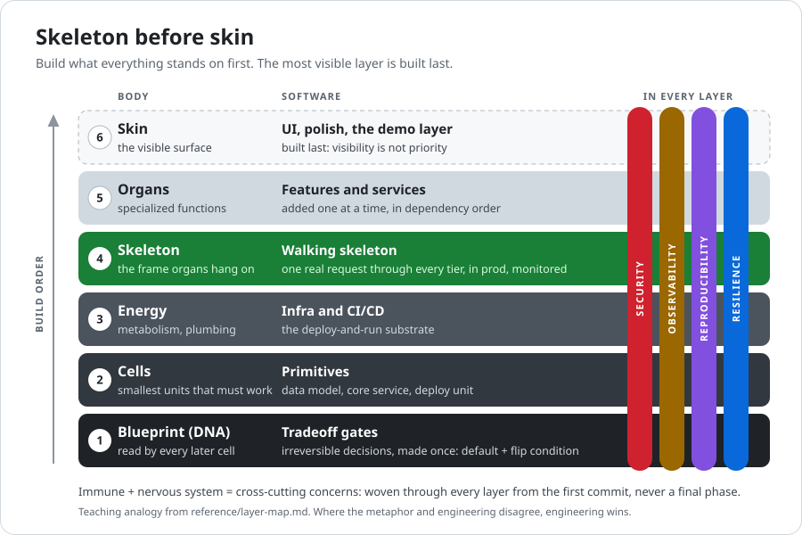

<div align="center">

# Dependency-First Architect

**Build plans ordered by what everything else depends on, not by what is most visible.**

A planning skill for Claude Code, Cursor, and Codex

[](https://github.com/NiravRVaghasiya/dependency-first-architect/actions/workflows/ci.yml)
[](LICENSE)

[Example](#what-a-plan-looks-like) · [Install](#install) · [How it works](#how-it-works) · [Evidence](#evidence) · [Limits](#limits) · [Contributing](#contributing)

</div>

---

A *skill* is a set of instructions your coding agent loads. This one is for anyone who asks a
coding agent to plan, architect, or sequence a software, infrastructure, or AI system, new or
already running.

## What it changes

Asked to plan a system, language models tend to write a tour of components. The skill pushes the
other way:

| Model-written plans tend to… | With the skill, the plan… |
|---|---|
| build the layers one at a time and wire them together at the end | starts with a **walking skeleton** (Phase 0): one real request through every tier, in production, deployed, monitored, and rolled back once |
| state tradeoffs without saying what would change them | settles hard-to-reverse decisions up front as **Tradeoff gates**: a default chosen now, the assumption behind it, and what would flip it, with effort scaled to reversibility (R1 easy to undo, R2 costly, R3 hard) |
| present guessed numbers as requirements | labels every budget and threshold **REQUIREMENT**, **BASELINE**, **ASSUMPTION**, or **UNKNOWN** |
| add security and monitoring in a final phase | puts **security, observability, reproducibility, and resilience** in every phase, from the first commit |

The assumptions a plan rests on (that something is fast, safe, correct, or cheap enough) get
numbered **validation gates** (V0, V1, …) with pass bars. Work that depends on one can be
scaffolded, but not finalized, until its gate passes; "it runs" doesn't count. For AI systems,
injection defenses, cost and latency budgets, and human approval come before new capabilities.

## What a plan looks like

> **You:** Plan a customer-support RAG chatbot over our help-center docs.

Three excerpts from a plan Opus 5.5 wrote with the skill during evaluation (verbatim; … marks
cuts; [full plan](eval/results/2026-10-03-pilot-core/generations/P1.dfa.opus-5.5.r01.md)):

| Part | Excerpt |
|---|---|
| **Tradeoff gate** | **What gets indexed**<br>*Reversibility:* R3: a non-public article shown to the public can't be unshown<br>*Default:* Index only articles the CMS marks public and published. …<br>*Assumption:* The CMS visibility flags are accurate<br>*Validated by:* V1<br>*Flip condition:* Non-public content is needed → retrieval checks the caller's permissions … |
| **Walking skeleton** | **Real request:** A staff member asks in the live help-center widget, "How do I reset my password?" The answer streams back and cites the password-reset article. …<br>**Who can reach it:** Staff only, through an SSO allow-list behind the flag. No customer traffic until V1, V2, V3 and V5 pass. |
| **Validation gate** | **V5**<br>*Hypothesis:* Answers state only what the cited passages support, and risky or unanswerable questions decline or hand off. …<br>*Acceptance threshold:* ≥ 95% of answers fully supported; 0 unsupported promises in the policy set; … (all ASSUMPTION). Head of Support and legal sign off on the policy set …<br>*Unlocks:* Customer exposure. If it fails: failing topics go snippets-only or human-only, then re-run |

Every plan has the same ten sections ([template](reference/plan-template.md)):

| Sections 1–5 | Sections 6–10 |
|---|---|
| 1. Classification and constraints | 6. Validation gates |
| 2. Dependency map | 7. Cross-cutting concerns |
| 3. Tradeoff gates | 8. AI layer (AI systems only) |
| 4. Walking skeleton (Phase 0) | 9. Methodology exceptions |
| 5. Phases | 10. Deliberately deferred |

## Install

**Claude Code**: the full skill, for all your projects (this clones the whole repository, about
90 MB on disk, mostly evaluation records). Until you ask for a plan, only the skill's ~0.5 KB
description is in context.

```bash
git clone --depth 1 https://github.com/NiravRVaghasiya/dependency-first-architect ~/.claude/skills/dependency-first-architect
```

**Cursor**: run in your project root.

```bash
mkdir -p .cursor/rules && curl -fsSL https://raw.githubusercontent.com/NiravRVaghasiya/dependency-first-architect/main/adapters/cursor-dependency-first-architect.mdc -o .cursor/rules/dependency-first-architect.mdc
```

**Codex**: run in your project root. This appends the skill (about 16 KB) to `AGENTS.md`, which
Codex reads in every session.

```bash
{ printf '\n'; curl -fsSL https://raw.githubusercontent.com/NiravRVaghasiya/dependency-first-architect/main/adapters/AGENTS.md; } >> AGENTS.md
```

To update a Codex install, first delete the old block from `AGENTS.md`, because the command
appends: from the `<!--` line above `BEGIN dependency-first-architect` through
`<!-- END dependency-first-architect -->`. Then run it again.

<details>
<summary><b>Codex: lazy install</b> (about 1 KB in <code>AGENTS.md</code>; not yet tested in Codex)</summary>

Codex reads the whole skill, reference files included, only when a request matches. Update it the
same way: delete the old block, then run both commands again.

```bash
mkdir -p .codex && curl -fsSL https://raw.githubusercontent.com/NiravRVaghasiya/dependency-first-architect/main/adapters/codex/dependency-first-architect.md -o .codex/dependency-first-architect.md
{ printf '\n'; curl -fsSL https://raw.githubusercontent.com/NiravRVaghasiya/dependency-first-architect/main/adapters/codex/AGENTS-snippet.md; } >> AGENTS.md
```

</details>

Then ask your agent to plan something. In Claude Code you can also call it by name:
`/dependency-first-architect <your request>`. Cursor and the standard Codex install get the method
without its reference files (plan template, worked examples, AI layer); the lazy Codex install
includes them.

> [!NOTE]
> These files are instructions your agent follows. To pin a version, clone with `--branch vX.Y.Z`
> or put a tag or a full commit SHA in place of `main` in the URLs, and read the diff before you
> update. See [SECURITY.md](SECURITY.md).

## How it works

Work is ordered by dependency and blast radius: what forces the most rework if it is wrong
(schema, auth model, data contracts, API shape) is decided up front and validated before the work
that depends on it, and a rollout reaches a canary, one site, or one tenant first, widening only
after its check passes.

<p align="center">
  
</p>

<p align="center"><sub>Use the picture to remember the order; plans follow <a href="SKILL.md">SKILL.md</a> (<a href="reference/layer-map.md">about the analogy</a>).</sub></p>

Plans scale to the system (a small build gets three phases or fewer), and any departure from the
method is declared as a numbered exception. The full method is in [`SKILL.md`](SKILL.md); worked
examples are in [`reference/validation.md`](reference/validation.md).

## Evidence

The numbers come from the repo's [evaluation harness](eval/README.md), built to make
overclaiming hard. CI recomputes the full results below from the committed records, and
`python eval/run.py check` re-checks them offline.

<!-- Hand-copied from the generated block below. No check compares this table or the Limits
figures with the records, so update them whenever the block changes. -->

| Question | What the runs show |
|---|---|
| Do plans follow the method? | **Yes.** Adherence +11.6 of 20 [+10.6, +12.6] over the bare model, with 92% of skill plans at the maximum. That is expected: the rubric checks what the skill asks for, not quality. |
| Do LLM judges rate them higher? | **Than the bare model's, yes:** engineering quality +8.2 of 44 [+5.3, +11.0]. **Than an independently written planning skill's, no:** slightly lower, −1.2 [−1.9, −0.5], and both judges agree on the sign. |
| Is it just longer plans? | **Partly.** Skill plans are about 2.7 times as long as the bare model's (the control's, about twice the skill's). Told to stay under 1,500 words, the skill still scored +9.6 [+7.0, +12.2], though its plans ran longer. |
| Were the judges blind? | **To labels, not to style.** The probe judge could always tell skill plans from the bare model's (leakage AUC 1.00). |
| Does the skill's plan change the code built from it? | **No measurable difference:** +0.01 [−0.05, +0.07] in hidden-test pass rate against a bare-model plan. The one outcome task is at its ceiling for this implementer, so it cannot yet separate plans ([details](eval/outcomes/README.md#what-the-first-run-showed-about-the-task-itself)). |

<sub>Skill v2.0.0, plans by Opus 5.5, 95% intervals, copied by hand from the generated tables
below. Rows 1–4: the core pilot (8 prompts × 5 runs; engineering quality judged by Sonnet 5.5 and
Fable 5, adherence and the leakage probe by Sonnet 5.5); row 3 adds a length-capped run (5 prompts
× 3 runs). Row 5: the outcome run (one coding task, 5 attempts per arm, Sonnet 5.5
implementing).</sub>

So the gain over the bare model is not shown to be specific to this method, and nothing here shows
that systems built with the skill are better.

<details>
<summary><b>Full results from every committed run</b>, and what each measure means</summary>

- **Adherence** (/20) is the skill author's own rubric. It checks what the skill asks for, so
  plans written with the skill score high by construction: it shows the method is followed,
  nothing more.
- **EQ** (engineering quality, /44) and **EQ-core** (/36, without the two dimensions that overlap
  the method) come from a rubric whose anchors and scoring rules were written by a model session
  that never saw the skill (the maintainer chose the dimension names). LLM judges score the
  *written plan*, not a built system.
- **Checklist** (0–1) is coverage of per-prompt lists of domain considerations, written the same
  blind way.
- **Words** is plan length, and **EQ per 1k tokens** is engineering quality per 1,000 visible
  tokens, a guard against "longer is better".
- **Leakage AUC** is how well a judge can tell from the text alone which plans followed a method
  (0.5 = cannot tell, 1.0 = always can). Near 1.0, judges effectively know the condition, and
  their scores may reward the method's recognizable structure.
- **Outcome columns** are the share of hidden tests passed by code an implementer built from each
  plan (or from no plan). Round 1 is the brief; round 2 adds a change request and re-runs every
  round-1 test (regression). **Rework lines** are lines added plus removed between the rounds.
- **Intervals** are 95%: t across prompts (5 to 8) for plan scores, a bootstrap over attempts for
  outcomes. They are wide, and no p-values are reported. Every judge is a Claude model. The v2
  sessions ran with the operator's Claude Code settings (the built-in Concise output style), and
  those runs' flags say so.

<!-- BEGIN GENERATED evidence: eval/dfa_eval/evidence.py -->

_Generated from the committed runs by `eval/dfa_eval/evidence.py`; `python eval/run.py check` fails if this block and the records disagree. Cells: mean difference, treatment − control, with its 95% interval (t across prompts for plans; bootstrap over attempts for outcomes)._

**[`2026-10-03-outcomes-webhook-ledger`](eval/results/2026-10-03-outcomes-webhook-ledger/OUTCOMES.md)** — task `eval/outcomes/tasks/webhook-ledger`; planner claude-opus-5-5; implementer claude-sonnet-5-5; 20 complete attempts of 20 planned.

| Treatment − control | n | Round-1 pass rate | Change-request pass rate | Regression pass rate | Rework lines |
|---|---|---|---|---|---|
| dfa-plan − baseline-plan | 5 vs 5 | +0.01 [−0.05, +0.07] | +0.00 [+0.00, +0.00] | +0.01 [−0.05, +0.07] | −12 [−38, +10] |
| baseline-plan − no-plan | 5 vs 5 | +0.09 [−0.09, +0.36] | +0.20 [+0.00, +0.60] | +0.09 [−0.09, +0.36] | +3 [−19, +24] |
| dfa-plan − no-plan | 5 vs 5 | +0.10 [−0.07, +0.38] | +0.20 [+0.00, +0.60] | +0.10 [−0.07, +0.38] | −9 [−34, +11] |
| generic-plan − baseline-plan | 5 vs 5 | +0.03 [−0.02, +0.09] | +0.00 [+0.00, +0.00] | +0.03 [−0.02, +0.07] | −9 [−30, +13] |
| dfa-plan − generic-plan | 5 vs 5 | −0.02 [−0.07, +0.03] | +0.00 [+0.00, +0.00] | −0.02 [−0.07, +0.03] | −4 [−29, +17] |

- caveats, dfa-plan − baseline-plan: n < 10 attempts per arm: descriptive only
- caveats, baseline-plan − no-plan: n < 10 attempts per arm: descriptive only
- caveats, dfa-plan − no-plan: n < 10 attempts per arm: descriptive only
- caveats, generic-plan − baseline-plan: n < 10 attempts per arm: descriptive only
- caveats, dfa-plan − generic-plan: n < 10 attempts per arm: descriptive only
- flag: planner sessions ran with output style 'Concise' and permission mode auto (15) (the operator's Claude Code settings apply under --bare)
- flag: implementer sessions ran with output style 'Concise' and permission mode acceptEdits (40) (the operator's Claude Code settings apply under --bare)
- recorded cost $16.66

**[`2026-10-03-pilot-core`](eval/results/2026-10-03-pilot-core/REPORT.md)** — config `pilot-core`; generator claude-opus-5-5 (effort high); judges claude-sonnet-5-5, claude-fable-5; 5 run(s) per cell configured.

| Treatment − control | Generator | n prompts | Plans | Adherence /20 | EQ /44 | EQ-core /36 | Checklist 0–1 | Words | EQ per 1k tokens |
|---|---|---:|---|---|---|---|---|---|---|
| dfa − baseline | opus-5.5 | 8 | 40 vs 40 | +11.6 [+10.6, +12.6] | +8.2 [+5.3, +11.0] | +6.0 [+3.7, +8.4] | +0.04 [−0.06, +0.13] | +2482 [+2001, +2964] | −7.91 [−11.17, −4.65] |
| dfa − generic-control | opus-5.5 | 8 | 40 vs 40 | +2.3 [+1.0, +3.6] | −1.2 [−1.9, −0.5] | −1.2 [−1.8, −0.7] | −0.05 [−0.07, −0.03] | −4372 [−5316, −3427] | +3.63 [+3.04, +4.22] |
| dfa − dfa-v1 | opus-5.5 | 8 | 40 vs 40 | −0.1 [−0.1, +0.0] | +1.9 [+1.2, +2.5] | +1.6 [+1.0, +2.1] | −0.02 [−0.04, −0.00] | +704 [+354, +1053] | −0.61 [−1.32, +0.10] |
| dfa-v1 − baseline | opus-5.5 | 8 | 40 vs 40 | +11.7 [+10.6, +12.7] | +6.3 [+3.8, +8.8] | +4.5 [+2.5, +6.4] | +0.06 [−0.02, +0.15] | +1778 [+1392, +2165] | −7.31 [−10.60, −4.02] |
| generic-control − baseline | opus-5.5 | 8 | 40 vs 40 | +9.3 [+7.6, +11.0] | +9.3 [+6.5, +12.2] | +7.3 [+4.9, +9.6] | +0.09 [−0.01, +0.18] | +6854 [+5685, +8023] | −11.54 [−14.73, −8.36] |

- caveats, dfa − baseline (opus-5.5): ceiling: 92% of treatment generations at max (Adherence)
- caveats, dfa − generic-control (opus-5.5): ceiling: 92% of treatment generations at max (Adherence)
- caveats, dfa − dfa-v1 (opus-5.5): ceiling: 92% of treatment generations at max (Adherence)
- caveats, dfa-v1 − baseline (opus-5.5): ceiling: 98% of treatment generations at max (Adherence)
- caveats, generic-control − baseline (opus-5.5): ceiling: 18% of treatment generations at max (Adherence); ceiling: 2% of treatment generations at max (Checklist)
- flag: generation sessions ran with output style 'Concise' (160 plans) (the operator's Claude Code settings apply under --bare)
- EQ by judge, dfa − baseline (opus-5.5): fable-5 +6.2 [+3.1, +9.3]; sonnet-5.5 +10.1 [+7.4, +12.8]
- EQ by judge, dfa − generic-control (opus-5.5): fable-5 −0.9 [−1.4, −0.4]; sonnet-5.5 −1.5 [−2.7, −0.2]
- EQ by judge, dfa − dfa-v1 (opus-5.5): fable-5 +1.0 [+0.4, +1.6]; sonnet-5.5 +2.7 [+1.7, +3.7]
- EQ by judge, dfa-v1 − baseline (opus-5.5): fable-5 +5.2 [+2.5, +7.9]; sonnet-5.5 +7.4 [+4.9, +10.0]
- EQ by judge, generic-control − baseline (opus-5.5): fable-5 +7.1 [+4.1, +10.1]; sonnet-5.5 +11.6 [+8.6, +14.6]
- leakage-probe AUC (judge sonnet-5.5, opus-5.5 plans): dfa vs baseline 1.00, dfa vs generic-control 0.99, dfa vs dfa-v1 0.83, dfa-v1 vs baseline 1.00, generic-control vs baseline 1.00
- judge agreement on engineering-quality-v1 (Krippendorff α, 2 coders): 0.12; rank agreement (Spearman) 0.83, with fable-5#1 scoring +6.9 points relative to sonnet-5.5#1
- recorded cost $199.16

**[`2026-10-03-pilot-length`](eval/results/2026-10-03-pilot-length/REPORT.md)** — config `pilot-length`; generator claude-opus-5-5 (effort high); judges claude-sonnet-5-5; 3 run(s) per cell configured.

| Treatment − control | Generator | n prompts | Plans | Adherence /20 | EQ /44 | EQ-core /36 | Checklist 0–1 | Words | EQ per 1k tokens |
|---|---|---:|---|---|---|---|---|---|---|
| dfa-capped − baseline-capped | opus-5.5 | 5 | 15 vs 15 | +11.2 [+9.6, +12.8] | +9.6 [+7.0, +12.2] | +6.3 [+4.1, +8.5] | −0.03 [−0.13, +0.06] | +429 [+117, +741] | +2.08 [−0.18, +4.33] |

- caveats, dfa-capped − baseline-capped (opus-5.5): ceiling: 67% of treatment generations at max (Adherence)
- flag: generation sessions ran with output style 'Concise' (30 plans) (the operator's Claude Code settings apply under --bare)
- leakage-probe AUC (judge sonnet-5.5, opus-5.5 plans): dfa-capped vs baseline-capped 1.00
- recorded cost $7.45

**[`2026-10-03-pilot-models`](eval/results/2026-10-03-pilot-models/REPORT.md)** — config `pilot-models`; generator claude-sonnet-5-5 (effort high), claude-haiku-4-5-20251001 (effort default); judges claude-sonnet-5-5; 3 run(s) per cell configured.

| Treatment − control | Generator | n prompts | Plans | Adherence /20 | EQ /44 | EQ-core /36 | Checklist 0–1 | Words | EQ per 1k tokens |
|---|---|---:|---|---|---|---|---|---|---|
| dfa − baseline | sonnet-5.5 | 5 | 15 vs 15 | +11.7 [+10.2, +13.3] | +10.9 [+6.3, +15.4] | +7.8 [+3.7, +11.9] | +0.05 [−0.11, +0.21] | +1936 [+1300, +2572] | −7.60 [−13.63, −1.57] |
| dfa − baseline | haiku-4.5 | 5 | 15 vs 15 | +13.8 [+10.1, +17.5] | +14.1 [+6.9, +21.4] | +10.1 [+3.5, +16.7] | +0.17 [−0.02, +0.36] | +5046 [+3298, +6794] | −5.06 [−13.86, +3.74] |

- caveats, dfa − baseline (sonnet-5.5): ceiling: 93% of treatment generations at max (Adherence); judge model also generated these plans (Adherence, EQ, EQ-core, Checklist, EQ per 1k tokens)
- caveats, dfa − baseline (haiku-4.5): ceiling: 13% of treatment generations at max (Adherence)
- flag: condition dfa, generator haiku-4.5: 14 of 15 plans could not read the skill's files (all 35 reads of them failed), so they follow SKILL.md alone, not the skill as shipped
- flag: generation sessions ran with output style 'Concise' (60 plans) (the operator's Claude Code settings apply under --bare)
- flag: generation sessions ran in different permission modes: auto (sonnet-5.5 30); default (haiku-4.5 30)
- flag: judge sonnet-5.5 uses the generator's model claude-sonnet-5-5 (generator sonnet-5.5): it judged plans its own model wrote
- leakage-probe AUC (judge sonnet-5.5, sonnet-5.5 plans): dfa vs baseline 1.00
- leakage-probe AUC (judge sonnet-5.5, haiku-4.5 plans): dfa vs baseline 1.00
- recorded cost $11.45

**[`2026-10-03-pilot-models-haiku`](eval/results/2026-10-03-pilot-models-haiku/REPORT.md)** — config `pilot-models-haiku`; generator claude-haiku-4-5-20251001 (effort default); judges claude-sonnet-5-5; 3 run(s) per cell configured.

| Treatment − control | Generator | n prompts | Plans | Adherence /20 | EQ /44 | EQ-core /36 | Checklist 0–1 | Words | EQ per 1k tokens |
|---|---|---:|---|---|---|---|---|---|---|
| dfa − baseline | haiku-4.5 | 5 | 15 vs 15 | +14.5 [+11.9, +17.0] | +14.9 [+7.6, +22.3] | +10.7 [+4.0, +17.3] | +0.25 [+0.04, +0.46] | +3970 [+1839, +6102] | −3.19 [−10.40, +4.02] |

- caveats, dfa − baseline (haiku-4.5): ceiling: 7% of treatment generations at max (Adherence)
- flag: generation sessions ran with output style 'Concise' (30 plans) (the operator's Claude Code settings apply under --bare)
- leakage-probe AUC (judge sonnet-5.5, haiku-4.5 plans): dfa vs baseline 1.00
- recorded cost $5.27

**[`2026-10-03-v1-examples-rejudge`](eval/results/2026-10-03-v1-examples-rejudge/REPORT.md)** — config `v1-examples-rejudge`; generator claude-opus-5-5 (effort max); judges claude-sonnet-5-5, claude-fable-5; 1 run(s) per cell configured.

| Treatment − control | Generator | n prompts | Plans | Adherence /20 | EQ /44 | EQ-core /36 | Checklist 0–1 | Words | EQ per 1k tokens |
|---|---|---:|---|---|---|---|---|---|---|
| dfa-v1 − baseline | opus-5.5-max | 5 | 5 vs 5 | +8.4 [+4.4, +12.4] | +3.4 [+0.9, +5.9] | +2.5 [+0.2, +4.8] | +0.07 [−0.05, +0.19] | +2675 [+1186, +4164] | −8.05 [−18.46, +2.35] |

- caveats, dfa-v1 − baseline (opus-5.5-max): ceiling: 100% of treatment generations at max (Adherence); no variation within prompts: g undefined (Adherence, EQ, EQ-core, Checklist, Words, EQ per 1k tokens); ceiling: 20% of treatment generations at max (Checklist)
- flag: manifest note: Imported, not generated: the plans in examples/ as committed, verified against the SHA-256 recorded in examples/scoring/generation.json at generation time (2026-10-02, model claude-opus-5-5, effort max, skill commit 3ba6b70). Tokens, cost and latency were not recorded in v1.
- flag: small n: 1 run(s) per cell (< 3)
- EQ by judge, dfa-v1 − baseline (opus-5.5-max): fable-5 +2.2 [−0.0, +4.4]; sonnet-5.5 +4.6 [+0.6, +8.6]
- leakage-probe AUC (judge sonnet-5.5, opus-5.5-max plans): dfa-v1 vs baseline 1.00
- judge agreement on engineering-quality-v1 (Krippendorff α, 2 coders): −0.34; rank agreement (Spearman) 0.71, with fable-5#1 scoring +7.2 points relative to sonnet-5.5#1
- recorded cost $7.38
<!-- END GENERATED evidence -->

Protocol, interpretation, and limitations: [eval/README.md](eval/README.md). Per-agent status:
[evaluation matrix](docs/evaluation-matrix.md). Run reports: [eval/results/](eval/results/README.md).

The v1.0.0 pilot, kept as published ([plans and scorecard](examples/README.md)). Its judges,
baseline and self-scoring differ from v2's, so compare the versions through the `dfa − dfa-v1`
row above (+1.9 EQ [+1.2, +2.5]):

<!-- BEGIN GENERATED score callout: examples/scoring/tally.py -->
> **v1.0.0, methodology adherence.** In Claude Code (same model, the 5 fixed prompts in [`reference/evals.md`](reference/evals.md), one run per arm, 3 judges on the same model, blind to the arm), plans scored **12.8/20 without the skill and 20.0/20 with it (+7.2)** on the skill's own rubric. On a deliberately skill-unfavorable reading (every dispute from an adversarial audit accepted, and the D9 rubric artifact removed), the difference is still **+5.6**. That rubric checks what the skill asks for, and v1's plans self-scored against it before answering, so this shows the method is followed, not that the plans are better engineering. [Scorecard, method and raw scores →](examples/SCORECARD.md)
<!-- END GENERATED -->

</details>

## Limits

- **It shapes how a model plans, not what it knows.** The model still supplies the domain
  knowledge and can be wrong about technologies, limits, and costs.
- **Gates name checks; they don't run them.** Someone still has to.
- **Behavior varies by model.** With the skill, Haiku 4.5 wrote plans of about 5,300 words (Opus
  5.5 on the same five prompts: about 4,100), and 13 of its 15 plans included the skill's internal
  checklist, which is meant to stay out of the plan.
- **Cursor and Codex are supported, not evaluated.** Their adapters are generated and checked, but
  no committed run has used them.
- **Not yet validated:** [production outcomes](eval/outcomes/README.md#what-it-does-not-measure),
  each rule on its own (no experiment removes one at a time), judges outside the Claude family,
  expert review of the rubrics, and requests that come with a real codebase. See
  [Limitations](eval/README.md#limitations).

## Contributing

**`SKILL.md` is the single source of truth.** Change the method in `SKILL.md` or `reference/`,
run `python build.py`, and commit what it regenerates. Never edit `adapters/` by hand; CI fails on
drift.

```bash
python build.py --check                # adapters and SHA256SUMS match SKILL.md
python -m unittest discover -s tests   # offline self-tests, no model calls
python eval/run.py check               # committed runs, reports, matrix, and this README's evidence block
```

To try the benchmark against real models, start with the smoke config, a setup check that stops
at a \$10 cost cap (its last run cost \$1.78). Real runs need the `claude` CLI or an
OpenAI-compatible endpoint; see [eval/README.md](eval/README.md).

```bash
python eval/run.py plan --config eval/experiments/smoke.json                                 # dry run: the calls it would make
python eval/run.py all  --config eval/experiments/smoke.json --run eval/results/<new-run-id>   # real model calls
```

Setup, rules, and adding adapters, prompts, or outcome tasks are in
[CONTRIBUTING.md](CONTRIBUTING.md); changes are in [CHANGELOG.md](CHANGELOG.md).

## License

[MIT](LICENSE)
