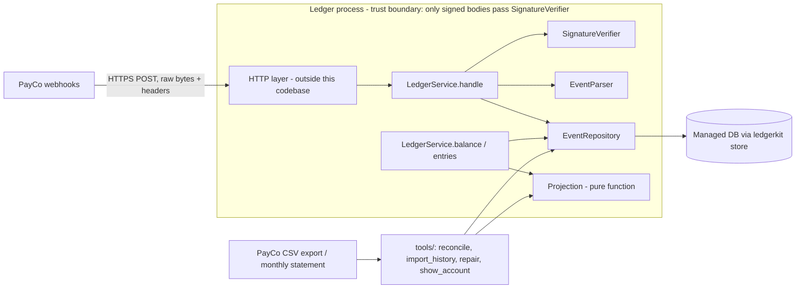

# Ledger: Architecture and Build Plan

## 1. Summary

- **What:** Ledger is a small Python service (standard library only) that turns PayCo webhooks into per-account balances. It replaces the nightly CSV-to-spreadsheet process, so support staff no longer fix balances by hand and Finance can reconcile to the minor unit.
- **Shape:** One Python package inside one deployable unit. Every authenticated PayCo event is stored once, unchanged, in an **event log** keyed by event `id`. `balance()` and `entries()` are not stored as running totals. A pure **projection** function recomputes them from the account's stored events every time they are read.
- **Key decisions:**
  1. **No mutable balance counter.** Each event needs two idempotent single-key writes, and a duplicate delivery re-runs them. So a failure partway through a request, a redelivery, or delivery out of order cannot double-count or lose money (D1).
  2. **A refund that arrives before its payment is held as pending.** It counts toward the balance only once the matching payment is present and the amount and currency match (D2).
  3. **Check the signature before parsing anything.** Then check the event `id` against the log. If the id matches but the body differs, return `409`, raise a security incident, and make no writes to the account (D4, D5).
  4. **Only answer 2xx once the event is safely stored.** Every rejection or store failure returns a non-2xx code so PayCo retries. Unknown event types are stored and acknowledged so they can be backfilled later (D3, D6).
  5. **Anomalies are held, acknowledged with 2xx, and raise an alert.** This covers a payment in a different currency from the account, a second payment with the same `payment_id` but a different amount, and a refund whose amount doesn't match its payment (D7).
- **First milestone:** The service passes a fault-injection test that delivers 1,000 randomised event histories shuffled, duplicated, and with `StoreError` failures, and every balance comes out exact. Forged, stale, and conflicting deliveries are rejected. One PayCo sandbox payment reaches a balance through the real HTTP layer in staging.
- **Top risks:** (a) The store's API is unknown. The brief points to README.md, but the README in the workspace is empty. (b) We don't know whether PayCo re-signs each retry with a fresh `t`. If it doesn't, any delivery delayed more than 300 s is rejected forever. (c) Refunds of payments made before go-live will stay pending unless we import historical payments with their `payment_id`s.

## 2. Context and Goals

- **Problem:** Balances come from a nightly copy of PayCo's CSV export into a spreadsheet, plus manual fixes. They are up to a day stale, mistakes are easy, and there is no audit trail.
- **Goals:**
  - Every account's balance reflects every successful PayCo payment and refund within seconds of delivery.
  - Balances match PayCo's monthly statement exactly. Any difference is explained by a listed held or pending event.
  - Forged, replayed, or tampered deliveries never change a balance.
- **Non-goals:**
  - Credit consumption (spend). This plan assumes spend is tracked elsewhere (A6).
  - Manual adjustments.
  - Handling disputes, payouts, or other new event types, beyond storing them.
  - The HTTP server, deployment, and monitoring stack. They are covered here only as integration requirements.
  - Multi-region deployment.
- **Success measures:**
  - Zero unexplained differences against PayCo's daily export for 14 consecutive days before cutover.
  - Zero unexplained differences against the first monthly statement after cutover.
  - The nightly script is retired.
  - Support hand-fixes fall to zero. The only remaining human work is held events, which arrive as alerts.

## 3. Drivers, Requirements, and Constraints

**Ranked quality attributes**

| # | Attribute | Measurable target | Why |
|---|---|---|---|
| 1 | Correctness / integrity | 0 double-applied or lost movements across 1,000 seeded fault-injection scenarios in CI (10,000 nightly). 0 unexplained differences in reconciliation. | Finance must match PayCo exactly. Partial failures, duplicates, and reordering all happen. |
| 2 | Security | 100% of forged, stale, or tampered test vectors rejected. An id with a different body leaves the account unchanged and raises an incident. | This is money. The brief makes the id-conflict case an explicit incident. |
| 3 | No lost deliveries | Never return 2xx before the event is safely stored. Restore service within 24 h of an outage (A3). | PayCo's 72 h retry is our safety net only if we answer non-2xx whenever we are unsure. |
| 4 | Evolvability | A new event type (e.g. dispute) needs one validator, one projection rule, and tests, in ≤ 2 days. It is backfilled from stored raw events. | PayCo adds types, and the brief says we will handle them later. |
| 5 | Latency / throughput | p99 `handle()` < 500 ms. Handles 10 req/s sustained without design change (A4). | Load is about 0.05 req/s today. This target matters least. |

Ranking rule: **correctness beats availability.** When in doubt, answer non-2xx and let PayCo retry, rather than accept something we aren't sure we stored.

**Key functional requirements**
- `handle()` verifies the signature, removes duplicates, detects conflicts, applies `payment.succeeded` and `refund.succeeded`, and stores but ignores other types.
- `balance()` and `entries()` follow the brief's interface.
- An account's currency is fixed by its first payment.

**Constraints**
- Python, standard library only.
- The store is a `ledgerkit` `MemoryStore` client for a managed network database, and it raises `StoreError` on partial failures.
- The `LedgerService(store, secret, clock)` interface is fixed.

**Hard parts**
1. **Writes that fail partway through.** A `StoreError` can leave some writes done and others not, and the outcome of a failed write may be unknown. Any read-modify-write counter will double-count on retry.
2. **Duplicates, including after a 2xx, and id conflicts.** These need a global per-id record and a clear definition of "same body".
3. **Out-of-order refunds.** A refund can arrive before its payment. A wrong policy gives either temporary wrong balances or refunds that never get applied.
4. **The signature and replay window versus PayCo's retries.** Whether retries are re-signed decides whether a short outage loses events.
5. **Unknown store API.** Whether `put_if_absent`, transactions, and prefix scans exist decides whether we can run more than one worker.
6. **Cutover.** Payments made before go-live are needed to pair refunds and to give correct opening balances.

## 4. Current State

- The workspace (`w7959a57f/`) contains only `README.md`, which says: *"This directory is intentionally empty… There is no existing code, documentation, configuration, or data here to inspect."*
- **The brief says `ledgerkit MemoryStore` is described in README.md, but it is not.** Its methods, its transaction support, and the meaning of `StoreError` are therefore unknown. Spike S1 resolves this. Until then the plan depends only on the minimal primitives listed in §7.3.
- Today's process is a nightly script plus a spreadsheet plus manual fixes. It stays running in parallel until cutover (§15).
- We set the conventions because none exist:
  - Python ≥ 3.11 (A1).
  - `unittest` for tests, with `python -m unittest discover -s tests`.
  - `logging` for structured JSON-line logs.
  - Package `ledger/`, tests in `tests/`, operational scripts in `tools/`.

## 5. Assumptions and Open Questions

**Assumptions**

| # | Assumption | Impact if wrong | How / when validated |
|---|---|---|---|
| A1 | Python ≥ 3.11 is available, and `ledgerkit` can be installed in dev, CI, and prod. | Small: adjust syntax and packaging. | M1 T1 |
| A2 | The production DB client has the same API as `MemoryStore`. A single-key write is atomic. A write that raises `StoreError` may or may not have persisted. | If single-key writes aren't atomic, records can be torn and the design needs a checksum per record. | S1 (M1 T1) |
| A3 | PayCo signs each delivery attempt with a fresh `t`. | **High.** Every delivery delayed more than 300 s would fail permanently, so any outage over 5 minutes loses events. | S2 (M1 T2): force one 503 in the sandbox and inspect the retry. |
| A4 | PayCo's response timeout is ≥ 5 s. Peak load is ≤ 10× average. | Small at this volume. | S2 |
| A5 | PayCo sends one `payment.succeeded` per `payment_id` and at most one full `refund.succeeded` per payment. | The rule "credit once per payment_id" (§7.4) would hold legitimate events. | S2, plus reconciliation in M3 |
| A6 | `balance` means net funded credit (payments minus refunds). Spend is recorded elsewhere. | If Ledger must also record spend, it needs a new write API and ordering rules. Scope grows. | Open question Q3 |
| A7 | PayCo's CSV export includes `payment_id`, account, amount, currency, and created time for historical payments. | Refunds of pre-go-live payments can't be paired and stay pending. | M2, before M3 |
| A8 | Webhook bodies contain no card data or personal data beyond ids and amounts. | Storing raw bodies would then need tighter access control and a retention policy. | S2 |
| A9 | Financial records must be kept for 10 years. | Retention setting only. | Finance, before M3 |
| A10 | One engineer builds this, and the HTTP/infra owner gives about 2 days to wire up staging. | Sizes in §12 change. | Kickoff |

**Open questions**

| Q | Owner | Default if no answer | Needed by |
|---|---|---|---|
| Q1: What is the `ledgerkit` API: `put_if_absent` or compare-and-set, transactions, prefix scan, `StoreError` semantics? | Store/platform owner | Single worker with an in-process lock (D8) | M1 day 1 |
| Q2: Does PayCo re-sign retries, and do redeliveries have byte-identical bodies? | PayCo integration contact | Assume yes, and verify in the sandbox | M1 end |
| Q3: Is Ledger's balance net top-ups only, and where do spend and manual adjustments live? | Product / Finance | Net top-ups only. Adjustments deferred. | M2 start |
| Q4: Is "hold, acknowledge 2xx, alert" acceptable to Finance for currency mismatches and conflicting duplicate payments? | Finance | Yes | M2 |
| Q5: Are refunds that arrive before their payment acceptable as pending (balance unchanged until the payment arrives)? | Finance | Yes | M2 |

## 6. Architecture Overview



`handle()` works in this order:
1. Normalise the header names.
2. Verify the signature against the exact bytes.
3. Parse the envelope.
4. Check the event id against the log.
5. Validate the typed payload.
6. Write the event record (put-if-absent), then the account entry (idempotent).

Reads go through the projection, which turns the account's stored entries into a balance and an ordered list of entries. Nothing other than the event log and the account entries is written. Balances can't drift, because they are recomputed every time.

| Component | Responsibility | Owns data | Interface | Tech | Depends on |
|---|---|---|---|---|---|
| `LedgerService` (`ledger/service.py`) | Orchestrates `handle` / `balance` / `entries` and maps outcomes to status codes | none | Public API from the brief (sync, in-process) | stdlib | all below |
| `SignatureVerifier` (`ledger/signature.py`) | Parses `PayCo-Signature`, checks the HMAC and the ±300 s window | none | `verify(header, body, secrets, now) -> Result` | `hmac`, `hashlib` | clock |
| `EventParser` (`ledger/events.py`) | Strict JSON parse, envelope and typed validation, canonical digest | none | `parse_envelope`, `validate`, `canonical_digest` | `json` | none |
| `EventRepository` (`ledger/repository.py`) | The only component that writes to the store. Key layout, idempotent writes, internal retry. | `evt:*`, `acct:*`, `incident:*` | `get_event`, `insert_event`, `ensure_account_entry`, `account_entries`, `iter_events` | ledgerkit store | store |
| `Projection` (`ledger/projection.py`) | Pure fold from an account's entries to an `AccountView` (entries, balance, pending, held) | none | `project(list) -> AccountView` | stdlib | none |
| Ops tools (`tools/`) | Reconcile against the PayCo export, import history, repair sweep, inspect an account | none (they write only through `EventRepository`) | CLI | stdlib | repo, projection |

## 7. Component Details

### 7.1 SignatureVerifier
- **Steps:**
  1. Split the header on `,` into `k=v` pairs. Require exactly one `t` made of digits only.
  2. Collect every `v1` value. More than one is allowed, which supports secret rotation. Ignore other schemes.
  3. Compute `HMAC-SHA256(secret, t_str.encode() + b"." + raw_body)`, using the exact `t` string from the header.
  4. Compare with `hmac.compare_digest` against each `v1`, after lowercasing it. Try each configured secret.
  5. Reject if `abs(now - int(t)) > 300`. Exactly 300 s is accepted.
- **Out of scope:** it never looks inside the body.
- **Results:** `missing_signature`, `malformed_signature`, `bad_signature`, `stale_timestamp`. All of these map to `401`.

### 7.2 EventParser
- **Parsing:** `json.loads` with `parse_constant` set to reject `NaN` and `Infinity`. The top level must be an object.
- **Envelope:** `id` is a non-empty string, `type` is a non-empty string, `created` is an integer, and `data` is an object.
- **Typed checks for payment and refund:**
  - `account_id` and `payment_id` are non-empty strings.
  - `amount` is an `int`, not a `bool`, and greater than 0.
  - `currency` matches `^[A-Z]{3}$`.
- **Unknown types:** only the envelope is validated.
- **`canonical_digest`:** `sha256(json.dumps(obj, sort_keys=True, separators=(",",":")).encode())`. Two bodies are "the same body" if their digests are equal (D4).

### 7.3 EventRepository: the only writer
- **Store primitives required:**
  - `get`
  - `put`
  - `put_if_absent`. If the store doesn't provide it, emulate it as get-then-put under a process lock and accept the single-worker limit (D8).
  - Listing by account. If the store has no prefix scan, keep an index key per account, updated under the same lock.
- **Internal retry:** each store call is retried up to 3 times on `StoreError`, with 50 ms then 200 ms backoff. This is safe because every write is idempotent. After the third failure it raises to the service.
- **Methods:**
  - `insert_event(record)`: returns the record that is now stored, which may be an earlier one if another write got there first.
  - `ensure_account_entry(record)`: writes `acct:{account_id}:evt:{event_id}` with fields taken from the record. Writing it again with the same value does nothing. It is skipped for unhandled types.

### 7.4 Projection: the business rules, as a pure function
Input: an account's handled entries. Output: `AccountView(entries, balance, pending, held)`. The result depends only on which events are present, not on the order they arrived. That is why duplicates and reordering can't change balances.

1. Sort by `(created, event_id)`.
2. **Account currency** is the currency of the first payment in that order.
3. **For each payment:**
   - If its currency differs from the account currency: held, `currency_mismatch`.
   - If the `payment_id` was already credited with the same amount and currency: merged and not counted again. This covers PayCo duplicates under a new id and overlaps with imported history.
   - If the `payment_id` was already credited with a different amount or currency: held, `payment_id_conflict`.
   - Otherwise: an entry of `+amount`.
4. **For each refund:**
   - If no credited payment with that `payment_id` exists in this account: **pending**.
   - If the amount or currency differs from the payment's: held, `refund_mismatch`.
   - If this payment was already refunded: merged if identical, otherwise held.
   - Otherwise: an entry of `−amount`, sorted at `max(refund.created, payment.created)`.
5. `balance = sum(entry.amount)`, all in integer arithmetic.

An account we have never seen gives `balance = 0` and `entries = []`.

**Accepted edge case:** the account currency is decided by `created` order. If two payments in different currencies arrive within PayCo's 72 h window in reverse order, the currency could flip. Both cases already raise a `currency_mismatch` alert for a human to resolve.

### 7.5 LedgerService.handle

```python
h = {k.lower(): v for k, v in headers.items()}
if len(raw_body) > 64 * 1024: return 413, {"error": "body_too_large"}
r = verify(h.get("payco-signature"), raw_body, secrets, clock.now())
if not r.ok: log(r.reason); return 401, {"error": r.reason}
try: env = parse_envelope(raw_body)
except Invalid as e: return 400, {"error": "invalid_payload", "detail": str(e)}
digest = canonical_digest(env.obj)
try:
    existing = repo.get_event(env.id)
    if existing:
        if existing.digest != digest: return incident(env, existing)      # 409
        repo.ensure_account_entry(existing)                               # repair partial earlier attempt
        return 200, {"status": "duplicate", "event_id": env.id}
    try: ev = validate(env)
    except Invalid as e: return 400, {"error": "invalid_payload", "detail": str(e)}
    stored = repo.insert_event(record(ev, digest, raw_body, clock.now()))
    if stored.digest != digest: return incident(env, stored)              # lost a race to a conflicting body
    repo.ensure_account_entry(stored)
except StoreError:
    return 503, {"error": "store_unavailable"}
return 200, {"status": outcome(ev), "event_id": env.id}
# outcome() is best-effort: applied | pending | held | ignored; it falls back to "accepted" if the read fails.
```

- Unexpected exceptions are caught and return `500`, so PayCo retries.
- `incident()` logs at ERROR with both digests and a `security_incident` flag. It then writes `incident:{id}:{digest}` on a best-effort basis and returns `409 {"error": "event_id_conflict"}`. Nothing is written for the account.
- `balance()` and `entries()` call `project(repo.account_entries(id))`. They raise `StoreError` to the caller after the internal retries are used up.
- **Additions to the interface** (they don't break the brief's contract): `pending(account_id)` and `held(account_id)`, for ops.

**Failure and recovery:** every step before a 2xx either writes nothing or is idempotent, and a duplicate delivery re-runs the idempotent steps. As long as PayCo keeps retrying, a partial failure always completes. `tools/repair.py` covers the last gap: it finds `evt:*` records without an `acct:*` entry.

**Scaling:** fine on one worker up to at least 10 req/s. Running several workers needs a real `put_if_absent` (D8).

## 8. Data Design

| Record | Key | Fields | Written by | Mutability |
|---|---|---|---|---|
| EventRecord | `evt:{event_id}` | `event_id`, `type`, `digest`, `raw_body` (UTF-8 text), `account_id?`, `created`, `received_at`, `schema_version=1` | `EventRepository.insert_event` | Write-once |
| AccountEntry | `acct:{account_id}:evt:{event_id}` | `event_id`, `type`, `payment_id`, `amount` (unsigned, as received), `currency`, `created`, `schema_version` | `ensure_account_entry` | Write-once (identical rewrites allowed) |
| Incident | `incident:{event_id}:{digest}` | `received_at`, `existing_digest`, `raw_body` | `incident()` | Append-only, best-effort |

- **System of record:** PayCo is the source of truth for money movements. Ledger's event log is our copy of it, and it can be rebuilt from PayCo's export with `tools/import_history.py`. Balances and entries are derived data and are never stored.
- **Consistency:**
  - Atomicity is only needed for a single-key write.
  - `put_if_absent` on `evt:` is the one conditional write, and it prevents conflicting bodies from racing each other.
  - No multi-key transaction is needed. If S1 finds one, we use it for the two writes, but correctness doesn't depend on it.
- **Access patterns:**
  - Get by event id (dedup).
  - List by account prefix (`balance` and `entries`).
  - Full scan for reconciliation and backfill.
  - At about 3,000 events a day, the store grows by roughly 6 MB a day, or 2 GB a year. No partitioning is needed.
- **Retention and backup:**
  - Keep the event log for 10 years (A9).
  - Use the managed DB's backups. Restore is tested once in M3.
  - The fallback for total loss is to re-import from PayCo's export.
- **Classification:** account ids, payment ids, and amounts are confidential financial data. Raw bodies are stored for audit and backfill. If S2 shows that PayCo bodies carry personal data, restrict read access to the store and stop logging bodies; we never log them anyway.
- **Schema evolution:**
  - Each record carries a `schema_version`. Changes are additive fields only.
  - New event types are added in three steps: a validator in `events.py`, a rule in `projection.py`, and a backfill. Because `raw_body` is stored, the backfill re-reads the existing `evt:` records of that type and creates `acct:` entries.
  - Any change to the projection is gated by `tools/reconcile.py --diff-projection`. It recomputes every balance with the old and the new code and lists the differences for Finance to approve.

## 9. Key Flows

**F1: Payment, happy path.**
1. PayCo POSTs the event. The signature is valid and `t` is within 300 s.
2. The envelope parses, and `get_event` finds nothing.
3. Typed validation passes.
4. `insert_event` and then `ensure_account_entry` succeed.
5. The service returns `200 {"status": "applied"}`. `balance("acct_42")` now returns `+2500`.

**F2: Refund before its payment.**
1. The `refund.succeeded` for `pay_9xk` is stored and indexed. The projection finds no credited `pay_9xk`, so the refund is pending. The service returns `200 {"status": "pending"}` and the balance is unchanged.
2. Later the `payment.succeeded` for `pay_9xk` arrives and is stored. The projection now pairs the two: `+2500` then `−2500`, giving a balance of 0.
3. If the payment never arrives (for example, a payment from before go-live that wasn't imported), the alert for a refund pending more than 24 h fires. The runbook says: import the missing payment from the PayCo export.

**F3: Write fails partway through, then PayCo retries** (the main failure path).
1. `insert_event` succeeds. `ensure_account_entry` raises `StoreError` 3 times.
2. The service returns `503`. The balance doesn't yet include the event, and nothing has been counted twice.
3. PayCo retries a few minutes later, with a fresh `t` (A3).
4. `get_event` finds the record, and the digest is equal. `ensure_account_entry` succeeds and the service returns `200 duplicate`. The event is now applied exactly once.
5. A variant: `insert_event` raised but actually wrote the record. The same steps apply, because the retry sees the record.

**F4: Same id, different body.**
1. The signature is valid and `get_event` finds `evt_1Nq3xKp`, but the digest differs.
2. The service logs a `security_incident`, writes an `incident:` record, and returns `409`. No account entry is written.
3. PayCo may retry for up to 72 h. Each retry gets `409` again, and the alert deduplicates on event id.
4. Because the body was correctly signed, the cause is either a PayCo bug or a leaked secret. The runbook starts with rotating the secret.

**F5: Unknown type** (`dispute.created`). The event record is stored, no account entry is written, and the service returns `200 {"status": "ignored"}`. It is available for backfill later.

## 10. Key Decisions

| # | Decision | Options considered | Rationale (drivers) | Reversibility | Revisit if |
|---|---|---|---|---|---|
| D1 | Immutable event log, with balance recomputed from it on every read | (a) Mutable balance counter plus processed-marker. (b) A per-account document updated with compare-and-set. (c) **Event log plus projection.** | (a) Double-counts when the increment succeeds but the marker fails, and loses updates under concurrency. Driver 1. (b) Needs compare-and-set, which we may not have, and still needs care on retry. (c) Needs only single-key idempotent writes, ignores arrival order, can be rebuilt from PayCo, and can be audited. | **Hard** (data model) | p95 `balance()` > 50 ms or an account has > 5,000 events: add a snapshot that can be recomputed (§17). |
| D2 | A refund without its payment is held as pending | (a) Apply it at once and let the balance go negative. (b) Answer 5xx so PayCo retries later. (c) **Pend until paired.** | (c) lets us check the amount and currency against the real payment and never shows wrong history. (b) depends on retry timing and loses the refund after 72 h. (a) applies refunds we haven't checked. | Easy (projection rule, recomputed) | Finance wants refunds shown immediately (Q5). |
| D3 | Return 2xx only after the event is safely stored. 401 for signature problems, 400 for invalid payloads, 409 for conflicts, 503 for `StoreError`, 500 for bugs. | Answer 2xx to everything and sort it out internally, versus **answer non-2xx whenever unsure** | PayCo's retry only protects us if we use it. Driver 3. | Medium (PayCo-facing behaviour) | PayCo's dashboard or alerting is too noisy from 4xx retries. |
| D4 | "Same body" means the same canonical-JSON SHA-256 | Raw-byte equality versus **canonical JSON** | Avoids false incidents if PayCo reserialises a redelivery. Any difference in meaning is still caught. | Easy | S2 shows redeliveries are byte-identical. We could then tighten to raw bytes, but there's no need. |
| D5 | Verify the signature before parsing. Unauthenticated bodies are never stored or compared. | Parse first for better error messages, versus **verify first** | Smallest attack surface. A conflict incident then always means a signed body, which is a meaningful signal. | Easy | none |
| D6 | Store unknown types and answer 200 | Answer 4xx (PayCo retries for 72 h, then drops) or answer 200 and discard, versus **store and answer 200** | Lets us backfill without asking PayCo to resend. Driver 4. | Easy | Unknown types turn out to be high-volume and costly to store. |
| D7 | Anomalies are held with a 2xx and an alert | Reject with 4xx versus **hold** | Rejecting is deterministic, so retrying achieves nothing. Holding keeps the evidence, leaves the balance untouched, and gives a named reason in reconciliation. | Easy | Finance objects (Q4). |
| D8 | Run one worker, with an in-process lock if the store has no `put_if_absent` | Multiple workers from the start versus **one worker** | 0.05 req/s today. Concurrency safety needs conditional writes we haven't confirmed. | Easy | S1 confirms `put_if_absent`, or load passes 10 req/s. |
| D9 | `entries()` are ordered by `created`, then `event_id`, with a refund never placed before its payment | Order of arrival versus **created order** | Deterministic and matches PayCo's statement order. Arrival order is arbitrary. | Easy | Product needs arrival order. |

## 11. Cross-Cutting Concerns

**Security** (built in M1; rotation in M2)

| Threat | Mitigation |
|---|---|
| Forged deliveries | HMAC check with `compare_digest` before any parsing |
| Replay of a captured request | Reject `t` outside ±300 s. Within that window, a replay is a harmless duplicate. |
| Same-id body substitution, or a leaked secret | `409`, incident record, page. Runbook: rotate the secret. |
| Oversized or malicious JSON | 64 KiB limit, strict parser, `bool` rejected for `amount`, `NaN` rejected |
| Leaked secret | Kept in the platform's secret manager and passed in as bytes. Never logged. In M2 the service accepts a list of secrets so it can be rotated without downtime. |

**HTTP-layer requirement:** pass the **raw request bytes** untouched. A framework that parses and re-serialises the JSON breaks every signature. The staging slice in M1 checks this.

**Reliability:**
- Idempotent writes, plus repair on every duplicate delivery.
- Internal retry: 3 attempts in under 1 s.
- The repair sweep (`tools/repair.py`, M2).
- The 72 h PayCo retry window sets the recovery budget: restore service within 24 h. Out-of-hours paging is only needed for security alerts.

**Observability** (M2):
- One JSON log line per delivery with `event_id`, `type`, `account_id`, `outcome`, `status`, `latency_ms`, and `store_retries`. No bodies, signatures, or secrets.
- Alerts:
  - Any `event_id_conflict`: page.
  - More than 10 signature failures in 15 min: page, because it means a misconfiguration or an attack.
  - 503 rate above 5% over 15 min: ticket.
  - Any held event: ticket.
  - A refund pending more than 24 h: ticket.
  - No deliveries for 6 h during business hours: ticket.
  - A daily reconciliation difference: ticket to Finance.

**Performance:** each delivery makes about 3 store calls, and each balance read makes 1 list call. Before cutover, M2 runs a sanity load test at 10 req/s for 10 minutes against the staging DB.

**Cost:** one small process plus a few GB a year in the existing managed DB. This is negligible, and no extra controls are needed.

**Operations:**
- Owned by the building team (A10).
- Runbooks in `docs/runbooks/` for: conflict incident, signature failures, held event, aged pending refund, store outage, replaying from the PayCo export.
- Support reads accounts with `tools/show_account.py`.

**AI-specific:** not applicable. The system has no model components.

## 12. Build Sequence

Team assumption: one Python engineer, plus about 2 days from the HTTP/infra owner. Sizes are rough.

| Milestone | Goal / risk cleared | Scope (excluded) | Exit criteria | Depends on | Size |
|---|---|---|---|---|---|
| **M1: Correct core and staging slice** | Hard parts 1–5. Integration risk with the HTTP layer and PayCo. | Spikes S1 and S2. All of `ledger/`. Fault-injection harness. CI. One sandbox event in staging. (Excluded: alerts, tools, history import.) | All tests green in CI. Fault-injection harness: 1,000 seeded scenarios, 0 differences. Forged, stale, and conflicting vectors rejected with the account unchanged. A PayCo sandbox payment and refund through the real HTTP layer give the correct balance. S1 and S2 written up. | Sandbox access requested **day 1** (long lead) | 5–8 eng-days. 1–3 weeks calendar, depending on sandbox access. |
| **M2: Operable and reconcilable** | Being blind in production, and reconciliation gaps | Logs and alerts, `pending`/`held`, multiple secrets, `tools/reconcile.py`, `tools/repair.py`, `tools/show_account.py`, runbooks, load test, `import_history.py` checked against a real export | Reconciliation of sandbox data has 0 differences. An injected conflict pages. A stopped store produces 503s and then recovers. Import of a real export sample is clean. | M1 | 6–10 eng-days |
| **M3: Shadow run and cutover** | Migration correctness, and Finance's sign-off | Import history, register the production webhook, daily reconciliation against PayCo's export and the spreadsheet, cutover, first monthly statement | 14 consecutive days with no unexplained differences. Restore test done. Finance signs off. Month-end statement reconciled after cutover. Nightly script retired. | M2 | 3–5 eng-days over 3–5 weeks calendar |

**Critical path:** sandbox access → S2 → staging slice → M2 reconciliation tool → M3 14-day shadow run → cutover. The calendar time is dominated by the shadow run, so starting it early matters more than polishing.

## 13. First Milestone Task Breakdown

Order: T1 and T2 on day 1. T3, T4, T5, and T10 in parallel straight away. T6 after T1. T7 after T3–T6. T8 after T7. T9 after T7 and once sandbox access arrives.

| # | Task | Location | Done when |
|---|---|---|---|
| T1 | **Spike S1 (time box 0.5 day):** read the `ledgerkit` source and docs. Answer: is there `put_if_absent` or compare-and-set, multi-key transactions, prefix scan? Is it thread-safe? Can a write that raised `StoreError` have persisted? Does `MemoryStore` support fault injection? | `docs/spikes/s1-store.md` | All the questions are answered with code references. **Changes the plan if:** there's no conditional write (lock in D8 and the single-worker rule), there's no scan (account index key under the lock), or single-key writes aren't atomic (add a per-record checksum). |
| T2 | **Request PayCo sandbox access and a staging webhook (day 1). Spike S2 (time box 2 eng-days):** capture at least 10 real deliveries, headers plus base64 body. Force one `503` and capture the redelivery. | `tests/fixtures/payco/*.json`, `docs/spikes/s2-payco.md` | Fixtures are committed. Documented: whether retries are re-signed (A3), whether redeliveries are byte-identical, the response timeout, the event types seen, and whether bodies hold personal data (A8). **Changes the plan if:** `t` isn't refreshed on retry (escalate to PayCo, and make import-based recovery an M2 must-have). |
| T3 | Implement `verify()` as in §7.1 | `ledger/signature.py`, `tests/test_signature.py` | Tests pass for: valid, wrong secret, changed body byte, missing or malformed header, `t` at +300/−300 accepted and +301/−301 rejected, several `v1` values, uppercase hex, any header case, and the S2 fixtures once available. |
| T4 | Implement `parse_envelope`, `validate`, `canonical_digest` | `ledger/events.py`, `tests/test_events.py` | Rejects: non-object JSON, `NaN`, bool, float, string, zero, or negative amount, bad currency, missing fields. The digest is the same for reordered keys and different for any changed value. |
| T5 | Implement `project()` with the rules in §7.4 | `ledger/projection.py`, `tests/test_projection.py` | Table-driven cases pass: payment; refund before and after its payment; currency mismatch; duplicate `payment_id` merged or conflicting; refund amount mismatch; double refund; empty account. Every permutation of each case gives the same result. |
| T6 | Implement `EventRepository` and the `FaultyStore` test wrapper. `FaultyStore` raises `StoreError` before or after the underlying write, with a seeded probability. | `ledger/repository.py`, `tests/fakes.py`, `tests/test_repository.py` | Idempotent rewrite tested. `insert_event` returns the existing record on a collision. Retry gives up after 3 attempts. Ambiguous writes (fail after write) are handled. |
| T7 | Implement `LedgerService` as in §7.5, with `ledger/__init__.py` exporting it | `ledger/service.py`, `tests/test_service.py` | Status codes for F1–F5 asserted. A conflicting body leaves `balance`/`entries` byte-for-byte unchanged. A `StoreError` never produces a 2xx. |
| T8 | Build the fault-injection harness. Generate random histories (payments, refunds, unknown types, multiple accounts). Deliver them shuffled, with random duplicates including after a 2xx, through `FaultyStore` at a 20% failure rate. Keep retrying each delivery until it gets a 2xx, as PayCo would. | `tests/test_chaos.py`, `tools/demo_replay.py` | 1,000 seeds in CI and 10,000 locally or nightly. Every balance and entry set equals the expected model. The demo script prints a per-account comparison. |
| T9 | Build the staging slice: wire `LedgerService` into the HTTP layer with raw bytes, the real DB client, and the secret from the secret manager | Staging environment (HTTP-layer repo), `tools/show_account.py` | A sandbox payment then refund shows `+N`, then 0, in `show_account`. A duplicate resend returns `duplicate`. |
| T10 | Add CI running `python -m unittest discover -s tests` on Python 3.11 and 3.12 | The team's CI config | Runs on every push and blocks merges. |

## 14. Testing and Validation Strategy

| Risk | Test |
|---|---|
| Signature and replay | Unit vectors (T3), plus real PayCo fixtures (T2) |
| Partial writes, duplicates, ordering | Fault-injection harness (T8). Tests the property that "every delivery order, every duplicate, and every failure point gives the same balance". |
| Business rules | Table-driven projection tests (T5) |
| Status-code contract | Service tests (T7) |
| HTTP integration (raw bytes) | Staging slice (T9) |
| Migration and reconciliation | `tools/reconcile.py` against the PayCo export: daily in M3, then monthly |
| Changes to the projection | `--diff-projection` run before every deploy that touches `projection.py` |

- **Blocks a release:** all unit tests, the 1,000-seed harness run, and, for any change to the projection, a reviewed diff report.
- **How the §3 targets are checked:**
  - Correctness (driver 1): harness and reconciliation.
  - Security (driver 2): unit vectors plus the staging check that a forged request gets 401.
  - No lost deliveries (driver 3): service tests, plus a staging test with the store stopped.
  - Latency (driver 5): the M2 load test.

## 15. Rollout, Migration, and Rollback

1. **Import (M3):** `tools/import_history.py` loads historical payments and refunds from PayCo's export as events with ids `import:{payment_id}` / `import:refund:{payment_id}`. Where imported events overlap webhook events, the `payment_id` merge rule in §7.4 makes them count once.
2. **Shadow run:** register the production webhook. The spreadsheet remains authoritative. Each day, reconcile Ledger against both PayCo's export and the spreadsheet. Every difference is either explained (held, pending, or a manual fix in the spreadsheet) or fixed.
3. **Cutover** after 14 clean days and Finance's sign-off. The product reads `balance()` from then on. The spreadsheet is frozen read-only but kept.
4. **Rollback:** before retirement, switch the product back to the spreadsheet and restart the nightly script. The Ledger event log keeps receiving events. After a fix to the projection, balances recompute automatically, because nothing derived is stored.
5. **Point of no return:** retiring the nightly script after the first month-end statement reconciles. Even after that, Ledger can be rebuilt from PayCo's export.

## 16. Risks and Mitigations

| Risk | Likelihood | Impact | Mitigation | Early warning sign | Owner |
|---|---|---|---|---|---|
| PayCo retries keep the original `t`, so delayed deliveries are rejected for good | Med | High | S2. Escalate to PayCo. Daily reconciliation plus import to recover missed events. | 401 `stale_timestamp` on retries in the sandbox | Engineer |
| The store has no conditional write | Med | Med | Single worker with a lock (D8) | S1 findings | Engineer |
| The HTTP layer changes the body | Med | High | Raw-bytes requirement, checked by T9 | 100% 401s in staging | HTTP owner |
| Historical payments can't be imported with `payment_id` | Low–Med | Med | A7 checked in M2. Ops import for individual cases. | Aged-pending alerts after cutover | Engineer / Finance |
| A change to the projection silently rewrites history | Low | High | `--diff-projection` gate before deploy | Diff report not empty | Engineer |
| Host clock skew | Low | Med | NTP on the host. Alert on a rise in stale rejections. | `stale_timestamp` from fresh deliveries | Infra |
| Support needs adjustments or spend tracking (Q3) | Med | Med | Kept out of scope explicitly, with a design note (§17) | Requests during the shadow run | Product |
| Sandbox access is slow | Med | Med (delays M1) | Request on day 1. The core work isn't blocked by it. | No access by day 3 | Engineer |

## 17. Deferred Work and Future Evolution

- **Disputes and other types.** Trigger: the business decides to handle them. Extension point: a validator, a projection rule, and a backfill from `evt:` records.
- **Manual adjustments.** Trigger: Q3. Design: a new signed internal event type written through `EventRepository`, so the log stays the only source.
- **Balance snapshots.** Trigger: p95 `balance()` > 50 ms. Design: a cached `AccountView` that is checked against, and rebuilt from, the event log.
- **Multiple workers.** Trigger: more than 10 req/s, or a need for high availability. Needs `put_if_absent` (S1).
- **Known shortcut:** the in-process lock (if S1 forces it). It is removed when the store gains a conditional write.

## 18. Next Steps

1. Today, ask the PayCo contact for sandbox access and a staging webhook URL (T2). It's the longest lead time in the plan.
2. Today, find the `ledgerkit` source or docs. The README in this workspace doesn't contain them. Run S1 (T1).
3. Create `ledger/` and `tests/`, then start T3, T4, and T5 in parallel. They don't depend on the store.
4. Add CI with `python -m unittest discover -s tests` (T10).
5. Book about 2 days from the HTTP-layer owner for the staging slice (T9), and confirm the raw-bytes requirement.

## Open questions that would most change the plan

1. **What is the `ledgerkit` store API?** It decides between one worker and many, and whether the account index needs a lock. The brief's README reference is missing from the workspace.
2. **Does PayCo re-sign each retry with a fresh `t`?** If not, the 300 s rule plus any outage over 5 minutes loses events, and recovery through reconciliation and import becomes a core feature.
3. **Does "balance" mean net top-ups only?** If Ledger must also record spend or support adjustments, it needs a second write path and the scope grows.
4. **Is Finance happy with "hold, acknowledge, alert" for anomalies, and "pending" for refunds that arrive first?** These are the policy choices in D2 and D7. Both are easy to change because the projection is recomputed on every read.
5. **Does PayCo's export carry `payment_id`s for historical payments?** Without them, refunds of payments made before go-live can't be paired at cutover.
