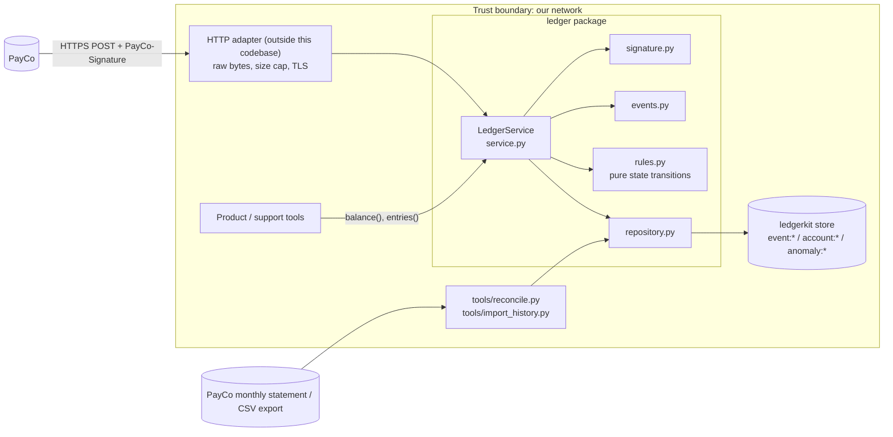

# Ledger: Architecture and Build Plan

> **Read this first: what I could and couldn't see.** The workspace has only a `README.md`. It says the directory is intentionally empty and does **not** document `ledgerkit` or `MemoryStore`, even though the brief points there. I couldn't see which operations the store supports. That matters more than anything else in this plan, because how we survive `StoreError` partway through a request depends on whether the store has conditional writes or transactions. Below I design against a small set of store operations I'm assuming exist (§5, A1). I also give the fallback if they don't. Checking this is the first task (T1).

---

## 1. Summary

- **What:** Ledger is a stdlib-only Python library, `LedgerService`. It turns signed PayCo webhooks into per-account balances and entry lists that Finance can reconcile against PayCo's monthly statement, to the minor unit. It replaces the nightly CSV-to-spreadsheet script and the manual balance fixes.
- **Shape:** One synchronous library called by a thin HTTP adapter. Internally it has a functional core and a thin I/O layer: pure modules for signature checking, parsing and balance rules, plus one repository module that talks to the store. There is no queue and no second service. PayCo's 72-hour retries act as our retry queue.
- **Key decisions:**
  1. **One atomic write moves money.** Each account's state (balance, entries, payment index, parked refunds, IDs of applied events) lives in one account document. It changes only through a single compare-and-set write, which is the commit point. A `StoreError` at any point leaves either "nothing happened" or "everything happened", and PayCo's redelivery finishes the job.
  2. **Return 2xx only after the effect is durable.** A duplicate is recognised from the account document (the event was applied), not from a separate "seen" flag. A crash between "seen" and "applied" therefore can't lose money.
  3. **Write-once event record** keyed by event `id`, holding the SHA-256 of the raw body. If the same `id` arrives with a different body, we return 409, raise an alert, and leave the account untouched. The record also covers unknown event types and stores their raw body, so we can replay them once we support disputes and payouts.
  4. **A refund that arrives before its payment is parked** (202) inside the account document. It is settled in the same atomic write that later applies the payment. We don't reject it and hope PayCo's retries outlast the gap.
  5. **Strict input handling:** we verify the HMAC over the raw bytes before parsing, allow ±300 s on the timestamp, compare in constant time, and parse JSON strictly (duplicate keys, floats, booleans and NaN are rejected as amounts).
- **First milestone:** two short spikes (store semantics, and how PayCo signs retries) and the payment path end to end. It includes signature checks, deduplication, the different-body check, unknown types, and a test that injects a fault at every write and shows redelivery always ends in the same state as a fault-free run.
- **Top risks:** the store has no conditional write (A1); PayCo retries reuse the original `t`, so retries more than 5 minutes later fail the timestamp check (A2); refunds of payments made before cutover arrive with no matching payment (§15).

## 2. Context and Goals

- **Problem:** Balances are rebuilt nightly from a CSV and fixed by hand. They are up to 24 hours stale, errors are possible, and support staff spend time on it.
- **Goals:**
  - Every validly signed PayCo payment and refund ends up applied **exactly once**, or is visibly parked or rejected. Nothing is silently lost or doubled.
  - A balance reflects a payment within about 60 s of PayCo sending it, in normal operation (assumption).
  - Survive `StoreError`, duplicate delivery, out-of-order delivery and concurrent delivery without manual repair.
- **Non-goals:** debiting customer spend (not in the interface; see Q2), partial refunds, disputes, payouts and other event types (recorded but not applied), multi-currency accounts, the HTTP server, deployment and monitoring stack (covered here as guidance only), and secret rotation with two secrets live at once (deferred, §17).
- **Success measures:** zero unexplained differences in the first two monthly reconciliations after cutover; zero manual balance edits; nightly script retired; no 409 that isn't explained.

## 3. Drivers, Requirements, and Constraints

**Ranked quality attributes**

| # | Attribute | Measurable target | Why it matters |
|---|---|---|---|
| 1 | Financial correctness | 0 unexplained differences per account per monthly reconciliation. In a seeded simulation of 10k events with shuffled order, duplicates and injected faults, final state equals the oracle (an independent calculation of the expected result) | Finance needs an exact match; a wrong balance is real money |
| 2 | Authenticity and integrity | 0 money movements from unsigned, stale (>300 s) or different-body deliveries; every different-body case alerts within 5 min | Webhook endpoints are public; the brief makes different-body reuse an incident |
| 3 | Recovery from partial failure | For every write position *k* in a request, with a `StoreError` before or after it commits, redelivery ends in the same state as a fault-free run | The store fails partway through requests |
| 4 | Evolvability | Adding a new event type (e.g. `charge.dispute.*`) in ≤1 week with no change to stored data shape, plus replay of events already received | PayCo adds types; "we will add them later" |
| 5 | Operability and simplicity | One deployable unit; ≤5 alert types; on-call needs no store access for routine cases *(assumption)* | Small team, small volume |
| — | Latency and throughput | p99 handling < 1 s at 10 req/s *(assumption; about 100× today's volume)* | Not a driver at a few thousand events a day. Recorded so nobody over-builds |

**Key functional requirements:** verify the signature and timestamp; credit `payment.succeeded`; debit `refund.succeeded` once per payment, with the amount equal to the payment; the account currency is fixed by its first payment; a different body under the same `id` is rejected; unknown types are accepted and not applied; `balance` and `entries` match the interface in the brief.

**Constraints:** Python, standard library only; the store is a `ledgerkit` MemoryStore client (API unknown to me); the interface signatures are fixed; HTTP, deployment and monitoring live outside this codebase.

**Hard parts**

1. **Atomicity against a store that fails partway through.** If we mark an event "processed" before the money moves, a crash loses money for good, because the redelivery looks like a duplicate.
2. **Out-of-order and concurrent pairs.** A refund that arrives before its payment, or both arriving at the same moment, can leave a refund parked forever unless both are serialised on one record.
3. **Cutover.** Refunds of payments made before go-live, and opening balances. Easy to miss, and expensive if missed.
4. **PayCo delivery details we haven't verified:** whether retries get a fresh `t`, and whether redelivered bodies are byte-identical.

## 4. Current State

- **Code:** none. `README.md` is the only file and says so. `ledgerkit` is not in the workspace, so its API, version and the exact behaviour of `StoreError` are unknown.
- **Process:** a nightly script copies PayCo's CSV export into a spreadsheet, and support staff fix balances by hand. This is the system Ledger replaces, and the source of opening balances (§15).
- **Conventions I'll set, since none exist:** package `ledger/`, tests in `tests/` run with `python -m unittest`, no third-party packages apart from `ledgerkit`, Python ≥3.11 *(assumption A8)*.

## 5. Assumptions and Open Questions

**Assumptions**

| # | Assumption | Impact if wrong | How and when validated |
|---|---|---|---|
| A1 | The store offers single-key get, put-if-absent, and compare-and-set (or a transaction). A single write is never left half-applied. | Without a conditional write: fall back to one writer process with per-account locks (D1b). With half-applied writes: no client-side design is safe, so escalate to the DB owner. | T1 spike, day 1 |
| A2 | Each PayCo retry is signed again with a fresh `t`. | Retries more than 300 s later always fail, so our 503s never recover. We'd need to retry inside the request and escalate to PayCo. | T2 sandbox spike, M1 |
| A3 | Redeliveries are byte-identical (the brief says "same body"). | False 409s on events already applied. No money effect, but alert noise. | T2; incident logs also record whether canonical JSON matched |
| A4 | At most one `refund.succeeded` per `payment_id` (refunds are always full). Refund `account_id` equals the payment's. | Second refund rejected (422); mismatched account leaves the refund parked and alerting | Ask PayCo; watch anomaly alerts |
| A5 | One `payment.succeeded` per `payment_id`. | Treated as an anomaly (422) rather than a double credit | T2 fixtures; PayCo docs |
| A6 | Spending is debited somewhere else, or later. Ledger's balance = payments − refunds. | Interface and data model would grow a debit path (Q2) | Ask the product owner before M3 |
| A7 | The HTTP layer passes the raw request bytes unchanged, case-varying headers as a `dict[str,str]`, and caps body size. | Signatures fail, or we have a DoS hole | M3 adapter contract test |
| A8 | Python ≥3.11. | Minor syntax changes only | T0 |
| A9 | Event records and entries are kept indefinitely (financial records). About 1 MB/day of raw bodies. | Storage cost, but small | Ask Finance about retention policy, M3 |

**Open questions**

| Question | Owner | Default if no answer | Needed by |
|---|---|---|---|
| Q1 What is the MemoryStore / production client API? Does production use the same API? | Whoever owns `ledgerkit` | A1 | T1, day 1 (blocking) |
| Q2 How does spending relate to this balance, and what opening balance does each account start with at cutover? | Product + Finance | Ledger tracks PayCo movements only; history is imported from the PayCo export | Start of M3 |
| Q3 Can we have PayCo sandbox access? What is PayCo's delivery timeout? Can it resend a specific event by hand? | Whoever holds the PayCo account | Assume a 10 s timeout and no manual resend | Request day 1; needed for T2 |
| Q4 For a signed event that breaks a rule (currency mismatch, double refund): reply 422 so PayCo keeps retrying, or 2xx and quarantine? | Finance + on-call owner | 422 **and** a durable anomaly record | End of M2 |
| Q5 Should `entries()` be ordered by when we applied each entry (default) or by PayCo `created`? | Finance | Order we applied them; `created` included in each entry | End of M1 |

## 6. Architecture Overview



**How it fits together:** `handle()` checks the signature and timestamp against the raw bytes. It then parses strictly and writes or reads the write-once event record, which is where a different body under the same `id` is caught. Finally it runs a compare-and-set loop on the account document. Inside that loop, the pure `rules.apply(state, event)` decides the outcome. Reads (`balance`, `entries`) load the account document. Only `repository.py` touches the store.

| Component | Responsibility | Owns data | Interfaces | Technology | Dependencies |
|---|---|---|---|---|---|
| `LedgerService` (`service.py`) | Orchestrate; map outcomes to status codes; read API | none | `handle`, `balance`, `entries` (sync, in process) | stdlib | all below, `clock` |
| Signature verifier (`signature.py`) | Parse header, check HMAC and ±300 s | none | `verify(raw, headers, secret, now) -> ok \| Reason` | `hmac`, `hashlib`, `re` | — |
| Event parser (`events.py`) | Strict JSON and per-type validation into dataclasses | none | `parse_envelope(raw)`, `validate(envelope) -> Payment \| Refund` | `json`, `dataclasses` | — |
| Ledger rules (`rules.py`) | Pure account state change and outcome | none (pure) | `apply(state, event, now) -> (new_state \| None, Outcome)` | stdlib | — |
| Repository (`repository.py`) | The only code that calls the store; compare-and-set loop | `event:*`, `account:*`, `anomaly:*` | `put_event_if_absent`, `update_account(id, fn)`, `load_account`, `put_anomaly` | `ledgerkit` | store |
| Tools (M3) | Reconciliation and history import | writes only through the repository | CLI | stdlib `csv` | PayCo export |

## 7. Component Details

**Signature verifier.**
- Look up the header case-insensitively. If two keys differ only in case (e.g. `PayCo-Signature` and `payco-signature`), return 400.
- Split the header value on `,`, then each part on the first `=`. Require exactly one `t` matching `[0-9]{1,12}`. Don't use bare `int()`, which accepts `+1`, `1_000` and Unicode digits.
- Accept one or more `v1` values, each matching `[0-9a-f]{64}`. Checking the format first also avoids a `TypeError` that `compare_digest` raises on non-ASCII strings.
- Expected value: `HMAC-SHA256(secret, t_str.encode() + b"." + raw_body)`, using the **original `t` string**. Compare with `hmac.compare_digest` against each `v1`.
- Check the signature first, then `abs(clock.now() - int(t)) > 300` → reject. This is inclusive at exactly 300 s.
- Out of scope: JSON, and replay deduplication. A replay inside the 300 s window is harmless because of event-`id` idempotency.

**Event parser.**
- `json.loads` with an `object_pairs_hook` that rejects duplicate keys, and a `parse_constant` that rejects NaN and Infinity. The top level must be an object, and `id` a non-empty string.
- For known types, check `data`: `account_id` and `payment_id` non-empty strings; `amount` with `type(x) is int` (Python treats `True` as an `int`) and `> 0`; `currency` matching `[A-Z]{3}`; `created` an int.
- Unknown types get only the envelope check.

**Ledger rules (pure).** This is where the money logic lives, so it gets the most tests.
- `payment.succeeded`:
  - Event already in `applied_event_ids` → DUPLICATE.
  - `payment_id` already in `payments` from a different event → REJECT `duplicate_payment`.
  - Currency set and different from the event's → REJECT `currency_mismatch`.
  - Otherwise: set the currency if unset, add the entry `+amount`, record the payment.
  - If `pending_refunds[payment_id]` exists and matches on amount and currency, settle it in the same state: add a `-amount` entry and mark the payment refunded. If it doesn't match, keep it parked with `mismatch` set so the parked-refund alert fires.
- `refund.succeeded`:
  - Already applied, or already parked with the same event → DUPLICATE or PENDING.
  - Payment unknown → PARK, keyed by `payment_id`. If a different event is already parked for that payment → REJECT `double_refund`.
  - Payment already refunded → REJECT `double_refund`.
  - Amount or currency differs from the payment → REJECT `refund_mismatch`.
  - Otherwise add the entry `-amount`.
- A refund never fails for lack of balance. Negative balances are allowed and recorded, because refusing a refund would break reconciliation.

**Repository.**
- `put_event_if_absent(id, record)` returns the record already stored, if any.
- `update_account(id, fn)`: load (document and version) → `fn` → compare-and-set. On a version conflict, retry up to 5 times, then raise `Contention`, which becomes 503.
- `StoreError` is never caught here. It goes up to the service.

**`handle()` in outline**

```
headers → signature.verify            → 400/401 on failure
raw → events.parse_envelope           → 400 on failure
digest = sha256(raw)
try:
  rec = repo.put_event_if_absent(id, {digest, type, raw_body, first_seen_at})
  if rec.digest != digest: log INCIDENT (incl. canonical-JSON-equal flag) → 409
  if type not in HANDLERS: → 200 ignored
  ev = events.validate(envelope)      → on error: repo.put_anomaly(id, …) → 422
  outcome = repo.update_account(ev.account_id, λs: rules.apply(s, ev, now))
  REJECTED → repo.put_anomaly(id, …) → 422 ; APPLIED/DUPLICATE → 200 ; PENDING → 202
except StoreError, Contention: → 503
except Exception: log with traceback → 500
```

**Status code policy.** Any 2xx means the effect is durable.

| Situation | Status | `body.status` |
|---|---|---|
| Missing, duplicated or malformed signature header; malformed JSON or `id` | 400 | `bad_request` |
| Bad signature, or `t` more than 300 s off | 401 | `unauthorized` (no detail in the response) |
| Same `id`, different body | 409 | `conflict` |
| Known type that breaks a rule or fails validation | 422 | `rejected` + `reason` |
| Applied / duplicate / unknown type | 200 | `applied` / `duplicate` / `ignored` |
| Refund parked | 202 | `pending` |
| `StoreError`, compare-and-set contention | 503 | `retry` |
| Bug | 500 | `error` |

**Failure and recovery.** Every store write is either idempotent (event record, anomaly) or conditional (account compare-and-set). Every `StoreError` returns 503, and PayCo retries. A write that raised but actually committed is caught on redelivery by `applied_event_ids`. Reads (`balance`, `entries`) let `StoreError` propagate, because returning 0 would be a wrong answer. Scaling: a compare-and-set per account means contention only on one hot account, which is negligible at this volume.

## 8. Data Design

| Key | Contents | Written by | Write rule |
|---|---|---|---|
| `event:{id}` | `body_sha256`, `type`, `raw_body`, `first_seen_at` | repository (via service) | put-if-absent; never updated |
| `account:{account_id}` | see below | repository (via rules) | compare-and-set on `version`; **the only write that moves money** |
| `anomaly:{event_id}` | reason, `raw_body`, `seen_at`, count | repository | overwrite with the same content (idempotent) |

```
account:{id} = {
  version, currency | null, balance,
  entries: [{seq, event_id, type, amount(signed), currency, payment_id, created, applied_at}],
  applied_event_ids: {...},                       # dedup lives with the money
  payments: {payment_id: {event_id, amount, currency, refunded_by | null, source}},
  pending_refunds: {payment_id: {event_id, amount, currency, created, received_at, mismatch}}
}
```

- **System of record:** the account document for balances and entries; `event:*` for "what PayCo sent us".
- **Consistency:** the invariants `balance == sum(entries.amount)`, at most one refund per payment, and one currency per account all hold because they change in one atomic write. `payments` and `pending_refunds` exist from M1, so adding refunds in M2 needs no data migration.
- **Access patterns:** point lookups only; no scans on the hot path. The parked-refund alert and the reconciliation tool need to list `account:*`. If the store can't list keys, keep an `accounts_index` document (T1 decides).
- **Retention and backup:** keep everything (A9). The managed DB's backups give the restore point. **After a restore**, events that were acknowledged after the backup are gone, and PayCo won't resend them. Recovery is to run `tools/reconcile.py` against PayCo's export and replay the missing events. Write this into the runbook in M3.
- **Classification:** account IDs, amounts, currency. No card data. The secret is never stored or logged. Logs carry event IDs and outcomes, not bodies.
- **Schema changes:** the account document carries `schema: 1`. Readers accept N and N−1, and documents are upgraded when next written. Revisit splitting entries into separate records if any account passes about 10k entries or 1 MB.

## 9. Key Flows

**F1: Payment, normal path.** Signature OK → event record created → account compare-and-set adds +2500 and fixes the currency to EUR → 200 `applied`.

**F2: Partial write, then redelivery (failure path).**
1. Event record written. Account compare-and-set raises `StoreError` → 503. Two cases: (a) it didn't commit; (b) it committed, but the client raised anyway.
2. PayCo retries with a fresh `t` (A2). The event record already exists with the same digest, so we continue.
3. Case (a): compare-and-set applies → 200. Case (b): `applied_event_ids` contains the ID → 200 `duplicate`. The balance is right either way.

Contrast: if we had written a "processed" flag first, case (a) would leave the event marked done and the money never applied.

**F3: Refund before payment, including a race.**
1. Refund `evt_R` for `pay_9` arrives; the account has no `pay_9` → parked → 202.
2. Payment `evt_P` arrives. In the same compare-and-set it applies +2500, finds `pending_refunds[pay_9]`, checks amount and currency, and applies −2500. Entries read: payment, then refund.
3. If both arrive at once, both compare-and-set on `account:acct_42`. One loses and retries against the new state, so neither can miss the other.

**F4: Same `id`, different body.** Signature is valid; the event record exists with a different digest → 409, log `INCIDENT`, page someone. The account isn't read or written. Every later delivery of that body gets 409 again.

## 10. Key Decisions

| Decision | Options considered | Rationale | Reversibility | Revisit if |
|---|---|---|---|---|
| **D1** Commit point = compare-and-set on one per-account document | (a) one atomic write per account; (b) separate records written as idempotent steps, with the balance derived from them; (c) a multi-key DB transaction | (a) needs only one conditional write, which is the weakest store capability that gives atomicity, and serialises out-of-order pairs for free (drivers 1 and 3). (b) needs per-account listing and still has races in pairing. (c) is best if it exists, but isn't known to | Hard (data model) | T1 shows transactions → use (c) inside the repository; same rules. No conditional write → **D1b:** one writer process with per-account `threading.Lock`, documented as a deployment constraint |
| **D2** Duplicate = event ID inside the account document; different-body check = write-once `event:{id}` storing the raw-bytes SHA-256 | Raw bytes vs canonical JSON hash; a "seen" flag vs "applied" | "Applied" sits next to the money, so nothing is lost on a crash. Raw bytes match the brief's "same body" guarantee. A false positive costs an alert, not money | Medium | 409s where the canonical JSON matches → switch to the canonical hash |
| **D3** Park early refunds (202) | Park; reject and rely on retries; apply straight away as a negative entry | Parking survives a payment arriving more than 72 h later. It keeps "every refund matches an earlier payment" true. It handles a new account with no currency yet | Medium | Parking is rare and the alert never fires → keep. Partial refunds introduced → rework (§17) |
| **D4** Synchronous processing in the request | Synchronous; acknowledge to a queue and process later | An acknowledge-then-process design returns 2xx before the effect is durable, unless we add a durable queue. PayCo's retries already are one | Easy | p99 nears PayCo's timeout (Q3) |
| **D5** Unknown types → 200 and store the raw body | 200 and store; 4xx so PayCo keeps them | Avoids 72 h of retry noise; we can backfill disputes later from `event:*` | Easy | — |
| **D6** Rule violations → 422 plus an anomaly record | 422; 2xx and quarantine | Stays visible in PayCo's dashboard, and a code fix shipped within 72 h is picked up by retries. The anomaly record covers longer | Easy | Q4 answer |
| **D7** Balance stored in the document, not summed on each read | Stored; computed | O(1) read; written in the same atomic write, so it can't drift; the audit asserts it equals the sum | Easy | — |

## 11. Cross-Cutting Concerns

- **Security (M1):**
  - Forged webhooks → HMAC with constant-time compare.
  - Replay → ±300 s plus idempotency.
  - Event-ID reuse → 409 plus a page.
  - Ambiguous JSON → duplicate keys rejected.
  - Timing and format attacks → format checked before compare.
  - Large-body DoS → the HTTP adapter caps bodies at 256 KB before calling `handle` (M3).
  - The secret comes from the platform secret manager and is never logged.
  - `balance` and `entries` have no authentication, so they must be reachable only from inside the network.
  - Rotation: the constructor takes one secret. Rotating means an overlap window with PayCo, or a later API change (§17).
- **Reliability (M1–M3):** RPO = 0 for acknowledged events, since we acknowledge only after commit. Outages shorter than 72 h lose nothing, because PayCo retries. Freshness target in A-table. The compare-and-set retry is bounded (5 attempts). No retry inside a request on `StoreError` in M1; add one if A2 fails.
- **Observability:** one structured JSON log line per delivery (`event_id`, `type`, `outcome`, `status`, `ms`), built in M1. Metrics and alerts come in M3 with the platform:

  | Alert | Response |
  |---|---|
  | Any 409 | Page |
  | More than 5 signature or timestamp rejections in 10 min | Secret or clock problem; ticket |
  | 5xx above 2% for 15 min | Page |
  | Refund parked longer than 24 h | Ticket |
  | New anomaly | Ticket |
  | No deliveries for 6 h during business hours | Ticket |
  | Reconciliation difference ≠ 0 | Ticket to Finance and engineering |

- **Performance:** under 1 req/s today. The only bottleneck is store round-trips: 2–3 per event. A smoke load test at 10 req/s runs in M3.
- **Cost:** one small process plus existing DB storage (about 0.4 GB/year). Negligible.
- **Operations:** the owning team runs it with business-hours support, and pages only for 409 and sustained 5xx. Runbooks (M3) cover: 409 incident; parked refund ageing; anomaly triage and replay; restore followed by reconcile-and-replay.
- **AI-specific:** not applicable; there are no model components.

## 12. Build Sequence

Team assumption: one Python engineer full time, a reviewer about 10% of the time, a Finance contact a few hours a week. Sizes are rough ranges, not commitments.

| Milestone | Goal | Scope / deliverables | Exit criteria | Depends on | Size |
|---|---|---|---|---|---|
| **M1: Safe payment path** | Clear hard parts 1 and 4; working thin slice | T0–T11: spikes; signature, parsing, repository, rules for payments, service, unknown types, 409; fault-injection test harness; dev server and replay demo. *Excludes refunds.* | Fault test passes at every write position (before and after commit); signature tests pass; demo replays fixtures with faults and duplicates and shows correct balances | `ledgerkit` access (**critical**); PayCo sandbox (in parallel) | 6–9 engineer-days |
| **M2: Refunds and ordering** | Clear hard part 2 | Refund rules, parking and settlement, double-refund and mismatch anomalies; seeded simulation oracle; threaded concurrency test | 10k-event shuffled simulation with 1% faults and 10% duplicates equals the oracle over 50 seeds; concurrency test with 8 threads equals the oracle | M1 | 4–6 days |
| **M3: Production integration** | Clear hard part 3; make it runnable | HTTP adapter contract (raw bytes, size cap, 10 s limit); production store adapter; metrics and alerts; `tools/reconcile.py`; `tools/import_history.py`; runbooks | Sandbox deliveries reach staging; reconcile against last month's export shows 0 differences after import; every alert fired once in staging | M2; Q2 answer; platform team (in parallel) | 8–15 days |
| **M4: Shadow and cutover** | Prove it on live traffic | Live webhooks into Ledger while the spreadsheet continues; daily reconcile; switch product reads; retire the nightly script | One full month-end reconciled with 0 unexplained differences | M3 | ≥1 month-end of calendar time; 3–5 days effort |

**Critical path:** `ledgerkit` access → T1 → repository → rules → M2 simulation → import tool → shadow month-end. The month-end sets the calendar, so aim to start shadowing before a month boundary.

## 13. First Milestone Task Breakdown

Order: T0 → T1 → (T3 ∥ T4 ∥ T5) → T6 → T7 → T8 → T9 → T10. T2 runs alongside everything once sandbox access exists; T11 alongside T8.

| # | Task | Where | Done when |
|---|---|---|---|
| T0 | Get the `ledgerkit` package and its real docs; pin the version; confirm the Python version | `requirements.txt` (pin only), `README.md` | `python -c "import ledgerkit; ledgerkit.MemoryStore()"` works in CI |
| T1 | **Spike (≤1 day): store semantics.** Questions: is there put-if-absent, compare-and-set or a transaction? Can a single write be left half-done? How is `StoreError` triggered or injected? Can a write that raises have committed? Can keys be listed? Build a script that exercises each, plus a 2-thread compare-and-set race | `spikes/store_semantics.py`, notes in `docs/decisions.md` | Written answers to every question. **Changes the plan if** there's no conditional write (→ D1b), transactions exist (→ D1c), or writes can be half-done (→ escalate) |
| T2 | **Spike (≤2 days): PayCo sandbox.** Return 503 on purpose and capture the retries: is `t` fresh? Is the body byte-identical? Are there several `v1` values? What is the timeout? Save 10+ real deliveries as fixtures | `tools/dev_server.py` (stdlib `http.server`, logs raw bytes and headers), `tests/fixtures/payco/` | Fixtures committed with secrets redacted. **Changes the plan if** `t` is reused (→ retry inside the request, escalate to PayCo) or bodies differ (→ canonical hash in D2) |
| T3 | Scaffold the package and CI | `ledger/__init__.py`, `tests/`, CI config | CI runs `python -m unittest discover -s tests` on every push; a test fails if any `ledger/` module imports something outside stdlib or `ledgerkit` |
| T4 | Implement `verify` per §7 | `ledger/signature.py`, `tests/test_signature.py` | Tests cover: valid; wrong secret; one body byte flipped; `t` at ±300 accepted and ±301 rejected; missing header; mixed-case name; two keys differing only in case; several `v1` values; non-digit or `+` in `t`; non-hex or uppercase `v1` |
| T5 | Implement strict envelope parsing and payment validation | `ledger/events.py`, `tests/test_events.py` | Tests reject duplicate keys, NaN, `amount` that is `true`, `25.0`, `"2500"`, `0` or `-1`, and currency `eur`; an unknown type passes the envelope check |
| T6 | Implement the repository per §7 and §8 against MemoryStore | `ledger/repository.py`, `tests/test_repository.py` | put-if-absent returns the stored record; compare-and-set conflict retries ≤5 then raises `Contention`; `StoreError` propagates unchanged |
| T7 | Implement `rules.apply` for payments with the full document shape (including empty `payments` and `pending_refunds`) | `ledger/rules.py`, `tests/test_rules.py` | Tests: first payment sets the currency; duplicate; duplicate `payment_id` → REJECT; currency mismatch → REJECT; the input state is never mutated |
| T8 | Wire `LedgerService` with the status policy, `balance` and `entries` | `ledger/service.py`, `tests/test_service.py` | Every row of the status table has a test; unseen account → 0 and `[]`; 409 leaves the account document byte-identical |
| T9 | Build `FaultyStore` (raise `StoreError` before or after the *k*-th write) and the exhaustive fault test | `tests/fakes.py`, `tests/test_faults.py` | For every *k* and both modes, redelivering until 2xx gives the same state as a fault-free run, for a script of 20 events with duplicates |
| T10 | Write a demo replay script | `tools/replay.py` | Replays fixtures with a fake clock and random faults, then prints balances that match the expected values; shown to a reviewer |
| T11 | Add a structured log line per delivery | `ledger/service.py` | Test captures `logging` output containing `event_id`, `outcome`, `status` and no body or secret |

## 14. Testing and Validation Strategy

| Risk | Test | When |
|---|---|---|
| Forgery, replay, parsing tricks | Unit tests on signature and parser (T4, T5); captured-fixture contract tests (T2) | M1, CI |
| Partial writes | Exhaustive fault test at each write position (T9) | M1, CI, blocks release |
| Ordering, duplicates, pairing | Seeded simulation: random payments and refunds, shuffled, duplicated, unknown types, 1% faults; compared with an oracle calculated independently from the event list | M2, CI with 50 seeds |
| Concurrency | 8 threads sending the same and related events against a thread-safe MemoryStore | M2, CI |
| Reconciliation | `reconcile.py` run against an anonymised past PayCo export after `import_history.py` | M3, then daily in M4 |
| Adapter | Contract test showing the HTTP adapter passes raw bytes unchanged and caps body size | M3 |
| Load | 10 req/s for 10 min in staging; p99 < 1 s | M3 |

Everything in CI blocks merging. Driver 1 is verified by the simulation in M2 and the month-end reconciliation in M4. Driver 2 by T4, T5 and T8. Driver 3 by T9. Driver 4 by the M3 exercise of adding a stub `charge.dispute.created` handler in under a day, with no change to stored data shape.

## 15. Rollout, Migration, and Rollback

1. **Import history (M3).** `tools/import_history.py` loads PayCo's export: payments into `payments` (`source=import`), and historical movements as entries so `entries()` is complete. If the export includes event IDs, use them. Live webhook duplicates during the overlap then deduplicate on their own. If it doesn't, a webhook payment matching an imported `payment_id` with the same amount and currency is treated as DUPLICATE, not REJECT. Without this, **refunds of payments made before go-live would be parked forever.**
2. **Shadow (M4).** Point PayCo at Ledger while the nightly spreadsheet continues; product still reads the spreadsheet. Reconcile daily, and in full at month-end.
3. **Switch reads** to `balance()` behind a config flag once the month-end shows 0 unexplained differences.
4. **Rollback:** flip the flag back. Ledger keeps ingesting, so nothing is lost. **Point of no return:** retiring the nightly script and stopping manual spreadsheet edits. Do this only after a second clean month-end.

## 16. Risks and Mitigations

| Risk | Likelihood | Impact | Mitigation | Early warning | Owner |
|---|---|---|---|---|---|
| Store has no conditional write | Med | High | D1b with a single-writer lock; push the DB owner for compare-and-set | T1 result | Engineer |
| PayCo retries reuse `t` | Low–Med | High | Retry inside the request on `StoreError`; escalate to PayCo | T2 | Engineer + PayCo contact |
| Refunds of pre-cutover payments, or wrong opening balances | High if ignored | High | History import (§15) | Parked-refund alert during shadow | Engineer + Finance |
| `ledgerkit` or sandbox access delayed | Med | Med (schedule) | Request on day 1; build against T1 findings and synthetic fixtures | T0/T2 not done by day 2 | Lead |
| False 409s from PayCo re-serialising bodies | Low | Low | Log whether canonical JSON matches; switch hash (D2) | 409 with canonical match | On-call |
| Spending semantics unclear (Q2) | Med | Med | Get the answer before M3; balance stays PayCo-only | Product asks for a debit API | Product owner |
| Account document grows too large | Low | Low | Revisit trigger in §8 | Largest document size metric | Engineer |

## 17. Deferred Work and Future Evolution

- **New event types:** add a handler to `rules.HANDLERS`; replay stored `event:*` records of that type with a backfill tool. Trigger: Product asks for dispute support.
- **Partial refunds:** change `refunded_by` into a list with a running total, and key parked refunds by `event_id`. Trigger: PayCo or our policy allows them.
- **Two secrets at once for rotation:** accept `secret` as bytes or a list. Trigger: the first rotation.
- **Retry inside the request on `StoreError`:** trigger: A2 fails, or freshness misses its target.
- **Split entries out of the account document:** trigger in §8.
- **Shortcut taken on purpose:** the balance covers PayCo movements only (A6). Pay it back once Q2 is answered.

## 18. Next Steps

1. **Today:** ask whoever owns `ledgerkit` for the package and its real README (Q1). Ask whoever holds the PayCo account for sandbox access and the timeout and resend details (Q3).
2. Run T1 (`spikes/store_semantics.py`) as soon as T0 lands, and record the result in `docs/decisions.md`. Confirm or replace D1.
3. Run T3 (scaffold and CI), then T4 and T5 in parallel. They don't depend on the store.
4. Book 30 minutes with Finance and Product on Q2 (spending and opening balances), Q4 (422 vs quarantine) and Q5 (entry order).
5. Pick the month-end to shadow and work backwards to the M3 deadline.

---

### Open questions that would most change this plan

1. **What does `ledgerkit.MemoryStore` actually support** (conditional writes, transactions, half-done writes, key listing), and does production use the same API? The README the brief points to isn't in the workspace. This decides D1.
2. **Does PayCo sign each retry again with a fresh `t`?** If not, the 300 s rule and the "return 503 and let PayCo retry" recovery conflict, and both need rethinking.
3. **What balance should each account start with at cutover, and where is spending debited?** This decides the history import and whether Ledger needs a debit path.
4. **For a signed event that breaks a rule, should we reply 422 (PayCo keeps retrying) or 2xx and quarantine it?** I've defaulted to 422 plus a durable anomaly record.
