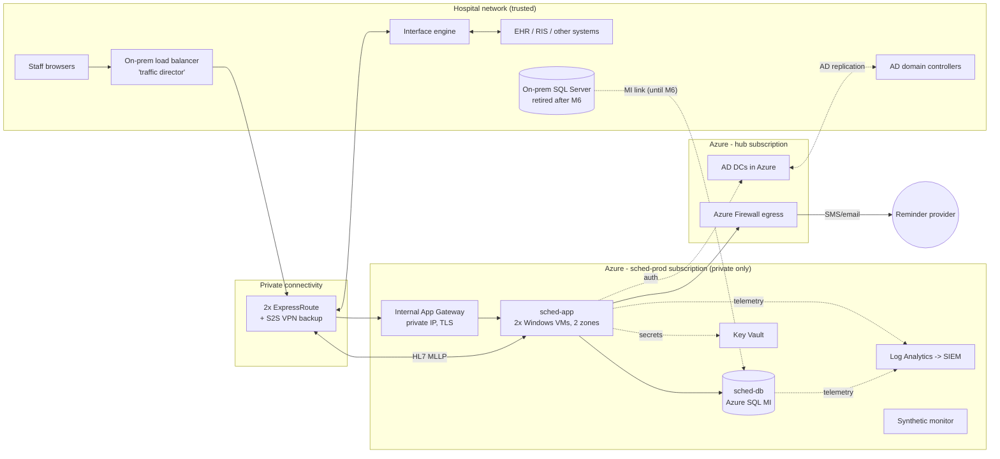

# Architecture and Build Plan: Moving the Patient Scheduling System to the Cloud Without Downtime

> **How this plan was produced.** I looked in the workspace for existing code or documentation. It only has a README saying it is intentionally empty. So I couldn't inspect the current system, and every statement about it below is an assumption, marked **[A#]** and collected in Section 5. Three of those assumptions affect the plan most: that the application is owned in-house, that the database is SQL Server, and that the hospital is US-based and bound by HIPAA. They're the first open questions at the end. The structure of the plan holds up if they turn out wrong, but the specific products named would change.

---

## 1. Summary

- **What:** Move the hospital's on-premises patient scheduling system (app servers plus database) to a managed cloud environment. Schedulers, clinics and the systems connected to it should see no outage, and no appointment should be lost or duplicated.
- **Shape:** This is a **rehost, not a rewrite.** The existing application runs unchanged on cloud Windows VMs. The database moves to **Azure SQL Managed Instance (MI)**, a managed SQL Server service, and is kept continuously in sync from on-prem using **MI link**, a replication feature that feeds a cloud copy and lets you switch the copy to primary in a planned way. The existing interface engine (the system that passes HL7 messages between hospital systems) stays on-prem. The cloud is reached privately over two redundant **ExpressRoute** circuits (private lines into Azure), with a site-to-site VPN as backup.
- **What "without downtime" means here:** Staff never lose access to schedules in an unplanned way. There is **one planned interruption of ≤ 2 minutes (target ≤ 60 s)**, when the database switches over during the lowest-traffic window (Sunday about 03:00). The hospital's paper downtime procedures stay on standby but shouldn't be needed. Literally zero seconds would mean two databases accepting writes at the same moment, which risks double-booking. I reject that on purpose (decision D3).
- **Key decisions:**
  1. Lift-and-shift the app tier and use a managed database. No re-architecture during the move.
  2. **Single writer at all times.** Exactly one database accepts writes at any moment, and the switch happens in one rehearsed, timed step.
  3. **Move the app tier first, one clinic at a time, while the database stays on-prem.** The database switch then becomes a separate, small event. The on-prem app servers remain a warm fallback until that switch.
  4. Treat the WAN link as critical clinical infrastructure from now on. Use dual, diverse ExpressRoute circuits plus a VPN backup, and extend Active Directory into Azure so logins don't depend on the link.
  5. Everything is defined in code (Bicep), with no public endpoints, under a signed HIPAA Business Associate Agreement (BAA).
- **First milestone (about 6–8 weeks):** start the long-lead items (BAA, ExpressRoute order, security review). Build a non-production cloud copy of the full system through a real pipeline, and book a test appointment end to end, including an HL7 message to a test interface engine. Run spikes that measure replication, switchover time, WAN latency, and HL7 queueing behaviour. Run a 2–4 week audit of everything that touches the database.
- **Top risks:** unknown consumers of the database (reports, linked servers, scripts) breaking after the move; whether you can switch back after cutover, which depends on the SQL Server version; the WAN becoming a single point of failure; the latency of chatty database queries across the WAN; duplicate patient reminder texts or HL7 messages during the switch.

## 2. Context and Goals

- **Problem:** The scheduling system runs on hospital-owned servers [A1]. The usual reasons for moving apply: ageing hardware, data-centre consolidation, DR (disaster recovery) weaknesses, and patching burden [A2]. Clinics book thousands of appointments a day and the system is hooked into the EHR (electronic health record), so a failed or long cutover directly delays patient care.
- **Goals:**
  - G1: The production scheduling system runs entirely in the cloud, with the on-prem servers decommissioned within 60 days of cutover.
  - G2: No unplanned user-facing outage during the whole migration. One planned interruption of ≤ 2 min.
  - G3: Zero lost, duplicated or corrupted appointments. Proven by reconciliation, not assumed.
  - G4: After migration, availability, performance and security are at least as good as today.
- **Non-goals:** Rewriting or modernising the application. Changing the database schema. Moving the interface engine, EHR or other systems. A patient self-booking portal. Multi-region active-active. These are listed with triggers in Section 17.
- **Success measures:** a reconciliation report showing 0 discrepancies at cutover and at T+24h; measured cutover interruption ≤ 120 s; p95 page latency within 10% of the pre-migration baseline after 2 weeks; zero severity-1 incidents attributable to the migration in hypercare (the 2-week period of heightened support after go-live); on-prem decommissioned on schedule.

## 3. Drivers, Requirements, and Constraints

### Ranked quality attributes

| # | Attribute | Measurable target | Why it matters |
|---|---|---|---|
| 1 | **Data integrity** | RPO (maximum data loss) = 0 at planned cutover. 0 discrepancies in reconciliation of appointments, slots and patient links. No double-booking introduced | A lost appointment means a missed or delayed patient visit. This outranks everything, including availability |
| 2 | **Availability during migration** | No unplanned outage. One planned interruption ≤ 120 s (target ≤ 60 s) in a pre-agreed low-traffic window **[A3]** | This is the user's explicit requirement. Clinics run from early morning, and inpatient and procedural areas run around the clock |
| 3 | **Security and compliance** | Signed BAA. Private networking only. Encryption at rest and in transit. Audit logs in the SIEM (the hospital's security log platform). Hospital security review passed before production data lands **[A4]** | PHI (protected health information) is involved. A breach costs far more than any outage |
| 4 | **Reversibility** | Every step before decommission has a rehearsed rollback that completes in ≤ 15 min | A clinical system can't be "fixed forward" under pressure without great risk |
| 5 | **Performance** | Steady-state p95 page latency ≤ baseline + 10%. Measured, not assumed **[A5]** | Schedulers work quickly on the phone. Slowness causes workarounds and complaints |
| 6 | **Run cost** | Roughly $6–14k/month all-in, to be confirmed against current total cost (Section 11) **[A6]** | Matters, but ranks below everything above |

Steady-state availability target after migration: **99.9% monthly**, excluding agreed maintenance [A3]. Regional disaster recovery: **RTO (time to restore) ≤ 8 h, RPO ≤ 15 min**, via geo-redundant backups [A7].

### Key functional requirements (the ones that shape the structure)
- All existing scheduling functions keep working unchanged: templates, slots, booking, cancellations, waitlists, reports.
- HL7 v2 feeds keep flowing: ADT (patient admit/update messages) **into** scheduling, and SIU (scheduling messages) **out** to the EHR and departmental systems [A8].
- Background jobs (patient reminders by SMS or email, nightly extracts) run **exactly once**, in exactly one place.
- Existing staff sign-in keeps working without retraining (Windows/AD single sign-on) [A9].

### Constraints
- Hospital IT team: about 1–2 app engineers who know the codebase, 1 DBA, a network engineer and a security analyst part-time, and **limited cloud experience**. Assumes a contracted cloud engineer or partner for about 6 months [A10].
- Assumed environment: SQL Server on Windows, an IIS/.NET web app used through a browser, an on-prem load balancer, and an interface engine such as Rhapsody, Cloverleaf or Mirth [A1, A8, A11].
- Azure, assuming the hospital already has Microsoft 365/Entra ID and an enterprise agreement [A12].
- Hospital change-control rules apply: change advisory board (CAB) approval, change freezes, and clinical sign-off for downtime windows.
- Data must stay in-country.

### Hard parts
1. **Database switchover with no loss and ≤ 2 min interruption.** This is the one irreversible-feeling moment. Exact behaviour depends on SQL Server version and edition.
2. **Undocumented database consumers.** Report writers, linked servers, Excel/ODBC users, and other systems reading tables directly. Each one that isn't found becomes a post-cutover outage.
3. **Integrations during the switch.** HL7 queueing, ordering and duplicates. Reminder jobs firing twice and sending duplicate texts to patients.
4. **Cross-WAN latency.** While the app runs in the cloud and the database is still on-prem, a chatty page making 50+ queries could become noticeably slower.
5. **Long-lead, outside dependencies.** BAA and security review, ExpressRoute provisioning (often 4–12 weeks), CAB approval, and clinical sign-off on the cutover window.

## 4. Current State

**Not inspected.** The workspace is empty. The assumed current state, which Milestone 1's discovery tasks will confirm or correct:

| Element | Assumption |
|---|---|
| Application | In-house or source-available .NET web app on 2–4 Windows/IIS servers behind an on-prem load balancer (F5 or NetScaler class), used in the browser by about 500–1,500 staff [A1, A11] |
| Database | Single SQL Server instance or Always On availability group (AG), about 100–500 GB, used by the app plus unknown direct consumers [A13] |
| Integrations | Interface engine on-prem. ADT inbound and SIU outbound over MLLP/TCP (the standard transport for HL7 v2). SMS/email reminder provider reached over the internet [A8] |
| Identity | Active Directory with Windows integrated authentication [A9] |
| Load | Peak Monday 08:00–10:00. About 10–20k appointment writes/day. Low hundreds of requests/second at peak [A5] |
| Continuity | The hospital has paper/read-only downtime procedures, such as printed next-72-hour schedules [A14] |

Conventions to keep: the existing deployment and configuration approach for the app, existing CAB process, existing SIEM, existing monitoring tools where they can ingest cloud telemetry.

## 5. Assumptions and Open Questions

### Assumptions

| ID | Assumption | Impact if wrong | How / when validated |
|---|---|---|---|
| A1 | The app is owned in-house (or the hospital controls its hosting), not a vendor-hosted product | **Major.** If it's a vendor product (e.g. Epic Cadence or Oracle Health), the vendor's supported cloud path dictates the plan | Open question Q1, week 1 |
| A2 | The motivation is hardware/DC exit, not a desire for new features | Low. Would change the non-goals | Sponsor confirmation, week 1 |
| A3 | Clinical leadership accepts one ≤ 2 min planned interruption about 03:00 Sunday as "no downtime" | High. Literal zero would need a different design and more risk | Q4, before M3 |
| A4 | US hospital under HIPAA. Data must remain in a US region | Medium. GDPR/NHS DSPT changes the compliance tasks and region, not the architecture | Q3, week 1 |
| A5 | Load and size as in Section 4 | Medium. Affects sizing and cost, not structure | Baseline task T7, M1 |
| A6 | Budget of roughly $6–14k/month is acceptable | Medium | Finance review with T7 numbers, M1 |
| A7 | Current DR is no better than "restore from backup in hours" | Medium. A stricter DR need adds a second-region failover group | Q with infra lead, M1 |
| A8 | Integrations go through one interface engine, which can pause destinations and queue messages | High. Point-to-point integrations each need their own cutover steps | Spike S4, M1 |
| A9 | Staff sign in with Windows integrated auth or AD forms login | Medium | Discovery T6, M1 |
| A10 | A cloud engineer or partner is available for about 6 months | High for schedule | Sponsor, week 1 |
| A11 | Browser-based app, no thick clients connecting straight to the database | High. Thick clients mean repointing every workstation | Discovery T5/T6, M1 |
| A12 | Azure is the target cloud | Medium. On AWS the shape is the same, but the DB path becomes RDS for SQL Server with DMS/AG-based sync | Q3, week 1 |
| A13 | SQL Server 2016 SP3 or later, Enterprise or Standard edition | **Major** for the database decision and rollback (D2) | Read `SELECT @@VERSION`, day 1 |
| A14 | Downtime procedures exist and are drilled | Medium. If not, they must be prepared before M5 | Clinical ops, M1 |

### Open questions

| Question | Who answers | Default if unanswered | Needed by |
|---|---|---|---|
| Q1: In-house app or vendor product? | IT director | In-house (A1) | Week 1 |
| Q2: SQL Server version and edition, and is it already in an AG? | DBA | 2019 Enterprise, standalone | Week 1 |
| Q3: Cloud provider under contract, BAA status, jurisdiction | CISO / procurement | Azure, BAA via the Microsoft enterprise agreement, HIPAA | Week 1 |
| Q4: Is a ≤ 2 min planned interruption at 03:00 Sunday acceptable? | CMIO / clinical ops | Yes | End of M2 |
| Q5: Required DR targets after migration | Infra lead / risk | RTO 8 h, RPO 15 min | End of M1 |

## 6. Architecture Overview

### Target state (after cutover)

### Migration-time states (the core of the plan)

| State | App tier serving users | Database primary (single writer) | Replication | Fallback |
|---|---|---|---|---|
| **S0 Today** | On-prem | On-prem | none | — |
| **S1 Replicating** (M2) | On-prem | On-prem | On-prem → MI (cloud read-only copy) | Nothing user-facing has changed |
| **S2 App canary** (M4) | On-prem **and** cloud, shifted clinic by clinic at the load balancer | On-prem | On-prem → MI | Load balancer moves clinics back to on-prem app servers in < 5 min |
| **S3 Switched** (M5) | Cloud | **MI** | MI → on-prem if SQL 2022, otherwise none (see D2) | Planned failback (2022) or fix forward |
| **S4 Retired** (M6) | Cloud | MI | Link removed | Restore from backups only |

**How it fits together:** Staff traffic keeps entering through the existing on-prem load balancer, which acts as the **traffic director** throughout. Cloud app servers are added to its pool, and clinics are routed by source subnet. This gives a gradual, reversible move of users without touching workstations or DNS. The database only ever has one writer. MI link keeps the cloud copy current, and the switch is a single planned operation. The interface engine doesn't move. Its destinations are re-pointed by configuration at each stage.

### Component table

| Component | Responsibility | Owns data | Exposes | Technology | Key dependencies |
|---|---|---|---|---|---|
| **sched-app** | Runs the existing scheduling app unchanged | None durable (sessions are in-proc/sticky [verify]) | HTTPS UI; HL7 MLLP listener (ADT in); HL7 sender (SIU out) | Windows Server VMs, IIS, existing .NET build | sched-db, Azure DCs, Key Vault, interface engine |
| **sched-db** | System of record for all scheduling data after S3 | Appointments, slots, templates, resources, local patient copy, audit | TDS (SQL) on private endpoint | Azure SQL MI, General Purpose, zone-redundant, sized from T7 | MI link (during migration) |
| **MI link** (temporary) | Continuous replication on-prem → MI, planned switchover | — | — | SQL Server distributed AG under MI link | On-prem SQL version (A13), WAN bandwidth |
| **Traffic director** | Route users to on-prem or cloud app tier per clinic subnet | Pool and rule config | Existing VIP / `scheduling.<hospital>.local` | Existing on-prem load balancer | ExpressRoute |
| **Interface engine** (unchanged) | Moves HL7 between EHR and scheduling; queues when a destination is paused | Message queues | MLLP channels | Existing product | ExpressRoute |
| **Connectivity hub** | Private routing, egress control, name resolution | — | — | 2× ExpressRoute, VPN gateway, Azure Firewall, Private DNS | Telco provider |
| **Azure DCs** | Local AD authentication if the WAN drops | AD replica | Kerberos/LDAP | 2× Windows DC VMs in the existing forest | On-prem AD |
| **Observability** | Logs, metrics, alerts, synthetic transactions | Telemetry (contains no PHI, by design) | Dashboards, alerts → on-call | Azure Monitor / Log Analytics, forwarded to the hospital SIEM | — |
| **Reconciler** (temporary) | Compares on-prem and cloud data at business level | Reconciliation reports | Report in `tools/reconcile/out/` | T-SQL scripts + PowerShell in the migration repo | Read access to both databases |

## 7. Component Details

**sched-app (rehosted app tier)**
- *Does:* run today's build on cloud VMs with today's configuration, apart from connection strings, hostnames and secrets. *Does not:* change code, except tiny fixes the compatibility assessment forces, each with its own change ticket.
- *Interfaces:* HTTPS behind an internal App Gateway (private IP, TLS certificate from the hospital CA). HL7 MLLP inbound on a fixed port, allowed only from the interface engine's IP. Outbound HL7 to the engine.
- *Structure:* 2 VMs across availability zones. Built from a hardened image, deployed by pipeline. **Background jobs are disabled by a config flag on cloud servers until S3**, so jobs run in only one place.
- *Failure and recovery:* one VM failing is absorbed by the App Gateway health probe. The probe hits a page that runs a real `SELECT 1` on the database, so a "process up, DB unreachable" server is pulled from rotation. A whole-zone failure leaves the other zone running.
- *Scale:* not a driver. Size the VMs to match today's servers plus 30% headroom.

**sched-db (Azure SQL MI)**
- *Does:* host the unchanged schema. General Purpose tier, zone-redundant. Can be moved to Business Critical online if spike S1 shows IO latency worse than baseline.
- *Interfaces:* private endpoint only, with the public endpoint disabled by policy. TLS 1.2+.
- *Failure:* platform-managed high availability. Automated backups with 35-day point-in-time restore. Long-term retention backups per records policy. Geo-redundant backup storage for regional DR.
- *Compatibility:* confirmed by the Azure SQL migration assessment in spike S3. Watch for SQL Agent jobs, linked servers, CLR, cross-database queries, Service Broker and Windows logins.

**MI link (temporary replication)**
- Seeds MI from on-prem, then streams the transaction log continuously. The MI copy is readable, which the reconciler uses. A *planned failover* waits until both sides are fully in sync before swapping roles, which is what gives RPO 0.
- **Version caveat:** I understand two-way failover (switching back from MI to on-prem) needs SQL Server 2022 on-prem. With older versions the switch is effectively one-way. **Verify exact prerequisites (version, CU level, edition) in spike S1, not from this document.**
- *Failure:* if the link breaks (WAN outage), on-prem keeps running normally and the link catches up afterwards. Alert when lag exceeds 30 s.

**Traffic director (existing on-prem load balancer):** add a cloud pool (App Gateway VIP) next to the on-prem pool. Add rules to route chosen clinic subnets to the cloud pool. Changing a rule takes about a minute and is the app-tier rollback mechanism. *Limit:* if an existing user session is moved mid-session it may be logged out, so moves happen overnight.

**Interface engine:** unchanged. Before each stage it gets new destination entries (cloud app tier listener), switched by enabling and disabling channels. It must queue while a destination is paused (S4 verifies). Messages carry MSH-10 control IDs, which the app may or may not deduplicate (S4 finds out).

**Connectivity hub:** two ExpressRoute circuits on diverse paths/providers, plus a site-to-site VPN as a third path. After S3, **this link carries every scheduling transaction**, so it gets the same treatment as hospital core network gear: monitoring, alerting, a named owner.

**Azure DCs:** two DCs in the hub so Kerberos keeps working for the cloud app tier if the WAN degrades. Also cuts auth latency.

## 8. Data Design

The schema is not changing. What matters is where the data lives, who writes it, and how integrity is proven.

- **Main entities** (typical, to be confirmed from the schema): Patient (a local copy, mastered in the EHR/MPI via ADT), Provider, Resource (rooms, equipment), Schedule Template, Slot, Appointment (links Patient + Slot + Resource + visit type), Waitlist entry, Referral/Order link, Reminder log, Audit log, Outbound message queue (if the app keeps one).
- **System of record:** for every state, exactly one database is writable (Section 6 table). Patient demographics stay mastered in the EHR. Scheduling's copy is only written by ADT processing. **Nothing writes to the MI copy before S3.** It's enforced, because the secondary is read-only.
- **Consistency:** app transactions stay exactly as today. The cross-system boundary (appointment → SIU message) relies on the app's existing outbound queue or send-on-commit behaviour. S4 documents which one it is, because that decides whether messages can be lost at the switchover.
- **Access patterns:** unchanged. Copy index maintenance and statistics jobs to MI's SQL Agent.
- **Retention and backups:** MI automated backups (35-day PITR) plus long-term retention matching the hospital's medical-records policy [assume 10 years; confirm with records management]. The **final on-prem full backup taken at cutover is kept** for the same period. Restore test: once in M3 (time to restore into a scratch MI, recorded) and quarterly afterwards.
- **Classification:** all scheduling data is PHI. Visit types and clinic names can reveal diagnoses (oncology, psychiatry, sexual health), so treat them as **high sensitivity**. Protection: TDE (encryption at rest) on MI. A customer-managed key in Key Vault only if hospital policy requires it, since it adds operational burden and the risk of losing the key. TLS in transit. SQL auditing to a PHI-approved store. **No PHI in application or infrastructure logs.** Non-prod uses a masked copy only.
- **Reconciliation (the integrity proof):** `tools/reconcile/` runs the same queries on both sides, scoped to rows last modified before a cut-off time T:
  - row counts per key table;
  - `CHECKSUM_AGG(BINARY_CHECKSUM(...))` over Appointment and Slot, grouped by clinic and day for the next 180 days and the past 30 days;
  - count of appointments per status per clinic per day;
  - orphan checks (appointments without a slot or patient).

  It runs nightly in M2–M4, then at cutover (before reopening writes), at T+1h and at T+24h. Any difference is a no-go.
- **Schema evolution:** **change freeze on the scheduling schema from start of M3 until end of hypercare.** Any change needed before then goes in additive-only, and is applied on-prem so it replicates.

## 9. Key Flows

### Flow 1: Booking an appointment (target state)
1. A scheduler in Clinic X opens the app. The traffic director routes the clinic's subnet to the App Gateway over ExpressRoute.
2. App Gateway → sched-app VM (healthy by DB-aware probe). Windows auth is checked against the Azure DCs.
3. The app writes Appointment and updates Slot in one transaction on sched-db.
4. The app emits SIU^S12 to the interface engine over MLLP. The engine sends ACK and forwards to the EHR.
5. Telemetry records the request latency and outcome, with no PHI.

### Flow 2: Database cutover (M5). The one critical sequence

| Time | Step | Check before continuing |
|---|---|---|
| T−7d | CAB approved. Rehearsal #2 passed within time. Comms sent to all clinics and 24/7 units | Go/no-go checklist signed by IT director + clinical ops |
| T−1d | Downtime reports for the next 72 h printed and distributed per downtime procedures | Confirmed by unit leads |
| T−60m | Bridge call opened (DBA, app, network, interface, clinical ops, Microsoft support case open at high severity) | Everyone present |
| T−30m | User banner: "Brief pause 03:00–03:05". **Disable reminder and batch jobs on-prem**, confirm none are running | Job history shows idle |
| T−5m | **Pause inbound HL7 channels** to scheduling on the interface engine (the engine queues). Let the app's outbound queue drain to 0 | Engine shows destination paused; outbound queue = 0 |
| T0 | Place `app_offline.htm` on all app servers, so users see a "Saving paused – retry in 1 minute" page | **Interruption starts** |
| T0+10s | Confirm MI link lag = 0. Run **planned failover** to MI | Failover reports success |
| T0+40s | Push the cloud connection string via the pipeline (pre-staged release). Remove `app_offline.htm` on **cloud** servers only | — |
| T0+60s | Traffic director sends all clinics to the cloud pool. Synthetic monitor books and cancels on test patient `ZZTEST` | Synthetic passes → **interruption ends** |
| T+5m | Run reconciler (cut-off = T0) between the final on-prem state and MI | 0 differences |
| T+10m | Re-point and **resume inbound HL7** to the cloud listener. Queued messages drain in order | Queue drains, ADT processing errors = 0 |
| T+15m | Enable jobs on the cloud servers (a flag). Remove banner | Next reminder run sends expected count |
| T+1h, +24h | Reconciler re-run on business metrics; latency check against baseline | Hypercare continues |

**Abort rule:** if the interruption reaches **T0+10 min** without passing the synthetic test, go back to on-prem (Section 15) unless the cause is understood and the fix is under 5 minutes away.

### Flow 3 (failure path): WAN outage during the app canary (state S2)
1. Both ExpressRoute circuits fail. The VPN takes over automatically through BGP routing, with a possible pause of tens of seconds. The alert "ExpressRoute down" fires.
2. If the VPN also fails, clinics routed to cloud can't reach the app. The App Gateway health probes fail, and the **traffic director health monitor marks the cloud pool down and sends those clinics to the on-prem pool** (configured automatic failover, ≤ 2 min). The database is still on-prem, so nothing is lost.
3. In-flight requests that didn't commit return errors to the user, who retries. Committed ones are already safe in the on-prem database.
4. **Note the asymmetry:** after S3 this automatic fallback no longer exists. A full WAN outage then takes scheduling down for all on-site staff. That's why D5 (dual circuits plus VPN) is non-negotiable, and why the downtime procedures stay current.

### Flow 4 (failure path): duplicate or out-of-order HL7 at cutover
1. An ADT A08 (patient update) arrives at T−6m, before the inbound pause. The on-prem app processes it and the change replicates.
2. The engine resends it after resume because its ACK was lost during the pause. If the app deduplicates on MSH-10, it's ignored. If not, an A08 is an idempotent overwrite and harmless. **Merges (A40) and other non-idempotent messages are the risk.** S4 identifies them, and the runbook requires the engine's queue for those message types to be empty, and the pause made, before T0.
3. Outbound SIU messages can't be lost, because T−5m requires the app's outbound queue to drain to 0 before the interruption.

## 10. Key Decisions

| # | Decision | Options considered | Rationale (against drivers) | Reversibility | Revisit if |
|---|---|---|---|---|---|
| D1 | **Rehost the app, use a managed database.** No code changes | (a) Rehost + managed DB; (b) replatform to PaaS (App Service) during the move; (c) replace with SaaS or rewrite | Changing fewest things at once best serves integrity (#1) and availability (#2). (b) and (c) double the unknowns during the riskiest change | Medium. Replatforming later is still open | The assessment shows the app can't run on current Windows/IIS versions |
| D2 | **Azure SQL MI with MI link** | (a) SQL MI + MI link; (b) SQL Server on Azure VMs in a hybrid AG; (c) Azure SQL Database; (d) backup/restore cutover | (a) gives a managed service for a small team, near-full SQL Server compatibility, and planned switchover with RPO 0. (b) has the best switch-back story on any SQL version but the team keeps patching, HA and backups. (c) fails compatibility for typical apps (Agent jobs, cross-DB queries). (d) means hours of downtime | **Hard.** Platform choice | **On-prem is older than SQL 2022 and the sponsor needs switch-back after cutover → choose (b).** Or S3 finds blocking MI incompatibilities → (b) |
| D3 | **Single writer and one short planned switchover** | (a) single writer, planned switch; (b) bidirectional replication with both sides writable; (c) big-bang with a long maintenance window | (b) risks double-booking and write conflicts, which violates driver #1. (c) violates #2. (a) costs ≤ 2 min, rehearsed | Easy before M5 | Clinical leadership won't accept any interruption (Q4). Then the honest answer is that literal zero needs app changes such as a write queue, and adds months |
| D4 | **Move the app tier first (clinic-by-clinic canary), then the database separately** | (a) app first, DB later; (b) app and DB together in one window | (a) splits the risk into two smaller events. The app move is gradual and instantly reversible, and the switch window only has one moving part. Cost: a short period with WAN latency between app and DB | Easy | **Spike S2 shows the WAN adds > 10% to p95** on key workflows → (b), with the cloud app tier pre-tested against the read-only MI copy |
| D5 | **2× diverse ExpressRoute + VPN backup** | (a) dual ER + VPN; (b) VPN only; (c) single ER | After S3 the WAN carries every transaction. (b) has variable latency and bandwidth over the internet. (c) leaves a single point of failure for a clinical system | Medium (contracts) | The hospital already has resilient cloud connectivity. Then reuse it |
| D6 | **Extend existing AD with DCs in Azure** | (a) DC VMs in Azure; (b) Entra Domain Services; (c) change app to OIDC | (a) keeps today's auth unchanged and survives WAN loss. (b) is a separate domain with trust complexity. (c) needs code changes (violates D1) | Medium | The app turns out to use its own login rather than AD |
| D7 | **Single region, zone-redundant, geo-redundant backups** | (a) single region + geo backups; (b) MI failover group to a second region | Meets assumed DR (RTO 8 h) at about half the cost of (b) | Easy to add later | Q5 sets RTO < 1 h |
| D8 | **Bicep for infrastructure-as-code** | (a) Bicep; (b) Terraform | Azure-only, team new to IaC. Bicep needs no state file to manage | Easy | The hospital already standardises on Terraform |
| D9 | **Interface engine stays on-prem** | (a) leave it; (b) move it too | It serves many systems besides scheduling. Moving it widens the change too much | Easy | Separate data-centre exit programme |

## 11. Cross-Cutting Concerns

**Security (built in M1, verified in M3)**
- *Identity:* staff use existing AD auth. Cloud admins use separate privileged accounts with MFA and just-in-time elevation through Entra PIM, and two break-glass accounts stored offline. The app service account uses least-privilege DB roles, the same as today or tighter.
- *Network:* Azure Policy **denies public IPs and public network access** on MI, storage and Key Vault. Network security groups allow only: traffic director → App Gateway 443; interface engine IP → app MLLP port; app → MI 1433; app → firewall → reminder provider FQDN (an allow-list).
- *Secrets:* connection strings and certificates live in Key Vault. VMs read them with managed identity. Nothing in repos or images.
- *Encryption:* TDE at rest, TLS 1.2+ in transit, including MLLP over TLS if the engine supports it, otherwise over private circuits only, accepted as a documented risk.
- *Audit:* SQL auditing, Azure activity logs and Defender for Cloud alerts go to the hospital SIEM.
- *Top threats and mitigations:*
  1. Accidental public exposure. Mitigated by deny policies and Defender for Cloud.
  2. Compromised cloud admin. Mitigated by PIM, MFA, and alerts on role assignment.
  3. Ransomware spreading from the hospital network. Mitigated by segmentation, no RDP from the general network (Bastion only), and backups managed by the platform that hospital admins can't delete without approval.
  4. PHI leaking through non-prod. Mitigated by masked data only.
  5. Interception on the hybrid link. Mitigated by private circuits plus TLS.
- *Gate:* the hospital security review must pass, and the BAA must be signed, **before any production data replicates** (entry criterion for M2).

**Reliability:** targets in Section 3. App Gateway probes query the database. Two app VMs across zones. MI's platform HA. Alerts on WAN path changes. The existing app's retry and timeout behaviour is what it is (D1). The cutover design (`app_offline` + short switch) doesn't depend on it.

**Observability (M1 for non-prod, M2 for prod):**
- A **synthetic transaction** every 60 s books and cancels an appointment for test patient `ZZTEST` in a test clinic. Agree with clinical ops that this patient is excluded from reports and reminders.
- Metrics: HTTP 5xx rate and p95 latency per App Gateway route; MI CPU, IO latency and log write; **MI link replication lag**; ExpressRoute circuit state and throughput; interface engine queue depth (from the engine's own monitoring, forwarded).
- Alerts (paged to on-call, each linked to a runbook): synthetic fails twice in a row; 5xx > 2% for 5 min; p95 > 2× baseline for 10 min; replication lag > 30 s for 5 min; any ExpressRoute circuit down; HL7 queue depth > 200 for 10 min.

**Performance and capacity:** collect a baseline in M1 (T7). Load test in M3 at **1.5× measured Monday peak**, using recorded top-10 workflows, against cloud app + MI in staging. Pass: p95 ≤ baseline + 10%.

**Cost (rough, list prices, to be firmed up after T7):**

| Item | Rough monthly |
|---|---|
| SQL MI General Purpose, 8 vCores (lower with Azure Hybrid Benefit if SQL licences have Software Assurance) | $1.5k–4k |
| 2 app VMs + 2 DC VMs | $1k–2k |
| ExpressRoute (2 circuits, gateway, provider charges) | $1.5k–4k |
| Azure Firewall, App Gateway, Bastion | $1.5k–2.5k |
| Log Analytics, backups, Key Vault, Defender | $0.5k–1.5k |
| **Total** | **about $6k–14k** |

Controls: tags (`system=scheduling`, `env`, `costcentre`); budgets with alerts at 80% and 100%; reserved instances bought **after** 60 days of real usage data.

**Operations:** hospital infrastructure on-call owns the platform, the DBA owns sched-db, and the app team owns sched-app, as today. Runbooks live in `docs/runbooks/`: cutover, failback, app-tier canary rollback, WAN outage, restore from backup, link lag. Microsoft support plan at a level with 1-hour response for critical cases during M4–M5. The partner's knowledge transfer must be complete (the team runs rehearsal #2 themselves) before cutover.

**AI-specific concerns:** not applicable. No AI components are involved.

## 12. Build Sequence

Team assumption: 1 cloud engineer/partner, 1 DBA, 1–2 app engineers, network and security engineers at about 30%, and a PM. Times are elapsed and rough. The critical path is set mostly by outside lead times.

| Milestone | Goal | Scope (excluded) | Deliverables | Exit criteria | Dependencies | Rough size |
|---|---|---|---|---|---|---|
| **M1 Foundations, thin slice, spikes** | Prove the full cloud stack works end to end in non-prod. Answer the hard questions. Start long-lead items | Non-prod only. Masked data. (No production data in cloud) | Landing zone via Bicep and pipeline; non-prod sched-app + MI + App Gateway; test booking + SIU to test engine; spikes S1–S4 written up; DB consumer inventory; baseline metrics | Test booking via the pipeline-deployed stack generates an SIU message received by the test engine; S1–S4 reports with go/change decisions; inventory reviewed; BAA signed; ER ordered | — | 6–8 weeks |
| **M2 Production replication + shadow** | Live production data flowing to cloud, proven identical | Prod landing zone, ER live, MI link from prod, reconciler nightly, prod observability. (No users on cloud) | Prod MI (read-only); nightly reconciliation; dashboards and alerts live | Security review passed (entry); lag p99 < 5 s for 14 days; 14 consecutive clean reconciliations; DB consumer remediation plan has an owner for every item | M1; **ER provisioned** | 3–4 weeks |
| **M3 Rehearse and harden** | Make the cutover routine | 2 full rehearsals in staging (including failback/abort), load test, restore test, pen test or vulnerability scan, runbook final, CAB and clinical sign-off | Timed rehearsal logs; load test report; signed go/no-go checklist template | Both rehearsals: interruption ≤ 120 s, reconciliation 0 diffs, abort path tested within 15 min; load test passes; all DB consumers re-pointed or scheduled; Q4 answered | M2 | 3–4 weeks |
| **M4 App-tier canary** | Real users on cloud app tier, DB still on-prem | Shift clinics 1 → 10% → 50% → 100% over about 7–10 days | Clinics on cloud pool | 100% on cloud app tier for ≥ 3 working days including a Monday peak; p95 ≤ baseline + 10%; no sev-1/2 | M3; S2 passed (else skip, see D4) | 1–2 weeks |
| **M5 Database cutover + hypercare** | Cloud is the system of record | Flow 2 cutover; repoint jobs, HL7 and DB consumers; 2-week hypercare | Cloud production | Interruption ≤ 120 s; reconciliation 0 diffs at T+5m/1h/24h; all interfaces green; 14 days without migration sev-1 | M4 | 1 night + 2 weeks |
| **M6 Decommission** | Stop paying for two systems | Break link; final backup archived; servers wiped per policy; licences reclaimed | Decommission record | No on-prem DB connections for 30 days (login audit); final backup restore-tested | M5 + 30–60 days | 1–2 weeks of effort |

**Critical path:** BAA + security review → ExpressRoute provisioning → M2 production replication (14-day soak) → M3 rehearsals + CAB → M4 → M5. **Total: about 5–7 months elapsed.** Avoid cutover in hospital change freezes, such as year-end and EHR upgrade windows. Find out those dates in week 1.

**Parallel work:** in M1, discovery (T5–T7), spikes and the thin slice run side by side. In M2–M3, DB-consumer remediation runs alongside rehearsals.

## 13. First Milestone Task Breakdown

Repo: create `scheduling-cloud-migration` in the hospital's Git host, with folders `infra/`, `pipelines/`, `tools/reconcile/`, `docs/runbooks/`, `docs/inventory/`, `docs/spikes/`.

**Week 1, start immediately (long lead):**
1. **Confirm the BAA and HIPAA-eligible services.** Check that MI, VMs, App Gateway, Firewall, Key Vault, Log Analytics and ExpressRoute are covered under the hospital's Microsoft agreement. *Owner:* CISO/procurement. *Done when* the signed BAA reference is recorded in `docs/compliance.md`.
2. **Order two ExpressRoute circuits** on diverse paths from the hospital's telco or exchange provider, and stand up an interim site-to-site VPN for non-prod. *Owner:* network engineer. *Done when* order numbers and committed dates are in `docs/connectivity.md`, and a non-prod VPN tunnel shows "connected" with a working ping from the hospital subnet to a test VM.
3. **Book the security review and get the hospital change-freeze calendar.** *Done when* the review date and freeze dates are in the project plan.

**Discovery (parallel, weeks 1–4):**

4. **Record the SQL Server version, edition, CU level, AG status, DB size and log generation rate** (MB/s at peak). *Location:* `docs/inventory/db-facts.md`. *Done when* the DBA has filled it in and D2's decision rule has been applied and recorded.
5. **Capture every database consumer.** Run an Extended Events session or SQL Server Audit on login events (client host, app name, login) for **≥ 14 days, covering a month-end**. Also list linked servers, SQL Agent jobs, SSIS/SSRS packages and ODBC DSNs. *Location:* `docs/inventory/db-consumers.md`. *Done when* every distinct client host/app/login has a named owner and a "re-point / retire / move to MI" decision.
6. **List everything else that runs or is configured.** Scheduled tasks on app servers, config files with hostnames or IPs, certificates and their expiry, interface engine channels (direction, message types, ports), outbound email/SMS endpoints, file shares, and the auth mode. *Location:* `docs/inventory/app-dependencies.md`. *Done when* the app lead has reviewed it and nothing is marked "unknown".
7. **Capture the performance baseline.** p95/p99 latency of the top-10 workflows (from load balancer or IIS logs), peak requests/second, DB CPU/IO/wait stats for 2 weeks including a Monday. *Location:* `docs/inventory/baseline.md`. *Done when* the numbers are entered and MI and VM sizing is derived from them.

**Foundations and thin slice (weeks 2–6):**

8. **Create the landing zone in Bicep:** hub (VPN/ER gateway, Firewall, Private DNS, Bastion), `sched-nonprod` and `sched-prod` subscriptions, policy assignments (deny public IP and public network access, allowed region, required tags), Log Analytics. *Location:* `infra/landing-zone/`, deployed by `pipelines/infra.yml` with PR review. *Done when* the pipeline deploys to non-prod from `main` and a deliberately non-compliant resource (a public IP) is rejected by policy.
9. **Build a masked production-like dataset.** Restore the latest prod backup in an on-prem isolated environment and run the masking script `tools/masking/mask.sql` over names, DOB, MRN, phone, address and free text. *Done when* a security analyst signs off that a sample of 100 rows contains no real identifiers, and the backup is available for S1 and the thin slice.
10. **Deploy the non-prod sched-db** (MI General Purpose, sized from T7 or 8 vCores as default) with private endpoint, and restore the masked dataset. *Location:* `infra/sched/db.bicep`. *Done when* the app's service login can query from a non-prod VM.
11. **Deploy the non-prod sched-app:** 2 Windows VMs from a hardened image, IIS configured by script (`infra/sched/app-config.ps1`), current app build deployed by `pipelines/app.yml`, secrets from Key Vault, internal App Gateway with hospital-CA TLS. *Done when* a tester on the hospital network signs in with an AD test account through the VPN, opens the schedule for the test clinic and **books an appointment**.
12. **Wire the HL7 test channel.** Add a channel on the **test** interface engine to the non-prod app listener (ADT in) and from it (SIU out). *Done when* a test ADT A04 creates or updates the patient in the app, and booking in task 11 produces an SIU^S12 visible in the test engine.
13. **Add non-prod observability:** App Gateway and VM metrics, MI metrics, the synthetic book/cancel script (`tools/synthetic/`) every 60 s, and one alert (synthetic fails twice) routed to the team channel. *Done when* stopping IIS on both VMs triggers the alert within 3 minutes.

**Spikes (parallel, each time-boxed):**

14. **S1: replication and switchover (5 days, DBA + cloud engineer).** *Question:* with our SQL version, can MI link seed our DB size, hold lag under 5 s at replayed peak log rate, and complete a planned switchover in ≤ 30 s? Is switch-back possible? *Build:* a non-prod on-prem SQL instance on the **same version and CU** as prod, with the masked DB, linked to non-prod MI; replay the T7 load with a workload tool. *Output:* `docs/spikes/S1.md` with seed time, lag, switchover and switch-back timings. *Plan changes if:* the version isn't supported, the switchover takes > 60 s, or switch-back is impossible and the sponsor needs it → apply D2 to move to SQL Server on Azure VMs.
15. **S2: WAN latency (3 days, app engineer).** *Question:* does running the app tier in the cloud against an on-prem DB keep the top-10 workflows within +10% p95? *Build:* point the non-prod cloud app at an on-prem non-prod DB over the VPN, scripted with Playwright or JMeter. Re-check over ExpressRoute when it's live, since VPN latency is the worse case. *Plan changes if:* > +10% → use D4 option (b), a combined cutover.
16. **S3: compatibility assessment (2 days, DBA).** Run the Azure SQL migration assessment (Azure Data Studio / Azure Migrate) against prod metadata. *Output:* `docs/spikes/S3.md` listing blockers and warnings. *Plan changes if:* there are blockers with no workaround → D2 option (b).
17. **S4: HL7 cutover behaviour (3 days, interface analyst).** *Question:* does the engine queue and resume in order when a destination is paused? Does the app deduplicate on MSH-10? Which message types aren't idempotent? Does the app send SIU from a durable queue or inline? *Output:* `docs/spikes/S4.md` plus the HL7 steps of the cutover runbook. *Plan changes if:* the engine can't queue → add a staging channel or a manual hold procedure; inline SIU sending → the cutover needs a longer drain step.

**Close-out:**

18. **Write cutover runbook v0 and the go/no-go checklist** from Flow 2 and the spike results. *Location:* `docs/runbooks/cutover.md`. *Done when* the DBA, app, interface and clinical ops leads have reviewed it.
19. **Get clinical ops input on the window and downtime procedures** (Q4, A14). *Done when* a named clinical lead has agreed the target window and checked that downtime reports are current.

**Order:** 1–3 on day 1. Then 4–7, 8 and 16 in parallel. Task 9 before 10 and 14. Then 10–13 in sequence. Tasks 14, 15 and 17 once 10 is ready. Tasks 18–19 last.

## 14. Testing and Validation Strategy

| Risk | Test | When | Blocks release? |
|---|---|---|---|
| Data loss or corruption | Reconciler (nightly in M2–M4; at cutover T+5m/1h/24h) | M2 onward | **Yes.** Any difference is a no-go |
| Switchover exceeds 2 min / abort path fails | Two full timed rehearsals in staging, including one deliberate abort | M3 | **Yes** |
| App incompatibility on MI or new OS | Assessment (S3); the app team's regression suite or a scripted manual pass of the top-30 workflows in staging | M1, M3 | Yes |
| Performance regression | Load test at 1.5× peak; canary monitoring | M3, M4 | Yes |
| Integration breakage | HL7 replay of a day's masked messages through the test engine to staging; counts compared | M3 | Yes |
| Hidden DB consumers | Login audit showing zero un-remediated consumers; after cutover, on-prem login audit stays on (any connection attempt = an item missed) | M3, M5 | Yes, for unremediated critical consumers |
| Security | Policy compliance scan, vulnerability scan, hospital pen test or review | M3 | Yes |
| Recovery | Point-in-time restore of MI into a scratch instance; time recorded against RTO | M3 | Yes |

Environments: non-prod (masked data, built in M1), which also serves as staging for rehearsals with a prod-sized masked DB. Production. CI runs Bicep linting and what-if checks plus policy validation on every infrastructure PR. The app build pipeline stays as it is today.

## 15. Rollout, Migration, and Rollback

**Rollout:** state progression S0 → S4 (Section 6). User-facing change happens only in M4, clinic by clinic: first a pilot clinic with a willing lead, then about 10%, 50%, 100%, with each step held for at least 1 working day.

**Rollback per step:**

| Step | Rollback | Time | Data risk |
|---|---|---|---|
| M2 replication | Remove the link; nothing user-facing changed | Minutes | None |
| M4 app canary | Traffic director moves clinics back to the on-prem pool (also automatic on health failure) | ≤ 5 min | None, because the DB is unchanged |
| M5 before T0+60s (writes not yet reopened in cloud) | Leave on-prem as primary, or bring it back as primary; remove `app_offline` on-prem; traffic director → on-prem | ≤ 15 min | None, because no writes happened in cloud |
| M5 after writes reopen, **on-prem SQL 2022** | Planned failover from MI back to on-prem via MI link; re-point; HL7 pause/resume as in Flow 2 | ≤ 15 min | None (sync failover) |
| M5 after writes reopen, **on-prem < 2022** | **No clean switch-back. This is the point of no return.** Fix forward with Microsoft support. Last resort: a manual replay of cloud-era appointments into on-prem from the audit log, which is slow and disruptive | Hours | Real |
| M6 link removed | Restore from backups only | — | — |

**Recommendation:** if on-prem is older than SQL 2022, the sponsor must **explicitly accept** the point of no return at reopening writes, or choose D2 option (b), SQL on Azure VMs, which can switch back at any time. Don't leave this implicit.

**Switchover criteria (go/no-go):** lag < 5 s for the prior 24 h; last 7 reconciliations clean; rehearsal #2 within time; all critical DB consumers re-pointed; interface queues normal; downtime reports distributed; on-call staffed; no active major incident in the hospital; weather or major event check.

## 16. Risks and Mitigations

| Risk | Likelihood | Impact | Mitigation | Early warning | Owner |
|---|---|---|---|---|---|
| Unknown DB consumer breaks after cutover (report, linked server, script) | High | Med–High | 14+ day login audit (T5); re-point list; keep on-prem login audit on after cutover | New client hosts appearing in the audit late in M2 | DBA |
| No switch-back on older SQL versions | Med | High | D2 rule; explicit sponsor acceptance; rehearse the abort path | Q2 answer | IT director |
| WAN becomes single point of failure after S3 | Med | High | Dual diverse ER + VPN; alerts; downtime procedures current | ER circuit flaps in M2 | Network lead |
| WAN latency slows the app during canary | Med | Med | S2 measures it; D4 fallback to combined cutover | S2 p95 delta | App lead |
| Duplicate reminders or HL7 messages at cutover | Med | Med (patient confusion, data errors) | Jobs disabled before T0; HL7 pause/drain; S4 identifies non-idempotent messages | S4 findings | Interface analyst |
| ExpressRoute delivery slips | High | Schedule | Order day 1; continue M1 on VPN | Provider date moves | PM |
| Security review or BAA delay | Med | Schedule (blocks M2) | Book in week 1; bring an architecture pack (this doc) | No review date by week 3 | CISO |
| App incompatibility with MI or new OS | Low–Med | High | S3 in M1; fallback to SQL on VM | S3 blockers | DBA |
| Team cloud skills gap | High | Med | Partner, plus rule that the team runs rehearsal #2 themselves | Partner doing all the work in M3 | IT director |
| Clinical leadership rejects even a 2-min interruption | Low–Med | High | Ask Q4 early with the trade-off explained | Pushback in comms review | CMIO |
| Cost overrun | Med | Low–Med | Budgets and alerts; size from baseline; reserve after 60 days | Spend trend above budget | Finance/PM |
| Old system never retired | Med | Med (double cost, double attack surface) | M6 has a fixed date in the plan; login audit proves zero use | M6 date slips | IT director |

## 17. Deferred Work and Future Evolution

| Deferred item | Trigger to build it |
|---|---|
| Replatform the app tier to App Service or containers | After 3 stable months, if VM patching load or scaling justifies it |
| Second-region failover group for MI | DR target tightened below RTO 8 h (Q5) |
| Move the interface engine to cloud | Wider data-centre exit programme |
| Patient self-scheduling portal / FHIR APIs | Business case. It would need public ingress with a WAF and is a new security boundary |
| Customer-managed TDE keys | Hospital policy requires it |
| Reserved instance purchases | 60 days of usage data |

**Shortcuts taken on purpose:** in-proc sessions with sticky routing, and the app's existing retry behaviour, are both left as they are (D1). Revisit them at replatforming.

## 18. Next Steps

1. **Answer Q1–Q3 this week.** Is it in-house or a vendor product, what SQL Server version and edition, and what cloud/BAA status? The DBA can answer Q2 in five minutes with `SELECT @@VERSION`.
2. **Order the ExpressRoute circuits and book the security review today** (tasks 2–3). They're the critical path.
3. **Start the database login audit** (task 5) now, since it needs at least 14 days of data.
4. **Create the `scheduling-cloud-migration` repo** with the folder layout in Section 13, and commit this plan as `docs/plan.md`.
5. **Schedule a 30-minute conversation with the CMIO or clinical ops** about what "no downtime" means (Q4), using the ≤ 2-minute 03:00 switchover as the starting proposal.

---

### Open questions that would most change this plan

1. **Is this an in-house application or a vendor product?** If it's a vendor product, the vendor's supported hosting and migration path takes precedence over most of Sections 6–10.
2. **Which SQL Server version and edition?** (Or is it not SQL Server at all, e.g. Oracle or InterSystems?) This decides between Managed Instance and SQL on VMs, and whether you can switch back after cutover.
3. **Will clinical leadership accept a single planned interruption of under 2 minutes at about 03:00?** If not, the plan needs application changes and several more months.
4. **Which cloud provider and compliance regime** (HIPAA/BAA, GDPR, NHS DSPT), and is there already a landing zone or cloud connectivity to reuse?
5. **Do any thick clients or other systems connect directly to the database?** If so, discovery and cutover work grows a lot.
