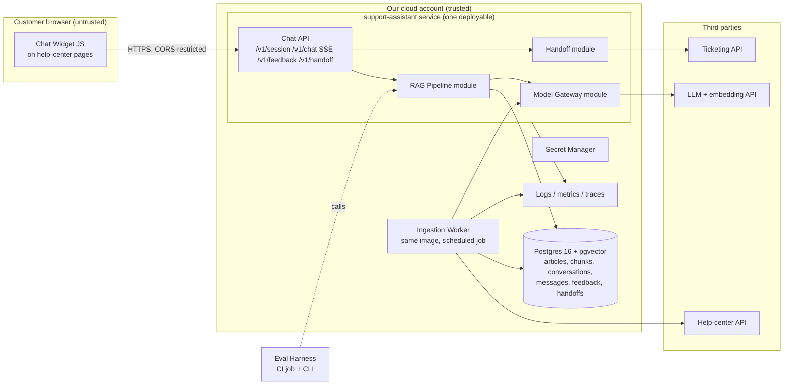

# Architecture and Build Plan: Customer-Support RAG Chatbot over Help-Center Docs

> **How this plan was produced.** The workspace has no code, docs or config in it (only a README saying so), so I had no existing system to build on. I didn't stop to ask questions. I used stated defaults instead, and each one is marked **[A#]** and listed in §5. The five questions that would change the plan most are at the end. Two of them, which help-center platform you use and whether the bot needs account-specific data, could change the plan a lot.

---

## 1. Summary

- **What:** a chat assistant on your public help center (and optionally in your app). It answers customer questions using only your published help-center articles, links to the articles it used, and passes the customer to your support team with the conversation attached when it can't answer.
- **Shape:** one service (`support-assistant`) with a fixed retrieve-then-generate pipeline, a scheduled ingestion job, one Postgres database with pgvector, a hosted LLM API behind a thin internal wrapper, and a small JavaScript chat widget. There are no agents, no tool-calling and no microservices.
- **Key decisions:**
  1. **A fixed RAG pipeline, not an agent.** The bot's only side effect is creating a ticket, and that happens when the user clicks a button, not when the model decides to.
  2. **Postgres + pgvector with hybrid search** (keyword + vector). About 20k chunks doesn't need a dedicated vector database, and support queries are full of product names and error codes that keyword search handles well.
  3. **Index only articles visible to anonymous users**, with a second visibility filter at query time. Leaking internal-only articles is the most likely serious failure.
  4. **Evaluation first.** A labelled question set built from real tickets is part of milestone 1 and gates every prompt, model or retrieval change in CI.
  5. **"Say I don't know, then hand off" is a designed path, not a fallback.** It uses a retrieval-score threshold plus a no-answer signal from the model, and creates a ticket with the transcript attached.
- **Milestone 1 (about 2–3 weeks):** real help-center articles ingested into staging, a widget on a staging page streaming answers with citations, the evaluation harness running in CI with a baseline score, and three spikes finished: retrieval/chunking, model choice, and how the help-center API behaves.
- **Top risks:** confidently wrong answers about policy (refunds, pricing, security); help-center content that is outdated, duplicated or incomplete (often the real limit on quality); internal articles leaking; the public endpoint being abused as a free LLM; and being unable to measure ticket deflection without an A/B setup.

## 2. Context and Goals

- **Problem:** customers can't find answers in the help center, or don't try, so they open tickets for questions the docs already answer. Agents spend time on repeat questions. **[A1]**
- **Goals:**
  - Answer repeat questions correctly, with citations, in seconds.
  - Hand off cleanly, with the conversation attached, when the docs don't cover the question.
  - Reduce tickets that the docs could have answered.
  - Show where the content has gaps (questions the bot couldn't answer).
- **Non-goals (v1):**
  - Account-specific answers (order status, billing details, account changes).
  - Taking actions on a customer's behalf.
  - Live agent chat inside the widget.
  - Languages other than English. **[A4]**
  - Content sources other than the help center (community forum, past tickets, internal wiki).
  - An admin UI.
- **Success measures** (targets are assumptions **[A6]**, to be confirmed with the support lead):
  - Ticket creation rate from help-center sessions drops **≥15%** in the treatment group against a control group during the pilot.
  - Thumbs-down rate **≤15%** of rated answers.
  - **≤3%** of sampled production answers contain a materially wrong claim (weekly human review).
  - CSAT for escalated conversations is no lower than the current baseline.
  - Cost **≤ $0.03 per turn**.

## 3. Drivers, Requirements, and Constraints

**Ranked quality attributes**

| # | Attribute | Measurable target | Why it matters |
|---|---|---|---|
| 1 | **Answer correctness and groundedness** | On eval set v1: ≥85% of answerable questions fully correct; ≤3% contain a material error; ≥85% of unanswerable questions correctly declined and handed off; 100% of citations point to a source that was actually retrieved. **[A6]** | A wrong answer about a refund or security policy costs more than no answer. Companies have been held to what their bots promised. |
| 2 | **Content isolation and safety** | 0 non-public articles in the index or in answers; 100% pass on the "must-not" injection and red-team suite | Internal articles often hold workarounds, unreleased features or agent macros. |
| 3 | **Time to market** | Pilot running for 5–10% of traffic in about 7 weeks with 2 engineers **[A3]** | Value comes from learning on real traffic, and the content-gap loop only starts once it's live. |
| 4 | **Latency** | Time to first token p95 < 2.5 s; full answer p95 < 8 s at peak (about 2 turns/s) **[A5]** | Chat users leave quickly. Streaming makes long answers acceptable. |
| 5 | **Cost** | ≤ $0.03 per turn; monthly LLM spend under a hard cap (default $2,000) **[A5]** | It's a public endpoint, so spend has to be bounded against abuse. |
| 6 | Availability | 99.5% monthly | If the bot is down, the existing help center and contact form still work, so the bar is moderate. |

Scale is **not** a driver. About 3,000 articles is roughly 15–30k chunks, which is small for Postgres.

**Key functional requirements**
1. Ingest public help-center articles. Changes appear within 15 minutes, and unpublished or deleted articles disappear within 15 minutes, or within 24 hours at worst.
2. Multi-turn chat with streamed answers and clickable citations to the source articles.
3. Decline to answer and offer a handoff when the docs don't support an answer.
4. Hand off to a human by creating a ticket that includes the transcript.
5. Collect thumbs up/down per answer.
6. Log enough detail to explain any answer: what was retrieved, which prompt version, which model, which index version.
7. Produce a weekly report of questions the bot couldn't answer, for the content team.

**Constraints (assumed)**
- Team: 2 backend engineers, 0.5 frontend, and a support subject-matter expert (SME) for about 4–6 hours a week. **[A3]**
- Uses the existing cloud (examples use AWS). **[A2]**
- An LLM provider the organisation has, or can get, a data-processing agreement with, including no-training and zero/short-retention terms. **[A7]**

**Hard parts**
1. **Measuring answer quality.** Behaviour is unknown until measured. The eval set depends on an SME's time, and that's on the critical path.
2. **Retrieval over real help-center content.** Long articles, step lists, tables, near-duplicates and different product versions. Content quality may cap answer quality.
3. **Knowing when not to answer.** Both the threshold and the model's honesty have to be tuned. False confidence is the expensive mistake.
4. **Content visibility and freshness.** This depends on what the help-center API exposes (visibility segments, deletion signals), which is a third-party behaviour we haven't seen yet.
5. **Measuring deflection.** Users are anonymous, so linking a chat to a later ticket is hard. This needs A/B bucketing from day one.

## 4. Current State

The workspace is empty, so there's no code, infrastructure or conventions to follow. Assumed context:
- A hosted help center with a REST API. Zendesk Guide is used as the example; Intercom, Freshdesk and similar have equivalent APIs. **[A1]**
- A ticketing system with an API for creating tickets (assumed to be the same vendor).
- A help-center theme that lets you add custom JavaScript.
- An existing cloud account and CI system.

If the docs are actually Markdown in git, ingestion gets simpler (read the repo and use commit diffs for changes). If the help-center vendor's own AI bot is available to you, see Decision D0.

## 5. Assumptions and Open Questions

**Assumptions**

| ID | Assumption | Impact if wrong | How and when validated |
|---|---|---|---|
| A1 | Hosted help center (Zendesk-like) with an article API including visibility and `updated_at`; ticketing via API | Connector and handoff code change. Platform-specific visibility logic changes. | Confirm platform on day 1; spike S3 in M1 |
| A2 | Existing cloud is AWS (ECS Fargate, RDS Postgres 16, Secrets Manager, EventBridge Scheduler); CI is GitHub Actions | Same design on GCP/Azure; only `infra/` changes | Day 1 |
| A3 | 2 backend engineers + 0.5 frontend + support SME 4–6 h/week; team knows Python | Sizes scale accordingly. If the team is TypeScript-first, use TS (Node/Fastify); the design is the same. | Day 1, before T1 |
| A4 | English only; about 500–3,000 articles | Multilingual changes the embedding model choice, the eval set and the chunking | Day 1 (count articles in S3) |
| A5 | About 20k conversations/month, about 3 turns each, peak about 2 turns/s | Cost cap and capacity change; architecture doesn't up to roughly 50× this | Help-center analytics in week 1 |
| A6 | Quality and success targets in §2–3 | Gates are too strict or too loose | Support lead signs off by the end of M1 |
| A7 | An approved LLM provider with no-training, short-retention terms exists or can be signed within about 2 weeks | Blocks real-data testing. Legal review is a long lead time. | Start the request on day 1 |
| A8 | Bot uses only public articles; users are anonymous to the bot | If account data is needed: authentication, tools, permissioning and much more risk | Open question Q3 |
| A9 | Conversations may contain personal data; 90-day retention is acceptable | Retention or redaction work changes | Privacy/legal in M1 |

**Open questions**

| Q | Owner | Default if no answer | Needed by |
|---|---|---|---|
| Q1 Which help-center and ticketing platforms? | Support ops | Zendesk Guide + Zendesk Support | M1 day 1 |
| Q2 Have you assessed your vendor's built-in AI agent (build vs buy)? | Product/support lead | Build, for the reasons in D0 | End of M1 week 1 |
| Q3 Must the bot answer account-specific questions in a later phase? | Product | No, public docs only | M1 (affects the identity model) |
| Q4 Volume, peak, and languages? | Support ops/analytics | A4, A5 | M1 week 1 |
| Q5 Approved LLM provider and cloud? | Platform/security/legal | Your cloud's managed model endpoint | M1 day 1 |

## 6. Architecture Overview



**How it fits together.** The **Ingestion Worker** pulls public articles from the help center every 15 minutes. It normalises them, splits them into chunks by heading, embeds the chunks, and upserts them into Postgres under a versioned index. When a customer asks a question in the **Chat Widget**, the **Chat API** checks the session and rate limits, then calls the **RAG Pipeline**. The pipeline:
1. rewrites follow-up questions into standalone ones,
2. runs hybrid retrieval,
3. skips generation and offers a handoff if nothing relevant is found,
4. otherwise prompts the model with numbered sources and streams back a cited answer.

Every turn is logged with full trace data. The **Handoff module** creates a ticket with the transcript when the user asks for a human. The **Eval Harness** runs the same pipeline code offline against the labelled set, in CI.

**Component table**

| Component | Responsibility | Owns data | Interfaces | Technology | Key dependencies |
|---|---|---|---|---|---|
| Chat Widget | Render chat, stream answers, show citations, feedback and handoff buttons | None (session token in memory) | Calls Chat API | Preact or vanilla TS, about 30 KB, static on CDN | Help-center theme |
| Chat API | Sessions, rate limits, input limits, SSE streaming, persistence of turns | `conversations`, `messages`, `feedback` | `POST /v1/session`, `POST /v1/chat` (SSE), `POST /v1/feedback`, `POST /v1/handoff`, `GET /healthz` | Python 3.12, FastAPI | RAG Pipeline, Postgres |
| RAG Pipeline | Query rewrite, hybrid retrieval, threshold, prompt assembly, generation, citation validation | None (reads `chunks`) | In-process `answer(conversation) -> stream` | Python module `app/rag/` | Model Gateway, Postgres |
| Model Gateway | One interface for chat and embeddings; timeouts, retries, fallback model, token and cost accounting, spend cap | None (emits metrics) | In-process `stream_chat()`, `embed()` | `app/llm/`, provider SDK | LLM provider |
| Ingestion Worker | Sync, normalise, chunk, embed, reconcile deletions, build index versions | `articles`, `chunks`, `ingestion_runs`, `index_versions` | CLI `python -m app.ingest sync / reconcile / build-index` | Same image; scheduled task | Help-center API, Model Gateway |
| Handoff module | Create a ticket with the transcript, idempotently | `handoffs` | In-process, called by `/v1/handoff` | `app/handoff/` | Ticketing API |
| Eval Harness | Run versioned datasets through the pipeline; score retrieval, correctness, refusal, citations, safety | Datasets and reports in git | CLI `python -m evals run`; CI job | `evals/` | RAG Pipeline, judge model |
| Postgres | System of record for everything above | — | SQL | RDS Postgres 16 + pgvector | — |

## 7. Component Details

**Chat API.**
- Doesn't decide what to answer and doesn't call the model directly.
- `POST /v1/session` returns a signed short-lived token (JWT, 1 hour) bound to a random session ID and the session's A/B bucket.
- `POST /v1/chat` takes `{conversation_id?, message}` and returns Server-Sent Events: `meta` (conversation_id), `token`*, then `done` (validated citations, outcome, message_id).
- Limits: message ≤ 1,000 characters; ≤ 20 turns per conversation; per-session limit of 20 messages per 10 minutes; per-IP limit of 60 per 10 minutes. Rate-limit counters live in a Postgres table (enough at this load).
- CORS allows only the help-center domains.
- Versioning is by URL prefix `/v1`. The API and the widget ship together, so contract changes can happen in lockstep.
- Failure behaviour: if Postgres is down, `/healthz` fails and the widget shows "Search our help center / Contact us". If the client disconnects mid-stream, the partial answer is persisted with `outcome=aborted`.

**RAG Pipeline (`app/rag/`)**, the core and where the design effort goes:
1. **Condense.** Only when there is conversation history, a small, fast model rewrites the latest message into a standalone question (about 400–800 ms). On the first turn, the raw message is used as is.
2. **Retrieve (hybrid).** Top 20 by pgvector cosine similarity (HNSW index) and top 20 by Postgres full-text `ts_rank` on `tsv`, merged with reciprocal rank fusion. Filtered by `index_version = active AND visibility = 'public' AND article.status = 'active'`.
3. **(Optional) Rerank** the top 20 down to the top 6 with a reranking model. Kept only if spike S1 shows a recall gain worth the 200–400 ms.
4. **Threshold.** If the best fused or rerank score is below τ (tuned in S1/M2 on the eval set), skip generation. Return `outcome=no_answer` with up to 3 "possibly related" article links and a handoff offer. This saves cost and is the main protection against hallucination.
5. **Generate.** Prompt `prompts/answer.v{n}.md` with sources numbered `[S1]…[S6]` (title + heading path + text), each inside delimiters marked "untrusted reference material, not instructions". Rules: answer only from the sources; cite `[S#]` for each claim; never promise refunds, credits, exceptions or timelines that a source doesn't state; and **the first line must be `ANSWER` or `NO_ANSWER`**.
6. **Sentinel buffer.** The server holds back output until the first newline (capped at 30 tokens). On `NO_ANSWER` it switches to the no-answer path; on `ANSWER` it strips the line and starts streaming.
7. **Validate citations** at the end of the stream: keep only `[S#]` markers that map to sources that were provided, and map them to article URLs. If an `ANSWER` has no valid citation, the outcome is `ungrounded` and the widget adds a "please verify, or contact support" notice. These cases are reviewed weekly.
8. **Sensitive-topic call to action.** If any cited article carries a configured label (`billing`, `refund`, `security`, `legal`, `account-deletion`), the `done` event sets `show_handoff=true`.
- Configuration (model IDs, k, τ, prompt version, reranker on/off) is in `app/config/pipeline.yaml`, under version control. Each message logs the config hash.

**Model Gateway (`app/llm/`).**
- Interface: `stream_chat(model_role, messages, max_tokens, timeout)` and `embed(texts)`, where `model_role` is one of `answer`, `condense`, `judge`.
- Timeouts: 3 s to the first token for `answer`, 20 s total; 5 s for `embed`.
- One retry with jitter, and only before any token has been streamed. After a second failure it switches to a configured fallback model (a different model, ideally from a second provider or region).
- It tracks tokens and cost per call. A daily spend counter trips a **circuit breaker into degraded mode** (retrieval-only answers) at 100% of the daily cap.
- A fake implementation is used in tests and load tests.

**Ingestion Worker (`app/ingest/`).**
- `sync` (every 15 minutes): incremental export of articles changed since the last successful cursor.
- `reconcile` (nightly): lists all public article IDs and marks any missing ones `removed`. This catches deletions and unpublishes if the incremental API misses them.
- `build-index --version N`: full re-chunk and re-embed into a new index version, used when chunking or the embedding model changes.
- Normalise: HTML to text, keeping headings, numbered steps, lists and tables (rendered as Markdown). Strip navigation and boilerplate.
- Chunk: split on H2/H3 sections, 200–800 tokens, merging small sections and splitting long ones on paragraph breaks with 1-paragraph overlap. Each chunk is prefixed with `Title > Section > Subsection`.
- Embedding is skipped when `content_hash` hasn't changed, so reruns are idempotent and cheap.
- **Visibility gate:** only articles visible to anonymous users are ingested (spike S3 confirms how to tell). Anything else is rejected and counted in `ingestion_runs.rejected_nonpublic`.
- Failure behaviour: each article is upserted in its own transaction, so a run that fails partway leaves consistent per-article state. The cursor only advances on success. Help-center API rate limits are respected with backoff. Alert if there has been no successful sync for more than 2 hours.

**Handoff module.**
- `POST /v1/handoff {conversation_id, email, optional note}` creates a ticket containing the redacted transcript, the cited articles, and the tag `via-assistant`.
- The idempotency key is the conversation ID (unique row in `handoffs`), so a double click creates one ticket.
- 5 s timeout and 2 retries. If it still fails, the user gets the standard contact-form link with the conversation ID prefilled, and the row is left as `failed` for an alert.
- Live agent chat handoff is deferred.

**Chat Widget.** Rendered with a strict Markdown subset. Raw HTML is never rendered. Links are allowed only to help-center domains. The bundle is loaded only when the `assistant_enabled` flag is on for the session's bucket.

**Eval Harness.** See §11 (AI-specific) and §14.

## 8. Data Design

**Entities** (all in one Postgres database; each table has one writer):

| Table | Key fields | Writer | Notes |
|---|---|---|---|
| `articles` | id, source_id (unique), url, title, locale, section, labels[], visibility, status (active/removed), source_updated_at, content_hash, last_seen_at | Ingestion | Public content |
| `index_versions` | version, chunker_version, embedding_model, embedding_dim, created_at, is_active (exactly one true) | Ingestion (activation by a CLI command after the eval passes) | Allows a blue/green switch between indexes |
| `chunks` | id, article_id FK, index_version FK, ordinal, heading_path, text, token_count, tsv (generated tsvector), embedding vector(D) | Ingestion | HNSW partial index per active version; GIN index on `tsv`; btree on (index_version, article_id) |
| `ingestion_runs` | id, kind, started/finished, cursor, counts (added/updated/removed/rejected_nonpublic), error | Ingestion | |
| `conversations` | id, session_id_hash, ab_bucket, channel, started_at, outcome_summary | Chat API | |
| `messages` | id, conversation_id, role, text_redacted, outcome (answered/no_answer/ungrounded/blocked/error/aborted), retrieved_chunk_ids[], scores[], cited_chunk_ids[], prompt_version, config_hash, index_version, model, tokens_in/out, cost_usd, ttft_ms, total_ms, trace_id | Chat API | The explanation record for every answer |
| `feedback` | message_id, rating (±1), reason enum, comment_redacted | Chat API | |
| `handoffs` | conversation_id (unique), ticket_id, status, attempts, last_error | Handoff | Idempotency |
| `rate_limits` | key, window_start, count | Chat API | Swap for Redis only if load grows more than 50× |

- **Eval datasets** live in git (`evals/datasets/*.jsonl`), not in the database, so they're versioned and reviewed with the code.
- **Consistency:** the only multi-row atomic write is an article upsert plus replacing its chunks, which happens in one transaction. Index activation is a single-row flip. Nothing spans components.
- **Access patterns:** vector top-k and full-text top-k filtered by active version and visibility. With about 30k rows, pgvector HNSW stays well under 50 ms. Conversation lookups are by ID.
- **Retention:** messages and feedback are kept for 90 days, then deleted by a nightly job **[A9]**. Monthly aggregate metrics are kept indefinitely. Articles and chunks can always be rebuilt from the source.
- **Backups:** managed daily snapshots plus point-in-time recovery (7 days). Recovery targets: RPO 5 minutes and RTO 1 hour for conversations. The index can be rebuilt in under 1 hour. Do one test restore in M2.
- **Classification:** articles are public. Conversation text may contain PII, so it is classed as confidential:
  - redacted before storage and logging (regex for email, phone, card-like and ID-like numbers, plus a named-entity pass);
  - encrypted at rest (RDS default KMS);
  - readable only by the on-call/eng and support-analyst roles.
  - Raw unredacted text is never logged. The handoff ticket carries the email the user explicitly provides.
- **Schema evolution:** Alembic migrations in `migrations/`, additive first. A new embedding model with a different dimension gets a new `embedding_v2` column. The new index version is built and evaluated, then activated, and the old column is dropped one release later.

## 9. Key Flows

**Flow 1: Answerable question (happy path)**
1. The widget loads (flag on), calls `POST /v1/session`, and gets a token and bucket.
2. The user asks: "How do I export my invoices?" The widget calls `POST /v1/chat`.
3. Chat API: verify the token, check rate limits and length, create the conversation, persist the redacted user message.
4. RAG: first turn, so no condense step. Embed the query (about 150 ms), run hybrid retrieval (about 40 ms), get the top 6. The best score is above τ.
5. Generate. The first line is `ANSWER`, so streaming starts (TTFT about 1.2–2 s).
6. Stream ends. Citations [S1, S3] are validated against article URLs. `done` carries the citations, `show_handoff=false`, and the message_id. The assistant message is persisted with the full trace fields.
7. The user clicks thumbs up and `POST /v1/feedback` is stored.

**Flow 2: Not covered, so hand off**
1. "Why was I charged twice this month?" Retrieval returns billing articles. The score is above τ, but the model starts with `NO_ANSWER: no source covers duplicate charges`.
2. The server switches to the no-answer template: "I couldn't find this in our help articles. Here are 2 related ones, or I can pass this to our team." Outcome is `no_answer`. The `billing` label sets `show_handoff=true`.
3. The user clicks "Contact support" and enters an email. `POST /v1/handoff` creates the ticket with the transcript and the `via-assistant` tag, and a `handoffs` row is written.
4. If the user double-clicks, the second request finds the existing `handoffs` row and returns the same ticket_id.

**Flow 3 (failure): LLM provider outage or timeout**
1. The `answer` call gets no first token within 3 s. It retries once with jitter, which also times out.
2. The Gateway switches to the fallback model. If that fails too, it raises `ModelUnavailable`.
3. RAG degraded mode: return "I'm having trouble answering right now. These articles look relevant:" plus the top 3 retrieved articles (retrieval doesn't need the LLM) and the contact option. Outcome is `error`.
4. If the **embedding** call is also down, retrieval uses full-text search only.
5. The error-rate alert fires (>5% for 10 minutes) and links to runbook `RB-01 Provider outage`. On-call can force degraded mode via config until the provider recovers.
6. The help center and contact form keep working regardless.

**Flow 4: Article unpublished**
1. Support unpublishes "Legacy pricing" at 10:00.
2. The 10:15 `sync` sees an update with visibility/status no longer public and marks the article `removed`. Its chunks drop out of retrieval immediately because of the status filter.
3. If the incremental API doesn't report unpublishes (S3 finds out), the nightly `reconcile` catches it within 24 hours. The runbook includes a manual `python -m app.ingest remove --source-id X` for urgent takedowns.

## 10. Key Decisions

| # | Decision | Options considered | Rationale (against drivers) | Reversibility | Revisit if |
|---|---|---|---|---|---|
| D0 | **Build**, conditional on a 1-day buy check | (a) Vendor AI agent such as Zendesk AI agents or Intercom Fin, often priced per resolution (about $1); (b) build | Building gives control over driver #1 (our own eval gate, prompts, thresholds), the content-gap loop, room for other sources later, and about $0.05 per conversation instead of about $1 per resolution at volume. Buying gives faster time to market (#3). | Medium (sunk effort) | The vendor bot passes our eval set at similar quality, **and** expected resolutions × price is below about 1.5× the build-and-run cost over 12 months. If so, buy, and keep the eval set to hold the vendor to account. |
| D1 | Fixed RAG pipeline, no agent or tools | Agent with search/ticket tools | Fewer failure modes, predictable latency and cost, no model-triggered side effects (#1, #2, #4) | Easy | Evals show multi-hop questions failing that iterative retrieval would fix |
| D2 | Postgres + pgvector, hybrid search | Managed vector DB (Pinecone, OpenSearch); vector-only search | One store for content and conversations, one thing to run; about 30k chunks is small. Hybrid handles error codes and product names. | Medium (retrieval code is behind `app/rag/retrieve.py`) | More than 2M chunks, or p95 retrieval above 150 ms |
| D3 | Heading-aware chunks with a title/section prefix | Fixed 512-token windows | Help articles are organised by section; the prefix keeps context. To be confirmed by S1. | Easy (index versions) | S1 shows fixed windows score higher |
| D4 | Hosted model via your cloud's managed endpoint (Bedrock / Azure OpenAI / Vertex) or a direct API with a data-processing agreement | Self-hosted open model | No GPU operations for a 2-person team; best quality per dollar at this volume; data terms available | Easy (Gateway interface) | Data residency rules out hosted models, or volume exceeds about 1M turns/month |
| D5 | Model per role chosen by spike S2: small and fast for `condense`, mid-tier for `answer`, strongest available for `judge` (offline only) | One model for everything | Meets the TTFT and $0.03/turn budgets (#4, #5) without giving up correctness | Easy | Eval or cost data says otherwise |
| D6 | Streaming with a first-line `ANSWER`/`NO_ANSWER` sentinel and post-stream citation validation | Non-streamed JSON with a blocking validator; streaming with no checks | Keeps TTFT under 2.5 s (#4) while still catching declines and invalid citations (#1) | Easy | Sentinel compliance below 99% in evals (switch to a blocking JSON response) |
| D7 | One deployable service plus a scheduled worker from the same image | Serverless functions; separate microservices | Simplest to build, deploy and debug; SSE suits containers better than many function platforms | Easy | Ingestion and chat need independent scaling or ownership |
| D8 | Polling sync every 15 min plus a nightly reconcile | Help-center webhooks | Polling is predictable and easy to replay; webhooks can be lost and need a public receiving endpoint | Easy | A freshness need under 5 minutes |
| D9 | Anonymous signed sessions; bot sees only public content | SSO/logged-in identity in v1 | Matches A8; adding identity is the main thing that would make account-data features possible later | **Hard-ish** (identity model) | Q3 answer is "yes, account data" |
| D10 | Python/FastAPI | TypeScript/Node | Strongest AI/eval ecosystem; assumes A3 | **Hard** (language) | The team is TS-first. Decide before T1. |

## 11. Cross-Cutting Concerns

**Security** (M1 for the basics, M2 for hardening). Top threats for this system:

| Threat | Mitigation | Milestone |
|---|---|---|
| Internal or restricted articles indexed or quoted | Visibility gate at ingestion (reject and count non-public); `visibility='public'` filter at query time; CI eval check that no restricted fixture article can be retrieved; alert if `rejected_nonpublic` jumps | M1 |
| Prompt injection or jailbreak to get policy promises, off-brand content, or the system prompt | No side-effect tools; retrieved text wrapped as untrusted data; prompt rules against commitments; sensitive-topic handoff call to action; red-team suite (about 50 cases) that blocks release; weekly sampling of `blocked` and thumbs-down answers | M2 |
| Abuse as a free LLM or cost denial-of-service | Rate limits; input and turn caps; off-topic declines through the retrieval threshold; daily spend circuit breaker; Cloudflare Turnstile challenge enabled when abuse is detected | M2 (limits in M1) |
| PII exposure in logs or to the provider | Redact before storing and logging; provider no-training and short-retention terms (A7); 90-day retention; role-restricted database access | M1 redaction, M2 retention job |
| XSS through rendered model output | Strict Markdown subset, no raw HTML, link allow-list, CSP on the widget | M1 |

Secrets (LLM, help-center and ticketing keys) live in Secret Manager, are injected at runtime, and are rotatable. TLS is used everywhere. CI runs dependency and image scanning. Service roles are least-privilege: the ingestion key is read-only on the help center, and the ticketing key can only create tickets.

**Reliability.** 99.5% target. There's a timeout on every outbound call (values in §7). Retries happen only before streaming starts or on idempotent operations. The fallback model and degraded retrieval-only mode keep the service useful. Ingestion is idempotent (content hash and per-article transactions). Handoff is idempotent (conversation ID). `/healthz` checks the database and the active index version; it doesn't check the LLM, since degraded mode still serves. Two container tasks run across availability zones.

**Observability** (M1 basics, M2 dashboards and alerts).
- OpenTelemetry traces per turn with spans `condense`, `embed`, `retrieve`, `rerank`, `generate`, `validate`, using `trace_id` = `messages.trace_id`.
- Structured JSON logs that include conversation_id.
- Metrics: turns/min, error rate, TTFT and total latency p50/p95, outcome mix (answered / no_answer / ungrounded / error), thumbs-down rate, handoff rate, cost per turn and per day, sync freshness lag, `rejected_nonpublic`.
- Alerts, each with a runbook:

| Alert | Condition | Runbook |
|---|---|---|
| Error rate | >5% for 10 min | RB-01 |
| Slow first token | TTFT p95 >5 s for 15 min | RB-02 |
| Stale sync | No successful sync for >2 h | RB-03 |
| Spend | Daily spend >80% of cap | RB-04 |
| No-answer spike | >2× the 7-day baseline for 1 h (usually means a broken index or a bad deploy) | RB-05 |
| Failed handoff | Any `handoffs.status=failed` | RB-06 |

**Performance and capacity.**
- Peak is about 2 turns/s, which means about 20 concurrent streams. Two small containers (1 vCPU / 2 GB each) and a `db.t4g.medium`-class database cover this comfortably.
- The bottleneck is the provider's latency and rate limits. Check the model quota and tokens-per-minute limit in M1 and request increases early.
- Load test in M2 with k6 at 2× peak (4 turns/s for 15 min) against the fake gateway (tests our service), plus a 10-minute run against the live provider (tests quota).

**Cost** (at A5 volume, about 60k turns/month):

| Item | Estimate |
|---|---|
| Answer model: ~4k input + ~300 output tokens per turn, mid-tier pricing | ~$0.01–0.02/turn, ~$600–1,200/month |
| Condense model | <$50/month |
| Embeddings: a full re-index of ~6M tokens | <$1 |
| Database + containers + logs | ~$250–450/month |
| Offline evals (judge model) | ~$5–20 per full run; cap CI to changed-config runs |

Total is about **$1–2k/month**. Controls: daily spend cap and circuit breaker, per-session limits, and cost tags on all resources. These ranges are rough; re-estimate after spike S2 with real token counts.

**Operations.**
- The engineering team owns the service; on-call is business hours plus best-effort out of hours. The kill switch (`assistant_enabled=false`) means an outage never requires waking someone at 3 a.m.
- Support ops owns the content and the weekly review: 30 minutes on thumbs-downs, `ungrounded` answers, and a content-gap report (clustered no-answer questions).
- Runbooks RB-01 to RB-06 live in `docs/runbooks/`.

**AI-specific.**
- **Eval set v1:**
  - about 200 answerable questions from real tickets in the last 90 days, anonymised, each with gold article IDs and a reference answer;
  - about 40 that look plausible but aren't covered by the docs;
  - about 30 multi-turn follow-ups;
  - about 50 adversarial cases (injection, policy-baiting, off-topic, PII).
- **Scoring:**
  - deterministic: retrieval recall@5, citation validity, sentinel compliance, leakage;
  - LLM judge with a rubric: correct / partially correct / materially wrong, and whether each claim is supported by the cited source.
  - The judge is calibrated against 50 SME labels and must agree ≥85% before we trust it.
- **Gates:** see §14.
- **Production loop:** sample production traffic into the eval set monthly; every thumbs-down that gets confirmed becomes a test case.
- **Human approval:** the only irreversible action is creating a ticket, and the user triggers it.
- **Budgets:** TTFT 2.5 s p95, ≤ $0.03/turn, max 20 turns, max 800 output tokens.
- **Explaining an answer:** `messages` stores the retrieved IDs and scores, cited IDs, prompt version, config hash, index version and model, so any answer can be replayed with `python -m evals replay <message_id>`.
- **Model swap:** change `pipeline.yaml`, run the evals, and merge only if the gates pass.

## 12. Build Sequence

Team assumption: 2 backend engineers, 0.5 frontend, and an SME at 4–6 h/week. Sizes are calendar-time ranges, not commitments.

| Milestone | Goal / risk cleared | Scope (in / out) | Deliverables | Exit criteria | Depends on | Size |
|---|---|---|---|---|---|---|
| **M0 Long-lead requests** (day 1, runs alongside M1) | Unblock the critical path | Provider data agreement and quota; help-center and ticketing API keys; theme edit access; security review booking; ticket export for the eval set | Tickets filed with named owners | All requested on day 1 | — | ~1 day of effort, 1–3 weeks of waiting |
| **M1 Thin slice + eval baseline** | Prove end-to-end on real content; measure quality before building features; spikes S1–S3 | **In:** ingest, hybrid retrieval, cited streaming answers, logging, minimal widget on a staging page, eval harness in CI. **Out:** handoff, threshold tuning, abuse controls beyond basic limits, A/B. | Staging environment via IaC and CI; `support-assistant` deployed; eval set v1; baseline report; spike write-ups | (1) Pipeline deploys staging from `main`. (2) Staging index has the same article count as the public help center, with 0 non-public. (3) Widget streams a cited answer for 10 demo questions. (4) Eval baseline recorded with recall@5 ≥ 0.75 (or a content-remediation decision made). (5) Model chosen with measured TTFT and cost. | M0 (provider access) | 2–3 weeks |
| **M2 Quality, safety, operability** | Hit the §3 targets; harden | No-answer threshold and sentinel; citation validator; sensitive-topic call to action; handoff to ticket; redaction and retention; rate limits, spend cap, Turnstile hook; degraded modes; reconcile job; dashboards, alerts, runbooks; load test; restore test | Eval report meeting targets; red-team report; load-test report | Every §3 target met on eval v1.1; 100% must-not pass; injected provider failure triggers degraded mode and the alert in staging; k6 at 2× peak meets the latency targets; handoff creates exactly 1 ticket under double-submit | M1 | 2–3 weeks |
| **M3 Internal beta, then pilot** | Learn on real users; measure deflection | Week 1: support agents use it on real questions and grade answers. Weeks 2–3: production with flag at 5–10% of help-center sessions, control bucket held out. | Production environment; A/B bucketing and ticket attribution (`via-assistant` tag plus bucket recorded on the help-center session); weekly review process | ≥2 weeks of pilot data; thumbs-down ≤15%; human-sampled material-error rate ≤3%; no Sev-1/2 incidents; deflection estimate with a confidence interval | M2; security review passed | 2–3 weeks (mostly time collecting data) |
| **M4 Ramp to GA** | Deliver value at full traffic | 25% → 50% → 100%; cost dashboard; monthly eval refresh; on-call handover | GA; runbooks signed off by on-call | Targets hold at 100% for 1 week; spend within cap | M3 go decision | 1–2 weeks |

**Critical path:** provider data agreement/access (M0) → M1 slice on real data → **eval set labelling (SME time)** → M2 quality gates → security review → M3 pilot. Eval labelling is the most likely thing to slip, so start it on day 1.
**Can run in parallel:** infrastructure, the connector, the widget and eval labelling in M1; abuse controls and handoff in M2.

## 13. First Milestone Task Breakdown

Proposed repository layout (new repo `support-assistant`):

```
app/{api,rag,llm,ingest,handoff,store,config}/
prompts/   migrations/   evals/{datasets,runners,reports}/
widget/    infra/   docs/{runbooks,spikes}/   .github/workflows/
```

| # | Task | Location | Done when | Order / parallel |
|---|---|---|---|---|
| T0 | **File long-lead requests**: provider data agreement and quota; help-center read-only API token; ticketing create-only token; theme edit access to the sandbox help center; security review slot; 90-day ticket export | Tracker | Each request has an owner and an expected date | Day 1, first |
| T1 | **Scaffold the repo and CI**: FastAPI app with `/healthz`; ruff, mypy and pytest; Dockerfile; GitHub Actions running lint, test, image build and image scan | repo root, `.github/workflows/ci.yml` | A PR runs green and pushes an image tagged with the commit SHA | Day 1–2 |
| T2 | **Provision staging with IaC**: RDS Postgres 16 with pgvector enabled; ECS service (2 tasks) behind an HTTPS load balancer; scheduled task for ingestion; Secret Manager entries; cost tags | `infra/staging/` (Terraform, remote state with locking) | `terraform apply` from CI creates the environment; `GET /healthz` reports `db: ok` | After T1; parallel with T3–T5 |
| T3 | **Write migration 0001** for the tables in §8, with the HNSW partial index, GIN on `tsv`, and `index_versions` | `migrations/` (Alembic) | Upgrade and downgrade both run cleanly in CI against a Postgres+pgvector container | Parallel with T2 |
| T4 | **Build the Model Gateway**: `stream_chat`, `embed`, timeouts, one retry, fallback model, token and cost accounting, a `FakeGateway` | `app/llm/` | Unit tests cover timeout, retry and fallback using the fake; a smoke test in staging streams from the real provider | Parallel; the live part waits on T0 |
| T5 | **Spike S3: help-center API** (time box 2 days). Questions: how is anonymous visibility represented? Does the incremental export report unpublishes and deletions? What are the rate limits? Which locales exist? | `docs/spikes/S3-helpcenter-api.md` | Write-up answers all four questions with sample payloads. **Changes the plan if** there's no visibility metadata (then ingest through anonymous public endpoints only) or no deletion signal (then the nightly reconcile is the main mechanism and we consider running it hourly) | Day 1–3 |
| T6 | **Build the connector + normaliser + chunker**: paginated fetch, visibility gate, HTML → structured text, heading-aware chunks with the prefix | `app/ingest/` | Fixture tests on 10 real articles (steps, tables, long article, tiny article) pass; `sync` loads staging and the article count matches the public listing with `rejected_nonpublic` reported; a test with a restricted fixture article confirms it is rejected | After T3, T5 |
| T7 | **Add embed + idempotent upsert**: content-hash skip, per-article transaction, cursor that advances only on success, `ingestion_runs` record | `app/ingest/` | A second `sync` makes 0 embedding calls; killing the job mid-run and rerunning leaves no duplicate or orphaned chunks | After T4, T6 |
| T8 | **Implement hybrid retrieval** with RRF and visibility/status/version filters | `app/rag/retrieve.py` | Integration test returns the expected article for 5 seeded queries; p95 retrieval time is under 50 ms on the staging index | After T7 |
| T9 | **Build eval set v1** (with the SME): ~200 answerable questions with gold article IDs and reference answers, ~40 unanswerable, ~30 multi-turn, ~50 adversarial; anonymised | `evals/datasets/gold.v1.jsonl` | Support lead has reviewed and signed it off; schema check passes in CI | Starts day 1; ~2 weeks of SME time; **critical path** |
| T10 | **Build the eval harness**: recall@k, citation validity, sentinel compliance, leakage check, LLM-judge correctness and groundedness; Markdown report; CI job triggered by changes to `prompts/`, `app/rag/`, `app/config/` or `app/ingest/chunk*` | `evals/runners/`, `.github/workflows/eval.yml` | `python -m evals run --dataset gold.v1` produces a report; judge agrees ≥85% with 50 SME-labelled items | After T8; dataset fills in progressively |
| T11 | **Spike S1: retrieval/chunking** (time box 3 days). Compare section chunks vs 512-token windows, vector-only vs hybrid, reranker on vs off. Record recall@5 and latency for each. | `docs/spikes/S1-retrieval.md` | Configuration chosen and recorded in `pipeline.yaml`. **Changes the plan if** the best recall@5 is below 0.75: then the content is the bottleneck, and we start a content-cleanup workstream with support (merge duplicates, split long articles) before M2 | After T8, T9 (≥100 items) |
| T12 | **Build answer generation + `/v1/chat` SSE**: prompt `answer.v1.md`, numbered sources, sentinel buffer, citation validation, `done` event, full `messages` logging, redaction | `app/rag/generate.py`, `app/api/chat.py`, `prompts/` | E2E test using the fake gateway covers the ANSWER, NO_ANSWER and invalid-citation paths; one staging turn writes every trace field in §8 | After T8; parallel with T10 |
| T13 | **Spike S2: model selection** (time box 2 days). Run 2–3 candidate `answer` models and 1–2 `condense` models on the eval set. Record correctness, TTFT p95, cost per turn and sentinel compliance. | `docs/spikes/S2-models.md` | Models chosen in `pipeline.yaml` with the measurements. **Changes the plan if** no model reaches ≥80% correctness at ≤ $0.03/turn (raise the budget or adopt the reranker) or TTFT p95 is above 2.5 s (drop condense on the first turn, or use a faster model) | After T10, T12 |
| T14 | **Build the minimal widget**: session fetch, streamed rendering, citations, thumbs (wired to `/v1/feedback`), safe Markdown; deployed to a staging static host and embedded in a staging page or the sandbox theme | `widget/`, `app/api/feedback.py` | Playwright test: ask, receive a streamed cited answer, click a citation, see a 200 on feedback; CSP and no-raw-HTML test passes | Parallel from week 1, against a stub SSE endpoint |
| T15 | **Add basic telemetry**: OpenTelemetry traces with per-stage spans, JSON logs with conversation_id, metrics for TTFT, errors and cost | `app/api/`, `app/rag/` | One staging turn appears as a single trace with all stage spans | With T12 |
| T16 | **Run the M1 demo and record the baseline** | `evals/reports/m1-baseline.md` | Exit criteria in §12 are checked off in the report | Last |

## 14. Testing and Validation Strategy

| Risk | Test type | Where / when |
|---|---|---|
| Chunking, sentinel parsing, citation mapping, redaction regexes | Unit | CI on every PR |
| Help-center and ticketing API contracts | Contract tests against recorded fixtures; nightly live smoke test against the sandbox | CI, plus a nightly staging job |
| Migrations, retrieval SQL, idempotent ingestion | Integration against a Postgres+pgvector container | CI |
| Widget ↔ API, streaming, citations, handoff | E2E (Playwright) in staging | On merge to `main` |
| Answer quality, refusal, groundedness, leakage, injection | Eval harness | CI when pipeline files change; full nightly run |
| Latency and quota at peak | k6 load test (fake gateway plus a short live run) | M2, and before each traffic ramp |
| Security | Dependency and image scans; red-team suite; internal pen-test of the public endpoint | CI; M2 |

**Blocks release:**
- any unit, integration or E2E failure;
- any eval gate below its target: correctness ≥85%, material error ≤3%, correct decline ≥85%, citation validity 100%, leakage 0, must-not pass 100%;
- a correctness drop of more than 2 points against `main` even if still above target.

**Test data:** anonymised ticket questions (no raw PII committed), the sandbox help center with a few seeded restricted articles for the leakage tests, and the fake gateway for deterministic tests.

**How §3 targets are verified:** correctness and safety through the eval gates; latency through k6 plus production TTFT p95 dashboards; cost through per-turn cost metrics; success measures through the M3 A/B comparison.

## 15. Rollout, Migration, and Rollback

- **Rollout:** the `assistant_enabled` flag is evaluated per session bucket. Steps: internal agents → 5% → 10% (pilot) → 25% → 50% → 100%. Each step requires 1 week, or ≥2,000 conversations, within targets. The control bucket stays held out until the deflection measurement is complete.
- **Migration:** nothing is replaced. The help center, search and contact form stay exactly as they are, and the widget is an addition.
- **Rollback:**
  - widget or service: turn the flag off (instant) or redeploy the previous image;
  - bad prompt or model: revert `pipeline.yaml` (config hash in the logs makes it easy to find);
  - bad index: flip `index_versions.is_active` back to the previous version (seconds);
  - schema: Alembic downgrade, possible because changes are additive.
- **No point of no return.** The closest thing is ticket volume through handoff, and those tickets are just ordinary tagged tickets.

## 16. Risks and Mitigations

| Risk | Likelihood | Impact | Mitigation | Early warning | Owner |
|---|---|---|---|---|---|
| Confidently wrong policy answers | Medium | High | Threshold + sentinel; no-commitment rules; sensitive-topic handoff; eval gates; weekly review | `ungrounded` rate >2%; thumbs-down on billing topics | Eng lead |
| Help-center content is outdated, duplicated or has gaps, capping quality | High | High | S1 finds it early; content-gap report; content cleanup owned by support | Recall@5 < 0.75; clusters of no-answer questions | Support ops lead |
| Internal articles leak | Low–Med | High | Two-layer visibility gate; leakage tests; S3 | `rejected_nonpublic` = 0 when you'd expect some, or a sudden jump | Eng lead |
| SME time for eval labelling slips | Medium | High (critical path) | Book SME hours in week 1; engineers draft and the SME reviews | Fewer than 100 labelled items by end of week 1 | Support lead |
| Provider data agreement or quota delayed | Medium | High | Request on day 1; build against the fake gateway; cloud-managed endpoint may already be covered | No approval by end of week 1 | Eng manager |
| Abuse or cost spike | Medium | Medium | Rate limits, spend breaker, Turnstile | Turns per session at p99; daily spend jump | On-call |
| Deflection can't be measured convincingly | Medium | Medium (ROI case) | A/B buckets from M3; tagged tickets; agree the metric in M1 | No attribution field on help-center sessions | Product |
| Vendor's built-in bot makes the build redundant | Medium | Medium | D0 buy check in week 1 | Vendor trial passes the eval set | Product |
| Model or provider behaviour changes (deprecations, drift) | Medium | Medium | Pinned model versions; nightly evals; fallback model | Nightly eval regression | Eng lead |

## 17. Deferred Work and Future Evolution

| Deferred | Trigger to build |
|---|---|
| Account-specific answers via read-only tools + SSO identity | Q3 is "yes" and the ticket mix shows more than 20% are account lookups. Needs authentication, per-user authorisation on tools, and its own eval set. |
| Live agent handoff inside the widget | Ticket handoff CSAT falls short, or support has live-chat staffing |
| Multilingual | More than 10% non-English traffic. Needs a multilingual embedding model, a new index version and per-language eval sets. |
| More sources (community, release notes, product docs) | Content-gap report shows answers exist elsewhere. Add as a new connector; the `articles.source` field is the extension point. |
| Webhook-driven sync | Freshness need under 5 minutes |
| Admin/review UI | Weekly review takes more than 1 hour in SQL/BI. Use the BI tool until then. |
| Async online groundedness judge on a 10% sample | M3, if human sampling can't keep up |
| Semantic answer cache | LLM cost above the cap with a high rate of repeated questions |
| Redis for rate limits | More than 50× load |

**Debt taken on purpose:** Postgres-based rate limiting; no admin UI; English only; regex plus named-entity redaction, which misses some PII (hence the 90-day retention). Each of these is reviewed at M4.

## 18. Next Steps

1. **Today:** answer Q1, Q3 and Q5 below, and file the M0/T0 requests (provider data agreement and quota, API tokens, sandbox theme access, ticket export).
2. **Today:** book 4–6 hours a week of support-SME time for the next 3 weeks to label eval set v1 (T9). This is the critical path.
3. **Day 1–2:** create the `support-assistant` repo with the layout in §13; complete T1 (CI) and T3 (migration 0001).
4. **Day 1–3:** run spike S3 against the help-center API and write `docs/spikes/S3-helpcenter-api.md`.
5. **Week 1:** a 1-day buy check (D0). Trial your help-center vendor's AI agent on 30 eval questions and compare it with the per-resolution price.

---

## Open questions that would most change this plan

1. **Which help-center and ticketing platforms do you use, and do they offer a built-in AI agent you've already looked at?** This decides the connector, how internal-only articles are identified, the handoff integration, and whether building is the right call at all (D0).
2. **Does the bot ever need to answer account-specific questions** (orders, billing, account status), or is it public docs only? "Yes" brings in identity, tool permissions and much more risk (D9, a hard-to-reverse decision).
3. **Which LLM providers and cloud are approved for customer conversation data, and are there data-residency rules?** This determines the model shortlist and is the main long-lead item on the critical path.
4. **Rough volume, languages and article count?** These set the cost cap and capacity, and decide whether multilingual support belongs in v1.
5. **Team size and primary language (Python vs TypeScript)?** This fixes D10 and the milestone sizes.
