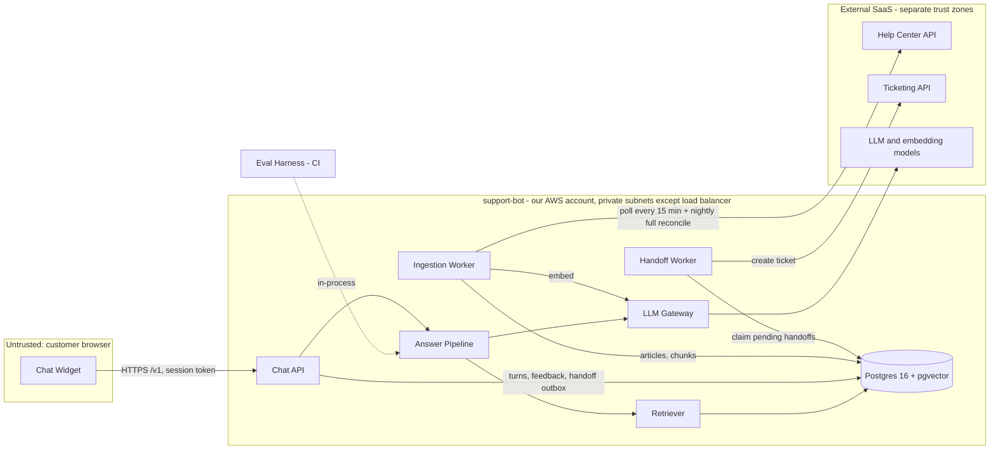

# Architecture and Build Plan: Customer-Support RAG Chatbot over Help-Center Docs

> **How I wrote this.** The workspace has no code, configuration or data in it. The only file is a README that says it's empty. So I couldn't learn your stack, your help-center platform, your traffic or your constraints from anything. Rather than hold the plan up, I chose a sensible default for each gap and marked it **[A#]**. Everything is collected in Section 5. The five questions at the end are the ones whose answers would change the plan the most. If your answers differ from my defaults, Sections 6, 10 and 13 are the ones to update.

---

## 1. Summary

- **What:** a chat assistant on the help center (and later in the product) that answers customers' how-to questions using only the published help-center articles. It cites the article behind each answer. When it can't answer, or the question needs a person, it hands the conversation to the existing ticketing system with the transcript attached.
- **Shape:** one Python service (`support-bot`) deployed as two processes from one container image. The `api` process serves the chat. The `worker` process keeps the article index in sync and sends handoffs. One Postgres database with pgvector holds the article chunks, embeddings, full-text index, conversation logs and handoff outbox. The LLM and embedding models are called through a thin internal gateway so they can be swapped.
- **Key decisions:**
  1. **Correctness ranks first.** Every answer must cite retrieved sources, and the server checks this before anything is shown. If there's no valid citation, the bot doesn't answer and offers a human instead.
  2. **One model call per turn returns structured output:** answer, ask a clarifying question, hand off, or decline. No agent loop and no tools beyond "create a ticket".
  3. **Retrieval is hybrid** (keyword plus vector search) in Postgres/pgvector. No separate vector database, because the corpus is small (about 30k chunks).
  4. **An evaluation set built from real tickets comes before features.** It's ready in Milestone 1 and gates every change to prompts, models or retrieval.
  5. **Only articles visible to anonymous visitors get indexed.** Restricted and internal content is out of the index entirely.
- **Milestone 1 (about 3 weeks):** real articles ingested into staging, a single-turn cited answer in a minimal widget on a staging page, an evaluation set of at least 100 cases with a baseline score, and spikes that settle chunking, model choice and build-versus-buy.
- **Top risks:** answer quality is unknown until measured. The help-center content may have gaps or contradictions (most bad answers will turn out to be content problems). Building the evaluation set depends on support-team time and on access to ticket data. The bot might make policy promises it shouldn't, such as refunds.

## 2. Context and Goals

- **Problem:** customers file tickets for questions the help center already answers, because search is keyword-based and articles are hard to find. Agents spend time pasting article links. **[A1]**
- **Goals:**
  - Answer how-to and policy questions correctly, with citations to the help center.
  - Offer a human at every turn, and create a well-formed ticket when handing off.
  - Reflect article changes within 1 hour.
  - Show measurable ticket deflection (tickets avoided because the bot answered) against a holdout group.
- **Non-goals (for this plan):**
  - Account-specific actions or lookups (order status, refunds, password resets).
  - Agentic tool use.
  - Languages other than English **[A6]**.
  - Voice.
  - Indexing internal or agent-only docs.
  - An agent-assist copilot.
  - Fine-tuning models.
  - Replacing the ticketing system or live chat.
- **Success measures (targets are assumptions, confirm with the support lead) [A9]:**
  - Tickets on covered topics fall by at least 15% compared with a 10% holdout over 4 weeks.
  - At least 30% of bot conversations end resolved: positive feedback, or no handoff and no ticket within 72 hours where the user can be linked.
  - Thumbs-up rate on answered turns is at least 70%.
  - Agents rate at least 80% of handoff tickets as useful as written.

## 3. Drivers, Requirements, and Constraints

### Ranked quality attributes

| # | Attribute | Measurable target | Why it matters |
|---|---|---|---|
| 1 | **Answer correctness and groundedness** | On the frozen evaluation set: ≥ 85% of answerable cases correct and supported by a cited source; ≤ 2% of answers contain an unsupported policy claim (refunds, pricing, SLAs); ≥ 90% of unanswerable or account-specific cases route to clarify, handoff or decline **[A10]** | A confident wrong answer about policy costs more than no answer. Companies have been held to policies their chatbots invented. |
| 2 | **Never trap the user** | A human option is visible at every turn. 100% of handoff requests either create a ticket within 5 minutes or show the user the contact-form fallback straight away. | Being stuck in a loop with a bot is the main CSAT risk. |
| 3 | **Content freshness** | A published, edited or unpublished article is reflected in answers within 60 minutes **[A11]** | A stale answer is a wrong answer. |
| 4 | **Latency** | Full response p50 < 4 s, p95 < 8 s at peak load **[A12]** | Chat users leave if they wait too long. This ranks below correctness, which is why answers are validated before display rather than streamed (D4). |
| 5 | **Cost per conversation** | ≤ $0.10 of LLM spend per conversation on average. Infrastructure ≤ $500/month per environment. **[A13]** | It has to cost far less than a human-handled ticket (assumed $5–15). |

Scale is **not** a driver. At the assumed 30k conversations a month **[A5]**, peak load is under 1 request per second.

### Key functional requirements

- Ingest published, public help-center articles. Keep them in sync, including deletions.
- Handle multi-turn chat with follow-up questions ("what about on mobile?").
- Cite sources as links to the help-center articles.
- Route each turn to one of four outcomes: answer, clarify, hand off, or decline (off-topic).
- Hand off by creating a ticket with the transcript and the user's email.
- Capture feedback per answer.
- Log a trace for every turn, good enough to explain why the bot said what it said.

### Constraints (all assumed)

| Constraint | Assumption |
|---|---|
| Team | 2 full-stack engineers comfortable in Python, about 0.25 FTE of a support content specialist (SME), and a part-time PM or tech lead **[A3]** |
| Cloud | AWS. Equivalents on GCP or Azure work the same way. **[A4]** |
| Help center and ticketing | Zendesk Guide and Zendesk Support **[A2]** |
| Timeline | Limited production rollout within about 10 weeks **[A14]** |
| Data | User messages may contain personal data. Payment card numbers must never be stored or sent to the LLM. **[A7]** |
| LLM provider | An approved provider with no-training and zero- or limited-retention terms, reached through the existing cloud account (for example, Bedrock on AWS) **[A8]** |

### Hard parts

1. **Answer quality and refusal calibration.** No one knows how often the bot will be right, or how often it will refuse when it shouldn't, until it's measured on real questions.
2. **Retrieval over real help-center content.** Long articles, screenshots, plan-specific content ("Enterprise only"), and stale or contradictory articles all break naive chunking.
3. **Building a representative evaluation set.** This needs support-SME time and an export of historical tickets that contain personal data. That makes it an organisational dependency and the critical path.
4. **Unauthorised commitments and abuse on a public endpoint.** Prompt injection, off-brand output, and "denial of wallet" (attackers running up LLM spend).
5. **Handoff integration.** It depends on an external API that someone else owns. A failure there strands users.

## 4. Current State

**Inspected:** the working directory. It contains only a README stating that the workspace is intentionally empty. There is no code, infrastructure-as-code, CI or data to build on.

**Assumed context:**
- A hosted help center (Zendesk Guide) with roughly 500–3,000 published English articles, some of them restricted to signed-in users or agents. Its theme accepts custom JavaScript.
- A ticketing system (Zendesk Support) with an API.
- An AWS account with standard tooling: Terraform and GitHub Actions **[A4]**.

**Conventions the plan sets, since none exist:**
- Python 3.12, FastAPI, SQLAlchemy with Alembic, pytest, ruff.
- Terraform in `infra/`.
- Prompts kept as versioned YAML in the repository.
- Configuration through environment variables. Secrets in AWS Secrets Manager.

If any of this conflicts with your organisation's standards, follow your standards. The architecture doesn't depend on these specific tools.

## 5. Assumptions and Open Questions

### Assumptions

| # | Assumption | Impact if wrong | How and when validated |
|---|---|---|---|
| A1 | Many tickets are questions the docs already answer | Deflection value is low, and the project should narrow or stop | T12: tag 200 recent tickets as answerable from docs or not. Week 1. |
| A2 | Zendesk Guide and Zendesk Support | Connector and handoff code change (about 3–5 days each). The vendor's own AI agent may be the better buy. | Open question Q1. Day 1. |
| A3 | 2 Python engineers plus a part-time SME | Sizes change. Switch language if the team is TypeScript. | Q3. Day 1. |
| A4 | AWS, Terraform, GitHub Actions | Swap in equivalent managed services. Architecture unchanged. | Q3. Day 1. |
| A5 | About 30k conversations a month, about 4 turns each, peak under 1 rps | Above 100× this, revisit capacity and cost. Structure still holds. | Pull help-center visit and chat volumes. Week 1. |
| A6 | English only at launch | Multilingual retrieval and evaluation needed. Adds about 2–3 weeks. | Q4. Week 1. |
| A7 | No regulated data (health or similar) beyond incidental personal data | A regulated-data review could block the LLM provider choice | Q5. Day 1. |
| A8 | An LLM provider with suitable data terms is reachable through the existing cloud account | Procurement or security review becomes a long-lead blocker | T1: start the review on day 1 |
| A9–A14 | Success, quality, freshness, latency, cost and timeline targets in Sections 2–3 | Wrong targets lead to wrong gates | Support lead and PM review in week 1. Re-baseline after the M1 evaluation. |
| A15 | Docs are first-party and edited by trusted staff | If edits come from the community, retrieved text needs stronger isolation | Confirm who can publish articles. Week 1. |

### Open questions

| Question | Who can answer | Default if no answer | Needed by |
|---|---|---|---|
| Q1. Which help-center and ticketing platforms, and do you have live chat? | Support operations | Zendesk Guide and Support, tickets only | Day 2 (blocks T4) |
| Q2. Where does the bot appear (public help center, logged-in app), and are some articles restricted? | PM | Public help center, anonymous users, public articles only | Week 1 |
| Q3. Team language, cloud and CI standards? | Engineering manager | Python, AWS, GitHub Actions | Day 2 (blocks T2) |
| Q4. Volume and languages? | Support operations or analytics | 30k conversations a month, English | End of M1 |
| Q5. Approved LLM providers and data-handling rules? | Security or legal | Provider reached through the existing cloud account, no training on our data | Before any real user traffic (end of M2). Start now. |

## 6. Architecture Overview



**How the parts fit together.**
1. The **Ingestion Worker** pulls public articles from the help center, splits them along their headings, embeds the chunks and writes them to Postgres.
2. For each user message, the **Chat API** asks the **Answer Pipeline** for a response. The pipeline:
   - rewrites follow-up messages into a standalone question,
   - has the **Retriever** run keyword and vector search and merge the results,
   - makes one structured LLM call through the **LLM Gateway**,
   - checks that the citations point to chunks it actually retrieved,
   - and returns one of four routes: answer, clarify, handoff or decline.
3. Every turn is logged as a trace row.
4. Handoffs are written to an outbox table in the same transaction as the turn. The **Handoff Worker** sends them to the ticketing system and retries until they succeed.
5. The **Eval Harness** imports the Answer Pipeline directly and scores it against a frozen evaluation set.

| Component | Responsibility | Owns which data | Exposes | Technology | Key dependencies |
|---|---|---|---|---|---|
| Chat Widget | Chat UI, source links, an always-visible "Contact support" link, feedback buttons | None (session token in memory) | JS embed snippet | TypeScript, about 15 kB, no framework | Chat API |
| Chat API | Sessions, rate limits, request validation, conversation state, feedback, handoff requests | `conversations`, `feedback`, `handoffs` (insert only) | REST `/v1/*` | FastAPI (`api` process) | Answer Pipeline, DB |
| Answer Pipeline | Query rewrite, retrieval call, prompt assembly, LLM call, citation validation, routing rules | `turns` | Python interface `answer(conversation, message) -> TurnResult` | Python module | Retriever, LLM Gateway |
| Retriever | Hybrid search with reciprocal rank fusion (a standard way to merge two ranked lists) | None (reads `chunks`) | `search(query, k) -> [Chunk]` | SQL over pgvector and `tsvector` | DB, LLM Gateway (query embedding) |
| LLM Gateway | One interface for chat and embedding models: timeouts, retries, token and cost accounting, model switching | None | `complete(...)`, `embed(...)` | Python module, provider SDK | LLM provider |
| Ingestion Worker | Sync articles, chunk, embed, reconcile deletions | `articles`, `chunks`, `ingestion_runs` | CLI `python -m app.ingestion.sync [--full]` plus a schedule | `worker` process | Help Center API, LLM Gateway, DB |
| Handoff Worker | Deliver pending handoffs to ticketing, idempotently | `handoffs` (status updates) | None (polls the DB) | `worker` process | Ticketing API, DB |
| Postgres | System of record for everything above | All tables | SQL | RDS Postgres 16 with pgvector | None |
| Eval Harness | Score pipeline changes on the frozen evaluation set | `evals/` files in git | CLI `python -m evals.run` | Python, CI job | Answer Pipeline, LLM Gateway |

## 7. Component Details

**Chat API.**
- **Endpoints, all versioned under `/v1`:**
  - `POST /v1/session` returns a signed session token valid for 30 minutes.
  - `POST /v1/chat` takes `{conversation_id?, message}` and returns `{conversation_id, turn_id, route, answer_markdown, citations:[{title,url}], handoff_offered}`.
  - `POST /v1/feedback` takes `{turn_id, rating, comment?}`.
  - `POST /v1/handoff` takes `{conversation_id, email, note?}` and returns `202 {handoff_id}`.
  - `GET /v1/handoff/{id}`.
  - `GET /healthz` checks the database and reports when ingestion last succeeded.
- **Limits:** message length ≤ 2,000 characters; ≤ 20 turns per conversation; ≤ 20 messages per 10 minutes per session; ≤ 200 per day per IP address.
- **Contract changes:** additive only within `/v1`. The widget is pinned to `/v1`.
- **Does not:** talk to the LLM or the ticketing system directly.
- **Failure behaviour:** stateless, with 2 tasks behind the load balancer. If the database is down, `/healthz` fails and the widget switches to fallback mode: "Search the help center" plus the contact-form link.

**Answer Pipeline (hard part 1).** It runs these steps in order, with a total deadline of 15 seconds:
1. **Redact.** Strip anything that passes a Luhn check as a card number, and anything shaped like an API key.
2. **Deterministic routing rules.** A keyword list goes straight to `handoff` without calling the LLM: "cancel my account", "chargeback", "legal", "speak to a human", and similar. The list lives in the repository at `app/answer/rules.yaml`.
3. **Rewrite.** From turn 2 onward, a small, fast model turns the message and the last 4 turns into a standalone search query. Timeout is 3 seconds. If it times out, the raw message is used.
4. **Retrieve.** The Retriever returns the top 6 chunks, grouped by article.
5. **Generate.** One call with the versioned prompt `answer_vN.yaml`. Retrieved chunks are wrapped in `<source id="n">` tags and labelled as reference material, not instructions. The output follows a JSON schema: `{route: answer|clarify|handoff|decline, answer_markdown, citations:[n]}`.
6. **Validate:**
   - The output must parse.
   - `route=answer` needs at least one citation, and every citation must be one of the retrieved source IDs.
   - Only links that are cited article URLs or on the allowed help-center domain are kept.
   - If any check fails, the answer is replaced with: "I couldn't find this in our help center. Want me to connect you with our team?" The pipeline uses `route=handoff_offered` and logs `validation_failure`.
7. **Log.** Write the `turns` row.
- **Does not:** take actions, browse, or read account data.
- **When the model is slow or down:** the gateway times out after 12 seconds, then the bot replies "I'm having trouble right now," shows the handoff option, and counts the error in metrics.

**Retriever (hard part 2).**
- Takes the top 20 results by vector cosine similarity (HNSW index) and the top 20 by Postgres full-text search (`websearch_to_tsquery`, GIN index), merges them with reciprocal rank fusion (k = 60), and limits results to 2 chunks per article.
- At about 30k chunks, both queries run well under 50 ms. Scale isn't a concern.
- Whether to add a reranker or retrieve whole articles is settled by spike S1, not assumed.

**LLM Gateway.**
- **Interface:** `complete(model_alias, messages, schema, timeout)` and `embed(texts)`.
- **Model aliases** (`answer`, `rewrite`, `judge`, `embed`) map to concrete model IDs in configuration, so switching models is a config change plus an evaluation run.
- **Retries:** at most 2, with jittered backoff, only on 429 and 5xx responses.
- Records tokens in and out and cost in USD from a price table kept in configuration.
- A fake implementation is used in unit tests.

**Ingestion Worker.**
- **Every 15 minutes:** incremental fetch since the last cursor, using the help center's incremental articles endpoint. Only articles that are published and visible to everyone are kept.
- **Nightly:** a full listing to reconcile. Articles that disappeared, were unpublished, or became restricted are marked `deleted`, and their chunks are marked `superseded`.
- **Per article:**
  - If the content hash hasn't changed, skip it.
  - Otherwise convert HTML to structured text. Split on H2/H3 headings into 300–600 tokens. Prefix each chunk with `Article title > Section path`. Convert tables to markdown and keep image alt text.
  - Embed the new chunks.
  - In one transaction, insert the new chunks and mark the old ones superseded.
- Superseded chunks are kept for 90 days so old traces can still be explained.
- **Failure behaviour:** respects 429 and `Retry-After`. If an article fails, it's logged in `ingestion_runs.errors` and the run continues. The cursor only moves forward after a successful run. An alert fires if no run has succeeded for 2 hours. The index can always be rebuilt from the source (`--full` takes under 30 minutes and costs cents).

**Handoff Worker (hard part 5).**
- Polls every 10 seconds for pending handoffs, using `SELECT … FOR UPDATE SKIP LOCKED` so two workers never claim the same row.
- Creates a ticket containing:
  - the requester's email,
  - the subject (the first user message, truncated),
  - the transcript,
  - the cited articles,
  - the tag `bot_handoff`.
- Sends the external ID `handoff:{handoff_id}` and checks for an existing ticket with that ID before creating one, so tickets are never duplicated. If the ticketing system doesn't support a lookup by external ID, the worker records the ticket ID immediately after creation.
- **Retries:** up to 8 attempts with backoff over about 30 minutes, then `failed`.
- **Alerts:** any handoff pending for more than 15 minutes, or any failed handoff.
- The widget shows the contact-form link as soon as a handoff is requested, so the user is never blocked by this worker.

**Chat Widget.**
- Loaded through a `<script>` tag in the help-center theme. Renders sanitised markdown only (DOMPurify): no raw HTML, and only allowed link domains.
- Shows a "Contact support" link permanently.
- Includes the disclaimer "AI answers can be wrong. Check the linked article." The wording needs legal review.

## 8. Data Design

| Entity | Key fields | Written by | Notes |
|---|---|---|---|
| `articles` | `id` (source ID), `source`, `locale`, `title`, `url`, `section`, `labels[]`, `visibility`, `source_updated_at`, `content_hash`, `status` (active/deleted) | Ingestion Worker | The help center is the real system of record. This table is a projection of it. |
| `chunks` | `id`, `article_id` FK, `ordinal`, `heading_path`, `text`, `token_count`, `embedding vector(D)`, `embedding_model`, `tsv tsvector` (generated), `status` (active/superseded), `created_at` | Ingestion Worker | Rows are immutable. HNSW index on `embedding` filtered to active rows. GIN index on `tsv`. |
| `ingestion_runs` | `id`, `kind` (incremental/full), `started_at`, `finished_at`, `cursor`, `counts` jsonb, `errors` jsonb | Ingestion Worker | Used by `/healthz` and alerting |
| `conversations` | `id` uuid, `session_id`, `channel`, `user_ref` (nullable), `created_at`, `outcome` | Chat API | |
| `turns` | `id`, `conversation_id`, `user_message` (redacted), `rewritten_query`, `retrieved` jsonb (chunk ID, score), `prompt_version`, `model`, `route`, `answer`, `citations`, `validation` jsonb, `tokens_in`, `tokens_out`, `cost_usd`, `latency_ms` jsonb (per stage), `error` | Answer Pipeline | The trace that answers "why did it say that?" |
| `feedback` | `turn_id`, `rating`, `comment`, `created_at` | Chat API | |
| `handoffs` | `id`, `conversation_id`, `idempotency_key` UNIQUE, `email`, `status` (pending/sent/failed), `external_ticket_id`, `attempts`, `last_error` | Chat API inserts. Handoff Worker updates status. | Two writers, but on separate columns, by design: the outbox pattern. |

- **Consistency:** a turn and its handoff row are written in one transaction. Each article's chunks are swapped in one transaction. Nothing crosses components that needs a distributed transaction.
- **Retention:**
  - Transcripts, turns and feedback: 90 days **[A7]**, then deleted by a nightly job. Aggregate metrics are kept indefinitely.
  - Superseded chunks: 90 days.
  - Deletion requests: delete by `user_ref` or email, covering both `conversations` and `handoffs`.
- **Backup:** RDS automated backups with 7-day point-in-time recovery. Recovery point objective (maximum data loss) is 5 minutes. Restore time objective is 1 hour. The index doesn't need a separate backup because it can be rebuilt from the source. A restore is tested once in M3.
- **Classification:**
  - `user_message`, `answer` and `email` are personal data: encrypted at rest (RDS KMS), not written to application logs (only `turn_id` is logged), and readable through a read-only database role limited to the team.
  - Card numbers are redacted before storage and before the LLM call.
- **Schema evolution:**
  - Alembic migrations, additive first: add, backfill, switch reads, then drop.
  - Changing the embedding model means adding the new embeddings alongside the old (`embedding_model` column), re-embedding everything (about 30k chunks takes minutes), running the evaluation, switching the configuration, and only then deleting the old vectors.

## 9. Key Flows

**Flow 1: Answer a follow-up question (happy path)**
1. The widget sends `POST /v1/chat` with `{conversation_id, "how do I do that on mobile?"}`.
2. The Chat API checks the token and rate limit, then loads the last 4 turns.
3. The pipeline redacts the message. No routing rule matches. The rewrite step produces "How to export invoices in the iOS/Android app" (about 0.6 s).
4. The Retriever embeds the query (about 0.2 s) and runs the hybrid query (under 50 ms), returning 6 chunks from 3 articles.
5. The generation call returns `{route:"answer", answer_markdown:"…[1]…", citations:[1]}` in about 2–4 s.
6. Validation passes: citation 1 is in the retrieved set and all links are allowed.
7. The `turns` row is written. The response goes back with a citation link to "Exporting invoices". The widget renders it with feedback buttons.

**Flow 2: An article is edited and then unpublished**
1. The 15-minute incremental run sees article 123 with `updated_at` later than the cursor and a different hash.
2. It re-chunks and embeds, then in one transaction inserts the new chunks and marks the old ones superseded. The edit appears in answers within 15 minutes, which beats the 60-minute target.
3. Later, the article is unpublished. Some help-center APIs don't report unpublishing in incremental feeds, so the nightly full reconcile notices it's missing and marks the article and its chunks deleted. That could take up to 24 hours, which misses the 60-minute target. **Mitigation:** the incremental run also re-checks the visibility of any article it touches, and S1 confirms whether the platform's incremental feed includes unpublish events. If the gap matters, add a help-center webhook in M2.

**Flow 3: Handoff while the ticketing API is down (failure path)**
1. The user clicks "Talk to a person" and enters an email.
2. `POST /v1/handoff` inserts a `handoffs` row (`pending`, `idempotency_key = conversation_id`) and returns 202.
3. The widget straight away says: "We've got your request. You'll get an email from our team. If you don't hear back within an hour, use the contact form [link]."
4. The Handoff Worker's attempt gets a 503. It records `attempts=1, last_error` and retries with backoff.
5. A double-clicked request is caught by the UNIQUE `idempotency_key`, and the API returns the existing `handoff_id`.
6. After 15 minutes still pending, an alert fires (runbook: check the ticketing system's status page). When the API recovers, the next attempt looks up the external ID, finds nothing, creates the ticket and marks it `sent`.
7. After 8 failed attempts the status becomes `failed`. On-call exports failed handoffs with `make export-failed-handoffs` and enters them by hand.

**Flow 4: The LLM provider times out**
1. The generation call reaches the 12-second gateway timeout. One retry is not attempted, because it would exceed the 15-second pipeline deadline.
2. The pipeline returns `route=error_fallback`: "I'm having trouble answering right now," with a link to help-center search and the handoff option.
3. The `turns` row records `error='llm_timeout'`. If the LLM error rate stays above 5% for 5 minutes, an alert fires. If the provider is fully down, the widget health check can switch the widget to fallback mode using the `bot_enabled` flag.

## 10. Key Decisions

| # | Decision | Options considered | Rationale (against the drivers) | Reversibility | Revisit if |
|---|---|---|---|---|---|
| D1 | **Build a custom pipeline**, and check it against the help-center vendor's native AI agent in spike S3 | (a) Build. (b) Buy the vendor's AI agent (Zendesk, Intercom and others offer them, often priced per resolution, sometimes around $1 each; verify current pricing). | Building gives control over grounding checks, citations, logging and later in-app use, with LLM cost of about $0.02 per turn. Buying is faster to market. | Medium. About 6 weeks of work is lost if we switch. | The vendor agent scores within 5 points on the S3 evaluation subset at an acceptable cost. If so, **buy**, and keep the evaluation set to hold the vendor accountable. |
| D2 | **Postgres with pgvector and full-text search** for retrieval | (a) pgvector in the same database. (b) Managed vector database (Pinecone and similar) plus a separate keyword engine. (c) OpenSearch. | About 30k chunks is tiny. One store covers both search types in one query, with one backup and nothing new to run. Fits a small team. | Easy. Chunks are rebuildable from the source. | More than 1M chunks, p95 retrieval above 200 ms, or a need for features pgvector lacks |
| D3 | **One structured LLM call per turn** (plus an optional rewrite call), with no agent loop | (a) Fixed pipeline. (b) An agent with a search tool that loops. | Easier to evaluate, predictable cost and latency, nothing for injected instructions to exploit. Correctness is driver 1. | Easy | Evaluation shows multi-step questions failing in more than 10% of cases, and a second retrieval round fixes them |
| D4 | **Validate the whole response before showing it** (no token streaming) | (a) Buffer, validate, then send. (b) Stream tokens and check afterwards. | Correctness (driver 1) outranks latency (driver 4). Structured JSON output and citation checks need the complete response. Answers are about 150 words, so 3–5 s is acceptable with a typing indicator. | Easy | p95 above 8 s, or beta feedback or abandonment shows waiting is a problem. Then stream the answer field and show a validation badge. |
| D5 | **Index only articles visible to anonymous visitors** | (a) Public only. (b) Index everything and filter by the user's segment at query time. | Removes the worst leak (internal or restricted docs reaching anonymous users) without designing an identity model now | Easy to extend later. Leaking content is not reversible. | In-app logged-in users need restricted content. That requires a design for passing user identity and segments (deferred). |
| D6 | **Reach models through the existing cloud provider** (for example, Bedrock), behind the LLM Gateway, with a small model for rewriting and a model chosen by S2 for answering | (a) Through the cloud provider. (b) Direct to the vendor's API. | Uses the existing data-processing agreement and billing, so security review is shorter (hard part: long-lead). The gateway keeps switching cheap. | Easy. Change config and run the evaluation. | The model S2 picks isn't available there, or the cloud version lags behind the vendor's |
| D7 | **Handoff through a Postgres outbox** plus a polling worker | (a) Outbox table. (b) SQS queue. (c) Synchronous API call. | A synchronous call would block or strand users when ticketing is down. At under 1 rps, a table is enough and is transactional with the turn. | Easy | More than 50 handoffs a second (unlikely), or more async job types appear. Then move to SQS. |
| D8 | **Python, FastAPI, one image, two processes** | (a) Single service. (b) Separate services for ingestion and chat. | Ingestion and chat share code (chunk models, gateway). One deploy pipeline. No driver calls for separate scaling. | Medium (language choice) | The team is TypeScript-first. Then use Node with the same structure. |

## 11. Cross-Cutting Concerns

**Security (built in M1–M2, reviewed at the M2 gate).**

| Threat | Mitigation | Milestone |
|---|---|---|
| Restricted or internal articles leak to the public | Filter on visibility at ingestion. Fixture test with a restricted article. The nightly reconcile catches visibility changes. | M1 |
| The bot promises refunds, discounts or policies that don't exist | Prompt rule: no commitments, policy only when cited. Evaluation cases for "can I get a refund…". Citation validation. Disclaimer. Routing rules send billing disputes to a human. | M1 (prompt), M2 (rules) |
| Denial of wallet or abuse | Session token, per-session and per-IP rate limits, input and turn caps, Cloudflare Turnstile (or equivalent) challenge after rate-limit hits. A **daily spend cap**: when the `cost_usd` sum passes the cap, `bot_enabled=false` and an alert fires. | M2 |
| Prompt injection, jailbreaks, off-brand output | No privileged tools. Retrieved text sits inside source tags. The topic is restricted to the product. 25 or more adversarial evaluation cases. The provider's moderation is optional if evaluation shows a gap. | M1 (cases), M2 (hardening) |
| XSS or phishing links in rendered output | Markdown sanitised in the widget. Links limited to cited URLs and allowed domains, both server-side and in the widget. | M1 |
| Personal data exposure | Redaction, 90-day retention, encryption at rest, no personal data in application logs, read-only database role, secrets in Secrets Manager, TLS everywhere | M1–M2 |

CI runs `pip-audit` (dependency scan) and a container image scan from M1.

**Reliability.**
- Target 99.5% monthly availability. The fallback is the existing contact form, so an outage degrades the experience rather than blocking users.
- Two API tasks. RDS Multi-AZ in production only.
- Every network call has a timeout: LLM 12 s, rewrite 3 s, help center 30 s, ticketing 15 s.
- Retries only where the call is idempotent. Idempotency key on handoffs.
- The `bot_enabled` flag acts as a kill switch.

**Observability (M1 trace rows; M2 dashboards and alerts).**
- Structured JSON logs carrying `conversation_id` and `turn_id`. Personal data is never logged.
- Metrics go to CloudWatch through OpenTelemetry:
  - turns per minute, broken down by route,
  - p50 and p95 latency per stage,
  - LLM errors and timeouts,
  - validation failures,
  - tokens and cost per turn and per day,
  - thumbs-down rate,
  - handoff pending age,
  - time since ingestion last succeeded.
- **Alerts, each with a runbook:**
  - LLM errors above 5% for 5 minutes
  - p95 above 10 s for 15 minutes
  - no successful ingestion for 2 hours
  - any handoff pending for more than 15 minutes, or any failed handoff
  - daily spend above 150% of budget
  - validation failure rate above 15% over 1 hour (often a sign of a prompt or model regression)
- **Weekly quality review:** a sample of 50 thumbs-down and 50 random turns, graded by the SME. Failures are added to the evaluation set.

**Performance and capacity.**
- Peak is under 1 rps. The bottleneck is LLM latency and provider rate limits, not our service.
- Check the provider's tokens-per-minute quota early (T1).
- Load test at 10× peak (about 10 rps) in M3 using k6 against staging, with the LLM either stubbed or real at low volume.

**Cost (estimates; verify current prices) [A13].**
- **Per answer turn:** about 3–4k input tokens and about 300 output tokens. On a mid-tier model that's about $0.01–0.02. On a small model, about a quarter of that.
- **Monthly LLM:** 120k turns works out to roughly $1–2.5k on a mid-tier model, or roughly $300–600 on a small one. Embeddings cost cents.
- **Infrastructure:** about $200–400 per month per environment (small RDS, 2–3 Fargate tasks, load balancer).
- **Evaluation runs:** about $2–5 each.
- **Controls:** the daily spend cap, cost recorded per turn, history capped at the last 4 turns, and a cost tag `app=support-bot` with an AWS Budget alert.

**Operations.**
- The building team owns the service for the first 3 months after launch.
- On-call during business hours only, because the failure mode is falling back to the contact form.
- The support content team owns the articles. Bad answers caused by content go to them through the weekly content-gap report.
- Runbooks in `docs/runbooks/`: LLM outage, spend spike, stale ingestion, failed handoffs, "a customer reports a bad answer" (find the `turn_id`, read the trace, decide whether it's a content, retrieval or prompt problem, add an evaluation case).

**AI-specific concerns.**
- **Evaluation:** the evaluation set is built and run in M1. Gates are in Section 14.
- **Prompts:** versioned YAML. `prompt_version` is logged on every turn. A prompt change needs a pull request and an evaluation report.
- **Limits:** history of 4 turns, at most 2 LLM calls per turn, 15 s per turn, 20 turns per conversation, the daily spend cap.
- **Human approval:** the bot's only side effect is creating a ticket, which the user explicitly asks for. It takes no irreversible actions.
- **Fallbacks:** covered in Flows 3 and 4.
- **Data to the provider:** the redacted message, recent history and the retrieved public chunks. No training on our data, retention per the provider's terms, confirmed in T1.

## 12. Build Sequence

Team assumption: 2 engineers full time, about 0.25 FTE of the SME, and a part-time PM. Sizes are rough guides, not commitments.

| Milestone | Goal | Scope (excluded) | Deliverables | Exit criteria | Depends on | Size |
|---|---|---|---|---|---|---|
| **M1: Walking skeleton and evaluation baseline** | Clear hard parts 1–3. Prove the pipeline end to end. | Ingestion of real articles, single-turn answers, minimal widget on a staging test page, evaluation set v1 and harness, spikes S1–S3, CI/CD to staging. (Excludes multi-turn, handoff, rate limits, production.) | Staging environment through Terraform. Index of all public articles. `/v1/chat` with citations. Widget demo. `evals/datasets/v1.jsonl` with at least 100 cases. Baseline report. Decision memo for S1–S3. | Merging to main deploys to staging. The widget demo answers 10 SME-chosen questions with valid citations. The evaluation harness produces a scored report in CI. S1–S3 decisions recorded. Build-versus-buy decided. | Help-center API token. LLM access. Ticket export for the evaluation set (**critical path**). | 2.5–4 weeks |
| **M2: Beta-ready** | Make it safe, operable and multi-turn. Clear hard parts 4–5. | Query rewriting and multi-turn. Routing rules. Handoff through the outbox. Incremental sync and nightly reconcile. Rate limits, Turnstile, spend cap, kill switch. Redaction and retention job. Dashboards, alerts, runbooks. Production environment. Support agents testing internally. (Excludes public traffic.) | Production stack. Handoffs create real tickets in production for the internal test group. Evaluation set v2 with at least 200 cases, including multi-turn and adversarial. | Evaluation meets the Section 3 thresholds. Security review passed. A deliberately injected LLM failure and a ticketing failure in staging trigger alerts, and the fallbacks work. One week of agent testing with 300 or more turns. | M1. Security or legal sign-off on the LLM provider (started on day 1). | 2.5–4 weeks |
| **M3: Limited production and measurement** | Prove value with real users, safely. | Rollout through a flag: 10% → 50% → 90% of help-center visitors, with a **10% holdout**. Feedback analytics. Weekly content-gap report. k6 load test. Restore drill. (Excludes in-app use and multilingual.) | Live bot. Deflection dashboard comparing bot and holdout. First content-gap report delivered to the content team. | 2 weeks at 50% or more with thumbs-up ≥ 70%, p95 < 8 s, no unresolved serious incidents, and handoff success ≥ 99.5%. Go or no-go decision for 90%. | M2 | 3–4 weeks (including 2 weeks of observation) |

**Critical path:** ticket-export approval → evaluation set v1 (T12) → S2 model and prompt decision → M2 evaluation gate → security sign-off → M3 rollout. The LLM provider security review runs in parallel from day 1 and must finish before M3 starts.

**Can run in parallel:**
- In M1: infrastructure and CI (T2–T3), ingestion (T4–T6) and building the evaluation set (T12).
- In M2: handoff and the operational work alongside multi-turn and prompt work.

## 13. First Milestone Task Breakdown

Proposed repository layout (new repository `support-bot/`):

```
app/api/            FastAPI routes, session tokens
app/answer/         pipeline.py, rules.yaml, prompts/answer_v1.yaml
app/retrieval/      hybrid.py
app/llm/            client.py (interface), bedrock.py, fake.py, prices.yaml
app/ingestion/      connectors/zendesk.py, chunker.py, sync.py
app/store/          SQLAlchemy models, repositories
migrations/         Alembic
widget/             TypeScript embed, test page
evals/              datasets/, corpus_snapshots/, graders/, run.py
infra/              Terraform (staging, prod)
docs/runbooks/
.github/workflows/  ci.yml, deploy.yml, eval.yml
```

| # | Task | Where | Done when | Order / parallel |
|---|---|---|---|---|
| T1 | **Request long-lead access on day 1:** a read-only help-center API token; a ticketing sandbox and API token; LLM model access with a tokens-per-minute quota check; security or legal review of provider data terms; approval to export 90 days of tickets for evaluation (personal data handling agreed with the SME) | PM or tech lead, tracker | Each item has an owner, a ticket and an expected date. Help-center token and model access granted by day 3. | Day 1, blocks T4, T8, T12 |
| T2 | **Scaffold the service and pipeline:** FastAPI app with `/healthz` (database check), Dockerfile, pytest, ruff, `ci.yml` (lint, test, pip-audit, image scan), `deploy.yml` deploying to staging on merge. Terraform for VPC, ECS Fargate (`api` and `worker` services), RDS Postgres 16, Secrets Manager, load balancer. | `app/`, `infra/staging/`, `.github/workflows/` | Merging to main deploys automatically. The staging `/healthz` returns 200 including the database check. | Parallel with T4–T6 and T12 |
| T3 | **Add the initial migration** creating `articles`, `chunks` (vector column, generated `tsv`, HNSW and GIN indexes), `ingestion_runs`, `conversations`, `turns`, `feedback`, `handoffs`, as in Section 8 | `migrations/` | `alembic upgrade head` and `downgrade base` both pass in CI on a clean Postgres container with pgvector | After T2 scaffold |
| T4 | **Implement the help-center connector:** paginated listing of articles that are published and visible to everyone, incremental by `start_time`, with 429/`Retry-After` handling | `app/ingestion/connectors/zendesk.py` | Against the live help center (read-only), the stored count equals the public article count. A fixture test shows a restricted-segment article is excluded. | After T1 token |
| T5 | **Implement the structure-aware chunker:** HTML to text, split on H2/H3 into 300–600 tokens, breadcrumb prefix, tables as markdown, alt text kept, navigation and boilerplate stripped | `app/ingestion/chunker.py` | Snapshot tests on 5 real articles (one long, one with a table, one plan-specific) pass and are reviewed by the SME for sensible splits | Parallel with T4 |
| T6 | **Implement sync:** content-hash skip, embed through the gateway, one transaction per article to insert new chunks and supersede old ones, write `ingestion_runs`. CLI `python -m app.ingestion.sync --full`. | `app/ingestion/sync.py` | A full run fills staging. A second run with no changes makes 0 embedding calls (checked in the logs). An edited fixture article swaps its chunks atomically (integration test). | After T3–T5, T8 |
| T7 | **Implement hybrid retrieval** with reciprocal rank fusion and the 2-chunks-per-article limit | `app/retrieval/hybrid.py` | Integration test on a seeded database returns the expected article first for 5 known queries. p95 under 50 ms on the staging index. | After T6 |
| T8 | **Implement the LLM Gateway:** interface, provider implementation, fake, timeouts, retries on 429/5xx only, token and cost accounting from `prices.yaml`, model aliases from configuration | `app/llm/` | Unit tests cover timeout, retry and no-retry cases with the fake. A staging smoke call returns tokens and cost. | Parallel, after T1 access |
| T9 | **Implement the answer pipeline and `answer_v1` prompt:** source tagging, structured output schema, citation and link validation, fallback text, `POST /v1/chat` (single turn) | `app/answer/`, `app/api/` | Unit tests: an invalid citation, a missing citation and a disallowed link are each replaced by the fallback. In staging, 10 smoke questions return valid cited answers. | After T7, T8 |
| T10 | **Write a turn trace row** for every request (all `turns` fields, per-stage latency) and use `turn_id` as the log correlation ID | `app/answer/pipeline.py`, `app/store/` | For any staging response, a single SQL query by `turn_id` shows the query, retrieved chunks, prompt version, model, cost and latency | With T9 |
| T11 | **Build the minimal widget:** input, sanitised markdown rendering, citation links, always-visible "Contact support" link, disclaimer, thumbs (stored in M2). Plus a staging test page that mimics the help-center theme. | `widget/` | The demo works on the staging page. A malicious `<script>` or off-domain link in a stubbed answer is not rendered (unit test). | After the T9 contract is agreed; can start against a stub |
| T12 | **Build evaluation set v1** (engineer plus SME): at least 100 cases from recent tickets and zero-result help-center searches, with personal data removed. Fields: `id, category, conversation[], expected_route, expected_article_ids[], key_facts[]`. Rough mix: 50% answerable from one article, 10% needing several articles, 15% unanswerable, 10% account-specific (should hand off), 5% off-topic, 10% adversarial (refund promises, injection). Freeze a corpus snapshot. Also tag 200 tickets as answerable from docs or not (checks A1). | `evals/datasets/v1.jsonl`, `evals/corpus_snapshots/2026-10.json` | The SME has signed off on cases and expected routes. Category counts are recorded. A1 answerable-share result reported. | Starts day 2; **critical path** |
| T13 | **Build the evaluation harness:** builds a temporary index from the corpus snapshot, runs the pipeline, computes retrieval recall@6, routing accuracy, correctness and groundedness (LLM judge against `key_facts` and cited text), cost and latency. Writes `report.md` and `report.json`. `eval.yml` runs on pull requests that touch `app/answer`, `app/retrieval`, `app/llm` or `prompts/`. | `evals/run.py`, `evals/graders/`, `.github/workflows/eval.yml` | A CI run posts a report on the pull request. **Judge calibration:** agrees with SME grades on 50 cases at least 85% of the time. If it doesn't, adjust the rubric before trusting it. | After T9, T12 |
| S1 | **Spike: retrieval configuration.** Question: which setup reaches recall@6 of at least 90%? Compare whole-article versus heading chunks, hybrid versus vector-only, and with or without a reranker. Also check whether incremental sync reports unpublish events. **Time box: 3 days.** | `evals/spikes/s1/` | Results table committed and configuration chosen. **Changes the plan if:** the best setup is below 80%. That points to a content-structure problem; bring in the content team and consider adding article summaries or FAQs before M2. | After T7, T13 |
| S2 | **Spike: model and prompt.** Question: which model and prompt combination meets the Section 3 targets at the lowest cost? Run 2 models (small and mid-tier) × 2 prompt variants. **Time box: 3 days.** | `evals/spikes/s2/` | Table of correctness, wrong answers, wrong refusals, routing, p95 latency and cost per turn. Choice recorded in configuration. **Changes the plan if:** nothing gets within 10 points of the targets. Then narrow scope (exclude policy topics, hand them off) or add a separate verification call (+1 s, +cost). | After S1 |
| S3 | **Spike: build versus buy.** Question: does the vendor's native AI agent match our pipeline? Run 50 evaluation cases through the vendor's trial, graded the same way. **Time box: 2 days.** Skip if the platform has no such product. | `evals/spikes/s3/` | Scores and cost side by side. Recommendation to the PM. **Changes the plan if:** the vendor is within 5 points at acceptable cost. Then buy, and stop after M1. | After T13; parallel with S2 |

**Order:** T1 → (T2 → T3) ∥ (T4, T5, T8) ∥ T12 → T6 → T7 → T9/T10 → T11, T13 → S1 → S2 ∥ S3.

## 14. Testing and Validation Strategy

| Risk | Test type | Where it runs | Blocks release? |
|---|---|---|---|
| Chunking or parsing regressions | Unit and snapshot tests (`chunker`) | CI on every pull request | Yes |
| Wrong citations, unsafe links, schema drift | Unit tests on validation with a fake LLM | CI on every pull request | Yes |
| Data and transaction bugs | Integration tests against Postgres with pgvector in a container | CI on every pull request | Yes |
| Contract drift between widget and API | Contract test from a shared JSON schema `api/v1/schema.json` | CI | Yes |
| Answer quality regressions | **Evaluation suite** on the frozen corpus | CI on AI-path pull requests, plus nightly against the live index | Yes, if correctness, groundedness or routing drops by more than 2 points, or the policy-claim rate rises above 2% |
| Content drift (docs changed) | Nightly evaluation against the live index | Scheduled | Alert, not a block. Triage the content. |
| Handoff and LLM failures | Fault injection in staging (block egress or set the ticketing URL to a 503 stub) | Before the M2 gate | Yes (M2) |
| Abuse and cost | Rate-limit tests and a spend-cap test (lower the cap in staging) | Before the M2 gate | Yes (M2) |
| Capacity | k6 at 10 rps for 15 minutes | Before M3 | Yes (M3) |
| Security | Dependency and image scans in CI. Manual review of injection and XSS cases before M2. | CI and M2 gate | Yes |

- **Test data:** the corpus snapshot is public content and can live in the repository. Evaluation conversations have personal data removed by the SME before they're committed. Production transcripts are never copied into test fixtures.
- **Verifying the Section 3 targets:**
  - Correctness, groundedness and routing: the evaluation report.
  - Latency: per-stage metrics in staging and production.
  - Freshness: the time from `source_updated_at` to chunk `created_at`, reported per ingestion run.
  - Cost: `cost_usd` totals per conversation.
  - Never trapping the user: the outbox age metric plus the M2 fault-injection drill.

## 15. Rollout, Migration, and Rollback

- **Rollout:**
  1. Staging.
  2. Internal support agents (M2), using a theme flag that shows the widget only to signed-in agents.
  3. Public visitors through `bot_rollout_pct` and a cookie-stable bucket: 10% → 50% → 90%, with 10% held out for at least 4 weeks to measure deflection. Each step requires the previous step's metrics to hold for 1 week.
- **Coexistence:** the existing help-center search and contact form stay unchanged and always visible, so nothing is migrated or replaced.
- **Rollback:**
  - Widget or bot misbehaving: set `bot_enabled=false`. Effective within 1 minute. The widget hides or falls back.
  - Bad prompt or model: revert the configuration or redeploy the previous image (about 10 minutes). `prompt_version` in traces shows which turns were affected.
  - Bad index: run `sync --full` from the source (under 30 minutes).
  - Schema: Alembic downgrade on additive migrations.
- **Point of no return:** none for the system. Tickets created by handoffs and transcripts already stored aren't undone by rollback. That's expected.

## 16. Risks and Mitigations

| Risk | Likelihood | Impact | Mitigation | Early warning sign | Owner |
|---|---|---|---|---|---|
| Answer quality below target | Medium | High | Evaluation first (M1). S1/S2 decide the configuration. Narrow scope if needed. | S2 best configuration more than 10 points below target | Tech lead |
| Content gaps or contradictions cause wrong answers | High | Medium | Citation-only answers. Weekly content-gap report. The content team owns fixes. | More than 15% of turns "not found", or thumbs-down clustering on specific articles | Support content lead |
| Ticket export or SME time not available (delays the evaluation set) | Medium | High (critical path) | Ask on day 1. Start with zero-result searches and SME-written questions. Book SME time weekly. | T12 under 50 cases by the end of week 1 | PM |
| LLM provider security review delayed | Medium | High (blocks M3) | Start on day 1. Prefer the provider in the existing cloud. | No reviewer assigned by week 2 | PM |
| The bot makes policy commitments | Low–Medium | High | Prompt rule, evaluation cases, citation validation, routing rules, disclaimer, legal review | Any adversarial-case failure. Thumbs-down comments mentioning promises. | Tech lead and legal |
| Spend abuse | Low | Medium | Rate limits, Turnstile, daily spend cap with automatic shutoff | Cost per conversation above 2× the baseline | On-call |
| Vendor native agent turns out "good enough" | Medium | Medium (sunk effort) | S3 in M1 limits the sunk cost to about 3 weeks | S3 result | PM |
| Unpublished articles stay in the index too long | Medium | Medium | Visibility re-check plus nightly reconcile. Webhook if S1 shows a gap. | Reconcile marking more than 0 deletions that incremental missed | Engineer |
| Deflection impossible to measure for anonymous users | Medium | Medium | Holdout group comparing ticket creation rates, using the cookie bucket recorded on the contact form | Holdout too small for a significant result after 4 weeks | PM or analytics |

## 17. Deferred Work and Future Evolution

| Deferred | Trigger to build |
|---|---|
| In-app logged-in mode with per-segment access to restricted articles (signed JWT, segment filter in the Retriever) | Product wants the bot in the app, or restricted content is often the answer |
| Account-aware tools (order status and similar). Turns the bot into an agent and needs an authorisation design and approval points. | Evaluation and handoff tags show that more than 25% of handoffs are account lookups |
| Handoff to live chat | Live chat exists and the support team wants it |
| Multilingual (multilingual embeddings, an evaluation set per language) | Non-English share above 10% |
| Token streaming (D4) | p95 above 8 s, or user feedback |
| Reranker or second retrieval pass | S1 or later evaluation shows a precision gap |
| Webhook-based ingestion | Freshness misses, or a gap in unpublish detection |
| Review UI for the SME (instead of SQL or CSV exports) | Weekly review takes the SME more than 2 hours |
| Agent-assist copilot reusing the Retriever and Answer Pipeline | After M3 succeeds |
| Other sources (release notes, community forum) | Gap report points to them |

**Extension points:** the connector interface (`app/ingestion/connectors/`), model aliases in the gateway, the routing rules file, versioned prompts.

**Shortcuts taken on purpose:**
- Polling outbox instead of a queue. Repay if async job types multiply.
- Regex-based redaction. Repay with a proper personal-data detector if review finds leaks.
- An LLM judge for grading. Re-check it against SME grades every quarter.

## 18. Next Steps

1. **Answer Q1–Q3 today** (help-center and ticketing platform, where the bot appears, team stack and cloud). They decide the T4 connector, D5 and D8.
2. **Start T1:** request the help-center API token, model access and quota, security review of provider data terms, and approval for the ticket export. These are the long-lead items.
3. **Book SME time** (about 4 hours a week for 3 weeks) and start T12 from zero-result help-center searches while the ticket export is pending.
4. **Create the `support-bot` repository** with the layout in Section 13 and start T2/T3: `alembic init migrations`, Terraform `infra/staging/`, `ci.yml`.
5. **Start T4/T5** against the live help center as soon as the token arrives, and pick the 5 snapshot articles together with the SME.

---

I wrote this plan on stated defaults because the workspace was empty: Zendesk, AWS, Python, about 30k conversations a month, English, public anonymous users, and two engineers. The plan's shape (one service, pgvector, one validated LLM call per turn, evaluation first) works for most combinations. The specific connectors, sizes and the build-versus-buy call depend on these answers:

## Open questions that would change the plan most

1. **Which help-center and ticketing platforms, and do you have live chat?** This decides the connector and handoff code. It also decides whether a vendor-native AI agent exists, which could turn this into a purchase rather than a build (S3).
2. **Where will the bot appear, anonymously or logged in, and do some articles have restricted visibility?** Logged-in, in-app use with restricted content means designing how user identity and access are passed to the Retriever before launch, not deferring it.
3. **What do the team and platform look like (language, cloud, CI)?** If you're TypeScript or not on AWS, the components stay the same but the technology column and the sizes change.
4. **Are there rules on sending customer messages to an LLM provider (regulated data, residency, an approved vendor list)?** This could put the security review on the critical path, or limit which models you can use.
5. **What volume and languages do you expect, and what's the deadline?** Ten times my assumed volume changes cost a lot but not the structure. Multilingual support adds 2–3 weeks. A fixed date would push work into the deferred list.
