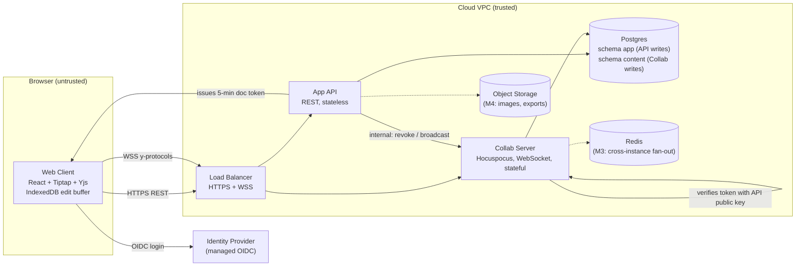

# Architecture and Build Plan: Real-Time Collaborative Document Editor

> **Context note:** The working directory is empty apart from a README that says so (`README.md`: "There is no existing code, documentation, configuration, or data here"). This is a new build. You asked how to **order** the work, so Sections 12 and 13 (sequence and first-milestone tasks) get the most detail. The architecture sections are kept short and contain only what the ordering depends on. I didn't have answers on scale, team or stack, so I made assumptions and labelled them **[A#]**. The questions that would change the plan most are at the end.

---

## 1. Summary

- **What:** A browser-based rich-text editor where several people edit the same document at once. Each user sees others' changes and cursors in under a quarter-second, and no edit is lost. It's aimed at small-to-mid B2B teams (assumed 10k daily active users at launch [A1]).
- **Shape:** One TypeScript monorepo deployed as **two processes**. The **App API** is stateless REST and handles accounts, documents, sharing and permissions. The **Collab Server** holds a long-lived WebSocket per editor and owns document content. Both use one managed **Postgres** split into two schemas, and each schema has exactly one writer. Redis and object storage come in later milestones, when a driver needs them.
- **Key decisions:**
  1. **Use an existing CRDT library (Yjs) instead of writing operational transformation (OT).** A CRDT is a data structure that merges concurrent edits automatically; OT is the older approach used by Google Docs, where the server rewrites conflicting operations. Merge correctness is the costliest thing to get wrong, so we use a proven library and spend our own effort on testing it.
  2. **Tiptap/ProseMirror editor + Hocuspocus sync server**, self-hosted. We avoid a hosted collaboration vendor because document content is the asset we'd least want locked in.
  3. **Content storage is an append-only log of updates in Postgres plus periodic compacted snapshots.** An edit counts as acknowledged only after it has been written durably.
  4. **Permissions are enforced inside the real-time channel, not just in the UI.** Viewers get read-only sockets, and revoking access closes live sessions.
  5. **Comments live outside the CRDT document**, so commenters never need write access to content.
- **Milestone 1 (3–4 weeks):** Two logged-in users co-edit a document in a real staging environment. It's deployed by CI/CD, survives a server crash with zero lost acknowledged edits, and is checked by an automated two-browser test. Three spikes run alongside: convergence fuzzing, durability/acknowledgement semantics, and single-instance capacity.
- **Top risks:** (1) silent document divergence or corruption from concurrent edits on our schema; (2) edits lost in the gap between "server received" and "server persisted"; (3) stateful WebSockets complicating scale-out and zero-downtime deploys; (4) editor schema changes breaking older clients or stored documents.

## 2. Context and Goals

- **Problem:** Teams email files around or use tools where simultaneous edits conflict or overwrite each other. *[A2] The target user, and any incumbent tool, isn't specified. I assume a new product, not a replacement.*
- **Goals:**
  - Several users edit one document at once, and every client ends up with identical content.
  - Local typing is never blocked by the network.
  - A short disconnect (up to ~30 min) loses nothing.
  - Owners control who can view, comment on, or edit each document.
  - A closed beta is running within ~13–17 weeks [A6].
- **Non-goals (v1):** native mobile apps; offline-first editing for hours or days; spreadsheets or whiteboards; suggestion/track-changes mode; multi-region active-active; customer self-hosting; end-to-end encryption; DOCX import with layout fidelity; AI features; SAML/SCIM enterprise SSO.
- **Success measures:** remote edit propagation p95 < 250 ms in production (measured by a synthetic probe); zero confirmed lost-edit incidents during beta; document open p95 < 1.5 s; at least 60% of beta workspaces with 2+ collaborators active weekly [A3].

## 3. Drivers, Requirements, and Constraints

**Ranked quality attributes**

| # | Attribute | Measurable target | Why it matters |
|---|---|---|---|
| 1 | **Data integrity / convergence** | All clients converge to an identical, schema-valid document. RPO = 0 for edits acknowledged to the client. Under 1 s of loss allowed for unacknowledged edits, and those are kept in the browser and replayed | Lost or diverged text destroys trust permanently, and it's the hardest problem to fix after launch |
| 2 | **Editing latency** | Local keystroke renders in under 16 ms (one frame). Remote propagation p95 < 250 ms within the region with up to 50 editors per doc. Doc open p95 < 1.5 s for a 1 MB doc [A4] | This is what makes the product feel "real-time" |
| 3 | **Access-control correctness** | No read or write without a grant. Revocation takes effect on live sockets within 10 s [A5] | B2B documents are confidential, and the WebSocket path is easy to under-protect |
| 4 | **Time to market** | Closed beta in 13–17 weeks with 5 engineers [A6] | Assumed business pressure; it shapes the build-vs-buy choices |
| 5 | **Operability and cost** | 99.9% monthly availability for editing. Run by the same 5-person team. Infra under ~$1.5k/month at 10k DAU, excluding the identity provider [A7] | A small team can't carry a fragile stateful system |

**Key functional requirements that shape the structure:** concurrent rich-text editing (headings, lists, bold/italic, links, code blocks; images and tables later); live cursors and presence; per-user undo; four roles (owner / editor / commenter / viewer); comments anchored to text; version history with restore; reconnection without loss.

**Constraints [A8]:** team of 5 TypeScript-proficient engineers with no prior CRDT experience; managed cloud (assumed AWS); a managed OIDC identity provider is acceptable; no regulated data (ordinary confidential business documents); a single region is acceptable.

**Hard parts**

| Hard part | Why it's hard |
|---|---|
| H1. Merge correctness on *our* schema | Yjs merges correctly at the CRDT level. The binding to ProseMirror's structural rules (lists, nesting, marks) can still produce surprising or invalid results under concurrent edits |
| H2. Durability vs acknowledgement | Off-the-shelf sync servers often hold edits in memory and write them on a timer. A crash in that window loses "acknowledged" edits unless we design for it |
| H3. Stateful WebSockets at scale | Everyone on a document needs the same in-memory state. Deploys drop connections, and reconnection storms can hit the database |
| H4. Permission enforcement in the binary sync channel | The REST API is easy to secure. A crafted WebSocket frame from a viewer is easy to forget |
| H5. Document schema evolution | Stored CRDT content and old browser tabs both outlive any schema change. A careless change corrupts documents or crashes clients |

## 4. Current State

The workspace is empty (I checked `README.md`), so nothing exists to build on or stay compatible with. I'm assuming no organisational platform mandates [A8]. If one exists (a cloud provider, CI system, identity provider or language), the plan should adopt it, and only the hosting and tooling names below would change. The architecture would not.

Conventions this plan sets up: a pnpm monorepo, TypeScript strict mode, Terraform for all infrastructure, GitHub Actions CI [A9], and architecture decision records (ADRs) in `docs/adr/`.

## 5. Assumptions and Open Questions

**Assumptions**

| # | Assumption | Impact if wrong | Validate how / when |
|---|---|---|---|
| A1 | ~10k DAU at launch, ≤1.5k concurrent, typically 2–10 and at most 50 editors per doc | >50 editors per doc or 10× scale changes the fan-out design (D6) | Product owner, before M2. S3 load test measures real headroom |
| A2 | New product, no incumbent to migrate from | Migration would need import tooling and a parallel run | Product owner, week 1 |
| A3 | Beta adoption metric | Only affects success tracking | Product owner, before M4 |
| A4 | Docs ≤ 1 MB typical, 10 MB hard cap | Larger docs need lazy loading and sub-documents | S3 measures load time vs size |
| A5 | 10 s revocation is acceptable | Stricter needs a per-message permission check | Security / product, M2 |
| A6 | 5 engineers: 2 frontend-leaning, 2 backend-leaning, 1 platform-leaning | All sizes scale with this | Eng manager, week 1 |
| A7 | 99.9% availability and ~$1.5k/month budget | Higher SLO means multi-AZ everything and more ops | Product / finance, M3 |
| A8 | TypeScript team, AWS, managed IdP allowed, no compliance/residency rules | A different stack changes tooling choices but not the architecture. Residency or on-prem would change hosting and IdP | Eng manager, **day 1** |
| A9 | GitHub + GitHub Actions | Only tooling names change | Day 1 |
| A10 | Desktop web browsers only, last 2 versions of Chrome/Edge/Firefox/Safari | Mobile web needs extra editor QA | Product, M2 |
| A11 | Tables are not needed for beta | Tables are the most fragile part of collaborative ProseMirror. Adding them needs their own spike | Product, before M4 |

**Open questions** (all repeated at the end)

| Question | Who can answer | Default if no answer | Needed by |
|---|---|---|---|
| Expected scale and max editors per doc | Product | A1 | Start of M2 (feeds S4) |
| Is offline-first (hours/days, mobile) required? | Product | No, short disconnects only | End of M1 |
| Mandated cloud, IdP, language, CI? | Eng leadership | A8/A9 | Day 1 |
| Rich-text scope: tables, embeds, code, math? | Product | A11 | Before M4 |
| Compliance, residency, or customer self-hosting? | Sales / legal | None | End of M1 |

## 6. Architecture Overview



**How it fits together:** The Web Client logs in through the IdP and gets a session with the App API. To open a document it asks the App API for a short-lived, document-scoped **collab token**: a signed JWT carrying the user, document ID and role. It then opens a WebSocket to the Collab Server. The Collab Server checks the token, loads the document (latest snapshot plus later updates) into an in-memory Yjs document, and syncs it with every connected client. Every incoming edit is written to `content.doc_updates` before it's acknowledged. The App API owns everything that isn't document content. When permissions or titles change, it tells the Collab Server through an internal endpoint.

**Component table**

| Component | Responsibility | Owns data | Exposes | Technology | Key dependencies |
|---|---|---|---|---|---|
| Web Client | Editing UI, local-first edits, presence display, offline buffer | IndexedDB copy of open docs (cache only) | — | React, Vite, Tiptap, Yjs, y-indexeddb, HocuspocusProvider | App API, Collab Server |
| App API | Auth sessions, users, workspaces, document metadata, grants, collab tokens, comments (M4), versions metadata (M4), uploads (M4) | `app.*` schema | REST/JSON `/v1/...`; internal calls to Collab | Node 20+, Fastify, Postgres driver | IdP, Postgres, Collab Server (internal) |
| Collab Server | Real-time sync, presence relay, read-only enforcement, durable content persistence, compaction, server-side content operations (version restore, text extraction) | `content.*` schema | WSS (Yjs sync protocol via Hocuspocus); internal HTTP `/internal/docs/:id/{revalidate,broadcast,restore}` | Node 20+, Hocuspocus, Yjs | Postgres, Redis (M3) |
| `packages/schema` | The one editor schema and its version, used by both client and server | — | TS library | Tiptap extensions | — |
| Postgres | System of record | — | — | Managed Postgres 16, Multi-AZ | — |
| Redis (M3) | Cross-instance update/awareness fan-out and locks | Nothing durable | — | Managed Redis | — |
| Object Storage (M4) | Images, exports | Blobs | Pre-signed URLs | S3 | — |

## 7. Component Details

**Collab Server** (where the hard parts live)
- *Does not:* decide permissions (it trusts the token's role and asks the API to revalidate), store metadata, or serve REST to browsers.
- *Interfaces:* WSS with the Yjs sync and awareness protocol. "Awareness" is Yjs's name for ephemeral presence state such as cursors and names. The protocol is versioned by the y-protocols library; our own handshake carries `schemaVersion`. The internal HTTP endpoints are reachable only inside the VPC and authenticated with a service token. Expected load is about 1.5k concurrent sockets and roughly 2k inbound messages/s at peak [A1]. S3 verifies this.
- *Internals:* `auth` (verify the JWT and set `readOnly` for commenter/viewer); `persistence` (batch updates every ≤100 ms per document, insert into `content.doc_updates`, then send the sync acknowledgement); `compaction` (merge updates into a snapshot after 500 updates or when the document unloads, under a per-document Postgres advisory lock); `limits` (512 KB per message, 10 MB per document, 20 sockets per user per document).
- *Failure and recovery:* If the process crashes, clients reconnect with jittered backoff and resend anything unacknowledged. Yjs updates are idempotent (applying the same update twice has no effect), so resends are harmless. If Postgres is unavailable, acknowledgements stop; clients keep editing locally, show "Saving…" and buffer in IndexedDB. After 30 s of failed writes the server stops accepting new document loads. On deploy, SIGTERM drains the instance: it stops accepting connections, flushes, then closes sockets with a "reconnect" code.
- *Scaling:* M1–M2 run one instance (two for availability once S4 picks the fan-out method). From M3, N instances share updates through Redis (D6).

**App API.** Routine stateless REST. Every route goes through an authorisation middleware that resolves the caller's role on the document from `app.document_grants` and workspace membership. Tokens are signed with an asymmetric key, so the Collab Server holds only the public key.

**Web Client.** Tiptap with the Collaboration and CollaborationCursor extensions, and y-indexeddb so unacknowledged edits survive a tab reload. It shows connection and save status driven by the provider's unsynced-changes count. If the server says the client's `schemaVersion` is too old, it forces a reload.

## 8. Data Design

| Entity | Store / table | Sole writer | Notes |
|---|---|---|---|
| User | `app.users` (id, idp_subject, email, name) | App API | Created on first login |
| Workspace, Membership | `app.workspaces`, `app.workspace_members(role)` | App API | M1 seeds one workspace |
| Document metadata | `app.documents` (id, workspace_id, title, created_by, timestamps, deleted_at) | App API | **Title is metadata, not CRDT content**, so there's one writer. Title changes reach live clients through `/internal/.../broadcast` |
| Grant | `app.document_grants` (document_id, principal_type, principal_id, role) | App API | Roles: owner/editor/commenter/viewer |
| Content update log | `content.doc_updates` (document_id, seq, update bytea, user_id, created_at), PK (document_id, seq) | Collab Server | Append-only, deleted only by compaction |
| Content snapshot | `content.doc_snapshots` (document_id, upto_seq, state bytea, created_at) | Collab Server | Load = latest snapshot + updates with seq > upto_seq |
| Extracted text (M4) | `content.doc_text` (document_id, text, tsvector) | Collab Server | For search |
| Version (M4) | `content.doc_versions` (id, document_id, state bytea, label, created_by) | Collab Server (the API asks it to create one) | Full-state copies |
| Comment thread / comment (M4) | `app.comment_threads` (anchor = encoded Yjs relative position), `app.comments` | App API | Kept outside the CRDT so commenters stay read-only on content |
| Presence | Memory only (awareness) | — | Never stored |

- **Single writer per schema, enforced by the database.** The `collab_rw` role can write only `content.*` (and read `app.documents`); `api_rw` can write only `app.*`. A CI test checks this.
- **Transactions:** compaction (insert snapshot + delete covered updates) runs in one transaction under an advisory lock. Nothing else needs a transaction across schemas. Creating a document is an API insert; the content row appears lazily on first edit.
- **Access patterns:** loading a doc needs the latest snapshot by document_id plus a range scan of updates by (document_id, seq), and the primary keys serve both. Grant lookups need an index on (principal_id, document_id).
- **CRDT document layout (hard to reverse):** one `Y.XmlFragment('content')` plus one `Y.Map('meta')` holding `schemaVersion`. Yjs garbage collection is on.
- **Retention and deletion:** soft-delete for 30 days, then a hard-delete job removes metadata, updates, snapshots and versions. A user-deletion request removes the account and anonymises `user_id` in the update log.
- **Backup:** managed point-in-time recovery (7–14 days), Multi-AZ. RTO 1 h and RPO ≈ 0 for an AZ failure; RPO ≤ 5 min and RTO ≤ 4 h for a region rebuild [A7]. A restore drill is an M3 exit criterion.
- **Classification:** document content and comments are customer-confidential. They're encrypted at rest (storage encryption) and never logged; logs carry document IDs only.
- **Migrations:** relational schema changes use the expand → backfill → switch → contract pattern through `packages/db/migrations`. The **editor schema** follows a two-release rule (Section 15). Breaking editor schema changes need a server-side migration job and should be avoided.

## 9. Key Flows

**Flow 1: Open and co-edit (happy path)**
1. The client calls `POST /v1/documents/:id/collab-token`. The API checks the grant and returns a JWT {sub, doc, role, minSchema, exp: 5 min}.
2. The client opens `wss://…/collab` and sends the token. The Collab Server verifies it and marks the connection read-only for commenter/viewer.
3. If the document isn't in memory, the server loads the snapshot plus later updates from Postgres. Under load, concurrent first-loads of the same document are collapsed into one.
4. Sync step: the client and server exchange "state vectors" (summaries of which edits each side already has) and send each other only the missing edits.
5. The user types. The local editor updates immediately, and Yjs sends a binary update.
6. The server applies the update, adds it to the persistence batch (≤100 ms), inserts it into `content.doc_updates`, **then** acknowledges it and broadcasts to the other sockets on the document. Broadcasting can start before the write finishes, because only the acknowledgement promises durability.
7. Other clients apply the update. Target: p95 under 250 ms from step 5 to step 7.

**Flow 2: Collab Server crashes mid-edit (failure path)**
1. Alice has typed 40 characters. 30 are acknowledged (in Postgres) and 10 are in flight. The process is killed.
2. Alice's client still has all 40 in memory and IndexedDB and shows "Reconnecting…". Typing continues locally.
3. The load balancer health check fails and the orchestrator starts a replacement. Clients reconnect with exponential backoff (0.5 s → 10 s, ±30% jitter) to avoid a thundering herd.
4. On reconnect, the state vector exchange shows the server is missing the 10 characters. The client resends them. Yjs ignores duplicates of the 30 that were already stored.
5. Result: no loss. If Alice had *also* closed her tab before reconnecting, the 10 characters come back from IndexedDB the next time she opens the document.
6. This is exactly what spike S2 and the M1 chaos test check.

**Flow 3: Permission revoked during a live session**
1. The owner downgrades Bob from editor to viewer. The API updates `app.document_grants`, then calls `POST /internal/docs/:id/revalidate`.
2. The Collab Server closes Bob's socket with code `4403 permissions-changed`. Bob's client fetches a new token (role = viewer) and reconnects read-only.
3. If the internal call fails, it's retried 3 times. As a backstop, the server re-checks every token at its 5-minute expiry. Worst case: 5 minutes; normal case: under 10 s.
4. A crafted update frame from a read-only socket is dropped and logged as a security event.

**Flow 4: Reconnect after 20 minutes offline with concurrent changes**
Both sides kept editing. On reconnect, the state vector diff exchanges both sets of changes and the CRDT merges them deterministically. Concurrent edits to the same paragraph interleave instead of one overwriting the other. Per-user undo affects only the user's own changes. S1 fuzzes this scenario.

## 10. Key Decisions

| # | Decision | Options considered | Rationale (against drivers) | Reversibility | Revisit if |
|---|---|---|---|---|---|
| D1 | **Yjs CRDT** for sync | (a) Yjs; (b) OT via ShareDB; (c) custom OT; (d) hosted (Liveblocks / Tiptap Cloud) | Integrity (#1) and time to market (#4): mature, widely used, good ProseMirror binding, works offline. Custom OT is months of correctness work. A hosted service is fastest but puts our content format and uptime with a vendor | **Hard:** stored content format | S1 finds non-convergence we can't fix, or memory/size problems at A4 doc sizes |
| D2 | **Tiptap (ProseMirror)** editor | Tiptap, raw ProseMirror, Lexical, Slate | Strongest collaborative binding, a schema that rejects invalid content, and less code than raw ProseMirror | **Hard-ish:** tied to the schema | Product needs Lexical/Slate-specific capabilities (unlikely) |
| D3 | **Hocuspocus** sync server, self-hosted | Hocuspocus, custom y-websocket server, hosted | Gives auth hooks, read-only mode, a persistence hook and a Redis extension out of the box. It speaks the standard Yjs protocol, so we can replace it | Medium | S2 shows we can't make acknowledgement follow persistence → write a thin custom server (+1–2 weeks) |
| D4 | **Postgres append log + snapshots** | Postgres; blobs in S3; Redis-only; embedded LevelDB | One database to run (#5), transactional compaction, point-in-time recovery for free (#1) | Medium | Update-log write rate or table bloat exceeds what S3 measured; then move snapshots to S3 |
| D5 | **Two processes, one repo** (API and Collab) | Single process; two processes; microservices | Stateful sockets and stateless REST have different deploy and scaling profiles. API deploys shouldn't drop every editing session. More than two services isn't justified by any driver | Easy | — |
| D6 | **Cross-instance fan-out through Redis** (Hocuspocus Redis extension; compaction guarded by a Postgres advisory lock) | Redis pub/sub; route each document to one instance via consistent hashing; one big instance | Works behind a standard load balancer and keeps instances interchangeable. Routing by document needs a custom routing layer | Medium | S4 shows Redis adds >50 ms p95 or duplicate-write problems → switch to routing by document |
| D7 | **Managed OIDC identity provider** | Managed IdP; build our own auth | Security (#3) and time to market (#4) | Medium (users keyed by `idp_subject`) | Cost at MAU scale, or a residency requirement |
| D8 | **Comments in Postgres**, anchored with Yjs relative positions | In the CRDT document; in Postgres | Commenters must not get write access to content (#3) | Medium | — |
| D9 | **Versions as full-state copies**, garbage collection on | Yjs snapshots with GC off; full copies | GC off makes documents grow without limit (#2). Copies are simple; restore is a server-side replace operation | Easy | Need character-level "who wrote what" history |
| D10 | **AWS ECS Fargate, RDS, ALB** [A8] | ECS; Kubernetes; PaaS (Render/Fly) | Managed, WebSocket-capable, the team can run it (#5). Kubernetes is too much operational load for 5 people | Medium | An organisational platform mandate exists |

## 11. Cross-Cutting Concerns

**Security** (mechanisms built in M1–M2, verified in M3 by an external WebSocket-focused pen test, which should be booked in M1)

| Threat | Mitigation | Milestone |
|---|---|---|
| A viewer sends crafted write frames | Server-side read-only sockets drop update frames; integration test with a raw WebSocket client | M2 |
| Collab token theft or replay | 5-min expiry, scoped to one document, WSS only, Origin allowlist, asymmetric signing | M1 |
| A revoked user keeps a live session | Revalidate endpoint plus a re-check at token expiry (Flow 3) | M2 |
| XSS through content or pasted HTML | ProseMirror schema parsing drops unknown markup; link protocol allowlist (http/https/mailto); strict Content Security Policy | M1 (schema), M2 (CSP) |
| One document ID used to read another (IDOR) on REST | Authorisation middleware on every route plus tests per route | M1 skeleton, M2 complete |
| Resource exhaustion | Message/doc size caps, connection limits per user, API rate limits | M3 |

Secrets live in a secrets manager and are injected at runtime. TLS everywhere. Dependency scanning runs in CI from M1. Security events (rejected writes, revocations) go to an audit log from M2.

**Reliability.** 99.9% target. Two or more Collab instances from M3. Timeouts on every database call (2 s) and internal call (1 s). Retries only for idempotent work; Yjs updates are idempotent by design. Graceful drain on deploy. Reconnect jitter. Collapsing concurrent loads of the same document protects Postgres from reconnect storms. Health checks test database reachability, not just that the process is alive.

**Observability.** From M1: structured JSON logs (pino) with request and connection IDs, OpenTelemetry metrics for socket count, documents in memory, update rate, persist latency/failures, and acknowledgement lag. From M3: a **synthetic probe** in which two headless clients in production edit a canary document every minute and measure propagation latency and confirmed persistence. Alerts are tied to what users notice: propagation p95 > 500 ms for 10 min; any persist failure lasting 2 min; doc-open error rate > 1%. Each alert links to a runbook in `docs/runbooks/`.

**Performance and capacity.** Expected peak: ~1.5k sockets, ~600 active docs, ~2k inbound messages/s [A1]. Likely bottlenecks: per-document CPU on a single Node event loop for very busy documents, insert rate into the update log, and memory for large documents. S3 measures these in M1. Before beta, M3 load-tests at 2× peak.

**Cost** (rough, AWS list prices). Multi-AZ Postgres (~$300–500/mo), 2–4 small containers (~$150–300), Redis (~$100), load balancer and data transfer (~$50–150), plus small observability and storage costs. **Total ~$700–1,300/month**, excluding the identity provider. IdP pricing per active user can be larger than all of that, so check it in week 1. Tag resources by environment and component, and set a budget alert at 120% of forecast.

**Operations.** The 5-person team owns it. Business-hours on-call through beta, 24/7 rotation from GA. Runbooks: Collab instance unhealthy, Postgres failover, reconnect storm, restoring a single document from point-in-time recovery, revoking a compromised signing key.

**AI-specific concerns.** Not applicable. There are no AI components in scope.

## 12. Build Sequence

Team assumption: 5 engineers [A6]. Sizes are rough guides, not commitments.

```
Week:        1   2   3   4   5   6   7   8   9  10  11  12  13  14  15  16  17
M1 Slice+spikes ████████████▌
M2 Dogfood core             ████████████▌      (S4 multi-instance spike, weeks 4–5)
M3 Production hardening                 ████████████▌
M4 Closed beta features                             ███████████████▌
M5 GA readiness                                                    ████████▌
Critical path: S1/S2 → content format frozen (end M1) → read-only + revocation (M2)
               → S4 → multi-instance + load test (M3) → beta onboarding (M4)
```

| | **M1: Thin slice + risk spikes** | **M2: Usable core (internal dogfood)** | **M3: Production hardening** | **M4: Closed beta** | **M5: GA readiness** |
|---|---|---|---|---|---|
| **Goal** | Prove H1, H2 and H3 (single instance) with real code in a real environment | Clear H4 and H5. The team uses it for its own docs | Clear H3 for multiple instances. Prove the reliability and capacity targets | Deliver the features beta customers need | Run it as a product |
| **Scope** | Login, one seeded workspace, create/list/open doc, co-editing with basic schema, durable persistence, remote cursors, CI/CD to staging, baseline logs and metrics. **Stubs:** everyone is editor; no sharing UI; no compaction; single Collab instance | Workspaces and invitations; sharing UI and four roles enforced in REST **and** sockets; revocation; title broadcast; save/connection status; IndexedDB offline buffer; schema version handshake; S4 spike; production environment created | 2+ Collab instances with D6 fan-out; graceful drain and zero-downtime deploy; compaction; size/rate limits; backups and restore drill; synthetic probe + alerts + runbooks; 2× peak load test; external pen test | Comments; version history and restore; images (S3, pre-signed uploads); export to Markdown/HTML; title + full-text search; feature flags per workspace; beta feedback channel | Account and data deletion, data export, 24/7 on-call, SLO review, docs/onboarding polish, beta fixes |
| **Excludes** | Roles, offline buffer, multi-instance | Comments, history, images | New features | Tables [A11], SSO, mobile | Deferred list (§17) |
| **Exit criteria** | (1) Two users on staging co-edit and converge, checked by an automated Playwright test after every deploy. (2) Chaos script kills Collab during scripted edits: 0 acknowledged edits lost over 20 runs. (3) Deploy and one-command rollback demonstrated. (4) S1–S3 reports and ADRs merged; content format (§8) frozen | (1) Raw-socket test: viewer write frames are rejected. (2) Revocation reaches a live socket in under 10 s in staging. (3) A 30-min offline session reconnects with no loss. (4) Old-client schema test passes. (5) The whole team has written in it daily for 1 week. (6) S4 decision recorded | (1) Load test at 2× peak: propagation p95 < 250 ms, doc open p95 < 1.5 s. (2) Kill 1 of N instances under load: no loss, reconnect p95 < 5 s. (3) Restore drill completed within RTO. (4) No high or critical pen-test findings open. (5) Every alert has fired in staging and its runbook was followed | (1) 5–10 beta workspaces onboarded behind flags. (2) Comments stay anchored correctly through concurrent edits (fuzzed). (3) Version restore tested with live editors connected. (4) Zero lost-edit reports after 2 weeks of beta | (1) 4 weeks of beta meeting SLOs. (2) Deletion and export verified. (3) On-call rota live |
| **Depends on** | — | M1 content format frozen | M2; S4 result | M3 (beta needs hardening) | M4 |
| **Parallel work** | Slice, 3 spikes and infra run side by side (see §13) | S4 runs beside feature work | Load and pen test beside limits and compaction | Comments, history, images and search are independent of each other | — |
| **Rough size** | 3–4 weeks | 3–4 weeks | 3–4 weeks | 4–5 weeks | 2–3 weeks |

**Why this order:** The CRDT content format is the hardest thing to reverse, so M1 builds directly on it and stress-tests it before any features depend on it. Permissions in the socket (H4) come in M2, *before* any external user exists. Multi-instance (H3) is spiked in M2 and built in M3. It isn't needed for the M1 demo, but it must be settled before the load test. Beta features come last because they're largely independent and low-risk once the core is solid.

**Long-lead items to start on day 1:** IdP tenant and pricing; cloud account and quotas; domain and TLS certificates; **book the pen-test vendor for M3**; recruit beta customers for M4.

## 13. First Milestone Task Breakdown

Roles: **FE1/FE2** frontend, **BE1/BE2** backend, **PL** platform. Tasks marked ⚡ are on the critical path.

**Week 1: foundations (all in parallel after T1)**

| # | Task | Location | Done when | Owner |
|---|---|---|---|---|
| ⚡T1 | Create the pnpm monorepo with `apps/web`, `apps/api`, `apps/collab`, `packages/schema`, `packages/protocol`, `packages/db`; TypeScript strict, ESLint, Vitest | repo root | `pnpm -r build && pnpm -r test` passes locally and in CI | PL, day 1–2 |
| T2 | Add the CI workflow: lint, typecheck, unit tests, dependency scan, migrations against a Postgres 16 service container, Docker image builds | `.github/workflows/ci.yml` | Branch protection blocks a PR with a failing test (shown with a deliberately broken PR) | PL |
| T3 | Provision staging with Terraform: VPC, Multi-AZ RDS Postgres 16, ECS services `api` and `collab`, ALB with HTTPS/WSS and 120 s idle timeout, secrets manager entries, remote state in S3 with locking | `infra/envs/staging/`, `infra/modules/` | `terraform plan` shows no drift after apply; `/healthz` on both services is reachable over HTTPS | PL |
| ⚡T4 | Write migrations for schemas `app` (users, workspaces, workspace_members, documents) and `content` (doc_updates, doc_snapshots) as in §8; DB roles `api_rw` and `collab_rw` | `packages/db/migrations/` | Up and down both run cleanly in CI; a test confirms `collab_rw` **cannot** write `app.documents` | BE2 |
| ⚡T5 | Define the shared editor schema v1 (paragraph, heading 1–3, bold, italic, link with protocol allowlist, bullet/ordered list, code block) and `SCHEMA_VERSION = 1` | `packages/schema/` | Unit tests convert sample docs JSON ↔ Y.XmlFragment and back with no changes; a `javascript:` link is stripped | FE1 |
| T6 | Set up the IdP tenant; add OIDC login, session cookie and `GET /v1/me` | `apps/api/src/auth/` | Integration test logs in a test user against the IdP's test tenant | BE2 |

**Weeks 2–3: slice**

| # | Task | Location | Done when | Owner |
|---|---|---|---|---|
| T7 | Add document REST: `POST/GET /v1/documents`, `GET /v1/documents/:id`; authorisation middleware stub (workspace member ⇒ editor) with a single entry point to replace in M2 | `apps/api/src/documents/`, `apps/api/src/authz/` | Route tests pass; a non-member gets 404 | BE2 |
| ⚡T8 | Issue collab tokens: `POST /v1/documents/:id/collab-token`, Ed25519-signed JWT with {sub, doc, role, minSchema, exp: 5 min}; claim types defined in `packages/protocol` | `apps/api/src/collab-token/`, `packages/protocol/` | Contract test: the Collab Server's verifier accepts valid tokens and rejects expired ones, wrong-document ones and wrong-key ones | BE2 |
| ⚡T9 | Build the Collab Server on Hocuspocus: `onAuthenticate` verifies the token; persistence extension writes to `content.doc_updates` with ≤100 ms batching and loads snapshot + updates; Origin allowlist | `apps/collab/src/` | Integration test: two headless Yjs clients edit, the server restarts, and a third client loads byte-identical state | BE1 |
| ⚡T10 | Build the web client: login, document list, editor page with Tiptap Collaboration + CollaborationCursor + HocuspocusProvider, connection and "Saving/Saved" indicator | `apps/web/src/` | In staging, two browsers see each other's text and cursors | FE1 |
| T11 | Add CD: merge to `main` builds images and deploys to staging (API and Collab separately); `make rollback ENV=staging SERVICE=collab` redeploys the previous image | `.github/workflows/deploy.yml`, `Makefile` | Merge reaches staging in under 15 min; rollback demonstrated once | PL |
| ⚡T12 | Write the two-browser end-to-end test: two Playwright contexts type concurrently in one doc and assert identical content; runs after every staging deploy | `tests/e2e/two-editors.spec.ts` | A failing run marks the deploy red | FE2 |
| T13 | Set up baseline observability: pino JSON logs with request and connection IDs (no content in logs), OpenTelemetry metrics (socket count, docs loaded, update rate, persist latency/failures, acknowledgement lag) on a staging dashboard; alert on persist failures lasting 2 min | `apps/*/src/telemetry/`, `infra/modules/observability/` | Revoking the DB password in staging fires the alert | PL |
| T14 | Write the chaos durability script: scripted clients type known sequences, the Collab task is killed at random points, and the script checks every acknowledged edit is in Postgres and every client converges | `tests/chaos/kill-collab.ts` | 20 consecutive runs, 0 lost acknowledged edits (this is M1 exit criterion 2) | BE1, after S2 |

**Spikes (run in parallel with weeks 1–3; each produces a report and an ADR in `docs/adr/`)**

| Spike | Question | Time box | Build | Result that changes the plan | Owner |
|---|---|---|---|---|---|
| **S1: Convergence fuzz** | Do concurrent edits on schema v1 always converge to identical, *schema-valid* documents, including list splitting and nesting, mark overlap and undo, under reordering, delay and network partitions? | 5 days | `tests/fuzz/`: N=3–8 headless ProseMirror+Yjs clients, random operations, simulated network; seedable and kept as a CI test (short run per PR, 1 h nightly) | Non-convergence → bug report upstream and drop that feature from v1. Invalid-but-converged structure → add schema normalisation. Systemic failure → reopen D1/D2 before M2 | FE2 |
| **S2: Durability and acknowledgement** | Can Hocuspocus be made to acknowledge an edit only after it's in Postgres? What persist latency comes with ≤100 ms batching? Does y-indexeddb keep unacknowledged edits across a tab reload while offline? | 4 days | Persistence extension prototype + instrumented test | Not achievable through hooks → custom acknowledgement extension or thin custom y-protocols server (+1–2 weeks in M2; reopen D3) | BE1 |
| **S3: Single-instance capacity** | Before propagation p95 exceeds 250 ms, how many sockets and active docs can one Collab instance (1 vCPU / 2 GB) handle? How does open time grow with doc size (1/5/10 MB) and update-log length (1k/10k/50k)? | 4 days | `tests/load/`: Node harness of headless Yjs clients typing at realistic rates against staging | Fewer than 500 sockets per instance or bad open times → bring compaction and multi-instance into M2; reconsider the 10 MB cap | PL |
| S4 (M2, weeks 4–5) | Redis fan-out vs routing each doc to one instance: added latency, behaviour on instance loss, persistence duplication | 5 days | Two Collab instances in staging + S3 harness | Redis adds >50 ms p95 or causes duplicate-write problems → routing by document (D6) | BE1 |

**Ordering:** T1 → (T2, T3, T4, T5, T6, S1, S2, S3 in parallel) → T7, T8 → T9 → T10 → T11/T12 → T13, T14. The critical path is T1 → T4/T5 → T9 → T10 → T12.

## 14. Testing and Validation Strategy

| Risk | Test type | Where it runs | Blocks release? |
|---|---|---|---|
| H1 convergence | Seedable convergence fuzz (S1 harness) | Short run per PR; 1 h nightly | Yes (any failure) |
| H2 durability | Chaos kill test (T14) | Nightly in staging; before every Collab release | Yes |
| H4 permissions | Raw-WebSocket write attempts per role; REST authorisation tests per route; revocation timing | Per PR (integration) | Yes |
| H5 schema evolution | "Old client" test: the previous release's web bundle against the new server and documents | Per release from M2 | Yes |
| Token/internal contracts | Contract tests in `packages/protocol` | Per PR | Yes |
| User journeys | Playwright two-browser end-to-end | After each staging deploy | Yes, for promotion to production |
| Capacity / latency targets | S3 harness at 2× peak | M3 exit, then before major releases | Yes, at M3 |
| Recovery targets | Point-in-time restore drill | M3, then quarterly | M3 exit |
| Security | Dependency scan per PR; external pen test in M3 | — | High/critical findings block beta |

Test data: synthetic documents generated by the fuzz/load harness. Customer content is never copied out of production. Production latency is checked continuously by the synthetic probe (M3).

## 15. Rollout, Migration, and Rollback

- **Path to users:** internal dogfood (M2) → closed beta with 5–10 workspaces behind per-workspace feature flags (M4) → GA (M5). There is no legacy system to migrate from [A2].
- **Deploys:** the API uses rolling deploys. The Collab Server drains gracefully, one instance at a time. Clients reconnect and resync without loss. Rollback means redeploying the previous image (`make rollback`).
- **Editor schema changes follow a two-release rule.** First, release support for *reading* the new node or mark everywhere (client and server), with creation of it turned off by a flag. Then, once old clients have aged out (enforced through `minSchema` in the token and forced reload), turn on creation. This keeps a client rollback safe: a rolled-back client can still display content created by the newer one.
- **Relational migrations** use expand/contract, so every deploy can be rolled back.
- **Point of no return:** once beta customers have real documents stored in the §8 CRDT layout (start of M4), changing the content format needs a server-side migration job over every document. That's why the format is frozen at the end of M1, after S1–S3.

## 16. Risks and Mitigations

| Risk | Likelihood | Impact | Mitigation | Early warning sign | Owner |
|---|---|---|---|---|---|
| Fuzzing finds structural invalidity or divergence in the binding | Medium | High | S1 in week 1–2; normalise the schema; drop problem features | Any fuzz failure | FE2 |
| Edits lost between receipt and persistence | Medium | Critical | Acknowledge only after the durable write (S2); IndexedDB buffer; chaos test gates releases | Acknowledgement lag rising; persist failures | BE1 |
| Reconnect storm after a deploy or outage overloads Postgres | Medium | High | Jittered backoff, collapsing concurrent loads, compaction, staggered drain | DB CPU spike during deploys | PL |
| Viewer bypasses read-only through crafted frames | Low | High | Server-side enforcement + raw-socket tests + pen test | Rejected-write security events | BE2 |
| Hocuspocus limitation forces a custom server | Low–Med | Medium (+1–2 weeks) | S2 finds out in week 1; the protocol is standard so the swap is contained | S2 report | BE1 |
| Large or long-lived documents load slowly | Medium | Medium | Compaction, 10 MB cap, S3 measurement | Open p95 rising with doc age | BE1 |
| IdP cost at scale higher than expected | Medium | Medium | Check pricing week 1; keep users keyed by `idp_subject` | Quote above budget | Eng manager |
| Team new to CRDTs underestimates edge cases | High | Medium | Spikes first; pairing on Collab; fuzz harness as a permanent safety net | Velocity on M1 slice below plan | Tech lead |
| Product scope creep (tables, suggestion mode) before the core is hardened | High | Medium | Deferred list with explicit triggers; tables need their own spike | Feature requests entering M2–M3 | Product owner |

## 17. Deferred Work and Future Evolution

| Deferred | Trigger to build |
|---|---|
| Tables, embeds, math | Beta demand. Needs a dedicated convergence spike (tables are fragile) |
| Suggestion / track-changes mode | Customer demand. Large: needs per-change attribution in the CRDT |
| Offline-first (hours or days), native mobile | Product decision. y-indexeddb already provides the foundation |
| Multi-region | Users spread across continents with p95 > 250 ms |
| SAML SSO / SCIM | First enterprise deal |
| Public share links, templates, DOCX import, AI features | Product prioritisation after GA |

**Extension points:** `packages/schema` (new node types, following the two-release rule); Collab internal endpoints (server-side content operations); D6 fan-out behind an interface, so switching to routing by document is contained.

**Deliberate debt:** M1 authorisation stub (paid back in M2 T-sharing); single Collab instance (paid back in M3); Postgres full-text search instead of a search engine (revisit above ~1M documents).

## 18. Next Steps

1. **Today:** answer the five open questions below, especially the stack/IdP mandate (A8) and scale (A1). Everything else can go ahead on the defaults.
2. **Day 1 (PL):** create the cloud account, IdP test tenant, domain, and pen-test booking for M3; start T1 (`pnpm init`, workspace layout in §13).
3. **Day 1–2 (FE2, BE1, PL):** start spikes S1, S2 and S3. Their results decide whether D1–D3 hold, so they must report by the end of week 2.
4. **Week 1 (BE2, FE1):** T4 migrations and T5 schema package. These are the inputs to the critical path.
5. **End of week 3:** review M1 against its four exit criteria. If S1 or S2 forced changes, freeze the content format in `docs/adr/0001-content-format.md` before M2 starts.

---

### Open questions whose answers would most change this plan

1. **Scale and concurrency.** Will documents regularly have more than 50 simultaneous editors, or will traffic exceed ~10k DAU? *That changes the fan-out decision (D6) and could push multi-instance work into M2.* Default: no.
2. **Offline and mobile.** Do users need to edit offline for hours or days, or on native mobile? *That moves offline sync conflict UX and mobile editor QA into the core milestones.* Default: short disconnects, desktop web only.
3. **Mandated stack.** Is a cloud provider, identity provider, language or CI system already chosen? *That changes the tooling names and possibly D7/D10; the architecture stays the same.* Default: TypeScript, AWS, managed OIDC, GitHub Actions.
4. **Content scope for beta.** Are tables, embeds or code-with-syntax needed? *Tables especially need their own spike and add 2–4 weeks of risk.* Default: no tables before beta.
5. **Compliance and deployment model.** Are there data-residency rules or customers who'd self-host? *Either one changes hosting, IdP and vendor choices.* Default: neither.
