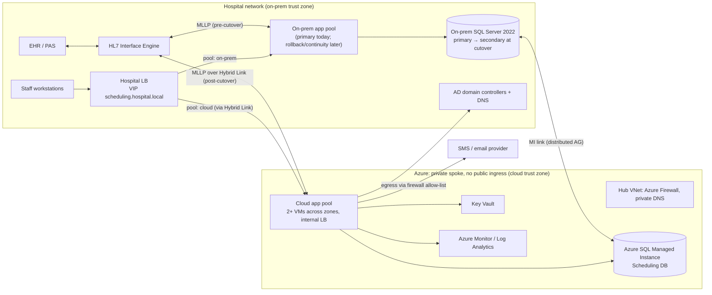

# Plan: Moving the Hospital's Patient Scheduling System to the Cloud Without Downtime

> **About this plan:** The workspace has nothing to inspect except a README saying it is empty, so I couldn't see the scheduling system. I've assumed the most common setup for in-house hospital scheduling systems, and I've marked each assumption where it first appears. Section 5 collects them all, and the questions at the end are the few whose answers would most change the plan.

---

## 1. Summary

- **What:** Move the hospital's on-premises patient scheduling system (the app servers and its database) to the cloud. Scheduling staff should never lose access, and no appointment should be lost, duplicated or double-booked.
- **Shape:** This is a **rehost**, not a rewrite. The same application build runs on cloud VMs. The database is copied continuously to the cloud using the database's own replication. Then, in one rehearsed early-morning window, the database and the app traffic switch over together. The on-premises system stays live as a replica you can switch back to.
- **What "without downtime" means here:** Staff can always open and view schedules. Bookings pause **once, for 5 minutes at most (target 2)**, while a banner says so. The only way to avoid that pause entirely is to let both sites accept bookings at once, and I reject that because it risks double-booking (Decision D9). *Clinical operations needs to confirm this definition.*
- **Key decisions:**
  1. **Database:** Azure SQL Managed Instance (a managed SQL Server service), fed by **Managed Instance link**, which replicates continuously from the on-prem SQL Server and supports a planned switch with no data loss.
  2. **On-prem SQL Server must be version 2022 before cutover.** That version is what lets you switch back online after cutover.
  3. **App and database switch together** in one window, because a chatty app talking to a database across the hospital-to-cloud link is the most likely cause of slow screens.
  4. **The hospital's existing load balancer decides which servers get traffic.** We don't change DNS, so the switch takes seconds and reverses in seconds.
  5. **Redundant private connections** to the cloud (a dedicated circuit plus a VPN backup). After cutover, that link is what keeps scheduling reachable.
- **First milestone (5–7 weeks):** In non-production:
  - a replication test that measures switch-over and switch-back times;
  - an inventory of every system the app talks to;
  - a working slice: book an appointment on the cloud copy, the booking message reaches the test interface engine, then switch back to on-prem.

  Plus the long-lead requests (contracts, circuit order, security review) filed on day one.
- **Top risks:**
  - hidden dependencies (linked databases, file shares, hard-coded addresses, Kerberos sign-in);
  - the connection to the cloud becoming a single point of failure;
  - integration messages being sent twice or lost during the switch;
  - approval lead times (security review, change board, circuit delivery) setting the schedule.

---

## 2. Context and Goals

**Problem.** The scheduling system runs on hospital-owned servers. *Assumption:* the hardware is near end of life or the hospital is closing data centres, and the organisation has a cloud strategy. Clinics, imaging, procedure areas and the call centre book on it all day, and some bookings happen overnight, so a traditional weekend outage is clinically and operationally unacceptable.

**Goals.**
- Run scheduling in the cloud, with the on-prem servers retired within about 90 days of cutover.
- No unplanned outage during the migration. One planned booking pause of 5 minutes or less.
- No appointment lost, duplicated or corrupted, proven by reconciliation (comparing the two databases).
- Screens as fast as today (or faster) for the five most-used workflows.
- Better resilience afterwards: survives the loss of a cloud availability zone, and has disaster recovery in a second region.

**Non-goals.**
- Rewriting or modernising the application (deferred, Section 17).
- Moving the EHR, the HL7 interface engine, or other clinical systems.
- Changing scheduling workflows, screens or reports.
- New patient-facing features.
- Running both sites active at once, or in multiple regions.
- Changing the staff identity provider.

**Success measures (measured 30 days after cutover).**
- Reconciliation finds zero discrepancies.
- Zero P1/P2 incidents caused by the migration.
- p95 screen time within 10% of the baseline (or faster).
- HL7 message volumes in and out match the pre-cutover baseline within normal variance.
- On-prem servers decommissioned by the target date.
- Monthly cloud cost within the approved estimate.

---

## 3. Drivers, Requirements, and Constraints

### Ranked quality attributes

| # | Attribute | Measurable target | Why it matters |
|---|---|---|---|
| 1 | **Data integrity** | Zero lost, duplicated or double-booked appointments caused by the migration. Row counts and checksums on key tables match 100% at cutover and at T+24h. | A missing appointment is a patient-safety event: missed oncology slot, missed surgery pre-op. |
| 2 | **Service continuity** | No unplanned outage. One planned booking pause of 5 minutes or less (target 2), with viewing available throughout. Return to on-prem within 15 minutes at any point during the 90-day stabilisation. *(Targets assumed.)* | Scheduling is used around the clock, and clinical operations will judge the project on this. |
| 3 | **Security and compliance** | HIPAA safeguards. Business Associate Agreement (BAA, the HIPAA contract with the cloud provider) covering every service used. No public endpoints. Patient health data encrypted in transit and at rest. Access audit logs kept 6+ years. *(Assumed US/HIPAA.)* | This is regulated patient health data, and a breach costs far more than downtime. |
| 4 | **Performance parity** | p95 within 10% of baseline for the top five workflows (search slots, book, reschedule, cancel, view day list) at 1.5× peak load. | Staff will blame the cloud for any slowdown. Latency between the app and the database is the main threat. |
| 5 | **Operability and cost** | Run by the existing hospital IT on-call team with no new 24/7 roles. Cloud spend roughly $5–12k/month in steady state *(estimate, Section 11)*. | A small team, and the on-prem system runs alongside for about 3 months, so costs overlap. |

The ranking matters in practice: when continuity (2) conflicts with integrity (1), integrity wins. That is why we accept a short booking pause rather than letting both sites take bookings.

### Key functional requirements that shape the structure
- Staff use the app on the hospital network and sign in with Windows/AD. *(Assumption: browser-based app, not a desktop client that talks to the database directly.)*
- The app receives **HL7 ADT** messages (patient admissions and demographics) and sends **HL7 SIU** messages (new, changed and cancelled appointments) through the hospital interface engine over **MLLP**, the standard TCP framing for HL7.
- Background jobs send SMS and email reminders and run nightly batches. Each must run **in exactly one place** at any time.
- Booking is transactional: slot capacity is enforced in the database.

### Constraints (assumed unless confirmed)
- In-house app on Windows Server and IIS, written in .NET, with source code and a team that can change it.
- SQL Server database of 200 GB–1 TB.
- Microsoft-centric estate (AD, SQL Server), so the cloud is Azure.
- Team: 2 app developers, 1 DBA, 1 infrastructure/cloud engineer, a network engineer at about 50%, plus part-time security/privacy and a clinical liaison.
- Change advisory board (CAB) approval is needed for production changes.

### Hard parts
1. **The database switch and the way back.** Whether you can switch back depends on SQL Server version and MI settings, and server-level objects don't replicate. A mistake here can't be undone.
2. **Hidden dependencies.** Linked servers, file shares, SMTP relays, printers, hard-coded IPs, Kerberos service names, and writes that happen when a user only reads (for example access-audit rows). Each one breaks quietly after a move.
3. **The hybrid link becomes critical.** Today, scheduling keeps working when the internet is down. After the move it depends on the circuit, and latency over it can hurt chatty code.
4. **Integrations must run exactly once during the switch.** The HL7 sender and the reminder jobs must not run in both places, and queued HL7 messages must not be lost.
5. **Organisational lead time.** The BAA, security/privacy review, CAB, circuit delivery (6–12 weeks), and sign-off from clinical operations.

---

## 4. Current State

**Inspected:** nothing. The workspace has only a README stating it's empty. **Assumed current state:**

| Element | Assumption |
|---|---|
| App tier | 2+ Windows/IIS servers behind the hospital load balancer (F5/NetScaler-class) at `scheduling.hospital.local`. Windows Integrated Auth (Kerberos). In-process sessions. |
| Database | SQL Server 2016/2019/2022 (version unknown, and it matters, see D8). Possibly in an Always On availability group (AG). SQL Agent jobs. Possibly linked servers to EHR/reporting databases. |
| Integrations | HL7 interface engine (Rhapsody/Cloverleaf/Mirth-class) sends ADT to an MLLP listener on the app servers and receives SIU. SMS/email provider over the internet. SSRS or BI reports reading the database. |
| Processes | CAB. Clinical downtime procedures (paper plus pre-printed "downtime reports"). 24/7 IT on-call for clinical systems. |
| Cloud | *Assumed:* an Azure enterprise agreement and BAA exist. No landing zone (the base cloud setup of subscriptions, networking and policy) for clinical workloads yet. |

**Conventions the plan follows:** the same app build and configuration model as today, the same database engine, and the hospital's existing load balancer, AD, DNS, interface engine and CAB process.

**Proposed repository layout.** No repo was visible, so these names are suggestions:

| Path | Contents |
|---|---|
| `scheduling-app/` | The existing app |
| `infra/` | Terraform: `landing-zone/`, `envs/nonprod/`, `envs/prod/` |
| `migration/` | `inventory/`, `reconcile/`, `runbooks/`, `decisions/` |
| `pipelines/` | CI/CD definitions |

---

## 5. Assumptions and Open Questions

### Assumptions

| # | Assumption | Impact if wrong | How and when validated |
|---|---|---|---|
| A1 | Custom/in-house app with source access, not a vendor or EHR module | If it's vendor software, the vendor must support Azure and read-only mode. If it's an EHR module (e.g. Epic Cadence), this plan doesn't apply and migration is vendor-led. | Ask now, before M1 starts |
| A2 | Browser-based app, not a desktop client connecting directly to SQL | A desktop client means every workstation talks to the cloud database over the link, which is a different (worse) latency picture | S2, week 1 |
| A3 | SQL Server; on-prem version 2022, or upgradable to it before cutover | On 2016/2019, MI link is one-way, so rollback after cutover needs an outage (backup/restore) | DBA confirms in week 1. The upgrade becomes an M2 task. |
| A4 | Azure is the organisation's cloud, with a BAA in place | If it's AWS or GCP: different database target (Decision D3), and the online rollback story is weaker | Ask now |
| A5 | US/HIPAA jurisdiction. Patient data allowed in non-prod only if that environment is accredited | Changes the compliance controls; drives whether spikes use real or de-identified data | Privacy officer, week 1 |
| A6 | A booking pause of 5 minutes or less, with viewing available, counts as "no downtime" | If zero booking interruption is required, the app needs client-side write queueing (major change) or active-active (rejected) | Clinical operations sign-off, M1 |
| A7 | Scale: 300–1,500 concurrent staff, 5–20k appointments/day, about 50–150 req/s at the 08:00–10:00 peak, database 200 GB–1 TB | Sizing and seeding time change; the architecture doesn't | Baseline capture, T2 |
| A8 | The app can be changed to add a read-only mode and a single-runner lease for jobs | Without them, the switch needs a hard stop (minutes of real downtime) | App lead, week 1 |
| A9 | Downstream HL7 consumers handle a duplicate SIU safely, keyed on appointment ID | A duplicate S12 could create a duplicate appointment downstream | Interface team test in M1 (T15) |

### Open questions

| Question | Owner | Default if unanswered | Needed by |
|---|---|---|---|
| Vendor or in-house app? Part of the EHR? | IT applications lead | In-house (A1) | Before M1 |
| SQL version/edition; is it in an AG? | DBA | 2019 Enterprise, so add the 2022 upgrade (D8) | M1 week 1 |
| Is a 5-minute or shorter booking pause acceptable, and when? | CMIO / clinical ops director | Sunday 03:00–05:00 | M1 end |
| Is there a cloud standard and BAA? Is a landing zone already provisioned? | CIO / cloud team | Azure, new landing zone | Before M1 |
| Hard deadline (hardware end of life, data-centre exit)? | CIO | None; about 5 months to cutover | M1 week 1 |

---

## 6. Architecture Overview

The **Hybrid Link** joins the two trust zones. It is a private connection: an ExpressRoute circuit (Azure's dedicated private line) as primary, with an IPsec VPN as backup. Nothing in Azure has a public IP, and Azure Policy enforces that.

**How the parts fit together.**

- **Before cutover:** the on-prem pool and database serve all users, as today. MI link copies every database change to MI within seconds. The cloud app pool runs the same build, reading MI's read-only copy through a separate test URL, so it can be checked against real data with no risk of writing.
- **At cutover:** bookings pause, MI becomes the primary database, and the hospital LB sends all traffic to the cloud pool. The interface engine is pointed at the cloud listener and bookings resume.
- **After cutover:** the on-prem database becomes the replica, so you can switch back. The on-prem app pool stays warm in two prepared configurations:
  - **rollback-app:** runs against MI;
  - **continuity-readonly:** runs against the local replica in forced read-only mode, for an outage of the Hybrid Link.

| Component | Responsibility | Owns data | Interfaces | Technology | Key dependencies |
|---|---|---|---|---|---|
| Hospital LB | Route staff traffic to a pool; the switch point | None | HTTPS VIP | Existing F5/NetScaler | Hybrid Link |
| Hybrid Link | Private, redundant connection between hospital and Azure | None | BGP-routed private IP | ExpressRoute (1 Gbps) + site-to-site VPN backup | Carrier, hospital edge routers |
| Landing zone | Network, policy, DNS, firewall, identity guardrails | None | Hub-spoke VNets | Terraform, Azure Policy | Azure subscription, AD |
| Cloud app pool | Scheduling UI and logic, HL7 listener, background jobs | Nothing persistent (stateless VMs) | HTTPS (staff), MLLP (in/out), SQL | Windows Server/IIS VMs, same artefact as on-prem | MI, AD, Key Vault, Interface Engine |
| Scheduling DB (MI) | System of record for scheduling data after cutover | Appointments, slots, templates, HL7 outbox/inbox, job leases, app settings | TDS/SQL over a private endpoint | Azure SQL MI, General Purpose, zone-redundant if available in region | MI link |
| MI link | Continuous replication and planned switch in either direction | None (carries data) | Distributed AG endpoint (port 5022 plus MI link port ranges per current docs) | Built into SQL Server 2022 and MI | Hybrid Link |
| On-prem stack | Primary today; rollback and continuity after cutover; retired in M5 | Scheduling DB until cutover | As today | Existing | – |
| Interface Engine | HL7 routing between the EHR and scheduling (unchanged) | Its own message queues | MLLP | Existing | – |
| Key Vault | DB credentials, certificates | Secrets | Private endpoint | Azure Key Vault | – |
| Observability | Logs, metrics, alerts, migration dashboard | Telemetry (no patient data in log text) | Agent and API | Azure Monitor / Log Analytics | – |
| Migration tooling | Reconciliation, runbooks, cutover scripts | Reconciliation reports | CLI scripts | PowerShell/T-SQL in `migration/` | Both databases |

---

## 7. Component Details

**Cloud app pool.** It runs the **same build** as on-prem, deployed by one pipeline to both pools, so both run identical code for the whole migration. It does not hold state; sessions are lost on a pool switch, which is acceptable because Windows sign-on logs users back in silently and the switch happens during the booking pause. Two small code changes are required, and both are useful long-term:

- **Read-only mode.** A flag in the `app_settings` table plus a config override. When on, every write path is disabled with a banner, and the app doesn't write on reads (for example, access-audit rows are buffered or sent to a local log; S2 identifies these writes).
- **Job lease.** A `job_lease` table: a background job runs only if it holds an unexpired lease for its job name, and there is a global `jobs_enabled` switch per pool. This stops the HL7 sender, reminder sender and nightly batches running in two places at once.

The health endpoint `/health/ready` reports whether the database is reachable and writable, whether the MLLP listener is bound, and whether AD is reachable. VMs are spread across 2 availability zones; scale out by adding VMs through Terraform.

**Scheduling DB (MI).**
- **Tier:** General Purpose. Revisit for Business Critical if the load test shows storage latency above target.
- **Update policy:** "SQL Server 2022", so you can switch back to on-prem (verify in S1).
- **Server-level objects don't replicate through MI link.** Logins, SQL Agent jobs, linked servers, credentials and Database Mail must be scripted into `migration/server-objects/` and applied to MI before cutover. Agent jobs stay disabled until MI becomes primary.
- **Failure handling:** zone-redundant high availability inside the region, automated backups with point-in-time restore (35 days), and long-term retention per records policy. Cross-region disaster recovery is added in M5.
- **Lead time:** the first MI provisioning in a new subnet can take hours, so create it early.

**MI link.**
- **Initial seeding** is sized by database size against link bandwidth. Roughly, 1 TB at an effective 500 Mbps takes about 5 hours.
- **Steady-state lag** depends on the peak transaction-log generation rate, which is captured in T2.
- **If the link fails,** the on-prem primary carries on unaffected and the link resynchronises when connectivity returns (provided the on-prem log hasn't been truncated past that point, so log-backup retention must allow for it).
- A **planned switch** temporarily moves to synchronous commit, which is why there is no data loss.

**Hybrid Link.** ExpressRoute is primary and VPN is backup, with BGP failover between them. Provision the VPN first: it takes days and is enough for non-prod and seeding. ExpressRoute is required before cutover. MLLP has no encryption of its own; it is acceptable only because it runs inside the private link. TLS-wrapping MLLP is an option if the interface engine supports it (Section 11).

**Interface Engine.** No change apart from repointing the scheduling outbound channel (engine to app) to the cloud listener's internal LB IP at cutover. The engine queues messages while that channel is paused; the queue depth limit must be confirmed.

**On-prem stack (after cutover).** The SQL Server 2022 secondary receives changes from MI. The app VMs stay patched and warm with both configurations prepared. Retire them only at M5 sign-off.

---

## 8. Data Design

**Entities** (*assumed* typical model; S2 confirms):

| Entity | Notes |
|---|---|
| Patient (reference copy) | Kept up to date from ADT messages |
| Provider / Resource | The person or room being booked |
| Location / Clinic | |
| Schedule Template | Builds Slots |
| Slot | Has many Appointments, up to its capacity |
| Appointment | Linked to Patient, Slot, Referral/Order |
| Appointment History | Audit trail of changes |
| Reminder Log | One per reminder sent |
| HL7 Outbox / Inbox | Integration messages waiting or received |
| User / Role | Staff access |
| `app_settings`, `job_lease` | New in M1 |

**System of record:**
- Scheduling DB: appointments, slots, templates and history. Written only by the app pool that is active, and only that pool.
- EHR/PAS: patient demographics. The scheduling copy is a cache updated by ADT.

**One-writer rule:** at any moment, exactly one database is primary (guaranteed by the AG role) and exactly one pool has `jobs_enabled` on.

**Consistency:** booking stays in a single local transaction (slot check, appointment insert, outbox row), exactly as today. Same engine, same isolation level, same constraints. The migration changes no booking logic.

**Access patterns:** unchanged. Day lists by resource and date, slot search by service and date range, patient lookup. Existing indexes move with the database. Re-baseline query plans on MI in the load test, because compatibility level and hardware change.

**Retention and backup:**
- Retention is as today. *Assumption:* appointment records are retained as part of the legal record (7–10+ years per state law).
- MI keeps 35 days of point-in-time restore, plus long-term retention backups (weekly, kept per records policy).
- A restore test is done in M2 and recorded with its date.
- Target RPO (recovery point objective, the most data you can lose) and RTO (recovery time objective, the time to restore):

| Scenario | RPO | RTO |
|---|---|---|
| Zone failure | 0 | Minutes |
| Region failure, after M5 | 5 s or less | 1 hour or less |
| Region failure, before M5 | ≈ seconds of lag (on-prem replica) | 15 min to switch back |

**Classification:** the whole database is patient health data.
- Encryption at rest with TDE (on by default; use a customer-managed key in Key Vault if hospital policy requires it, and decide that before production provisioning because it's awkward to change later).
- TLS 1.2+ in transit.
- No patient data in application log messages; T17 includes a check for this.
- Non-prod uses de-identified data at production size unless the privacy officer accredits non-prod for patient data (A5).

**Schema changes:** a **schema and release freeze from T-14 days to T+14 days**, apart from emergency fixes deployed to both pools. The `app_settings` and `job_lease` tables are **additive** migrations, shipped to on-prem production in M2 well before cutover so they replicate naturally.

---

## 9. Key Flows

### F1. Booking an appointment (steady state after cutover)
1. Clerk → hospital LB → cloud app pool. Kerberos sign-on uses the service principal name (SPN) registered for `scheduling.hospital.local`.
2. The app opens one transaction on MI: lock the slot, check capacity, insert the appointment and history, insert an outbox row (SIU^S12), commit.
3. The lease-holding sender job reads the pending outbox row, sends it over MLLP to the Interface Engine, waits for the ACK, and marks the row sent.
4. **Failure path: the sender crashes after the ACK but before marking the row sent.** On restart the row is resent, and downstream sees a duplicate S12 with the same appointment ID. Mitigation: confirm downstream treats it as an update or rejects it (A9, tested in T15), and alert on an outbox row resent more than twice.
5. **Latency budget:** user to app over the link is about 2–5 ms per round trip; the app-to-database calls stay inside Azure.

### F2. The cutover (the critical flow, rehearsed at least twice)

| Time | Step | Who | Abort if |
|---|---|---|---|
| T-7d | Go/no-go: two clean rehearsals, lag under 1 s for 7 days, reconciliation clean, both Hybrid Link paths tested, downtime reports printed | Migration lead + CAB + clinical ops | Any criterion not met |
| T-60m | Generate downtime reports. War room open. Read-only test URL verified. | Ops | – |
| T-15m | Lag ≈ 0, pre-cut reconciliation passes | DBA | Mismatch |
| T0 | **Read-only mode on** (banner). Pause the Interface Engine channel into scheduling (messages queue). | App lead, interface team | – |
| T+1m | Wait for HL7 outbox pending = 0. Set `jobs_enabled=false` on-prem. | App lead | Outbox not drained in 3 min: investigate, stay on-prem |
| T+2m | **MI link planned switch.** MI becomes primary, on-prem becomes secondary. | DBA | Switch not done in 5 min: abort, stay on-prem, read-only off |
| T+3m | Repoint DB alias `sched-db.hospital.local` (or config) to MI. Hospital LB: cloud pool weight 100%, on-prem pool 0 (kept as backup member). | Network, app lead | Cloud health checks failing |
| T+4m | **Read-only mode off.** Smoke test: book and cancel in a test clinic. Repoint and resume the Interface Engine channel; queued ADT drains. `jobs_enabled=true` in the cloud. | App lead, interface team | Smoke test fails: roll back (F3) |
| T+5m → T+2h | Watch the dashboard. Post-cut reconciliation. Super-users run scripted checks. | All | Symptom alerts |

The booking pause runs from T0 to T+4m. The rehearsal target is 2 minutes or less.

### F3. Failure: problems found after cutover
- **Within the window, before any new bookings:** switch back with the reverse planned switch, then put the LB back on on-prem. That takes 10 minutes or less.
- **Up to 90 days later:** the same reverse planned switch through MI link to the on-prem SQL Server 2022 copy. No data loss and a 5-minute or shorter booking pause. Rehearsed in M3.
- **The point of no return** is any of these: the on-prem replica is decommissioned, the link is broken past resync, or MI's update policy is changed to "Always-up-to-date". Each is a deliberate CAB decision in M5.

### F4. Failure: the Hybrid Link fails after cutover
1. The ExpressRoute circuit drops, BGP fails over to the VPN within seconds to a minute, and the alert "Hybrid Link on backup path" pages the network on-call.
2. **If both paths are lost,** the cloud pool is unreachable from the hospital. The on-call engineer follows `runbooks/hybrid-link-outage.md`: within 5 minutes, switch the LB to the on-prem pool in its **continuity-readonly** configuration. Staff can view schedules from the local replica, which is stale only by the length of the outage. Clinical downtime procedures cover new bookings on paper, entered later as today.
3. **Why manual:** automatic failover to read-only on a flapping health check would bounce clinicians into read-only mode for no reason.

After M5, when the on-prem replica is retired, this degraded mode depends on circuit redundancy plus downtime reports. Section 17 covers whether to keep a small on-prem read replica permanently.

---

## 10. Key Decisions

| # | Decision | Options considered | Rationale (vs drivers) | Reversibility | Revisit if |
|---|---|---|---|---|---|
| D1 | **Rehost with continuous database replication and one coordinated switch** | (a) This. (b) Rewrite cloud-native and migrate piece by piece (strangler). (c) Both sites accept writes and sync both ways. (d) Backup/restore weekend outage. | Best for integrity (1) and continuity (2): one engine, one writer, a tested way back. (b) takes 12+ months and changes behaviour. (c) risks double-booking. (d) means hours of downtime. | Medium | The app can't run on Azure VMs, or it turns out to be vendor software |
| D2 | **Azure SQL MI via MI link** | (a) MI. (b) SQL Server on Azure VMs with a distributed AG. (c) Azure SQL Database. | MI is managed (fits driver 5), close to SQL Server compatibility, and switches both ways with 2022. (c) has no Agent jobs or cross-database queries and no online link. | Hard | The S1 assessment finds blockers (unsupported features, linked-server needs, CLR). Then use (b): same replication model, more operations work. |
| D3 | **Azure** | Azure vs AWS (RDS for SQL Server, migrated with DMS change capture) | Microsoft estate, AD integration, and MI link's online switch-back. AWS has no equal for switching back. | Hard | The organisation has a different mandated cloud (A4) |
| D4 | **App on VMs, same build** | (a) VMs. (b) App Service or containers now. | Change one thing at a time. Moving location and platform together doubles the unknowns at cutover. | Easy (modernise later) | – |
| D5 | **App and database switch together** | (a) Together. (b) Database first, then shift users gradually. (c) App first. | (b) and (c) both put chatty app-to-database traffic over the link for weeks (performance, 4). (a) has one short window and a rehearsed way back. | Easy (sequencing) | S2 shows 10 or fewer database round trips per request and link RTT of 3 ms or less. Then (b) is acceptable and gives a gradual shift. |
| D6 | **Switch traffic at the existing hospital LB** | LB pool weights vs DNS cut-over | Instant, reversible, and no workstation DNS caching. Uses kit and skills the team already has. | Easy | – |
| D7 | **ExpressRoute plus VPN backup** | VPN only vs ExpressRoute only vs both | After cutover the link carries a clinical system (continuity, 2). VPN only gives no bandwidth or latency guarantee. | Medium | – |
| D8 | **On-prem SQL Server is 2022 before cutover** | Upgrade first vs accept a one-way move | Without 2022, switching back after cutover means hours of outage: the safety net disappears. | Easy | On-prem is already on 2022 |
| D9 | **Booking pause of 5 minutes or less (read-only mode)** | Read-only pause vs both sites writable vs hard stop | Integrity outranks a zero-second pause. Read-only keeps viewing available. | Easy | Clinical operations rejects any pause (A6) |
| D10 | **Terraform for infrastructure** | Terraform vs Bicep | Wider skills market; state in Azure Storage with blob-lease locking. | Easy | The organisation standardises on Bicep |

---

## 11. Cross-Cutting Concerns

**Security** (built M1, assessed M2):

- **Identity and access.** Staff sign-on stays on AD/Kerberos. Register the SPN for `scheduling.hospital.local` on the shared app-pool service account so either pool can serve the name (S3).
- **Database login.** The app uses a SQL login stored in Key Vault; the VMs fetch it with managed identity. Move to an Entra managed identity later (Section 17).
- **Admin access.** Separate admin identities, PIM just-in-time roles for Azure admins, no standing Owner role.
- **Platform guardrails.** Azure Policy denies public IPs and public database endpoints, enforces allowed regions, and requires diagnostic settings.

| Threat | Mitigation |
|---|---|
| Accidental public exposure of patient data | Deny policies, private endpoints only, policy compliance checked in CI |
| Ransomware moving from on-prem into Azure over the Hybrid Link | Firewall allows only the needed ports between zones; separate admin identities; immutable long-term-retention backups |
| Patient data exposed in non-prod or backup files | De-identified non-prod (A5); no long-lived SAS tokens; storage behind private endpoints |
| Over-broad insider or vendor access | RBAC on resource groups; SQL auditing to immutable storage |
| Unencrypted MLLP | Runs only inside the private link; TLS-wrapped MLLP if the engine supports it (M2) |

Other controls:
- **Assessment and contracts:** a HIPAA risk assessment update, a security review and a penetration test of the cloud environment in M2, and confirmation that every Azure service used is in BAA scope.
- **Vulnerabilities:** Defender for Cloud and vulnerability scanning on the VMs.

**Reliability** (M1–M3):
- **Availability:** zone-redundant app and database; target 99.9% monthly after cutover. *(Assumed; it may exceed today's on-prem figure, which T2 measures.)*
- **Timeouts:** the MLLP sender times out at 30 s and retries with backoff.
- **Interface engine queue:** sized for at least 1 hour of ADT.
- **Rollback and outages:** the rollback and connectivity-outage paths are F3 and F4.

**Observability** (M1, extended in M2): a migration dashboard plus symptom-based alerts. Each alert links to a runbook.

| Signal | Alert threshold |
|---|---|
| MI link lag | Over 30 s for 5 min before cutover |
| Bookings per minute vs the same hour last week | Drop over 50% during business hours (the main symptom alert) |
| App error rate | Over 2% for 5 min |
| p95 for the top-5 workflows | Over 1.1× baseline for 15 min |
| HL7 outbox pending count, and the engine's queue depth | Over 200 for 10 min |
| Hybrid Link path state | Any path down |

Logs carry correlation IDs and contain no patient data.

**Performance and capacity** (M3): load test with k6 or JMeter scripts for the top-5 workflows at 1.5× the measured peak, against a production-size database on MI, from a hospital-network test host so the real link is in the path. Expected bottlenecks: chatty pages (S2), MI General Purpose storage latency, and plan regressions after the compatibility-level change.

**Cost** (rough list prices, *to be validated with the Azure pricing calculator in M1*):

| Item | Monthly |
|---|---|
| MI General Purpose, 8 vCores | $1.5–2.5k ($3.5–4.5k for Business Critical; Azure Hybrid Benefit can cut this a lot) |
| 3–4 app VMs | $0.6–1.2k |
| ExpressRoute port + carrier circuit | $1.5–4k |
| Firewall | About $1k |
| Monitoring | $0.2–0.8k |
| **Total** | **About $5–12k/month** |

Plus about 3 months of overlap with on-prem. Controls: cost tags (`app=scheduling`, `env`, `costcenter`), a budget alert at 80% and 100%, and reserved instances bought only after 30 days of stable sizing.

**Operations:**
- Hospital IT on-call owns the system after cutover.
- Runbooks in `migration/runbooks/`: `cutover.md`, `rollback.md`, `hybrid-link-outage.md`, `mi-zone-failover.md`.
- An Azure support plan with a fast severity-A response, purchased in M1 as a long-lead item.
- Hypercare war room for the cutover night and 2 weeks of business-hours coverage afterwards.

**AI-specific concerns:** not applicable; there are no AI components.

---

## 12. Build Sequence

**Team assumption:** 2 app developers, 1 DBA, 1 cloud/infra engineer, about 0.5 network engineer, plus part-time security, privacy and a clinical liaison. Sizes are elapsed-time ranges, not commitments.

| Milestone | Goal | Scope (and exclusions) | Deliverables | Exit criteria | Depends on | Size |
|---|---|---|---|---|---|---|
| **M1: Prove the path** | Clear hard parts 1, 2 and 4; start the long-lead items | Non-prod landing zone, VPN, spikes S1–S3, read-only mode, job lease, pipeline, thin slice. *No production data in Azure.* | Terraform landing zone; dependency inventory; S1/S2/S3 reports; thin slice working end to end; reconciliation v1; runbook v0 | Thin slice passes twice (book in the cloud, SIU reaches the test engine, switch back to on-prem with matching data); S1 switch time 2 min or less; every dependency has a treatment | Long-lead requests on day 1 | 5–7 weeks |
| **M2: Production replica and dark launch** | Real data flowing; cloud pool checked against production read-only | Prod landing zone, ExpressRoute live, SQL 2022 upgrade if needed, `app_settings`/`job_lease` released on-prem, prod MI seeded, server objects scripted, read-only test URL, security review and pen test | Prod MI in sync; super-users check the cloud pool against real data; restore test recorded; pen test report | Lag under 1 s at peak for 7 days; daily reconciliation clean; pen test has no open high findings; BAA scope confirmed | M1; ExpressRoute delivery (**critical path**) | 4–6 weeks |
| **M3: Rehearse** | Make the cutover routine | Two full dress rehearsals on a production-size staging copy (cutover and rollback, timed); load test; clinical comms; downtime reports refreshed | Final runbook with timings; load-test report; signed go/no-go checklist | Two consecutive rehearsals with a pause of 5 min or less and a clean rollback; p95 within 1.1× baseline at 1.5× peak; CAB approved | M2 | 2–4 weeks |
| **M4: Cutover and hypercare** | Go live | Production cutover (F2); 2 weeks hypercare | Production on Azure; on-prem as replica | Reconciliation clean at T+24h and T+7d; no P1/P2 from the migration; HL7 volumes normal | M3 | 1 night + 2–3 weeks |
| **M5: Disaster recovery and retirement** | Remove the old system and dual costs | Cross-region failover group; DR drill; CAB decision to retire the on-prem replica (point of no return); decommission and certified data destruction | DR drill report; retired servers | DR drill meets RPO 5 s or less / RTO 1 h or less; on-prem off by about T+90d | M4 + 30 days stable | 6–12 weeks elapsed, low effort |

**Critical path:**

> Long-lead approvals (BAA confirmation, security intake, ExpressRoute order) → S1 result → SQL 2022 upgrade (if needed) → production seeding → 7 days of stable lag → rehearsals → cutover

That is about 4–6 months to cutover. The ExpressRoute circuit (6–12 weeks) is the most likely item to set the date.

**Can run in parallel:** app changes (read-only mode, lease, health endpoint) alongside the landing zone, and S2/S3 alongside S1.

---

## 13. First Milestone Task Breakdown

Order: T1 and T2 on day 1. T3–T6 run in parallel in weeks 1–2. T7 and T8 need T5 and T6. T9–T13 run in parallel with the spikes. T14–T18 come last.

| # | Task | Location | Done when |
|---|---|---|---|
| T1 | **Submit the long-lead requests:** BAA scope confirmation, ExpressRoute order (circuit plus carrier), security/privacy review intake, CAB slots for M2–M4, Azure support plan, clinical operations review of the pause definition (A6) | `migration/decisions/long-lead.md` | Every request has a ticket or PO number, owner and expected date recorded |
| T2 | **Capture baselines** for 2 weeks: p95 for the top-5 workflows, peak req/s, bookings per hour by hour of week, HL7 messages per hour in and out, database size, peak log generation (MB/s), SQL version/edition/AG layout | `migration/baseline.md` | All fields filled from real measurements; quietest weekly window identified |
| T3 | **Spike S2, dependency inventory** (5 days). *Question:* what does the app talk to, and how chatty is it? Use an Extended Events session plus netstat/IIS config review for: outbound connections, linked servers, file shares, SMTP, printers, hard-coded hostnames/IPs, database round trips per request on the top-5 pages, and writes that happen on reads. | `migration/inventory/dependencies.csv`, `migration/spikes/s2.md` | Every connection has a port, owner and migration treatment, reviewed by the app lead and network. *Changes the plan if:* it's a desktop client (A2); there are unmovable on-prem dependencies; or round trips are 10 or fewer (then D5 becomes a gradual shift). |
| T4 | **Run an Azure Migrate SQL assessment** for MI against a production-size copy | `migration/spikes/mi-assessment.md` | Report shows no MI blockers, or each blocker has a fix or triggers D2 option (b) |
| T5 | **Build the non-prod landing zone in Terraform:** hub/spoke VNets, delegated MI subnet, app subnet, NSGs, Azure Firewall, private DNS zones, Key Vault, Log Analytics, policies (deny public IP, allowed regions, required tags). State in a storage account with blob locking. | `infra/landing-zone/`, `infra/envs/nonprod/`, `pipelines/infra.yml` | CI runs `terraform plan` on each PR; apply only through the pipeline; policy compliance 100% |
| T6 | **Bring up the non-prod site-to-site VPN** to the hospital edge | `infra/envs/nonprod/connectivity.tf`, edge router config | An on-prem test host reaches the app subnet on 443 and the MI link ports; RTT and throughput recorded in `migration/baseline.md` |
| T7 | **Spike S1, MI link** (5 days, after T5/T6). *Question:* how long do seeding, lag at peak log rate, planned switch, and switch back take on this version and data size? Steps: non-prod on-prem SQL Server 2022 with a de-identified production-size copy, then MI link to non-prod MI (update policy "SQL Server 2022"), replay peak write load, switch to MI, then back. | `migration/spikes/s1.md` | Timings recorded for each step. *Changes the plan if:* lag over 5 s at peak, switch over 2 min, or switch-back unsupported (move to D2 option (b)); or seeding over 24 h (needs ExpressRoute before production seeding). |
| T8 | **Spike S3, sign-on and database authentication** (3 days). *Question:* can cloud VMs serve `scheduling.hospital.local` with Kerberos alongside the on-prem pool, and can the app reach MI with a Key Vault-held SQL login? | `migration/spikes/s3.md` | A test user gets silent sign-on through either pool; the app connects to MI without a stored plaintext secret |
| T9 | **Add read-only mode:** `app_settings.write_mode` plus a config override; banner; all write endpoints blocked; writes-on-read (from T3) buffered | `scheduling-app/` (settings module, write services) | Integration test: in read-only mode, every write path is refused gracefully and the database sees zero writes (traced) during a scripted session |
| T10 | **Add the job lease:** `job_lease(job_name, owner, expires_at)` and a per-pool `jobs_enabled`; HL7 sender, reminders and batches check the lease | `scheduling-app/` (jobs), additive migration in `scheduling-app/db/migrations/` | Test with two instances: each job runs on exactly one; killing the holder hands over within lease expiry; migration applies and rolls back cleanly |
| T11 | **Add `/health/ready`:** database writable flag, MLLP bound, AD reachable | `scheduling-app/` | Returns 503 when the database is read-only or unreachable (tested); the LB monitor uses it |
| T12 | **Create one pipeline** that builds a single versioned build and deploys it to on-prem non-prod and to the cloud non-prod VMs | `pipelines/app.yml`, `infra/envs/nonprod/app.tf` (2 VMs in 2 zones plus internal LB) | One commit lands the same version on both pools; VMs are rebuildable from code |
| T13 | **Wire up observability:** app logs and metrics to Log Analytics; alerts for error rate, lag, p95, HL7 pending, link down; patient-data log check | `infra/envs/nonprod/monitoring.tf` | An injected failure (stopped database or MLLP) pages the test on-call within 5 min; the log check finds no patient data in a sample |
| T14 | **Set up the non-prod LB pool switch** on the hospital LB: on-prem and cloud members with weights | Hospital LB config (change ticket) | Moving 100% of weight moves a logged-in tester with at most 1 failed request |
| T15 | **Run the thin slice end to end:** book in a test clinic on the cloud pool, SIU reaches the test interface engine channel, ADT flows in, switch back to on-prem, appointment visible, outbox not resent. Also test a duplicate SIU against downstream (A9). | `migration/tests/thin-slice.ps1` | Script passes twice in a row; duplicate-SIU behaviour documented |
| T16 | **Write reconciliation v1:** row counts plus hash aggregates per key table (appointments by date, slots, outbox), primary vs replica | `migration/reconcile/` | Runs in under 10 min on production-size data; catches a deliberately altered row |
| T17 | **Draft cutover and rollback runbook v0** from S1 timings, following F2/F3 | `migration/runbooks/cutover.md`, `rollback.md` | Reviewed by the DBA, app lead, network and interface team; every step has an owner, a time and an abort condition |
| T18 | **Demo to stakeholders:** thin slice, S1 timings, inventory; confirm the pause definition with clinical operations | – | Sign-off recorded in `migration/decisions/` |

---

## 14. Testing and Validation Strategy

| Risk | Test | When | Blocks release? |
|---|---|---|---|
| Read-only mode or lease regressions | Unit and integration tests (T9, T10) in CI | Every commit | Yes |
| Data divergence | Reconciliation (T16): daily in M2, before and after the cut, T+24h, T+7d | M2–M4 | Yes, at go/no-go |
| Switch and switch-back don't work | Timed rehearsals on a production-size staging copy | S1, M3 ×2 | Yes |
| Integration loss or duplicates | HL7 harness: count in and out by type; duplicate-SIU test; engine queue drain | M1, M3 | Yes |
| Performance | k6/JMeter top-5 workflows at 1.5× peak through the real link | M3 | Yes (p95 within 1.1× baseline) |
| Hidden behaviour | Super-user scripted checks on the read-only test URL against production data | M2 | Yes |
| Security | Policy compliance in CI; vulnerability scan; pen test | M1–M2 | High findings block |
| Hybrid Link outage | Pull the ExpressRoute path in staging (BGP failover); drill the continuity-readonly runbook | M3 | Yes |
| Backup integrity | MI point-in-time restore to a new database plus reconciliation | M2 | Yes |

Test data is de-identified at production size (A5), with load produced by replay or synthetic generation.

---

## 15. Rollout, Migration, and Rollback

**Side by side:** the on-prem stack is primary until cutover. The cloud stack is a live replica that stays read-only, reached only through the test URL. After cutover the roles reverse for up to 90 days.

**Data migration:** there is no batch migration. MI link seeds the copy and then streams every change. Server-level objects (logins, Agent jobs, linked servers, Database Mail) are scripted, applied before cutover, and checked by a diff script.

**Switchover criteria:** the go/no-go list in F2 (T-7d).

**Users:** all at once, at the LB, inside the pause. A gradual shift by percentage is possible only if S2 changes D5.

**Rollback by step:**

| Step | Rollback | Time |
|---|---|---|
| Before the switch (T0–T+2) | Read-only mode off on-prem; resume the engine channel | Under 2 min |
| After the switch, before writes | Reverse planned switch, LB back | Under 10 min |
| Days 1–90 | Reverse planned switch (rehearsed); new data comes back with it | Under 15 min, with a booking pause of 5 min or less |

**Point of no return:** the on-prem replica is retired, the link breaks beyond resync, or MI's update policy changes. Each needs explicit CAB approval in M5.

---

## 16. Risks and Mitigations

| Risk | Likelihood | Impact | Mitigation | Early warning | Owner |
|---|---|---|---|---|---|
| A hidden dependency breaks after cutover | High | High | S2 inventory; super-user checks on real data in M2; rehearsals | Unknown connections in the XEvents/netstat capture | App lead |
| On-prem is SQL 2016/2019, so no online switch-back | Medium | High | Upgrade to 2022 in M2 (D8) | T2 version check | DBA |
| ExpressRoute delivery slips | High | Medium | Order on day 1; VPN for non-prod and seeding; don't cut over without both paths | No carrier date by week 3 | Network |
| Hybrid Link outage after cutover | Low–Med | High | Dual paths; continuity-readonly mode; downtime procedures | Link-path alerts | Network |
| HL7 messages duplicated or lost at cutover | Medium | High | Outbox drain, job lease, engine queueing, count reconciliation, duplicate test | Count mismatch in rehearsal | Interface team |
| Performance regression (chatty code, plan changes) | Medium | Medium | Switch app and database together; load test; Query Store plan forcing | p95 drift in M3 | DBA |
| Clinical operations rejects any pause | Low–Med | High | Agree the definition in M1 (T18); a demo of read-only mode helps | Pushback in the T1 review | Clinical liaison |
| Security or privacy review delays M2 | Medium | Medium | Intake on day 1; share the architecture early | No reviewer assigned by week 2 | Security lead |
| The team is new to Azure | Medium | Medium | One managed database, VMs for familiarity; a partner or Microsoft FastTrack for the landing zone review | Terraform/landing zone slips past week 3 | Infra lead |
| Running both sites costs more and on-prem is never retired | Medium | Low | Retirement date set in M5 with CAB | No M5 date set by T+30d | PM |

---

## 17. Deferred Work and Future Evolution

| Deferred | Trigger |
|---|---|
| Modernise the app (App Service or containers, managed identity to the database) | 60 days stable after cutover, plus a business case |
| Cross-region DR failover group | M5 (scheduled, not optional) |
| Keep a small on-prem read replica permanently for continuity | If the F4 drill or clinical operations judges downtime reports insufficient |
| TLS-wrapped MLLP | If the engine supports it; otherwise when the engine is upgraded |
| Customer-managed TDE key | If hospital policy requires it. Decide before production MI is provisioned. |
| Reserved instances / savings plan | After 30 days of stable sizing |
| Moving the interface engine or reporting to the cloud | Separate projects |

**Debt taken on purpose:**
- A SQL login secret instead of managed identity. Paid back with the app modernisation.
- VM-hosted IIS. Same.
- Read-only mode remains. It becomes a permanent maintenance and continuity feature, so it isn't really debt.

---

## 18. Next Steps

1. **Today:** the IT applications lead confirms A1 (in-house or vendor/EHR module) and A2 (browser app or desktop client). These two answers can change the whole plan.
2. **Today:** the DBA runs `SELECT @@VERSION, SERVERPROPERTY('Edition'), SERVERPROPERTY('IsHadrEnabled');` and records the results in `migration/baseline.md` (D8).
3. **This week:** file the T1 long-lead requests (ExpressRoute order, BAA scope, security intake, CAB slots, support plan).
4. **This week:** the CMIO or clinical operations director reviews the read-only pause definition (A6) and the preferred window.
5. **Week 1:** start T2 (baselines), T3 (dependency inventory) and T5 (Terraform landing zone in `infra/`) in parallel.

---

### Open questions that would most change this plan

1. **Is the scheduling system in-house code, a vendor product, or part of your EHR?** In-house is the default. If it's an EHR module, migration is vendor-led and most of this plan changes.
2. **Is it a web app, or a desktop client that connects straight to the database?** A desktop client puts every workstation's queries across the hospital-to-cloud link.
3. **Which SQL Server version is on-prem, and which cloud are you standardised on?** 2022 on Azure gives an online way back after cutover. Anything else weakens rollback or changes the database target.
4. **Will clinical operations accept a booking pause of 5 minutes or less, with viewing still available?** If the answer is "zero seconds of booking interruption," the app needs major changes.
5. **Is there a hard deadline (hardware end of life, data-centre exit)?** ExpressRoute delivery and approvals already put cutover about 4–6 months out.
