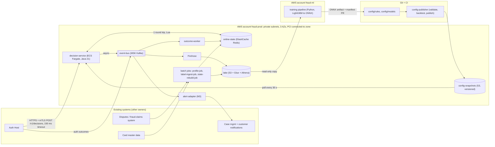

# Architecture and Build Plan: Real-Time Card Fraud Detection

**How I approached this.** The workspace is empty. Its `README.md` says there is no code, config or data to inspect. You also didn't give any context beyond the one-line request. So this is a greenfield plan built on stated defaults. I didn't stop to ask questions first. The most uncertain points are scheduled as Milestone 1 spikes, and the questions that would most change the plan are at the end. The biggest default is that **you are a card issuer whose existing authorisation system calls the fraud check during each authorisation.** If you are an acquirer, a payment processor or a merchant, Sections 3, 7 and 9 change a lot.

---

## 1. Summary

- **What:** a fraud-decision service that the issuer's existing **Auth Host** (the system that approves or declines card authorisations) calls during each authorisation. It returns `APPROVE`, `DECLINE`, `APPROVE_AND_ALERT` or `NO_DECISION` within a tight time limit, and it feeds a loop that learns from fraud outcomes. The users are the fraud operations team, who write rules and work alerts, and cardholders, who should see less fraud and fewer wrongly declined purchases.
- **Shape:** one low-latency deployable, **`decision-service`**, runs the whole hot path: validate, compute features, run rules, score with the model, apply policy. It keeps per-card state in Redis and sends every decision, including the exact feature values it used, to Kafka and then to an S3 data lake. Rules and model versions live in Git and reach the service as immutable snapshots. Training, label ingestion and profile building are offline batch jobs.
- **Key decisions:**
  1. **Inline decisions with a safe fallback.** The Auth Host waits at most 150 ms. On a timeout or `NO_DECISION` it applies its existing static rules, so the fraud service can never block an authorisation.
  2. **Card features are computed during the request** with one atomic Redis script. This gives exact, millisecond-fresh velocity counts with no stream-processing cluster to run.
  3. **The exact feature values used for each decision are logged** and reused for training and rule backtests. This removes most of the risk of the model seeing different features in training than in production ("training/serving skew").
  4. **Rules are written in CEL** (Common Expression Language, a safe and fast expression language) and stored in Git. Pull-request approval provides a second-person check, and CI validates and backtests every change. There is no rules UI in v1.
  5. **No card numbers (PANs) or other sensitive card data enter the system.** It only sees a card token and the BIN (the first 8 digits). This keeps PCI scope small.
- **Milestone 1 (about 6–8 weeks):** the Auth Host's test environment calls the staging `decision-service` end to end. That covers real velocity features, five starter rules from Git, an in-process model, events landing in the lake, dashboards, the fallback proven by killing the service, and a load test at 3,000 TPS. It also includes spikes on latency, the Auth Host contract, and historical data quality.
- **Top risks:** the Auth Host team's capacity and their real time budget; whether historical labels are good enough for a first model; a bad rule wrongly declining good customers at scale; model-risk and PCI reviews taking longer than expected.

## 2. Context and Goals

- **Problem (assumed):** today fraud is caught by the Auth Host's (or processor's) basic static rules plus next-day batch review. New attack patterns, such as card testing or account takeover followed by fast spending, run for hours before anyone reacts. Losses and wrongly declined customers are both higher than they need to be.
- **Goals:**
  - Make a risk decision on 100% of authorisations within the Auth Host's time budget.
  - Cut fraud losses, in basis points of purchase volume, without raising the number of good customers who get declined.
  - Let fraud ops put a new rule live within 30 minutes when an attack starts.
  - Make every decision reproducible for audit and disputes.
- **Non-goals for v1:**
  - 3-D Secure risk-based authentication (the online "verify it's you" step).
  - Building a case-management tool. We integrate with the existing one.
  - Automatically blocking cards. Only analysts block cards.
  - Device or behavioural biometrics.
  - Network or graph features (fraud rings).
  - Multi-region active-active.
  - Any LLM on the decision path.
  - Merchant-side fraud and anti-money-laundering (AML).
- **Success measures, checked 3 months after decline enforcement starts:**
  - Fraud losses in bps down ≥ 25% against the baseline measured in Spike S3.
  - False-positive ratio (good declines per fraud decline) ≤ 8:1.
  - Alert volume within ops capacity.
  - Zero authorisation failures caused by the fraud service.
  - Median time from "attack detected" to "rule live" ≤ 30 min.

## 3. Drivers, Requirements, and Constraints

**Ranked quality attributes** (all targets are assumptions until confirmed in Spikes S2 and S3):

| # | Attribute | Measurable target | Why it matters |
|---|---|---|---|
| 1 | Authorisation-path latency and availability | Server-side p99 ≤ 50 ms and p99.9 ≤ 100 ms at 3,000 TPS. 99.95% of requests per month answered inside the Auth Host's 150 ms timeout. 0 authorisations failed because of us. | A slow or down fraud check hurts every cardholder immediately. Detection improves gradually; outages hurt straight away. |
| 2 | Detection at bounded customer friction | Catch ≥ 60% of fraud value at false-positive ratio ≤ 8:1. Alerts ≤ 1,500/day (assumed ops capacity). | This is why the system exists. It is capped by customer friction and analyst headcount. |
| 3 | Speed of response to new attacks | An approved rule is live in prod ≤ 30 min after the PR opens. The model can be refreshed at least monthly. | Fraudsters adapt within days, and a model retrain takes weeks. Rules are the fast lever. |
| 4 | Auditability and compliance | 100% of decisions can be reconstructed (inputs, features, rule-set version, model version, output) for 7 years. Card numbers and sensitive authentication data are never received or stored. | Disputes, regulators, model-risk review, PCI DSS. |
| 5 | Operability and cost | ≤ 1 page/week after stabilisation. Run cost ≤ $10k/month. | A small team runs this. |

**Ranking rule:** when 1 and 2 conflict, the service answers on time with fewer features rather than late with all of them. When 2 and 3 conflict, a rule ships now and the model catches up later.

**Key functional requirements:**
- Score each authorisation using the request fields, card velocity, merchant velocity and card profile.
- Combine hard rules, allow/block lists and a model score into one action, with reason codes.
- Support shadow mode (decide but don't enforce) at three levels: the whole system, each rule, and each model.
- Support a percentage rollout by card.
- Provide a kill switch.
- Bring in authorisation outcomes and fraud labels.
- Backtest rules.
- Retrain and promote models with approval gates.

**Constraints (assumed):**
- AWS, one region, in the same region as the Auth Host.
- Team: 4 backend engineers (JVM), 1 data scientist, 1 data engineer, 0.5 SRE, and a part-time fraud-ops subject-matter expert (SME).
- No fixed deadline.
- PCI DSS applies.
- Bank-style model risk management (independent validation before a model affects customers).
- 12–24 months of tokenised historical authorisations and fraud claims exist in a warehouse.

**Hard parts:**
1. **Stateful features inside a 50 ms p99:** each request has to read and update per-card counters atomically, including duplicate requests and bursts on one card.
2. **Auth Host integration:** another team owns it, it is on the critical path, and we don't know its timeout, retry, fallback or network behaviour.
3. **Label delay and training/serving skew:** fraud claims arrive 30–90 days late, and offline features must match online features exactly.
4. **Safe change in production:** one wrong rule or threshold can decline thousands of good customers a minute.
5. **Access to historical data and governance approvals** (data access, PCI scoping, model validation) take a long time and sit outside the team's control.

## 4. Current State

- **What I inspected:** the working directory. It contains only `README.md`, which says it is intentionally empty. There is no code, infrastructure-as-code, CI or data to build on.
- **Assumed organisational context** (each item is checked in Section 5):
  - An existing Auth Host that can make outbound HTTPS calls during authorisation and already has static fallback rules.
  - A disputes or fraud-claims system that can export daily.
  - A card master-data feed.
  - Existing case-management and customer SMS/push platforms.
  - An org metrics stack (assumed Prometheus/Grafana).
  - Card tokens already issued by an internal token vault.
- **Conventions adopted** (proposed, since there are none yet):
  - One monorepo `fraud-platform/`.
  - Gradle and Java 21 for services, Python 3.11 for ML.
  - Terraform for infrastructure.
  - Secrets in AWS Secrets Manager.
  - Proposed layout:

```
fraud-platform/
  contracts/decision-api/v1/openapi.yaml   contracts/events/*.avsc   contracts/features/feature-set-v1.yaml
  services/decision/        services/outcome-worker/
  jobs/profile/  jobs/label-ingest/  jobs/state-rebuild/
  config/rules/*.yaml       config/models/active.yaml     tools/config-publisher/
  ml/  (offline features, training, parity tests)         loadtest/
  infra/terraform/{modules,envs/staging,envs/prod,envs/ml}
```

## 5. Assumptions and Open Questions

**Assumptions:**

| Assumption | Impact if wrong | How and when it's validated |
|---|---|---|
| We are an issuer, and the Auth Host can call us inline | Acquirer or merchant: different features, contract and actions. No inline hook: start in async alert-only mode, which the same service supports by consuming auth events | Kickoff, week 1 |
| Auth Host timeout is about 150 ms, it does not retry, and it has static fallback rules | A tighter budget means co-location or a smaller feature set. Retries make deduplication critical (already built in) | Spike S2, week 2 |
| Auth Host is in the same AWS region with ≤ 10 ms p99 network round trip | If it's on-prem or at a third-party processor: Direct Connect or PrivateLink, a longer lead time, and a smaller server budget | S2 and the network request, week 1 |
| 5M active cards, 200 TPS average, 1,500 TPS peak, designing for 3,000 TPS | At 10× that, revisit Redis sharding and hot keys (D2) | S3 data extract, week 2 |
| 12–24 months of history with fraud labels, tokenised | Without usable labels, launch with rules only and bring the model in later (the plan already allows this) | S3, weeks 2–4 |
| Auth Host can publish outcome events (approved/declined/reversed) to Kafka within seconds | Without them, decline-based velocity features are lost. Fallback: an `POST /v1/outcomes` endpoint that the Auth Host calls fire-and-forget | S2 |
| The team knows the JVM and Python, and the org runs Kafka | Without Kafka, switch to Kinesis. The design doesn't change | Week 1 |
| Ops can handle about 1,500 alerts/day | Sets the alert threshold | Fraud ops lead, M2 |
| Decision records are kept 7 years | Storage cost and deletion design | Compliance, M1 |

**Open questions:**

| Question | Who can answer | Default if no answer | Needed by |
|---|---|---|---|
| Fail-open policy: on timeout or `NO_DECISION`, does the Auth Host approve, apply static rules, or decline above a limit? | Head of fraud / risk owner | Apply existing static rules | End of M1 |
| Is the fraud service "connected-to" or inside the cardholder data environment (CDE)? Which PCI controls apply? | QSA / PCI lead | Treat as connected-to, apply full CDE network controls | M2 prod build |
| Model-risk validation: what's the process and lead time? | Model risk team | 4–6 weeks; enforce with rules only until approved | Start in M1 |
| Who owns the disputes-system export, and in what format? | Disputes system owner | Daily CSV to S3 | M2 |

## 6. Architecture Overview



**How it fits together:**
- Only `decision-service` is on the authorisation path. Its single synchronous dependency is Redis.
- Kafka, the lake, CI and the training pipeline can all be down without affecting authorisations.
- Configuration (rules, model, thresholds, rollout percentage) flows one way: from Git to an immutable snapshot to the service's memory. If snapshot publishing fails, the service keeps its last good snapshot.
- Learning flows the other way: decisions, outcomes and labels go to the lake, then to training and backtests, then back through a reviewed PR.

**Component table:**

| Component | Responsibility | Owns data | Interfaces | Technology | Key dependencies |
|---|---|---|---|---|---|
| `decision-service` | Validate, compute features, run rules, score, apply policy, update state, emit event | `card:{t}:attempts`, `merchant:{m}:attempts`, decision dedupe keys | `POST /v1/decisions` (sync); produces `fraud.decisions.v1` | Java 21, generational ZGC, cel-java, ONNX Runtime | Redis (hard), snapshot bucket (soft), MSK (soft) |
| `online-state` | Low-latency per-card and per-merchant state | Nothing of its own; it is storage for the writers listed here | Redis protocol | ElastiCache Redis, cluster mode, Multi-AZ | — |
| `event-bus` | Durable, replayable event log | Topics `fraud.decisions.v1`, `auth.outcomes.v1` | Kafka, Avro + Glue Schema Registry | Amazon MSK, 3 brokers | — |
| `outcome-worker` | Apply Auth Host outcomes to card state | `card:{t}:outcomes` | Consumes `auth.outcomes.v1` | Java 21 | MSK, Redis |
| `lake` | System of record for decisions, outcomes and labels used in analytics and training | Parquet tables `decisions`, `outcomes`, `labels`, `card_profiles` | Athena SQL | S3, Glue, Athena, Firehose | — |
| `config-publisher` | Compile and validate rules, backtest, publish snapshot | `config-snapshots/` | S3 objects `snapshot-<sha>.json` | CI job (Java CLI that reuses the service's rule module) | Git, Athena |
| `profile-job` | Nightly long-window card profiles | `card:{t}:profile`, `card_profiles` table | Batch | Python on ECS scheduled task | Lake, card master data |
| `label-ingest-job` | Normalise fraud claims and confirmations into labels | `labels` table | Batch, daily | Python | Disputes export |
| `state-rebuild-job` | Rebuild Redis state from the lake after loss | — | On demand | Python | Lake, Redis |
| Training pipeline | Train, evaluate and export models | Model artifacts (S3, immutable) | Model card + eval report | Python, LightGBM, onnxmltools | Lake copy |
| `alert-adapter` (M3) | Push alerts to case management and customer notifications | — | Consumes `fraud.decisions.v1` | Java 21 | Existing case/notification APIs |

## 7. Component Details

**`decision-service`** (the critical component)
- **Does not:** block cards, contact customers, store PANs, call any synchronous dependency other than Redis, or decide the network response code. The Auth Host maps our action to its own response codes.
- **Interface:** `POST /v1/decisions`, JSON over HTTPS with mutual TLS. The contract lives in `contracts/decision-api/v1/openapi.yaml`.
  - Request: `auth_id` (idempotency key), `card_token`, `bin8`, `amount_minor`, `currency`, `merchant_id`, `mcc`, `merchant_country`, `channel` (POS/ECOM/ATM/MOTO), `pos_entry_mode`, `card_present`, `cvv_result`, `avs_result`, `eci`, `txn_type`, `txn_time`.
  - Response: `decision_id`, `action`, `enforce` (bool), `score` (0–1000), `reason_codes[]`, `rule_set_version`, `model_version`, `degraded`.
  - Versioning: only additive changes in v1. Breaking changes mean `/v2`, run alongside v1.
  - Load: 3,000 TPS design peak.
- **Internal modules, in request order, each with a deadline:**
  1. Validate (≈1 ms).
  2. State: one Redis Lua call per card key plus one per merchant key, sent in parallel, with a 20 ms deadline. The card call checks for duplicates, reads attempts, outcomes and profile, and updates attempts atomically.
  3. Rules: CEL expressions precompiled into the snapshot (≤ 3 ms).
  4. Model: ONNX Runtime in-process (≤ 2 ms).
  5. Policy, applied in order: block-list → allow-list → hard rules → model threshold for the segment → alert rules.
  6. Respond.
  7. After responding: store the decision under its dedupe key and send the event to the Kafka producer.

  Expected p99 is about 20 ms, leaving roughly 30 ms of headroom for GC and scheduling.
- **Starter features (`feature-set-v1`):**
  - Card attempt count over 10 min, 1 h and 24 h; amount sum over 1 h and 24 h.
  - Distinct merchants and distinct countries in 24 h.
  - Seconds since the last attempt.
  - Last card-present country and time (for "impossible travel").
  - Merchant attempts and distinct cards in 10 min (for card testing).
  - From outcomes: card declines in 1 h.
  - From the nightly profile: card age, 90-day median amount, home country.

  Windows use fixed buckets (1-minute buckets for windows up to 1 h, 1-hour buckets for 24 h). The exact bucketing is written down in `contracts/features/feature-set-v1.yaml`, and the offline code has to copy it exactly.
- **Failure handling:**
  - Redis misses its deadline or is unavailable: evaluate only the request-only rules (block lists). If one fires, return `DECLINE`; otherwise return `NO_DECISION` with `degraded=true`, and the Auth Host applies its fallback.
  - Snapshot is stale: keep serving the last good snapshot and raise an alert after 15 min.
  - Kafka is down: bounded in-memory buffer, then spill to the task's local disk, with an alert. Events that are lost when a task dies are caught by the daily reconciliation against the Auth Host's log. That log must record `decision_id`, `action` and `score`.
  - Readiness check fails if there's no snapshot loaded or Redis can't be reached.
- **Scaling:** at least 6 Fargate tasks (2 vCPU, 4 GB) spread across 3 AZs, so losing one AZ still leaves enough capacity for peak. Autoscale at 50% CPU, and scale up on a schedule before known peaks such as Black Friday, because Fargate takes minutes to add tasks.

**`online-state`**
- Redis keys:
  - `card:{token}:attempts`, written only by `decision-service`.
  - `card:{token}:outcomes`, written only by `outcome-worker`.
  - `card:{token}:profile`, written only by `profile-job`.
  - The `{token}` hash tag puts all three keys for a card in the same cluster slot, so one Lua script can read them together.
- Size: about 2 KB per card × 5M cards ≈ 10 GB. Start with 2–3 shards (r7g.large, each with one replica); S1 confirms the size.
- Hot keys are not a concern at this scale. A single Redis shard handles far more than the 3,000 operations per second we generate even in the worst case.
- Failover loses a few seconds of counters, which is acceptable. Full loss is handled by restoring the latest daily snapshot or running `state-rebuild-job`.

**`event-bus` and `outcome-worker`**
- Topics are keyed by `card_token`, with 24 partitions.
- Delivery is at-least-once. Consumers deduplicate on `decision_id` or `auth_id`.
- `outcome-worker` updates decline counts and the approved amount.
- Messages that fail processing go to `*.dlq` topics. A replay CLI lives in `services/outcome-worker/`.

**Config path (`config-publisher` and snapshots)**
- Each rule is a YAML file with `id`, `expr` (CEL), `action`, `mode` (shadow/active), `owner`, `reason_code` and `expires`.
- CI compiles every expression against the feature-set schema and rejects unknown fields.
- CI backtests each changed rule against the last 7 days of logged feature vectors and posts hits per day, the share of traffic it would decline, and its overlap with labelled fraud on the PR.
- After merge, CI publishes `snapshot-<git-sha>.json` and an `active` pointer. Snapshots are never overwritten.
- A separate kill switch in SSM Parameter Store (`/fraud/prod/kill`, values `monitor_only` or `rule:<id>`) is checked every 10 s. It works even if CI is broken.

**Batch jobs and training pipeline**
- These are routine scheduled ECS tasks, and their failures don't affect authorisations.
- Training runs in the separate `fraud-ml` account on a read-only copy of the lake.
- Training produces an ONNX artifact plus a model card (data window, metrics, segment results). Promotion is a PR that changes `config/models/active.yaml`, which sets the model version, thresholds and rollout mode.

## 8. Data Design

| Entity | System of record | Writer | Notes |
|---|---|---|---|
| Authorisation | Auth Host | Auth Host | We store a copy inside each `FraudDecision` |
| `FraudDecision` | `lake.decisions`, delivered through `fraud.decisions.v1` | `decision-service` only | Holds the request, `feature_set_version`, the full feature map, rule hits with versions, model version, score, action, `enforce`, `degraded` and per-stage latencies |
| `AuthOutcome` | Auth Host, copied to `lake.outcomes` | Auth Host → Firehose | Approved, declined (with reason), reversed, cleared |
| `FraudLabel` | Disputes system, copied to `lake.labels` | `label-ingest-job` | `auth_id`, `card_token`, `label` (fraud / genuine), `source` (claim, chargeback, analyst, customer confirmation), `fraud_type`, `reported_at` |
| Card state (attempts, outcomes, profile) | Derived; can be rebuilt | One writer per key (Section 7) | TTL 30 days (profile 2 days) |
| Rule set and model manifest | Git | PR merge only | Immutable snapshots in S3 |
| Model artifact | `s3://fraud-models` (versioned, object lock) | Training pipeline | Never overwritten |

- **Consistency:**
  - Per-card updates are atomic inside one Lua script.
  - There are no transactions that span entities. Correctness across components relies on idempotent consumers and the daily reconciliation: decisions count against the Auth Host's authorisations, with a target mismatch below 0.01%.
  - Labels are append-only. The latest label per `auth_id` wins at training time.
- **Access patterns:**
  - The hot path does key lookups by card and by merchant.
  - Analytics and backtests scan by date, so lake tables are partitioned by `event_date`, with `channel` as a secondary partition for decisions.
  - Training joins decisions to labels on `auth_id`.
- **Retention:**
  - Decisions: 7 years. After 2 years they move to S3 Glacier.
  - Outcomes and labels: 7 years.
  - Redis: 30 days at most.
  - All of this is subject to the compliance check in Section 5.
- **Backup and restore:**
  - S3 versioning on everything. Cross-region replication is deferred.
  - Redis: daily snapshot. Restore target is ≤ 2 h by snapshot or rebuild, with degraded features until it finishes.
  - The restore is rehearsed in M2.
- **Classification and protection:**
  - Never received: PAN, CVV2, PIN block, track data, expiry date. The contract rejects any of these fields, and a test checks it.
  - `card_token` is pseudonymous personal data. Only the token vault can map it back to a card.
  - Everything is encrypted with KMS (per-account keys) and TLS 1.2 or higher.
  - Logs contain `decision_id` and never `card_token`.
  - Data scientists only work in `fraud-ml`, on a copy where tokens are re-hashed again.
- **Schema evolution:**
  - Avro schemas use BACKWARD compatibility, checked in CI through Glue Schema Registry.
  - New features are added to a new `feature_set_version`. Models declare which version they need, and the service refuses to load a model whose feature version it can't produce.

## 9. Key Flows

**A. Scoring an authorisation (happy path)**
1. The cardholder taps a card. The card network sends the request to the Auth Host, which validates the card and CVV result, then calls `POST /v1/decisions` with `auth_id` and a 150 ms timeout.
2. `decision-service` validates the request. In parallel it runs the card Lua script (duplicate check, read attempts/outcomes/profile, update attempts) and the merchant Lua script.
3. Rules from snapshot `S` and model `M` run. Policy produces `APPROVE_AND_ALERT`, reason codes `R12, MODEL_HIGH`, and `enforce` set by the rollout configuration (a hash of the card token compared with the rollout %).
4. The response goes out at about 20 ms. The Auth Host honours the action only if `enforce=true` and its own local switch is on. It writes `decision_id`, `action` and `score` into its authorisation record.
5. After responding, the service stores the decision under `dedupe:{auth_id}` with a 10-minute TTL and produces the `FraudDecision` event. Firehose writes it to the lake, and `alert-adapter` (M3) creates a case and texts the customer.
6. The Auth Host publishes an `AuthOutcome` event, and `outcome-worker` updates `card:{t}:outcomes`.

**B. Failure paths**
- **Redis primary fails over** (about 10–30 s of errors):
  - State calls miss the 20 ms deadline.
  - The service returns `DECLINE` if a block-list rule fires, otherwise `NO_DECISION` with `degraded=true`.
  - The Auth Host applies its static rules.
  - The degraded-rate alert fires above 1% for 2 min.
  - After failover, a few seconds of counters are missing. No action is needed.
- **Whole service down:**
  - The Auth Host times out at 150 ms and applies its fallback.
  - The page comes from the Auth Host-side "fraud call timeout rate" metric, which we ask them to expose.
- **Duplicate request** (Auth Host retries after a timeout):
  - The Lua script finds `dedupe:{auth_id}`.
  - If a stored decision exists, it is returned and counters are not touched.
  - If the first request is still in flight, the service decides from current state without updating it, so velocity is never double-counted.
- **Kafka unavailable:**
  - Responses are unaffected.
  - Events go to the buffer and then disk, and an alert fires when the spill starts.
  - After recovery they drain. Anything lost is found by the daily reconciliation and back-filled with a minimal record (request plus action) from the Auth Host's log.

**C. Emergency rule during an attack**
1. An analyst sees card testing at merchant X and opens a PR adding `rules/card_testing_mx.yaml` with `mode: shadow`.
2. CI (about 10 min) compiles it and backtests it on 7 days of logged features: 0.02% of traffic hit, no overlap with good customers on the allow-list.
3. A second analyst approves, the PR merges, and within 30 s the service is running snapshot `S+1`.
4. Shadow hits are watched on the dashboard for 10 min. A second PR switches it to `mode: active` with an `expires` date. Total time is ≤ 30 min.
5. If the rule misbehaves, set `/fraud/prod/kill=rule:card_testing_mx`. It is disabled within 10 s.

**D. Learning loop**
- Fraud claims (day 1–90), chargebacks, analyst outcomes and customer "yes, that was me" replies flow through `label-ingest-job` into `lake.labels`.
- Monthly training uses decisions older than 90 days, whose labels are mostly in. It trains on the **logged** feature vectors. Any feature that predates logging is recomputed offline and must pass the parity test.
- The eval gate (Section 14) runs, then model-risk approval, then the `config/models/active.yaml` PR, first in shadow, then enforced.

## 10. Key Decisions

| # | Decision | Options considered | Rationale (by driver) | Reversibility | Revisit if |
|---|---|---|---|---|---|
| D1 | Inline synchronous decision, with Auth Host fallback on timeout or `NO_DECISION` | (a) inline; (b) asynchronous post-authorisation alerting only | Only inline decisions can prevent fraud by declining (driver 2). Fallback plus timeout keeps driver 1. (b) stays available as a degraded mode because the service can also consume auth events | Hard (Auth Host contract) | S2 shows the Auth Host can't call within budget |
| D2 | Card and merchant velocity computed during the request in Redis with Lua | (a) in-request Redis; (b) Flink or Kafka Streams writing to a feature store; (c) DynamoDB counters | (a) gives exact freshness within milliseconds, which card testing needs, and adds no new cluster type (driver 5). (b) is seconds stale and is a new technology. (c) has higher p99 and makes multi-key atomic updates harder | Medium | > 20k TPS, many complex features, or graph features needed |
| D3 | Log the exact feature vector for every decision and train and backtest on it | (a) log features; (b) recompute features offline from raw events | Removes most training/serving skew. Makes rule backtests exact (drivers 2, 3, 4). Costs about 1 KB per decision ≈ 15 GB/day before compression | Hard to add later, because history can't be logged after the fact | Storage cost becomes significant (unlikely) |
| D4 | GBDT (gradient-boosted trees) model in-process via ONNX Runtime | (a) in-process; (b) a SageMaker or other remote model endpoint | (a) adds < 2 ms and no extra network hop or failure point (driver 1). Trees suit tabular card data | Easy | Deep or sequence models that need a GPU, or many models that need to scale independently |
| D5 | Rules in CEL, stored in Git, with PR approval and CI backtest | (a) CEL in Git; (b) a rules UI with a database; (c) Drools; (d) a vendor rules engine | (a) gives a second-person check, an audit trail and fast change at near-zero build cost. CEL is sandboxed and can't loop forever. (b) is weeks of work. (c) is heavy and lets authors write arbitrary code. (d) adds procurement time and vendor lock-in | Easy (rules are data) | Analysts can't meet the 30-minute target in Git, or > 20 rule changes/week |
| D6 | One `decision-service` deployable plus a small `outcome-worker` | Microservices per stage (features, rules, scoring) | Every extra hop costs latency and adds a failure mode (driver 1). One team owns it all | Medium | Separate teams need independent releases |
| D7 | MSK (Kafka) for events, kept off the hot path | (a) MSK; (b) Kinesis; (c) write directly to S3 | Multiple consumers, replay, per-card ordering. Assumes the org already knows Kafka | Medium | The org has no Kafka. Then use Kinesis; nothing else changes |
| D8 | Receive the card token and BIN only, never the PAN or sensitive authentication data | Receive the PAN and tokenise it ourselves | Smaller PCI scope and less breach impact (driver 4). The PAN adds no predictive value beyond the BIN | Hard (scope and contract) | Never expected |
| D9 | ECS Fargate in 1 region across 3 AZs, matching the Auth Host's disaster-recovery setup | (a) ECS Fargate; (b) EKS; (c) multi-region active-active | Least to operate (driver 5). Multi-region adds nothing if the Auth Host is single-region | Medium | The Auth Host goes multi-region, or the org standardises on EKS |
| D10 | Java 21 with generational ZGC for the hot path; Python for ML | Go; Python | Assumed team skill. Low GC pause times. Python's tail latency at 3k TPS is risky | Hard (language) | The team is mostly Go, in which case use Go: same design, and ONNX Runtime has Go bindings |

## 11. Cross-Cutting Concerns

**Security (built in M1, pen-tested before M3 enforcement)**

Identity and secrets:
- The Auth Host authenticates with mTLS. Client certificates come from the org's private CA, and only its certificate subject is allowed.
- The endpoint is reachable only through a private load balancer, a security group, or PrivateLink.
- Each component has its own IAM role with least privilege.
- Secrets are in Secrets Manager and rotated.
- CI checks dependencies and container images (for example Trivy) and fails on high-severity findings.

Main threats:

| Threat | Mitigation |
|---|---|
| Fraudsters probing to learn thresholds | Reason codes never leave the Auth Host. The response-code mapping is generic. The rules repo is access-restricted |
| An insider adds a card or merchant to the allow-list | Approval by a second person (CODEOWNERS on `config/rules/allowlists/`). Alert on any allow-list change. Allow-list entries must have an expiry |
| Spoofed requests that corrupt velocity state or flood the service | mTLS, network isolation, a rate limit per client |
| Bulk leak from the lake | No PANs, KMS encryption, separate ML account, CloudTrail data-event logging |
| Poisoned labels lowering model quality | Labels are only accepted from a whitelist of sources. Eval gates and model-risk sign-off before any model affects customers |

**Reliability.**
- Target: 99.95% of requests answered within budget each month, and no authorisation failures caused by us.
- The hot path has stage deadlines and degraded modes (Section 7). There are no retries on the hot path; retries with backoff are used only in consumers and jobs.
- Idempotency on `auth_id` and `decision_id`. Dead-letter topics plus a replay CLI. Bounded producer buffer.
- Recovery: decision service ≤ 5 min (ECS replaces tasks); state ≤ 2 h.
- Built in M1 and rehearsed in M2: chaos tests kill tasks, fail Redis over, and stop Kafka.

**Observability (M1).**
- OpenTelemetry metrics to the org stack:
  - Latency histogram per stage.
  - Counts per action.
  - Degraded rate.
  - Hits per rule (active and shadow).
  - Score distribution.
  - Snapshot age.
  - Producer buffer and spill depth.
  - Lake freshness.
- Logs are structured and keyed by `decision_id`.
- Alerts that page:

| Alert | Fires when |
|---|---|
| Latency | p99 > 50 ms for 5 min |
| Timeouts | Auth Host-side timeout rate > 0.1% for 5 min |
| Decline rate | Enforced decline rate > 2× the same hour's 4-week median **and** > 0.3% of traffic |
| Degraded mode | Degraded rate > 1% for 2 min |

- Ticket-level alerts: snapshot older than 15 min, lake more than 30 min behind, reconciliation mismatch > 0.01%.
- No automatic disabling of rules. A rule that suddenly fires a lot is most likely catching an attack, so a person decides, using the kill switch.

**Performance and capacity.**
- Design load is 3,000 TPS sustained with 5,000 TPS bursts.
- Likely bottlenecks: JVM tail latency, Redis round trip, JSON parsing.
- Verified with a load test in `loadtest/` (Gatling) in M1 and repeated before each peak season.

**Cost (rough, to be checked with the AWS pricing calculator in M1).** Prod is about $3–6k/month:
- Fargate: 6–10 tasks.
- Redis: 2–3 shards with replicas.
- MSK: 3 brokers.
- Firehose, S3, Athena, logs and metrics. Logs and metrics are the most likely surprise cost.

Staging is about 40% of prod. Controls: cost tags per component, budget alerts at 80% and 100%, lake lifecycle rules. The real economics are fraud losses and false declines, which are measured in Section 2.

**Operations.**
- The fraud platform team owns `decision-service` and its on-call rotation from the first production call (M2).
- Fraud ops owns rule content. Data science owns models. Model risk approves models.
- Runbooks (M2): latency breach, Redis failover and rebuild, Kafka outage, bad rule (kill switch), bad model (revert the manifest PR), decline-rate spike, pre-scaling for peak.

**AI/ML-specific.**
- The model is treated as unproven until measured:
  - Out-of-time evaluation on matured labels.
  - Shadow scoring on live traffic before enforcement.
  - Pass gates as in Section 14.
- Fallbacks: if a model fails to load, the previous model stays in use; if the model is missing, rules-only policy applies.
- No LLMs anywhere in v1.

## 12. Build Sequence

Team assumption: 4 backend engineers, 1 data scientist, 1 data engineer, 0.5 SRE. Sizes are rough ranges, mostly driven by external dependencies.

| Milestone | Goal | Scope (in / out) | Exit criteria | Depends on | Size |
|---|---|---|---|---|---|
| **M1: Thin slice in staging plus spikes** | Prove the hot path, the integration and the data | In: the decision API, Redis features, 5 rules from Git, ONNX scoring path, events to the lake, CI/CD, infrastructure-as-code, dashboards, load test, Auth Host test-environment integration, spikes S1–S3. Out: prod, profiles, labels pipeline, alerts | (1) Auth Host test environment calls staging end to end. (2) p99 ≤ 50 ms at 3,000 TPS for 30 min. (3) Killing all tasks causes the Auth Host fallback with no failed authorisations. (4) A rule PR is live in staging in ≤ 30 min. (5) Events can be queried in Athena within 10 min. (6) Spike reports written up | Auth Host team availability, network, data access | 6–8 weeks |
| **M2: Production shadow** ⟵ critical path | Real traffic, no customer impact | In: prod infrastructure, prod connectivity, synchronous calls on 100% of traffic with `enforce=false`, `outcome-worker`, `profile-job`, `label-ingest-job`, reconciliation, first trained model scored in shadow, real backtests, on-call and runbooks, restore rehearsal. Out: enforcement, alerts to customers | 2+ weeks at 100% shadow with SLOs met. Shadow decisions compared with existing rules and with outcomes. Model shadow score distribution matches offline (PSI < 0.2). Model submitted to model risk | M1, PCI scope answer, prod change approval | 4–6 weeks |
| **M3: Enforcement** | Prevent fraud | In: `alert-adapter` to case management and SMS; enforce `APPROVE_AND_ALERT` first, then `DECLINE` for 10% → 50% → 100% of cards. Rules-only if the model isn't yet approved. Pen test. Out: retrain automation | Declines enforced at 100%. False-positive ratio ≤ 8:1 on early labels (customer confirmations). No SLO breach for 2 weeks | M2, pen test, model approval (for the model only) | 4–6 weeks |
| **M4: Learning loop** | Keep detection improving | Automated monthly retraining, champion/challenger shadow scoring, TreeSHAP reason codes for analysts, rule expiry hygiene | Retrain to shadow without manual steps. Challenger results visible on the dashboard | M3 | 4–8 weeks, then ongoing |

**Critical path:** Auth Host contract (T2) → Auth Host team builds the call and fallback → staging integration (T15) → prod connectivity and change approval → M2 shadow → M3 enforcement.

**Parallel track:** data access → S3 baseline model → model-risk review. This track only gates *model* enforcement; rules-only enforcement can go first.

**Long-lead items to request on day 1:** Auth Host team time, network/firewall changes, PCI scoping with the QSA, historical data access, model-risk intake, pen-test booking.

## 13. First Milestone Task Breakdown

Order: T1 first, on day 1. T2/T3, T4/T5 and S1–S3 run in parallel in weeks 1–2. T6–T13 run in weeks 2–6. T14 and T15 come last.

| # | Task | Location | Done when |
|---|---|---|---|
| T1 | File the long-lead requests: Auth Host engagement and test-environment access, network path, QSA scoping meeting, 24-month tokenised data extract, model-risk intake, pen-test slot | Tickets, linked from `docs/dependencies.md` | Each item has an owner and a committed date in the doc |
| T2 | Write the decision API contract, with field rules, an explicit list of forbidden fields (PAN, CVV2, PIN, track data, expiry), `auth_id` idempotency, the action enum and `enforce` semantics | `contracts/decision-api/v1/openapi.yaml` | The Auth Host team approves the PR, and the generated server stubs compile |
| T3 | Write the Avro schemas `FraudDecision`, `AuthOutcome`, `FraudLabel` and the feature spec, including bucket semantics | `contracts/events/`, `contracts/features/feature-set-v1.yaml` | The CI compatibility check passes and the schemas are registered in the staging Glue registry |
| T4 | Terraform modules `network`, `ecs-service`, `redis`, `msk`, `lake`, `snapshots`, plus `envs/staging`. Remote state in S3 with a DynamoDB lock. Separate `fraud-staging` and `fraud-ml` accounts | `infra/terraform/` | `terraform apply` from CI builds staging from scratch; a second `plan` shows no changes |
| T5 | CI pipeline: build, unit tests, Trivy scan, push to ECR, rolling deploy to staging ECS | `.github/workflows/` (or the org CI) | A merge to `main` is running in staging in ≤ 15 min; a high-severity CVE fails the build |
| T6 | Build the `decision-service` skeleton: endpoint, validation, readiness check (Redis plus snapshot), mTLS, Java 21 with generational ZGC | `services/decision/` | Staging responds `APPROVE`; a request containing a forbidden field gets 400 (tested); readiness fails when Redis is unreachable |
| T7 | Write the Lua scripts for card and merchant state: duplicate check, bucketed windows, distinct counts, last card-present country | `services/decision/src/main/resources/lua/` | Testcontainers tests cover window edges, duplicates, in-flight duplicates, and 100 concurrent requests on one card with exact counts |
| T8 | Build the rule module (cel-java) and `config-publisher`: compile against the feature schema, publish an immutable snapshot, poll every 30 s, swap atomically, keep the last good snapshot; plus the SSM kill switch | `services/decision/.../rules/`, `tools/config-publisher/` | An invalid rule fails CI; a merged rule changes staging decisions in ≤ 30 min (time recorded); `kill=monitor_only` takes effect in ≤ 10 s |
| T9 | Write 5 starter rules with the fraud-ops SME: card-testing velocity, merchant card-testing, impossible travel, high-risk MCC with a new card, merchant block-list. All in shadow | `config/rules/` | The SME approves the PR, and each rule has a unit test with positive and negative examples |
| T10 | Build ONNX scoring and the manifest loader, with a Python-vs-JVM parity harness | `services/decision/.../model/`, `ml/parity/` | Scores match within 1e-6 on 10k rows; scoring p99 < 2 ms; a feature-version mismatch is refused at load |
| T11 | Build the policy module and reason codes, plus the rollout-by-card-hash logic | `services/decision/.../policy/` | A table-driven test covers every precedence order and the degraded paths |
| T12 | Build the async Kafka producer with disk spill, plus MSK → Firehose → Parquet in the lake and a Glue table | `services/decision/.../events/`, `infra/terraform/modules/lake` | Athena returns events within 10 min; with MSK stopped, p99 is unchanged and the spill drains after recovery |
| T13 | Add the metrics, dashboard and alerts from Section 11 | `services/decision/`, `infra/observability/` | An injected Redis delay triggers the latency alert in staging |
| T14 | Build the load test: 3,000 TPS for 30 min plus 5,000 TPS bursts, with a Zipf card distribution and hot cards | `loadtest/` | A report committed to `loadtest/reports/` shows the targets met with 0 errors |
| T15 | Integrate with the Auth Host test environment and run a chaos test | Joint with the Auth Host team | End-to-end authorisations pass, and stopping all tasks produces fallback within 150 ms |

**Spikes:**

| Spike | Question | Time box | Result that would change the plan |
|---|---|---|---|
| **S1: Latency** | Can Java 21 plus ElastiCache Lua hold p99 ≤ 20 ms for the state step at 3,000 TPS? How many shards are needed? | 3 days, in `spikes/latency/` | No: move feature reads to one pipelined call, cut down the windows, or consider DynamoDB DAX. Revisit D2 |
| **S2: Auth Host contract** | What are the real timeout, retries, fallback, network location and outcome-event capability? | 5 days elapsed | Budget < 50 ms round trip or no inline hook: switch to async alert-first (D1). No outcome events: add `POST /v1/outcomes` |
| **S3: Data and baseline** | Can ≥ 80% of `feature-set-v1` be rebuilt from history? Does a baseline LightGBM beat the current rules at the same alert volume? What are today's loss bps and false-positive ratio? | 5–10 days after access is granted, in `ml/baseline/` | Labels too sparse or poor: launch with rules only and move the model to M4 |

## 14. Testing and Validation Strategy

| Risk | Test | Where | Blocks release? |
|---|---|---|---|
| Logic errors in policy and rules | Unit and table-driven tests; a test case for every rule | CI | Yes |
| State correctness and concurrency | Testcontainers Redis and Kafka integration tests | CI | Yes |
| Contract drift with the Auth Host | OpenAPI contract tests; the Auth Host runs our sample suite against staging | CI plus staging | Yes |
| Training/serving skew | Parity of offline vs online feature values on replayed events; ONNX score parity | CI (ml/) | Yes, for model promotion |
| Model quality | Out-of-time test set with labels ≥ 90 days old. Gate: value detection rate at the fixed alert budget ≥ champion or baseline. No segment (card-present/not-present, domestic/cross-border, card age) more than 10% worse than baseline relative. PSI < 0.2 on shadow traffic | ml/ CI, then shadow | Yes, plus model-risk sign-off |
| Bad rule | CI backtest on logged features; mandatory shadow period for new decline rules | CI and prod | Yes, if decline share > 0.1% without explicit sign-off |
| Latency and capacity | Gatling at peak and 1.7× peak | Staging, before M1 exit and before each peak season | Yes |
| Resilience | Chaos tests: kill tasks, fail Redis over, stop MSK | Staging (M1), prod game day (M2) | Yes, for M2 exit |
| Security | SAST, dependency and image scanning, test rejecting forbidden fields, external pen test | CI; pen test before M3 | Yes |

- **Test data:** a synthetic transaction generator (`loadtest/gen/`) for staging. Production data never leaves `fraud-ml`.
- **How the Section 3 targets are verified:**
  - Driver 1: load test plus prod SLO dashboards.
  - Driver 2: shadow comparison, then enforced cohorts against holdout cards during the 10% ramp.
  - Driver 3: rule lead time measured from PR timestamps.
  - Driver 4: the reconciliation job plus a quarterly "reproduce decision X" drill.

## 15. Rollout, Migration, and Rollback

The new system runs **alongside the Auth Host's existing static rules**, which stay in place as the fallback throughout.

1. **Shadow (M2):** synchronous call on 100% of traffic with `enforce=false`. A synchronous call (not fire-and-forget) is used so the real latency path is tested. Worst-case added latency is capped by the 150 ms timeout. Exit: 2 weeks with SLOs met.
2. **Alert-only enforcement:** `APPROVE_AND_ALERT` sends cases and customer texts. Declines are still in shadow.
3. **Decline enforcement by card cohort:** 10% → 50% → 100% of cards (card-token hash), at least 1 week per step. Gates: false-positive ratio from customer confirmations ≤ 8:1, no decline-rate alert, no SLO breach.
4. **Model enforcement:** only after model-risk approval. Until then, enforcement is rules only.

**Rollback, at three levels, each tested in M2:**
- (a) The Auth Host's local switch ignores our actions: instant, and owned by them.
- (b) `/fraud/prod/kill=monitor_only`: ≤ 10 s.
- (c) Revert the rule or model PR: ≤ 30 min.

**No point of no return** while the Auth Host's static rules are kept. Retiring them is a separate decision, at least 3 months after 100% enforcement.

## 16. Risks and Mitigations

| Risk | Likelihood | Impact | Mitigation | Early warning | Owner |
|---|---|---|---|---|---|
| Auth Host team can't prioritise the integration | High | High (critical path) | T1 on day 1; small contract; we provide sample client code | No contract sign-off by week 2 | Eng lead |
| Real time budget tighter than assumed | Medium | High | S2 in week 1; async fallback mode (D1) | S2 findings | Eng lead |
| Historical labels too poor for a model | Medium | Medium | Rules-first launch; customer-confirmation labels | S3 label coverage < 70% | Data scientist |
| A bad rule declines good customers | Medium | High | Backtest, shadow, second-person approval, decline-rate page, kill switch | Shadow hit rate far above backtest | Fraud ops lead |
| Model-risk or PCI review delays launch | High | Medium | Start intake in M1; separate rules-only enforcement path | No reviewer assigned by M2 start | PM |
| Feedback-loop bias: declined transactions get no label | Certain | Medium | Use customer confirmations on declines; segment monitoring. No random "let it through" exploration (too costly) | Model drifts toward its own past decisions | Data scientist |
| JVM tail latency at peak | Low–Medium | High | S1, ZGC, headroom, pre-scaling | p99.9 creeping up in load tests | SRE |
| Loss of Redis state degrades detection | Low | Medium | Snapshot restore, rebuild job, degraded mode | Restore rehearsal over 2 h | SRE |
| Fraudsters adapt to the rules | High | Medium | Rule expiry and review, monthly retrain, confidential rules | Fraud bps rising after an initial drop | Fraud ops lead |

## 17. Deferred Work and Future Evolution

| Deferred | Trigger to build it |
|---|---|
| Rules UI for analysts | Git workflow misses the 30-minute target or analysts reject it |
| Automated retraining and champion/challenger | M4 (planned) |
| TreeSHAP reason codes | Analysts or customer service need per-feature explanations |
| Stream-computed merchant/BIN aggregates (Flink) | > 20k TPS, or features over windows longer than buckets can handle |
| Graph features (shared device or merchant rings) | Losses concentrated in organised rings |
| 3-D Secure risk-based authentication | E-commerce fraud is the dominant loss type |
| DR region | The Auth Host goes multi-region, or regulators require it |
| LLM assistant for analyst case summaries | After M4, off the hot path, with its own eval set |

Extension points: `feature_set_version`, the action enum (additive), shadow mode for rules and models, and pluggable consumers on `fraud.decisions.v1`.

Deliberate shortcuts:
- Bucketed windows rather than true sliding windows. Repay this if backtests show threshold edge effects.
- Rules in Git rather than a UI. See the trigger above.

## 18. Next Steps

1. **Today:** file the T1 long-lead requests. The Auth Host team, network, QSA, data access and model risk are on the critical path.
2. **This week:** draft `contracts/decision-api/v1/openapi.yaml` (T2) and book a 1-hour review with the Auth Host owners to run S2.
3. Create the `fraud-platform` repo with the Section 4 layout and start T4/T5, so staging and CI exist before any service code.
4. Start S1 in `spikes/latency/` as soon as a staging Redis exists.
5. Ask the head of fraud to decide the fail-open policy and the alert capacity, and the fraud-ops SME to draft the T9 starter rules.

---

## Questions that would most change this plan

1. **Where do you sit in the payment chain?** Issuer (assumed), acquirer/PSP, or merchant? This changes the features, the actions available and the integration point.
2. **Can your authorisation system call out inline, and with what timeout?** Is it in-house in the same cloud region, or a third-party processor? This decides D1, the latency budget, and possibly M1's whole shape.
3. **Peak TPS and portfolio size?** At 10× my assumption (30k TPS), D2 and the Redis sizing need revisiting.
4. **How much labelled fraud history do you have, and how good is it?** This decides whether launch is model plus rules or rules first.
5. **Stack and organisation:** cloud, JVM vs Go, whether Kafka is already run, and the team's size and skills. These change D7, D9 and D10 and the estimates.
6. **What should happen when the fraud check is unavailable?** Approve, apply static rules, or decline above a limit? This is a risk-appetite decision for the business, not engineering.
