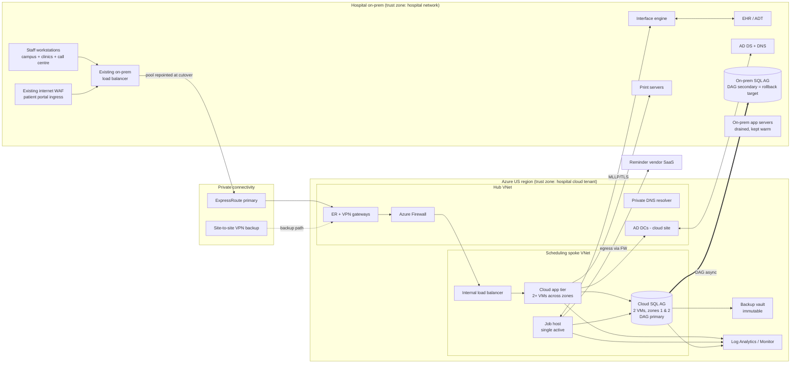

# Architecture and Build Plan: Moving the Patient Scheduling System to the Cloud Without Downtime

> **What I had to work from.** The workspace has no code, configuration, or documentation for your scheduling system. Its README says it is intentionally empty. Everything below about your current system is an **assumption**, marked **[A#]** where it first appears and collected in Section 5. I wrote the plan so the overall approach holds across the most likely setups. The few answers that would change it a lot are at the end.

---

## 1. Summary

- **What this is.** A plan to move the hospital's patient scheduling system from the on-premises data centre to a HIPAA-eligible public cloud. Schedulers, call-centre staff, clinicians, the patient portal, and the HL7 interfaces should not have to switch to downtime procedures at any point.
- **What "without downtime" means here.** There is no unplanned outage and no use of downtime procedures. There is one planned **write pause of 2 minutes or less (target 60 seconds or less)** during the quietest hour, with **zero lost or duplicated appointments or HL7 messages**. A literal zero-second switchover would need two live writable copies of the database. For scheduling, that is the wrong trade-off, because it invites double-booked slots. If the hospital truly needs zero seconds, that changes the plan (see the open questions).
- **The approach.** Move the existing application as it is (rehost), with no rewrite. First, make the cloud a **live disaster-recovery copy**: the database is continuously replicated from on-prem using SQL Server's own replication, and a full application stack sits idle in the cloud. After rehearsals, do a **planned failover to the cloud**. The on-prem system then becomes the replica and stays available as the rollback target for 30 to 60 days before it is retired.
- **Key decisions:**
  1. Rehost now and modernise later.
  2. Exactly one writable database at any moment, switched by a planned failover of a **Distributed Availability Group (DAG)**. A DAG is SQL Server's built-in way to link two separate database clusters and keep them in sync.
  3. SQL Server runs on cloud virtual machines rather than a managed database service, to keep the database engine identical (and therefore support the same features), keep vendor support, and keep a simple path back.
  4. Users are switched by repointing the **existing on-prem load balancer** to the cloud servers. Switching via DNS would leave stale cached addresses on workstations.
  5. Redundant private connectivity (ExpressRoute plus a backup VPN). After cutover, the network link becomes a single point of failure for the whole campus.
- **First milestone (about 6 weeks).** A cloud copy of the **TEST** environment, deployed through a real pipeline. A scheduler on a campus workstation books an appointment in it, and the HL7 SIU message (the standard scheduling-event message) reaches the test EHR through the on-prem interface engine. M1 also includes three time-boxed spikes (WAN latency tolerance, database replication and failover mechanics, and an inventory of everything that connects to the database), plus every item with a long lead time started on day one.
- **Top risks:**
  - The app may be "chatty" two-tier software that falls apart over WAN latency.
  - Unknown systems may read the database directly.
  - The SQL Server version or edition may not support the DAG.
  - ExpressRoute and vendor approvals take a long time.
  - Background jobs might run in both places at once and send patients duplicate reminders.

## 2. Context and Goals

**Problem.** The scheduling system runs on hospital-owned hardware [A1]. The reasons to move are assumed to be ageing hardware, data-centre cost or risk, ransomware resilience, and an organisational cloud strategy [A2]. Scheduling is critical to patient safety and revenue. An outage sends every clinic and the call centre to paper, and errors cause missed or double-booked appointments.

**Goals:**
- Run production scheduling in the cloud with performance and availability equal to or better than today.
- No use of downtime procedures during the migration, and at most one write pause of 2 minutes or less.
- Zero data loss and zero duplicated or lost HL7 messages across the cutover.
- The ability to roll back with no data loss within 30 minutes, at any point until on-prem is retired.
- HIPAA-compliant hosting, with a signed BAA (Business Associate Agreement) and the hospital's security risk assessment updated.

**Non-goals:**
- Re-architecting or rewriting the application, or changing vendor or version during the migration.
- Moving the EHR, interface engine, Active Directory primary, or other systems (they stay on-prem and are only reconfigured).
- Changing clinical workflows or adding features.
- Multi-region active-active operation.
- Moving to a managed database service (deferred, Section 17).

**Success measures:**

| Measure | Target |
|---|---|
| Write pause at cutover | ≤ 2 min, measured from the runbook timestamps |
| Appointments lost or duplicated | 0, by reconciliation report |
| HL7 messages lost or duplicated | 0 unexplained, by interface engine counts |
| p95 latency of the top 10 workflows, 30 days after cutover | ≤ 110% of the M1 baseline |
| Availability during clinic hours, first 90 days | ≥ 99.9% [A10] |
| Rollbacks needed | 0, with rollback still rehearsed and available |
| On-prem servers retired | By cutover + 60 days |

## 3. Drivers, Requirements, and Constraints

### Ranked quality attributes

| # | Attribute | Measurable target | Why it matters |
|---|---|---|---|
| 1 | **Data integrity and patient safety** | Exactly one writable database at any moment. Recovery point of 0 at cutover (synchronous commit). 0 lost or duplicated appointments or HL7 messages | A double-booked slot or a lost appointment harms patients. Correctness outranks availability |
| 2 | **Service continuity during migration** | No downtime procedures used. One write pause ≤ 2 min. Rollback ≤ 30 min with no data loss until on-prem is retired | This is the explicit requirement |
| 3 | **Security and compliance** | BAA signed. PHI (protected health information) encrypted in transit and at rest. No public endpoints on the app or database. Audit logs go to the hospital SIEM. Risk assessment updated before production data moves | HIPAA, and the fact that hospitals are prime ransomware targets |
| 4 | **Post-migration availability and performance** | 99.9% monthly during clinic hours [A10]. p95 ≤ 110% of baseline. Recovery from a zone failure: ≤ 15 min to restore, ≤ 5 s of data loss | After the move, every user depends on the WAN link and the cloud region |
| 5 | **Delivery within team capacity and budget** | Cutover in about 4 to 5 months, retirement in about 6 to 7. Run cost within the Section 11 range [A9] | A small hospital IT team that also runs everything else |

Evolvability, meaning modernising the app, is deliberately ranked below these and deferred.

### Key functional requirements that shape the structure
- Every existing function keeps working unchanged: booking, rescheduling, cancelling, slot templates, waitlists, reports, appointment letters and printing, reminders by SMS, email, or IVR, patient-portal self-scheduling, and both inbound and outbound HL7 (ADT in, SIU out).
- The downtime "business continuity" reports, which are printed or stored locally, keep being produced from wherever production runs.

### Constraints (assumed)
- The application is a vendor product or in-house application on Windows Server and SQL Server [A3], with AD-integrated sign-in [A4].
- The cloud is **Azure**, because the hospital is a Microsoft shop and Windows Server and SQL Server licences with Software Assurance can be reused [A5]. The pattern carries over unchanged to AWS (SQL Server on EC2 with a DAG, Direct Connect, a Transit Gateway).
- The team is small: about one infrastructure/cloud engineer, one network engineer, one DBA, one interface analyst, one application analyst, plus part-time security officer and PM time and the app vendor's support [A6]. The team has limited production cloud experience.
- The hospital Change Advisory Board (CAB) and clinical operations sign-off are required for production changes.
- Data stays in a US region [A7].

### Hard parts
1. **WAN latency tolerance of the clients.** If any client talks to the database directly (two-tier), every query crosses the WAN after cutover, and screens could become unusably slow.
2. **Unknown database consumers and hidden dependencies.** Reporting tools, data-warehouse extracts, linked servers, file shares, print servers, and scheduled tasks that nobody documented will break silently.
3. **Replication and the single-writer switchover.** This needs a SQL Server version and edition that supports a DAG, a measured failover time, and an app that reconnects cleanly.
4. **HL7 and background-job continuity across the cutover.** In-flight messages must not be lost or sent twice. Background jobs (reminders, batch work) must never run on both sites at once.
5. **Long-lead external dependencies.** The BAA, the ExpressRoute circuit (often 6 to 12 weeks), the vendor's statement that it supports cloud hosting, and allowlist changes at the reminder and portal vendors.

## 4. Current State

**Inspected:** nothing. The workspace contains no artefacts. **Assumed estate**, to be confirmed in M1 task T5/T6:

| Element | Assumption |
|---|---|
| Application | 3-tier: web/app servers on IIS with .NET, behind an on-prem load balancer (F5, NetScaler, or similar) under a stable internal name such as `scheduling.hospital.local` [A3] |
| Background services | A Windows service or scheduled-task host for HL7 send and listen, reminder dispatch, nightly batch, and downtime report generation ("Job Host") [A8] |
| Database | SQL Server 2016 or later, **Enterprise** edition, one main database of about 300 GB, in an on-prem Always On AG or a standalone instance [A3] |
| Load | About 400 concurrent users at the Monday 08:00–10:00 peak, about 4,000 appointment create or change events per day, about 20k HL7 messages per day, and very low volume between 01:00 and 04:00 on Sundays [A11] |
| Integrations | On-prem interface engine (Rhapsody, Cloverleaf, Mirth, or Corepoint) exchanging HL7 v2 over MLLP with the EHR. Reminder vendor (SaaS). Patient portal reached through the existing internet-facing WAF |
| Identity | On-prem AD DS. Staff sign in with Windows integrated authentication or AD-backed forms login |
| Operations | Existing hospital IT on-call. Existing backups, DR (if any), SIEM, and downtime procedures |

**Conventions the plan follows:** the same application version, OS family, SQL Server version, AD identities, interface engine, and change process as today. The only new technology is the cloud platform and its networking, which keeps the number of new things introduced at once to a minimum.

## 5. Assumptions and Open Questions

### Assumptions

| # | Assumption | Impact if wrong | How and when validated |
|---|---|---|---|
| A1 | The system is self-hosted, not part of an EHR vendor's hosted suite (e.g. Epic Cadence) | If it is EHR-vendor hosted, the vendor runs the migration and most of this plan does not apply | Confirm with the app owner, day 1 |
| A2 | Moving to the cloud is already decided by the organisation | None to the design, but it affects funding and urgency | Sponsor, day 1 |
| A3 | SQL Server 2016+ Enterprise; app is 3-tier with web or app-server clients | Older or Standard edition: no DAG, so use the log-shipping fallback, with a 10–20 min write pause and a harder rollback. Two-tier clients: add cloud-hosted virtual desktops (+6–10 weeks) | T5 inventory and spikes S1 and S3, M1 weeks 1–3 |
| A4 | Users sign in with AD | Different identity provider: change the identity design | T5, week 1 |
| A5 | Azure, with Software Assurance licences | AWS: same pattern, different services. No SA: higher run cost | Sponsor and procurement, week 1 |
| A6 | The team as listed, plus vendor support | Fewer people: timeline stretches about 1.5×, or a partner is needed for the landing zone | PM, week 1 |
| A7 | US data residency, HIPAA only (no stricter state rules) | Region choice and the controls list change | Compliance officer, week 1 |
| A8 | Background jobs run on an identifiable host and can be stopped and started on their own | Jobs embedded in the web servers make the run-in-one-place-only control harder | T5/T6, weeks 1–2 |
| A9 | The run-cost ceiling allows about $6k–18k per month plus 3–6 months of running both sites | Lower ceiling: smaller VMs or a single ExpressRoute | Finance, with T17 in week 4 |
| A10 | Today's availability is roughly 99.5–99.9%, and 99.9% is an acceptable target | A higher requirement means more redundancy (e.g. a second ExpressRoute) | Pull a year of incident history, M1 |
| A11 | Load and quiet-window figures as in Section 4 | Bigger VMs or a different cutover window | T5 baseline, weeks 1–3 |
| A12 | The interface engine queues messages per connection and can pause or resume them | No queuing: the inbound side needs a short sender-side hold | Interface analyst, S3 / T12 |
| A13 | The vendor supports the same version on Azure VMs | No support: escalate. Options are vendor-approved hosting or contractual risk acceptance | T3, request on day 1, needed by end of M2 |

### Open questions

| Question | Who answers | Default if no answer | Needed by |
|---|---|---|---|
| Is a ≤ 2 min write pause at 02:00 on a Sunday acceptable, or must it be literally zero? | CMIO / VP Operations | ≤ 2 min is acceptable | End of M1 |
| What are the SQL Server version and edition, and is the app two-tier or three-tier? | DBA / app analyst | 2016+ Enterprise, three-tier | M1 week 1 |
| Is a cloud tenant with a BAA already in place? | CISO / compliance | No; start the BAA on day 1 | Day 1 |
| What is the disaster-recovery target after on-prem is retired? | CIO | Async replica in a second Azure region, recovery in ≤ 4 h | Start of M5 |
| Are any other systems moving at the same time (e.g. the interface engine)? | Enterprise architect | No | M1 |

## 6. Architecture Overview

### Target state during migration (after cutover, before retirement)

**How the parts fit.** Users and the patient portal still reach the same internal name and the same on-prem load balancer. Only the load balancer's back-end pool changes, from on-prem servers to the cloud internal load balancer. The cloud app tier and Job Host talk only to the cloud SQL AG listener. The DAG replicates the database between the on-prem AG and the cloud AG. Before cutover, on-prem is primary. After cutover, the cloud is primary and on-prem is the replica. The interface engine, EHR, AD, and print servers stay on-prem and are reached over the private link. All traffic leaving the cloud for the internet goes through Azure Firewall, which has a fixed public IP for vendor allowlists.

### Component table

| Component | Responsibility | Owns data | Exposes | Technology | Key dependencies |
|---|---|---|---|---|---|
| **Landing zone** (hub) | Network, firewall, DNS, policy, logging foundation | Firewall/DNS config | Peered VNets, private DNS | Azure VNet, Azure Firewall, DNS Private Resolver, Azure Policy, Bicep | ExpressRoute, VPN |
| **Private connectivity** | Redundant encrypted path between hospital and cloud | — | BGP routes | ExpressRoute (1 Gbps) + site-to-site VPN backup | Carrier, on-prem edge routers |
| **Cloud identity site** | Local AD sign-in for cloud servers if the link is slow or degraded | Replica of AD | LDAP/Kerberos | 2 AD DS domain controllers on VMs (an AD "site" for Azure) | On-prem AD |
| **Cloud app tier** | Runs the unchanged scheduling web/app servers | None (stateless; any local state found in T6 is moved) | HTTPS behind the internal load balancer | Windows Server + IIS VMs ×2+, availability zones 1 and 2 | Cloud SQL AG, AD, print servers |
| **Job Host** | HL7 send/listen, reminders, batch, downtime reports. **Exactly one active instance across both sites** | Nothing outside the DB | MLLP listener | Windows Server VM (+ cold spare in a second zone) | Cloud SQL AG, interface engine, reminder vendor |
| **Cloud SQL AG** | System of record for scheduling data | Scheduling database | AG listener (TDS over TLS) | SQL Server (same version) on 2 memory-optimised VMs, synchronous commit across zones, cloud witness | Premium SSD v2 disks, backup vault |
| **On-prem SQL AG** | Production primary until cutover, then rollback replica until retirement | Same database (read-only after cutover) | AG listener | Existing | DAG link |
| **Distributed AG (DAG)** | Replicates the database between the two AGs; performs the switchover | — | — | SQL Server DAG | Private link bandwidth |
| **On-prem load balancer** | Single entry point for users; the cutover switch | Pool config | Existing VIP/name | Existing load balancer | Link to the cloud internal load balancer |
| **Interface engine** | Routes HL7 between scheduling and the EHR etc. (unchanged, reconfigured) | Message queues | MLLP | Existing | Job Host |
| **Observability** | Metrics, logs, synthetic checks, alerts | Telemetry (no PHI in log content) | Dashboards, alerts → on-call | Azure Monitor + Log Analytics, forwarded to the hospital SIEM | All |
| **Backup vault** | Immutable SQL and VM backups | Backups | Restore | Azure Backup (SQL in VM) with immutability and soft delete | Cloud SQL AG |

## 7. Component Details

**Private connectivity (hard part 5, and driver 4).** After cutover, a broken link means scheduling is down for every on-prem user. That is a new failure mode compared with today. Mechanism:
- ExpressRoute private peering as the primary path.
- A site-to-site IPsec VPN over the internet as the BGP-preferred backup, using a different carrier from the ExpressRoute.
- Failover tested in M2 by withdrawing the ExpressRoute routes during a planned window.

ExpressRoute is **not encrypted by default**. PHI is protected by TLS for HTTPS, SQL, and MLLP where supported, and by the DAG endpoint encryption, which is on by default. Any protocol that cannot use TLS (found in T6) goes through an IPsec tunnel over ExpressRoute private peering. The circuit is sized from the measured peak database log generation rate (T5) at 3× headroom for catch-up after a lag spike. Sizing assumption: 1 Gbps is plenty for about 300 GB and about 4k changes per day. If the link fails, routing moves to the VPN (seconds to tens of seconds). If both fail, downtime procedures start, using the locally stored downtime reports (see Job Host). Revisit adding a second ExpressRoute circuit at a different peering location if the incident history (A10) or the CIO requires more than 99.9%.

**Cloud app tier.** The same installer, same version, and same config as on-prem except connection strings (pointing to the cloud AG listener with `MultiSubnetFailover=True` where the driver supports it). VM time zone is set to match the on-prem servers. Scheduling logic often relies on local server time, and cloud VMs default to UTC. That is exactly the kind of undocumented behaviour T6 and T11 check for. The app stays idle until cutover: it is deployed and smoke-tested against a readable secondary or the TEST copy, but no users are routed to it. It is not a separately scaled component. It is sized from the T5 baseline with 50% headroom.

**Job Host (hard part 4).** These are the only components that act on their own: sending SIU messages, sending reminders to patients, running batch jobs. If they ran on both sites, patients would get duplicate reminders and the EHR duplicate messages. Rule: **exactly one active Job Host across both sites.**

Mechanisms:
1. Cloud Job Host services are deployed with startup type `Disabled` by infrastructure-as-code and enabled only by cutover runbook step C-9.
2. The runbook disables the on-prem services before the cloud ones are enabled, with a check step: `Get-Service` on both hosts is captured into the runbook log.
3. A synthetic alert fires if both hosts report services running at the same time.

On failure, the Job Host is restarted by a VM health action. If its zone fails, the cold spare is enabled manually using a runbook (≤ 15 min). Downtime report generation keeps writing to the existing on-prem downtime PCs or share. This is verified in T14.

**Cloud SQL AG and DAG (hard part 3).** Two SQL VMs in zones 1 and 2, synchronous commit between them with automatic failover, and a cloud witness. The DAG between the on-prem AG and the cloud AG runs **asynchronous** normally, so commits are not slowed by WAN round trips, and **synchronous** only from T-24h before cutover until the switchover. Failure modes:
- **Replication lag growth.** Alert at a lag above 30 s. This is a go/no-go gate.
- **Link outage during DAG-async.** The primary keeps running and the replica catches up afterwards.
- **Zone failure.** Automatic AG failover inside the cloud in under 60 s.

Storage is Premium SSD v2, sized to 2× the measured peak IOPS. If the measured version or edition rules out a DAG, the fallback is log shipping with a final tail-log backup at cutover. The write pause then becomes about 10 to 20 minutes, and rollback requires setting up reverse log shipping. That is why spike S3 is in M1.

**Landing zone, identity site, observability, backup.** These are routine, all built with Bicep through the pipeline. Azure Policy blocks public IPs, enforces disk encryption and allowed regions, and requires cost tags.

## 8. Data Design

The data model does **not change**. That is deliberate: it is a hard-to-reverse area and keeping it unchanged removes a whole class of risk.

| Entity (typical) | System of record | Writer | Notes |
|---|---|---|---|
| Appointments, slots, schedule templates, waitlist | Scheduling DB | App tier (users and portal) | Integrity-critical; single writer enforced by the DAG |
| Patient demographics (local copy) | EHR/MPI (the hospital's master patient index) | Job Host from ADT messages | Scheduling holds a copy only |
| Providers, resources, locations | Scheduling DB (or EHR, per A3 inventory) | App admins | |
| HL7 outbound queue / message log | Scheduling DB | App tier enqueues, Job Host sends | Drained to zero before switchover |
| Reminder log | Scheduling DB | Job Host | Used to prove there were no duplicate sends |
| Audit trail | Scheduling DB + SIEM | App tier | HIPAA access audit |

- **Consistency.** All writes go to one primary. The DAG is physical replication, so the replica is byte-identical, with no conflict resolution and no possibility of double booking across sites. The cutover reconciliation (Section 15) is a sanity check, not a merge.
- **Access patterns.** These are unchanged. Indexes are unchanged.
- **Retention.** Unchanged and per hospital policy (medical-record retention under state law, audit logs at least 6 years [A7]). The final on-prem full backup is archived to the immutable vault before retirement.
- **Backup and restore.** Weekly full, daily differential, and 15-minute log backups to an immutable vault, starting in M2. **Restore targets**: ≤ 4 h to restore from backup, ≤ 15 min of data loss. **A tested restore** is required before go-live (M3 exit) and monthly afterwards.
- **Classification.** The whole database is PHI. TDE (SQL Server's transparent data encryption) plus encrypted disks at rest. Keys go in Key Vault with soft delete and purge protection. **The TDE certificate must be the same on both sites before the DAG can seed**, which is a common snag. No PHI goes to Log Analytics; only metrics and IDs are logged.
- **Test data.** If the TEST database contains copied production PHI (common in hospitals), the BAA must be signed before T11. The plan treats the cloud TEST environment as PHI-bearing.
- **Schema evolution.** There is a **change freeze** on app version, schema, and interfaces from the start of M3 until cutover + 2 weeks. Vendor upgrades are scheduled outside this window.

## 9. Key Flows

### Flow 1: Planned cutover (the main event)
Window: Sunday 02:00 [A11]. A command centre with the DBA, network, interface, app, and vendor teams and a clinical operations lead is on the bridge.

1. **T-7d:** Change freeze confirmed. Final rehearsal results are reviewed and the go/no-go checklist is signed by the CAB and clinical operations.
2. **T-24h:** Switch the DAG to synchronous commit. Confirm `SYNCHRONIZED`. Watch commit latency. Abort criterion: p95 save latency more than 2× baseline.
3. **T-60m:** Notify units. Print downtime reports as a precaution.
4. **T-15m:** Pause the interface engine's **outbound-to-scheduling** connections (ADT queues up in the engine). Stop the on-prem Job Host batch and reminder jobs.
5. **T-5m:** Let the on-prem Job Host drain the HL7 outbound queue. **Confirm 0 pending rows**, then stop the on-prem HL7 sender.
6. **T0 (write pause begins):** Disable the on-prem LB pool members (connections drain). Run the documented DAG planned failover. The cloud AG becomes the global primary and the on-prem AG becomes secondary.
7. **T+1m:** Enable the cloud pool on the on-prem LB. The cloud app tier is serving. **Write pause ends** (target ≤ 60 s, maximum 2 min).
8. **T+3m:** Repoint the interface engine connections to the cloud Job Host listener. Enable the cloud Job Host services (step C-9). Resume engine queues; queued ADT flows in.
9. **T+10m:** Smoke tests. A scripted booking for the production test patient produces SIU in the EHR. Portal booking, print, and reminder are run in test mode. Run reconciliation queries.
10. **T+30m:** Set the DAG back to async, now cloud → on-prem. Declare "open". Hypercare begins.

### Flow 2: Failure during cutover (cloud does not come up healthy)
At step 7 or 9, the cloud app returns errors, or the app does not reconnect.
- **Abort rule:** if the cloud is not passing smoke tests by T+15m, roll back.
- **Rollback:** disable the cloud Job Host, then DAG failover back to on-prem (no data loss; replicas still synchronous), then re-enable the on-prem LB pool, then repoint the interface engine to on-prem, then re-enable the on-prem Job Host. The total write pause stays ≤ 10 min in the worst case.
- Root cause is investigated on Monday and a new cutover date is set after a fresh rehearsal.

### Flow 3: Duplicate or missing HL7 message across the switchover
Cause: the queue was not fully drained in step 5, or a message was sent but not marked as sent before the failover. That message would be re-sent by the cloud Job Host.
- **Prevention:** drain to zero and stop the sender before T0.
- **Detection:** compare the engine's per-connection sent and received counts for 01:00–04:00 with the scheduling message log. The receiving end should de-duplicate on the MSH-10 message control ID, which the interface analyst confirms in T12.
- **Correction:** the interface analyst resends or suppresses individual messages from the engine. Each case is recorded in the cutover log.

### Flow 4: ExpressRoute failure after cutover
BGP withdraws the ExpressRoute routes, traffic moves to the VPN within about 30 to 60 s, and users see a brief stall. An alert fires on the ExpressRoute circuit state. If the VPN also fails, the synthetic login check fails within 5 minutes and on-call starts downtime procedures. Clinics use the downtime reports, which the cloud Job Host refreshes hourly to on-prem downtime PCs. This flow is tested in M2.

## 10. Key Decisions

| # | Decision | Options considered | Rationale (against the drivers) | Reversibility | Revisit if |
|---|---|---|---|---|---|
| D1 | **Rehost the existing app now; modernise later** | Rehost · re-platform (managed DB/app services) · replace with SaaS | Rehosting changes only the hosting, which minimises risk to integrity (#1) and continuity (#2) and fits the team (#5). Re-platforming adds compatibility risk to the same high-stakes cutover | Easy (modernise afterwards) | The vendor will not support the app on VMs; or the hospital is already choosing a replacement |
| D2 | **One writable DB at any moment; one planned switchover** | Single-writer switchover · incremental by clinic with bidirectional sync or dual writes · active-active | Slots are shared across clinics, so splitting writers risks double booking (#1). Bidirectional sync needs conflict handling the app was never built for. The cost is a write pause of ≤ 2 min | Hard (sets the whole sequence) | Leadership requires literally zero pause. Then evaluate app-level read-only mode plus queued writes, a major extra effort |
| D3 | **SQL Server on Azure VMs** | SQL on VMs · Azure SQL Managed Instance | Same engine and version, so the same features and vendor support. A DAG with on-prem allows **failback in either direction** with no version constraints (#1, #2). MI is less operational work, but adds compatibility and failback questions during the riskiest moment | Medium (moving to MI later is a separate project) | After stabilising, if DBA workload is heavy and the vendor supports MI (Section 17) |
| D4 | **Replicate with a Distributed AG** | DAG · log shipping · Azure DMS / CDC tools | A DAG gives near-real-time replication, a switchover in seconds, and reversal (#2). Log shipping means a 10–20 min pause and harder rollback. CDC tools are logical copies that bring drift risk | Easy (migration-only mechanism) | S3 shows the edition or version does not support it, so use log shipping |
| D5 | **Switch users at the existing on-prem load balancer**; move DNS later | LB pool change · DNS change · new global front door | Instant and instantly reversible, and no stale DNS caches on hundreds of workstations or thick clients (#2). The cost is a temporary hairpin through on-prem, which is fine because users are on-prem anyway | Easy | When on-prem retirement is planned: move the name to the cloud LB, with DNS TTL lowered a week beforehand |
| D6 | **ExpressRoute plus VPN backup** | VPN only · ER + VPN · dual ER at diverse sites | VPN-only gives variable latency for a critical system. Dual ER is a large cost for a single hospital. ER + VPN covers the new single-point-of-failure risk (#4) at moderate cost | Medium | The incident history or CIO requires >99.9%; or the WAN link fails in M2 testing |
| D7 | **Azure** [A5] | Azure · AWS | Reuse of Windows/SQL licences (Hybrid Benefit), AD familiarity, and an existing enterprise agreement and BAA, if those exist | Hard | The hospital already has an AWS landing zone with a BAA. The pattern carries over unchanged |
| D8 | **Bicep for infrastructure-as-code**, deployed by the existing CI system (Azure DevOps by default) | Bicep · Terraform | Azure-only, a small team, no state file to manage or lock (#5) | Easy | The organisation standardises on Terraform, or a second cloud |
| D9 | **Interface engine stays on-prem** | Stay · move with scheduling | It serves many systems. Moving it would widen the impact of any problem and double the cutover risk | Easy | A separate programme moves it |
| D10 | **Cloud becomes a live DR site before it becomes production** | Build-then-cutover · DR-first | Gives value even if the cutover slips. Proves replication for weeks under real load before anyone depends on it (#1, #2) | Easy | — |

## 11. Cross-Cutting Concerns

**Security (M1 baseline, M2 production sign-off):**
- **BAA** signed before any PHI lands. Only HIPAA-eligible services are used.
- **Identity:** cloud servers join the existing AD domain (cloud AD site, local DCs). The Azure control plane uses Entra ID with MFA, Privileged Identity Management (just-in-time admin access), and break-glass accounts.
- **Admin access:** Azure Bastion only. No public IPs (blocked by policy).
- **Network:** a hub-spoke design, a firewall default-deny rule set listing only the flows in the T6 inventory, and NSGs (network security groups) per subnet.
- **Secrets:** Key Vault holds service-account credentials and TDE keys. No secrets in Bicep or the repo.
- **Encryption:** TLS 1.2+ in transit, TDE plus encrypted disks at rest.
- **Patching:** Azure Update Manager, in the existing patch window.
- **Logs:** Defender for Servers and SQL, with logs forwarded to the hospital SIEM.

Top threats and mitigations:

| Threat | Mitigation |
|---|---|
| Ransomware | Immutable backups, Bastion-only admin, Defender, network segmentation |
| Misconfigured public exposure | Azure Policy deny rules, a quarterly exposure scan |
| Stolen admin credentials | MFA + PIM, alerts on role assignment |
| PHI in transit over an unencrypted link | TLS or IPsec over ER (Section 7) |
| Insider access to PHI | Existing app role-based access unchanged; SQL audit to the SIEM |

**Reliability (M2):**
- Zone-redundant SQL AG and app tier.
- Targets: zone failure recovered in ≤ 15 min with ≤ 5 s data loss. Region failure: before retirement, fail back to on-prem; after retirement, see D-deferred (default: an async replica in a second region, recovered in ≤ 4 h).
- Timeouts and retries are whatever the app has; this plan does not change app code.
- Idempotency at cutover comes from draining the HL7 queue (Flow 3).

**Observability (M1 basics, M2 complete):**
- Metrics: VM, SQL wait statistics, AG/DAG health, **DAG replication lag and redo queue**, ExpressRoute and VPN state.
- A **synthetic transaction** every 5 minutes from an on-prem probe: log in, search, open a schedule.
- HL7 per-connection queue depth from the interface engine.
- Alerts tied to user-visible symptoms: synthetic failure 2 times in a row, p95 latency of the synthetic above 2× baseline, DAG lag above 30 s, the "two Job Hosts active" check, and HL7 queue depth above 500 for 10 minutes. Each alert links to a runbook in `runbooks/`.

**Performance and capacity (M3):**
- Expected peak about 400 concurrent users [A11]. Likely bottlenecks: WAN round trips (S1), disk IOPS, and synchronous-commit latency during T-24h.
- Load test at **1.5× the measured peak** on the production-sized staging stack in M3.

**Cost (estimated in M1, T17):** roughly **$6k–18k per month** at steady state [A9]. Approximate breakdown:
- SQL VMs ×2 with Hybrid Benefit: $1–2.5k (much more without Software Assurance).
- App and Job VMs: $1–2k.
- DCs: about $0.4k.
- Azure Firewall: $1–1.5k.
- ExpressRoute port plus carrier: $1.5–4k.
- VPN gateway: about $0.3k.
- Backup and storage: $0.5–1.5k.
- Defender and logs: $0.5–1.5k.
- Non-prod environments: $1–3k (shut down outside business hours).

Plus **3–6 months of running both sites**. Controls: required cost tags, budget alerts at 80% and 100%, reservations bought only after 60 days of stable sizing. The licensing terms for a free passive SQL DR replica must be confirmed.

**Operations (runbooks in M3, on-call from M4):** hospital IT keeps on-call. New runbooks: cutover, rollback, ExpressRoute failover, zone failover, Job Host failover, restore from backup, and the "two Job Hosts" alarm. Cloud training for the on-call rota happens in M2. The vendor's support contract must cover cloud hosting (T3). During the first 72 hours of hypercare the DBA and an app analyst are on site.

**AI-specific concerns:** not applicable. There are no AI components.

## 12. Build Sequence

Team assumption: the six-person core team in A6 at about 60% allocation, plus vendor support. Sizes are rough ranges, not commitments.

| Milestone | Goal | Scope / deliverables | Exit criteria | Depends on | Rough size |
|---|---|---|---|---|---|
| **M1: Thin slice and spikes** | Prove the app works from the cloud for real users and interfaces; answer the three riskiest questions; start every long-lead item | Long-lead requests (BAA, ER order, vendor statement, CAB/risk assessment). Baseline + dependency inventory. Minimal landing zone via pipeline (VPN link). Cloud AD site. **Cloud TEST environment** connected to the on-prem test interface engine and test EHR. Spikes S1 latency, S2 inventory, S3 DAG/failover. Basic monitoring. Runbook v0. Cost estimate | Demo: a scheduler on a campus workstation books an appointment in cloud TEST and the SIU appears in the test EHR. Golden-file HL7 diff clean. Spike reports written, with decisions recorded. BAA signed. ER install date known. Inventory has 0 "unknown" consumers | — | **5–7 weeks** |
| **M2: Cloud as live DR** | Real production data replicating to the cloud under real load, securely | ExpressRoute live with VPN failover tested. Production landing zone and security sign-off. Production cloud SQL AG seeded via DAG (async). Production app tier and Job Host deployed **idle** (Job Host disabled). Immutable backups. Full monitoring and alerts. Firewall rules for every inventoried dependency. Vendor allowlists updated with the firewall egress IP | DAG lag p99 < 5 s for 14 consecutive days. ER→VPN failover test passed. A test restore of the production DB from the cloud vault within 4 h. Security risk assessment approved. Vendor support statement received | M1; **ER circuit (critical path)**; BAA | **6–8 weeks** (mostly ER lead time) |
| **M3: Rehearse and harden** | Remove all surprise from the cutover | Production-sized staging stack (restored copy). **At least 2 full cutover and rollback rehearsals** with timings. Load test at 1.5× peak. UAT by super-users from campus, a remote clinic, and the call centre (top 20 workflows, printing, portal). Runbooks finalised. CAB and clinical go/no-go. Change freeze begins | Two consecutive rehearsals: write pause ≤ 2 min, rollback ≤ 30 min, reconciliation clean. p95 within 110% of baseline at 1.5× peak. UAT signed. CAB approved | M2 | **3–5 weeks** |
| **M4: Production cutover and hypercare** | Production runs in the cloud | Flow 1 execution. 2–4 weeks of hypercare with daily reconciliation and performance review. On-prem stays the DAG secondary | Success measures in Section 2 met for 14 days. 0 Sev-1 incidents caused by the migration | M3 | **1 weekend + 2–4 weeks** |
| **M5: Steady state and retirement** | Remove the dual-running cost and set up long-term DR | Cloud DR (default: async replica in a second region). Move the internal DNS name to the cloud LB and stop routing through the on-prem LB. Final on-prem backup archived. **Remove the on-prem replica (point of no return)**. Retire the servers | DR test passed. 30–60 days with no rollback. Sign-off to retire. On-prem servers off | M4 | **4–8 weeks** |

**Critical path:** BAA → ExpressRoute circuit (order on day 1; 6–12 weeks) → production DAG seeding → 14-day replication soak → rehearsals → CAB → cutover. In parallel and off the critical path: the vendor support statement, vendor allowlist changes, the app-side thick-client fix if S1 shows one is needed (this would *move onto* the critical path), and training.

**Expected elapsed time:** cutover about 16–22 weeks from start; retirement about 6–7 months.

## 13. First Milestone Task Breakdown

Locations: a new repo **`scheduling-cloud-migration`** with this layout:
- `infra/bicep/landing-zone/`
- `infra/bicep/scheduling/`
- `pipelines/`
- `runbooks/`
- `inventory/`
- `tests/hl7-golden/`
- `tests/latency/`
- `tests/load/`
- `docs/`

**Day 1 (in parallel; these are the long-lead items):**

| # | Task | Owner / where | Done when |
|---|---|---|---|
| T1 | Execute or confirm the **BAA** with Microsoft, and confirm every service in the Section 6 table is HIPAA-eligible | Compliance; `docs/compliance.md` | Signed BAA on file; service list checked against the provider's compliance list |
| T2 | **Order the ExpressRoute** circuit (1 Gbps, nearest peering location) through the carrier | Network engineer | Carrier order number and committed install date recorded in `docs/long-lead.md` |
| T3 | Request the **vendor's written cloud support statement** and licence terms for the Azure VMs | App analyst | Written reply filed; any licensing change costed |
| T4 | Open the **CAB record and HIPAA security risk assessment** for the migration | PM + security officer | Ticket IDs in `docs/long-lead.md`; review dates booked |

**Weeks 1–3 (discovery; T5 and T6 run in parallel):**

| # | Task | Where | Done when |
|---|---|---|---|
| T5 | **Capture the baseline.** Time the top 10 workflows from 3 site types (p50/p95). Record SQL CPU, IOPS, log generation MB/s (peak and average), DB size and growth, HL7 messages per hour, concurrent users per hour. Record the SQL version and edition, the app tier model (two- or three-tier), and the AD sign-in method | `docs/baseline.md` | 14 days of data; answers recorded to A3, A4, A8, A11 |
| T6 | **Spike S2: dependency inventory.** *Question:* what connects to or from the scheduling servers and DB? *Method:* a SQL Server Audit / Extended Events session capturing logins (host, app name), firewall flow logs, and a review of linked servers, SQL Agent jobs, scheduled tasks, file shares, print queues, ODBC DSNs, hard-coded IPs in config, and time-zone-dependent jobs. *Time box:* 14 days of capture + 3 days of analysis. *Changes the plan if:* a consumer can't reach the cloud or can't tolerate latency (e.g. a data-warehouse ETL pulling GBs nightly). That adds a work item to M2 | `inventory/dependencies.csv` (consumer, protocol, port, owner, plan) | Every observed connection has an owner and a plan; 0 "unknown" rows |

**Weeks 1–4 (foundation, in parallel with discovery):**

| # | Task | Where | Done when |
|---|---|---|---|
| T7 | Create the repo and a **pipeline** that runs `az bicep build` and `what-if` on each pull request, and deploys to non-prod on merge, with approval gates for prod | `pipelines/infra.yml` | A PR shows the what-if output; merging deploys a test resource group |
| T8 | Deploy the **minimal landing zone**: prod and non-prod subscriptions, hub VNet, Azure Firewall, a **VPN** gateway to on-prem (temporary until ER), DNS Private Resolver with conditional forwarding both ways, Log Analytics, and Azure Policy (deny public IP, allowed US regions, required tags, disk encryption) | `infra/bicep/landing-zone/` | An on-prem host resolves and reaches a test VM by name. Creating a public IP is denied by policy. Firewall logs arrive in Log Analytics |
| T9 | Deploy **2 AD DCs** in an identity subnet, defined as an AD site with its subnet registered in AD Sites and Services | `infra/bicep/landing-zone/identity.bicep` + AD change ticket | Replication healthy (`repadmin /replsummary` clean). A cloud VM domain-joins and authenticates against the cloud DC |

**Weeks 2–5 (the thin slice; needs T1, T7, T8, T9):**

| # | Task | Where | Done when |
|---|---|---|---|
| T10 | **Spike S1: WAN latency tolerance.** *Question:* do the top 10 workflows stay within 110% of baseline at the cloud round-trip time? *Method:* in on-prem TEST, add 5, 10, 20, and 40 ms round-trip time with a WAN emulator (e.g. `clumsy` on a client, or a Linux bridge with `tc netem`) between clients and the app tier, **and separately between the app tier and the DB**. Then measure the real RTT once the VPN is up. *Time box:* 5 days. *Changes the plan if:* any client talks directly to SQL, or degrades >20% at the measured RTT. Then add cloud-hosted virtual desktops for those clients (Azure Virtual Desktop or the hospital's Citrix) as a new M2 track, adding about 6–10 weeks | `tests/latency/` + `docs/spike-s1.md` | A results table per workflow per RTT, and a written recommendation |
| T11 | Build the **cloud TEST environment** with Bicep: spoke VNet peered to the hub, internal LB, 2 app VMs, 1 Job Host VM (services enabled; it is TEST), 1 SQL VM with the same version and edition. Install the same app build as on-prem TEST. Restore the TEST DB. Set the VM time zone to match on-prem | `infra/bicep/scheduling/` (parameter file `test.bicepparam`) | A scheduler on a campus workstation signs in with AD and books, reschedules, and cancels a test appointment |
| T12 | Connect cloud TEST to the **on-prem TEST interface engine**. Build a **golden-file HL7 test**: 200 canonical inbound messages (ADT A04/A08/A40, plus the SIU types the app produces: S12/S14/S15/S26) replayed against on-prem TEST and cloud TEST, with outputs diffed, ignoring timestamps and control IDs. Confirm whether the EHR de-duplicates on MSH-10 | `tests/hl7-golden/` | Zero unexplained differences. MSH-10 behaviour documented |
| T13 | **Spike S3: DAG and failover mechanics.** *Question:* can we keep a DAG between on-prem TEST SQL and cloud TEST SQL, how long does a planned failover take, does the app reconnect without a restart, and can we fail back? *Method:* create the TEST AGs and the DAG (TDE certificate copied to the cloud first). Seed. Replay a load script. Measure lag, then do sync-commit failover and failback 3 times, timing each step. *Time box:* 5 days. *Changes the plan if:* the edition or version doesn't support a DAG (switch to the log-shipping design), the app needs a restart to reconnect (add a scripted restart; the write pause target becomes ≤ 5 min), or lag under load exceeds 30 s over the VPN (revisit link sizing) | `docs/spike-s3.md`, `runbooks/cutover.md` v0 | Measured failover and failback times, with the reconnect behaviour recorded |
| T14 | Verify **side functions** from cloud TEST: printing to on-prem print servers, report generation, reminder jobs in vendor test mode through the firewall egress, downtime report delivery to the on-prem downtime PCs, portal booking through the TEST WAF path | `docs/m1-functional-checks.md` | Each item passes, or has a filed fix with an owner |

**Weeks 4–6 (wrap-up; T15–T17 run in parallel):**

| # | Task | Where | Done when |
|---|---|---|---|
| T15 | **Basic observability**: VM/SQL metrics, AG/DAG lag, a synthetic login-and-search check every 5 minutes from an on-prem probe, and alerts to the on-call channel | `infra/bicep/scheduling/monitoring.bicep`, `tests/synthetic/` | Deliberately stopping IIS on cloud TEST triggers the alert within 10 minutes |
| T16 | Write **runbook v0** for cutover and rollback, from the S3 timings, with step IDs (C-1…C-n, R-1…R-n) and abort criteria | `runbooks/cutover.md`, `runbooks/rollback.md` | Reviewed by the DBA, interface analyst, and app vendor |
| T17 | **Cost estimate and budgets**: the pricing calculator using T5 sizing, tags enforced, budget alerts at 80% and 100% | `docs/cost.md` | Estimate approved by finance; a test budget alert fires |

**M1 exit demo:** a live booking in cloud TEST from a campus workstation, the SIU appearing in the test EHR, a DAG failover and failback shown on screen, and the three spike reports with the resulting plan changes (or "no change") recorded.

## 14. Testing and Validation Strategy

| Risk | Test | When | Blocks release? |
|---|---|---|---|
| Latency degradation | S1 latency injection; M3 per-workflow timing from 3 site types | M1, M3 | Yes, if p95 > 110% of baseline |
| Interface behaviour changes | HL7 golden-file diff (T12), re-run on every infrastructure change to the app or Job Host | M1 onward, in CI as a manual-trigger job | Yes |
| Failover and rollback mechanics | Cutover and rollback rehearsals on production-sized staging | M3 (×2, consecutive passes) | Yes |
| Capacity | Scripted load at 1.5× peak concurrency (e.g. JMeter or the app vendor's tooling against the web tier) plus a DB workload script | M3 | Yes |
| Hidden dependencies | Inventory (S2), then UAT by super-users across site types | M1, M3 | Yes (UAT sign-off) |
| Backup validity | A full restore into an isolated resource group, timed | M2, M3, monthly | Yes (M2/M3 exit) |
| Link failure | ER→VPN failover test in a planned window | M2 | Yes |
| Security posture | Policy compliance report, Defender recommendations, a port and exposure scan, risk-assessment sign-off | M2 | Yes |
| Integrity at cutover | Reconciliation queries (appointment counts by date and status, HL7 sent/received counts, reminder log) before and after T0 | M3 rehearsals, M4 | Yes (part of the go-live smoke test) |

**Environments:** cloud TEST (M1), a production-sized cloud staging copy restored from a production backup (M3; PHI, so production-grade controls apply), and production. CI validates and runs what-if on every Bicep change, and deploys non-prod automatically. Prod deploys need approval and are blocked by any policy violation.

## 15. Rollout, Migration, and Rollback

- **Rollout style:** one switchover for all users (D2), made safe by DR-first operation (D10), two rehearsals, and an instant switch at the load balancer (D5). Users are not migrated in batches, because the shared slot inventory requires one writer.
- **Running side by side:** M2–M3 has on-prem as primary with the cloud as replica and an idle app tier. M4 onward has the cloud as primary and on-prem as replica (rollback target), with the on-prem app servers kept patched and warm.
- **Switchover criteria (go/no-go):**
  - DAG lag p99 < 5 s for 14 days.
  - Two clean rehearsals.
  - UAT signed.
  - CAB and clinical operations approved.
  - No open Sev-1/2 on the scheduling system or interface engine.
  - Vendor on the bridge.
  - Weather and census normal: no surge or mass-casualty status.
- **Rollback:**

  | Stage | Rollback procedure | Data loss |
  |---|---|---|
  | During the cutover window | Flow 2 (≤ 10 min) | None |
  | During hypercare (until retirement) | The same runbook in reverse: switch the DAG to sync, drain the HL7 queue, fail over to on-prem, repoint the LB and interface engine, swap which Job Host is active | None |

- **Point of no return:** removing the on-prem replica from the DAG in M5. This happens only after 30–60 days with no rollback, the cloud DR being tested, and written sign-off. After this, recovery means cloud DR or restoring from backup.

## 16. Risks and Mitigations

| Risk | Likelihood | Impact | Mitigation | Early warning sign | Owner |
|---|---|---|---|---|---|
| Two-tier or chatty clients are unusable over the WAN | Medium | High | Spike S1 in M1; cloud-hosted virtual desktop fallback | S1 shows >20% degradation | App analyst |
| Undocumented DB consumers break at cutover | High | Medium | S2 inventory; firewall default-deny exposes anything missed in staging; UAT | Unknown hosts in the audit log | DBA |
| SQL version or edition doesn't support a DAG (e.g. 2014 or Standard) | Medium | High | Confirm in T5 week 1; log-shipping fallback; or an in-place SQL upgrade first (+4–8 weeks) | T5 result | DBA |
| ExpressRoute delivery slips | High | Medium | Order on day 1; M1–M2 run over VPN; cutover is gated on ER | No install date by week 3 | Network engineer |
| Vendor refuses to support cloud hosting | Low–Med | High | Request on day 1; escalate through the contract; executive risk acceptance | No reply by week 4 | App owner |
| Duplicate patient reminders or HL7 messages because Job Hosts run in both places | Medium | Medium | Disabled-by-default services, runbook check, a "two active" alarm | Alarm in rehearsal | App analyst |
| Network link failure after cutover takes scheduling down campus-wide | Low–Med | High | ER + VPN with diverse carriers; tested failover; downtime reports | Link flaps in M2 | Network engineer |
| Sync-commit latency during T-24h slows saves | Medium | Low | Measure in S3/M3; shorten the sync window to T-1h if needed | Commit latency in rehearsal | DBA |
| Time zone or locale differences change scheduling behaviour | Low | High | Match the VM time zone; test in T11 and UAT | Off-by-hours appointment times in TEST | Infra engineer |
| Cloud skills gap on the on-call rota | Medium | Medium | Training in M2; runbooks; optional partner for the landing zone review | Runbook steps that are unclear in rehearsal | IT manager |
| Change freeze conflicts with vendor upgrades or regulatory changes | Medium | Medium | Agree the freeze window with the vendor in M1 | A vendor patch announcement | PM |
| Cost overrun from running both sites | Medium | Low | Budgets, shut down non-prod at night, retire on schedule | Budget alert | PM |

## 17. Deferred Work and Future Evolution

| Deferred item | Trigger to build it |
|---|---|
| Moving to Azure SQL Managed Instance | DBA operational load is high after 6 months, and the vendor certifies MI |
| A second ExpressRoute circuit | The availability requirement goes above 99.9%, or the link causes incidents |
| Moving the internal DNS name and the portal entry to cloud-native ingress (Application Gateway/WAF) | M5 step; required before the on-prem LB and WAF are retired |
| Long-term cross-region DR | Before the M5 point of no return (default: an async replica in a second region) |
| App modernisation (APIs, containerisation, managed app hosting) | A separate business case after stabilisation |
| Infrastructure-as-code for the in-guest configuration (DSC/Ansible) | After M4, if configuration drift appears |

**Shortcuts taken on purpose:**
- The temporary hairpin through the on-prem LB. Paid back in M5.
- The Job Host's single-active rule enforced by runbook rather than code. Acceptable because it only matters during switchovers.
- VM-based SQL instead of PaaS. Revisited after 6 months.

## 18. Next Steps

1. **Today:** confirm A1 (self-hosted, not part of an EHR-vendor hosted suite) and A3 (SQL Server version and edition, and whether clients are two- or three-tier). Ask the DBA to run `SELECT @@VERSION, SERVERPROPERTY('Edition')` and the app analyst to describe how the client connects.
2. **Day 1 long-lead items:** compliance starts the BAA (T1), network orders ExpressRoute (T2), the app analyst emails the vendor for the cloud support statement (T3), and the PM opens the CAB record and risk assessment (T4).
3. **This week:** start the 14-day SQL audit and flow capture for the dependency inventory (T6) and the performance baseline (T5).
4. **This week:** create the `scheduling-cloud-migration` repo with the layout in Section 13, and the PR pipeline (T7).
5. **Week 2:** book the TEST environments and the interface analyst's time for spikes S1 and S3 (T10, T13).

---

### Open questions that would most change this plan

1. **Is the system self-hosted, or part of a hosted EHR suite such as Epic or Oracle Health?** If it's part of a suite, the vendor runs the migration and this plan becomes a coordination plan.
2. **Which SQL Server version and edition, and do any clients connect straight to the database?** This decides between the ≤ 2 min DAG switchover and a 10–20 min log-shipping cutover, and whether you need cloud-hosted desktops (+6–10 weeks).
3. **Is a write pause of up to 2 minutes at 02:00 on a Sunday acceptable to clinical leadership?** If it must be literally zero, you would need app changes to queue writes, which is a much bigger and riskier project.
4. **Which cloud, and is there already a BAA and landing zone?** An existing one could save 3–6 weeks off the critical path. AWS keeps the same pattern with different services.
5. **What disaster-recovery target applies once on-prem is retired?** This sets the size and cost of M5.
