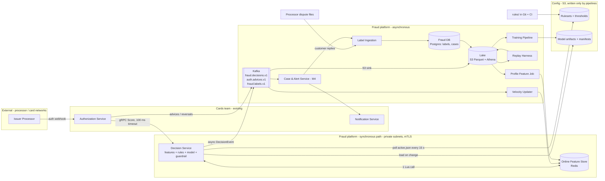
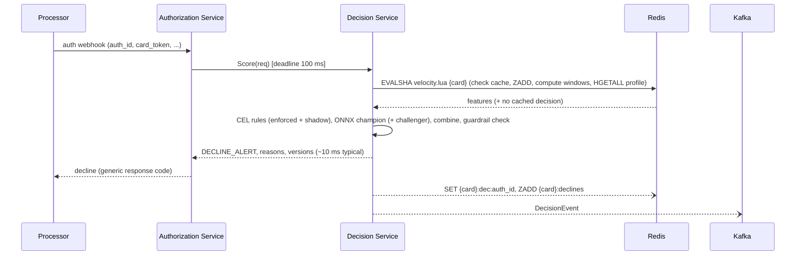

# Real-Time Card Fraud Detection: Architecture and Build Plan

The workspace is empty: its `README.md` says there is no code, config or data. The brief is a single line, so I went ahead with stated defaults instead of stopping to ask. Every default is marked **[A#]** where it first appears and collected in Section 5. The answers that would change the plan most are listed at the end.

---

## 1. Summary

- **What:** A fraud decision layer that sits inline in card authorisation. It scores every authorisation request and returns *approve*, *decline*, *approve + alert* or *decline + alert* well within the network's response deadline. Around it sits the data loop that improves it over time: decision log, fraud labels, model training. The assumed owner is a card issuer (a bank or fintech whose cards are processed by a third-party issuer processor) **[A1]**.
- **Shape:** One new low-latency **Decision Service** handles the synchronous path. The existing **Authorization Service** calls it. It runs rules and an ML model in-process and keeps per-card velocity state in Redis. Everything else runs asynchronously over Kafka and S3: the decision log, label ingestion, model training, and customer alerts.
- **Key decisions:**
  1. Score inline. If we time out, **fail open** to the processor's existing stand-in rules.
  2. Compute velocity features inside the request with **one atomic Redis call**. There is no stream processor in v1.
  3. Write rules as **CEL expressions in Git**, hot-loaded and run in shadow first. A **guardrail automatically demotes** a recently changed rule or model if its fire rate is abnormal.
  4. Run a **LightGBM model in-process via ONNX**. Train it on features made by **replaying history through the same feature code** the live service uses.
  5. Use **card tokens only, never the PAN** (full card number), to keep PCI scope small.
- **First milestone (4–6 weeks):** The Decision Service receives 100% of production authorisations in shadow mode, with no effect on cardholders. It computes velocity features, evaluates seed rules, sends decisions to the data lake, and is load-tested at about 3× expected peak. Three spikes run alongside: latency, historical labels, and the auth-path contract.
- **Top risks:** A bad rule or model declines legitimate cardholders at scale. There may not be enough usable labelled history to train the v1 model. The real latency budget may be tighter than assumed. Label delay (chargebacks take 30–90 days) slows model evaluation.

## 2. Context and Goals

**Problem (assumed [A2]).** Fraud screening today relies on the issuer processor's static rules, and perhaps a vendor score. Changing a rule means a ticket to the processor and takes days to weeks. The issuer has no decision data of its own to learn from, false declines frustrate good customers, and losses are flat or rising. Card-testing attacks (bursts of small authorisations that check whether stolen card numbers work) are caught late.

**Goals**
- Score 100% of card authorisations inline with our own logic.
- Cut fraud losses meaningfully without raising false declines (targets in Section 3).
- Let fraud analysts respond to a new attack the same day, without an engineering deploy.
- Make every decision reproducible and explainable to analysts, auditors and customer support.

**Non-goals (v1)**
- Anti-money-laundering transaction monitoring. It has a different regulation, latency profile and team.
- 3-D Secure risk-based authentication for e-commerce step-up.
- Application or account-opening fraud, and ACH/wire/P2P fraud.
- Merchant or acquirer-side fraud.
- A full case-management product. M4 builds a minimal queue only.
- Deep learning, graph or device-fingerprint models.
- Multi-region active-active deployment.
- Automatic card blocking. v1 declines individual authorisations. Blocking a card needs a customer or analyst confirmation.

**Success measures (after launch)**

| Measure | Target |
|---|---|
| Fraud loss, in basis points of card volume | −30% vs. the 3-month pre-launch baseline, measured on 90-day matured labels **[A3]** |
| False-positive ratio (legitimate declines per fraud decline) | ≤ 10:1 **[A3]** |
| Customer-confirmed false declines per 10k authorisations | Not higher than baseline |
| Authorisations decided before the caller times out | ≥ 99.95% monthly |
| Time from rule idea to enforced in production | ≤ 1 hour (same day) |

## 3. Drivers, Requirements, and Constraints

### Ranked quality attributes

| # | Attribute | Measurable target | Why it matters |
|---|---|---|---|
| 1 | **Bounded latency and availability of the decision path** | p99 ≤ 50 ms server-side at 1,000 TPS sustained. ≥ 99.95% of authorisations answered before the 100 ms caller timeout **[A4]** | A timeout means the processor's stand-in decides without us. A slow service can't stay in the auth path. |
| 2 | **Decision safety** | No rule, model or threshold change raises the overall decline rate by > 0.5 percentage points for > 5 minutes. Every change runs in shadow first (rules ≥ 24 h, models ≥ 2 weeks). | One bad decline rule hits every cardholder at once. False declines are the most visible failure and erode trust fastest. |
| 3 | **Detection effectiveness** | Value detection rate (fraud $ declined or alerted ÷ all fraud $) ≥ baseline + 30% at a false-positive ratio ≤ 10:1 **[A3]** | This is why the system exists. |
| 4 | **Speed of adaptation** | Rule merge to live in shadow ≤ 15 min. Shadow to enforce ≤ 1 h. Model retrain to shadow ≤ 1 week. | Fraudsters adapt within days, and processor tickets take weeks. |
| 5 | **Auditability and data protection** | Every decision reproducible from logged inputs and versions for 7 years **[A5]**. Zero PAN stored or logged anywhere. | Regulators, disputes and model-risk review all require it. PCI scope drives cost. |

Cost is deliberately not a top driver. Run cost is roughly $3–6k/month (Section 11), which is small next to fraud losses. Latency and safety win over cost where they conflict.

### Key functional requirements
- **FR1** Score each authorisation and return an action plus internal reason codes (rule IDs and score band).
- **FR2** Compute per-card velocity features (counts and amounts over 1 min to 7 days) that include the authorisation from one second ago. Compute daily profile features as well.
- **FR3** Let analysts author rules that move through *shadow → enforce*, have tests, and can be rolled back.
- **FR4** Produce an ML risk score whose thresholds can be configured without a deploy.
- **FR5** Keep an immutable decision log for audit, analytics and training.
- **FR6** Ingest fraud labels from chargebacks and disputes, customer fraud reports, and analyst outcomes.
- **FR7** Account for stand-in authorisations (decided by the processor while we were unavailable) and reversals in velocity state.
- **FR8** (M4) Run an "Was this you?" customer alert loop whose replies become labels.

### Constraints (all assumed, see Section 5)
- **Hosting:** AWS, with an existing org account structure and a container platform (ECS on Fargate as the default) **[A6]**.
- **Team:** 3 backend engineers (JVM), 1 data engineer, 1 data scientist (Python), and a part-time fraud operations lead acting as product owner. A shared platform/SRE team exists. The cards team owns the Authorization Service **[A7]**.
- **Timeline:** about 5 months to an enforced ML model. No hard external date **[A8]**.
- **Compliance:** PCI DSS applies to anything that touches cardholder data. US bank-style model-risk governance (e.g., SR 11-7) may apply **[A9]**.
- **Integration:** The existing Authorization Service already receives processor webhooks and makes approve/decline calls for balance and card status. It will call us **[A10]**.

### Hard parts
1. **Fresh velocity features within the latency budget.** Card-testing bursts happen within seconds, so features must include the authorisation that arrived 200 ms ago, survive processor retries without double-counting, and still fit in about 20 ms.
2. **Training data and labels.** Labels arrive late (chargebacks take 30–90 days), are noisy (friendly fraud), and are biased: we never see what would have happened to a declined transaction. Training features must match serving features exactly. Whether 12+ months of joinable history even exists is unknown.
3. **The auth-path integration.** The real time budget, retry semantics, stand-in behaviour and advice messages belong to the processor and the cards team, not us. A wrong assumption here changes the design.
4. **Safe change at full blast radius.** Every rule or model change affects every cardholder immediately.
5. **Choosing the operating point.** Turning a score into decline/alert thresholds is a business trade-off between losses, false declines and analyst capacity, and it needs owners outside engineering.

## 4. Current State

**Inspected:** The working directory contains only `README.md`, which says the workspace is intentionally empty. There is no code, infrastructure or data to build on, so this is a greenfield plan.

**Assumed organisational context (to confirm):**
- An **issuer processor** (for example Marqeta, Galileo, i2c or an in-house network connection) sends authorisation webhooks to the **Authorization Service** (cards team). The processor runs its own fraud rules and stand-in processing (STIP), meaning it approves or declines by default rules when the issuer doesn't respond in time.
- The processor provides historical authorisation and dispute/chargeback data as files or through an API, and a data warehouse holds some of it.
- An existing **Notification Service** sends SMS and push messages (used in M4).
- An org-wide identity provider exists, along with AWS accounts per environment, a secrets manager and a CI system (GitHub Actions is the default).

**Conventions this plan sets, since none exist:** a monorepo named `fraud-platform` with Gradle multi-module Kotlin for services, Python for `ml/`, Terraform for `infra/`, and protobuf contracts in `proto/`, checked with `buf`.

```
fraud-platform/
  proto/fraud/v1/            # ScoreRequest/ScoreResponse, DecisionEvent, LabelEvent
  libs/features/             # Feature registry + velocity Lua script (shared by service and replay)
  services/decision/         # Decision Service (gRPC) + velocity-updater entrypoint
  services/case-alert/       # M4
  rules/                     # CEL rules (YAML) + fixtures + thresholds
  pipelines/labels/          # label ingestion (M2)
  pipelines/replay/          # historical replay harness (M3)
  pipelines/profile-features/# daily profile job (M3)
  ml/                        # training, evaluation, ONNX export
  infra/terraform/{modules,envs/staging,envs/prod}
  loadtest/
  docs/runbooks/
```

## 5. Assumptions and Open Questions

### Assumptions

| # | Assumption | Impact if wrong | How / when validated |
|---|---|---|---|
| A1 | We are the **issuer**, scoring authorisations on cards we issue | If we're an acquirer or processor, inputs, decisions and integration all change. Largely a different plan. | Confirm with sponsor before M1 starts |
| A2 | Today's fraud control is processor rules and/or a vendor score, with no in-house decisioning | If a vendor platform already works, "build" needs a stronger case (D0) | Kickoff, plus the baseline analysis in Spike B |
| A3 | Baseline loss is about 5–10 bps. Targets of −30% loss and ≤ 10:1 false-positive ratio are acceptable to the business | Thresholds and success criteria shift. The architecture doesn't. | Fraud ops lead signs off targets by end of M1 |
| A4 | The Authorization Service can give us a **100 ms** timeout, and total network budget allows it | If < 50 ms: embed the decision logic as a library in the Authorization Service, or co-locate. If > 300 ms: room for remote calls. | **Spike C** (M1, week 1–2) |
| A5 | Decision records are kept 7 years | Storage cost and lifecycle rules only | Legal/compliance by M2 |
| A6 | AWS, with ECS Fargate available, and the org may already run Kafka | Swap modules (EKS, Kinesis). Design unchanged. | Platform team, week 1 |
| A7 | Team as described in Section 3, with the JVM as the backend skill | If the team is Go or Python, the service language changes (D9). If there are < 4 engineers, "buy" becomes more attractive. | Kickoff |
| A8 | No fixed deadline. About 5 months to ML enforcement is acceptable. | A hard date means we'd ship M2 (rules) as the launch and slip M3 | Sponsor, kickoff |
| A9 | Model-risk governance may require independent validation before the model is enforced | Adds 2–6 weeks to the M3 critical path if it's needed and not booked early | Ask risk/compliance in week 1 |
| A10 | Auth flow is processor → Authorization Service → Decision Service. The cards team will add a call and publish advices/reversals to Kafka. | If the processor must call us directly, we build an adapter with the processor's auth/signing and own more of the path | Spike C |
| A11 | Scale: ~2M active cards, ~4M auths/day (~50 TPS average, ~300 TPS peak hour). Designed and tested to 1,000 TPS sustained and 2,000 TPS burst. | 10× more means sharded Redis and more instances. Same design. | Spike B (historical volumes) |
| A12 | ≥ 12 months of historical authorisations with fields close to the live message, joinable to chargebacks and fraud reports, with ≥ 5,000 confirmed fraud authorisations | Without it, M3 slips by months. We stay rules-first and add a vendor or network score as a feature. | **Spike B** (M1) |
| A13 | The Authorization Service can send the processor's card token, BIN (first 6–8 digits), merchant, MCC, country, POS entry mode, amount and currency, and never needs to send the PAN | If only the PAN is available, add an HMAC tokenisation step at the boundary, and the service enters PCI scope | Spike C |
| A14 | Network risk scores (e.g., Visa Advanced Authorization, Mastercard Decision Intelligence) arrive in the auth message if subscribed | A strong feature is missing. The model will be weaker. | Spike C |

### Open questions

| Question | Who can answer | Default if unanswered | Needed by |
|---|---|---|---|
| Issuer, acquirer or processor? (A1) | Sponsor | Issuer | Before M1 |
| Real end-to-end budget, retry and stand-in behaviour of the processor (A4, A10) | Cards team + processor docs | 100 ms caller timeout, fail-open | M1 week 2 |
| Can we get ≥ 12 months of auth + dispute history, and how fast? (A12) | Data/warehouse owner, processor account manager | Request on day 1. Assume 3–4 weeks lead time. | M1 week 3 |
| Does model-risk validation apply, and what's the lead time? (A9) | Risk/compliance | Assume it applies. Book a validator for M3. | M1 week 2 |
| Who sets decline/alert thresholds and owns fraud ops review? | Fraud ops lead | Fraud ops lead, with weekly review | M2 start |
| Response code for fraud declines (generic "do not honour" or "suspected fraud") | Fraud ops + cards team | Generic, so as not to signal to fraudsters | M2 start |

## 6. Architecture Overview



**How it fits together.** The Authorization Service already decides each authorisation. It adds one gRPC call to the Decision Service with a 100 ms deadline. The Decision Service makes **one** Redis call. That call records this authorisation in the card's velocity state and returns the velocity features, the card's profile features, and any cached decision if this is a retry. The service then evaluates the active ruleset (CEL) and the active model (ONNX), combines them into an action, and returns it. After responding, it publishes a `DecisionEvent` to Kafka. That topic is the system of record for decisions, and a sink copies it to the lake.

Everything that isn't needed within the 100 ms runs off Kafka and the lake: labels, profile features, replay and training, alerts. Rules and models reach the service as immutable, versioned artifacts in S3. Only pipelines write them, and the service polls for changes and hot-swaps them, so no deploy is needed.

**Trust boundaries.** (1) Processor ↔ Authorization Service: existing, owned by the cards team. (2) Authorization Service ↔ Decision Service: mTLS with service identity, and only the Authorization Service may call `Score`. (3) The fraud platform's private subnets: no internet ingress. (4) The config buckets: write access only for the CI roles of the rules and training pipelines.

### Component table

| Component | Responsibility | Owns data | Exposes | Technology | Key dependencies |
|---|---|---|---|---|---|
| **Decision Service** | Score one authorisation within budget. Enforce guardrails. | Decisions (as producer of `fraud.decisions.v1`) | gRPC `fraud.v1.DecisionService/Score` | Kotlin/JVM 21, grpc-kotlin, cel-java, ONNX Runtime | Redis, S3 config, Kafka (non-blocking) |
| **Online Feature Store** | Low-latency per-card state | Velocity sets, profile hashes, decision cache, allow-windows (M4) | Redis protocol (internal) | ElastiCache Redis 7, cluster mode, Multi-AZ, TLS | n/a |
| **`libs/features`** | One definition of every feature, including the Lua velocity script | Feature registry (code) | Kotlin API | Kotlin + Lua | Redis |
| **Velocity Updater** | Apply stand-in auths and reversals to velocity state. Rebuild state after Redis loss. | n/a (writes through `libs/features`) | Kafka consumer | Same codebase as the Decision Service, separate entrypoint | Kafka, Redis |
| **Rules repo + pipeline** | Author, test, version and publish rulesets and thresholds | Rulesets, thresholds | `s3://fraud-config-<env>/rulesets/<ver>.json`, `active.json` | Git, CI, CEL | CI, S3 |
| **Event bus** | Durable, ordered, replayable events | Topics | Kafka topics (protobuf + schema registry) | Org Kafka if one exists, else MSK Serverless | n/a |
| **Lake** | Analytics and training store | Decision history, auth history, labels export, training features | Athena SQL | S3 Parquet, Glue catalog, Athena; MSK Connect S3 sink | Kafka |
| **Label Ingestion** (M2) | Normalise fraud labels from all sources | `labels` | `fraud.labels.v1` + Fraud DB | Kotlin batch job + small API | Processor dispute files, Case & Alert |
| **Fraud DB** (M2) | Transactional store for labels and cases | `labels`, `cases` | SQL (internal) | RDS Postgres 16, Multi-AZ | n/a |
| **Replay Harness** (M3) | Produce point-in-time training features from history, using live feature code | Training feature tables | Batch job | Kotlin, `libs/features`, ephemeral Redis | Lake |
| **Training Pipeline** (M3) | Train, evaluate, export and register models | Model artifacts + manifests | `s3://fraud-models-<env>/<ver>/` | Python 3.12, LightGBM, onnxmltools | Lake |
| **Profile Feature Job** (M3) | Daily per-card profile features | Profile hashes (sole writer) | Redis | Athena SQL + small loader | Lake, Redis |
| **Case & Alert Service** (M4) | Customer "Was this you?" loop and minimal analyst queue | `cases`, allow-windows | Kafka consumer, internal UI/API | Kotlin | Notification Service, Fraud DB, Redis |

## 7. Component Details

### 7.1 Decision Service (the hard part, so the most detail)

**Does:** validate the request, fetch and update features, evaluate rules and the model, combine the results into an action, enforce guardrails, respond, then log.
**Does not:** check balances or card status (the Authorization Service does that), block cards, send notifications, or call any service other than Redis inside the request.

**Interface:** gRPC `Score(ScoreRequest) → ScoreResponse` in `proto/fraud/v1/decision.proto`.
- `ScoreRequest`: `auth_id` (the processor's unique authorisation ID, used as the idempotency key), `card_token`, `bin`, `last4`, `amount_minor`, `currency`, `merchant_id`, `mcc`, `merchant_country`, `pos_entry_mode`, `card_present`, `ecommerce`, `network_risk_score` (optional), `event_time`.
- `ScoreResponse`: `action` (`APPROVE | DECLINE | APPROVE_ALERT | DECLINE_ALERT`), `reason_codes[]` (internal rule IDs and score band; the Authorization Service must not forward them to merchants), `decision_id`, `degraded` flags, `ruleset_version`, `model_version`.
- Versioning: the package is `fraud.v1`. Changes are additive only, and `buf breaking` enforces this in CI. A breaking change means `fraud.v2`, served alongside v1.
- Load: ~50 TPS average, 300 peak, designed to 1,000 sustained and 2,000 burst.

**Internal pipeline and latency budget (p99 targets):**

| Step | Budget |
|---|---|
| gRPC decode + validation | 1 ms |
| One Redis `EVALSHA` (velocity update + read + profile + decision cache), hard timeout | ≤ 20 ms (expected p50 ~1 ms) |
| Rule evaluation (precompiled CEL, ~50–200 rules) | ≤ 2 ms |
| Model inference (ONNX, ~500 trees) | ≤ 2 ms |
| Combine + respond | 1 ms |
| Headroom (GC, network jitter) | remainder of 50 ms |
| **Internal deadline** (always respond by this point) | **80 ms** (caller timeout is 100 ms) |

The Kafka publish and the decision-cache write happen **after** the response, so neither sits on the latency path.

**Combining results (precedence):** enforced `HARD_BLOCK` rules > `ALLOW` rules (for example a customer-confirmed allow-window) > `DECLINE` (rule or model score ≥ decline threshold) > `ALERT` > `APPROVE`. Shadow rules and shadow models are evaluated and logged but never affect the action.

**Guardrail (in-process):** Each rule and each model band declares `max_fire_rate`. Every instance tracks fire rates over a rolling 5-minute window and only acts once it has seen at least 2,000 authorisations.
- A rule or model **changed in the last 48 hours** that exceeds its cap is **automatically demoted to shadow** on that instance. The service emits a `GuardrailTripped` metric and event, which pages on-call and fraud ops. Recent changes are the likeliest bugs.
- **Established** rules that exceed their cap page a human but are **not** auto-demoted, because a real attack legitimately raises fire rates, and auto-demoting would let the fraud through.
- A human makes demotions permanent by reverting the ruleset.

**Failure modes:**
- Redis slow or down: after 20 ms, skip it. The service decides on request-only features, skips rules that need velocity, and the model treats missing values natively (LightGBM). The response carries `degraded=FEATURES` and a metric fires.
- Model fails to load or errors: the service decides with rules only, sets `degraded=MODEL` and alerts.
- Config fetch fails: the service keeps its last-known-good config. With no config at startup it reports **not ready**, and the load balancer won't route to it.
- The whole service is down or past the deadline: the Authorization Service times out at 100 ms and fails open to its own checks plus processor rules. Stand-in authorisations come back to us as advices (Flow F3).

**Scaling:** Instances are stateless and sized at 2 vCPU each. Run at least 3, spread across 3 AZs, autoscaling on CPU at 50% and p99 latency. JVM on Graviton with Generational ZGC to keep GC pauses under 1 ms.

### 7.2 Online Feature Store and `libs/features`

Every key for a card shares the Redis hash tag `{card_token}`, so a single Lua script can touch them all atomically in one cluster slot:

| Key | Type | Content | TTL |
|---|---|---|---|
| `{c}:auths` | Sorted set | member = `auth_id|amount_minor|merchant_id|country`, score = event time (ms). Trimmed to 7 days and at most 1,000 entries. | 8 days |
| `{c}:declines` | Sorted set | our declines (written after the response) | 8 days |
| `{c}:dec:<auth_id>` | String | cached `ScoreResponse` | 1 hour |
| `{c}:profile` | Hash | daily profile features (M3) | 3 days |
| `{c}:allow` | Hash | customer-confirmed allow-windows (M4, written by Case & Alert) | ≤ 24 hours |

**Velocity features in v1:** `count_1m`, `count_10m`, `count_1h`, `count_24h`, `count_7d`, `sum_amount_1h`, `sum_amount_24h`, `distinct_merchants_1h`, `distinct_countries_24h`, `seconds_since_last`, `declines_1h`, and `small_amount_count_10m` (≤ $2, a card-testing signal).

**Idempotency:** The member string is derived deterministically from the request, so a `ZADD` for a retried `auth_id` changes nothing, and a duplicate never double-counts. If the decision cache already holds `auth_id`, the cached response is returned.

**Single definition:** `libs/features` holds the feature registry (names, order, version) and `velocity.lua`. The Decision Service, the Velocity Updater and the Replay Harness all use it. This is the main defence against the gap between training-time and serving-time features.

**Recovery:** On a Multi-AZ failover we may lose a few seconds of state, which is accepted. If the cluster is lost entirely, the Velocity Updater rebuilds the last 7 days from `fraud.decisions.v1` and `auth.advices.v1`. Kafka keeps 8 days of both for this reason. Target rebuild time is under 30 minutes, tested in M2.

**Sizing:** 2M cards × ~30 entries × ~80 B ≈ 5 GB including profiles. Start with 2 shards on `cache.r7g.large`, each with a replica.

### 7.3 Rules repo and pipeline

```yaml
# rules/card_testing/small_amount_burst.yaml
id: card_testing_small_amount_burst
owner: fraud-ops
mode: shadow            # shadow | enforce
action: DECLINE_ALERT   # HARD_BLOCK | ALLOW | DECLINE | DECLINE_ALERT | APPROVE_ALERT
max_fire_rate: 0.002    # share of auths per 5-min window
expression: >
  req.amount_minor <= 200 && f.small_amount_count_10m >= 4 && f.distinct_merchants_1h >= 3
tests:
  - fixture: fixtures/card_testing_burst.json   # expect: fire
  - fixture: fixtures/normal_coffee_run.json    # expect: no_fire
```

- CI compiles every expression against the typed request and feature schema, runs the fixtures, and checks that each rule has an owner, a fire-rate cap and at least one fire and one no-fire test.
- On merge to `main`, the pipeline publishes an immutable `rulesets/<git-sha>.json` with its SHA-256, then updates `active.json`. Instances poll every 15 s, compile the new ruleset off the request path, and swap it atomically.
- Moving a rule from shadow to enforce is a one-line PR. It needs approval from fraud ops plus one engineer. Rules with action `ALLOW` need the fraud lead's approval.
- Emergency rollback: a `rollback-ruleset --to <sha>` workflow repoints `active.json`. Target: under 5 minutes.

### 7.4 Model serving

- The artifact is `s3://fraud-models-<env>/<model_version>/{model.onnx, manifest.json}`. The manifest holds the ordered feature list, the feature-registry version, the training window, evaluation metrics, score-to-band thresholds, and a SHA-256.
- The service refuses to load a model whose feature list doesn't match its own registry. In that case it stays on the previous model and alerts.
- `active.json` has a `champion` slot (affects decisions) and an optional `challenger` slot (shadow only, logged).
- Reason codes for model-driven declines are computed **asynchronously** with TreeSHAP on the decision log, for analysts and support. They are kept off the hot path.

### 7.5 Velocity Updater (routine)
This consumer reads `auth.advices.v1`, which the Authorization Service publishes. It applies stand-in authorisations through the same Lua script, so stand-in traffic still counts toward velocity. Reversals feed a `reversals_24h` counter. The consumer is idempotent because of the member encoding. It also runs in rebuild mode (Section 7.2).

### 7.6 Event bus and lake (routine)
- Topics, all protobuf with a schema registry and backward-compatible evolution: `fraud.decisions.v1` (key `card_token`, 8-day retention), `auth.advices.v1` (8 days), `fraud.labels.v1` (30 days).
- An MSK Connect S3 sink writes hourly-partitioned Parquet to `s3://fraud-lake-<env>/decisions/`. The bucket uses Object Lock in governance mode, so the audit trail is tamper-evident.
- **Delivery gap control:** The Kafka producer runs asynchronously with a bounded in-memory buffer of 50k events, and buffer drops are counted in a metric. A daily reconciliation job compares the authorisation IDs the Authorization Service handled with `decisions/`. Target gap < 0.01%. Sending synchronously would put Kafka's tail latency in the auth path, which driver #1 rules out.

### 7.7 Label Ingestion (M2), Replay Harness and Training Pipeline (M3), Case & Alert Service (M4)
- **Label Ingestion** normalises processor chargeback and dispute files (daily over SFTP or API), customer fraud reports, and later analyst and customer-reply outcomes into `labels(auth_id, card_token, label, source, fraud_type, reported_at, effective_at)`. It upserts by `(auth_id, source)` and publishes `fraud.labels.v1`. It is the only writer of labels.
- **Replay Harness** reads historical authorisations from the lake, shards by card hash, and runs each card's history in event-time order through `libs/features` against an ephemeral Redis. It writes point-in-time feature rows to the lake. Using the same code means the same features. To keep it tractable it uses all fraud and roughly 10% of legitimate authorisations, with weights.
- **Training Pipeline** (`ml/`) trains LightGBM with a time-based split. The most recent 90 days are excluded from training because their labels haven't matured. It produces an evaluation report against the rules-only baseline, exports to ONNX, and checks that ONNX and LightGBM agree within 1e-5 on the test set. It registers the model as **inactive**. Promotion to challenger and then champion is a reviewed PR to `active.json`.
- **Case & Alert Service** consumes decisions with `*_ALERT` actions and sends "Was this you?" messages through the Notification Service.
  - A reply of NO writes a fraud label and opens a case asking an analyst to block the card. Blocking is a human action.
  - A reply of YES writes a legitimate label and sets a 1-hour allow-window for that merchant.
  - It also provides a minimal analyst queue (list, view decision, resolve).

## 8. Data Design

| Entity | System of record | Sole writer | Consistency | Retention |
|---|---|---|---|---|
| Authorisation (raw) | Processor / Authorization Service (not us) | n/a | n/a | Their policy. We keep the copy inside DecisionEvent. |
| **Decision** | `fraud.decisions.v1` → lake (immutable) | Decision Service | At least once. Deduplicated by `decision_id` in the lake. | 7 years **[A5]** |
| Velocity state | Redis (derived, rebuildable) | `libs/features` Lua (Decision Service and Velocity Updater) | Atomic per card (single slot + Lua) | 8 days TTL |
| Profile features | Redis (derived) | Profile Feature Job | Daily snapshot | 3 days TTL |
| Allow-window | Redis | Case & Alert Service | Per key | ≤ 24 hours |
| Ruleset / thresholds | S3 `fraud-config` (versioned) + Git | Rules pipeline | Immutable versions, atomic pointer | Indefinitely |
| Model | S3 `fraud-models` + manifest | Training pipeline (promotion by PR) | Immutable versions | 7 years (for reproducibility) |
| **Label** | Fraud DB `labels` | Label Ingestion | Transactional upsert | 7 years |
| Case | Fraud DB `cases` | Case & Alert Service | Transactional | 7 years |
| Training features | Lake | Replay Harness | Batch | 2 years |

**DecisionEvent** contains the full request, every feature value used, the outcome of every rule (shadow and enforced), champion and challenger scores, the action, the versions, degraded flags and latency. That makes every decision reproducible without re-running anything, and logged features become training data from M2 onward.

**Access patterns:**
- The hot path reads and writes by `card_token` only, so the Redis hash tag is enough.
- The lake is partitioned by `dt` and bucketed by `card_token`.
- Fraud DB: index `labels(auth_id)`, `labels(card_token, effective_at)`, and `cases(status, created_at)`.

**Classification:**
- PAN: **never present**. The request contract has no PAN field, and a CI check plus a log scrubber reject 13–19-digit strings that pass a Luhn check.
- `card_token`, BIN and last 4 digits: confidential. Truncated and tokenised data like this is allowed outside the cardholder-data environment, but the processor's token still needs access control.
- Merchant and amount data: confidential.
- No names, addresses or contact details in the fraud platform. The Notification Service looks those up by `card_token`.
- Everything is encrypted at rest with KMS (RDS, S3, MSK, ElastiCache) and in transit with TLS, including Redis.

**Backup and restore:**
- RDS: point-in-time recovery with 35-day retention. RPO ≤ 5 minutes, RTO ≤ 1 hour. Restore is tested in M2.
- S3: versioning plus Object Lock.
- Redis: no backup. Rebuild from Kafka (RTO ≤ 30 minutes).

**Schema evolution:**
- Protobuf changes are additive, gated by `buf breaking`.
- Postgres migrations use Flyway in `pipelines/labels/src/main/resources/db/migration`: add first, backfill, switch reads, remove later.
- New features take a feature-registry version bump. A model trained on registry vN keeps loading until a feature it uses is removed, and removal is blocked while any active model references it.

**Deletion requests:** Fraud prevention data is normally kept under legal obligation or legitimate interest. Legal must confirm this; the default is to retain for 7 years and exclude these records from erasure, documented in the records-of-processing.

## 9. Key Flows

### F1. Normal authorisation (inline, enforce mode)



### F2. Duplicate or retried authorisation
1. The processor retries the same `auth_id`, for example because its call to the Authorization Service timed out.
2. In the Lua script, `{c}:dec:<auth_id>` exists, so the cached response comes back and the `ZADD` is a no-op. Counts are unchanged, and the service returns the **same** action, so it never contradicts itself.
3. If the duplicate arrives concurrently, before the cache is written, it is evaluated again. Counts still don't double because the member string is deterministic. The decision may differ only if features changed in between, which is acceptable and visible in the log as two events with the same `auth_id`.

### F3. Degraded and outage paths
- **Redis slow (> 20 ms):** the service gives up on that call and decides with request fields, network score and the model (missing values handled). Velocity rules are skipped and `degraded=FEATURES` is logged. This authorisation isn't counted in velocity until the Velocity Updater reconciles it, which is a known gap.
- **Decision Service unavailable or over the deadline:** the Authorization Service times out at 100 ms and proceeds with its own checks. The processor's stand-in rules still apply. The Authorization Service publishes an advice event with `fraud_status=TIMEOUT`, and the Velocity Updater adds it to velocity state, so a burst that hits during an outage still counts once we recover. The alert fires at a timeout rate > 0.5% for 5 minutes.
- **Kafka unavailable:** decisions continue and events buffer in memory up to 50k (about 15 minutes at peak). Beyond that they are dropped and counted. Daily reconciliation names the gaps, and the Authorization Service's logs are the backstop for audit.

### F4. Rule change with a guardrail trip
1. An analyst opens a PR changing `velocity_high_amount` to enforce. CI passes, and fraud ops plus an engineer approve.
2. The merge publishes ruleset `abc123`. Instances pick it up within 15 s.
3. A bug in the threshold makes the rule fire on 1.5% of authorisations, against a cap of 0.3%. After 2,000+ authorisations (about 40 s at average load), each instance auto-demotes the rule to shadow, because it changed in the last 48 hours. `GuardrailTripped` pages on-call and fraud ops.
4. On-call runs `rollback-ruleset --to <previous sha>`. Customer impact: about 1–2 minutes of extra declines on roughly 1.5% of authorisations. Without the guardrail, it would have lasted until someone noticed.

### F5. Label feedback (asynchronous, days to months)
1. On day 0 the model approves an authorisation.
2. On day 38 the cardholder disputes it. The processor's dispute file lands, and Label Ingestion upserts `labels(auth_id, FRAUD, source=chargeback)` and publishes `fraud.labels.v1`.
3. A nightly export joins labels to `decisions/` in the lake.
4. The weekly performance report shows value detection rate and false-positive ratio by label maturity.
5. Monthly retraining uses only labels at least 90 days mature (Training Pipeline).

## 10. Key Decisions

| # | Decision | Options considered | Rationale (against drivers) | Reversibility | Revisit if |
|---|---|---|---|---|---|
| D0 | **Build** the decision layer, consuming network and vendor scores as features | (a) Buy a fraud platform (Featurespace, Feedzai and similar). (b) Keep processor rules only. (c) Build. | Adaptation speed (#4) and owning the data are the main gains. A thin decision layer is a modest build for 5 people. Buying costs 6–12 months of procurement and integration plus per-transaction fees. | Medium | Spike B shows no usable history, the team is < 4 engineers, or a vendor already integrated with the processor can meet #1–#4 |
| D1 | Score **inline**, synchronously called by the Authorization Service | Post-authorisation asynchronous detection with alerts only | Only inline scoring prevents loss (#3). Asynchronous-only catches fraud after the money is gone. | Hard (auth-path contract) | Spike C shows a budget < 30 ms, in which case we embed as a library |
| D2 | **Fail open** on timeout, deferring to the processor stand-in | Fail closed (decline on timeout) | Ranking: a fraud-system outage must not become a payments outage. Processor rules still provide a floor. | Easy (Authorization Service config) | Losses during outages become material. Then: fail closed only for high-risk merchant categories. |
| D3 | Velocity features **in-request via one atomic Redis Lua call** | (a) Flink or Kafka Streams writing features asynchronously. (b) SQL queries on a transaction DB. | Gives read-your-writes freshness for card-testing bursts (hard part 1). One round trip (~1 ms) fits the budget. No new streaming tech for the team to run. Flink adds lag and a second hard-to-run system. | Medium (behind the `libs/features` interface) | Complex cross-entity features (merchant-level or device-graph) are needed, or Redis CPU > 60% at peak |
| D4 | Rules as **CEL in Git**, hot-loaded from S3, shadow first | (a) Hand-coded rules in the service. (b) Drools. (c) An admin UI with a DB. | CEL is sandboxed, fast and typed. Git gives review, tests and audit for free (#2, #5). Merge to live in ≤ 15 min meets #4. A UI is deferred. | Easy | Analysts can't work with PRs after training, which would bring forward a UI that writes to the same pipeline |
| D5 | **LightGBM** model **in-process via ONNX Runtime** | (a) A SageMaker or KServe endpoint. (b) Logistic regression. | GBDT is the strongest standard for tabular fraud data. In-process inference takes < 2 ms with no extra network hop or failure mode (#1). | Easy to medium | Sequence or deep models that need a GPU, or a model > 200 MB |
| D6 | Train on features from **replaying history through live feature code**, then on **logged features** | Reimplement the features in SQL for training | A second implementation drifts from the first (hard part 2). Replay uses the same code. From M2 on, logged features are exact. | Medium | Replay takes > 24 h, which would mean sampling more heavily or relying on logged features sooner |
| D7 | **Card token only, no PAN** | Receive the PAN and tokenise in-house | Keeps the fraud platform largely out of PCI scope (#5) and reduces breach impact | Hard (contract) | A feature truly requires the PAN (unlikely, because BIN covers most needs) |
| D8 | Kafka (org cluster, or MSK Serverless) for events; S3 + Athena lake | Kinesis + Firehose; write straight to the warehouse | Replay and rebuild needs, a schema registry, and the connector ecosystem | Medium | The org standardises on Kinesis. Only the producer and consumer adapters change. |
| D9 | Kotlin on JVM 21 for services, Python for ML only | Go; Python everywhere | JVM is assumed to be the team's skill **[A7]**. cel-java, ONNX Runtime Java and Kafka clients are mature. Python's tail latency is riskier at p99 50 ms. | Hard (language) | The team is Go-native. Go works too (cel-go is the reference CEL implementation; ONNX bindings are less mature). |
| D10 | Config (rules, models, active pointer) in **S3**, not the database | Postgres config tables | The service doesn't depend on a database at startup. Immutable versions come free from S3. Only pipelines can write. | Easy | Config needs transactional joins with cases, which is unlikely |
| D11 | Monorepo with shared `libs/features` | Multiple repos | One feature definition shared by service, updater and replay (D6) | Easy | Separate team ownership emerges |

## 11. Cross-Cutting Concerns

**Security**
- *Identity:* service-to-service mTLS, with certificates from the org's private CA (ACM PCA). The Decision Service allows the Authorization Service's identity only (M1). Humans sign in through the org's identity provider to read Athena and Fraud DB, using role-scoped access (M2).
- *Authorisation:*
  - Separate IAM roles per component.
  - Only the rules CI role can write `fraud-config`. Only the training CI role can write `fraud-models`. Promotion goes through PR plus CI.
  - Analysts read the lake through Lake Formation-scoped views (M2).
- *Secrets:* AWS Secrets Manager for Redis auth, database credentials and the schema registry. Nothing goes in images. Rotation is enabled (M1).
- *Main threats and mitigations:*
  1. **Insider whitelisting or rule tampering.** Two-person review, `ALLOW` rules need the fraud lead, artifacts are hashed, S3 versioning keeps history, and CloudTrail data events are on (M1–M2).
  2. **Fraudsters probing thresholds.** Generic decline codes, no reason codes beyond the Authorization Service, and guardrails plus monitoring for card-testing patterns (M2).
  3. **Leakage of card data.** No PAN by contract, a Luhn-pattern log scrubber, private subnets only, no internet egress except through VPC endpoints (M1).
  4. **Spoofed or replayed scoring calls.** mTLS plus idempotency by `auth_id` (M1).
  5. **Floods from card-testing bots.** Autoscaling, load-tested at 2,000 TPS burst, and a cap on each card's set size so a hot card can't grow without limit (M1).
- *Supply chain:* dependency and image scanning (Trivy) in CI blocks critical CVEs, and Dependabot handles patching (M1).

**Reliability**
- Targets: decision-path availability 99.95% monthly, measured as authorisations answered before the caller deadline.
- Recovery: Fraud DB RPO 5 minutes and RTO 1 hour. Lake RPO equals Kafka retention.
- Mechanisms:
  - At least 3 instances across 3 AZs.
  - The 20 ms Redis timeout and 80 ms internal deadline from Section 7.1.
  - No retries inside the request. There's no time, and the caller handles timeouts.
  - Asynchronous work uses retries with backoff and jitter, plus dead-letter topics (`*.dlq`) with a reprocess command.
  - Idempotency by `auth_id` everywhere.
  - Bounded producer buffer.
  - Health check: *ready* only once the ruleset and model are loaded and a Redis ping succeeds within 5 ms.

**Observability (M1, extended each milestone)**
- *Metrics* (OpenTelemetry → org metrics stack, CloudWatch or Prometheus):
  - latency histogram
  - actions by type
  - fire count per rule, shadow and enforced
  - score distribution per model version
  - degraded counts by type
  - Redis latency
  - Kafka buffer depth and drops
  - guardrail trips
  - config version per instance
- *Logs:* structured JSON keyed by `auth_id` and `decision_id`, with no request payloads. The payload lives in the DecisionEvent.
- *Traces:* sampled at 1%, plus all requests slower than 50 ms.
- *Dashboards:* "Decision health" (M1) and "Fraud performance" (M2/M3: value detection rate, false-positive ratio, label maturity).
- *Paging alerts* (from M2, when we start affecting customers):
  - **P1:** overall decline rate > 3× the trailing same-hour 7-day baseline and > 0.5 percentage points absolute, for 5 minutes.
  - **P2:** timeout or error rate > 0.5% for 5 minutes.
  - **P2:** guardrail tripped.
  - **P3 ticket:** decision-event gap > 0.01%, or a model fails to load.
  - Each alert links to `docs/runbooks/<alert>.md`.

**Performance and capacity:** Load: 50 TPS average, 300 peak, designed to 1,000 sustained and 2,000 burst. Expected bottlenecks are Redis CPU on Lua for heavy cards, JVM GC, and gRPC connection imbalance. Load tests use `ghz` from `loadtest/` against staging with a synthetic population of 2M cards and a realistic per-card mix, including a card-testing burst profile. They run in M1 (Spike A) and before each enforcement ramp, and include a Redis primary failover while under load.

**Cost (rough, per month, production)**

| Item | Estimate |
|---|---|
| Decision Service: 3–6 Fargate tasks (2 vCPU, 4 GB), Graviton | $250–500 |
| ElastiCache: 2 shards × (primary + replica), r7g.large | $700–900 |
| Kafka: MSK Serverless at this volume, or a share of the org cluster | $400–1,000 |
| RDS Postgres db.t4g.medium Multi-AZ (M2+) | $150–250 |
| S3 (~0.5 TB/year) + Athena + Glue | $100–300 |
| Training and replay compute (monthly batch) | $200–600 |
| Observability ingest | $300–800 |
| **Total** | **≈ $2–4.5k/month**, plus staging at about 40% of that |

Controls: cost-allocation tags (`system=fraud-platform`, `component=*`), an AWS Budget alert at $6k, Athena workgroup query limits, and S3 lifecycle rules moving decisions older than 1 year to Glacier Instant Retrieval.

**Operations**
- The **Fraud Platform team** (the 3 backend engineers plus the data engineer) owns the Decision Service and pipelines, with a 24/7 on-call rotation starting at M2. Fail-open means an outage is a fraud-exposure incident, not a payments outage, so availability is P2 and a decline spike is P1.
- **Fraud ops** owns rule content, thresholds and the alert queue. They review shadow rules daily and model performance weekly.
- The **cards team** owns the Authorization Service flags.
- Runbooks written in M1–M2: decline spike, guardrail tripped, timeout rate, Redis rebuild, ruleset rollback, model rollback.

**AI/ML-specific concerns** (a classical ML model, not an LLM, but the same discipline applies)
- *Evaluation first:* a versioned evaluation set exists in M1 (Spike B), well before any model ships: a time-split holdout with matured labels plus the rules-only baseline. Pass criteria for promotion to challenger:
  - value detection rate at the target false-positive ratio is ≥ 15% better than the rules baseline on holdout
  - stable across MCC and region slices (no slice worse than −10% vs. baseline)
  - ONNX/LightGBM parity holds
- *Shadow before enforcement:* at least 2 weeks as challenger on live traffic. Early labels (customer reports, fast disputes) confirm the direction. Full evaluation lags by 90 days.
- *Selection bias:* once the model declines a transaction we never learn its true outcome. Mitigations:
  - Shadow-period labels are unbiased for the challenger.
  - "Was this you?" replies on declines (M4) label declined transactions.
  - Every decline is logged with the score so training can reweight.
- *Guardrails:* a decline-band fire-rate cap with auto-revert of a newly promoted champion (Section 7.1). Thresholds live in versioned config, and changing one is a reviewed PR.
- *Fallback:* if the model is unavailable, decide with rules only (Section 7.1).
- *Drift:* daily population stability index on the top 20 features and on the score, with a P3 alert above 0.2.
- *Governance:* a model card is generated from `manifest.json` and the evaluation report. Book an independent validator for M3 if [A9] holds.

## 12. Build Sequence

Team assumption: 3 backend engineers, 1 data engineer, 1 data scientist, fraud ops lead about 30%, and the cards team for Authorization Service changes. Sizes are rough ranges, not commitments.

| Milestone | Goal / risk cleared | Scope (in / out) | Deliverables | Exit criteria | Depends on | Size |
|---|---|---|---|---|---|---|
| **M1 – Shadow slice + spikes** | Prove the hot path (latency, freshness, idempotency) on real traffic with zero customer risk. Answer the latency, labels and contract unknowns. | **In:** Decision Service, `libs/features` velocity, CEL engine with 3–5 seed rules (all shadow), DecisionEvent → Kafka → lake, CI/CD, staging + prod infra, dashboards, Spikes A/B/C. **Out:** enforcement, model, labels pipeline, profile features, paging on-call. | Running service in prod, shadow call from the Authorization Service, `decisions/` in Athena, load-test report, spike write-ups, reconciliation report | 100% of prod authorisations shadow-scored for ≥ 72 h. Server p99 ≤ 50 ms in prod and at 1,000 TPS in staging, including Redis failover. Event gap < 0.01%. Duplicate `auth_id` test passes in prod-like staging. Spike decisions recorded. | Cards team capacity for the shadow call. Infra accounts. | **4–6 weeks** |
| **M2 – Inline rules in enforcement** | Start reducing loss, with safety proven | **In:** synchronous call with 100 ms timeout and fail-open, enforce mode, guardrail, rollback workflows, Velocity Updater (advices), Label Ingestion + Fraud DB, paging alerts + runbooks, cohort ramp. **Out:** model, customer alerts. | Seed rules enforced, rule lifecycle demoed, labels flowing, on-call live | Enforced for 100% of cards for ≥ 2 weeks. Timeout rate < 0.05%. Guardrail trip drill passes in prod with a test rule at a 0% cap. Rule merge to enforced in < 1 h demoed. Redis rebuild < 30 min tested. | M1. Spike C contract. | **3–5 weeks** |
| **M3 – ML model v1** | Capture the detection-effectiveness gain | **In:** Replay Harness, Profile Feature Job, Training Pipeline, ONNX serving, challenger shadow ≥ 2 weeks, threshold setting with fraud ops, model validation (if needed), champion enforcement with cohort ramp. **Out:** auto-retraining. | Model v1 enforced, evaluation report, model card, drift monitoring | Holdout pass criteria (Section 11) met. Replay ↔ live feature parity ≥ 99.9% on a day of shadow traffic. Champion enforced at 100% for 2 weeks with decline rate within the agreed band. | Spike B data. M1 `libs/features`. M2 labels. Validator (A9). | **6–9 weeks** (data science starts in M1, so this overlaps M2) |
| **M4 – Customer alert loop + analyst queue** | Cut false-decline pain. Get labels on declines. | **In:** Case & Alert Service, Notification Service integration, allow-windows, minimal analyst queue, reply → label. **Out:** full case management, automated card blocks. | Alerts live, queue usable by fraud ops | ≥ 30% reply rate on alerts. YES-replies lead to the retried authorisation being approved. Labels from replies appear in the lake in < 1 h. | M2. Notification Service API access. | **3–5 weeks**, parallel with M3 |

**Critical path:** historical data request (day 1, long lead) → Spike B → Replay Harness (needs M1 `libs/features`) → training and evaluation → challenger shadow (**≥ 2 weeks of calendar time that more people can't shorten**) → validation [A9] → champion enforcement. A secondary chain runs Spike C → shadow integration (M1) → inline integration (M2), and it depends on cards-team change windows.

**Total:** about 4–6 months to an enforced model. M2 delivers loss reduction from rules about 2–3 months in.

## 13. First Milestone Task Breakdown

**Lanes:** BE1, BE2 and BE3 are backend engineers. DE is the data engineer, DS the data scientist, FO the fraud ops lead.
**Order:** T1–T3 on day 1–2, then everything else in parallel by lane. T9 needs T5–T8. T13 needs T9 and T12.

| # | Task | Where | Done when | Lane |
|---|---|---|---|---|
| T1 | **File long-lead requests:** 24 months of historical auths + chargeback/dispute data; prod access for the Authorization Service integration; a security review slot; model-validation enquiry [A9]; AWS quota checks (ElastiCache nodes, MSK) | Tickets in the respective queues | Every ticket has a named owner and a committed date, tracked in `docs/m1-tracker.md` | BE1 |
| T2 | **Draft and agree the contract:** `ScoreRequest/ScoreResponse` in `proto/fraud/v1/decision.proto` and `DecisionEvent` in `proto/fraud/v1/events.proto` (fields as in Section 7.1, no PAN field) | `proto/` | Cards team approves the PR. CI runs `buf lint` and `buf breaking --against main`. | BE1 + cards team |
| T3 | **Spike C – auth-path contract (2 days):** *Question:* what are the real end-to-end budget, retry semantics, stand-in behaviour, advice/reversal messages and available fields (A4, A10, A13, A14)? *Build:* a written sequence of the current flow, read from processor docs and Authorization Service code. | `docs/spikes/C-auth-contract.md` | Signed off by the cards team lead. **Changes the plan if:** budget < 50 ms (embed as a library), the processor must call us directly (build an adapter), or only the PAN is available (add tokenisation). | BE1 |
| T4 | **Bootstrap repo and CI:** Gradle multi-module (`libs/features`, `services/decision`), ktlint, unit tests, Testcontainers, Trivy scan, image push to ECR | `fraud-platform/`, `.github/workflows/ci.yml` | A PR runs build + tests + scan in < 10 minutes, and `main` publishes a signed image | BE2 |
| T5 | **Write Terraform:** modules `network` (private subnets, VPC endpoints), `redis` (cluster mode, TLS, Multi-AZ), `kafka` (topics + schema registry, or org cluster wiring), `ecs-service` (with blue/green), `s3-buckets` (config, models, lake with Object Lock); `envs/staging` and `envs/prod`; remote state in S3 with DynamoDB lock | `infra/terraform/` | `terraform plan` runs in CI on PRs. Staging applied from the pipeline. Prod plan reviewed and applied. No manual console changes. | BE3 (+ platform team review) |
| T6 | **Implement velocity features:** `velocity.lua` (cache check, idempotent `ZADD`, trim to 7 d / 1,000 entries, compute the M1 features from Section 7.2) and a Kotlin `FeatureRegistry` + `VelocityClient` with a 20 ms timeout | `libs/features/` | Testcontainers tests show that window boundaries are correct, a duplicate `auth_id` leaves counts unchanged, and a 20 ms timeout yields degraded features. Benchmark: Lua p99 < 1 ms on a card with 1,000 entries. | BE2 |
| T7 | **Implement the rules engine:** YAML loader, CEL compile against a typed `req`/`f` schema, shadow/enforce modes, fixture test runner (`./gradlew :rules:test`); 3–5 seed rules from FO (card-testing burst, rapid cross-country, high-amount new merchant), all `mode: shadow` | `services/decision/.../rules/`, `rules/` | CI fails on a rule without tests, owner or cap. Seed rules pass their fixtures. The ruleset publishes to `s3://fraud-config-staging/rulesets/<sha>.json` with `active.json` updated on merge. | BE3 + FO |
| T8 | **Implement the Decision Service:** gRPC `Score`, validation, 80 ms internal deadline, combine logic, config poller with hot swap (15 s), readiness check (ruleset loaded + Redis ping), mTLS, after-response Kafka producer with a 50k bounded buffer and drop metric | `services/decision/` | An integration test (Redis + Kafka Testcontainers) scores a fixture request end to end, and a ruleset change is picked up without a restart. With Kafka down, `Score` still answers and the drop metric increments. | BE2 + BE3 |
| T9 | **Deploy through the pipeline:** staging on merge, prod by manual approval, blue/green with automatic rollback when the health check fails | CI/CD + `infra/` | A trivial change reaches prod via the pipeline. A deliberately failing build is rolled back automatically in staging. | BE3 |
| T10 | **Build the lake sink + Athena:** S3 sink connector to `s3://fraud-lake-<env>/decisions/dt=/hr=`, Glue table, saved queries for daily decision counts and shadow rule fire rates | `infra/terraform/modules/lake`, `pipelines/sql/` | An event produced in staging is queryable in Athena within 15 minutes | DE |
| T11 | **Spike A – latency and freshness under load (3 days):** *Question:* does the single-Lua-call design hold p99 ≤ 50 ms at 1,000 TPS and 2,000 burst, including a Redis primary failover? *Build:* a `ghz` scenario with a 2M synthetic card population and a card-testing burst profile. | `loadtest/`, `docs/spikes/A-latency.md` | Report with p50/p99/p99.9, CPU, Redis CPU, and failover impact. **Changes the plan if:** p99 > 50 ms or Redis CPU > 60% at 1,000 TPS (shard more, slim the Lua, or consider asynchronous counters with Flink and accept lag). | BE2 |
| T12 | **Add shadow call in the Authorization Service:** non-blocking fire-and-forget gRPC call behind flag `fraud_mode=off|shadow`, sampled by `fraud_shadow_pct`; result ignored | Authorization Service repo (cards team) | Ramped 1% → 100% in prod. Authorization Service p99 latency unchanged within ±2 ms. Flag can turn it off in < 1 minute. | Cards team + BE1 |
| T13 | **Build the reconciliation job:** daily comparison of the Authorization Service's `auth_id`s with `decisions/` | `pipelines/reconcile/` (Athena + scheduled job) | Report shows gap < 0.01% for 3 consecutive days of 100% shadow | DE |
| T14 | **Add observability:** OTel metrics and traces from Section 11 and a "Decision health" dashboard; non-paging alerts in M1 | `services/decision/`, `infra/terraform/modules/observability` | Dashboard shows live prod shadow traffic. A latency injection in staging triggers the alert. | BE1 |
| T15 | **Spike B – historical data and labels (5 days once data lands):** *Question:* can we build ≥ 12 months of auth history with live-equivalent fields, join chargebacks and fraud reports with ≥ 95% match, and find ≥ 5,000 confirmed fraud authorisations? What is the baseline loss (bps), the false-positive ratio of current processor rules, and fraud mix by MCC and channel? *Build:* lake tables `hist_auths`, `hist_labels`, a join notebook, and the first versioned evaluation set. | `ml/notebooks/spike_b.ipynb`, `docs/spikes/B-data.md` | Write-up with counts, match rates, baseline metrics and field gaps, reviewed with FO. **Changes the plan if:** < 12 months or < 5,000 frauds (M3 becomes "rules + network/vendor score" and the model is deferred), or key fields are missing historically (train on logged features only, so the model waits for 3+ months of logs). | DS + DE |
| T16 | **Agree targets and thresholds owner:** confirm A3 targets, response code policy, and who approves enforcement | `docs/decisions/0001-targets.md` | Signed by FO lead and sponsor | FO + BE1 |

## 14. Testing and Validation Strategy

| Test type | Covers risk | Where / when |
|---|---|---|
| Unit | Feature arithmetic, combine precedence, guardrail windows | `./gradlew test`, every PR |
| Rule fixtures | A rule that's wrong or over-broad | `rules/` CI, every PR. Blocks merge. |
| Contract | A breaking proto change | `buf breaking`, every PR. Blocks merge. |
| Integration (Testcontainers Redis/Kafka) | Idempotency, timeouts, degraded paths, config hot swap | Every PR |
| **Feature parity** | Training/serving gap | M3: replay one day of shadow traffic and compare with logged features. ≥ 99.9% exact match. Blocks model promotion. |
| ONNX parity | Export bugs | Training CI. Blocks model registration. |
| **Model evaluation set** | Model weaker than rules, or unfair to certain slices | Versioned in `ml/eval/`. Runs on every training run. Pass criteria in Section 11. Blocks promotion to challenger. |
| Load + failover | Latency driver #1 | `loadtest/` before each enforcement ramp (M1 Spike A, M2, M3) |
| Chaos drills in staging | Redis loss, Kafka loss, Decision Service kill | M2, then quarterly |
| Guardrail drill in prod | Driver #2 actually works | M2 exit: a test rule with a 0% cap must auto-demote |
| Security | Secret leaks, CVEs, PAN in logs | Trivy + gitleaks + Luhn-pattern log test in CI. Pen test before M2 enforcement if the org requires one. |

**Environments and data:** Staging uses a synthetic population of 2M cards from a generator in `loadtest/gen/`, with realistic amount, MCC and velocity distributions and injected attack patterns. Production data never goes to staging. Data science works on production data inside the prod lake account under scoped access.

**Release blocks:** failing CI, a breaking contract, rule fixtures, model evaluation or parity gates, or a load-test regression > 20% p99.

**Verifying Section 3 targets:**
- #1: prod latency histograms plus Authorization Service timeout counts, reviewed weekly.
- #2: guardrail drill plus decline-rate history.
- #3: a monthly matured-label report (value detection rate and false-positive ratio vs. the Spike B baseline).
- #4: pipeline timestamps from merge to `active.json`.
- #5: a quarterly reproducibility audit (pick 20 decisions, re-derive the action from the logged event) plus a PAN scan of the lake.

## 15. Rollout, Migration, and Rollback

- **Side by side with today's controls:** processor rules and any vendor score stay on through M3, so our layer adds to them rather than replacing them. The comparison report shows the overlap and what we catch beyond them.
- **Authorization Service flags:** `fraud_mode = off | shadow | enforce` and `fraud_enforce_pct`, applied by `hash(card_token) % 100` so a cardholder sees consistent behaviour.
  - M2 ramp: 1% → 10% → 50% → 100% over 5–7 days.
  - Each step needs 24 h with no P1/P2, timeout rate < 0.05%, and no rise in customer-confirmed false declines or support contacts tagged "declined".
- **Per-rule and per-model:** shadow → enforce, as above. The model champion follows the same cohort ramp.
- **Retiring processor rules:** one at a time, once our equivalent has been enforced for 30 days at parity or better. The vendor contract (if any) is cancelled no earlier than 90 days after model enforcement. **That cancellation is the only real point of no return.** Everything before it can be undone.

**Rollback procedures:**

| Problem | Rollback | Time |
|---|---|---|
| Decision Service misbehaving | `fraud_mode=shadow` in the Authorization Service | < 1 min |
| Bad rule | Guardrail auto-demotes (if recent), then `rollback-ruleset --to <sha>` | < 5 min |
| Bad model | Repoint `active.json` champion to the previous version (PR or emergency workflow) | < 5 min |
| Bad deploy | Blue/green automatic rollback, or redeploy the previous image | < 10 min |
| Redis corruption | Flush and rebuild from Kafka (Velocity Updater rebuild mode) while running degraded | < 30 min |

## 16. Risks and Mitigations

| Risk | Likelihood | Impact | Mitigation | Early warning sign | Owner |
|---|---|---|---|---|---|
| A bad rule, model or threshold declines good customers at scale | Medium | High | Mandatory shadow period, fire-rate caps with auto-demotion of recent changes, decline-spike P1, < 5 min rollback, cohort ramps | Shadow fire rate well above expected; support contacts rising | Fraud platform lead + FO |
| Not enough usable labelled history | Medium | High | Spike B early; request data day 1; fallback to rules plus network/vendor score; use logged features as they accumulate | Data request slips past week 3; join rate < 95% | DS |
| Real latency budget < 50 ms | Low–Med | High | Spike C in week 1–2; fallback is to embed `libs/features` + rules as a library in the Authorization Service | Processor docs show a tight issuer budget | BE1 |
| Label delay makes the model's real performance unknowable for months | High | Medium | Use early label sources (customer reports, replies), long shadow, conservative initial thresholds, matured-label report at 90 days | Early-label precision falls during shadow | DS |
| Selection bias from our own declines degrades retrained models | Medium | Medium | Log every score, use reply labels on declines (M4), reweight, compare against shadow challenger | Retrained model looks better offline but worse in shadow | DS |
| Cards-team capacity or change windows delay integration | Medium | Medium | Agree the contract and flag design in week 1; small Authorization Service changes; shadow first (low-risk change) | T12 not scheduled by week 2 | Sponsor |
| Model-risk validation adds weeks late | Medium | Medium | Ask in week 1, book a validator, generate the model card automatically from the manifest | No answer by week 2 | Sponsor |
| Redis is a shared point of failure for features | Low | Medium | Multi-AZ, degraded mode, rebuild from Kafka, failover tested under load | Redis p99 > 5 ms, CPU > 60% | BE2 |
| Fraudsters adapt to our rules | High | Medium | Rule changes in ≤ 1 h, generic decline codes, model plus rules together, weekly FO review | New fraud patterns in early labels | FO |
| The team runs a JVM low-latency service for the first time | Low–Med | Medium | GC choice and benchmarks in Spike A, p99 dashboards from day 1 | p99.9 spikes from GC | BE2 |
| PAN leaks into the platform via a future field | Low | High | No PAN field in the contract, Luhn-pattern scrub and CI test, periodic lake scan | Scrubber hit counter > 0 | BE1 |

## 17. Deferred Work and Future Evolution

| Deferred item | Trigger to build it |
|---|---|
| Stream processor (Flink) for cross-entity features (merchant-, BIN- or device-level aggregates) | A specific feature with proven lift that can't be computed per card in Lua, or Redis CPU > 60% |
| Rules authoring UI | Analysts find PRs too slow or awkward after 2 months. The UI would write through the same pipeline. |
| Full case management (SLAs, assignment, evidence) | Alert volume beyond ~200 cases/day, or analysts > 3 |
| Automated retraining | 3 manual retrains done with stable gates. Promotion still needs a human PR. |
| 3-D Secure risk-based authentication, device and IP signals | E-commerce fraud dominates losses, per Spike B mix analysis |
| Multi-region active-active | Org-wide disaster-recovery mandate, or a regional outage having material fraud impact. Fail-open already limits the impact. |
| Automated card blocks | Strong evidence that confirmed-fraud blocks are safe without a human |
| Consortium or vendor data feeds | Model plateaus. Evaluate as additional features, not a replacement. |

**Extension points:** the feature registry (new features with versioning), the CEL schema (new request fields), the model slot (challenger), the `fraud.decisions.v1` consumers (new downstream uses without touching the hot path), and the `ScoreRequest` channel fields (other payment types later).

**Deliberate shortcuts:**
- Per-instance guardrail windows instead of global ones. Pay back by moving to a global metric-based trigger if instance counts exceed about 10.
- Velocity counts lost briefly on failover. Accepted; the rebuild covers loss of the whole cluster.
- Minimal analyst UI in M4. Revisit at the M4 retrospective.

## 18. Next Steps

1. **Today:** confirm or correct A1 (issuer?), A4/A10 (who calls us, and with what budget), A7 (team and language) and A12 (history exists?). These four can change the shape of the plan.
2. **Today:** file the T1 long-lead requests, especially the 24-month auth + chargeback extract and the model-validation enquiry. They sit on the critical path.
3. **This week:** run T3 (Spike C) with the cards team lead and open the T2 PR for `proto/fraud/v1/decision.proto`.
4. **This week:** create the `fraud-platform` repo with the layout in Section 4, then T4: `gradle init` multi-module plus `.github/workflows/ci.yml`. Start T5 with `infra/terraform/envs/staging`.
5. **This week:** the fraud ops lead writes the 3–5 seed rules as plain-language conditions with example transactions (input to T7), and confirms the A3 targets (T16).

---

### Open questions that would most change this plan

1. **Are you the card issuer?** If you're an acquirer, processor or merchant, the inputs, actions and integration point are different, and most of Sections 6–9 change. *Default: issuer.*
2. **Who calls the fraud check, and how long can it take?** Under ~50 ms, we embed the logic as a library in the authorisation path instead of running a separate service. If the processor must call us directly, we also own its webhook auth and certification. *Default: the existing Authorization Service calls us with a 100 ms timeout.*
3. **Do you have 12+ months of authorisations joined to chargebacks and fraud reports?** If not, the ML model (M3) slips by months, and v1 is rules plus network or vendor scores. *Default: yes, available within about 3 weeks.*
4. **Team size and language.** Fewer than about 4 engineers favours buying a vendor platform (D0). A Go or Python team changes D9. *Default: 3 JVM backend engineers, 1 data engineer, 1 data scientist.*
5. **Does formal model-risk validation apply, and is there a hard launch date?** Validation adds weeks to the critical path. A hard date would make M2 (rules) the launch. *Default: validation applies, no fixed date.*
