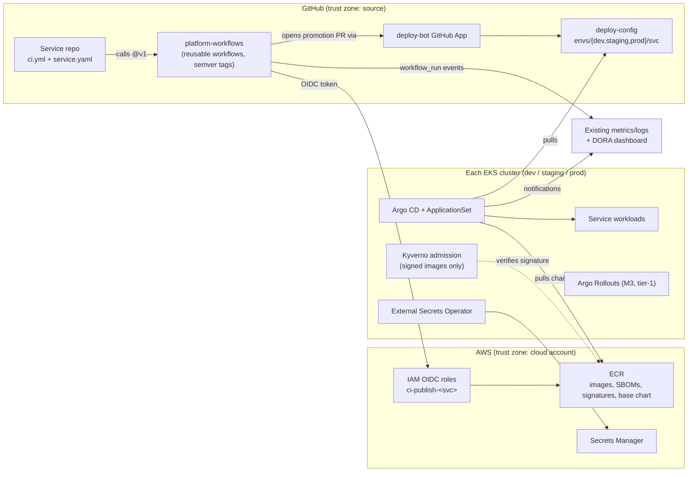

# CI/CD Platform for 50 Microservices: Architecture and Build Plan

> **Context note:** The working directory has only a README saying it is empty, so I had no existing code, CI configuration or infrastructure to read. Everything about your current setup is an **assumption**. All of them are in Section 5, and the five that would change the plan most are at the end.

---

## 1. Summary

- **What:** a shared build-and-deploy platform. It takes each of ~50 microservices from a commit to production in a standard, auditable and reversible way. It replaces a mix of pipelines that each team maintains separately.
- **Shape:** CI uses **GitHub Actions reusable workflows**. These are pipeline definitions kept in one central repo, which each service repo calls with a ~20-line file. Images go to the cloud registry, scanned and signed. CD uses **GitOps** (Git-driven deployment): CI never touches a cluster. Instead it changes an image reference in a `deploy-config` repo, and **Argo CD**, running in each cluster, applies that change.
- **Key decisions:**
  1. GitOps pull deploys rather than CI push deploys. This keeps cluster credentials out of CI, and rollback is a `git revert`.
  2. One versioned **golden path**: shared workflows plus a shared base Helm chart, with a documented escape hatch for services that don't fit.
  3. Services move over in **waves**, each one built in shadow first, rather than all at once.
  4. GitHub-hosted runners to start. Self-hosted runners only if cost or network access forces it.
  5. Contract tests plus shared dev and staging environments. No full-stack test environment per pull request.
- **Milestone 1 (3–5 weeks):** one real pilot service goes commit → build → scan → sign → dev → staging → **production** through the new path, and a rollback drill takes under 10 minutes. Four spikes run alongside it to answer the riskiest questions.
- **Top risks:**
  - The 50 services vary more than the golden path can absorb.
  - Moving live services under the new Helm chart forces a Deployment to be recreated, because label selectors can't be changed in place.
  - Service teams don't have time to migrate.
  - A bad change to the shared workflows breaks all 50 pipelines at once.

## 2. Context and Goals

- **Problem (assumed):** each team keeps its own pipeline (Jenkins jobs and scripts). Deploys are partly manual and work differently from service to service. Nobody can easily answer "what is running in prod, and who shipped it?" Rollback is improvised, and security scanning is patchy.
- **Goals:**
  - All 50 services deploy to production through the platform within ~6 months.
  - Any production change can be rolled back in under 10 minutes.
  - Every production change can be traced to a commit, an image digest and an approver.
  - A new service gets from template to dev in under 1 day.
- **Non-goals:**
  - Changing the runtime: services stay on the Kubernetes clusters they already use.
  - Building a developer portal (for example Backstage).
  - A test environment per pull request.
  - Multi-region deployment orchestration.
  - Fixing flaky tests inside services. Teams own their own tests.
- **Success measures:** the four DORA metrics (standard delivery measures), measured before and after for each service: deploy frequency, lead time from commit to prod, change failure rate and time to restore. Also: how many services have moved, engineer-days spent per migration, and a developer satisfaction survey at M2 and M4.

## 3. Drivers, Requirements, and Constraints

**Ranked quality attributes**

| # | Attribute | Measurable target | Why it matters |
|---|---|---|---|
| 1 | Safe, reversible prod changes | Rollback to the previous version in < 10 min. 100% of prod deploys traceable to commit + digest + approver. Platform-caused prod incidents: 0 | A shared platform multiplies mistakes across 50 services. Safety beats speed. |
| 2 | Adoption throughput | 50/50 services moved in ≤ 6 months. Median ≤ 2 service-team engineer-days per migration *(assumption)* | A platform used by only 10 services doesn't pay for itself, and you'd be running two systems. |
| 3 | Developer lead time | Commit to running in dev: p50 < 15 min, p90 < 25 min. Platform-caused pipeline failures < 2% of runs *(assumption)* | Slow or flaky pipelines push teams back to their old ones. |
| 4 | Supply-chain security | 100% of prod images come from the approved registry, signed and scanned. No long-lived cloud keys in CI | Standard audit expectation. Far cheaper to build in now than to add later. |
| 5 | Run cost and ops load | CI spend < ~$3k/month *(assumption)*. Platform run by the platform team in business hours only | Small team. The platform mustn't need a 24/7 pager. |

How the ranking plays out: tier-1 prod promotions need a human approval (1 beats 3). Migration goes in waves rather than as one big cutover (1 beats 2).

**Key functional requirements:**
- Build, test, scan, sign and publish for each language archetype (a group of services that build the same way).
- Promotion from dev to staging to prod.
- One-step rollback.
- Database migrations run safely as part of a deploy.
- Secrets delivered without being stored in Git.
- Deploy events visible for audit and DORA metrics.

**Constraints (assumed):**
- Code is on GitHub (Enterprise Cloud) with one repo per service.
- AWS with existing EKS clusters `dev`, `staging` and `prod` in one region.
- 3–4 languages (for example Java/Kotlin, Go, Node, Python).
- A platform team of 4 engineers.
- About 10 product teams, who must keep shipping features during migration.
- Change controls of a SOC 2 kind, with no PCI or SOX segregation-of-duties mandate.

**Hard parts:**
1. **How different the services are.** If no single golden path fits, you end up with 50 snowflake pipelines on a new tool.
2. **Moving live workloads without downtime.** Existing Deployments may have selectors, names or Helm release ownership that don't match the base chart. Kubernetes won't let you change a Deployment selector in place.
3. **Database migrations during CD.** Getting the order or concurrency wrong can corrupt data or cause an outage.
4. **Prod access and security sign-off for Argo CD.** This is a long-lead item outside the team's control.
5. **Blast radius of the platform itself.** One bad tag on a shared workflow breaks every pipeline.
6. **Organisational throughput.** Migration needs time from 10 teams who have their own roadmaps.

## 4. Current State

Nothing to inspect. **Assumed:**
- Jenkins plus team-owned scripts.
- Some services deployed with `helm upgrade` or `kubectl apply` from CI, some by hand.
- Secrets stored as Jenkins credentials and Kubernetes Secrets applied by hand.
- An existing metrics stack (Prometheus and Grafana).
- An organisation identity provider (Okta or Entra ID) for SSO.

Spike S1 (service inventory) replaces these assumptions with facts in week 1. The plan builds alongside Jenkins and doesn't modify it. Jenkins is retired only at the end of M4.

## 5. Assumptions and Open Questions

| Assumption | Impact if wrong | How / when validated |
|---|---|---|
| Code is on GitHub | Use GitLab CI or Bitbucket Pipelines instead. Same structure, different syntax. ~1 week of rework | Ask now (open question 1) |
| All 50 services run on Kubernetes | Argo CD doesn't cover VMs, ECS or Lambda. You'd need a second deploy path | S1 inventory, week 1 |
| AWS (EKS, ECR, IAM, Secrets Manager) | Swap for GCP or Azure equivalents. Design unchanged | Ask now |
| ≤ 6 build archetypes cover ≥ 80% of services | More templates and a longer M2 | S1, week 1 |
| 4 platform engineers; each service team can give ~2 days per migration | Timeline stretches in proportion | Confirm with eng leadership before M1 starts |
| No segregation-of-duties mandate | Prod approvals must come from someone other than the author, which changes the CODEOWNERS model | Ask compliance, before M2 |
| One prod cluster, one region | Multi-cluster promotion and ApplicationSet design need extra work | S1 |
| Most services use a migration tool with locking (Flyway, Liquibase, golang-migrate, Alembic) | Migrations can't simply run as a deploy step. They may need DBA gates | S2, weeks 1–2 |
| CI spend ~$1–3k/month on GitHub-hosted runners | Self-hosted runners come earlier | S4 plus the first month's bill. GitHub has changed hosted and self-hosted runner pricing recently, so check current rates |

**Open questions:**

| Question | Owner | Default if no answer | Needed by |
|---|---|---|---|
| Where is code hosted, and what CI exists today? | Eng leadership | GitHub + Jenkins | Before M1, day 1 |
| Is every service on Kubernetes? | Platform lead | Yes | M1 week 1 (S1) |
| Which compliance regime applies to prod changes? | Security / compliance | SOC 2 style: owner approval, audit trail | Before M2 |
| Committed migration time from service teams? | Eng managers | 2 days per service, scheduled per wave | Before M2 |
| Is there a hard date (for example a Jenkins licence or hardware end-of-life)? | Eng leadership | None. Target 6 months | M1 end |

## 6. Architecture Overview



**How it fits together:**
1. A merge to `main` triggers the service's thin `ci.yml`. That file calls a pinned reusable workflow, which tests, builds, scans, signs and pushes an image by digest using short-lived OIDC credentials.
2. The workflow then uses `deploy-bot` to open a pull request that changes the image digest in `deploy-config/envs/dev/<svc>/`.
3. Dev and staging pull requests merge automatically once checks pass. Prod pull requests need approval from the service's code owners.
4. Argo CD in each cluster watches its own `envs/<env>/` path and syncs.
5. Kyverno refuses any pod whose image isn't signed by the organisation's workflow identity.

Trust boundary: CI has **no** credentials for any cluster. Prod changes only through a reviewed Git commit.

| Component | Responsibility | Owns data | Interfaces | Technology | Key deps |
|---|---|---|---|---|---|
| Reusable workflows | Build, test, scan, sign and publish for each archetype; open promotion PRs | Workflow definitions | `workflow_call` with typed inputs, semver tags | GitHub Actions | ECR, OIDC, deploy-bot |
| Service caller workflow + `service.yaml` | Pick an archetype; declare owner, tier, port, health path | Service metadata | File in each service repo | YAML | Reusable workflows |
| Base Helm chart | Standard Deployment, Service, HPA, PDB, probes, ExternalSecret | Chart templates | Values schema (`values.schema.json`), semver | Helm library + app chart in ECR (OCI) | — |
| `deploy-config` repo | Desired state for each service in each env | Image digests, env values | Git paths, CODEOWNERS | GitHub | — |
| `deploy-bot` | Opens and updates promotion PRs | — | GitHub App (contents + PR write on `deploy-config` only) | GitHub App | — |
| Argo CD (one per cluster) | Sync desired state; drift detection; deploy history | Sync history | UI and CLI via SSO; notifications | Argo CD (pinned) | `deploy-config`, ECR |
| Kyverno | Enforce signed images from approved registry, plus baseline pod policy | Policies | Admission webhook | Kyverno | ECR |
| External Secrets Operator | Sync secrets from Secrets Manager into the cluster | — | `ExternalSecret` CRD | ESO | Secrets Manager |
| `platform-infra` | All of the above as code: IAM, ECR, controller installs | Terraform state (S3 with locking) | PR → plan → apply pipeline | Terraform | AWS |
| Delivery telemetry | Pipeline and deploy metrics, DORA | Events in existing stack | Webhooks, Argo notifications | Existing Prometheus/Grafana | — |
| Argo Rollouts (M3) | Canary with automated metric analysis for tier-1 services | — | `Rollout` CRD | Argo Rollouts | Service metrics |

## 7. Component Details

**Reusable workflows (`platform-workflows`).**
- *Does not:* own service tests (teams do), deploy to clusters, or hold secrets beyond OIDC.
- *Structure:* `build-<archetype>.yml` → `publish-image.yml` (buildx, Trivy, syft SBOM attestation, cosign keyless signing) → `promote.yml`.
- *Versioning:* tags `v1.2.3` plus a floating major tag `v1`. Services pin `@v1`. Renovate opens PRs for major bumps.
- *Failure mode:* a bad release breaks every consumer. *Recovery:* the release process in §14 (fixture tests, then canary consumers for 48 hours, then move `v1`). Rolling back means moving the `v1` tag back to the previous release. Third-party actions are pinned by SHA.

**Base Helm chart (`platform-charts/charts/service`).**
- *Does not:* model databases or other stateful infrastructure.
- *Escape hatch:* a service may point `deploy-config` at its own chart. It must still pass the Kyverno policy and is tracked as debt.
- *Hard part 2:* the chart exposes `nameOverride`, `selectorLabelsOverride` and `fullnameOverride`, so migrated services keep their existing resource names and selectors. Without these, each migration would mean recreating the Deployment.

**`deploy-config`.**
- *Layout:* `envs/<env>/<svc>/{config.yaml,values.yaml}`. `config.yaml` holds the chart version and the image digest.
- *CODEOWNERS:* `envs/prod/<svc>/` belongs to the service team. `envs/dev` and `envs/staging` have no owner, so they merge automatically once checks pass. `CODEOWNERS` itself belongs to the platform team.
- *Branch rules:* code-owner review required, stale approvals dismissed, "require up to date" left off. Each service touches only its own files, so there are no rebase queues.
- *Checks on every PR:* `helm template` + kubeconform + `kyverno apply` against the rendered manifests.

**Argo CD.**
- One instance per cluster, installed from `platform-infra`.
- An ApplicationSet with a Git directory generator creates one Application per `envs/<env>/*`.
- Auto-sync with self-heal in dev and staging. Auto-sync in prod too, because the PR approval is the gate. Prune is on, but resources can be marked so Argo never deletes them.
- SSO through the identity provider. No local admin account. Developers get read-only access plus the ability to sync their own apps.
- *Failure:* if Argo CD is down, running workloads are unaffected but nothing deploys. *Recovery:* reinstall from `platform-infra`. All desired state is in Git, so nothing is lost (RPO 0), and recovery takes under 1 hour.

**Routine components:**
- *Kyverno:* `verifyImages` checks the cosign keyless identity `https://github.com/<org>/platform-workflows/.github/workflows/publish-image.yml@refs/tags/v*`. Audit mode in M2, enforce mode in M3.
- *ESO:* one `ClusterSecretStore` per cluster, using IRSA (IAM roles for service accounts).
- *Runners:* GitHub-hosted. ARC (Actions Runner Controller, for self-hosted runners) is deferred (§17).

## 8. Data Design

| Entity | System of record | Writer | Retention |
|---|---|---|---|
| Service metadata (owner, tier, archetype) | `service.yaml` in the service repo | Service team | Life of the service |
| Image + SBOM + signature | ECR (immutable tags, keyed by digest) | Reusable workflow | Prod-deployed digests: 1 year. Everything else: 90 days (ECR lifecycle policy) *(assumption)* |
| Desired state per env | `deploy-config` | `deploy-bot` (PRs), humans (values) | Git history, forever |
| Deploy history | Argo CD history + `deploy-config` commits + notification events in the log stack | Argo CD | Log stack retention, at least 1 year for prod events *(assumption)* |
| Pipeline runs | GitHub Actions | GitHub | Log retention set to 90 days |
| Secrets | AWS Secrets Manager | Service teams via `platform-infra` or the console with audit | Rotation per secret |

- **Consistency:** the only shared write target is `deploy-config`. Each (service, env) pair has exactly one file and one writer, `deploy-bot`. Promotion PRs use a fixed branch name, `promote/<env>/<svc>`, so a newer build replaces any older pending promotion instead of racing it.
- **Sensitive data:** no secret values ever go into `deploy-config`. Only `ExternalSecret` references do. GitHub secret scanning with push protection is turned on for every repo.
- **Schema evolution:** the base chart values have a `values.schema.json`. Breaking changes mean a major chart version, and services opt in through Renovate.

## 9. Key Flows

**F1: Commit to prod (happy path)**
1. A PR merges to `main` in `orders-svc`. `ci.yml` calls `build-jvm.yml@v1`.
2. Tests run. The image is built, scanned (critical CVEs with a fix fail the build from M3), given an SBOM attestation, cosign-signed and pushed to ECR as `orders-svc@sha256:…`.
3. `promote.yml` opens `promote/dev/orders-svc` in `deploy-config` with the new digest. Checks pass and it merges automatically.
4. Argo CD in dev syncs and reports Healthy. Argo notifications post the event to the metrics stack.
5. A post-sync step opens `promote/staging/orders-svc`, which merges automatically. After staging is healthy, `promote/prod/orders-svc` opens and asks the code owners for review.
6. An owner approves and the PR merges. Argo CD in prod syncs and Kyverno verifies the signature. Lead time is recorded as prod sync time minus commit time.

**F2: Bad release → rollback**
1. Error rates rise after the prod sync.
2. M1–M2: the owner runs `git revert` on the prod promotion commit, through the "Rollback" PR template, which needs one approval. Argo syncs the previous digest. Target: under 10 minutes from deciding to roll back to the old version serving traffic.
3. M3+ (tier-1 services): Argo Rollouts canary analysis compares the 5xx rate and p95 latency against the stable version, aborts automatically, and shifts traffic back. A human then reverts the commit so Git matches what is actually running.

**F3: Failure path: duplicate or concurrent promotions**
1. Two `main` builds of `orders-svc` finish 30 seconds apart. Both run `promote.yml`.
2. Each run force-updates the same branch, `promote/dev/orders-svc`. The last writer wins, and that is the newer commit, because the job has a per-service concurrency group set to cancel in-progress runs.
3. If the digest already in `envs/dev/orders-svc/config.yaml` matches, the job exits without doing anything (idempotent).
4. A prod PR that is updated after approval loses that approval, so nobody can merge an unreviewed digest.

**F4: Failure path: GitHub outage, or Argo CD can't reach Git**
- Running workloads are unaffected. New deploys are blocked, which is acceptable.
- Rollback during an outage uses the break-glass runbook:
  1. Pause auto-sync on the app (Argo CLI via SSO).
  2. Run `kubectl rollout undo` (or `kubectl argo rollouts undo`) using a role held by on-call leads.
  3. Post in `#deploys`.
  4. Reconcile Git once GitHub is back.
- Every break-glass use is reviewed afterwards.

**F5: Failure path: database migration fails**
- The migration runs as an Argo CD PreSync Job, using the service's own tool and that tool's lock. If the Job fails, the sync fails and the old pods keep serving.
- Rule: migrations must be expand/contract. Each deploy only adds schema; removals ship in a later release. That way the previous app version always works against the new schema. A `migration-safety` checklist goes in the PR template.

## 10. Key Decisions

| Decision | Options considered | Rationale (against drivers) | Reversibility | Revisit if |
|---|---|---|---|---|
| D1 CI engine: GitHub Actions reusable workflows | Keep Jenkins with shared libraries; GitHub Actions; Tekton | Code is already on GitHub (assumed). Managed, so less ops (5). Built-in OIDC (4). Reusable workflows give versioned sharing (1, 2) | Medium | Code is not on GitHub → use that host's CI with the same structure |
| D2 CD model: GitOps pull with Argo CD | CI pushes `helm upgrade`; Argo CD; Flux | No cluster credentials in CI (4). Revert = rollback, Git = audit trail (1). Argo's UI helps adoption (2) over Flux. Cost: a new tool for the team | Hard once 50 services use it | Security rejects in-cluster pull from GitHub → mirror the repo or use a hub model |
| D3 Env config: one `deploy-config` repo with per-env directories | Config inside service repos; one repo per env; one repo | One place to audit. CODEOWNERS per path gives prod gating. ~500 commits/day is fine for Git | Hard-ish (path layout gets baked in) | A segregation-of-duties mandate needs repo-level separation of prod |
| D4 Sharing model: thin caller + pinned `@v1` + escape hatch | Copy-paste templates; locked central pipeline; reusable + pin | Upgrades without editing 50 repos (2). Pinning limits blast radius (1). Escape hatch keeps unusual services moving | Easy | > 20% of services on the escape hatch |
| D5 Packaging: shared base Helm chart with override values | Bespoke charts per service; Kustomize bases; base chart | Consistent probes, PDBs and resources (1). Overrides keep existing names during migration (hard part 2) | Hard after wide adoption, so version it | S1 finds many services with unusual shapes (StatefulSets, sidecars) |
| D6 Runners: GitHub-hosted first | GitHub-hosted; ARC self-hosted from day one | No ops (5). Builds don't need the private network, because the registry is reached over OIDC and deploys are pull-based | Easy | S4 misses p50 < 15 min, CI bill > $3k/month, or builds need private network access |
| D7 Integration testing: contract tests + shared dev/staging | Ephemeral full stack per PR; contract tests | Ephemeral stacks for 50 interdependent services are expensive and fragile (3, 5) | Easy | Change failure rate stays above 15% after M3 because of integration defects |
| D8 Argo CD topology: one per cluster | Central hub managing all clusters; one per cluster | No single component holds credentials for every cluster (1, 4). With 3 clusters the overhead is small | Easy | More than ~6 clusters |
| D9 Migration: waves, shadow build first | Big bang; team by team; waves by archetype and tier | Each wave proves one archetype before it scales (1, 2). Tier-1 services move only after canary exists | Easy | — |
| D10 Policy engine: Kyverno | Kyverno; Gatekeeper | Native cosign `verifyImages`. YAML policies are easier for the team | Easy | Gatekeeper is already the organisation standard |

## 11. Cross-Cutting Concerns

**Security** (built in M1, enforced by M3). The main threats and their mitigations:
1. *A compromised action or workflow steals credentials.* Actions pinned by SHA, an organisation allowlist, and an OIDC role per repo scoped to `repo:<org>/<svc>:ref:refs/heads/main` that can only push to that service's ECR repo. No prod credentials exist in CI at all.
2. *Someone changes prod without authorisation.* CODEOWNERS plus required review on `envs/prod`. `deploy-bot` can open PRs but can't approve them. Branch rules are managed in `platform-infra`.
3. *An unknown or tampered image runs in prod.* Kyverno signature and registry checks (audit in M2, enforce in M3). ECR tags are immutable.
4. *Secrets leak.* ESO with Secrets Manager, GitHub push protection, masked logs. Jenkins credentials are rotated as each service moves.
5. *Argo CD is compromised.* SSO only, no local admin, not exposed to the internet, kept on a supported release.

**Reliability.**
- Platform targets: platform-caused pipeline failures < 2% (pipeline failures not caused by service tests), runner queue time p90 < 2 min, rollback < 10 min.
- Every workflow step has a `timeout-minutes`. Network-heavy steps (registry push, dependency download) retry automatically. Tests never do.
- Promotion is idempotent (F3). Argo CD can be rebuilt from Git (§7).

**Observability** (M1 basic, M2 dashboard).
- GitHub `workflow_run` webhooks and Argo CD notifications go to the existing metrics and log stack.
- A Grafana dashboard shows pipeline p50/p90 duration, the success rate split into "test failure" and "platform failure", and deploys per service per env.
- DORA metrics arrive in M2.
- Alerts: platform-failure rate > 5% over 1 hour, Argo CD app out of sync or degraded for 30 minutes in prod, and Kyverno denials in prod. Each alert links to a runbook in `platform-workflows/docs/runbooks/`.

**Performance and capacity.**
- Load: ~50 services × ~10 builds/day ≈ 500 runs/day *(assumption)*.
- Expected bottlenecks: JVM and monorepo-style builds, and image layer pushes.
- Mitigation: dependency and buildx layer caches. S4 measures the slowest service.

**Cost.**
- CI minutes ≈ 500 runs × 12 min × 22 days ≈ 130k min/month, roughly $1–2k at standard Linux rates (check current pricing).
- ECR < $300/month with lifecycle rules. Controllers use about 1–2 nodes' worth across clusters.
- The real cost is people: ~4 engineers for 5–6 months, plus ~50–120 service-team engineer-days.
- Controls: org spending limit on Actions, a monthly cost review, and cost tags on all `platform-infra` resources.

**Operations.**
- The platform team owns `platform-*`, `deploy-config` structure, Argo CD, Kyverno and ESO, with business-hours support through `#platform-help`.
- Service teams own their tests, values, prod approvals and rollbacks.
- The prod on-call rotation stays with service teams. Only the break-glass role sits with on-call leads.

**AI-specific concerns:** not applicable. The plan has no AI components.

## 12. Build Sequence

Team assumption: 4 platform engineers, with help from pilot and wave teams at ~2 engineer-days per service. Sizes are rough ranges, not commitments.

```
Week:        1  2  3  4  5  6  7  8  9 10 11 12 13 14 15 16 17 18 19 20 21 22
M1 Slice    [=========]                                   ← critical path
  long-lead  ■ access/security review requested day 1
  spikes    [S1 S2 S3 S4]
M2 Golden path + Wave 1      [===========]                ← critical path
M3 Safety + Wave 2                         [===========]
M4 Waves 3 + Jenkins retire                              [==============]
Parallel:  observability (M1→M2), policy audit→enforce (M2→M3), canary spike S5 (M2)
```

**Critical path:**
1. Day-1 access and security review.
2. Argo CD in prod (S3).
3. Pilot reaches prod.
4. Golden-path archetype templates.
5. Wave 1.
6. Canary ready for tier-1 services.
7. Waves 2 and 3, which depend on service team time (organisational).
8. Jenkins retired.

| Milestone | Goal / risk cleared | Scope (in / out) | Deliverables | Exit criteria | Deps | Size |
|---|---|---|---|---|---|---|
| **M1 Thin slice + spikes** | Prove the whole path works in real prod. Answer the four riskiest questions | In: 1 pilot service, 1 archetype, dev/staging/prod, revert rollback, basic metrics. Out: canary, policy enforcement, other archetypes | `platform-infra`, `platform-workflows@v0`, `platform-charts` v0.1, `deploy-config`, Argo CD ×3, ESO, inventory, spike reports | Pilot deployed to prod through the new path at least 3 times. Rollback drill < 10 min. Old pilot deploy job disabled. Spike results written up and the plan updated | Day-1 access; security review for prod | 3–5 wks |
| **M2 Golden path v1 + Wave 1** | Prove the path generalises across archetypes, including a database service | In: templates for every archetype in S1 (≤ 6), chart v1, template repo for new services, Kyverno in audit mode, DORA dashboard, 9 more services (total 10) covering every archetype and ≥ 2 database services. Out: tier-1 services | `platform-workflows@v1`, `service-template` repo, onboarding guide, migration runbook | 10 services on the new path in prod. Median migration ≤ 2 days (measured). New service from template to dev < 1 day (timed run). Platform-failure rate < 2% over 2 weeks | M1 | 4–6 wks |
| **M3 Safety + Wave 2** | Make tier-1 migration safe. Turn on supply-chain enforcement | In: Argo Rollouts canary for tier-1, Pact contract tests for the top 5 dependency pairs, Kyverno enforce in prod, CVE gate on, +15 services (total 25) including tier-1. Out: preview environments | Rollout analysis templates, Pact broker (managed or self-hosted, decided in S5), policy set v1 | Injected bad release in staging aborted automatically by canary. 0 unsigned images admitted to prod for 2 weeks. 25 services moved | M2. S5 result | 4–6 wks |
| **M4 Long tail + retire Jenkins** | Finish the migration so there's only one system to run | In: the remaining ~25 services (old and low-activity ones last), runner decision (D6), Argo CD rebuild drill, Jenkins read-only then off. Out: developer portal | All 50 migrated. DR runbook tested. Jenkins decommission record | 50/50 in prod on the new path. No Jenkins deploy jobs for 30 days. Argo CD prod rebuild drill < 1 h. DORA baseline comparison published | M3 | 5–8 wks |

Total: about **16–25 weeks**. The range depends mostly on service-team availability and on what S1 finds about how varied the services are.

## 13. First Milestone Task Breakdown

Repos are new, under `<org>/`. **P** marks tasks that can run in parallel. **→** marks dependencies.

| # | Task | Location | Done when |
|---|---|---|---|
| T1 | **File long-lead requests on day 1:** Actions allowlist and spending limit (org admin); AWS IAM rights in the platform account; security review of Argo CD in prod, Kyverno and ESO; create the `deploy-bot` GitHub App | Tickets with owners | All filed with named owners and target dates. Security review booked within 2 weeks |
| T2 **P** | **Spike S1, service inventory (3 days).** *Question:* how many build archetypes exist, and which services are unusual? Fields: language, build tool, test dependencies (DB or broker), current deploy method, Helm or raw manifests, Deployment selector labels, runtime (Kubernetes or not), DB migration tool, tier, owner, deploys per month | `platform-workflows/docs/inventory.csv` | All 50 rows filled. Archetypes counted. Pilot and 9 wave-1 services named. **Changes the plan if:** > 6 archetypes or > 20% unusual → add escape-hatch support in M2 and extend M2 by 2–3 weeks. Any non-Kubernetes services → scope a separate deploy path |
| T3 **P** | **Create `platform-infra`:** S3 remote state with locking; GitHub OIDC provider; module `ecr_service` (immutable tags, scan on push, lifecycle policy); module `ci_publish_role` trusting only `repo:<org>/<svc>:ref:refs/heads/main`; PR plan / merge apply workflow | `platform-infra/` | `terraform plan` runs on a PR. Pilot ECR repo and role exist. A test workflow on a feature branch is **denied** the role |
| T4 →T3 | **Write `build-<pilot-archetype>.yml` and `publish-image.yml`:** cached test, buildx build, push by SHA tag, output the digest | `platform-workflows/.github/workflows/` | Fixture service in `platform-workflows/test-fixtures/<archetype>/` builds green on a PR. Tagged `v0.1.0` |
| T5 →T4 | **Add Trivy scan (report-only), syft SBOM attestation, cosign keyless signing** | `publish-image.yml` | `cosign verify --certificate-identity-regexp '…publish-image.yml@refs/tags/v.*'` passes for the fixture digest. SBOM attached |
| T6 **P** | **Create base chart `charts/service` v0.1:** Deployment, Service, HPA, PDB, ServiceAccount (IRSA), probes, resources, ExternalSecret, name and selector overrides, `values.schema.json`; publish to ECR as OCI | `platform-charts/` | Chart CI runs helm-unittest and kubeconform. Chart renders the pilot's **current** resource names and selectors exactly (diff against live manifests is empty for those fields) |
| T7 **P** | **Create `deploy-config`:** `envs/{dev,staging,prod}/`, CODEOWNERS, branch rules (code-owner review, dismiss stale reviews), PR check rendering every changed app | `deploy-config/` | A test PR to `envs/prod/pilot/` can't merge without an owner's approval. A dev PR merges automatically |
| T8 →T3,T7 | **Install Argo CD (pinned version) in dev and staging** via `platform-infra`: SSO through the identity provider, RBAC (devs read-only plus sync on their own apps), ApplicationSet with a directory generator per env, notifications to `#deploys` and the metrics webhook | `platform-infra/clusters/<env>/argocd/` | Pilot app appears and syncs in dev and staging. Local admin disabled |
| T9 **Spike S3** →T1 (starts day 1, up to 3 weeks elapsed, ~3 days effort) | **Get Argo CD approved and installed in prod.** *Question:* will security allow an in-cluster controller that pulls from GitHub, and what network egress does it need? | `platform-infra/clusters/prod/` | Argo CD running in prod with sign-off recorded. **Changes the plan if:** rejected → move to a Git mirror inside the VPC or a hub cluster (+1–2 weeks). Not approved by week 4 → M1 ends at staging and prod becomes M2's first deliverable |
| T10 →T5,T7 | **Write `promote.yml`:** fixed branch `promote/<env>/<svc>`, no-op if the digest is unchanged, concurrency group per service, dev→staging chained on Argo health, prod PR assigned to code owners | `platform-workflows/.github/workflows/promote.yml` | Two back-to-back builds leave exactly one open dev PR containing the newer digest. A re-run with the same digest makes no commit |
| T11 →T4–T10 | **Move the pilot onto the new path:** add a 20-line `ci.yml` calling `@v0` and `service.yaml`. Run in **shadow** (build only) for 5 builds, compare test results and image contents with Jenkins, then let Argo adopt the live resources and disable the Jenkins deploy job | Pilot repo, `deploy-config/envs/*/pilot/` | 3 prod deploys through the new path. No pod restarts caused by adoption itself. Jenkins job disabled but kept |
| T12 →T8 | **Install ESO and move the pilot's secrets** to Secrets Manager | `platform-infra`, pilot values | Pilot reads its secrets through ExternalSecret. Old Jenkins credential rotated. Secret scanning on `deploy-config` is clean |
| T13 **P** | **Spike S2, DB migrations (3 days)** using a wave-1 database service, **in dev only.** *Question:* can its migration tool run safely as a PreSync Job with its own lock, alongside expand/contract? | `platform-charts` (migration Job template), spike notes | Migration Job runs in dev. Failing it on purpose leaves old pods serving. **Changes the plan if:** services rely on startup migrations racing across replicas, or on DBA-run migrations → add a gated migration step and approval, and give database services their own wave |
| T14 **P** | **Spike S4, build speed (2 days)** on the slowest service from S1. *Question:* can GitHub-hosted runners with caching hit p50 < 15 min? | Fixture branch | Times written up for 10 runs. **Changes the plan if:** p50 > 15 min with caching → try larger hosted runners; if still too slow or too expensive, ARC becomes an M2 deliverable |
| T15 →T8 | **Wire up basic pipeline and deploy metrics:** `workflow_run` webhook and Argo notifications into the existing stack; first Grafana panel | `platform-infra/observability/` | Dashboard shows pilot pipeline duration, success rate split into test and platform failures, and deploys per env |
| T16 →T11 | **Rollback drill in prod + runbooks:** revert drill timed from decision to old pods serving; break-glass procedure written and tested in staging | `platform-workflows/docs/runbooks/{rollback,break-glass}.md` | Prod revert < 10 min. Break-glass rehearsed in staging. Both runbooks reviewed by the pilot team |
| T17 | **M1 demo and plan update:** show the full path live; fold spike outcomes into M2 scope and wave list | Plan doc | Demo held. M2 wave list and archetype list confirmed |

**Order:**
- Week 1: T1, T2, T3, T6, T7 (and T13 / T14 once T2 names the services).
- Week 2: T4, T5, T8, T12.
- Week 3: T10, T11 in shadow, T15.
- Weeks 3–4: T9 lands, then T11 cutover, T16, T17.

## 14. Testing and Validation Strategy

- **Platform code is tested like a product.**
  - `platform-workflows`: every PR runs each archetype's fixture service end to end, up to pushing to a sandbox ECR repo.
  - `platform-charts`: helm-unittest, kubeconform, and a golden-file diff of rendered output.
  - Kyverno policies: `kyverno test` with passing and failing cases.
- **Release of shared workflows and the chart:**
  1. Tag `vX.Y.Z`.
  2. Point 2–3 canary consumer services (the pilot and one service per archetype) at the exact tag for 48 hours.
  3. Move the floating `v1` tag.
  4. Breaking change → `v2` with a migration note.
  This is the main defence against hard part 5.
- **Service level:** unit tests (service teams). Pact contract tests from M3 for the top dependency pairs; a provider can't promote if it breaks a consumer contract. Smoke test against `/healthz` and one real endpoint after each env sync, which gates staging→prod.
- **Blocks a release:** failing tests; critical CVE with an available fix (from M3); failed contract verification; unhealthy staging sync; no prod approval.
- **Checking the §3 targets:**
  - Rollback time: timed drills in M1, M3 and M4.
  - Lead time and failure rate: from the dashboard.
  - Migration effort: per-service time log in the wave tracker.
  - Signing: Kyverno audit report showing 0 violations before enforcement.

## 15. Rollout, Migration, and Rollback

- **Per-service migration steps** (from the runbook written in M2):
  1. Inventory check.
  2. Add `ci.yml` in shadow mode (build only) for at least 5 builds.
  3. Render the base chart and diff it against live manifests. Names and selectors must match, or the service gets a blue/green cutover: a new Deployment under the existing Service, traffic switched, the old one removed.
  4. Argo adopts the resources, with prune off for the first sync.
  5. First prod deploy through the new path with the team watching.
  6. Disable the Jenkins deploy job.
  7. Delete the job 2 weeks later.
- **Waves:**

  | Wave | Services | Milestone |
  |---|---|---|
  | 0 | Pilot (1) | M1 |
  | 1 | 9: friendly teams, every archetype, ≥ 2 with databases, no tier-1 | M2 |
  | 2 | 15, including tier-1 services, moved onto canary | M3 |
  | 3 | Remaining ~25, with low-activity and legacy services last | M4 |

  Within a wave, move no more than ~5 services a week. Never move more than one tier-1 service per day.
- **Rollback of a migration:** re-enable the Jenkins deploy job and turn off auto-sync for that app in Argo. This is possible until the job is deleted.
- **Rollback of the platform itself:** move the workflow tag back; roll back chart versions in `deploy-config`; Argo CD, Kyverno and ESO versions through `platform-infra` revert. Kyverno has a documented fail-open setting for emergencies.
- **Point of no return:** Jenkins switched off. Before that it stays read-only for 30 days after the last service moves.

## 16. Risks and Mitigations

| Risk | Likelihood | Impact | Mitigation | Early warning | Owner |
|---|---|---|---|---|---|
| Services are too varied for the golden path | Med | High | S1 in week 1; escape hatch; archetype templates proven in wave 1 | S1 finds > 6 archetypes; wave-1 migrations take > 3 days | Platform lead |
| Adoption forces Deployment recreation or downtime | Med | High | Selector and name overrides; manifest diff step; blue/green fallback; prune off on first sync | Diff shows selector mismatches in S1 data | Platform eng on each wave |
| Bad shared-workflow release breaks all pipelines | Med | High | Fixture tests, canary consumers, floating-tag rollback | Spike in platform-failure rate after a tag move | Platform on-duty engineer |
| Security review delays Argo CD in prod | Med | Med | Request on day 1; S3 fallback design; M1 can end at staging | No reviewer assigned by day 5 | Platform lead + security |
| Service teams can't find migration time | High | High | Leadership-backed wave calendar; ≤ 2-day target; platform engineers pair on each migration | Wave dates slipping; services stuck in shadow > 2 weeks | Eng director |
| Unsafe DB migrations in automated CD | Med | High | S2; expand/contract rule; PreSync Job with tool locks; database services in their own batch | S2 finds startup or manual migrations | Service owners + platform |
| Canary analysis unusable because service metrics are missing | Med | Med | S5 in M2; instrumentation in the tier-1 checklist; fallback to a manual gate with blue/green | Tier-1 services lack request success and latency metrics | Platform + tier-1 teams |
| CI cost or speed misses target | Low–Med | Med | S4; caching; larger runners; ARC as fallback | p50 > 15 min; bill > $3k/month | Platform lead |
| Two systems run indefinitely | Med | Med | Jenkins switch-off date set at M3; Jenkins deploy jobs counted weekly | Count stops falling | Platform lead |

## 17. Deferred Work and Future Evolution

| Deferred | Build it when |
|---|---|
| Self-hosted runners (ARC) | S4 misses target, spend > $3k/month, or builds need private network access |
| Test environment per PR | Change failure rate stays > 15% because of integration defects after contract tests |
| Developer portal (Backstage) | > 75 services, or onboarding docs stop scaling. `service.yaml` is already a catalog seed |
| Custom deployment database for audit | Auditors need queries that Git plus Argo history can't answer |
| Multi-region / multi-cluster promotion | A second prod cluster is approved. ApplicationSet generators already allow it |
| Merge queue on `deploy-config` | PR contention shows up, which isn't expected with one file per service |
| SLSA provenance level 3 (build-provenance standard) | A compliance requirement appears. Cosign and SBOM are the groundwork |

**Deliberate shortcuts:**
- Trivy runs report-only until M3.
- Kyverno runs in audit mode until M3.
- The escape-hatch charts are debt, reviewed every quarter.

## 18. Next Steps

1. **Today:** file the T1 requests: org admin for the Actions allowlist and the `deploy-bot` app, AWS IAM rights, and a security review slot for Argo CD in prod.
2. **Today:** create the empty repos `platform-infra`, `platform-workflows`, `platform-charts` and `deploy-config`, with branch protection and CODEOWNERS.
3. **This week:** run S1 by sending the inventory template (`platform-workflows/docs/inventory.csv`) to the 10 team leads with a 3-day deadline. Ask specifically for runtime, deploy method and the Deployment's selector labels.
4. **This week:** pick the pilot: stateless, in the most common language, low tier but with real prod traffic, and a team willing to give 20% of an engineer for 4 weeks.
5. **This week:** get engineering managers to agree to the wave calendar and the ~2 days per service. This is the critical-path item most likely to slip.

---

**These five answers would change the plan the most:**
1. **Where is the code hosted, and what does CI look like today?** This decides D1 and how much shadow-mode comparison is worth. Default: GitHub + Jenkins.
2. **Do all 50 services run on Kubernetes?** Any on VMs, ECS or serverless need a second deploy path, which adds roughly a milestone. Default: all on Kubernetes.
3. **Does a compliance regime require segregation of duties for prod changes?** If yes, approvals must come from someone other than the author, and prod config may need its own repo (D3). Default: no.
4. **How many platform engineers are there, and will service teams commit migration time?** This is the biggest single factor in the 16–25 week range. Default: 4 engineers, 2 days per service.
5. **Is there a hard deadline, such as a Jenkins licence or hardware end-of-life?** That would push wave 3 forward, at the cost of the "tier-1 only after canary" rule. Default: none, target 6 months.
