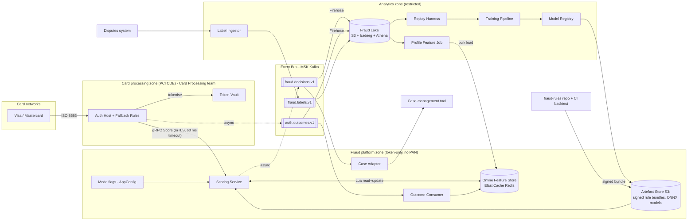

# Real-Time Card Fraud Detection Pipeline: Architecture and Build Plan

> **Note:** The working directory has no code, configuration or data (`README.md` says it is intentionally empty). Nothing told me who you are, how much traffic you have, or what you run on. Rather than wait on questions, I picked a sensible default for each gap and labelled it **[A#]**. The five answers that would change this plan the most are at the end.

---

## 1. Summary

- **What:** A fraud-scoring system for a **card issuer [A1]**. It scores every card authorisation *before* the issuer approves or declines it. It returns APPROVE, DECLINE or REVIEW with reason codes, and logs every decision so it can be audited, reproduced and used to train the next model.
- **Shape:** One stateless **Scoring Service** that the issuer's existing **Auth Host** calls synchronously. It reads and updates live counters in a **Redis Online Feature Store**, then runs rules and a gradient-boosted tree model (GBDT) inside its own process. It sends decision events to **Kafka**. From there they land in an S3 **Fraud Lake**, which feeds label joining, retraining and monitoring. Nothing in the fraud platform sees full card numbers.
- **Key decisions:**
  1. Score **inline**, but start in **monitor-only (shadow) mode**. If the service times out, the Auth Host applies its own **fallback rules**. The fraud service can never block or stall an authorisation.
  2. Update the live counters **inside the request path** with atomic, duplicate-safe Redis scripts. No stream processor (Flink) in v1.
  3. **One Feature Library** (JVM) is used both for live scoring and for offline replay. Every decision logs the exact inputs it used. This stops training data drifting away from what the live system actually sees.
  4. **The model runs inside the Scoring Service** (exported to ONNX), not on a separate model server, to protect the latency budget.
  5. **Rules live in Git** as small expression-language (CEL) bundles: reviewed, signed, backtested in CI and hot-loaded. Fraud analysts can respond to a new attack in under an hour without a code deploy.
- **First milestone (4–6 weeks):** A working slice in staging. Replayed traffic flows from the Auth Host or a simulator, through scoring with three live counters, three rules and a baseline model, to a decision that can be queried in Athena. It is load-tested at 2.5× the assumed peak. Three spikes run alongside it: latency and memory, historical data and labels, and the Auth Host contract.
- **Top risks:** (1) The Auth Host team's capacity and the latency budget they can give us. (2) Historical fraud labels may be missing, late or hard to join, which would delay the model. (3) A bad model or rule could decline good customers at scale. (4) PCI scope and model-governance approvals take a long time.

---

## 2. Context and Goals

- **Problem:** The issuer loses money to card-not-present fraud, card-testing bursts and account takeover. It also annoys good customers with false declines. Today's protection is assumed to be static rules in the Auth Host and/or a vendor tool, plus a fraud operations team working alerts by hand **[A2]**. Rules change slowly, and nobody can measure precisely how good each decision was.
- **Goals:**
  - Score 100% of authorisations within the latency budget, with no availability impact on authorisations.
  - Cut fraud losses (in basis points of spend) compared with today, without raising the false-decline rate.
  - Let analysts put a new rule live in **under 1 hour** (including review). Retrain and promote a model in **under 1 week**.
  - Make every decision reproducible: same inputs, same rule and model versions, same outcome.
- **Non-goals (v1):** acquirer- or merchant-side fraud; scoring at 3-D Secure authentication time (this is an extension point, see §17); credit or AML decisions; building a case-management tool (we feed the existing one); multi-region active-active; online learning; device fingerprinting from a vendor.
- **Success measures (90 days after full rollout):**
  - Fraud basis points down by **at least 20%** against the pre-launch baseline, with the false-positive ratio at or below today's **[A3, target to be agreed with Fraud Risk]**.
  - Fallback (timeout) rate **under 0.1%**.
  - Zero authorisation incidents caused by the fraud service.
  - Median time for a rule change to go live **under 1 hour**.

---

## 3. Drivers, Requirements, and Constraints

### Ranked quality attributes

| # | Attribute | Measurable target | Why it matters |
|---|---|---|---|
| 1 | **Authorisation-path safety** (latency + availability) | Server-side p99 ≤ **30 ms** at **1,500 TPS** sustained and 3,000 TPS burst. Auth Host client timeout of **60 ms** with fallback. Fallback rate < 0.1%. Availability 99.95% monthly **[A4]** | Card networks set hard response deadlines. A slow or down fraud service means declined or stand-in transactions across the whole portfolio. |
| 2 | **Decision quality** | Beats the current system on fraud caught at an equal or lower decline rate for good customers, measured on an out-of-time backtest and in shadow **[A3]** | This is the reason the system exists. False declines cost revenue and customers. |
| 3 | **Fraud-response agility** | Rule change live in < 1 h. Model promotion in < 1 week, through shadow → canary → full | Fraud patterns change in days. Card testing changes in hours. |
| 4 | **Auditability** | 100% of decisions logged with inputs, rule and model versions, and reason codes. Kept 5 years **[A5]**. Logs are write-once (tamper-evident) | Disputes, regulators, model-risk review, debugging. |
| 5 | **Security and compliance** | No full card numbers (PANs) in the fraud platform. Encrypted at rest and in transit. Two-person review for rule and model changes | PCI DSS scope and insider risk. |
| 6 | **Cost** | ≤ **$6k/month** infrastructure at the assumed volume **[A6]** | Small compared with fraud losses, so ranked last. |

**Trade-off stance:** For live features we put **availability ahead of consistency**. If Redis is slow, we score with the missing features flagged rather than wait. For the decision log we put **durability ahead of latency**, but the logging happens off the critical path.

### Key functional requirements
- A synchronous `Score` call that returns an action, a score from 0 to 1000, reason codes, a decision ID and a `degraded` flag.
- Live counters per card, merchant and device (where available) that update within the same request.
- Profile features computed daily: a card's usual spend, home country, merchant risk.
- A versioned rules engine where each rule can run in `shadow` or `enforce` mode.
- A model registry that supports champion and challenger models.
- A global `MONITOR_ONLY` / `ENFORCE` mode switch and per-segment rollout.
- Ingestion of auth outcomes and fraud labels. REVIEW decisions feed the existing case-management tool.

### Constraints (assumed)
- **[A7]** AWS, the organisation's existing Kubernetes (EKS) platform, Terraform, and the organisation's metrics stack (assumed Prometheus/Grafana). Kafka is permitted (managed MSK).
- **[A8]** Team: 4 backend/platform engineers (JVM), 2 data scientists or ML engineers (Python, some Spark), plus a fraud-ops subject-matter expert part-time. The Auth Host is owned by a separate **Card Processing team**.
- **[A1]** Volume: about 5M cards issued and 3M active each month. Averages 100 TPS (about 8.6M transactions/day), peaks around 600 TPS. We design for 1,500 TPS sustained.
- Compliance: PCI DSS. If the issuer is a regulated bank, it also falls under model-risk governance (for example SR 11-7 in the US, SS1/23 in the UK).

### Hard parts
1. **Latency inside the authorisation path:** reading and updating counters, evaluating rules and running the model in ≤ 30 ms p99 at peak, with a safe fallback. Getting this wrong hurts every cardholder.
2. **Accurate live counters:** counts over sliding time windows, with no double counting when a request is retried, and fresh enough to catch card-testing bursts that happen within seconds.
3. **Keeping training data the same as live data, and labels:** the training features must match the live ones exactly. Labels arrive 1–120 days late, and declined transactions never get labelled at all.
4. **Integration with the Auth Host:** another team owns it. We need the timeout budget, the fields it can send, the outcome events and the fallback behaviour from them. This is the longest-lead dependency.
5. **Harm from a bad deployment:** one bad threshold or rule can decline thousands of good customers in minutes.

---

## 4. Current State

- **In the workspace:** nothing. This is a new build. No code, conventions or infrastructure to follow.
- **Assumed organisational context [A2, A7]:**
  - **Auth Host:** an in-house issuer authorisation system. It receives ISO 8583 messages from the networks, already calls out to other services with timeouts, and has stand-in processing.
  - **Token Vault:** swaps the full card number for a stable `card_token`.
  - **Disputes system:** holds chargebacks and fraud claims, with transaction references.
  - **Case-management tool:** used by fraud ops.
  - **Platform:** an existing feature-flag service (assumed AWS AppConfig), plus EKS, Argo CD and Terraform.
- **Proposed conventions:**
  - Monorepo `fraud-platform` laid out as `services/`, `libs/`, `jobs/`, `ml/`, `infra/`, `load/`, `docs/`.
  - Kotlin on Java 21 with Gradle for services. Python 3.12 for ML.
  - Protobuf contracts in `libs/contracts`, checked with `buf`.
  - Rules in a **separate `fraud-rules` repository** so analysts get their own access rules and review history.

---

## 5. Assumptions and Open Questions

### Assumptions

| # | Assumption | Impact if wrong | How and when validated |
|---|---|---|---|
| A1 | We are an **issuer** scoring in our own auth path. ~600 TPS peak; we design for 1,500 | Acquirer or merchant: different inputs and actions, and 3DS/checkout integration. 10× volume: Redis sharding and pod counts change, the shape stays the same | First open question. Volume confirmed from Auth Host metrics in M1 (T1) |
| A2 | Some rules or a vendor tool exist today; the new system runs alongside it and then replaces it | Greenfield: no baseline to compare with, and the rollout is simpler | T1 workshop, M1 |
| A3 | Success target: −20% fraud bps at a false-positive ratio no worse than today | Thresholds and rollout gates change | Fraud Risk signs off in M2 |
| A4 | The Auth Host can give fraud a 60 ms timeout and implement the fallback rules itself | Under 30 ms: we must co-locate, or ship scoring as an in-process library (big change) | Spike S3, M1 week 2 |
| A5 | Decision and label data kept 5 years; live counters ≤ 35 days | Storage cost, deletion jobs | Compliance/data protection officer, by M2 |
| A6 | Infrastructure budget about $6k/month is acceptable | Smaller Redis, fewer replicas | Finance, M1 |
| A7 | AWS + EKS + Terraform + MSK + Prometheus/Grafana are available | Swap equivalents (e.g. Kinesis); the design holds | M1 week 1 |
| A8 | Team of 4 JVM engineers + 2 data scientists | Python-only team: reconsider the language (D11) | M1 week 1 |
| A9 | ≥ 12 months of authorisation history can be joined to chargebacks and fraud claims by transaction ID | No labels: v1 relies on rules and the model ships later | Spike S2, M1 |
| A10 | Tokenised card ID + BIN8 + last 4 keeps the fraud platform out of the PCI cardholder-data environment (CDE) | In the CDE: stricter network, logging and access controls; slower delivery | Security/assessor (QSA) review, requested on day 1 |
| A11 | The Auth Host can publish an `auth.outcomes.v1` event (final response code, approved amount) | Approved-spend features become batch-only (from clearing files) | Spike S3 |

### Open questions

| Question | Owner | Default if unanswered | Needed by |
|---|---|---|---|
| Issuer, acquirer/PSP, or merchant? | Product owner | Issuer | Before M1 starts |
| Fraud's latency budget, and who owns the fallback? | Card Processing lead | 60 ms; fallback rules live in the Auth Host | M1 week 2 |
| Is there a labelled history, and how good is it? | Data/Fraud Analytics | Assume yes; check in S2 | M1 week 3 |
| Does model governance apply, and how long is the review? | Model Risk | Assume yes, about 4 weeks of review | Start of M2 |
| Is a small "approve anyway" control group of would-be declines acceptable, for unbiased labels? | Fraud Risk | No control group in v1; revisit in M4 | M4 |

---

## 6. Architecture Overview

**How the parts fit together.** The Auth Host turns the card number into a token and calls `Score`. The Scoring Service then, in a single process:
1. checks the request;
2. runs one Redis script per entity (card, merchant, device) that reads and increments that entity's attempt counters, ignoring duplicates;
3. fetches the daily profile features in the same round trip;
4. assembles the feature vector using the **Feature Library**;
5. evaluates the rule bundle and the ONNX model;
6. applies the decision policy and the mode switch;
7. returns the decision and puts the decision event on a queue to Kafka.

Everything that doesn't have to be live happens asynchronously: approved-spend counters, logging, labels, training and case creation. The Auth Host owns the final response and the fallback.

### Component table

| Component | Responsibility | Owns data | Exposes | Technology | Key dependencies |
|---|---|---|---|---|---|
| **Scoring Service** | Real-time decision per authorisation | Attempt counters (Redis keys `att:*`), idempotency markers | gRPC `fraud.v1.Scoring/Score`; produces `fraud.decisions.v1` | Kotlin/JVM 21, grpc-java, cel-java, ONNX Runtime | Redis, Artefact Store, AppConfig, Kafka |
| **Feature Library** (`libs/features`) | Single definition of every feature, used live and offline | None (code) | Kotlin API | Kotlin | None |
| **Online Feature Store** | Low-latency counters and profiles | Storage only; each key family has exactly one writer | Redis protocol | ElastiCache Redis 7, cluster mode, Multi-AZ | None |
| **Outcome Consumer** | Approved-amount counters from final auth outcomes | Redis keys `appr:*` | Consumes `auth.outcomes.v1` | Kotlin (same repo, separate deployment) | Kafka, Redis |
| **Profile Feature Job** | Daily card and merchant profiles | Redis keys `prof:*`; lake table `profiles` | Batch | Spark on EMR Serverless + Feature Library | Fraud Lake |
| **Event Bus** | Durable decoupling | Topics (35-day retention) | Kafka topics with Protobuf in a schema registry | MSK | None |
| **Fraud Lake** | System of record for decisions, outcomes, labels and training sets | `decisions`, `outcomes`, `labels`, `features_replay` | Athena/Spark SQL | S3 (versioned, Object Lock on `decisions`), Iceberg, Firehose | Kafka |
| **Replay Harness** | Rebuild features for history, in timestamp order, using the live code | `features_replay` tables | Batch job | Spark + Feature Library | Fraud Lake |
| **Label Ingestor** | Normalise chargebacks, fraud claims and analyst outcomes into labels | `labels` | Produces `fraud.labels.v1` | Kotlin or Python batch, daily | Disputes system, case tool export |
| **Training Pipeline + Model Registry** | Train, evaluate, export ONNX, record model cards, promote | Model versions, evaluation reports | Registry pointer read by the Scoring Service | Python, LightGBM, onnxmltools, MLflow | Fraud Lake |
| **fraud-rules repo + Rule Bundle CI** | Author, review, backtest, sign and publish rules | Rule bundles | Signed YAML bundles in S3 | Git, CEL, CI | Fraud Lake (backtests) |
| **Case Adapter** (M3) | Turn REVIEW decisions into cases | None | Consumes `fraud.decisions.v1` | Kotlin | Case-management API |
| **Auth Host** (external) | Final authorisation response and fallback rules | Authorisations | Calls `Score`; produces `auth.outcomes.v1` | Existing | Card Processing team |

---

## 7. Component Details

### Scoring Service (the hard part)
- **Does not:** make the final authorisation decision, see full card numbers, call any external vendor in the request path, or write approved-spend counters.
- **Interface:** gRPC unary `Score(ScoreRequest) → ScoreResponse`, Protobuf in package `fraud.v1`. Changes must be backward-compatible (checked by `buf breaking`). A breaking change means a new `fraud.v2` package served alongside `v1`.
  - **Request:** `txn_id` (the Auth Host's unique ID, also the duplicate-detection key), `card_token`, `account_id`, `bin8`, `last4`, `amount_minor`, `currency`, `merchant_id`, `mcc`, `merchant_country`, `acquirer_id`, `channel` (POS / ECOM / ATM / MOTO), `pos_entry_mode`, `card_present`, `wallet_type`, `eci_3ds`, optional `device_id` and `ip_hash`, `txn_local_time`, `received_at`.
  - **Response:** `decision_id`, `action` (APPROVE / DECLINE / REVIEW), `score` (0–1000), `reason_codes[]`, `rule_hits[]`, `model_version`, `rules_version`, `mode`, `degraded`.
  - **Load:** 100 TPS on average, 600 peak, designed for 1,500 sustained and 3,000 burst.
- **Internal pipeline and per-stage budget (p99):**

  | Stage | Budget |
  |---|---|
  | Check request | < 1 ms |
  | Redis scripts, pipelined in parallel per entity | ≤ 8 ms, with a hard **10 ms** timeout |
  | Assemble features | < 1 ms |
  | Rules (CEL, precompiled) | ≤ 2 ms |
  | GBDT via ONNX | ≤ 3 ms |
  | Policy | < 1 ms |
  | Garbage-collection headroom (ZGC) | — |
  | **Total** | **≤ 30 ms** |

  Publishing the decision is fire-and-forget into a bounded buffer.
- **Decision policy:** Rules in `enforce` mode can force DECLINE or APPROVE (allow and deny lists). Otherwise, score thresholds decide: ≥ T_decline → DECLINE; ≥ T_review → REVIEW (approve, then alert). Thresholds are set per channel in the rule bundle, so changing them goes through the same review and backtest. In `MONITOR_ONLY` mode the service always returns `APPROVE`, with the *would-be* action in `shadow_action`.
- **Failure and recovery:**
  - **Redis slow or down:** 10 ms timeout, then a circuit breaker opens. The service scores with features marked missing (LightGBM handles missing values natively; tested in M2), skips rules that need live counters, and sets `degraded=true`.
  - **Model fails to load:** the service keeps the last good model in memory. If it has never loaded one, it runs rules only (and flags it degraded).
  - **Rule bundle has a bad signature or fails checks:** the service rejects it and keeps the current one.
  - **AppConfig unreachable:** the service uses the last cached value. On a cold start with no cache, it defaults to `MONITOR_ONLY` (fail-safe for customers).
  - **Kafka down:** a bounded 50k-event buffer covers about 30 s at peak. After that, events are dropped and counted, and `decision_log_dropped` pages someone. The Auth Host's own log of the fraud response is the secondary audit trail.
- **Scaling:** stateless. Minimum 6 pods across 3 availability zones, scaled by CPU and in-flight requests. Each pod pre-loads the model and rules and runs warm-up requests before it reports ready. The readiness check confirms Redis, the model and the rules are loaded, not just that the process is up.

### Online Feature Store
- **Key layout:** Redis Cluster with hash tags, so all keys for one entity sit on the same shard. One script per entity, for example `{c:<card_token>}`.
- **Time buckets** (live counters are kept as running totals in time buckets):
  - 1-minute buckets covering the last 15 minutes (for card-testing bursts)
  - 1-hour buckets covering 48 hours
  - 1-day buckets covering 35 days

  Each bucket holds a count and an amount total. Spike S1 settles the exact layout.
- **Who writes what:** `att:*` (attempts) is written only by the Scoring Service. `appr:*` (approved spend) is written only by the Outcome Consumer. `prof:*` (profiles) is written only by the Profile Feature Job, as a bulk load each night. `seen:{txn_id}` (24 h expiry) handles duplicates.
- **Size:** an estimated 15–30 GB of primary memory for 3M active cards plus merchants (S1 confirms). Starting cluster: 3 shards, each with a primary and a replica on r7g.xlarge.
- **Failure:** a lost shard degrades scoring but never stops it. A **Feature Rebuild** tool (M3) replays the 35 days of `fraud.decisions.v1` and `auth.outcomes.v1` through the Feature Library to refill Redis. Target: ≤ 2 h for a full rebuild.

### Outcome Consumer
Reads `auth.outcomes.v1` in a consumer group, keyed by `card_token`. Updates are made idempotent using `txn_id` markers. Lag target is under 5 s. If it falls behind, approved-spend features become slightly stale, which is acceptable and alerts at 5 minutes.

### Rules (`fraud-rules` repo)
Rules are YAML entries with an `id`, a CEL `when` expression, an `action`, a `mode` (shadow or enforce), an `owner` and an `expires_at` (optional, for emergency rules). CI does three things: compiles every expression, backtests the bundle against the last 14 days of decisions in Athena, and posts how decision rates would change. A merge needs two approvals, one from Fraud Risk. On merge, the pipeline signs the bundle (KMS) and publishes it to `s3://fraud-artefacts/rules/<version>.yaml`, then updates the "current" pointer. Scoring pods check every 30 s, so a rule is live within about 60 s of merge.

### Training Pipeline and Model Registry
1. Build the training set: replayed features (or, for features that already have live history, the logged features) joined to labels with a 90-day label-maturity cut-off.
2. Train LightGBM.
3. Export to ONNX, and check parity on a fixed set of 10k rows.
4. Produce the evaluation report and model card.
5. Register in MLflow.

Promotion moves a model from **shadow** (challenger, scored on the side) to **canary** (5% of cards, chosen by card-token hash) to **champion**. Each step needs Fraud Risk sign-off. Retraining runs monthly at first.

### Routine components
- **Label Ingestor:** a daily batch job that maps chargeback reason codes (Visa 10.x, Mastercard 4837/4863/4870/4871), fraud claims and analyst outcomes to `label ∈ {fraud, not_fraud}` with `label_source` and `label_date`.
- **Case Adapter:** filters `action=REVIEW` and calls the case tool's API, using `decision_id` so retries don't create duplicate cases.
- **Fraud Lake:** Firehose writes Parquet every 5 minutes, and nightly compaction puts it into Iceberg tables.

---

## 8. Data Design

| Entity | System of record | Writer | Consistency | Retention |
|---|---|---|---|---|
| Score request + decision (including feature vector, versions, latency, degraded flag) | Fraud Lake `decisions` (from `fraud.decisions.v1`) | Scoring Service | Append-only; at-least-once delivery, removed as duplicates on `decision_id` | 5 years [A5], Object Lock |
| Auth outcome | Auth Host; copy in `outcomes` | Auth Host | At-least-once; one per `txn_id` after removing duplicates | 5 years |
| Live attempt counters | Redis `att:*` | Scoring Service | Atomic per entity (Lua); duplicate-safe on `txn_id`; can be rebuilt | Bucket expiry ≤ 35 days |
| Approved-spend counters | Redis `appr:*` | Outcome Consumer | Eventual (target lag under 5 s) | ≤ 35 days |
| Profile features | Lake `profiles`; copy in Redis `prof:*` | Profile Feature Job | Rebuilt daily as a full set; one version at a time | Lake 1 year; Redis 2 days |
| Label | Lake `labels` | Label Ingestor | Latest per `txn_id` wins, with history kept | 5 years |
| Rule bundle | `fraud-rules` Git repo + signed S3 artefact | Rule Bundle CI | Immutable versions | Forever |
| Model version + model card + evaluation report | MLflow + S3 | Training Pipeline | Immutable versions | Forever |

- **Joins:** `txn_id` (from the Auth Host) links decisions, outcomes and labels. `decision_id` identifies one scoring event; Auth Host retries reuse the same `txn_id` and get the cached decision back.
- **Access patterns:**
  - Live lookups by entity key (Redis, hash tags).
  - Lake tables partitioned by `event_date`. `decisions` is bucketed by `card_token` for the Replay Harness and filtered by `rules_version` and `model_version` for backtests.
  - Labels are joined by `txn_id`.
- **Transactions:** none span components. Updating counters and checking for duplicates happen atomically within one entity's script. Each event has a single writer, which avoids the need for an outbox (a separate table used to publish events reliably). Kafka failure is handled by buffering, alerting and reconciliation instead. A **daily reconciliation job** compares counts in `outcomes` and `decisions` per hour and flags gaps above 0.01%.
- **Classification:**
  - `card_token`, `account_id`, `device_id` and `ip_hash` are personal data (pseudonymised).
  - `bin8` and `last4` are allowed under PCI masking rules.
  - **No full card number, CVV, track data, name or address enters the platform.** The request schema has no such fields, and the Scoring Service rejects unknown fields.
  - Logs carry only `txn_id`, `decision_id` and a truncated token prefix.
- **Protection:** KMS encryption for Redis (in transit and at rest), MSK and S3. Lake Formation controls access per column, and only the ML role can read the `features` column.
- **Backup and restore:**
  - S3 versioning, plus Object Lock (governance mode) on `decisions` and `labels`.
  - Redis: no backup; it is rebuilt from Kafka (≤ 2 h, restore tested in M3).
  - MLflow database: daily snapshot.
  - Recovery point: the lake can lose ≤ 5 minutes (Firehose buffer), and Kafka still holds that data.
- **Schema evolution:** Protobuf changes are additive only, with field numbers never reused, enforced by `buf breaking` in CI. Iceberg schema changes are additive. Adding a feature means a new Feature Library version, then a replay backfill, then shadow scoring, then use in a model. The feature vector logs `feature_set_version`.

---

## 9. Key Flows

### Flow 1: Authorisation scored (happy path, ENFORCE mode)
1. The network sends an ISO 8583 0100 message to the Auth Host. The Auth Host tokenises the card number and builds a `ScoreRequest` with `txn_id`.
2. The Auth Host calls `Score` over mTLS with a 60 ms deadline.
3. The Scoring Service runs the card script `{c:token}` and the merchant script `{m:id}` (and the device script if a device ID is present) in parallel. Each one does three things: sets the duplicate marker `seen:txn_id` (only if not already set); if it was new, increments the current 1-minute, 1-hour and 1-day buckets; then returns the bucket values and the `prof:*` profile hash.
4. The Feature Library computes the feature vector (for example `card_att_5m`, `card_amt_24h`, `merchant_att_10m`, `amt_vs_card_p95`, `country_mismatch`).
5. Rules and the model run. The policy produces DECLINE with reason codes `R_VELOCITY_5M` and `M_HIGH_SCORE`.
6. The response goes back about 12 ms after the request arrived. The decision event (including the feature vector) goes on the queue to `fraud.decisions.v1`.
7. The Auth Host maps DECLINE to response code 59 (suspected fraud) or 05 (do not honour), per its own policy. Internal reason codes are never sent to the network or merchant. It then publishes the final result to `auth.outcomes.v1` with `fraud_decision_used=true`.

### Flow 2: Feedback loop (asynchronous)
1. The Outcome Consumer updates the approved-spend counters `appr:*`.
2. Firehose writes decisions and outcomes to the lake.
3. Daily: the Label Ingestor pulls new chargebacks, claims and analyst outcomes, then the Profile Feature Job rebuilds `prof:*` and bulk-loads it into Redis.
4. Monthly: the Training Pipeline builds a training set from labels at least 90 days old plus logged or replayed features, trains a challenger, and registers it. It is then promoted through shadow, canary and champion (Flow 4).

### Flow 3: Failure paths
- **Scoring timeout (>60 ms) or error:** the Auth Host applies its **fallback rules** (for example, approve under a per-channel limit, decline high-risk merchant categories above an amount; the Card Processing team owns these) and records `fraud_decision_used=false, fallback=true`. The Scoring Service may still finish and log; the lake marks the decision as unused.
- **Retried request (same `txn_id`):** the duplicate marker is already set, so counters don't change. The service returns the decision cached under `dec:{txn_id}` (10 min expiry), so the action stays the same.
- **Redis shard failover (~10–30 s):** the circuit breaker opens. Scoring continues with missing features and `degraded=true`. The degraded rate goes above 1% and pages someone. Counters for that window may come up short by the transactions scored in that window; this is accepted and visible in the `degraded` field for model evaluation.
- **Bad rule or model change drives up declines:** the decline rate leaves its band (more than 2× the trailing 7-day rate for the same hour and channel over 10 minutes), which pages on-call. On-call flips the mode to `MONITOR_ONLY` in AppConfig (live in under 60 s) or moves the rules or model pointer back to the previous version. During a canary, the promotion job rolls back automatically if the canary group's decline rate goes outside the band.

### Flow 4: Rule change (agility path)
An analyst opens a PR in `fraud-rules`. CI compiles it, backtests it (for example, "+0.03% declines in ECOM, hits 41 confirmed-fraud transactions in the last 14 days") and posts the result. Two approvals, then merge, sign and publish. Pods load it within 60 s. New rules start in `shadow` by default. Turning a rule to `enforce` is a second one-line PR. Emergency rules can go straight to `enforce` with `expires_at` ≤ 7 days.

---

## 10. Key Decisions

| # | Decision | Options considered | Rationale (against drivers) | Reversibility | Revisit if |
|---|---|---|---|---|---|
| D1 | Score **inline** in the auth path, start in monitor-only | (a) Inline synchronous; (b) score after authorisation and alert | Only (a) stops the loss (driver 2). Monitor-only first plus fallback rules protects driver 1 | Hard (Auth Host integration) | The Auth Host can't give ≥ 30 ms. Then: post-auth alerts plus an in-process library |
| D2 | On fraud failure, use the **Auth Host's fallback rules** | (a) Approve everything (fail open); (b) decline everything (fail closed); (c) static fallback rules | (c) limits exposure without mass declines (drivers 1, 2) | Easy | Fallback rate above 0.1% for a sustained period |
| D3 | **Update live counters in the request path** with Redis scripts; a small consumer for outcome counters | (a) Request path; (b) Flink or Kafka Streams; (c) both | (a) is fresh within milliseconds, which matters for card-testing bursts; no new streaming platform for the team (A8). (b) adds seconds of lag and operational load | Medium (the Feature Library hides the storage) | More than ~150 features, joins across entities (e.g. card ↔ device graphs), or Redis CPU above 60% |
| D4 | **ElastiCache Redis** as the online store, rebuilt from Kafka | (a) ElastiCache; (b) DynamoDB; (c) MemoryDB; (d) Aerospike | (a) has sub-millisecond p99 and atomic scripts. (b) needs single-digit-ms calls and has no atomic multi-bucket update. (c) has slower, durable writes. (d) is self-managed | Medium | A failover shows measurable detection loss: move to MemoryDB |
| D5 | **GBDT inside the service via ONNX Runtime** | (a) In-process ONNX; (b) SageMaker endpoint; (c) deep learning model | (a) keeps inference ≤ 3 ms with no extra network hop (driver 1). GBDT is the strong default for tabular fraud data. ONNX keeps the framework swappable | Easy | The evaluation shows sequence models beat GBDT by a meaningful margin at an equal decline rate |
| D6 | **Shared JVM Feature Library + logged features + Replay Harness** | (a) Shared library; (b) features rewritten in SQL/Python for training; (c) a feature-store product (e.g. Feast) | (a) removes the gap between training and live features by construction (driver 2) and makes decisions reproducible (driver 4). (c) adds a platform the team doesn't know | Hard (all features live here) | Data scientists can't iterate fast enough in Kotlin. Then add a Python binding through replay outputs only |
| D7 | **Rules as CEL expressions in Git**, signed, backtested | (a) Git + CEL; (b) Drools; (c) vendor rules UI; (d) build a UI | (a) gives review, audit and backtest for free (drivers 3, 4, 5), and CEL is safe and fast. A UI is deferred | Easy | Analysts can't work with PRs. Then build a thin UI that writes PRs |
| D8 | **gRPC + Protobuf** for `Score` | (a) gRPC; (b) REST/JSON | Lower serialisation cost, a strict schema, and compatibility checks in CI | Medium (shared contract) | The Auth Host stack can't speak gRPC. Then add a REST gateway in front |
| D9 | **Tokens only**, no full card numbers | (a) Token + BIN8 + last4; (b) full card number | Shrinks PCI scope (driver 5). Features don't need the full number | Hard | Never, short of a fraud signal that truly needs the full number |
| D10 | **Single region, 3 availability zones** | (a) Single region; (b) active-active multi-region | Matches the assumed Auth Host topology. Fallback covers a regional outage | Medium | The Auth Host runs in more than one region. Then fraud must follow (deferred §17) |
| D11 | **Kotlin/JVM** for services | (a) JVM; (b) Go; (c) Python | Assumed team skill (A8); mature gRPC, CEL and ONNX libraries; ZGC handles pause risk. Python struggles to hit p99 at 1,500 TPS | Hard | The team is mainly Go or Python. Go is an equal choice; Python is not |
| D12 | **MSK Kafka** event bus | (a) MSK; (b) Kinesis | 35-day replay for rebuilds, consumer groups, schema registry, likely already used by the Auth Host | Medium | The organisation standard is Kinesis. The design holds |

---

## 11. Cross-Cutting Concerns

### Security (built in M1, tightened in M3)
- **Service identity:** mTLS from the service mesh or AWS Private CA. Only the Auth Host's identity may call `Score`. Per-caller rate limit at 2× the design peak.
- **Separation:** the fraud platform lives in its own AWS account/VPC and reaches the Auth Host through PrivateLink. The analytics zone is a separate account, and engineers have no direct production access to Redis.
- **Secrets:** AWS Secrets Manager via IRSA (IAM roles for Kubernetes service accounts). Nothing in images. Rotated every 90 days.
- **Threats:**

  | Threat | Mitigation |
  |---|---|
  | (1) Fraudsters probing thresholds (card testing) | Merchant/BIN velocity rules; generic external decline codes; reason codes stay internal |
  | (2) An insider allow-lists a card | Two-person rule review; signed bundles that pods verify; audit trail in Git and the lake; allow-list entries expire automatically |
  | (3) Personal-data exfiltration from the lake | Lake Formation column controls; no full card numbers; CloudTrail data events; Object Lock |
  | (4) Swapped or poisoned model artefact | Models signed and loaded only from the registry pointer; parity and evaluation gates |
  | (5) Flooding the scoring endpoint | mTLS allow-list plus rate limit; fallback protects authorisations |

- **CI:** dependency and image scanning (e.g. Trivy) blocks on critical findings.

### Reliability
- 99.95% monthly availability, with fallback protecting the business.
- Timeouts: Auth Host client 60 ms; Redis 10 ms; S3/AppConfig pulls happen off the request path.
- No retries inside the request path. The Auth Host may retry once safely, because results are cached per `txn_id`.
- Readiness checks are real (they confirm Redis, the model and the rules are loaded).
- Pod disruption budget: at least 4 pods. Rolling deploys with surge.
- **Recovery targets:** scoring pods recover in under 5 minutes (stateless). Redis rebuilds in ≤ 2 h, with scoring degraded meanwhile. Lake loss ≤ 5 minutes.

### Observability (M1 basics, M3 paging)
- **Metrics:**
  - per-stage latency histograms
  - `score_requests_total{action,mode,channel}`
  - `degraded_total`
  - `decision_log_dropped_total`
  - Redis latency and circuit state
  - outcome-consumer lag
  - **Auth-Host-side** fraud-call latency and fallback rate (the Card Processing team exposes these; agreed in T1)
- **Model health** (hourly Athena job → metrics):
  - score distribution and population stability index (PSI) against the training baseline
  - share of missing values per feature
  - decline and review rates per segment
- **Tracing:** OpenTelemetry, with `txn_id` as the correlation ID. 1% sampling, plus 100% for degraded or errored requests.
- **Pages (each linked to a runbook in `docs/runbooks/`):**
  - p99 above 30 ms for 5 minutes
  - fallback rate above 0.5% for 5 minutes
  - decline rate outside its band
  - degraded rate above 1%
  - any `decision_log_dropped` for 5 minutes
- **Tickets:** consumer lag above 5 minutes; PSI above 0.2; reconciliation gap above 0.01%.

### Performance and capacity
- Expected bottlenecks: Redis round trips and CPU on hot keys (very large merchants), and JVM pauses.
- Hot merchants get split counters (N sub-keys summed when read) if S1 shows hot-shard behaviour.
- Load tests (k6 gRPC, in `load/`): 1,500 TPS for 1 h; 3,000 TPS bursts for 5 minutes; Redis failover during load. Runs in M1 (staging) and before each enforcement step.

### Cost (assumed)

| Item | Monthly cost |
|---|---|
| ElastiCache (6 × r7g.xlarge) | ~$1.9k |
| EKS compute (6–12 pods × 2 vCPU) | ~$0.6–1.2k |
| MSK (3 brokers + storage) | ~$0.8k |
| Firehose / S3 / Athena | ~$0.3k |
| EMR Serverless replay/profiles + training | ~$0.3–1k |
| **Total** | **~$4–5.5k** |

The main costs are Redis memory and MSK. Controls: cost-allocation tags `system=fraud-platform`, an AWS Budget alert at $6k, and Athena workgroup limits on data scanned per query.

### Operations
- The **fraud-platform engineering team** owns the Scoring Service, data and pipelines, with an on-call rotation from M3 (before enforcement).
- **Fraud Risk** owns thresholds, rules and model promotion.
- **Card Processing** owns the Auth Host and fallback rules.
- Runbooks:
  - switch to `MONITOR_ONLY`
  - roll back rules or model
  - Redis rebuild
  - Kafka outage
  - decline-rate spike
  - adding an emergency rule

  Each kill-switch runbook is rehearsed once in a game day during M3.

### ML-specific concerns
- **Evaluation first:** S2 builds the out-of-time evaluation set in M1. Train on months 1–9 and test on months 10–12 (labels at least 90 days mature). Report:
  - fraud caught by value, and by count, at fixed decline and review rates (0.1%, 0.3%, 0.5%)
  - false-positive ratio
  - precision-recall curve
  - results by channel, merchant category and region

  The current system's decisions are scored on the same data as the baseline. Evaluation runs in CI for every training change. A promotion must beat the champion at an equal decline rate and show no segment with a drop of more than 5%.
- **Label bias:** declined transactions never get labelled, so each model learns from what earlier models let through. In v1 we accept this and document it. In M4 we decide with Fraud Risk whether to run a small control group (D-later).
- **Guardrails:**
  - thresholds bounded in configuration
  - rule overrides (allow and deny lists)
  - decline-rate band with automatic canary rollback
  - rules-only fallback if the model is unavailable
- **Latency budget:** ≤ 3 ms p99 for the model, enforced by benchmarks.
- **Human approval:** Fraud Risk signs off every model promotion and threshold change. A model card goes into `ml/model-cards/`.
- **Fairness:** no protected attributes or close proxies (e.g. postcode-level demographics). Decline rates are reviewed by segment.

---

## 12. Build Sequence

Team assumption: A8, plus a named contact in Card Processing who gives about 20% of their time. Sizes are rough ranges, not commitments.

| Milestone | Goal / risk cleared | Scope (in / out) | Deliverables | Exit criteria | Dependencies | Size |
|---|---|---|---|---|---|---|
| **M1: Working slice + spikes** | Prove the latency path, integration contract and data feasibility | **In:** Score API, 4 counters, 3 rules, baseline model, decision logging to Athena, staging on EKS, load test, dashboards. **Out:** prod, Outcome Consumer, profiles, Case Adapter | Running staging service; signed `score.proto`; S1–S3 reports; load report | §13 tasks done; p99 ≤ 30 ms at 1,500 TPS in staging; degraded path shown; staging decision queryable in Athena; plan updated from spikes | Day 1: Auth Host workshop, PCI review, data access, AWS quotas (**critical path**) | 4–6 weeks |
| **M2: Production shadow** | Real traffic, real latency, real feature quality. First real model | **In:** Auth Host calls prod in `MONITOR_ONLY`; v1 feature set (~30–50 features); Outcome Consumer; Profile Feature Job; Replay Harness; Label Ingestor; first GBDT; rules CI with backtest and signing; parity tests. **Out:** enforcement, cases | Shadow at 100% of traffic; model v1 + model card; shadow-vs-current dashboard | ≥ 2 weeks at 100% shadow including a weekly peak; prod p99 ≤ 30 ms; Auth Host fallback rate < 0.1%; replay-vs-live feature parity ≥ 99.9%; offline evaluation beats the current system at equal decline rate; model governance submitted | M1; Auth Host prod change (**critical path**); labels from S2 | 5–7 weeks (shadow keeps running into M3) |
| **M3: Limited enforcement** | Prove the business effect safely; get ready for on-call | **In:** `ENFORCE` for a segment (e.g. ECOM high-score declines for 10% of cards by token hash); REVIEW → Case Adapter; kill-switch game day; Redis rebuild drill; paging; runbooks. **Out:** full rollout | Enforcement live on the segment; on-call rotation; runbooks | 3 weeks with decline rate inside the band; zero Sev1; early fraud claims show more catches than the control group; restore drill ≤ 2 h; Fraud Risk sign-off | M2; governance approval (if it applies) | 4–6 weeks |
| **M4: Full rollout + model lifecycle** | Replace the old system; make retraining routine | **In:** ramp 25 → 50 → 100%; champion/challenger; monthly retraining; drift alerts; old system retirement plan; control-group decision | 100% enforcement; second model through the promotion path | 4 weeks at 100% inside the band; fraud bps trending toward the target; old system in monitor-only | M3 | 4–6 weeks |

**Critical path:** Auth Host contract and change → PCI/security sign-off → prod shadow → governance → enforcement. Label maturity (90 days) caps how quickly we can *confirm* fraud reduction, so go-live leans on backtests plus early fraud claims. **Can run in parallel:** data science (S2 → model v1) alongside engineering (service, infrastructure); rules CI alongside the Replay Harness.

**Total:** roughly 4–6 months to full enforcement. Most of the uncertainty comes from outside the team: the Auth Host and governance.

---

## 13. First Milestone Task Breakdown

Order: start T1–T4 on day 1, because they are long-lead. T5–T7 come next. T8–T14 can run in parallel against the contract once T5 merges. T15–T17 close the milestone.

| # | Task | Location | Done when |
|---|---|---|---|
| T1 | **Run the integration workshop with Card Processing and draft the contract** (spike S3). Cover the timeout budget, fallback ownership, available fields (device, IP, 3DS), retry behaviour, outcome event feasibility and peak TPS | `libs/contracts/fraud/v1/score.proto`, `docs/integration/auth-host.md` | PR approved by the Card Processing owner; the doc states timeout, fallback rules, retry/`txn_id` rules and `auth.outcomes.v1` schema. *Time box: 1 week elapsed. Changes plan if:* budget < 30 ms (in-process library instead of service) or no outcome feed (approved-spend features become batch) |
| T2 | **Submit the PCI scope review** with a data-flow diagram showing only token, BIN8 and last4 crossing into the fraud zone | `docs/security/pci-dataflow.md` | Ticket opened with Security/QSA; written determination tracked (may finish after M1) |
| T3 | **Request historical data access** (12–24 months of authorisations, chargebacks, fraud claims, case outcomes, current-system decisions) in the restricted analytics account | Data access request | Access granted, or the blocker escalated by the end of week 1 |
| T4 | **Request infrastructure prerequisites:** fraud AWS accounts/VPC, PrivateLink to the Auth Host VPC, MSK and ElastiCache quotas, AppConfig application | Platform team tickets | All tickets accepted with dates |
| T5 | **Create the `fraud-platform` repository skeleton.** Gradle multi-module (`services/scoring`, `services/outcome-consumer`, `libs/features`, `libs/contracts`), `ml/` (Python, uv), and CI: build, unit tests, `buf lint` + `buf breaking`, container build, Trivy, push to ECR | repo root, `.github/workflows/` or the organisation's CI | A PR runs green in < 10 minutes and pushes a tagged image |
| T6 | **Write Terraform for staging:** ElastiCache (3 shards with replicas, TLS, KMS), MSK topics `fraud.decisions.v1` / `auth.outcomes.v1` (35-day retention), Firehose → `s3://fraud-lake-staging/decisions/` as Parquet, Glue/Athena table, IAM roles for service accounts, AppConfig flag `scoring_mode` | `infra/envs/staging/`, `infra/modules/` | Applied only through the pipeline; `terraform plan` shows no drift; remote state with locking |
| T7 | **Wire continuous deployment to staging** (Helm chart + Argo CD app) with readiness that checks Redis, model and rules | `deploy/helm/scoring/` | Merge to `main` deploys automatically; a smoke test calls `Score` and gets a `decision_id` |
| T8 | **Implement the `Score` endpoint:** mTLS, request checks (reject unknown fields), per-stage timers, structured JSON logs with `txn_id`, OpenTelemetry metrics | `services/scoring/src/main/kotlin/.../api/` | Contract tests pass; a malformed request returns `INVALID_ARGUMENT`; metrics visible in staging |
| T9 | **Implement live counters + Redis adapter** with Lua scripts and duplicate detection: `card_att_5m`, `card_att_24h`, `card_amt_24h`, `merchant_att_10m` | `libs/features/`, `services/scoring/.../store/` | Unit tests cover bucket and time-zone boundaries; Testcontainers Redis test proves a duplicate `txn_id` doesn't change counters and the second call returns the cached decision |
| T10 | **Implement rules engine v0:** load the signed YAML bundle from S3, verify the KMS signature, precompile CEL, `shadow`/`enforce` per rule, hot-reload. Create the `fraud-rules` repo with 3 starter rules from fraud ops | `services/scoring/.../rules/`, `fraud-rules/` | A new bundle is live in staging within 60 s; a tampered bundle is rejected with an alert; rule hits appear in the decision event |
| T11 | **Implement the ONNX model runner** loading from the registry pointer; use S2's baseline model, or a constant placeholder if S2 isn't ready | `services/scoring/.../model/`, `ml/export/` | CI parity test: Java scores match Python on a 10k-row fixture within 1e-6; inference p99 ≤ 3 ms in a JMH benchmark |
| T12 | **Implement the decision policy and mode switch:** thresholds from the bundle; `MONITOR_ONLY` returns APPROVE plus `shadow_action`; defaults to `MONITOR_ONLY` if AppConfig is unreachable with no cache | `services/scoring/.../policy/` | Tests cover each mode, threshold edges and flag outage |
| T13 | **Implement the decision event publisher:** async Kafka producer, 50k bounded buffer, `fraud.decisions.v1` with feature vector, `feature_set_version`, rule and model versions; `decision_log_dropped_total` metric | `services/scoring/.../events/`, `libs/contracts/fraud/v1/events.proto` | A staging request is queryable in Athena within 10 minutes; a test with Kafka unavailable shows the buffer filling and the drop counter rising without slowing responses |
| T14 | **Implement the degraded path:** 10 ms Redis timeout, circuit breaker, missing-feature flags, `degraded=true` | `services/scoring/.../store/` | Blocking Redis in staging under load keeps p99 ≤ 30 ms with `degraded=true`, and the alert fires |
| T15 | **Build the Auth Host simulator and replay driver:** k6 gRPC script replaying synthetic transactions (tokenised samples once T3 lands) at a configurable TPS, with realistic card and merchant spread including hot merchants | `load/` | `make load TPS=1500 DURATION=30m` runs against staging |
| T16 | **Run the load test:** 1,500 TPS for 30 minutes, 3,000 TPS for 5 minutes, plus a Redis primary failover mid-test | `load/reports/m1.md` | Report shows p99 ≤ 30 ms, 0 errors, failover behaviour recorded; numbers fed back into S1 |
| T17 | **Add the dashboard and alerts:** `fraud-scoring` dashboard (stage latency, actions, degraded, drops, Redis); alerts for p99 and error rate to the team channel | `infra/observability/` | Injected 50 ms latency in staging triggers the alert |
| S1 | **Spike: latency and memory** (3 days). Can Redis counters for 3 entities × about 20 windows, plus rules and a 500-tree GBDT, hold p99 ≤ 30 ms at 1,500 TPS on ≤ 8 pods? What is the memory per 1M active cards? Build prototype scripts + JMH + T16 | `docs/spikes/s1-latency.md` | Report with numbers and the chosen bucket layout. *Changes plan if:* p99 > 30 ms (move long windows to profiles or add an in-process cache) or memory > 50 GB at 3M cards (coarser buckets) |
| S2 | **Spike: data and labels** (5 days, data scientists). Do ≥ 12 months of authorisations join to fraud labels by `txn_id`? What are the fraud rate, label delay and current-system baseline? Build a data-quality notebook + baseline LightGBM on ~15 simple features + evaluation-set definition | `ml/notebooks/s2_labels.ipynb`, `docs/spikes/s2-data.md` | Report with join rate, fraud count, delay distribution, baseline vs current. *Changes plan if:* join rate < 90% or < ~5k fraud cases (v1 enforcement is rules-led; the model stays in shadow until labels build up; M2/M3 scope swaps) |

**Stretch (depends on Card Processing):** T18. Auth Host staging calls the Scoring Service in `MONITOR_ONLY` mode. Done when an Auth Host test transaction appears in Athena with the same `txn_id`.

**Placeholders in the slice (to replace in M2):** synthetic traffic, a constant or baseline model, 3 rules, no profiles, no outcome counters.

---

## 14. Testing and Validation Strategy

| Risk | Test | When / gate |
|---|---|---|
| Wrong counters (bucket edges, duplicates) | Unit tests with golden data in `libs/features` | Every PR, blocking |
| Training and live features drifting apart | **Parity test:** the same event sequence through the live path (Testcontainers Redis) and the Replay Harness must give identical vectors; in prod, nightly replay of a 0.1% sample against logged vectors (≥ 99.9% match) | PR, blocking; nightly alert from M2 |
| Model export differences | Python vs ONNX Java parity on a fixed 10k-row fixture | PR in `ml/`, blocking |
| Contract breakage with the Auth Host | `buf breaking` + a contract test suite shared with Card Processing | PR, blocking |
| Rule causes mass declines | CI backtest on 14 days of decisions; a change of more than 0.05 percentage points in the decline rate needs the `approved-impact` label | `fraud-rules` PR, blocking |
| Latency and capacity | k6 load tests at 1,500 sustained / 3,000 burst, plus Redis failover | M1, before each enforcement step, and on every Redis/JVM upgrade |
| Model quality | Out-of-time evaluation set (S2), metrics by segment, comparison against champion and current system | Every training run; blocks promotion |
| Fallback correctness | Auth Host integration tests with injected timeouts | M2, owned jointly |
| Operational readiness | Game day: kill switch, rule rollback, Redis rebuild, Kafka outage | M3, before enforcement |
| Security | Trivy, dependency scan, IAM policy checks (e.g. checkov) in Terraform | PR, blocking on critical |

**Environments and data:** Staging gets synthetic data only, from a generator in `load/` with injected fraud patterns. Tokenised history stays in the analytics account. Prod shadow is the real validation environment for latency and features.

**How §3 targets are checked:**
- Latency and fallback: from the Auth Host's metrics during prod shadow.
- Decision quality: backtest plus early fraud claims, confirmed against chargebacks over the following 90 days.
- Agility: rule PR-to-live time measured in the CI pipeline.
- Auditability: the reconciliation job.

---

## 15. Rollout, Migration, and Rollback

1. **Staging (M1):** simulator and replay.
2. **Prod shadow (M2):** the Auth Host calls synchronously with a 60 ms timeout and **ignores** the response. The Auth Host also has its own `call_fraud_service` flag, so it can stop calling within seconds. Counters warm up naturally; 35-day windows are full after 5 weeks. Meanwhile, long-window features are marked "immature" and the model was trained on replayed data.
3. **Side by side with the existing system (M3–M4):** the old system stays primary. The Auth Host combines results: **decline if either one declines** within the enforced segment. The segment is chosen by `hash(card_token) mod 100 < N` for a clean comparison: 10% → 25% → 50% → 100%. Each step needs one week inside the decline-rate band plus Fraud Risk sign-off.
4. **Switchover:** at 100% plus 4 weeks, the old system moves to monitor-only. After 8 more weeks with no regression, it is retired.
5. **Rollback:**
   - Fastest: AppConfig `scoring_mode=MONITOR_ONLY` (≤ 60 s).
   - Rules: move the pointer to the previous bundle (≤ 60 s).
   - Model: move the registry pointer back (≤ 60 s, since pods keep N-1 loaded).
   - Code: Argo CD rollback.
   - Integration: the Auth Host flag stops calling and uses fallback or old-system-only.
6. **Point of no return:** ending the old system's licence or removing its integration. Don't do this until 8 weeks after switchover, and only after a tested full rollback rehearsal.

---

## 16. Risks and Mitigations

| Risk | Likelihood | Impact | Mitigation | Early warning sign | Owner |
|---|---|---|---|---|---|
| Card Processing can't schedule Auth Host changes | High | High (blocks M2) | Day-1 workshop; small, well-specified change; we write the client stub for them; escalate at the start of M1 | No named contact by week 1 | Eng lead + product owner |
| Latency budget < 30 ms | Medium | High | S1 measures early; in-process library option | T1 answer; S1 p99 | Eng lead |
| Labels missing, late or hard to join | Medium | High (no model) | S2 in week 1; rules-led v1 as fallback plan | Join rate < 90% | DS lead |
| Bad rule or model causes mass declines | Medium | High | Shadow first, backtest gate, canary with automatic rollback, decline-rate band page, kill switch | Backtest deltas; canary band breaches | Fraud Risk + on-call |
| PCI scope decision slow or unfavourable | Medium | Medium | Token-only design; submit on day 1 | No assessor response by week 4 | Security |
| Model governance review delays enforcement | Medium | Medium | Model card and evaluation docs from M2; submit early | No reviewer assigned by M2 | DS lead |
| Hot merchant keys overload one Redis shard | Medium | Medium | Split counters; per-shard CPU alert | Shard CPU skew > 2× | Eng |
| Feature-loop bias (declined transactions unlabelled) degrades models over time | High (slow) | Medium | Record the decision; control group in M4; track backtest drift | Champion vs challenger gap shrinks while losses rise | DS lead |
| Team new to MSK/ElastiCache operations | Medium | Medium | Managed services; runbooks; only one new technology per milestone | Incidents in staging | Eng lead |
| Fraudsters adapt to rules quickly | High | Medium | Rules live in < 1 h; monthly retraining; merchant/BIN velocity | Shift in fraud-claim mix | Fraud ops |

---

## 17. Deferred Work and Future Evolution

| Deferred item | Trigger to build it |
|---|---|
| Rule-authoring UI (writes PRs to `fraud-rules`) | Analysts take more than 1 day per rule because of Git friction |
| Scoring at 3DS authentication time (ACS risk-based authentication) | ACS integration available; card-not-present fraud is the main loss. Same Scoring Service, new `event_type` |
| Customer "was this you?" notifications through the existing notification service | REVIEW volume confirmed; the customer team is ready |
| Flink/streaming features, graph features (card ↔ device ↔ merchant) | D3 revisit conditions met |
| Multi-region active-active | The Auth Host goes multi-region |
| Control group for unbiased labels | Fraud Risk approves the expected loss |
| Device fingerprint / consortium data vendors | Evaluation shows the signal is worth the cost |

**Extension points:** `event_type` in the contract; versioned `feature_set_version`; ONNX for swapping model frameworks; rule bundles that can target segments.

**Deliberate shortcuts:**
- (1) Kafka outages beyond about 30 s drop decision logs. We rely on the Auth Host log and reconciliation. Pay back with a local disk spool if drops ever happen in prod.
- (2) Refunds and reversals don't adjust the counters in v1. Pay back in M4 if the evaluation shows it matters.
- (3) Monthly retraining is a manual trigger at first. Automate it in M4.

---

## 18. Next Steps

1. **Today:** answer the five questions below, or confirm the defaults.
2. **Day 1:** book the Auth Host integration workshop (T1) with the Card Processing lead, and open the PCI scope (T2), data access (T3) and AWS quota/account (T4) tickets. These are the critical path.
3. **Day 1–2:** create the `fraud-platform` repo skeleton and CI (T5). Commit a draft `libs/contracts/fraud/v1/score.proto` to bring to the workshop.
4. **Week 1:** data scientists start spike S2 as soon as access lands. Engineers start S1 with a local Redis and the k6 driver (`load/`).
5. **End of week 2:** review S1/S3 results and update §5 and the M2 scope.

---

## The questions that would change this plan the most

1. **Are you an issuer, an acquirer/PSP, or a merchant?** This plan assumes an issuer scoring in its own authorisation path. A merchant or PSP would score at checkout instead, with different inputs (device, account, basket) and different actions (block, 3DS challenge).
2. **What is your peak TPS, and how many milliseconds can the authorisation path give fraud?** Under about 30 ms changes D1 and D5 to an in-process library. At 10× volume the shape stays the same but sizing and cost change.
3. **Do you have 12+ months of transactions joined to chargebacks or fraud claims?** If not, v1 relies on rules and the model comes later. This decides whether M2 ships a model.
4. **What exists today, and must this run alongside it or replace it?** For example vendor tools such as Featurespace or Feedzai, or network tools such as Visa Advanced Authorization. This changes the rollout (§15) and the baseline for success.
5. **What is your stack and cloud, and are model governance and PCI scope reviews required?** If the team works in Go or Python, or Kafka isn't approved, D11 and D12 change. Governance and PCI reviews are the longest waits outside the team and set when enforcement can start.
