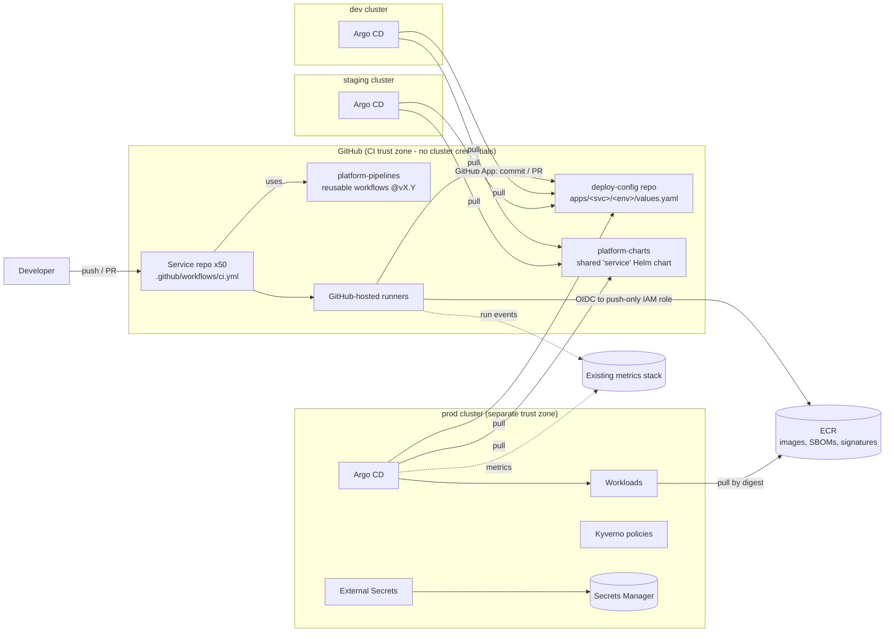

# CI/CD Platform for 50 Microservices: Architecture and Build Sequence

> **Before you read:** The workspace has no existing code or config (`README.md` says it is intentionally empty), so I couldn't check what you run today. The plan rests on stated defaults: GitHub, AWS, Kubernetes, 50 services in separate repos, existing ad-hoc pipelines, a platform team of 4–5, and SOC 2-style compliance. They are listed in §5. Five answers would change the plan the most; they're at the end, each with the default I used. The sequencing (§12–13) holds up well even if the defaults are wrong. The tool choices in §10 are what would change.

---

## 1. Summary

- **What:** A shared CI/CD platform: a standard path from commit to production that all 50 microservices can use. Platform engineers build it and product teams use it. It replaces today's mix of pipelines.
- **Shape:** Each service repo has a short config file that calls **versioned shared pipeline templates** (`platform-pipelines`). These templates build, test, scan, sign, and push one image per commit. Deploys use **GitOps**: CI records the image digest (the image's unique content hash) in a `deploy-config` repo. Argo CD, running in each cluster, pulls changes from that repo and applies them. CI never holds credentials for the clusters.
- **Key decisions:**
  1. GitHub Actions reusable workflows, not a custom-built orchestrator.
  2. A pull-based GitOps deploy with Argo CD, one instance per cluster, not CI pushing to clusters.
  3. Build once and promote the same signed image digest through dev, staging, and prod.
  4. Template versions are pinned in each repo and upgraded by automated PRs, so one bad template change can't break all 50 services.
  5. GitHub-hosted runners to start, with self-hosted runners only if a spike shows we need them.
- **The real critical path is migration throughput, not platform features.** Building the platform takes roughly 10 weeks. Moving 50 services onto it takes 5–7 months more and depends on product teams having time.
- **Milestone 1 (about 4–6 weeks):** One real service goes from commit to production through the new path, with a timed rollback drill. It also includes a full inventory of the 50 services and four spikes (time-boxed experiments): rollback with database migrations, template versioning, runner choice, and secrets.
- **Top risks:**
  - A long tail of special-case pipelines with undocumented behaviour.
  - Product teams not having time for migration.
  - One template change breaking many services at once.
  - The CI system becoming the easiest route to attack production.

## 2. Context and Goals

- **Problem (assumed):** 50 services built and deployed by a mix of Jenkins jobs, per-repo scripts, and some manual steps. Each team maintains its own pipeline. Security controls (scanning, approvals, audit trail) are inconsistent. Rollback depends on who is on call. Lead time and failure rates aren't measured.
- **Goals:**
  - Every service ships through one supported path.
  - Every production change can be traced to a reviewed commit and a signed image.
  - Rollback is a single, well-practised action.
  - Teams onboard themselves.
- **Non-goals (for this plan):**
  - Per-PR preview environments.
  - An internal developer portal (e.g. Backstage).
  - Multi-region deployment.
  - Monorepo build-graph tooling.
  - Replacing service teams' own test suites.
  - Infrastructure provisioning for services (databases, queues).
- **Success measures:**
  - At least 48 of 50 services in production on the platform, and legacy CI shut down, within about 9 months.
  - Standard service onboarding takes 2 engineer-days or less from the service team.
  - DORA metrics (deploy frequency, lead time, change failure rate, time to restore) are measured for 100% of services from M3 onward.
  - Median lead time from commit to production is under 1 day.
  - Production rollback takes under 10 minutes.

## 3. Drivers, Requirements, and Constraints

**Ranked quality attributes** (all targets are assumptions until confirmed):

| # | Attribute | Measurable target | Why it ranks here |
|---|---|---|---|
| 1 | Production change safety | 100% of prod changes come from a reviewed git commit with a signed image digest. Rollback takes under 10 minutes. CI has no long-lived cloud keys. | A shared platform also concentrates risk: one flaw affects 50 services. We'll accept slower pipelines (by minutes) to get this. |
| 2 | Migration throughput / adoption | 50 services migrated in ≤ 9 months. A standard service onboards in ≤ 2 engineer-days. | The platform delivers nothing until services are on it. Running two systems side by side doubles operating cost. |
| 3 | Small impact for platform changes | No more than 1 platform-caused breakage per month that hits more than 3 services. | Templates are shared code running in 50 places. |
| 4 | Developer feedback speed | PR checks p95 under 10 minutes. Merge to dev p95 under 20 minutes. | Slow pipelines get bypassed, which undermines #1 and #2. |
| 5 | Operability and cost | Run by the platform team without 24/7 on-call for the platform itself. Platform run cost of about $3–8k/month, excluding clusters. | Small team. Managed and hosted options are preferred. |

**Key functional requirements:**
- One pipeline template for each language stack.
- Image build, test, vulnerability scan, SBOM (software bill of materials, a list of what's inside the image), and signing.
- Promotion from dev to staging to prod with gates.
- Hooks for database migrations.
- Standard Kubernetes packaging (deployment settings).
- Secret injection at runtime.
- Canary rollout for tier-1 services.
- Pipeline and DORA metrics.

**Constraints (assumed):**
- GitHub (Cloud or Enterprise), AWS, and existing EKS clusters for dev, staging, and prod.
- 3–4 language stacks.
- Platform team of 4–5 who know Kubernetes and Terraform but are new to Argo CD.
- About 10–12 product teams own the services.

**Hard parts:**

| Hard part | Why it's hard |
|---|---|
| H1. The long tail of special-case services | Legacy jobs quietly do things like running migrations, warming caches, or tagging tickets. The last 10 services will take as long as the first 40. |
| H2. Rollback with database migrations | Git-revert rollback is only safe if schema changes work with the previous release. That's a convention the platform can't enforce alone. |
| H3. Template versioning across 50 repos | Fixed version pins mean upgrades need constant PRs. Floating versions mean one bad change breaks everything. |
| H4. CI as a route to production | A compromised third-party action or a fork PR on a privileged runner could reach the registry or prod. |
| H5. Product-team capacity | Migration work competes with feature work. Without agreed time from product teams, migration waves stall. |

## 4. Current State

Nothing was available to inspect; the workspace is empty. Assumed:
- About 50 service repos on GitHub.
- A mix of Jenkins and GitHub Actions pipelines.
- Helm or raw manifests applied by CI using cluster credentials.
- Secrets in a mix of Jenkins credentials, CI variables, and AWS Secrets Manager.
- Some services run their database migrations inside deploy scripts.

**The M1 inventory (T2) replaces these assumptions with facts.** Treat any section that relies on them as provisional until T2 is done.

## 5. Assumptions and Open Questions

| Assumption | Impact if wrong | How and when it's checked |
|---|---|---|
| A1. Code is on GitHub | GitLab swaps in CI/CD Components and GitLab runners. The structure stays; the tooling changes. | Answer to Q1, before T3 |
| A2. All services run on Kubernetes (EKS) | VMs/ECS/Lambda break the GitOps/Argo CD design and would need a push-deploy path for those services. | T2 inventory, week 1 |
| A3. One repo per service | A monorepo needs change-detection logic (Nx/Bazel/path filters), and the "template per repo" model changes. | Q3, before T7 |
| A4. Compliance accepts an approved PR as the change record (no manual change board) | If a change board is required, prod promotion needs a step that creates a change ticket, plus checks that the author and approver are different people. | Q4 / T1 security review, week 2 |
| A5. Platform team of 4–5, plus 1–3 days per service from product teams | All timelines scale with this. | Q5, week 1 |
| A6. GitHub-hosted runners can reach everything builds need | Self-hosted runners (Actions Runner Controller, ARC) move into M2, adding about 2–3 weeks. | Spike S3, week 2–3 |
| A7. There are separate dev, staging, and prod clusters | Argo CD topology and promotion layout change. | T2, week 1 |
| A8. About 10 services are tier-1 (critical, customer-facing) | Changes the size of Wave 2 and how much canary work is needed. | T2, week 1 |

Open questions with owners, defaults, and deadlines are in the **closing section**.

## 6. Architecture Overview



**How it fits together:**
1. A service repo has a roughly 20-line `ci.yml` that calls `platform-pipelines` workflows pinned to a version.
2. The build produces one signed image digest.
3. The promote workflow writes that digest into `deploy-config` for the target environment.
4. Each cluster's Argo CD notices the change and syncs the shared `service` chart with the service's values.
5. Kyverno checks signatures when pods are admitted.
6. External Secrets brings in runtime secrets. Secrets never pass through CI.

**Trust boundaries:**
- CI can push images and write to `deploy-config`, but it can't reach clusters.
- The prod paths in `deploy-config` are protected by CODEOWNERS and required checks.

| Component | Responsibility | Owns data | Interfaces | Technology | Key dependencies |
|---|---|---|---|---|---|
| `platform-pipelines` | Shared build/test/scan/sign/push and promote logic | Template code, release tags | `workflow_call` inputs and outputs (semver) | GitHub Actions reusable workflows and composite actions | GitHub, ECR |
| Service `ci.yml` (×50) | Per-service config: stack, test command, which environments | None beyond config | Calls templates | YAML | `platform-pipelines` |
| `platform-charts/service` | Standard K8s packaging: probes, resources, HPA, PDB, labels, optional migration Job | Chart versions | Helm values schema (semver) | Helm 3 + `values.schema.json` | — |
| `deploy-config` | **System of record for desired state** in each environment | Digest and values per service and environment | Git commits/PRs, validation checks | Git + Argo CD ApplicationSet | GitHub |
| Argo CD (one per cluster) | Applies desired state, detects drift, reports health | Sync status (can be rebuilt from git) | Git pull, UI/API, Prometheus metrics | Argo CD (HA in prod) | `deploy-config`, ECR |
| ECR | Stores artifacts | Images, SBOMs, signatures | OCI registry | AWS ECR, immutable tags | AWS IAM |
| Kyverno | Admission policy: signed images only, required labels/limits | Policies (in git) | K8s admission webhook | Kyverno | ECR (signature lookup) |
| External Secrets Operator | Runtime secret sync | None (Secrets Manager is the source) | `ExternalSecret` CRD | ESO + AWS Secrets Manager | IAM roles for service accounts |
| `platform-infra` | IAM/OIDC, ECR repos, Argo CD install, runner config | Terraform state (S3 + DynamoDB lock) | Terraform PRs | Terraform | AWS, GitHub provider |
| Pipeline metrics exporter | Pipeline duration and outcome, DORA | Time-series data | GitHub webhooks/API to metrics store | Small scheduled job, or off-the-shelf exporter | Existing Prometheus/Grafana (assumed) |

## 7. Component Details

**`platform-pipelines`** (the hard parts here are H3 and H4)
- **Releases:** semver tags (`v1.4.2`) plus a moving major tag (`v1`). Service repos pin a full version. Renovate opens upgrade PRs, so the service's own CI tests each template upgrade before it's merged. That limits a bad change to repos that merge it.
- **Contents:** `build.yml`, `promote.yml`, and composite actions `setup-<lang>`, `scan`, `sign`.
- **Not its job:** running service-specific integration suites. It calls the service's `make test` / `make integration`.
- **Escape hatch:** a `pre-build`/`post-test` hook input. If a service needs more than that, it's a signal to add a template feature, not to fork.
- **Load:** about 50 repos × 10–20 runs a day.
- **Failure handling:** a template bug shows up as a failed Renovate PR in a canary repo, and the release is yanked (tag deleted, patch released).

**`deploy-config`**
- **Layout:** `apps/<svc>/{dev,staging,prod}/values.yaml` (containing `image.digest` and environment overrides), plus `apps/<svc>/base.yaml`.
- **Argo applications:** an ApplicationSet in each cluster creates one Argo Application per `apps/*/<env>`.
- **Write rules:**
  - Dev: the promote workflow commits directly.
  - Staging: PR with auto-merge once checks pass.
  - Prod: PR needing approval from the service's CODEOWNERS.
- **Required checks:**
  - `helm template` + kubeconform.
  - Kyverno CLI policy test.
  - `cosign verify` that the digest was signed by the `platform-pipelines` workflow identity.
  - **Promotion-order check:** a prod digest must currently be healthy in staging.
- **Failure:** if GitHub is down, nothing new deploys, but running workloads aren't affected (Argo keeps the last applied state). The break-glass procedure is in §9 Flow 4.

**Argo CD:** one instance per cluster, so prod credentials never leave prod.
- Auto-sync with self-heal in every environment, so git is the only way to make changes.
- Manual UI sync is restricted to the on-call role.
- Prod runs in HA mode (redis-ha, 2+ repo-servers).
- The instance holds no state that can't be rebuilt from git, so recovery is "reinstall from `platform-infra` and resync".

**`platform-charts/service`:** one chart covering about 90% of services.
- Optional `migration` Job, run as an Argo PreSync hook (it runs before the new version rolls out).
- From M4: an optional `Rollout` object (Argo Rollouts) for canaries.
- Values schema is checked by `values.schema.json`. A major version bump is needed for any breaking change to values.
- Services that don't fit can supply raw manifests (`apps/<svc>/manifests/`), tracked as a known exception.

**ECR / Kyverno / ESO:** routine.
- ECR: immutable tags, scan on push, lifecycle rules (§8).
- Kyverno: `verifyImages` runs in **audit** mode until M5 and switches to **enforce** once all services are signed.

**Runners:** GitHub-hosted, with larger runners for heavy builds. Docker layer cache goes to ECR with `cache-to type=registry`. Fork PRs get read-only tokens and no OIDC role.

## 8. Data Design

| Entity | System of record | Writer | Retention | Notes |
|---|---|---|---|---|
| Pipeline definitions | `platform-pipelines`, service repos | Platform / service teams via PR | Forever (git) | — |
| Desired deploy state | `deploy-config` | `promote.yml` (GitHub App), humans via PR | Forever (git). Git history is the audit trail. | Exactly one writer path per environment (above) |
| Images, SBOMs, signatures | ECR | `build.yml` only (push-only role) | Untagged: 14 days. Non-prod digests: 90 days. **Any digest ever deployed to prod: ≥ 1 year** (assumed; confirm with compliance) | Immutable. Referenced by digest, never by `latest`. |
| Live sync and health | Argo CD (derived) | Argo CD | Rebuilt from git | Not backed up on purpose |
| Pipeline run history | GitHub | GitHub | 90 days in GitHub. Summaries exported to the metrics store for 13 months. | Source for DORA |
| Runtime secrets | AWS Secrets Manager | Service teams / Terraform | Per secret policy | Never in git, images, or CI logs |
| Terraform state | S3 + DynamoDB lock | `platform-infra` pipeline | Versioned bucket | Split by env and component to limit impact |

- **Consistency:** the only invariant that matters is that prod only runs digests that went through staging. The `deploy-config` required check enforces it at write time, not by a later reconciliation.
- **Backups:**
  - Git repos are mirrored nightly to an S3 bucket in the platform's AWS account (protects against GitHub account loss).
  - ECR is durable. Cross-region replication is deferred (§17).
- **Schema evolution:** the chart values schema follows semver. Breaking chart changes ship as a new major version, and services move over through Renovate PRs to `deploy-config`.

## 9. Key Flows

**Flow 1: Commit to production (happy path)**
1. A PR on `orders-svc` runs `build.yml@v1.4.2`: lint, unit tests, build, and Trivy scan (fails on critical vulnerabilities that have a fix). No push for PRs from forks.
2. On merge to `main`, `build.yml` builds, generates an SBOM with syft, signs keyless with cosign (via GitHub OIDC), and pushes `ecr/orders-svc@sha256:abc…`.
3. `promote.yml env=dev` commits the digest to `apps/orders-svc/dev/values.yaml`. Argo CD in dev syncs. The workflow waits until Argo reports `Healthy` and runs the service's smoke target. Elapsed time: 20 minutes or less.
4. `promote.yml env=staging` opens a PR. Checks pass, it auto-merges, Argo syncs, and the smoke tests pass.
5. `promote.yml env=prod` opens a PR. The checks verify the signature and that the digest is healthy in staging. A service CODEOWNER approves, and the PR merges.
6. If the chart has a `migration` Job, it runs as a PreSync hook. Then the rollout proceeds. Kyverno checks the signature when pods are admitted.

**Flow 2: Bad release in production (rollback)**
1. Error rates climb after the prod sync. On-call runs `promote.yml env=prod digest=<previous>`, or reverts the prod commit in `deploy-config`. Either is a single PR with an expedited approval rule for on-call.
2. Argo syncs the previous digest. Target: under 10 minutes from decision to healthy.
3. **This is safe only if** the migration was additive (expand/contract: add the new schema first, remove the old one in a later release), so the previous release still works with the new schema. Spike S1 tests whether that holds. If it doesn't, the plan adds a per-service "migration compatibility" gate (§13, S1).

**Flow 3: A bad template release (impact failure path)**
1. The platform team tags `v1.5.0` with a bug in the cache step. Fixture repos pass, because the bug only shows up with a Gradle feature that the fixtures don't use.
2. Renovate opens upgrade PRs. Canary repos (5 volunteer services) get them first. Other repos get them only after 48 hours, using Renovate's `minimumReleaseAge` setting.
3. A canary repo's upgrade PR fails CI and can't merge. The platform alert ("template upgrade PR failure rate > 20%") fires.
4. The `v1.5.0` tag is withdrawn, `v1.5.1` is released, and a fixture covering the Gradle case is added. Result: no production impact, one canary team's PR is blocked for a few hours, and the other 45 services never see `v1.5.0`.

**Flow 4: GitHub outage during an incident**
1. Argo CD can't fetch, but current workloads keep running.
2. If an urgent prod fix is needed, on-call uses the break-glass role: an audited IAM role with time-limited access to Argo CD in prod.
3. They set the Application's target revision, or patch the image to a **digest already in ECR**, and record the action. Argo self-heal is paused for that app only.
4. Afterwards, git is updated to match, and self-heal is turned back on.
5. The procedure is rehearsed once in M3.

## 10. Key Decisions

| Decision | Options considered | Rationale (against drivers) | Reversibility | Revisit if |
|---|---|---|---|---|
| D1. CI engine: GitHub Actions reusable workflows | (a) GHA; (b) keep Jenkins with shared libraries; (c) Tekton or a custom orchestrator | Code is already on GitHub (A1). Native OIDC (#1), no CI servers to run (#5), the PR experience teams already know (#2). Jenkins means running controllers and plugins. Tekton means building a product. | Medium. Templates can be ported; service `ci.yml` files are small. | The org is on GitLab, or GHA limits (e.g. reusable workflow nesting depth) block the template design in S2 |
| D2. Deploy model: GitOps pull with Argo CD, one per cluster | (a) Argo CD per cluster; (b) a central Argo CD managing all clusters; (c) CI runs `helm upgrade` (push) | No cluster credentials in CI (#1). Rollback is a git revert (#1). Drift detection. Per-cluster keeps prod credentials inside prod. The cost of new tooling is accepted and budgeted at 1–2 weeks of learning in M1. | **Hard.** It sets the trust model and what every team does day to day. | Services aren't on Kubernetes (A2), or there are more than about 10 clusters (move to a hub-and-spoke model) |
| D3. Build once, promote the digest | (a) One digest everywhere; (b) rebuild per environment | Guarantees prod runs what was tested. Signing becomes meaningful. | Hard to undo culturally, easy technically | Never, realistically |
| D4. Template distribution: pinned semver plus Renovate with staged release | (a) Pinned + Renovate; (b) floating `@v1`; (c) copy-paste starter pipelines | (a) limits impact (#3) while keeping upgrades cheap. (b) breaks 50 services at once. (c) drifts within months. | Easy | S2 shows Renovate noise is unacceptable. Fallback: floating `@v1` for most repos plus a `@canary` channel. |
| D5. Packaging: shared `service` Helm chart plus a raw-manifest exception path | (a) Shared chart; (b) a Kustomize base per service; (c) every team writes its own chart | Standard probes, limits, and labels for everyone (#1, #2). Less to review. | Medium | More than 20% of services need the exception path |
| D6. Runners: GitHub-hosted first | (a) Hosted (larger runners where needed); (b) self-hosted ephemeral ARC on a build cluster | Nothing to operate (#5). The pull-based deploy means CI doesn't need private network access. Roughly $2–6k/month (see §11). | Easy | S3 shows p95 build over 15 minutes with caching, a need for private network access, or cost over about $8k/month |
| D7. Prod approval: CODEOWNER approval on the `deploy-config` PR | (a) Git PR approval as the change record; (b) an extra change-board ticket step | Auditable, fast (#4), lives where engineers already work | Easy | Compliance requires a change board or stricter separation of duties (Q4). Then add a ticket-creating check to the prod PR. |
| D8. Secrets: External Secrets Operator from AWS Secrets Manager | (a) ESO; (b) secrets injected by CI; (c) Sealed Secrets in git | Secrets stay out of CI entirely (#1) and can be rotated | Medium | The org already mandates Vault (ESO supports Vault, so it's a small change) |

## 11. Cross-Cutting Concerns

**Security** (H4)
- **Built in M1:**
  - GitHub OIDC to AWS with a push-only role, restricted by repo and by `ref:refs/heads/main`.
  - No static keys anywhere.
  - A GitHub App with write access to `deploy-config` only.
  - Third-party actions pinned by SHA, enforced by a lint check in `platform-pipelines` CI.
  - Fork PRs get read-only tokens and no OIDC.
  - Keyless signing with cosign.
  - Secret scanning and push protection turned on.
- **M3:**
  - Kyverno `verifyImages` in audit mode.
  - Branch protection and CODEOWNERS on every `deploy-config/apps/*/prod`.
  - GitHub audit log streamed to the security log store.
- **M5:** Kyverno switched to enforce mode, and `kubectl` write access to prod removed from humans except the break-glass role.

| Threat | Mitigation |
|---|---|
| A compromised third-party action steals tokens | SHA pinning, a list of approved actions, short-lived OIDC tokens with narrow scope |
| A malicious PR runs on privileged CI | Fork PRs get no secrets or OIDC. `pull_request_target` is banned in templates. |
| An unreviewed image reaches prod | Only the promote path writes to `deploy-config`. Prod requires CODEOWNER approval and a signature check at both PR time and admission. |
| Leaked long-lived cloud keys | None exist. Credential reports are checked in M1 exit criteria. |
| A vulnerable dependency ships | Trivy gate on critical vulnerabilities that have a fix. SBOM stored so later CVE lookups are possible. |

**Reliability**
- Platform target: 99.5% of business hours for the "merge to dev" path, measured by the synthetic `platform-canary` service (§14).
- Running workloads never depend on CI being up.
- Promote steps are idempotent: writing the same digest twice is a no-op commit, which is skipped.
- `promote.yml` waits for Argo health with a 15-minute timeout, then fails and alerts. It never retries a deploy blindly.
- Argo CD runs in HA mode in prod (M3).

**Observability**
- **Built in M1:** pipeline run duration and outcome per workflow and stage, exported to the existing metrics stack (T11). Argo CD Prometheus metrics.
- **M3:**
  - DORA dashboard per service and team.
  - Alerts on symptoms, each linked to a runbook in `platform-pipelines/docs/runbooks/`:
    - `platform-canary` hasn't reached dev in 60 minutes.
    - Template-upgrade PR failure rate over 20%.
    - An Argo app in prod `Degraded` or `OutOfSync` for more than 15 minutes.
    - Pipeline queue time p95 over 5 minutes.

**Performance and capacity**
- **Expected load:** about 750–1,000 workflow runs a day at peak, with bursts when a Renovate wave lands.
- **Likely bottlenecks:** GitHub concurrent-job limits, ECR API rate limits, and cache misses.
- **Load test (before M3 wave 1):** trigger 50 builds at the same time and check queue time and ECR throttling.

**Cost** (rough, assumed)
- Runner minutes: about 150–250k a month. At GitHub's current list prices that's roughly $1.5–6k/month, depending on how many jobs use larger runners. **Check against current GitHub pricing before you budget.**
- ECR storage: low hundreds of dollars.
- Argo CD and Kyverno run on existing clusters, so small marginal cost.
- **Controls:**
  - `concurrency` with cancel-in-progress on PRs.
  - Path filters.
  - Registry layer cache.
  - Monthly cost review per repo using GitHub usage reports.
  - Budget alert at $8k (the D6 revisit trigger).

**Operations**
- **The platform team owns:** templates, the chart, Argo CD, Kyverno, `deploy-config` structure, and runner config.
- **Service teams own:** their `ci.yml`, tests, values, migrations, and deploy health.
- **On-call:**
  - Platform on-call during business hours from M3. Out of hours, Argo CD/GitHub issues use the break-glass runbook, with best-effort escalation.
  - Service incidents stay with service on-call.
- **Support:** a `#platform-help` channel plus office hours during migration waves.

**AI-specific concerns:** not applicable. There are no model-driven components.

## 12. Build Sequence

**Team assumption for sizing:** 4–5 platform engineers. Product teams spend 1–3 engineer-days per standard service and 1–2 weeks per special-case service. Ranges are rough guides, not commitments.

```
Weeks:     1    5    10   15   20   25   30   35
M1 Slice   ████
M2 Golden       █████
M3 Wave1            ██████   (+ hardening track in parallel)
M4 Wave2                  ███████ (+ canary for tier-1)
M5 Tail                          ████████ (+ enforce, decommission)
Critical path: access/IAM → M1 slice → template v1 stable (M2) → wave capacity (M3–M5) → legacy CI off
```

| Milestone | Goal / risk cleared | Scope (in / **out**) | Deliverables | Exit criteria | Dependencies | Rough size |
|---|---|---|---|---|---|---|
| **M1: Thin slice to prod** | Proves the whole path (GitOps, OIDC, signing, promotion, rollback) on one real service. Answers H2, H3, H4 and the runner question. Replaces assumptions with the inventory. | In: one pilot service, all three environments, spikes S1–S4. **Out:** canary, Kyverno enforcement, other stacks, DORA dashboards. | `platform-pipelines` v0.x, `service` chart v0.x, `deploy-config`, Argo CD ×3, OIDC/ECR Terraform, inventory, 4 spike write-ups | Pilot deployed to prod through the platform at least 5 times. Rollback timed under 10 minutes in staging and once in prod. No static AWS keys in any pilot CI. Inventory 50/50 confirmed by owners. Spike decisions recorded as ADRs (architecture decision records). | Long-lead access (T1) on day 1 | 4–6 weeks |
| **M2: Golden path v1 + pilots** | Proves the templates work beyond one service: each stack, one service with a DB, and the worst-looking special case from the inventory. Makes onboarding self-service. | In: 4 more pilot services (one per remaining stack, plus one special case), template `v1.0.0`, Renovate staged release, fixture test harness, onboarding guide and `ci.yml` scaffold. ARC only if S3 calls for it. **Out:** tier-1 services. | `v1.0.0` templates, `service` chart `v1.0.0`, `docs/onboarding.md`, fixture repos, parity checklist | 5 services in prod on the platform. A product team onboards a service from the guide in 2 days or less without platform help (observed once). A template release reaches canary repos, then the rest, via Renovate. | M1 | 5–7 weeks (+2–3 if ARC is needed) |
| **M3: Wave 1 (≈12 tier-3/tier-2 services) + hardening track** | Tests migration throughput with low-risk services. Makes the platform safe enough for tier-1. | Wave: 12 services, mostly migrated by their own teams with platform pairing. Hardening: Argo CD HA, Kyverno audit mode, DORA dashboard, alerts and runbooks, break-glass drill, 50-concurrent-build load test, platform business-hours on-call. **Out:** tier-1 services. | 17 services on the platform, dashboards, runbooks, drill report | 17/50 services. Per-service migration median of 3 engineer-days or less. Break-glass drill done. Every alert has a runbook. Load test shows p95 queue under 5 minutes. | M2. Wave slots agreed with product managers (T1) | 5–7 weeks |
| **M4: Wave 2 (≈18 services incl. tier-1) + progressive delivery** | Moves critical services without them losing any safety capability they have today. | Argo Rollouts canary with metric analysis in the chart. Tier-1 migrations gated on the parity checklist. **Out:** canary for non-tier-1. | Chart with `rollout.enabled`, 35 services on the platform | 35/50. Every tier-1 service on the platform has had an automatic canary abort in staging (fault injected). Change failure rate on the platform is no worse than before migration for migrated services. | M3 hardening complete | 6–8 weeks |
| **M5: Long tail + enforcement + decommission** | Removes legacy CI (H1). Turns safety into enforced rules. | ≈15 special-case services, the raw-manifest exception path, Kyverno enforce, removal of human prod `kubectl` write access, Jenkins shutdown. **Out:** new features. | 50/50 (or documented exceptions), legacy CI archived | At least 48/50 on the platform. Exceptions have owners and dates. Kyverno enforcing with no unplanned blocks for 2 weeks. Jenkins read-only, then shut down. | M4 | 6–10 weeks |

**Parallel work:**
- The inventory (T2) runs alongside M1 platform build.
- The hardening track runs alongside Wave 1 migrations.
- Fixture harness and onboarding docs run alongside the M2 pilots.

**What sets the pace:**
- Weeks 1–10: the platform team's capacity.
- After week 10: product-team migration capacity. That's why the wave slots have to be booked in week 1 (T1).

**Gate before any tier-1 service moves:** the parity checklist. A service may not lose any capability its legacy pipeline has today (blue/green, manual approval, specific notifications). Inventory columns record these.

## 13. First Milestone Task Breakdown

**Repos created in M1:**
- `platform-pipelines`: workflows, composite actions, `docs/`
- `platform-charts`
- `deploy-config`
- `platform-infra`: Terraform

**Pilot selection rule:**
- Uses the most common stack in the inventory.
- Tier-2 (not tier-1).
- Owns a database (so S1 is tested for real).
- Its owning team volunteers.

| # | Task | Where | Done when | Week / parallelism |
|---|---|---|---|---|
| T1 | **Request long-lead items:** GitHub org admin for creating a GitHub App and setting OIDC claims; AWS IAM change approval; prod cluster-owner approval for installing Argo CD; security review of this design (OIDC, signing, D7); budget for runner minutes; **wave slots for M3–M5 agreed with product managers**; compliance sign-off on A4 | Tickets / email; tracked in `platform-pipelines/docs/m1-tracker.md` | Each item has an owner and a due date. Security review is scheduled within 2 weeks. | Day 1 |
| T2 | **Build the service inventory** with columns: service, owner team, tier, stack + build tool, current CI, deploy target (confirms A2), how config and secrets are delivered today, DB and how migrations run, special legacy steps, rollout safety features in use (feeds the parity checklist), test duration | `platform-pipelines/docs/inventory.csv` | 50/50 rows filled in and confirmed by each owner team. Pilot and M2 pilots selected. A2/A7/A8 confirmed or flagged. | Weeks 1–2, parallel |
| T3 | **Terraform GitHub OIDC trust and ECR:** OIDC provider; role `ci-ecr-push` with trust restricted to `repo:<org>/<pilot>:ref:refs/heads/main`; ECR repo with immutable tags, scan on push, and the lifecycle rules in §8; S3/DynamoDB state split by `env/component` | `platform-infra/aws/ci-identity/`, `platform-infra/aws/ecr/` | A workflow in the pilot repo pushes an image with no stored secrets. The same workflow run from a branch or another repo is **denied** (both checked in a test run). `terraform plan` is clean in CI. | Weeks 1–2, parallel with T4/T5 |
| T4 | **Install Argo CD** with Helm via Terraform in dev and staging (prod in week 3 after T1 approval). SSO for the UI. Manual sync restricted to an `oncall` role. Repo credentials are read-only deploy keys. | `platform-infra/k8s/argocd/{dev,staging,prod}/` | Each instance is reachable through SSO, shows `Healthy` for an empty ApplicationSet, and its Prometheus metrics are being collected. | Weeks 1–3 |
| T5 | **Create `service` Helm chart v0.1:** Deployment, Service, HPA, PDB, standard labels, readiness/liveness probes, required resource limits, `values.schema.json`, optional `migration` Job as Argo PreSync hook | `platform-charts/charts/service/` | `helm lint`, kubeconform, helm-unittest, and `ct install` on kind all pass in the repo's CI. A values file missing limits fails schema validation. | Weeks 1–2, parallel |
| T6 | **Create `deploy-config` layout and ApplicationSet:** `apps/<svc>/{base.yaml,dev,staging,prod}/values.yaml`, one ApplicationSet per cluster, CODEOWNERS per `apps/<svc>/`. Required checks: helm template + kubeconform, `cosign verify` of the digest, prod promotion-order check (digest is healthy in staging, queried via the staging Argo CD read-only API token) | `deploy-config/`, `deploy-config/.github/workflows/validate.yml` | The pilot app appears in Argo dev. A PR with an unsigned digest fails. A prod PR with a digest not yet in staging fails. | Weeks 2–3 (after T4, T5) |
| T7 | **Write `build.yml` v0.1:** checkout, `setup-<lang>` for the pilot's stack, `make test`, buildx with ECR registry cache, Trivy (fail on critical with fix), syft SBOM, cosign keyless sign + attest SBOM, push by digest, output `digest` | `platform-pipelines/.github/workflows/build.yml`, `actions/` | Called from the pilot, it produces a signed digest. `cosign verify --certificate-identity` against `platform-pipelines` passes. A planted critical CVE fails the job. | Weeks 2–3 (after T3) |
| T8 | **Write `promote.yml` v0.1:** inputs `env`, `digest`. Dev: direct commit through the GitHub App. Staging: PR with auto-merge. Prod: PR that needs a CODEOWNER. Then wait for Argo `Healthy`, with a 15-minute timeout, then run the service's `make smoke`. Skips if the digest is already set (idempotent). | `platform-pipelines/.github/workflows/promote.yml` | Running it twice with the same digest makes no second commit. A timeout fails the run with a link to the Argo app. | Week 3 (after T6, T7) |
| T9 | **Wire the pilot:** `.github/workflows/ci.yml` calls `build.yml@v0.1.x` and `promote.yml` (dev automatic on `main`). The legacy pipeline keeps deploying prod for now; its dev deploy is turned off. | Pilot repo | Merge to `main` reaches dev with no human action in 20 minutes or less, 3 times in a row | Week 3 |
| T10 | **Add a deploy health gate:** promotion to staging is blocked unless dev is healthy and smoke tests passed for that digest | `promote.yml`, `deploy-config` checks | A deliberately broken image (failing readiness) marks the dev deploy failed and the staging promotion is refused | Week 4 |
| T11 | **Export pipeline metrics:** run duration and outcome per workflow and job, plus queue time, sent to the existing metrics stack, with a starter Grafana panel | `platform-pipelines/tools/metrics-exporter/` (scheduled workflow using the GitHub API) | The panel shows pilot runs from the last 7 days with p50/p95 duration | Week 4, parallel |
| T12 | **Cut the pilot over in prod:** prod promotion through `deploy-config` PR. Legacy prod job disabled (not deleted) and kept as a fallback for 2 weeks. Timed rollback rehearsal. | Pilot repo, `deploy-config/apps/<pilot>/prod/` | 5 prod deploys through the platform. One prod rollback to a previous good digest in under 10 minutes (timed and logged). Legacy job disabled. | Weeks 4–6 |
| T13 | **Close M1:** ADRs for D1–D8 updated with spike results, plan revised (especially M2 scope), demo to stakeholders | `platform-pipelines/docs/adr/` | ADRs merged. M2 task list drafted. Demo held. | End of M1 |

**Spikes** (time-boxed; each ends with a short write-up in `platform-pipelines/docs/spikes/`):

| # | Question | Build | Time box | Result that changes the plan |
|---|---|---|---|---|
| S1 (H2) | Is git-revert rollback safe with this pilot's DB migrations, and does the Argo PreSync Job work for running them? | Run an expand-style migration via the chart's `migration` Job in staging. Deploy, then revert to the previous digest. Run the old app against the new schema. Also check the inventory for services with destructive migrations. | 3 days, week 3–4 | Revert sync over 10 minutes, or more than 25% of DB-owning services can't easily follow expand/contract. Then add a template stage that checks migration compatibility, plus a per-service "forward-fix only" policy. Adds about 2 weeks to M2. |
| S2 (H3) | Can a template change reach 50 repos safely and cheaply? | Tag `v0.1.0` and `v0.2.0`. Configure Renovate (`minimumReleaseAge`, canary group) in 3 throwaway repos. Ship one deliberately broken release. | 2 days, week 2–3 | The broken release reaches non-canary repos, or the PR noise is judged unacceptable by 2 pilot teams. Then switch to floating `@v1` plus a `@canary` channel and rely more on the fixture harness. |
| S3 (D6) | Do GitHub-hosted runners meet the build-time and network needs of the 3 heaviest services in the inventory? | Run their builds via `build.yml` on standard and larger hosted runners, with registry cache. Note any private network dependencies. | 3 days, week 2–3 | p95 over 15 minutes after caching, or private network access needed. Then ARC on a build cluster goes into M2 (+2–3 weeks), and cost is re-estimated. |
| S4 (D8) | Can the pilot's secrets and config move to ESO without app changes? | Move the pilot's secrets to Secrets Manager plus an `ExternalSecret` in dev/staging. Check rotation. | 2 days, week 3 | More than 30% of services (by inventory) read secrets in ways ESO can't serve, such as files baked in at build time. Then add a migration-assist task per wave and budget extra product-team time. |

**Order:**
1. T1, T2, T3, T4, T5 start in week 1.
2. T6 and T7 follow, then T8 and T9.
3. S2 and S3 run in week 2–3, alongside T6/T7.
4. S1 and S4 come after the pilot reaches dev.
5. T10 and T11 in week 4, then T12, then T13.

**Stubs allowed in M1, listed so they aren't forgotten:**
- One stack only.
- Smoke test is the pilot's existing health endpoint.
- No Kyverno.
- No HA Argo CD in prod (single replica, accepted for one tier-2 service).

## 14. Testing and Validation Strategy

| Risk | Test | Runs | Blocks |
|---|---|---|---|
| Template regressions (H3) | **Fixture harness:** one minimal service per stack in `platform-pipelines/fixtures/`, run against the PR's version of each workflow | Every `platform-pipelines` PR | Template release |
| Chart regressions | helm-unittest snapshots, kubeconform, `ct install` on kind | Every `platform-charts` PR | Chart release |
| Bad desired state | `deploy-config/validate.yml` (render, schema, signature, promotion order) | Every `deploy-config` PR | Merge, and therefore deploy |
| Policy mistakes | `kyverno test` with allowed and denied cases | Policy PRs | Policy release |
| End-to-end platform health | **`platform-canary`:** a hello-world service that builds and deploys to dev every hour and to staging and prod daily | Scheduled | Alert (not a gate) |
| Capacity | 50 concurrent builds | Before M3 wave 1, then before each wave | Wave start |
| Rollback target | Timed rollback drill | M1 (T12), then quarterly | — |
| Service correctness | The service team's own unit, integration, and smoke tests, called by the templates | Every run | Promotion |

**How the §3 targets are verified:**
- Pipeline p95 durations: from T11 metrics.
- Rollback time: from drill logs.
- Impact: from incidents tagged `platform-caused`.
- Onboarding effort: self-reported per migration in the wave tracker.

## 15. Rollout, Migration, and Rollback

**Per-service migration playbook** (in `docs/onboarding.md` from M2):
1. Add `ci.yml` running **alongside** the legacy pipeline, build-only. Compare test results and image contents for one week.
2. Switch dev deploys to the platform.
3. Switch staging.
4. Check the parity checklist, then switch prod. Disable the legacy prod job.
5. After 2 weeks with no fallback use, delete the legacy job.

**Rollback at each step:** re-enable the legacy job. Images stay compatible because the image registry doesn't change.

**Wave order:**
- Wave 1: tier-3 and tier-2 services that are like the pilots.
- Wave 2: the rest of tier-2 plus tier-1 (after the canary work).
- Wave 3: special cases.

Each wave runs as a 1–2 week sprint per team, with platform pairing on that team's first service.

**Point of no return:** Jenkins/legacy CI shutdown in M5. Before that, legacy config is archived read-only for 90 days, so a single service could still be restored if needed.

## 16. Risks and Mitigations

| Risk | Likelihood | Impact | Mitigation | Early warning sign | Owner |
|---|---|---|---|---|---|
| The special-case tail takes far longer than planned (H1) | High | High | Inventory in week 1. Include the worst special case in the M2 pilots. Raw-manifest exception path. M5 sized as a range. | Inventory shows more than 15 services with unusual legacy steps | Platform lead |
| Product teams don't have time for migration (H5) | High | High | Book wave slots in week 1 (T1). Keep onboarding to 2 days or less. Pair on the first service. Report progress to engineering leadership. | Wave 1 teams postponing. Per-service median over 5 days. | Eng director |
| A template change breaks many services (H3) | Medium | High | Pinned versions, Renovate staging, canary repos, fixture harness, `platform-caused` incident tag | Upgrade-PR failure rate alert firing | Platform team |
| CI compromise reaches prod (H4) | Low | Very high | OIDC, SHA-pinned actions, no cluster credentials in CI, signature checks at PR and admission | Unknown actions in the audit log. Unsigned image admission events (audit mode). | Security + platform |
| Rollback unsafe because of migrations (H2) | Medium | High | S1. Expand/contract policy. Migration Job hook. | S1 result. Rollback drill failures. | Service teams, platform advises |
| GitHub outage blocks urgent fixes | Low | Medium | Break-glass runbook and drill (M3). Workloads run independently of CI. | — | Platform on-call |
| Argo CD is new to the team | Medium | Medium | Learning time budgeted in M1. Start with a single replica in dev/staging. HA in M3. | Sync issues taking more than 1 day to diagnose | Platform lead |
| Compliance rejects PR approval as the change record (A4) | Medium | Medium | Ask in week 1 (T1). D7 fallback (ticket check) designed to plug in. | Security review comments | Platform lead + compliance |
| Runner cost above budget | Low–Medium | Low | Caching, concurrency cancel, budget alert, D6 revisit | Monthly bill trend | Platform lead |

## 17. Deferred Work and Future Evolution

| Deferred item | Trigger to build it |
|---|---|
| Per-PR preview environments | Repeated staging contention or teams asking for them after M4 |
| Internal developer portal (Backstage) | More than 80 services, or onboarding stays over 2 days because people can't find things |
| Canary for non-tier-1 services | Change failure rate over 10% on tier-2 |
| Self-hosted runners (ARC) | S3 result or the D6 cost trigger |
| Cross-region ECR replication / multi-region | A disaster-recovery requirement for regional failure |
| Contract testing between services | Integration breakages between services found in staging more than twice a month |
| SLSA Level 3 provenance / hermetic builds | Compliance or customer requirement |
| Cost showback per team | Runner cost over $8k/month |

**Shortcuts taken on purpose:**
- M1 runs Argo CD in prod as a single replica. Paid back in M3.
- Kyverno runs in audit mode until M5. Paid back in M5.
- The metrics exporter is a scheduled API poller. Replace it with webhook-driven export if the data is too delayed for DORA.

**Extension points:** template hook inputs, chart major versions, and the per-service raw-manifest path.

## 18. Next Steps

1. **Today:** send the T1 long-lead requests (GitHub App + OIDC admin, IAM approval, prod cluster owner, security review, product-manager wave slots, compliance on A4).
2. **Today:** create the `platform-pipelines`, `platform-charts`, `deploy-config`, and `platform-infra` repos with branch protection, and commit `docs/inventory.csv` with the T2 column headers.
3. **This week:** send the inventory to all owner teams with a 5-day deadline. The platform lead picks the pilot using the selection rule in §13.
4. **This week:** start T3 (OIDC + ECR Terraform) and T5 (service chart) in parallel. Start T4 in dev.
5. **Week 2:** run spikes S2 and S3. Read the results before freezing the M2 scope.

---

## Open questions (the answers that would change the plan most)

| # | Question | Why it matters | Default I used | Needed by |
|---|---|---|---|---|
| Q1 | Where is the code hosted, and what CI exists today (GitHub/GitLab; Jenkins, Actions, other)? | Sets D1 and the tooling in every M1 task | GitHub; mix of Jenkins and Actions | Before T3 (week 1) |
| Q2 | Do all 50 services run on Kubernetes, and are there separate dev/staging/prod clusters? | GitOps with Argo CD (D2) only fits Kubernetes. Other runtimes need a push-deploy path. | Yes, EKS, 3 clusters | Week 1 (T2 confirms) |
| Q3 | One repo per service, or a monorepo? | A monorepo needs change detection and a different template model | One repo per service | Before T7 (week 2) |
| Q4 | Does compliance require a change board or separation of duties for prod changes? | Changes the prod promotion flow (D7) and the security review | PR approval by CODEOWNER is enough | Week 2 |
| Q5 | Platform team size, and is there a deadline (for example, a Jenkins licence or contract end date)? | Every milestone size and the wave plan scale with this | 4–5 engineers, no hard date, about 9 months target | Week 1 |
