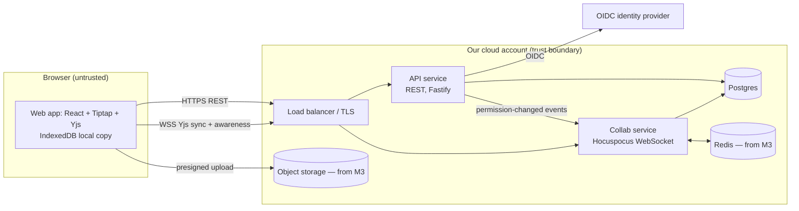

# Architecture and Build Plan: Real-Time Collaborative Document Editor

> **Context note.** The workspace has nothing in it except a README saying it is intentionally empty, so this is a greenfield plan. You asked me to order the build and left the details open, so I went ahead without asking questions first. Every assumption is marked **[A]** and collected in Section 5. Because the request is mostly about sequencing, Sections 12–13 carry the most detail and the rest is kept short.

---

## 1. Summary

- **What:** a web-based rich-text editor like a smaller Google Docs, for teams inside workspaces (B2B, multi-tenant) **[A]**. Several people edit the same document at once and see each other's edits and cursors live.
- **Shape:** a TypeScript monorepo with two deployable processes. The **API service** (REST) handles accounts, documents and permissions. The **Collab service** (WebSocket) handles live sync. Both use one Postgres database. Redis is added in M3 so more than one Collab instance can run. Clients merge edits with a **CRDT** (a data structure where concurrent edits merge automatically and always end up the same on every copy), so typing never waits on the network.
- **Key decisions:**
  1. Use **Yjs**, an existing CRDT library, rather than building our own merge algorithm or using operational transformation (OT).
  2. Use **Tiptap/ProseMirror** as the editor.
  3. **Self-host Hocuspocus**, an open-source Yjs WebSocket server, rather than paying for a managed collaboration backend.
  4. Store edits in Postgres as an **append-only log of updates with periodic compaction into snapshots**. Clients also keep a local copy, so an edit is lost only if the server and the client fail together.
  5. The API issues **short-lived per-document tokens**, and revocations are pushed to open connections.
- **First milestone (about 3 weeks):** a working slice in staging. Two real users log in, create a document, edit it at the same time, and lose nothing when the Collab server is killed. CI also runs a test that checks all copies converge. Three spikes (short, time-boxed experiments) answer the questions that could change the plan: durable save confirmation, fan-out capacity, and document-schema evolution.
- **Top risks:** edits lost or copies drifting apart without anyone noticing; one busy document overloading a server; old clients corrupting documents after a schema change; editor edge cases (IME input, paste) eating the schedule.

## 2. Context and Goals

- **Problem:** teams want to write together live, without emailing files around or locking documents. **[A]** No existing tool needs replacing.
- **Goals:** concurrent editing with live cursors; no acknowledged edit ever lost; sharing at owner/editor/viewer level; comments and version history by GA.
- **Non-goals for v1:** native mobile apps; full offline-first editing (short disconnects are handled); suggestion/track-changes mode; spreadsheets or slides; end-to-end encryption; multi-region; Word or Google Docs import; AI features.
- **Success measures:** zero confirmed lost-edit incidents; p95 time for a remote edit to appear under 300 ms; at least 60% of beta workspaces with a weekly co-edited document **[A]**; the team runs on its own product by M2.

## 3. Drivers, Requirements, and Constraints

**Ranked quality attributes**

| # | Attribute | Measurable target | Why it matters |
|---|---|---|---|
| 1 | Data integrity and convergence | 0 lost edits once acknowledged. All copies converge to the same state. Server-side data-loss window ≤ 250 ms, and clients resend anything the server lost | Losing someone's writing destroys trust immediately and permanently |
| 2 | Collaboration latency | Local keystroke under 16 ms (never waits on the network). Remote edit visible p95 < 300 ms in the same region with 20 editors per document **[A]** | Collaboration feels broken above roughly half a second |
| 3 | Access control and tenant isolation | No cross-tenant reads. Viewers cannot write. Revoked access cut off within 5 s of the change | Document content is customers' confidential data |
| 4 | Time to market | Internal dogfooding by week ~7, external beta by week ~11, GA by week ~16 **[A]** | Sets how much we build ourselves versus reuse |
| 5 | Operability and cost | One on-call rotation from the build team. Under about $1.5k/month infrastructure at 10k daily active users **[A]**. 99.9% monthly availability for editing | A small team runs it |

**Key functional requirements:** live co-editing of rich text (headings, lists, links, code, then tables and images); presence and cursors; undo that only undoes your own changes; sharing; a save-state indicator ("Saved", "Saving…", "Offline – kept on this device"); comments; version history.

**Constraints [A]:** 4 full-stack engineers who are strong in TypeScript, React, Node and Postgres; AWS (or whichever cloud the organisation already uses); an OIDC identity provider; one region; no regulated data beyond ordinary confidential business content.

**Hard parts**

1. **Durable save without slowing typing.** Telling the user "saved" is a promise. It needs a server confirmation that is tied to a real database commit.
2. **Fan-out under load.** One document with 50 active typists generates about 12k outbound messages per second.
3. **Document-schema evolution.** An old client that receives a node type it doesn't recognise may fail or rewrite content, and in a CRDT that rewrite spreads to everyone.
4. **Authorisation on long-lived connections.** The permission is checked when the connection opens, but it has to be enforced for as long as the connection stays open.
5. **Proving convergence.** Bugs where copies drift apart don't show up in normal manual testing.

## 4. Current State

The workspace is empty (`README.md`: "no existing code, documentation, configuration, or data"). There are no conventions to follow. This plan sets them: a pnpm monorepo, strict TypeScript, SQL migrations, Terraform, and GitHub Actions **[A]**.

## 5. Assumptions and Open Questions

| Assumption | Impact if wrong | How / when validated |
|---|---|---|
| B2B, multi-tenant workspaces, 10k daily users, 2k peak concurrent connections | The scale target could change by 10× in either direction | Product owner, week 1 |
| Typically 1–5 editors per document, at most 50 editors and 200 viewers | Spike S2 sizing; per-document caps | Product owner, week 1; S2 |
| Self-hosting is acceptable (content must not go to a third-party sync vendor) | If not, buying a managed backend could save about 4–6 weeks | Week 1 (decision D2) |
| Team of 4 with TypeScript/React/Node/Postgres skills | Sizes in Section 12 | Week 1 |
| Desktop browsers only (Chrome, Edge, Firefox, Safari) | Mobile input handling adds weeks | Product owner, week 1 |
| AWS in one region with OIDC; the identity-provider tenant can be obtained in under 1 week | Long-lead item on the critical path | Request on day 1 |
| Short disconnects (minutes) are enough; true offline is not needed | Offline-first changes conflict UX and storage | Product owner, M1 |

**Open questions** are listed at the end of this reply. Each has a default. All must be settled by the M1 exit.

## 6. Architecture Overview

The web app edits a local Yjs document. Every change is applied on the spot, written to IndexedDB, and sent to the Collab service. The Collab service relays changes to everyone else in the document, appends them to Postgres in batches, and confirms the save once the batch has committed. The API owns everything except document content, and it issues the token a client needs to join a document's session. Permission-change events go from the API to the Collab service: Postgres LISTEN/NOTIFY in M1–M2, Redis pub/sub from M3.

| Component | Responsibility | Owns data | Exposes | Technology | Depends on |
|---|---|---|---|---|---|
| Web app (`apps/web`) | Editing UI, local copy, presence, save indicator | IndexedDB copy (cache only) | — | React, Vite, Tiptap, Yjs, `@hocuspocus/provider`, `y-indexeddb` | API, Collab |
| API service (`apps/api`) | Login, workspaces, document metadata, permissions, collab tokens; later comments, versions, attachments | `users`, `workspaces`, `memberships`, `documents`, `document_permissions`, later `comments`, `doc_versions`, `attachments` | REST/JSON `/v1/...` | Node 20+, Fastify, zod | Postgres, identity provider |
| Collab service (`apps/collab`) | WebSocket sync, awareness (live presence), enforcing permissions on connections, storing content, compaction | `doc_updates`, `doc_snapshots`, `document_projections` | WSS (Yjs sync protocol + stateless messages) | Node 20+, Hocuspocus | Postgres, Redis (M3) |
| Document schema (`packages/doc-schema`) | One shared definition of allowed nodes and marks, plus the schema version | — | TS library | Tiptap extensions | — |
| Contracts (`packages/contracts`) | REST types, token claims, event payloads | — | TS library | zod | — |

## 7. Component Details

**Collab service** (the hard component)
- **Does:** checks the token when a client connects and marks viewer connections read-only on the server; relays updates and awareness; batches updates to Postgres (every 250 ms or 50 updates, whichever comes first); sends a stateless `persisted` message carrying the highest committed sequence number; compacts the log into snapshots; projects the title and plain text into `document_projections`; closes connections when a permission-changed event arrives.
- **Does not:** decide permissions (the API decides and puts the result in the token), serve REST, or store attachments.
- **Limits:** messages up to 1 MB; total document state up to 10 MB; 100 connections per document; 300 updates per second per connection. All limits are configurable.
- **Failure:** on a crash, unflushed updates (≤ 250 ms worth) are lost on the server. Clients reconnect with exponential backoff plus jitter, and the Yjs sync handshake compares what each side has and resends the missing updates. Duplicate updates do no harm because applying a Yjs update twice has no extra effect. On SIGTERM, the service flushes, then closes connections with a "reconnect" code. If Postgres is down, it keeps serving from memory, stops sending `persisted` acknowledgements (clients show "Saving…"), and buffers up to 256 MB, after which it refuses new document loads.
- **Scaling:** M1–M2 run one instance. M3 runs at least 2 instances with the Hocuspocus Redis extension. When two instances hold the same document, compaction takes a per-document Postgres advisory lock (a lock keyed to the document ID) so they don't conflict.

**API service:** routine REST CRUD. Every request checks permissions on the server through one `authorize(user, doc, action)` function in `apps/api/src/authz/`. Collab tokens are JWTs with a 10-minute lifetime and claims `{sub, doc, ws, role, minSchema}`, signed with a key from the secret manager.

**Web app:** typing is never blocked. The save indicator is driven by `persisted` acknowledgements and how old the oldest unacknowledged update is. Undo uses `Y.UndoManager` scoped to your own changes. Below `minSchema` the client is forced to reload.

## 8. Data Design

| Entity | Key fields | System of record / writer | Notes |
|---|---|---|---|
| `users`, `workspaces`, `memberships` | idp_subject, role admin/member | Postgres / API | |
| `documents` | id (UUID), workspace_id, created_by, deleted_at, schema_version | Postgres / API | Metadata only |
| `document_permissions` | document_id, principal (user or workspace), role owner/editor/viewer (+commenter in M4) | Postgres / API | Index on (principal, document) |
| `doc_updates` | document_id, seq (bigserial), update (bytea), created_at | Postgres / **Collab only** | Append-only. Index on (document_id, seq) |
| `doc_snapshots` | document_id PK, state (bytea), upto_seq | Postgres / **Collab only** | Load = snapshot + updates where seq > upto_seq |
| `document_projections` | document_id, title, plaintext, content_updated_at | Postgres / **Collab only**; API reads it | Kept separate so each table has one writer. Later feeds search |
| `doc_versions` (M4) | document_id, state, label, created_by | Postgres / API (asks Collab for state) | Full-state copies, not Yjs native snapshots |
| `attachments` (M3) | document_id, s3_key, mime, size | Postgres + S3 / API | Presigned uploads |

- **Consistency:** compaction runs in one transaction: insert the snapshot with `upto_seq`, then delete updates ≤ `upto_seq`, all under the advisory lock. Sharing changes commit before the revoke event is published.
- **Access patterns:** loading a document is one indexed range scan. The document list reads `document_permissions` joined to `documents` and `document_projections`.
- **Retention:** soft-deleted documents are hard-deleted after 30 days (all rows plus S3 objects). Compaction triggers when the log exceeds 500 rows or when a document is unloaded.
- **Backup:** managed point-in-time recovery with 14-day retention. Database RPO 5 minutes, RTO 1 hour. A restore drill is run in M2.
- **Classification:** content is confidential. It is encrypted at rest (managed) and uses TLS everywhere. **Content is never logged**; logs carry document and user IDs only.
- **Schema evolution:** database changes are additive first, then backfilled, then old structures removed. Document-schema changes follow the rule in D10.

## 9. Key Flows

**F1: Open a document**
1. `GET /v1/documents/:id` → API runs `authorize` and returns metadata and a collab token, or 404 (not 403, so it doesn't reveal that the document exists).
2. The client loads its IndexedDB copy and renders it straight away, then opens WSS and sends the token.
3. Collab verifies the token signature and that its `doc` claim matches the room, and checks `minSchema`. If the document isn't in memory, it loads the snapshot plus later updates.
4. Sync handshake (each side sends what the other is missing), then awareness. Target: p95 under 1 s to an editable document for a 1 MB document.

**F2: Edit and save**
1. Keystroke → ProseMirror transaction → Yjs update. It is applied locally, written to IndexedDB, and sent over the WebSocket.
2. Collab applies it, relays it to peers (and to Redis from M3), and adds it to the flush buffer.
3. A flush within 250 ms commits a batch to `doc_updates` and sends `persisted{seq}` → the client shows "Saved".

**F3 (failure): the Collab instance crashes mid-session**
1. The process dies with up to 250 ms of updates not yet written. Clients see the socket close and show "Reconnecting…", but editing continues locally.
2. Reconnects are spread over 0.5–5 s by jitter, so they don't all arrive at once. Loads are limited to 20 concurrent documents per instance.
3. The sync handshake: the client sends the updates the server lacks, the server writes them, and `persisted` is sent.
4. Result: no loss unless the client was also closed **and** its IndexedDB was lost before reconnecting. If a tab is closed during the outage, the edits are resent the next time that document is opened in that browser.

**F4: Access revoked mid-session**
1. The owner removes an editor through `DELETE /v1/documents/:id/permissions/...`, and it commits.
2. The API publishes `permission_changed{doc,user}`. Collab closes that user's connections with code 4403.
3. The client asks for a new token, the API refuses, and the client shows "Access removed" and deletes its IndexedDB copy. That user's unsynced edits are discarded, which is accepted.
4. Fallback if the event is lost: the 10-minute token lifetime, checked again on every reconnect, plus a forced reconnect every 10 minutes.

## 10. Key Decisions

| # | Decision | Options considered | Rationale (drivers) | Reversibility | Revisit if |
|---|---|---|---|---|---|
| D1 | Yjs CRDT | Yjs; OT with ShareDB; ProseMirror central-authority collab; build our own | #1, #2, #4: mature, edits apply locally, duplicates are harmless, good ecosystem. Building our own is a research project | **Hard**: the stored format is Yjs binary | Fine-grained authorship or suggestion mode needs something Yjs can't model |
| D2 | Self-host Hocuspocus | Hocuspocus; managed (Liveblocks, Tiptap Cloud); custom server on `y-protocols` | #3 data control, #5 cost; the hooks cover auth, persistence and Redis | Medium | **S1 fails** → custom server (+1.5–2 weeks). Team under 3 people or little appetite for operations → buy |
| D3 | Tiptap (ProseMirror) | Tiptap; Lexical; Slate; Quill | Strict schema, proven `y-prosemirror` binding, extension ecosystem | Hard (tied to D1 format) | — |
| D4 | Postgres append log + snapshot compaction | Debounced full-state overwrite; snapshots in S3 | #1 small loss window, low write amplification (overwriting a 1 MB document every 2 s is wasteful), one database | Medium | Snapshots regularly over 5 MB → move snapshot blobs to S3 |
| D5 | Two processes (API, Collab), one repo | Single process; microservices | API deploys (many per day) mustn't drop every editing session. Different scaling profile (long-lived connections, documents held in memory) | Easy | — |
| D6 | Redis pub/sub for multiple instances (M3) | Route each document to one instance (document affinity) | Supported Hocuspocus extension, works with any load balancer | Medium | Redis throughput or latency becomes the bottleneck in the M3 load test |
| D7 | API-issued 10-minute JWT + pushed revocation | Collab queries the DB on each connect or message | Keeps permission logic in one place (the API); #3 revocation within 5 s | Easy | — |
| D8 | Managed OIDC; sessions in httpOnly cookies | Our own password auth | #3, #4 | Medium | Org mandates SSO/SCIM → pull forward |
| D9 | Version history = full-state copies, Yjs garbage collection on | Yjs native snapshots (need garbage collection off, so documents grow) | Keeps documents small; restore = apply the difference as a new edit | Medium | Users need character-level history |
| D10 | Document-schema rule: new node types ship **disabled for one release**, then `minSchema` is raised, then they are enabled | Ship and hope | Hard part #3; S3 measures how bad the failure is | — | — |

## 11. Cross-Cutting Concerns

- **Security (M1 outline, M2 complete):** main threats and mitigations:
  1. Cross-tenant access → `authorize()` on every REST call and checked at token issue; negative tests in CI.
  2. A viewer sending crafted writes over the WebSocket → server-side read-only flag on the connection; integration test sends raw updates as a viewer and expects rejection.
  3. Stored XSS through content or paste → schema allowlist, `href` protocol allowlist (http, https, mailto), strict CSP, paste sanitised by parsing it against the schema.
  4. Revoked user keeps access → F4.
  5. Denial of service through huge updates or connection floods → the limits in Section 7, per-user connection cap of 20, rate limiting at the load balancer.

  Secrets go in the secret manager. Dependency scanning runs in CI. Sharing changes are written to an audit log table (M2).
- **Reliability (M2–M3):** 99.9% target for editing. The client's degraded mode keeps local editing working. Every network call has a timeout. The Postgres pool has a circuit breaker. Collab has graceful drain on deploy. The health check verifies the database round-trip, not just that the process is alive.
- **Observability (M1 basic, M2 alerts):** pino JSON logs with connection and document IDs. Metrics: connections, loaded documents, flush latency and failures, `persisted` lag, document load time, document size. **Synthetic canary (M2):** two headless clients edit a canary document every minute in production. They measure propagation time and check that their copies match, and an alert fires when p95 exceeds 1 s or the copies differ. Clients report "unsaved for more than 30 s" events. Alerts: flush failures for over 1 minute, canary failure, unsaved-age p95 over 10 s, connection error rate over 5%.
- **Performance and capacity:** expected peak is about 600 active typists × 5 updates/s = 3k updates/s in, and about 1.6k batched inserts/s. The bottlenecks to watch are fan-out in one large document, Node event-loop lag, and memory per loaded document. Covered by S2 in M1 and a load test at 2× peak in M3.
- **Cost [A]:** about $800–1,500/month: 2× Collab and 2× API containers (2 vCPU / 4 GB), a mid-size managed Postgres, a small Redis, load balancer, S3. The main costs are Collab memory and database IOPS. Budget alerts at 80% and 100%.
- **Operations (M3):** the build team owns it with a weekly on-call rotation. Runbooks for Collab crash loops, a Postgres outage, a stuck compaction, and a "user reports lost edit" investigation (rebuild the document from `doc_updates`).
- **AI-specific concerns:** not applicable; there are no AI components in scope.

## 12. Build Sequence

Team assumption: 4 engineers. Sizes are rough ranges, not commitments.

| Milestone | Goal / risk cleared | Scope (and exclusions) | Exit criteria (checkable) | Depends on | Size |
|---|---|---|---|---|---|
| **M1: Walking skeleton + spikes** | Proves the core loop end to end in a real environment. Answers S1–S3 | Monorepo, CI/CD, staging, OIDC login, create/list/open documents (creator-only access), basic rich text, Collab service with append-log persistence, connection indicator, basic metrics, convergence harness. *Excludes:* sharing, cursors, IndexedDB, multiple instances | In staging, 2 users on 2 machines co-edit; Playwright shows propagation in under 1 s; `kill -9` of Collab loses no acknowledged edit; convergence suite (200 seeds) green in CI; S1–S3 write-ups in `docs/decisions/` and this plan updated | Cloud account, identity-provider tenant (day 1) | 2.5–4 wks |
| **M2: Trustworthy for one team (dogfood)** | Integrity and access control usable every day | Sharing (owner/editor/viewer), read-only enforcement, revocation (F4), cursors and presence, per-user undo, IndexedDB copy + save indicator, compaction, `document_projections`, canary + alerts, audit log, restore drill, `minSchema` gate, spike S4 (large documents) | The team writes all its own documents in it for 1 week with 0 lost edits; viewer-write and cross-tenant tests green; revocation within 5 s; restore drill run within RTO 1 h | M1 | 3–5 wks |
| **M3: Beta-ready** | Scale, deploy safety, content richness | 2+ Collab instances with Redis, graceful drain, rolling deploys, tables/images (S3)/code blocks, paste sanitisation, limits and rate limits, load test at 2× peak, runbooks, on-call, workspace allowlist flag | Load test: 4k connections and a 50-editor document at p95 < 300 ms; rolling deploy during the load test loses no edits; 3 external beta workspaces onboarded | M2 | 3–6 wks |
| **M4: GA feature set** | Collaboration features users expect | Comments anchored to text (Yjs relative positions) + commenter role, version history + restore (D9), @mention email notifications, Markdown/PDF export | Beta success measures met; 30 days with 0 lost-edit incidents; security review passed | M3 | 4–7 wks |

**Total:** about 13–22 weeks.

**Critical path:** identity-provider and cloud access (day 1) → **S1 persistence** → Collab persistence → compaction (M2) → multiple instances + drain (M3) → load test → beta. The editor UI (Tiptap schema, UX), the API and sharing, and infra/CI run in parallel against `packages/contracts`.

**Spike S4 (M2, 2 days):** how long do a 200-page document and 50k historical updates take to load, and how large is the stored state? If a load takes over 2 s → compact more aggressively and lower the document size cap.

## 13. First Milestone Task Breakdown

Proposed layout: `apps/{web,api,collab}`, `packages/{doc-schema,contracts}`, `db/migrations/`, `infra/`, `tests/{e2e,convergence,load}/`, `docs/decisions/`.

| # | Task | Location | Done when | Order |
|---|---|---|---|---|
| T0 | **Request** cloud account, domain + TLS, and identity-provider tenant | — | Access granted | Day 1 (long lead) |
| T1 | **Create** pnpm monorepo: strict TS, ESLint, Vitest, workspaces above; CI runs build, lint and test on PRs | root, `.github/workflows/ci.yml` | A PR with a failing test is blocked | Day 1–2 |
| T2 | **Write** ADR-001 (Yjs + Tiptap + Hocuspocus) and ADR-002 (persistence model) from Section 10 | `docs/decisions/` | Reviewed by the whole team | Day 1–2, ∥ |
| T3 | **Spike S1 (3 days):** *Can Hocuspocus give append-log persistence with ≤ 250 ms flushes and a per-client `persisted` ack (stateless message) without forking?* Prototype an extension and a kill test | `apps/collab/spikes/persistence/` | Write-up shows: acknowledged edits survive `kill -9` (100 runs), ack p95 < 500 ms. **Changes plan if** forking is needed → custom server on `y-protocols` (+1.5–2 weeks); or fall back to debounced full-state storage plus client resync, accepting a weaker "saved" meaning | Day 2–5, ∥ |
| T4 | **Spike S3 (2 days):** *What does a client on schema v1 do with content from v2?* Two web builds with different schemas against one document | `apps/web/spikes/schema/` | Write-up with observed behaviour. **Changes plan if** the old client deletes or rewrites content → `minSchema` gate moves from M2 into the M1 exit | Day 2–4, ∥ |
| T5 | **Add** migration `0001_init` for the tables in Section 8 (excluding M3/M4 tables), using `node-pg-migrate` | `db/migrations/` | Runs up and down on a clean database in CI | Day 2–3 |
| T6 | **Provision** staging with Terraform: Postgres, container service for `api` and `collab`, load balancer with WebSocket support (idle timeout longer than the heartbeat interval), secret manager, remote state with locking | `infra/envs/staging/` | `/healthz` for both apps returns 200 through the public URL, and the database check passes | Day 2–6, ∥ |
| T7 | **Set up** CD: on merge to `main`, build images, run migrations, deploy to staging | `.github/workflows/deploy.yml` | The merged commit's SHA shows at `/healthz` within 15 minutes | After T6 |
| T8 | **Define** shared schema (paragraph, heading 1–3, bold, italic, link with `href` allowlist, lists, code) + `SCHEMA_VERSION` | `packages/doc-schema/` | Unit test round-trips a sample document through a Yjs XML fragment unchanged; a `javascript:` link is stripped | Day 3–5, ∥ |
| T9 | **Implement** OIDC login with httpOnly session cookie | `apps/api/src/auth/` | E2E logs in a test user in staging | Needs T0 |
| T10 | **Implement** `POST/GET /v1/documents`, `GET /v1/documents/:id` + collab token (claims in `packages/contracts`) using `authorize()` | `apps/api/src/documents/`, `apps/api/src/authz/` | Integration tests: owner gets a token; another user gets 404 | After T5, T9 |
| T11 | **Build** Collab service: `onAuthenticate` JWT check (doc claim matches room), persistence from S1, load = snapshot + log | `apps/collab/src/` | Integration test: 2 Node clients edit, server restarts, a 3rd client sees the merged content | After T3, T5 |
| T12 | **Build** web app: login, document list, create, editor page with provider + Collaboration extension, connection indicator | `apps/web/src/` | Playwright test (2 browser contexts) in staging: text typed in A appears in B in under 1 s | After T8, T10, T11 |
| T13 | **Build** convergence harness: 3 headless Yjs clients doing random insert/delete/format, random disconnects and server restarts, against real Collab + Postgres (docker compose); compare client states and persisted state | `tests/convergence/` | 200 seeds run in CI in under 5 minutes; **deliberately dropping every 10th update makes it fail** (proves the test can catch bugs) | After T11 |
| T14 | **Spike S2 (3 days):** load script with N documents × M clients. *At what load does p95 propagation pass 300 ms on one 2 vCPU instance?* Targets: 2,000 connections over 500 documents, and one document with 50 editors at 5 updates/s | `tests/load/` | Write-up with a capacity curve. **Changes plan if** fewer than 1,000 connections per instance → move multiple instances earlier and redo the cost estimate; single-document fan-out fails below 50 editors → lower the per-document cap and batch broadcasts | After T11 |
| T15 | **Emit** pino logs (IDs only, with a test that no content appears in logs) and metrics (connections, loaded documents, flush latency/failures) to the cloud metrics service; staging dashboard | `apps/*/src/observability/` | Dashboard shows the values during an E2E run | Week 2–3, ∥ |

Tasks marked ∥ run in parallel. A suggested split: one engineer on infra/CI (T1, T6, T7, T15), one on Collab (T3, T11, T13), one on the API (T5, T9, T10, T14), one on the web app (T4, T8, T12).

## 14. Testing and Validation Strategy

| Risk | Test | When / blocks release? |
|---|---|---|
| Copies drift apart, lost edits | Convergence fuzz harness (T13); `kill -9` chaos test | Every PR, blocks |
| Authorisation holes | Integration tests: cross-tenant 404, viewer raw-update rejection, revocation within 5 s | Every PR, blocks |
| Editor regressions | Playwright with two browser contexts: co-editing, undo isolation, paste | Every PR (Chrome); nightly on all browsers |
| Contract drift | Shared zod schemas compiled into both apps | Every PR |
| Capacity, latency | Load suite (S2 → M3 at 2× peak) | Before beta and GA, blocks |
| Restore | Point-in-time restore drill into a scratch database, then compare document contents | M2, then quarterly |
| Production health | Synthetic canary | Continuous, pages on-call |

Test data is generated (random documents from seeds); production content is never copied into tests. The Section 3 targets are checked by the canary for propagation latency, by the load test for capacity, and by the fuzz and chaos tests for integrity.

## 15. Rollout, Migration, and Rollback

- **Path:** the team's own use (M2) → allowlisted beta workspaces through a workspace-level flag (M3) → GA (M4).
- **App rollback:** redeploy the previous image. Database migrations follow expand/contract, so the previous image always runs against the current schema.
- **Collab deploys:** rolling, with drain (flush first, then close with "reconnect"). Rolling back is just another rolling deploy.
- **Point of no return:** once a new document node type is **enabled** and users have written it into documents, rolling the client back below that schema is no longer safe. D10's ship-disabled-then-gate rule exists for this reason.

## 16. Risks and Mitigations

| Risk | Likelihood | Impact | Mitigation | Early warning | Owner |
|---|---|---|---|---|---|
| Hocuspocus can't provide a durable save ack without forking | Med | High | S1 in week 1; custom-server fallback scoped | S1 result | Collab lead |
| Fan-out in a busy document breaks the latency target | Med | Med | S2; per-document caps; batched broadcasts | S2 curve; event-loop lag metric | Collab lead |
| Old clients corrupt documents after a schema change | Med | High | S3; D10; `minSchema` gate | S3 result | Web lead |
| Silent drift or loss in production | Low | Very high | Fuzz harness, canary, unsaved-age telemetry, rebuild-from-log runbook | Canary mismatch; user report | Tech lead |
| Editor edge cases (IME, paste, Safari) eat the schedule | High | Med | Stay close to Tiptap defaults; mobile deferred; nightly browser matrix | Bug count per week in the editor area | Web lead |
| Documents grow large (CRDT metadata, history) | Med | Med | Compaction, 10 MB cap, S4 | Document size p99 metric | Collab lead |
| Team new to CRDT internals | Med | Med | Spikes, pairing, one named owner for the sync layer | Slow S1/S3 progress | Tech lead |
| Comments or history pulled into M2/M3 (scope creep) | High | Med | This milestone table; changes go through the product owner | Mid-milestone requests | Product owner |
| Identity-provider or cloud access delayed | Med | Med | Request on day 1; local dev uses a mock OIDC server | No tenant by day 5 | Eng manager |
| Small open-source maintainer base (Yjs, Hocuspocus) | Low | Med | Pin versions; the protocol is documented, so a custom server is a practical fallback | Unanswered critical issues | Tech lead |

## 17. Deferred Work and Future Evolution

| Deferred | What would trigger it |
|---|---|
| Suggestion / track-changes mode | Customer demand after GA; needs a design spike on Yjs |
| Full offline-first (hours offline) | Users report editing while travelling |
| Native mobile / mobile-web editing | More than 15% of sessions from mobile |
| Full-text search | Document count per workspace over about 200; build on `document_projections` with Postgres full-text search first |
| SSO/SCIM, audit log export | Enterprise deals |
| Multi-region | Large user base outside the region with p95 over 300 ms |
| Import (docx, Google Docs), public link sharing, AI features | Product prioritisation |

**Debt taken on purpose:** single Collab instance until M3 (deploys drop connections for a short time); LISTEN/NOTIFY for revocation until Redis arrives; creator-only access in M1.

## 18. Next Steps

1. Answer the open questions below. If there's no answer by the end of week 1, the defaults apply.
2. Today: request the cloud account, domain and identity-provider tenant (T0).
3. Create the monorepo and CI (T1) and write ADR-001/002 (T2).
4. Start spike S1 (persistence and save ack) and spike S3 (schema evolution) on day 2. These two decide the most.
5. Book a review at the end of week 1 to update this plan using the S1 and S3 results.

---

## Open questions that would most change this plan

1. **Who uses it, and at what scale?** I assumed B2B SaaS, about 10k daily users, and up to 50 editors per document. An internal tool for 200 people would allow one Collab instance indefinitely and no Redis. A consumer product, or documents with hundreds of editors, would bring fan-out and multi-instance work much earlier.
2. **Is it acceptable to buy a managed collaboration backend such as Liveblocks or Tiptap Cloud, which means content passes through a third party?** I assumed no, and planned to self-host. If yes, M1–M3 could shrink by about 4–6 weeks and much of hard part #1 becomes the vendor's problem.
3. **What content has to be there at launch?** I assumed rich text by M1, with tables, images and code by M3. Embeds, spreadsheets-in-docs or complex layouts would make schema work the main risk.
4. **How much offline editing is needed?** I assumed short disconnects plus a local copy are enough. Real hours-long offline editing changes the conflict UX, storage and testing.
5. **What are the hosting, identity and compliance constraints?** I assumed AWS in one region, OIDC, and no residency rules or end-to-end encryption. End-to-end encryption in particular would break server-side persistence, projections and search as designed here.
