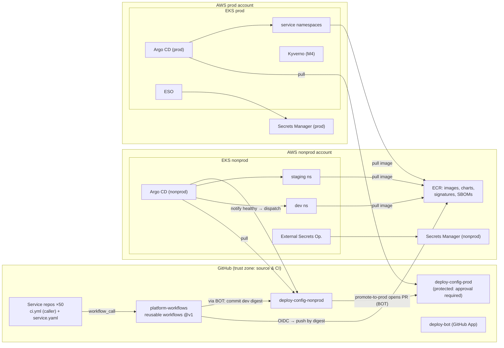

# CI/CD Platform for 50 Microservices: Architecture and Build Sequence

> **Context note:** The workspace is empty. `README.md` says there is no code, config or data to look at. So this plan is built on stated assumptions (A1–A12 in §5) about your stack. The ones most likely to change it are A1 (Kubernetes on AWS), A2 (GitHub plus a legacy Jenkins) and A4 (platform team size). The questions at the end are about those.

---

## 1. Summary

- **What:** One standard build-and-deploy path (the "golden path") for about 50 existing microservices owned by roughly 10 product teams. It replaces a mix of older pipelines. The bulk of the work is **moving 50 live services onto it safely**, not building the pipeline.
- **Shape:** **Continuous integration (CI)** uses shared GitHub Actions workflows that every service calls. Each service is built once into a container image that never changes and is identified by its digest (a content hash). **Continuous delivery (CD)** uses GitOps: the desired state of each environment lives in Git, and **Argo CD** running in each cluster pulls that state and applies it. Each image is promoted unchanged from dev to staging to prod. Prod changes need an approved pull request (PR).
- **Key decisions:**
  1. Clusters pull their changes (Argo CD) instead of CI pushing them, so CI never holds cluster credentials.
  2. Two config repos, `deploy-config-nonprod` and `deploy-config-prod`. Only prod needs a human approval, and that approval is the audit trail.
  3. One shared Helm chart and one set of shared workflows, released through a floating `@v1` tag that goes to a small group of test services first. This limits how far one bad platform change can spread.
  4. Database migrations run as an Argo CD pre-deploy job using expand/contract (add new structures first, remove old ones only after nothing uses them). There are no down-migrations; rolling back means deploying the previous image.
  5. Canary releases, ephemeral PR environments, a developer portal and self-hosted runners are deferred.
- **First milestone (3–5 weeks):** One low-risk pilot service goes from merge to **production** through the real pipeline. A prod rollback is demonstrated in under 10 minutes. Four spikes answer the biggest unknowns, and an inventory of all 50 services exists.
- **Top risks:**
  - Services are more varied than expected, which slows onboarding.
  - Argo CD has trouble taking over live workloads (Kubernetes label selectors can't be changed in place).
  - A single bad change to the shared workflows breaks all 50 pipelines.
  - Product teams can't free up time to onboard.

## 2. Context and Goals

- **Problem (assumed, A3):** About 50 services build and deploy through a mix of Jenkins jobs, per-repo scripts and some manual `helm upgrade` runs. As a result:
  - Lead times are inconsistent and rollback is ad hoc.
  - It's hard to say what's running in prod or who changed it.
  - Long-lived cloud keys sit in CI.
  - Security fixes (base images, scanners) have to be applied 50 times.
- **Goals:**
  - Every service deploys through one audited, reversible path.
  - A platform-wide change (new scanner, base image, policy) reaches all services without editing 50 repos.
  - A typical service can be onboarded in a day or less.
- **Non-goals:**
  - Rewriting service code or Dockerfiles beyond what onboarding needs.
  - Multi-region deployment.
  - Ephemeral per-PR environments.
  - A developer portal (Backstage).
  - Changing the runtime platform (stays on EKS).
  - Organisation-wide contract testing.
- **Success measures** (inferred targets; baseline measured in M1):

| Measure | Target by end of M4 |
|---|---|
| Services deploying only via the platform | 50 / 50; legacy CI shut down |
| Merge → running in staging (no human action) | p50 ≤ 25 min |
| PR CI feedback | p50 ≤ 10 min, p95 ≤ 20 min |
| Prod rollback time (decision → previous version healthy) | ≤ 10 min |
| Platform-caused pipeline failures (not test failures) | < 2% of runs |
| Prod deploys traceable to commit + digest + approver | 100% |

## 3. Drivers, Requirements, and Constraints

**Ranked quality attributes** (all targets are assumptions until the baseline is taken in M1):

| # | Attribute | Measurable target | Why it matters |
|---|---|---|---|
| 1 | **Safety of prod change** | Rollback ≤ 10 min; image identical across envs (same digest); no unapproved prod change | A platform that makes outages more likely won't be adopted, and shouldn't be |
| 2 | **Low cost to adopt and change (evolvability)** | Typical service onboarded ≤ 1 engineer-day; platform change reaches all services via one tag move | 50 services × even 1 extra week of work each wrecks the timeline |
| 3 | **Auditability / supply-chain security** | 0 long-lived cloud keys in CI; 100% prod deploys tied to commit, digest and approver; images signed by the platform workflow | Assumed SOC 2-style change control (A6) |
| 4 | **Developer lead time** | See §2 table | This is the payoff product teams feel |
| 5 | **Operable by a small team** | ≤ 4 platform engineers; Argo CD outage doesn't affect running services; Argo CD rebuildable from Git in ≤ 1 h | Team carrying operational load (A4) |
| 6 | **Cost** | CI + CD tooling ≤ ~$4k/month (A10) | Should be cheap; it becomes a driver only if self-hosting looks attractive |

When these conflict, **safety beats lead time**. For example, the prod approval gate stays even though it adds wait time.

**Key functional requirements:**
- Build, test, scan and publish images for 3–4 languages.
- Promote the same digest dev → staging → prod.
- Prod approval by the owning team.
- One-step rollback.
- DB schema migrations.
- Secrets from a secret manager.
- Notifications of what was deployed.
- Delivery metrics (deployment frequency, lead time, change failure rate).

**Constraints (assumed):**
- AWS, EKS: one nonprod cluster with dev and staging namespaces, one prod cluster, in separate accounts.
- GitHub (Enterprise Cloud), one repo per service.
- Terraform for infrastructure.
- Existing Prometheus/Grafana and Slack.
- 4 platform engineers.
- About 5 months.
- Product teams can spend 1–3 days per service.

**Hard parts:**
1. **How varied the 50 services are.** The golden path has to fit about 80% of them, or onboarding turns into 50 custom projects.
2. **Taking over live workloads.** Argo CD has to adopt Deployments that a legacy tool created, without downtime. Kubernetes doesn't let you change a Deployment's selector labels, so a label mismatch forces a side-by-side cutover.
3. **Blast radius of shared components.** One shared workflow or chart serves 50 services, so one bad release breaks all of them.
4. **DB migrations inside GitOps.** Ordering, failure handling, and what rollback means once a schema has changed.
5. **Adoption capacity.** Onboarding needs time from about 10 product teams, which the platform team doesn't control.

## 4. Current State

There was nothing to inspect: the workspace contains only a README saying it's empty. What this plan assumes about the current state (each item is checked by spike S1 in M1):
- About 50 services in separate GitHub repos, mostly with Dockerfiles.
- Deployed to EKS by Jenkins jobs or scripts, using a mix of per-service Helm charts and raw manifests.
- Secrets held in Jenkins credentials or Kubernetes Secrets created by hand.
- Some services own a Postgres database with Flyway, Alembic or golang-migrate.
- Terraform already manages the AWS accounts and EKS.

Conventions the plan follows: Terraform for AWS resources, Helm for Kubernetes packaging, GitHub for source and review. **If any of these is wrong, §10 says which decisions change.**

## 5. Assumptions and Open Questions

| ID | Assumption | Impact if wrong | Validated how / when |
|---|---|---|---|
| A1 | Services run on Kubernetes (EKS); 1 nonprod + 1 prod cluster | The CD layer (Argo CD, chart) is replaced, e.g. by ECS deploy actions. CI design still holds | Confirm in the kickoff week |
| A2 | Source on GitHub Enterprise Cloud; legacy CI is Jenkins | On GitLab, swap reusable workflows for GitLab CI templates; the structure stays the same | Kickoff week |
| A3 | Services are already in prod and are deployed independently (no lockstep releases) | Lockstep releases would need release trains or grouped promotion; add to M3 | S1 inventory, week 1–2 |
| A4 | 4 platform engineers; product teams give 1–3 days per service | Fewer people stretch M3/M4 roughly in proportion | Kickoff; tracked weekly |
| A5 | 3–4 languages, ~80% of services in the top 2 | More spread means more golden-path variants, so M2 grows | S1 inventory |
| A6 | SOC 2-style control: prod change needs one approver who isn't the author | PCI/SOX may require separate approver groups and longer audit retention | Security/compliance owner, before M1 week 3 |
| A7 | GitHub plan allows ≥ 180 concurrent hosted jobs (larger-runner limits) | Builds queue at peak; may need self-hosted runners | Check plan limits day 1; burst test in M2 |
| A8 | Integration tests can run in the CI runner (Testcontainers/docker-compose), with no private-network access | Need self-hosted runners in the VPC; pulls ARC forward into M2 | S1 inventory |
| A9 | Org identity provider (Okta/Entra) supports OIDC for Argo CD SSO | Fall back to GitHub SSO for Argo CD | M1 task T7 |
| A10 | ~300–500 CI runs/day at ~10 min average | Cost estimate in §11 changes | Measured in M2 |
| A11 | A low-risk (tier-3), stateless pilot service is available | M1 slips while one is found | Kickoff |
| A12 | Audit retention requirement ≤ 1 year | Longer retention changes the export/storage design | With A6 |

**Open questions:**

| Question | Owner | Default if no answer | Needed by |
|---|---|---|---|
| Runtime platform (A1) | Infra lead | EKS, 2 clusters | M1 day 3 |
| Compliance regime and approver rules (A6, A12) | Security/compliance | SOC 2, 1 code-owner approval, 1-year retention | M1 week 3 (before the prod slice) |
| Pilot service and pilot team (A11) | Eng managers | Lowest-tier stateless service in the top language | M1 day 2 |
| Who commits product-team onboarding time (A4) | VP Eng | Each team commits 1–3 days per service inside its wave | Before M2 |

## 6. Architecture Overview



**How it fits together:**
1. A service repo has a ~15-line `ci.yml` that calls the reusable workflows in `platform-workflows`.
2. On merge to `main`, the workflow builds the image once, scans it, signs it and pushes it to ECR. It authenticates to AWS with GitHub's OIDC tokens, so there are no stored keys.
3. `deploy-bot` writes the new digest into the dev values in `deploy-config-nonprod`.
4. Argo CD in the nonprod cluster syncs the change.
5. When dev is healthy, Argo CD Notifications triggers a promotion of the same digest to staging.
6. Promotion to prod is a PR in `deploy-config-prod` that the owning team must approve.
7. Each cluster's Argo CD reads only its own config repo. CI holds no cluster credentials.

**Trust boundaries:**
- GitHub ↔ AWS: OIDC with a scoped role.
- nonprod ↔ prod: separate accounts, clusters, repos and Argo CD instances.
- Human approval on `deploy-config-prod`.

| Component | Responsibility | Owns data | Exposes | Technology | Key dependencies |
|---|---|---|---|---|---|
| Service repo (×50) | Service code, Dockerfile, thin CI caller, metadata | `service.yaml` (owner, tier, language, on-call) | — | GitHub | `platform-workflows` |
| `platform-workflows` | Build/test/scan/sign/publish; notify deploy | Workflow definitions, release tags | Reusable workflows (`workflow_call`) versioned `@vN` | GitHub Actions | ECR, `deploy-bot`, IAM OIDC roles |
| `platform-charts` | Shared `service` Helm chart | Chart versions | OCI chart in ECR, semver | Helm 3 | ECR |
| `deploy-config-nonprod` | Desired state for dev + staging; promotion workflows | Per-service, per-env values incl. image digest | ApplicationSet; `promote*.yml` | Git + Actions | `deploy-bot`, Argo CD |
| `deploy-config-prod` | Desired state for prod; the approval record | Prod values + digests; PR history = deploy ledger | ApplicationSet | Git, branch protection | Argo CD (prod) |
| `deploy-bot` | Machine identity for commits/PRs to config repos | — | GitHub App | GitHub App | Org admin |
| Argo CD (nonprod / prod) | Reconcile cluster state to Git; health; hooks; notifications | Live sync status (rebuildable) | UI/API (SSO), webhooks | Argo CD (HA in M3) | Config repo, ECR, IdP |
| ECR | Store images, charts, signatures, SBOMs | Images by digest (immutable tags) | OCI registry | AWS ECR | — |
| External Secrets Operator | Sync secrets into namespaces | — (Secrets Manager is the record) | `ExternalSecret` CRD | ESO | Secrets Manager, IRSA |
| `platform-infra` | Terraform: OIDC provider, IAM roles, ECR repos, Argo CD/ESO install | Terraform state (S3 + DynamoDB lock) | — | Terraform | AWS accounts |
| Delivery metrics job (M3) | Compute deployment frequency, lead time, change failure rate | Derived metrics | Grafana dashboard | Scheduled Action + Prometheus pushgateway | Config repo history |
| Kyverno (M4) | Admit only images signed by the platform workflow | Policies | Admission webhook | Kyverno | cosign signatures in ECR |

## 7. Component Details

**`platform-workflows` (hard part 3: blast radius)**
- **Does:**
  - `build-test.yml`, one variant per language family: toolchain setup, dependency cache, unit and integration tests, `docker buildx`, Trivy scan (fails on CRITICAL vulnerabilities that have a fix; reports HIGH).
  - `publish.yml`, on `main` only: OIDC to AWS, push by digest, cosign keyless signing (from M2), syft SBOM attestation (from M2), then a dispatch to `deploy-config-nonprod`.
- **Does not:** deploy to clusters, hold cluster credentials, or contain service-specific logic. Service-specific needs go through declared inputs (`test-command`, `dockerfile-path`, `build-args`) or an escape hatch (`pre-build` / `post-test` steps in the caller).
- **Versioning:**
  - Semver tags. Services reference the floating major tag `@v1`.
  - A release goes first to the **canary group**: the platform's own fixture services plus about 5 pilot services pinned to `@v1-next`. The `v1` tag moves only after 24 h and ≥ 30 green canary runs.
  - Rollback means moving `v1` back to the previous commit, which takes about 1 minute.
  - Breaking changes ship as `@v2`, with a migration window and a Renovate PR to each repo.
  - Third-party actions are pinned by commit SHA and allowlisted at the org level.
- **Failure:** if a platform step fails (as opposed to the service's own tests), the step is labelled `platform:` so failure dashboards can tell the two apart.

**Shared `service` Helm chart (hard parts 2 and 3)**
- **Renders:** Deployment, Service, HorizontalPodAutoscaler, PodDisruptionBudget, ServiceAccount (with the IAM-role annotation), ConfigMap env, ExternalSecret, optional Ingress, and PreSync migration and PostSync smoke-test Jobs.
- **Requires:** probes and resource requests.
- **Allows:** `selectorLabelsOverride` (to match existing live Deployments) and `extraManifests` (escape hatch).
- **Versioning:** semver in ECR. Each service pins a chart version in `common.yaml`. Renovate bumps them.
- **Blast-radius control:** chart CI renders **every onboarded service's** values with the candidate chart and posts a manifest diff to the PR. A reviewer sees exactly which of the 50 services change.
- **Bespoke services** (category C in the inventory) may keep their own chart. Argo CD renders it the same way.

**Config repos and promotion**
- **Layout:** `apps/<service>/common.yaml`, `apps/<service>/<env>/values.yaml`. An ApplicationSet with a Git directory generator creates one Argo CD Application per service per environment. CODEOWNERS maps `apps/<service>/` to the owning team.
- **Nonprod:** `deploy-bot` commits directly to `main` (it is on the bypass list). Humans use PRs.
- **Prod:**
  - `main` is protected and needs 1 code-owner approval from someone other than the author. The bot can open PRs but cannot approve or merge them. There's no admin bypass except the break-glass group, and its use is audited.
  - The required check `verify-promotion` confirms that the digest currently runs in staging, exists in ECR and (from M2) carries a valid signature.
- **Promotion triggers:**
  - Argo CD Notifications sends `on-deployed` (synced and healthy) for dev to a GitHub `repository_dispatch`.
  - `promote-staging.yml` then updates staging.
  - `promote-prod.yml` runs on `workflow_dispatch` (or from a Slack shortcut later) and opens the prod PR.
- **Write contention:** each service's promotion runs in a concurrency group `promote-<service>-<env>`. A rejected push is retried up to 5 times with rebase and jitter. Files don't overlap, so the rebases succeed.
- **Load:** ~300–500 commits/day to nonprod. Trivial for Git.

**Argo CD (one per cluster)**
- **Configuration:** SSO via the org identity provider. One AppProject per team, limited to that team's namespaces with no cluster-scoped resources. Server-side apply. GitHub webhooks for sync within seconds (no 3-minute polling).
- **Failure:** if Argo CD is down, nothing new deploys, but **running services are unaffected**. Recovery: reinstall from `platform-infra`; Applications regenerate from Git. Target ≤ 1 h; HA mode and a restore drill come in M3.
- **Scale:** ~150 Applications across 2 instances, far below Argo CD's limits.
- **Safety:** adopted apps have **no** `resources-finalizer` during migration. Deleting an Application must never delete live workloads.

**Routine components:**
- **ECR:** one repo per service, immutable tags (`<git-sha>`, plus `prod-<date>` added on prod promotion), lifecycle policy: keep the last 100 `prod-*`, expire other tags after 90 days.
- **ESO:** reads `/<env>/<service>/*` from Secrets Manager through a per-service IAM role.
- **`deploy-bot`:** its private key is an org secret available to service repos. This is an accepted risk for nonprod writes. Kyverno signature enforcement (M4) is the backstop.

## 8. Data Design

| Entity | System of record | Writer | Consistency / notes | Retention |
|---|---|---|---|---|
| Container image (+ signature, SBOM) | ECR, by digest | `publish.yml` only (IAM trust tied to the platform workflow, see S4) | Immutable | Per lifecycle policy above |
| Desired state (nonprod) | `deploy-config-nonprod` | `deploy-bot`, humans via PR | Git ordering; ancestry check (Flow 4) | Git history, forever |
| Desired state + approval (prod) | `deploy-config-prod` | Merged PRs only | Single writer: the merge | Forever; nightly mirror to S3 with Object Lock (1-year compliance mode, A12) |
| Live state | Kubernetes API | Argo CD | Eventually matches Git | n/a |
| Pipeline runs / logs | GitHub Actions | GitHub | — | 90 days (GitHub default). Prod repo history is the durable audit record, so build logs don't need keeping longer |
| Deploy events | Argo CD Notifications → Slack + Prometheus | Argo CD | Best effort; Git is authoritative | Slack/Prometheus defaults |
| Service metadata | `service.yaml` in each service repo | Owning team | Validated by schema in CI | Git |
| Secrets | AWS Secrets Manager (per account) | Owning team via Terraform or console with audit | ESO refresh every 1 h | Rotation per org policy |
| Terraform state | S3 + DynamoDB lock, per account and per component | `platform-infra` pipeline | Locked | Versioned bucket |

- **Sensitive data:**
  - The `deploy-bot` key and service secrets. Service secrets never pass through CI; ESO reads them inside the cluster.
  - Trivy/CI logs mask secrets through GitHub's masking. Application config in Git must not contain secrets; a gitleaks check on the config repos enforces this from M1.
- **Service DB schemas (rules the platform enforces):**
  - Migrations are **expand/contract only**: additive change → deploy → backfill → switch reads → remove the old structure in a later release.
  - There are no down-migrations, so rolling back means redeploying the previous image, which must still work against the expanded schema.
  - This is written into the onboarding checklist and tested in spike S3.

## 9. Key Flows

**Flow 1: PR feedback**
1. A developer opens a PR, which triggers `ci.yml` → `build-test.yml@v1`.
2. Tests, image build (not pushed) and Trivy scan run.
3. The results become a required status check.
4. Target: p50 ≤ 10 min.

**Flow 2: Merge to production (the happy path)**
1. Merge to `main`, which triggers `publish.yml`.
2. The image is pushed by digest and signed. `deploy-bot` commits `apps/svc/dev/values.yaml` with `image.digest=sha256:…` and `sourceSha=<sha>`.
3. A GitHub webhook tells Argo CD (nonprod) to sync dev. The PreSync migration Job runs, then the rolling update, then the PostSync smoke Job.
4. Argo CD Notifications fires `on-deployed`, then `repository_dispatch`, then `promote-staging.yml`, which copies the digest to staging and repeats step 3 in staging.
5. The owner runs `promote-prod.yml`. It opens a PR in `deploy-config-prod`, and `verify-promotion` passes.
6. A code owner approves and merges. Argo CD (prod) syncs. Slack `#deploys` gets service, digest, commit, approver and PR link.

**Flow 3: Rollback (failure path: bad release in prod)**
1. The prod app turns Degraded, or error alerts fire. The owner clicks "Revert" on the prod PR, which takes the fast-track path: 1 approval from the team, `verify-promotion` checks only that the digest was previously in prod.
2. Argo CD syncs the previous digest. The migration Job runs but finds nothing to apply, because migrations are additive.
3. Target: ≤ 10 min from decision to healthy. Drilled in M1, M3 and M4.
4. **Break-glass** (if GitHub is unavailable): an on-call member of the `argocd-breakglass` group turns off auto-sync and sets the image parameter in the prod Argo CD UI or CLI to a previous digest, which is already in ECR. The action is audited. Afterwards the change must be reconciled into Git, using `platform-docs/runbooks/breakglass.md`.

**Flow 4: Out-of-order builds (failure path: race)**
1. Commits A then B merge 30 s apart. B's build finishes first and goes to dev. A finishes later.
2. The publish step checks `git merge-base --is-ancestor <currently-deployed sourceSha> <A>`. That returns false, so A is **not** promoted and the job logs a skip.
3. Builds on `main` also use `concurrency: build-main-<repo>` (queued, not cancelled), which makes this rare.

**Flow 5: Shared workflow regression (failure path: blast radius)**
1. `v1.7.0` breaks the Node cache step.
2. Canary services on `@v1-next` go red. The `v1` tag doesn't move, and the other 45 services never see it.
3. If it slips through anyway: the platform-failure-rate alert fires (more than 5% `platform:` step failures in 30 minutes), and on-call moves `v1` back to `v1.6.x`. Builds recover on retry.

## 10. Key Decisions

| # | Decision | Options considered | Rationale (vs drivers) | Reversibility | Revisit if |
|---|---|---|---|---|---|
| D1 | **GitHub Actions with central reusable workflows** | Jenkins shared libraries; Buildkite; GitLab CI | Assumed on GitHub (A2); no CI servers to run (driver 5); OIDC to AWS built in (driver 3) | Medium | Source is not on GitHub; minutes cost > $5k/month |
| D2 | **GitOps pull with Argo CD** | Push from CI (`helm upgrade` in Actions); Spinnaker; Harness | No cluster credentials in CI; drift detection; rollback = Git revert (drivers 1, 3); UI and per-team RBAC for 50 services. Cost: a new tool to learn and run | Hard (all deploy config shaped around it) | Not on Kubernetes (A1) |
| D3 | Argo CD over Flux | Flux | Multi-team UI and SSO/RBAC; Argo Rollouts integration for M4 | Medium | Team already runs Flux well |
| D4 | **One Argo CD per cluster** | Central hub managing all clusters | Prod instance can't reach nonprod and the reverse; no cross-account cluster credentials (drivers 1, 3). Cost: 2 instances to upgrade | Easy | Clusters > ~5 |
| D5 | **Separate `deploy-config-nonprod` and `deploy-config-prod` repos** | Single repo with path rules; config inside service repos | Different permissions per repo; prod PR history = audit ledger; one writer per environment state | Medium | Compliance requires per-team prod repos, or path-level rulesets prove sufficient |
| D6 | **One shared Helm chart + escape hatches** | Each service keeps its chart; Kustomize bases | Platform changes reach all services (driver 2); render-diff controls blast radius. Category-C services may keep their own chart | Hard (deployment contract for 50 services) | S1 shows > 30% need bespoke manifests |
| D7 | **Build once, promote the digest** | Rebuild per environment | What was tested is what ships (driver 1); faster | Hard | — |
| D8 | **Floating `@v1` tag + canary group** | Exact SHA pins + Renovate PRs to 50 repos | One move fixes or updates all; canary limits blast radius; SHA pins produce 50 PRs per change and slow security fixes | Easy | A regression escapes the canary group twice in a quarter |
| D9 | **Promotion via GitHub workflows + Argo CD Notifications** | Kargo; Argo CD Image Updater | Uses tools already adopted; about 200 lines of workflow; avoids a third new tool in M1 | Easy | Promotion rules grow (multi-stage gates, per-tier policies) → evaluate Kargo |
| D10 | **Migrations as PreSync hook Job, expand/contract only** | Run on app start; run from CI | CI has no DB network access or credentials; app-start migrations race across replicas | Medium | S3 shows hooks unreliable → separate migration Application in an earlier sync wave |
| D11 | **GitHub-hosted runners** | Self-hosted ephemeral (Actions Runner Controller on EKS) | Nothing to operate (driver 5); estimated cost acceptable | Easy | Tests need VPC access (A8), or minutes > $5k/month, or queue p95 > 5 min |
| D12 | **Shared staging; no PR environments** | Ephemeral namespace per PR | Cost and complexity are not justified by any driver yet | Easy | Staging contention complaints from more than 3 teams |
| D13 | **Canary releases (Argo Rollouts) for tier-1 services only, in M4** | Everyone, from M2 | Rolling update plus fast rollback is enough early; canary analysis needs good metrics per service | Easy | Change failure rate > 15% on tier-1 |

## 11. Cross-Cutting Concerns

**Security** (built in M1; signing M2; enforcement M4)

| Threat | Mitigation |
|---|---|
| A CI job leaks cloud credentials | OIDC only, no stored AWS keys. One IAM role per service limited to pushing to that service's ECR repo. The trust policy requires `ref:refs/heads/main` and the platform workflow (custom OIDC `sub` claim including `job_workflow_ref`; S4). PR builds get no role |
| A malicious PR runs with secrets | No `pull_request_target` checkouts. Forking disabled on internal repos. PR workflows have no secrets |
| Unapproved prod change | Protected `deploy-config-prod`; code-owner approval; no bypass outside the break-glass group; Argo CD RBAC blocks manual prod sync except break-glass; GitHub audit log exported |
| Compromised dependency or base image | Curated base images rebuilt weekly; Trivy gate; SBOM attestations; third-party actions pinned by SHA and allowlisted |
| Image injected without going through CI | cosign keyless signatures (M2); Kyverno `verifyImages` in prod, in audit mode during M2–M4 and switched to enforce once all 50 services are on the platform |
| Argo CD compromise | SSO only (local admin disabled after bootstrap); per-team AppProjects; no cluster-scoped resources for teams; Argo CD upgraded within 14 days of security releases |

**Reliability:**
- CD outage doesn't affect running services.
- Argo CD gets HA mode and a rebuild drill (≤ 1 h) in M3.
- Workflow steps have timeouts (job `timeout-minutes: 30` by default).
- Pushes to the config repos retry with backoff.
- Promotion is idempotent: writing the same digest again is a no-op.
- Lost notification: `promote-staging` can be run by hand, and a daily job flags services where staging has lagged dev by more than 24 h.
- Config repos are mirrored to S3 nightly.

**Observability:**
- From M1: Argo CD metrics into Prometheus. Alerts:
  - prod app Degraded for more than 10 min → owning team
  - prod app OutOfSync for more than 30 min → platform
  - Argo CD controller down → platform
- From M2: GitHub `workflow_job` webhooks feed a dashboard of queue time, duration (p50/p95) and failure rate split into `platform:` vs service failures. Alert: platform failure rate above 5% over 30 min.
- From M3: delivery-metrics dashboard (deployment frequency, lead time, change failure rate, time to restore). Deploy annotations on service dashboards.

**Performance and capacity:**
- Peak is a morning burst plus a 50-service base-image rebuild, about 50–100 concurrent jobs.
- Check plan concurrency on day 1 (A7) and run a burst test of 60 concurrent builds in M2.
- Argo CD with ~150 apps needs no tuning.
- Build time comes down through dependency caches, Docker layer cache (`type=gha`) and test splitting where p95 exceeds 20 min.

**Cost** (estimate, A10):
- 400 runs/day × 10 min × 30 days ≈ 120k minutes/month. On 2–4-core hosted runners that's about $1–3k/month.
- Argo CD and ESO need about 4–6 vCPU per cluster.
- ECR storage is controlled by lifecycle rules.
- Controls: GitHub spending limit and monthly review; `cancel-in-progress` on PR workflows; path filters.

**Operations:**
- **Platform team owns:** `platform-workflows`, `platform-charts`, both Argo CD instances, `deploy-bot` and `platform-infra`. On-call is business hours for CI. A prod Argo CD outage is P2, because running services are unaffected.
- **Product teams own:** their service values, prod approvals and failed deploys of their services.
- Support runs through a `#platform-help` channel and an office hour during onboarding waves.
- Runbooks live in `platform-docs/runbooks/` (rollback, break-glass, tag rollback, Argo CD rebuild, failed migration).

**AI-specific concerns:** not applicable. There are no AI components.

## 12. Build Sequence

Team assumption: 4 platform engineers (2 strong on Kubernetes/Argo, 2 on CI/build). Each product team spends 1–3 days per service during its wave. These sizes are rough ranges, not commitments.

```
M1 Thin slice + spikes ──► M2 Golden path v1 + 8 pilots ──► M3 Waves 1–2 (→30) ──► M4 Waves 3–4 (→50), retire legacy, enforce
   3–5 wks                    4–6 wks                         5–7 wks                 5–8 wks
Critical path: access/IAM → Argo CD + config repos → pilot to prod → chart/workflow contract v1 (M2) → onboarding throughput (~4 services/week) → legacy shutdown
```

| | **M1: Thin slice to prod + spikes** | **M2: Golden path v1** | **M3: Onboarding waves 1–2** | **M4: Waves 3–4, enforce, retire** |
|---|---|---|---|---|
| **Goal** | Prove the whole path, including prod, approval and rollback, on 1 service; answer hard parts 1–4 | Stabilise the contract (workflows `v1.0`, chart `1.0`) across languages and service types | Prove onboarding throughput and that the platform can be operated | All 50 services; close supply-chain controls; remove the old path |
| **Scope** | 1 tier-3 stateless pilot; top language only; dev/staging/prod; spikes S1–S4; basic alerts. **Excluded:** signing, ESO, other languages | 6–8 pilots chosen to cover: each language, 1 with DB migrations, 1 queue worker, 1 tier-2 with real traffic, **1 category-C (bespoke)** service; ESO secrets; cosign + SBOM; workflow metrics; burst test | ~22 services (category A/B, grouped **by team** so each team learns once); start category-C services in parallel; Argo CD HA + rebuild drill; delivery-metrics dashboard; runbooks; onboarding scaffolder | Remaining ~20 including tier-1; Argo Rollouts canary for tier-1; Kyverno enforce in prod; Jenkins archived; security review sign-off |
| **Deliverables** | Repos: `platform-workflows`, `platform-charts`, `deploy-config-nonprod`, `deploy-config-prod`, `platform-infra` (OIDC, ECR, Argo CD ×2); inventory; 4 spike reports; rollback runbook | Tagged `@v1`; chart 1.0; onboarding guide and checklist; canary group in place; `migrate`/`smoke` hook conventions | `platform-onboard` script that opens the PRs in a service repo and a config repo; per-service cutover runbook; dashboards; on-call rota | Rollouts templates + analysis; Kyverno policies; decommission record |
| **Exit criteria** | Pilot: merge → staging ≤ 25 min with no human action; prod via approved PR; prod rollback ≤ 10 min **demonstrated**; 0 AWS keys in GitHub secrets; inventory covers 50/50; spikes have decisions recorded and the M2 plan is updated | 8 services deploy to prod **only** via the platform; one team onboards a category-A service alone in ≤ 1 day; platform-failure rate < 2% over 2 weeks; 60-build burst queue p95 < 5 min | 30/50 on the platform; legacy deploy jobs disabled for those; Argo CD rebuilt from Git in ≤ 1 h in a drill; dashboards live with real data | 50/50; legacy CI read-only then off; Kyverno enforcing with 0 violations for 7 days; canary analysis has aborted a deliberately bad tier-1 release in staging |
| **Dependencies** | Day-1 access requests (T1) | M1 spike results; compliance answer (A6) | M2 contract frozen; team time committed | M3; tier-1 metrics adequate for canary analysis |
| **Parallel** | Infra (T3, T7) ∥ workflows (T4) ∥ chart (T5) ∥ inventory (S1) | Language variants ∥ ESO/signing ∥ metrics | 2 engineers onboarding ∥ 1 on category-C ∥ 1 on HA/metrics | Onboarding ∥ Rollouts ∥ Kyverno |

**Why this order:**
- M1 goes all the way to **prod** with one boring service, because approvals, prod account access and rollback are where hidden surprises are.
- M2 deliberately includes the awkward service types, including one bespoke service, so the contract is frozen *after* seeing them, not before 40 services depend on it.
- Category-C services start in M3 in parallel. If they all waited for M4, they'd blow the schedule.
- Tier-1 services come last, once the platform has 30 services of history.
- Kyverno enforcement waits for 50/50 because enforcing earlier would block services not yet migrated.

## 13. First Milestone Task Breakdown

Ordering: **T1 on day 1.** Week 1, in parallel: T2, T3, T5, T7. Week 2: T4, T6, T8, T9, T10. Week 2–3: T11, T12. Week 3–4: T13–T17.

| # | Task | Where | Done when |
|---|---|---|---|
| T1 | **Request long-lead items:** create `deploy-bot` GitHub App (org owner); IAM admin rights for the OIDC provider in nonprod + prod accounts; book a security review slot for the week-4 threat model; confirm GitHub concurrent-job limits (A7); get the compliance answer (A6); name the pilot service (A11) | Tickets to org admins / security | All six have an owner and date; App installed on the two config repos |
| T2 | **Spike S1: service inventory.** Question: what share of the 50 fits the golden path? Script the GitHub API to detect build tool and language, Dockerfile, test command, migration tool, current CI and deploy method; pull live selector labels with `kubectl get deploy -A -o json`; classify A/B/C. **Time box 4 days** | `platform-docs/inventory/inventory.csv` + `scan.py` | 50 rows complete; A/B/C split and language split reviewed. **Changes plan if** > 30% are C (extend M2, add escape hatches earlier), or tests need the VPC for > 20% (pull ARC into M2), or lockstep releases exist (add release grouping to M3) |
| T3 | **Add Terraform** for the GitHub OIDC provider, a pilot IAM role `gha-ecr-push-<svc>` (trust: `repo:<org>/<svc>:ref:refs/heads/main`), and ECR repo `<svc>` (immutable tags, lifecycle policy) | `platform-infra/aws/nonprod/ci-identity/`, module `modules/service-registry/` | `terraform plan` clean in CI; a test workflow assumes the role and pushes; the same workflow on a PR branch is denied |
| T4 | **Create reusable workflows** `build-test.yml` (top language) and `publish.yml` (push by digest; dispatch to nonprod config); add `selftest.yml` running both against `fixtures/sample-<lang>/`; tag `v0.1.0` and floating `v0` | `platform-workflows/.github/workflows/` | Self-test green on every PR; pushes a digest for the fixture; Trivy fails the build on a planted CRITICAL CVE |
| T5 | **Create chart `service` 0.1.0** (Deployment, Service, HPA, PDB, SA, ConfigMap, required probes and resources, `selectorLabelsOverride`, `extraManifests`, PreSync/PostSync Job templates); CI runs `helm lint`, `helm unittest`, `kubeconform`; publish to ECR OCI | `platform-charts/charts/service/` | Chart in ECR; unit tests cover selector override and hook rendering |
| T6 | **Create `deploy-config-nonprod`** with the `apps/<svc>/{common.yaml,dev/,staging/}` layout, ApplicationSet (Git directory generator), CODEOWNERS, branch protection (bot on the bypass list), gitleaks check | `deploy-config-nonprod/` | Adding a directory creates an Argo CD app within 1 min; a PR that adds a fake secret fails the check |
| T7 | **Install Argo CD (nonprod)** from Terraform `helm_release`, with SSO via the org identity provider (A9), per-team AppProjects, GitHub webhook, Notifications to Slack `#deploys`, Prometheus scraping | `platform-infra/k8s/nonprod/argocd/` | SSO login works with team-scoped RBAC; a push to the config repo syncs in < 30 s |
| T8 | **Spike S2: adopt a live workload.** Question: can Argo CD take over the pilot's legacy-created Deployment with at most a rolling restart? Create the app with auto-sync off, run `argocd app diff`, sync with server-side apply, try both matching and mismatched selectors in dev. **Time box 3 days** | Dev namespace; report in `platform-docs/spikes/s2-adoption.md` | Written cutover procedure for both cases, with measured downtime (target 0). **Changes plan if** a selector mismatch is common in S1: the standard cutover becomes "side-by-side Deployment behind the same Service, then scale down legacy", adding ~0.5 day per service to M3/M4 sizing |
| T9 | **Spike S3: migrations as a PreSync hook.** Question: does a PreSync Job reliably block a rollout on failure, behave idempotently on re-sync and survive a rollback to the previous image? Use a throwaway Postgres in dev with Flyway. **Time box 3 days** | `platform-charts` hook template; report `s3-migrations.md` | A failed migration leaves the old version serving; rerun is a no-op; rollback works after an additive migration. **Changes plan if** unreliable: switch to a separate migration Application in an earlier sync wave (D10) |
| T10 | **Spike S4: lock down the publish identity and release process.** Question: can IAM trust require the platform workflow (custom OIDC `sub` with `job_workflow_ref`), and does the `v0-next` → `v0` tag move work as a canary? **Time box 2 days** | `platform-infra`, `platform-workflows/RELEASING.md` | A push from a non-platform workflow in the pilot repo is denied; the documented tag-move and rollback takes ≤ 2 min. **Changes plan if** not possible: rely on Kyverno signature verification as the primary control and bring it forward to M2 (audit mode) |
| T11 | **Onboard the pilot** with a ~15-line `ci.yml` caller, `service.yaml`, and values in `deploy-config-nonprod`; cut over dev, then staging, using the S2 procedure; disable those legacy Jenkins deploy jobs (keep build-only for 2 weeks) | Pilot repo; config repo | Pilot deploys to dev/staging only via Argo CD; legacy job disabled, not deleted |
| T12 | **Build promotion to staging:** Argo CD Notifications `on-deployed` (dev) → `repository_dispatch` → `promote-staging.yml` (concurrency group, rebase-retry, ancestry check); PostSync smoke Job in staging | `deploy-config-nonprod/.github/workflows/`; Argo CD notifications config in `platform-infra` | Merge → staging healthy ≤ 25 min with no human action; an out-of-order build is skipped (test by forcing it) |
| T13 | **Stand up prod:** Argo CD (prod) as in T7; `deploy-config-prod` with protection (1 code-owner approval, bot can't merge, break-glass group only); `promote-prod.yml` opens the PR; `verify-promotion` check | `platform-infra/k8s/prod/argocd/`, `deploy-config-prod/` | Pilot reaches prod via an approved PR; an unapproved PR can't merge; a PR with a digest not in staging fails the check |
| T14 | **Write and drill rollback:** `runbooks/rollback.md` and `runbooks/breakglass.md`; run a revert of the pilot in prod | `platform-docs/runbooks/` | Drill recorded: decision → previous digest healthy ≤ 10 min; break-glass dry run in staging |
| T15 | **Add basic alerts:** prod app Degraded > 10 min → owning team; OutOfSync > 30 min and controller down → platform; Slack deploy message with service, digest, commit, approver | Existing Prometheus/Alertmanager rules repo (assumed) | A deliberately broken image in staging fires the alert and the message |
| T16 | **Take the baseline:** current lead time, deploy frequency and rollback time for 5 legacy services (from Jenkins history) | `platform-docs/baseline.md` | Numbers recorded; targets in §2 confirmed or revised |
| T17 | **Update the plan:** feed S1–S4 results into M2 scope, pilot cohort (6–8 named services and teams) and M3/M4 sizing | This document | Reviewed with eng managers; pilot teams have committed dates |

## 14. Testing and Validation Strategy

- **Testing the platform itself:**
  - **Workflow self-tests** run on fixture services (one per language) on every `platform-workflows` PR.
  - The **canary group** gates every tag move.
  - **Chart unit tests**, kubeconform, and a **render-diff across all onboarded services** run on every chart PR.
  - Terraform plan runs in CI, and apply needs approval.
- **Service-level** (run by the pipeline, owned by teams):
  - Unit and integration tests (Testcontainers) in `build-test`.
  - Trivy gate.
  - Smoke test after deploy (PostSync) in dev and staging, which blocks promotion.
  - Contract tests are deferred.
- **What blocks a release:** a red PR check blocks merge. A failed dev/staging sync or smoke test blocks promotion. Prod needs approval plus `verify-promotion`.
- **Verifying §3 targets:**

| Target | How it's checked |
|---|---|
| Rollback ≤ 10 min | Drills in M1, M3 and M4 |
| Lead time | Delivery-metrics dashboard (M3) |
| CI p50/p95 | `workflow_job` metrics (M2) |
| Concurrency | Burst test (M2) |
| Argo CD rebuild ≤ 1 h | Drill (M3) |
| 0 static keys | Org secret scan (M1, repeated in M4) |
| Signing enforcement | Kyverno audit reports, then enforce (M4) |

- **Environments:** dev and staging namespaces in nonprod (shared). Fixture services live in a `platform-sandbox` namespace. No production data is needed.

## 15. Rollout, Migration, and Rollback

**Onboarding groups:** Ring 0 is the pilot (M1). Ring 1 is the 6–8 diverse pilots (M2). Waves 1–2 (M3) and waves 3–4 (M4) are grouped by team, with category A/B first, category C started early, and tier-1 last.

**Per-service cutover** (the old and new paths run side by side for each service):
1. Add the new CI in **build-only** mode next to the legacy job. Check that the image builds and tests pass.
2. Create Argo CD apps with **auto-sync off** and no finalizer. Iterate until `argocd app diff` shows only expected differences.
3. Cut over dev (enable auto-sync, disable the legacy dev deploy). Then staging.
4. Cut over prod in a normal deploy window with the owning team present.
5. After 2 weeks and ≥ 3 successful prod deploys, delete the legacy job.

**Rollback during cutover:**
- Disable auto-sync, then `argocd app delete --cascade=false` (removes the app, keeps the workloads).
- Re-enable the legacy job.
- This works until step 5 for that service.

**Point of no return:** Jenkins is decommissioned at the end of M4, and Kyverno enforcement switches on (which blocks unsigned images). Before that, archive the Jenkins job configs to S3 so the old path can be rebuilt as a last resort.

## 16. Risks and Mitigations

| Risk | Likelihood | Impact | Mitigation | Early warning | Owner |
|---|---|---|---|---|---|
| Services are more varied than assumed (hard part 1) | Med | High | S1 inventory in week 1; category-C service in M2; escape hatches; category C starts in M3 | S1 shows > 30% category C | Platform lead |
| Live-workload adoption causes downtime (hard part 2) | Med | High | S2 spike; diff before sync; no-cascade deletes; side-by-side procedure | S2 measures > 0 downtime | K8s engineer |
| Shared workflow or chart regression hits all services (hard part 3) | Med | High | Canary group, render-diff, 1-minute tag rollback, platform-failure alert | Canary failures; alert firing | Platform on-call |
| Migration hook misbehaves; schema rollback impossible (hard part 4) | Med | High | S3 spike; expand/contract rule in onboarding checklist; review in M2 pilot | S3 failures; first migration incident | K8s engineer |
| Product teams don't free up time (hard part 5) | High | High | VP-level commitment before M2; ≤ 1-day onboarding goal; scaffolder; group waves by team | Wave < 3 services/week for 2 weeks | Eng managers |
| Prod approval becomes a bottleneck | Med | Med | 1 approver; Slack-triggered promotion; revisit auto-promotion for tier-3 after M4 | Prod PRs open > 1 day median | Platform lead |
| GitHub concurrency or cost limits | Low–Med | Med | Day-1 limit check; M2 burst test; ARC as fallback (D11) | Queue p95 > 5 min | CI engineer |
| `deploy-bot` key misused for nonprod writes | Low | Med | Bot can't merge prod; Kyverno signature verification; key rotated quarterly | Unexpected bot commits | Security |
| Compliance requires more than assumed (A6) | Med | Med | Ask in M1 before building prod protection | Security review findings | Security |
| Argo CD is new to the team | Med | Med | 2 engineers own it; one new tool per milestone; vendor docs plus spike time | Sync issues needing outside help | Platform lead |

## 17. Deferred Work and Future Evolution

| Deferred item | Trigger to build it |
|---|---|
| Ephemeral PR environments | Staging contention reported by > 3 teams |
| Backstage portal / service catalogue | `service.yaml` + inventory not enough to find owners; > 70 services |
| Self-hosted runners (ARC) | VPC test access needed, minutes > $5k/month, or queue p95 > 5 min |
| Canary releases beyond tier-1 | Change failure rate > 15% on tier-2 |
| Kargo for promotion | Promotion logic beyond ~200 lines or per-tier gates |
| Org-wide contract testing | Recurring cross-service breakages in staging |
| Auto-promotion to prod for tier-3 | 3 months of < 5% change failure rate |
| Multi-region / ECR replication | A multi-region requirement appears |

**Deliberate shortcuts:**
- The `deploy-bot` key is shared across repos. Paid back by Kyverno enforcement in M4, and later by per-repo dispatch-only tokens if GitHub's permissions allow.
- The staging-lag check is a daily job rather than event-driven reconciliation.

**Places the design can grow:** workflow inputs and versions, chart `extraManifests`, AppProjects per team, notification triggers.

## 18. Next Steps

1. **Today:** send the T1 requests (GitHub App, IAM OIDC rights, security review slot, concurrency limits) and the four open questions in §5 to their owners.
2. **Day 1–2:** choose the pilot service and team (A11). Create the five repos: `platform-workflows`, `platform-charts`, `deploy-config-nonprod`, `deploy-config-prod`, `platform-infra`.
3. **Week 1:** start S1 with `platform-docs/inventory/scan.py`. It's the input everything else depends on.
4. **Week 1, in parallel:** T3 (OIDC + ECR Terraform), T5 (chart skeleton), T7 (Argo CD nonprod).
5. **End of week 2:** review S1–S4 results and adjust M2 scope and sizing (T17).

---

### Open questions that would most change this plan

1. **Do the services run on Kubernetes (EKS), and how many clusters are there?** *Default: yes, 1 nonprod + 1 prod.* If not, the whole CD layer (Argo CD, chart, adoption spike) is swapped for something else, e.g. ECS deploy actions. CI stays mostly the same.
2. **Where is the source code, and what runs CI today?** *Default: GitHub + Jenkins.* If you're on GitLab, the structure stays but the tools change.
3. **What compliance rules apply to prod changes?** *Default: SOC 2, one non-author code-owner approval, 1-year audit retention.* PCI or SOX would tighten approver separation and retention before the M1 prod slice.
4. **How many platform engineers, and is there a fixed date?** *Default: 4 engineers, about 5 months.* With 2 engineers, M3/M4 roughly double.
5. **Are any services released in lockstep, or do they share databases?** *Default: no.* If they do, M3 needs grouped or train-based promotion and the migration rules get stricter. S1 will partly answer this, but you may already know.
