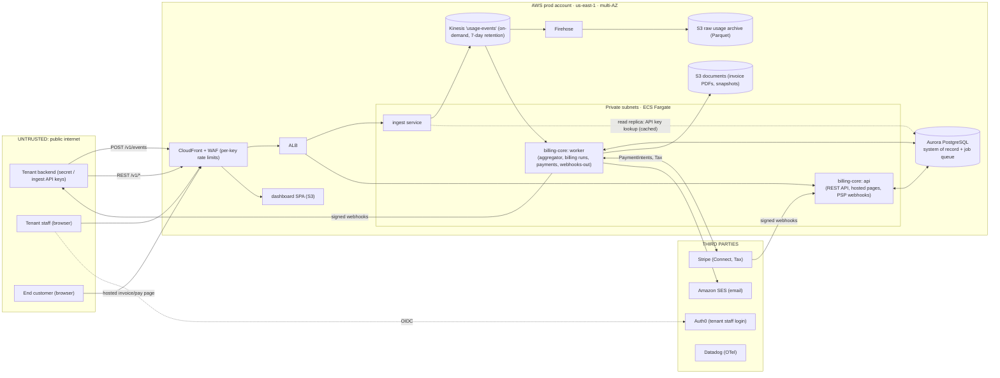
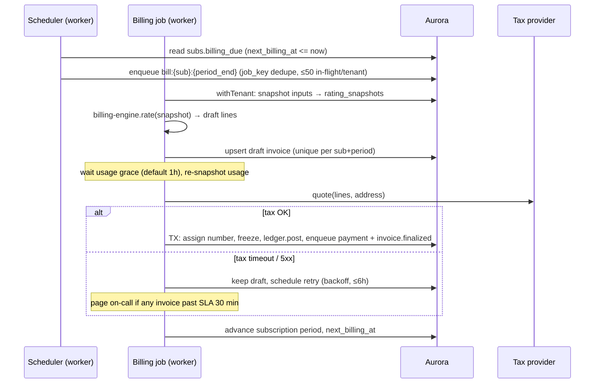

# Architecture and Build Plan: Multi-Tenant SaaS Billing Platform

> **How I read the request.** I took "multi-tenant SaaS billing system" to mean a **billing platform sold as SaaS to many businesses (tenants)**. Each tenant uses it to bill its own end customers: plans, subscriptions, usage metering, invoices, payment collection, and dunning (retrying failed payments). In other words, a product in the same category as Chargebee, Orb, or Lago.
>
> **If you actually meant "billing for our own multi-tenant SaaS product," stop here.** In that case the right call is to buy Stripe Billing, Chargebee, or Orb and build a thin layer for entitlements and usage forwarding. Most of this document wouldn't apply. That is the first open question at the end.
>
> The workspace has no code (`README.md`: *"This directory is intentionally empty"*), so this is a new build and every situational fact below is a labelled assumption.

---

## 1. Summary

- **What:** A B2B billing platform. SaaS companies (tenants) set up their pricing, send usage events, and the platform produces accurate invoices, collects payment through the tenant's own Stripe account, retries failed payments, and sends signed webhooks to the tenant's systems.
- **Shape:** One TypeScript application (`billing-core`) with strict internal modules, deployed as two process types (`api` and `worker`). It sits on one Aurora PostgreSQL database that is the system of record, including an append-only double-entry ledger. A small, separate `ingest` service accepts usage events into Kinesis, so usage keeps flowing when the core database is busy or down. Everything runs on AWS in one region across multiple availability zones.
- **Key decisions:**
  1. **We are not the merchant of record.** Tenants connect their own Stripe accounts (Stripe Connect Standard) and charges are created directly on their accounts. This keeps us out of money transmission and mostly out of PCI scope.
  2. **Shared database with Postgres row-level security (RLS) on `tenant_id`**, plus composite tenant foreign keys. Per-region or per-big-tenant "cells" (full copies of the stack) are an escape hatch, not built at launch.
  3. **Invoices are computed by a pure, versioned billing engine** from snapshotted inputs. Finalised invoices are immutable and can only be corrected with credit notes.
  4. **Usage counts are exact.** Each event is counted once via a database uniqueness constraint on the tenant's event ID. Raw events are archived to S3 so the system can be audited and replayed.
  5. **Background jobs and outgoing events go through a Postgres-backed job queue** (graphile-worker), so a job is created in the same transaction as the business change that triggers it.
- **Milestone 1 (about 5–7 weeks):** One end-to-end slice deployed to staging through the real pipeline. A test tenant creates a flat-fee plus metered price, a customer, and a subscription. It sends usage, the billing run produces a finalised invoice, Stripe test mode charges it, the ledger balances, and an `invoice.paid` webhook reaches the tenant. Four spikes run alongside it: billing-engine semantics, RLS with connection pooling, ingest throughput, and Stripe Connect plus tax.
- **Top risks:** errors in billing semantics (proration, tiers, time zones) that reach real invoices; a cross-tenant data leak; tax and e-invoicing legal requirements for the tenants' markets; and the calendar time needed for a full shadow billing cycle before a design partner goes live.

---

## 2. Context and Goals

- **Problem:** SaaS companies with usage-based or hybrid pricing outgrow simple subscription tools. Typical pain: spreadsheet usage reconciliation, invoices they can't explain, homegrown proration bugs, and no audit trail. *(Assumption: target market is US/UK B2B SaaS and API companies, 10–500 employees, already using Stripe.)*
- **Goals:**
  - Tenants can model flat, per-seat, per-unit, tiered, volume, and package pricing without code.
  - Every invoice can be explained line by line and reproduced from stored inputs.
  - Payment collection runs automatically, with configurable dunning.
  - Tenants can integrate in under a day using the API, usage ingest, and webhooks.
- **Non-goals (v1):** acting as merchant of record or payment facilitator; revenue recognition or a general ledger (we export data instead); filing or remitting tax; quoting/CPQ; an entitlements or feature-flag service; combining several subscriptions on one invoice; real-time burn-down of prepaid credits; EU structured e-invoicing; multi-region active-active; on-prem.
- **Success measures (6 months after launch):** 3+ design-partner tenants live; 0 double charges; 0 reconciliation differences against Stripe that stay unexplained for more than 24 hours; at least 99% of cycle invoices finalised within 2 hours of the end of the grace period; tenant integration time under 1 day (median, self-reported).

---

## 3. Drivers, Requirements, and Constraints

### Ranked quality attributes

| # | Attribute | Measurable target | Why it matters |
|---|---|---|---|
| 1 | **Financial correctness and auditability** | 0 double charges. 100% of finalised invoices reproducible bit-for-bit from the stored snapshot. Every ledger transaction sums to zero. Nightly invariant checks 100% green. *(targets are assumptions)* | Wrong invoices destroy tenant trust immediately and are legally visible to their customers. |
| 2 | **Tenant isolation** | 0 cross-tenant reads or writes. Enforced in the database, not only in app code. Verified by CI suite and pre-launch pen test. | One leak of another company's customer list ends the business. |
| 3 | **Ingest availability and durability** | Usage ingest 99.95% monthly. 0 accepted events lost. Usage queryable within 60 s p95. Management API and hosted pages 99.9%. *(assumption)* | Lost usage means lost revenue for tenants. Invoicing itself can be late by hours. |
| 4 | **Evolvability of pricing** | A new pricing model ships in ≤2 weeks with no migration of historical invoices. A new payment provider (PSP) adapter ships in ≤6 weeks. *(assumption)* | Pricing innovation (credits, AI usage, hybrid) is the product's competitive edge. |
| 5 | **Time to market and operability for a small team** | First design partner live around month 7. Infra under about $8k/month across all environments at launch. On-call manageable by 6 engineers. *(assumption)* | The runway is finite, and the team runs what it builds. |

The ranking is used for trade-offs. Correctness beats availability for invoicing: if inputs are uncertain (tax provider down, usage still arriving), we delay finalising rather than guess. Ingest availability beats immediate consistency: an event is accepted first and aggregated later.

**Latency (supporting):** API p95 under 300 ms for reads and under 500 ms for writes at 300 req/s. Ingest acknowledgement p99 under 150 ms.

**Scale design point (assumption):** at launch, 3–10 tenants, 50k end customers, about 5M events/day. At 24 months, 300 tenants, 2M active subscriptions, 50M events/day (about 600/s on average, 5k/s peak, up to 2k req/s), and a largest tenant of 300k subscriptions. Load tests run at 2× these figures.

### Key functional requirements that shape the structure

- Catalog with **immutable price versions** (editing creates a new version).
- Subscriptions with trials, mid-cycle changes and proration, cancellation, and billing anchors. Fixed fees are charged **in advance** and usage **in arrears**.
- Usage meters with sum, count, max, last-value, and unique-count aggregation.
- Invoice lifecycle: draft → open (finalised, numbered) → paid / void / uncollectible. Credit notes for corrections.
- Payment collection, dunning, refunds, and dispute records, all through the tenant's Stripe account.
- **Test and live modes per tenant**, Stripe-style.
- Outgoing webhooks, a REST API with idempotency keys, a tenant dashboard, and a hosted invoice/payment page.
- **Shadow billing mode:** compute invoices without finalising or charging, and compare them with the tenant's existing system. This is how tenants migrate.

### Constraints (all assumed)

- Team of 6 engineers (4 backend, 1 frontend, 1 platform), plus a PM and a part-time finance/compliance advisor. The team knows TypeScript and AWS.
- AWS, `us-east-1` region. No existing organisation platform to conform to.
- Compliance: SOC 2 Type II expected by B2B buyers within about 12 months. Stay at PCI DSS SAQ A by never touching card data. GDPR applies to end-customer personal data.
- No data residency requirement at launch. EU residency is a later trigger (see Section 17).

### Hard parts

1. **Billing semantics:** proration, tier changes mid-period, anchors on the 29th–31st, daylight saving and time zones, currencies with 0 or 3 decimal places, rounding. Subtle bugs here only show up on real invoices.
2. **Counting usage exactly once at volume:** retries, duplicates, late events, and corrections, with no loss.
3. **Moving money safely:** idempotent charges, charge requests whose outcome is unknown (for example after a timeout), Stripe webhooks arriving out of order, reconciliation. This depends on an external party.
4. **Tax and invoice legal requirements:** these depend on outside providers and law, not engineering. EU e-invoicing mandates are already live in some countries (for example Belgium since Jan 2026, France phasing in from Sept 2026; confirm with counsel).
5. **Tenant isolation plus noisy neighbours:** one tenant's 300k-subscription billing run on the 1st of the month must not starve others or leak data.

---

## 4. Current State

The workspace has no code, infrastructure, or data. I inspected `README.md`, which confirms the directory is empty. This is a new build. Conventions defined by this plan:

- Monorepo `billing-platform/` using pnpm workspaces, Node.js 24 LTS, and TypeScript in strict mode.
- One Postgres schema per module (`tenancy`, `catalog`, `subs`, `metering`, `invoicing`, `ledger`, `payments`, `events`). A module only touches its own schema. Other modules call it through its exported TypeScript interface, and CI enforces this with `dependency-cruiser`.
- Plain SQL migrations (`node-pg-migrate`), Terraform for all infrastructure, GitHub Actions for CI/CD.

---

## 5. Assumptions and Open Questions

### Assumptions

| Assumption | Impact if wrong | How and when validated |
|---|---|---|
| A1. The product is a billing platform for many SaaS businesses, not billing for our own product | Most of this plan is unnecessary. Buy instead. | User confirms before M1 starts |
| A2. Tenants already use Stripe and accept us charging through their account (Connect Standard) | We would need a PSP abstraction with more than one provider at launch, plus card migration tooling, adding 6–10 weeks | Design-partner interviews in weeks 1–2; spike S4 |
| A3. We are not merchant of record, so no money-transmitter licensing is needed | Legal and licensing work measured in months, and a different payment model | Fintech counsel review, started in week 1 (long lead) |
| A4. Scale figures in Section 3 | Over or under-built usage pipeline | Design-partner usage profiles in M1; spike S3 |
| A5. Team of 6, strong in TypeScript and AWS | Different stack choice, longer timeline | Confirm with user |
| A6. Launch tenants bill US/UK customers, so EU e-invoicing is deferred | Structured e-invoicing becomes launch scope (+4–8 weeks) | Design-partner customer geography in M1; counsel in S5 |
| A7. Usage is billed at most monthly, so unique-count meters only need ≤31 days of raw events | Raw retention and unique-count design change | Design-partner pricing review in M1 |
| A8. Invoice and ledger retention is 10 years. Raw usage: 40 days in Postgres, 25 months in S3 | Storage cost or legal exposure | Counsel review by M3 |
| A9. Invoices may finalise up to 6 h after period end | If tenants need instant invoices, the grace and batching design changes | Design partners in M1 |
| A10. Stripe Tax can calculate tax on connected accounts at acceptable cost | Use Anrok or Avalara adapter instead (+2–3 weeks) | Spike S4 |

### Open questions

| Question | Owner | Default if no answer | Needed by |
|---|---|---|---|
| Q1. Platform for many businesses, or our own billing? | Product lead / you | Platform (this plan) | Before M1 |
| Q2. Must non-Stripe PSPs (Adyen, GoCardless) be supported at launch? | Product + design partners | No, Stripe only, behind an adapter | M1 week 2 |
| Q3. Which pricing models do design partners actually use? | PM | Flat, per-unit, tiered, prepaid credits | M1 week 3 |
| Q4. Is EU data residency or e-invoicing needed for any launch tenant? | Sales / counsel | No | M2 start |
| Q5. Who is responsible for tax setup (tenant or platform)? | Counsel / product | Tenant configures; we calculate through a provider | M2 start |

---

## 6. Architecture Overview



**How it fits together.**

- Tenant backends send usage to `ingest`. It checks the API key from a cache, validates the payload, writes the batch to Kinesis, and returns 202. It never writes to Postgres.
- The `worker` consumes Kinesis. It inserts events with deduplication and updates hourly aggregates in the same transaction. Firehose copies every record to S3 independently.
- The `api` handles catalog, customer, and subscription management, the hosted invoice/payment pages, and incoming Stripe webhooks.
- When a subscription period ends, the `worker` billing scheduler queues one job per subscription. Each job snapshots its inputs, runs the pure `billing-engine`, gets a tax quote, finalises the invoice, posts to the ledger, and queues a payment attempt. All of this happens in Postgres transactions.
- Events for tenants (for example `invoice.finalized`) are written as jobs in the same transaction and delivered as signed webhooks.

**Component table**

| Component | Responsibility | Owns data | Exposes | Technology | Key dependencies |
|---|---|---|---|---|---|
| `ingest` | Accept usage events durably and fast | none (writes to Kinesis) | `POST /v1/events` (sync, 202) | Node/Fastify on Fargate | Kinesis, API-key cache (read replica) |
| `tenancy` | Orgs, tenants (live/test), staff users, roles, API keys, audit log, settings, feature flags | `tenancy.*` | In-process API; `/v1/api_keys`; admin CLI | billing-core module | Auth0 |
| `catalog` | Products, meters, versioned prices | `catalog.*` | `/v1/products`, `/v1/prices`, `/v1/meters` | module | tenancy |
| `subs` | Customers, subscriptions, items, change log, schedules | `subs.*` | `/v1/customers`, `/v1/subscriptions` | module | catalog |
| `metering` | Aggregator consumer, dedupe, hourly aggregates, usage queries | `metering.*` | Kinesis consumer; `/v1/usage` query | module (runs in worker) | Kinesis |
| `billing-engine` | **Pure** function: inputs snapshot → invoice draft lines | none | TS library, versioned | package, no I/O | — |
| `invoicing` | Billing scheduler, invoice lifecycle, numbering, credit notes, shadow mode, PDFs | `invoicing.*` | `/v1/invoices`, `/v1/credit_notes`; jobs | module | billing-engine, subs, catalog, metering, tax, ledger |
| `tax` | Tax quotes and commits behind an interface | `invoicing.tax_quotes` (via invoicing) | In-process `TaxProvider` | adapter | Stripe Tax (pending S4) |
| `ledger` | Double-entry AR sub-ledger, customer balances and credits | `ledger.*` | In-process `post(transaction)` only | module + SQL function | — |
| `payments` | Payment methods (tokens), attempts, Stripe webhook intake, dunning, refunds, disputes, reconciliation | `payments.*` | In-process; `/v1/payment_methods`, `/v1/refunds`; `/internal/psp/stripe/webhook` | module + `PspAdapter` | Stripe Connect, ledger, invoicing |
| `events` | Outbox-backed webhooks-out, emails, event log | `events.*`, `graphile_worker.*` | `/v1/webhook_endpoints`, `/v1/events_log` | module | SES |
| `dashboard` | Tenant staff UI | none | SPA calling `/v1` + `/dashboard/*` BFF routes | React SPA on S3/CloudFront | Auth0, api |
| `hosted-pages` | Public invoice and payment pages for end customers | none | Server-rendered routes in `api` with unguessable tokens | Fastify views + Stripe Elements | payments |

---

## 7. Component Details

### `ingest` (separate deployable)

- **Why it is separate:** driver #3. It has to keep accepting usage when Postgres is busy (billing day) or down (failover, migration), and it scales differently from the rest.
- **Does not:** aggregate, resolve customers, or write to Postgres.
- **Interface:** `POST /v1/events`. A batch of 1–500 events, at most 1 MB. Each event is `{event_id, event_name, external_customer_id, timestamp, properties}`. `event_id` must be unique per tenant. The timestamp must fall between 35 days ago and 5 minutes in the future; otherwise that event is rejected with a per-event error. Returns 202 with accepted and rejected lists.
- **Writing to Kinesis:** one Kinesis record per API batch, with a random partition key (aggregation doesn't need ordering), so record counts stay low and shards don't get hot.
- **Auth:** only keys of scope `ingest` or `secret` are accepted. Key hashes are looked up on a read replica and cached in memory for 5 minutes. If the database is unreachable, the service keeps using the last known good cache for up to 1 hour. Consequence: a revoked key stops working within 5 minutes.
- **Failure:** if Kinesis throttles or errors, return 503 with `Retry-After`. Our SDK retries with backoff and jitter. Running 3 or more tasks across AZs gives redundancy.

### `metering`

- **Aggregator (in worker):** Kinesis consumer using the KCL-equivalent pattern with checkpoints stored in Postgres. For each batch, in **one transaction**:
  1. `INSERT INTO metering.usage_events … ON CONFLICT (tenant_id, event_id, event_date) DO NOTHING RETURNING …`
  2. Upsert `usage_hourly` only for the rows that were actually inserted.
  3. Advance the checkpoint.
- Because Kinesis delivers at least once, this gives an exactly-once effect within the 35-day window.
- **Meter definitions** (event name, value property, filters, aggregation) are cached per tenant. Changing a meter that already has events triggers a re-aggregation job from raw events. Meters are versioned like prices.
- **Late events:** events for a period whose invoice is already finalised are aggregated as usual. The next invoice gets a "prior-period adjustment" line that names the original period.
- **Failure:** if the aggregator falls behind, Kinesis holds 7 days. An alert fires when iterator age exceeds 10 minutes. Poison records (fail validation after 3 attempts) go to `metering.dead_letters` with a replay command.

### `billing-engine` (pure package)

- **Signature:** `rate(snapshot: RatingInputs, engineVersion) → InvoiceDraft`. `RatingInputs` contains the subscription item timeline, price versions, usage aggregates per segment, credits and discounts, period, timezone, and currency. The output is a list of lines, each with an `explanation` (quantity, tier breakdown, proration fraction).
- **Internal pipeline:**
  1. Split the period into segments at each change timestamp.
  2. Fixed fees: proration by seconds within each segment.
  3. Usage: rate per segment against that segment's price version. Tier position comes from cumulative usage for the period (spike S1 confirms this choice).
  4. Discounts.
  5. Apply credit balance.
  6. Round once per line to currency minor units, half-up. The rounding mode is recorded on the invoice.
- **Arithmetic:** `decimal.js`, with ISO 4217 exponents (JPY has 0 decimals, KWD has 3). Unit prices are stored as `numeric(38,12)` decimal strings.
- **Versioning:** `engine_version` and `inputs_hash` are stored on each invoice. Changing behaviour means a new engine version. Old invoices are never re-rated in place.
- **Failure:** it's a pure function, so the only failure mode is a bug. That is caught by the golden scenario suite, property tests, and nightly shadow re-rating (Section 14).

### `invoicing`

- **Billing scheduler** (every minute, in worker):
  - Runs as the `scheduler` DB role, which can only read `subs.billing_due` (a small cross-tenant view: `tenant_id, subscription_id, next_billing_at`).
  - Queues jobs with `job_key = bill:{subscription_id}:{period_end}` so jobs can't be duplicated.
  - Fairness: allows at most 50 billing jobs in flight per tenant (configurable) and round-robins across tenants.
- **Billing job:** sets the tenant context, then:
  1. Snapshot inputs and write `rating_snapshots`.
  2. Run the engine.
  3. Upsert the draft invoice. The unique key `(tenant_id, subscription_id, period_start, period_end, kind)` stops double invoicing even if two jobs run.
  4. Wait for the usage grace period (default 1 h, per-tenant setting, maximum 72 h).
  5. Get a tax quote.
  6. **Finalise in one transaction:** take the next number from the per-tenant sequence (`UPDATE invoice_sequences … RETURNING` makes it gapless), freeze the invoice, post ledger transaction, queue payment attempt and `invoice.finalized` event.
- **Immutability:** a trigger rejects `UPDATE`/`DELETE` on finalised invoice rows and lines, except for status transitions. Corrections are credit notes.
- **Shadow mode** (tenant flag): steps 1–3 run as normal; the invoice is stored as `shadow`, never numbered or charged, and a diff report can be exported.
- **Failure:** if the tax provider is down, the invoice stays a draft and the job retries with backoff for up to 6 h, then pages. It never finalises without tax when tax is enabled.

### `ledger`

- Accounts per customer: `receivable`, `credit_balance`. Accounts per tenant: `billed_revenue`, `tax_payable`, `discounts`, `psp_clearing`, `refunds`, `write_off`.
- The only way to write is the SQL function `ledger.post_transaction(jsonb)`. It checks that lines sum to zero per currency and inserts the transaction and entries atomically. The app role has `EXECUTE` on it and no `INSERT` on the tables.
- Balance rows are maintained **only for customer-level accounts**, which aren't contended. Tenant-level totals are computed on read, so billing day doesn't create a hot row.

### `payments`

- **`PspAdapter` interface:** `createCustomer`, `attachPaymentMethod`, `createAndConfirmPayment(idempotencyKey)`, `getPayment`, `refund`, `parseWebhook`. The first implementation is `StripeConnectAdapter`, which uses the `Stripe-Account` header for direct charges.
- **Attempt safety:**
  - A partial unique index on `payment_attempts(invoice_id) WHERE status IN ('pending','unknown')` allows only one live attempt per invoice.
  - The Stripe idempotency key is the `payment_attempt.id`.
  - If a call times out, the attempt becomes `unknown`. Nothing retries it until the reconciler has looked it up in Stripe.
- **Incoming webhooks:** one Connect webhook endpoint. Verify the signature, then `INSERT … ON CONFLICT DO NOTHING` on `psp_events(stripe_event_id)` and return 200. A job then processes the event by **re-fetching the object from Stripe**, which is the source of truth, and applying a status transition that can only move forward. This makes out-of-order delivery harmless.
- **Dunning:** a retry schedule per tenant (default: days 1, 3, 5, 7), then a terminal action (cancel subscription, mark uncollectible, or leave past_due). Each step is a scheduled job.
- **Reconciliation (nightly):** compare Stripe charges and refunds per connected account against `payment_attempts` and ledger `psp_clearing`. Any mismatch raises a ticket and appears on a dashboard.

### `events`

- Outgoing webhooks are delivered at least once and signed with HMAC-SHA256 over `timestamp.body`. Each event has an `id` so tenants can deduplicate.
- Retries back off exponentially for up to 3 days. An endpoint is auto-disabled after 3 days of failures and the tenant is emailed. Tenants can view and replay deliveries in the dashboard (M3).

### `tenancy`, `catalog`, `subs`, `dashboard`, `hosted-pages`

These are routine CRUD with the invariants already described: immutable price versions, composite tenant foreign keys, and audit logging of staff actions. Hosted pages use unguessable 32-byte tokens per invoice, are rate-limited by WAF, and load Stripe Elements in iframes.

### Scaling summary

- `api`, `ingest`, and `worker` scale horizontally on Fargate (CPU, and Kinesis iterator age for the worker).
- Aurora: an r7g.large writer and one reader at launch, I/O-Optimized.
- First expected bottleneck: `metering` write volume on the writer. The trigger to move `metering` to its own cluster is aggregator transactions using more than 30% of writer CPU or `usage_events` exceeding 1 TB. The module boundary makes that a config and migration change.

---

## 8. Data Design

### Entities and ownership (one writer per entity)

| Entity | Schema (writer) | Notes |
|---|---|---|
| `organisations`, `tenants` (live + test per org), `tenant_users`, `api_keys`, `audit_log`, `tenant_features` | `tenancy` | Test and live are **separate tenant IDs**, so RLS keeps test data out of live by construction. Keys are stored as SHA-256 hashes with prefixes `sk_live_`, `sk_test_`, `ik_live_` (ingest-only). |
| `products`, `meters`, `prices` (versioned, immutable once referenced) | `catalog` | `prices.model` ∈ flat, per_unit, tiered_graduated, tiered_volume, package. `tiers jsonb`. |
| `customers`, `subscriptions`, `subscription_items` (`effective_from/to`), `subscription_changes` | `subs` | `customers.external_id` unique per tenant. `subscriptions.next_billing_at` drives the scheduler. |
| `usage_events` (partitioned daily by `event_date`), `usage_hourly`, `dead_letters`, `stream_checkpoints` | `metering` | Unique `(tenant_id, event_id, event_date)`. Partitions managed with `pg_partman` and dropped after 40 days. |
| `invoices`, `invoice_lines`, `invoice_sequences`, `credit_notes`, `rating_snapshots`, `tax_quotes`, `billing_runs` | `invoicing` | Invoices carry `engine_version`, `inputs_hash`, `rounding_mode`, plus structured seller/buyer tax fields so EN 16931 e-invoicing can be added later. |
| `ledger_accounts`, `ledger_transactions`, `ledger_entries`, `account_balances` | `ledger` | Append-only, enforced by trigger. |
| `payment_methods` (PSP references only), `payment_attempts`, `psp_events`, `refunds`, `disputes`, `dunning_state` | `payments` | No card data, ever. |
| `webhook_endpoints`, `webhook_deliveries`, `api_idempotency_keys`; `graphile_worker.*` (job queue/outbox) | `events` | Idempotency keys are kept for 24 h and scoped to tenant and endpoint. |

### Isolation mechanics (hard to reverse; built in M1)

- Every tenant-owned table has `tenant_id uuid NOT NULL`, RLS enabled and forced, and the policy `tenant_id = current_setting('app.tenant_id')::uuid`.
- The app runs as role `app_rw`, which has no `BYPASSRLS`. Every request or job runs inside `withTenant(tenantId, tx => …)`, which calls `select set_config('app.tenant_id', $1, true)` so the setting only lasts for the transaction.
- **Composite foreign keys** such as `(tenant_id, price_id) → catalog.prices(tenant_id, id)` make cross-tenant references impossible.
- A CI **schema lint** fails if any table outside an allowlist lacks `tenant_id`, RLS, or a tenant-leading index.
- Cross-tenant roles are limited to `scheduler` (one view) and `ops_breakglass` (audited, time-boxed, M4).

### Consistency and transactions

All money-affecting state changes are single Postgres transactions inside one module call chain:

- Finalising an invoice, posting to the ledger, and queuing the payment and event happen in one transaction.
- Recording a successful payment, posting to the ledger, marking the invoice paid, and queuing the event happen in one transaction.

The only eventual consistency is usage, which goes ingest → aggregate in under 60 s p95 and is covered by the grace period.

### Access patterns and indexing

- Scheduler: `subs.subscriptions (next_billing_at) WHERE status IN ('active','trialing','past_due')`.
- Rating: `usage_hourly (tenant_id, external_customer_id, meter_id, hour)`.
- API lists: `(tenant_id, created_at DESC, id)` with cursor pagination.
- IDs: UUIDv7 internally, shown externally with a prefix (`inv_…`, `cus_…`).

### Retention, backup, restore

- Invoices, credit notes, and ledger: 10 years (A8).
- Raw usage: 40 days in Postgres. 25 months in S3, moving to Glacier after 90 days.
- Webhook deliveries: 30 days.
- Aurora point-in-time recovery for 35 days (RPO ≤ 5 min). Restore-to-new-cluster RTO ≤ 1 h. Daily cross-region snapshot copy and S3 cross-region replication for regional disaster (RPO/RTO 24 h, assumption).
- **Quarterly restore drill, first one in M4.**

### Classification

| Class | Fields | Protection |
|---|---|---|
| Secret | API keys, webhook signing secrets, Stripe credentials | Hashed (keys), or Secrets Manager + KMS. Never logged. |
| Personal | End-customer name, email, address, tax ID | Aurora KMS encryption. Log redaction allowlist. GDPR erasure anonymises customers but keeps invoice fields that the law requires us to retain. |
| Financial | Invoices, ledger, payments | Append-only. Audit log of staff access. |
| Card data | none (Stripe tokens only) | SAQ A scope |

### Schema evolution

- Expand/contract: an additive migration runs before deploy. The app must work with both N-1 and N schemas. Backfill runs as a job. Destructive changes come at least 2 releases later.
- `CREATE INDEX CONCURRENTLY` only. Migrations run as a one-off ECS task in the deploy pipeline before services roll.
- **Test data:** a synthetic generator in `tools/seed/`. No production personal data in staging or dev.

---

## 9. Key Flows

### Flow A: Usage ingestion, including duplicate delivery

1. The tenant backend sends `POST /v1/events` with 200 events and key `ik_live_…`.
2. `ingest` validates the key from cache, checks the schema and timestamp window, `PutRecord`s the batch to Kinesis, and returns 202 (p99 < 150 ms).
3. Firehose writes the record to `s3://…/raw/tenant=…/date=…/`.
4. The worker aggregator reads the batch, inserts into `usage_events` with `ON CONFLICT DO NOTHING`, upserts `usage_hourly` for the inserted rows, and checkpoints, all in one transaction.
5. **Failure: the worker crashes after commit but before checkpoint.** Kinesis redelivers the batch. All 200 inserts conflict, so 0 aggregate updates happen and the totals don't change.
6. **Failure: the tenant retries the HTTP call after a network blip.** Same `event_id`s, same result: no double count.
7. **Failure: Postgres failover (about 30 s).** Ingest keeps returning 202. Aggregator lag rises and drains after recovery. An alert fires only if lag exceeds 10 minutes.

### Flow B: Period-end billing run, including tax outage



### Flow C: Payment collection, including timeout with unknown outcome and out-of-order webhooks

1. The payment job inserts `payment_attempt(id=pa_1, status=pending)`. The partial unique index blocks a second live attempt for the invoice.
2. It calls Stripe to create and confirm a PaymentIntent on the connected account, with `Idempotency-Key: pa_1`, metadata `{invoice_id, attempt_id}`, and a 10 s timeout.
3. **Success response:** in one transaction, set the attempt to `succeeded`, post the ledger entry (Dr psp_clearing / Cr receivable), mark the invoice `paid`, and queue `invoice.paid`.
4. **Timeout:** set the attempt to `unknown`. The reconciler job runs 1 minute later and calls `getPayment` by stored PaymentIntent ID or by metadata search. It resolves to succeeded or failed and applies step 3 or the dunning logic. If the PaymentIntent doesn't exist, it retries step 2 with the **same** idempotency key, so Stripe never creates a duplicate charge.
5. **Webhooks out of order** (for example `payment_intent.succeeded` arriving before our own response handler commits): each `psp_event` is processed by re-fetching the PaymentIntent and applying a forward-only transition. The second handler finds the attempt already `succeeded` and does nothing.
6. **Decline:** the attempt becomes `failed`, the invoice stays `open`, and the dunning schedule queues the next attempt (day 1, 3, 5, 7), then the terminal action.

### Flow D: Mid-cycle upgrade with proration (summary)

1. `POST /v1/subscriptions/{id}` with the new price and `proration_behavior=invoice_now|next_invoice|none`.
2. `subs` closes the old item (`effective_to = t`), opens the new item (`effective_from = t`), and writes `subscription_changes`.
3. With `invoice_now`, a `kind=proration` invoice is rated for the segment `[t, period_end)` (credit for old, charge for new) and finalised and charged as in Flow B and C. Usage stays on the cycle invoice, rated per segment.

---

## 10. Key Decisions

| # | Decision | Options considered | Rationale (drivers) | Reversibility | Revisit if |
|---|---|---|---|---|---|
| D1 | Tenants bring their own Stripe (Connect Standard, direct charges). We are not merchant of record. | (a) Connect Standard direct charges; (b) platform as merchant of record / payment facilitator; (c) multiple PSPs from day one | #5 time to market, #1 correctness (Stripe holds funds and disputes), avoids licensing (A3). Existing Stripe customers keep their saved cards, so no card migration. | **Hard** | Over 30% of pipeline prospects aren't on Stripe → add a GoCardless or Adyen adapter. A business case for taking a fee on money flows → revisit merchant of record. |
| D2 | Shared database and schema, `tenant_id` + forced RLS + composite FKs. Cells later. | (a) shared + RLS; (b) schema per tenant; (c) database per tenant | #2 isolation is enforced by the database. #5 one migration path and low cost at 300 tenants. Schema or DB per tenant multiplies migrations and connections. | **Hard** | Residency contract, a tenant over 20% of load, or a contractual demand for a dedicated DB → deploy a cell (same Terraform, tenant directory routing). |
| D3 | Modular monolith (`api`/`worker`) plus separate `ingest` | (a) monolith only; (b) this; (c) microservices per domain | #1 money transactions stay local to one DB. #3 justifies only ingest being separate. #5 a 6-person team can't run 8 services. | Medium | A module needs its own scaling or release cadence, or the team grows past about 15. |
| D4 | Ledger in the same Postgres, double-entry, written only via SQL function | (a) Postgres; (b) TigerBeetle; (c) a managed ledger API | #1 atomic with invoice and payment writes. The volume (millions of entries a month) is easy for Postgres. A second store breaks transactional guarantees. | Medium | Over 5k ledger transactions/s sustained, or hot-account contention seen in load tests. |
| D5 | Usage path: Kinesis on-demand → Postgres (dedupe + hourly aggregates) + Firehose → S3 | (a) direct to Postgres; (b) this; (c) Kafka/MSK + ClickHouse | #3 ingest survives DB load. #1 exact dedupe through a DB constraint plus S3 replay. Avoids two new data technologies (ClickHouse, Kafka) for a small team. | Easy–medium (behind `metering` interface) | Over 200M events/day, need for ad-hoc analytics over raw events, or Postgres metering load past the trigger in Section 7 → ClickHouse for raw and aggregates. |
| D6 | Postgres-backed job queue (graphile-worker) used as the outbox | (a) graphile-worker; (b) SQS + transactional outbox relay; (c) Temporal | #1 a job is created only if its business change commits, with no relay to build. Job keys give dedupe. #5 no extra infrastructure. | Easy | Job throughput over about 3k/s sustained, or job-table churn hurting the primary → SQS with outbox relay. |
| D7 | Money: integer minor units for amounts, `numeric(38,12)` for unit prices, decimal.js, round once per line half-up | floats (rejected); integer only; this | #1. Sub-cent unit prices are common for usage pricing. | **Hard** once invoices exist | A tenant needs a different rounding mode → add a per-tenant setting (new engine version). |
| D8 | Finalised invoices immutable; corrections only via credit notes; gapless per-tenant numbering | (a) this; (b) editable invoices | #1 auditability and legal norms in most jurisdictions | **Hard** | — |
| D9 | Test and live as separate tenant IDs | `livemode` flag on rows vs separate tenants | #2 RLS isolates modes for free and test data can't reach live | **Hard** | — |
| D10 | Tax behind `TaxProvider`. First implementation is Stripe Tax (pending S4), plus a `manual_rates` fallback. | Stripe Tax, Anrok, Avalara | #5 one vendor already in place. Interface keeps #4. | Easy | S4 shows connected-account limits or cost problems → Anrok (SaaS-focused). |
| D11 | Public API: REST `/v1`, additive-only changes, OpenAPI generated from TypeBox schemas, `Idempotency-Key` required on POST | date-based versions (Stripe-style); GraphQL | #5 simplest contract to keep stable. Idempotency supports #1. | **Hard** (public contract) | The first breaking change is needed → `/v2` running alongside, 12-month deprecation. |
| D12 | TypeScript / Node 24, Fastify, Kysely, node-pg-migrate | Go, Kotlin | Assumed team skill (A5). Correctness comes from decimal handling and tests, not the language. | **Hard** | The team's actual strength is different → use it. The architecture doesn't depend on the language. |
| D13 | Tenant staff login via Auth0 (OIDC, SAML for enterprise), with our own `tenant_users` table and RBAC | Cognito, WorkOS, build our own | #5. Enterprise SSO will be asked for. | Easy (we own user IDs) | Pricing at scale, or the organisation standardises on another IdP. |

---

## 11. Cross-Cutting Concerns

### Security

- **Identity:**
  - Tenant backends use API keys: hashed, prefixed, scoped as `secret`/`ingest`/`publishable`, with rotation that overlaps old and new keys for 24 h.
  - Tenant staff use Auth0 OIDC with MFA required for `owner`/`admin`.
  - Services use IAM task roles. Database credentials come from Secrets Manager and are rotated.
- **Authorisation:**
  - RBAC roles `owner, admin, finance, developer, read_only`, checked in a Fastify `preHandler` on every route. The route-to-permission map is unit-tested.
  - Tenant scoping is enforced in the database by RLS.
  - Built in M1 for API keys and RLS; staff RBAC in M2.
- **Main threats and mitigations:**
  1. **Cross-tenant leak through a missing filter.** RLS, composite FKs, schema lint, and an isolation test suite in which tenant A tries every endpoint with tenant B's IDs (M1). Pen test in M4.
  2. **Stolen API key.** Ingest-only keys for high-exposure clients, hashing, per-key WAF rate limits, audit log of key use, one-click revoke.
  3. **Forged webhooks.** Stripe signatures are verified inbound. Our outgoing webhooks are signed with HMAC and a timestamp, and the SDK rejects anything older than 5 minutes.
  4. **Insider or support access.** No standing prod access. `ops_breakglass` requires a second approver, expires in 1 h, and is fully audited (M4).
  5. **Card testing on hosted pay pages.** Stripe Radar, WAF rate limits, unguessable tokens, and PCI DSS v4 script-integrity controls (CSP + SRI) on the payment page.
  6. **Ledger or invoice tampering.** Append-only triggers, function-only writes to the ledger, and a hash chain on `audit_log` (M3).
- **Supply chain:** `pnpm audit`, Dependabot, and ECR image scanning in CI. Critical CVEs block release (M1).

### Reliability

- Targets are in Section 3.
- Timeouts on every outbound call: Stripe 10 s, tax 5 s, Auth0 5 s.
- Retries with backoff and jitter only on idempotent operations. A circuit breaker (`opossum`) around Stripe and tax.
- Idempotency throughout: API `Idempotency-Key`, `event_id`, invoice uniqueness per period, `job_key`s, attempt IDs as Stripe keys.
- Backpressure: Kinesis buffer, per-tenant in-flight limit on billing jobs, webhook-out concurrency per endpoint.
- **Kill switches** (M1, as `tenant_features` + global flags): `billing_paused`, `payments_paused`, `webhooks_paused`, per tenant and globally.
- Health checks: `/healthz` (process) and `/readyz` (database reachable, migrations at expected version). Ingest readiness checks Kinesis.

### Observability (baseline in M1, complete in M3)

- OpenTelemetry traces, metrics, and logs exported to Datadog. Structured JSON logs with `tenant_id`, `request_id`, `invoice_id`, and personal data redacted. The correlation ID is carried in Kinesis records and job payloads.
- **Dashboards:**
  - Ingest: accepted/rejected/5xx per tenant.
  - Aggregator: iterator age.
  - Billing day: due vs finalised vs stuck.
  - Payments: success rate by tenant and decline code, Stripe latency and errors.
  - Webhooks-out: backlog.
  - Invariant and reconciliation status.
- **Alerts tied to what users notice, each linked to a runbook in `docs/runbooks/`:**

  | Alert | Severity |
  |---|---|
  | Ingest 5xx > 1% for 5 min | page |
  | Iterator age > 10 min | page |
  | Any invoice past finalise SLA for 30 min | page |
  | Payment attempts in `unknown` > 15 min | page |
  | Any invariant violation | page |
  | Payment success rate drops > 20 pts against 7-day baseline per tenant | ticket |
  | Reconciliation mismatch | high-priority ticket |
  | Webhook-out backlog > 1 h | ticket |

### Performance and capacity

- Expected bottlenecks: Aurora writer on billing day and from metering inserts; the per-tenant invoice sequence row, which serialises finalisation within a tenant (about 1–2 ms each, so a 300k-subscription tenant takes ≈5–10 min, acceptable); and Stripe rate limits per connected account.
- Load tests with k6 plus a synthetic data generator:
  - Spike S3: ingest at 10k events/s for 30 min.
  - M3: billing run of 500k subscriptions finalised within 3 h, while other tenants' API p95 stays under 300 ms.

### Cost (launch, rough, assumption)

| Item | Monthly |
|---|---|
| Aurora (prod writer + reader, I/O-Optimized; smaller in staging) | ≈ $1.2–1.8k |
| Fargate (all services, all environments) | ≈ $0.6–1k |
| Kinesis on-demand + Firehose + S3 | ≈ $100–300 at launch volume |
| NAT, ALB, WAF, CloudFront | ≈ $300 |
| Datadog | ≈ $1–2.5k (largest variable; set log index quotas) |
| Auth0 | ≈ $200–500 |
| **Total** | **≈ $3.5–6.5k/month** |

- Stripe fees fall on tenants (direct charges). Stripe Tax fees per calculation need a decision on who pays (Q5).
- Controls: AWS Budgets alerts at 80% and 100%, cost-allocation tags `env/service/module`, Datadog usage caps.

### Operations

- The 6 engineers rotate weekly on call. Pages only for the alerts above.
- **"Billing day" runbook:** an engineer is staffed for the first 4 h after 00:00 UTC on the 1st through M4 and the first 3 live cycles.
- Support works through a read-only internal ops view (M3) and break-glass access (M4).
- A finance or ops person reviews the reconciliation report daily from M4.

### AI-specific concerns

Not applicable. The plan has no AI or model components. If AI features are added later (for example invoice anomaly detection), they would follow the evaluation-first process.

---

## 12. Build Sequence

Team assumption: 6 engineers in 4 parallel streams: **P** platform, **B** billing core, **M** metering, **$** payments. Sizes are rough ranges, not commitments.

| Milestone | Goal | Scope (excluded) | Exit criteria | Depends on | Size |
|---|---|---|---|---|---|
| **M1: Thin slice + spikes** | Prove the whole path end to end. Clear the 4 biggest unknowns. | Tenant via CLI. API keys. Flat recurring + per-unit metered price, USD, monthly only. Ingest → aggregate. Billing run → finalise → ledger → Stripe test charge → `invoice.paid` webhook. CI/CD to staging. Baseline observability. Kill switches. RLS. **Excluded:** dashboard, proration, tax (`none`), PDFs, emails, dunning, multi-currency. | Scripted E2E (`tests/e2e/slice.spec.ts`) passes in staging nightly. Isolation suite green. S1–S4 reports written with decisions recorded. Deploy and rollback both demonstrated. | Long-lead items requested on day 1 | 5–7 weeks |
| **M2: Pricing and lifecycle breadth** | Cover what design partners actually price | Tiered, volume, package prices. Trials, upgrades and downgrades with proration, cancellation. Coupons, credit grants/balance. Credit notes. Invoice PDFs + SES emails. Hosted invoice/pay page. Dunning v1. Auth0 + dashboard v0 (read-only + API keys). | Golden suite ≥150 scenarios green. Property tests green. A design partner integrates **test mode** on their own. | M1, S1 | 5–7 weeks |
| **M3: Tax, money ops, shadow mode** | Make it safe to run real money | Tax provider (per S4). Multi-currency. Shadow billing + diff export. Nightly invariants, shadow re-rating, Stripe reconciliation. Dashboard v1 (plans, customers, invoices, webhooks, team/RBAC). Webhook log/replay. Runbooks and alerts complete. Load tests. Import tooling (CSV + Stripe Billing import). | ≥1 design partner in **shadow mode by week ~16**. Billing load test (500k subscriptions in ≤3 h) passes. All page-level alerts tested by fault injection. | M2 | 5–7 weeks |
| **M4: Production launch** | First real invoices collected | Prod hardening: pen test, SOC 2 Type I readiness (Vanta/Drata), break-glass, restore drill, bulk remediation tool (bulk credit notes and refunds), data export (CSV). Live-mode cutover for 2–3 design partners. | One full shadow cycle with 0 unexplained differences per partner. First live cycle reconciled with 0 unexplained mismatches. Restore drill meets RTO. Pen test highs fixed. | M3; **a full calendar billing cycle in shadow** | 5–8 weeks |

**Critical path:** Stripe Connect platform approval and counsel review (A3) → payments slice (M1) → billing-engine semantics (S1, then M2 golden suite) → tax integration (M3) → **≥1 calendar month of shadow billing** → live cutover (M4).

The shadow cycle is calendar time that can't be compressed. If shadow doesn't start by about week 16, launch slips month for month.

**Parallel work:** after the M1 interface agreement (week 1), streams P, B, M, and $ build against fakes. `billing-engine` has no I/O, so it can be developed entirely test-first in parallel.

---

## 13. First Milestone Task Breakdown

Repository layout to create:

```
billing-platform/
  apps/api/  apps/worker/  apps/ingest/
  packages/core/src/{tenancy,catalog,subs,metering,invoicing,ledger,payments,events,tax}/
  packages/billing-engine/   packages/money/   packages/sdk-node/
  db/migrations/   tests/{golden,isolation,e2e}/   tools/{seed,cli}/
  infra/terraform/{bootstrap,network,data,services}/   docs/{adr,runbooks}/
  .github/workflows/
```

| # | Task | Location | Done when | Stream / order |
|---|---|---|---|---|
| T0 | **Day 1: request long-lead items.** Stripe platform account and Connect enablement. AWS Organization with `dev`/`staging`/`prod` accounts. Auth0 tenant. Datadog org. Engage fintech counsel (A3, A6) and SOC 2 tooling vendor. | PM + tech lead | Tickets filed. Stripe test-mode Connect works. Counsel engagement letter signed. | Day 1, blocks T16 and S4 |
| T1 | Create monorepo skeleton (pnpm workspaces, TS strict, ESLint, Vitest, `dependency-cruiser` rule "modules import only `core/<mod>/index.ts` of other modules"). | repo root | `pnpm ci` passes locally. A deliberate cross-module internal import fails lint. | P, week 1 |
| T2 | Add CI workflow: lint, typecheck, unit tests, migrations up/down against a Postgres 16 service container, image build + ECR scan. | `.github/workflows/ci.yml` | A PR shows all checks. A failing migration down step blocks merge. | P, after T1 |
| T3 | Terraform bootstrap: S3 remote state with native locking (`use_lockfile = true`), separate state per layer, OIDC role for GitHub Actions. | `infra/terraform/bootstrap/` | `terraform plan` runs from CI with no static AWS keys. | P, week 1 |
| T4 | Terraform network and data layers: VPC (3 AZ, private subnets), Aurora PostgreSQL (staging: 1 small writer), Kinesis `usage-events` (on-demand, 7-day retention), Firehose → S3 raw bucket, S3 documents bucket, KMS keys, Secrets Manager entries. | `infra/terraform/{network,data}/` | Applied to staging via the pipeline. Aurora reachable only from the ECS security group. | P, after T3 |
| T5 | Terraform services layer + deploy workflow: ECS cluster, `api`/`worker`/`ingest` services, ALB + WAF with per-key rate rule, migrations as a pre-deploy ECS task, deployment circuit breaker with auto-rollback. | `infra/terraform/services/`, `.github/workflows/deploy.yml` | Merging to `main` deploys to staging. Deploying a broken image auto-rolls back (demonstrated). | P, after T4 |
| T6 | Migration `0001_tenancy`: `tenancy` schema (organisations, tenants, api_keys, audit_log, tenant_features), the RLS policy template, roles `app_rw`, `scheduler`, `migrator`. | `db/migrations/` | Runs up and down in CI. | B, week 1–2 |
| T7 | Implement `withTenant(tenantId, fn)` in the DB layer (Kysely + `set_config(...,true)`) and a Fastify plugin that resolves tenant from API key. | `packages/core/src/db/`, `apps/api/src/plugins/auth.ts` | Unit test: a query without tenant context returns 0 rows. Integration test: key for tenant A only ever sees A. | B, after T6 |
| T8 | Add schema lint + isolation test harness. | `tests/isolation/`, `tools/schema-lint.ts` | CI fails if a new table lacks `tenant_id`/RLS. Harness runs every registered route with cross-tenant IDs and expects 404. | B, after T7 |
| T9 | Build `packages/money`: `Money` (bigint minor units + ISO 4217 exponent table), `UnitPrice` (decimal string), `roundHalfUp`, allocation. | `packages/money/` | Property tests (fast-check): allocation sums exactly. JPY/KWD cases pass. | B, parallel, week 1 |
| T10 | Migrations + module for `catalog` (products, meters[sum], prices[flat, per_unit], immutable-after-use trigger) and `subs` (customers, subscriptions monthly, items). Composite tenant FKs. Endpoints `/v1/products`, `/v1/prices`, `/v1/meters`, `/v1/customers`, `/v1/subscriptions` with TypeBox schemas → OpenAPI. Idempotency-Key middleware. | `packages/core/src/{catalog,subs}/`, `apps/api/src/routes/` | OpenAPI spec generated in CI. Replaying a POST with the same key returns the same response. Editing a used price returns 409. | B, after T7 |
| T11 | Build `ingest` service: `POST /v1/events`, validation, key cache (5 min TTL, 1 h stale-on-error), one Kinesis record per batch, 503 + `Retry-After` on throttling. | `apps/ingest/` | Integration test against LocalStack. With the DB stopped, ingest still accepts with cached keys. | M, week 2–3 |
| T12 | Migrations + aggregator: `metering.usage_events` (pg_partman daily partitions, unique `(tenant_id,event_id,event_date)`), `usage_hourly`, `stream_checkpoints`, `dead_letters`. Consumer in worker with single-transaction insert/aggregate/checkpoint. | `packages/core/src/metering/`, `apps/worker/` | Test: feed the same batch 3 times, aggregates equal 1×. Kill worker mid-batch, restart, totals correct. | M, after T6, parallel with T11 |
| T13 | Build `billing-engine` v0 + golden harness: `rate()` for flat-in-advance + per-unit-in-arrears, one segment, UTC/tenant-timezone month periods. Harness loads `tests/golden/*.yaml` (inputs → expected lines). | `packages/billing-engine/`, `tests/golden/` | 20 golden scenarios green, including anchor on the 31st and a DST month. Engine has no I/O imports (lint rule). | B, parallel from week 1 (informed by S1) |
| T14 | Build `invoicing`: scheduler (job keys, ≤50 in-flight per tenant), billing job (snapshot → rate → draft → grace → finalise), `invoice_sequences`, immutability trigger, unique-per-period constraint. Tax = `NoTaxProvider`. | `packages/core/src/invoicing/` | Running the scheduler twice yields exactly one invoice per subscription per period. Finalised invoice update attempt raises an error. | B, after T10, T12, T13 |
| T15 | Build `ledger`: accounts, `ledger.post_transaction(jsonb)` with zero-sum check, append-only triggers, customer balance rows. Grant only EXECUTE to `app_rw`. | `packages/core/src/ledger/`, `db/migrations/` | An unbalanced post raises an error. Direct INSERT as `app_rw` is denied. Invoice finalise posts Dr AR / Cr revenue. | B, parallel with T14 |
| T16 | Build `payments` with `StripeConnectAdapter`: connect onboarding link (test), attach test PaymentMethod, `payment_attempts` + partial unique index, create/confirm with attempt ID as idempotency key, `unknown` state + reconciler job. | `packages/core/src/payments/` | Stripe test-mode integration test: success, decline (`4000000000000002`), and simulated timeout all end in the correct states with ledger balanced and no duplicate PaymentIntent. | $, after T0, T15 |
| T17 | Add Stripe webhook intake: `/internal/psp/stripe/webhook`, signature check, `psp_events` dedupe, re-fetch-and-transition processing job. | `apps/api/src/routes/internal/`, `payments/` | Replaying the same event 5× and delivering events out of order leave state unchanged after the first correct transition. | $, after T16 |
| T18 | Build `events`: webhook endpoints API, outbox jobs, HMAC signing, exponential retry, delivery records. Emit `invoice.finalized`, `invoice.paid`, `payment.failed`. | `packages/core/src/events/` | A test receiver verifies signatures. A receiver returning 500 then 200 gets exactly one successful delivery recorded. | B or $, after T14 |
| T19 | Add kill switches + tenant CLI: `tools/cli` commands `tenant:create`, `key:create`, `flags:set billing_paused`. | `tools/cli/`, `tenancy/` | With `billing_paused` set, the scheduler queues 0 jobs for that tenant. | P, week 3 |
| T20 | Add observability baseline: OTel SDK in all 3 apps, Datadog exporter, the M1 alerts (ingest 5xx, iterator age, invoice past SLA, payment `unknown`), each with a stub runbook. | `packages/core/src/telemetry/`, `infra/terraform/services/monitors.tf`, `docs/runbooks/` | Injected failures in staging (stop aggregator; block Stripe egress) trigger the matching alerts. | P, after T5 |
| T21 | Write the E2E slice test, run nightly against staging and after every deploy. | `tests/e2e/slice.spec.ts` | Script creates tenant → price → customer → subscription (backdated period) → 1,000 events → triggers run → asserts invoice total, ledger zero-sum, Stripe charge, webhook received. Green 5 nights in a row. | All, week 5–7 |

**Spikes (run in weeks 1–3, before the work that depends on them):**

| Spike | Question | Time box | What you build | Result that changes the plan |
|---|---|---|---|---|
| **S1** Billing semantics | Can the segment model in `billing-engine` express the 40 hardest scenarios? These include mid-period price change on a tiered meter, downgrade at period end, trial ending mid-period, Feb 29 anchor, DST, 0/3-decimal currencies, and credit grant expiry. | 5 days (1 senior engineer + PM) | `tests/golden/` scenarios with expected outputs agreed with a design partner, a prototype that passes ≥35, and an ADR on the semantics chosen | If mid-period usage price changes can't be modelled cleanly → product rule "usage price changes take effect at the next period", or tier position per segment. Either way, document it in the API. |
| **S2** RLS + pooling | Does `set_config(…, true)` per transaction work through RDS Proxy (or pgbouncer in transaction mode) without connection pinning or leaking context? Is RLS overhead on hot queries under 10%? | 3 days | Benchmark script + leak test (1,000 concurrent requests across 50 tenants, assert no cross-reads) | Pinning → drop RDS Proxy and size app pools directly, or use a pgbouncer sidecar. Overhead >10% → tune indexes or wrap policy in `(select current_setting(...))`. Keep RLS regardless. |
| **S3** Ingest throughput + dedupe | Does ingest → Kinesis → aggregator → Postgres sustain 10k events/s for 30 min with exact totals under 5% injected duplicates and random worker kills? What writer CPU does it cost? | 4 days | k6 script + checker comparing totals with the generator's ground truth | Writer CPU over 40% at 10k/s → plan a separate metering cluster in M3, or evaluate ClickHouse. |
| **S4** Stripe Connect + Tax | Do direct charges on Standard accounts, Connect webhooks, and Stripe Tax calculations on connected accounts all work in our flow? Does each tenant need its own Stripe Tax activation and registrations? What does it cost per invoice? | 5 days | Working test-mode flow + written cost and limits note | Stripe Tax unusable or too costly → Anrok adapter in M3, and `manual_rates` for launch. Connect Standard unacceptable to partners → revisit D1. |
| **S5** Legal/compliance (non-engineering, runs alongside) | Is the no-merchant-of-record model free of licensing? What is the PCI SAQ level? What invoice legal content and e-invoicing obligations apply in the partners' markets? | Counsel, by week 4 | Memo | E-invoicing needed for launch partners → add EN 16931/Peppol output to M3 (+4–8 weeks). |

**Order:** T0, T1, T3, T6, T9, T13, and S1–S5 start in week 1. T2/T4/T7/T11/T12 follow in weeks 1–3. T10/T14/T15/T16 in weeks 3–5. T17–T21 in weeks 5–7.

**Stubs in M1** (each listed for replacement): tax = none; tenant creation by CLI only; USD only; no PDFs or emails; single payment attempt; no dashboard.

---

## 14. Testing and Validation Strategy

| Risk | Test type | Where / when |
|---|---|---|
| Billing semantics (#1) | **Golden scenarios** (YAML inputs → expected lines; ≥150 by M2), **property tests** (proration of split segments sums to the full period ±1 minor unit; credits never exceed totals), **nightly shadow re-rating** of 5% of the day's finalised invoices from snapshots (must match exactly) | CI blocks merge; nightly job pages on mismatch |
| Double charge / payment state | Stripe test-mode integration (success, decline, timeout, duplicate and out-of-order webhooks); recorded fixtures in PR CI, live test mode nightly | CI + nightly |
| Ledger integrity | DB-level tests on `post_transaction`; nightly invariant job (every finalised invoice has a ledger transaction, every succeeded attempt has a ledger transaction, AR balance = sum of open invoices) | CI + nightly, pages on failure |
| Tenant isolation (#2) | Isolation harness over every route; schema lint; S2 leak test; external pen test in M4 | CI blocks merge |
| Usage exactness (#3) | Dedupe and crash-recovery integration tests; S3 load + ground-truth checker; nightly sample: `usage_hourly` vs recomputation from raw | CI + nightly |
| Scale | k6: ingest 10k events/s for 30 min (S3, re-run in M3). Billing run 500k subscriptions ≤3 h with neighbour tenants' API p95 <300 ms (M3) | Pre-launch gates |
| Migrations | Up/down in CI. Expand/contract review checklist in the PR template | CI |
| Real-world fit | **Shadow billing** for ≥1 full cycle per design partner with 0 unexplained differences | M3–M4, launch gate |

- **Environments:** local (docker-compose Postgres + LocalStack Kinesis), staging (full AWS, Stripe test mode, synthetic data from `tools/seed`), prod. No production personal data outside prod.
- **Release blockers:** CI red, golden or property failures, isolation failures, critical CVEs, or staging E2E failing after deploy.
- **Verifying Section 3 targets:**
  - Correctness: invariant, re-rating, and reconciliation dashboards.
  - Isolation: test suite + pen test.
  - Availability: Datadog SLOs on ingest and API.
  - Latency: k6 + APM p95/p99.
  - Cost: AWS Budgets.

---

## 15. Rollout, Migration, and Rollback

- **Getting to users:**
  1. Design partners are onboarded one at a time: test mode (M2), then shadow mode (M3), then live (M4).
  2. Features are gated per tenant with `tenant_features`. No external flag service.
- **Migrating each tenant from their current billing:**
  1. Import customers and subscriptions (CSV, or Stripe Billing import that reuses existing Stripe Customers and PaymentMethods on their account, so no card migration).
  2. Align current period start and end with the old system.
  3. Run shadow mode for at least 1 full cycle; the diff export must show 0 unexplained differences.
  4. **Switchover:** the tenant turns off charging in the old system for cycle N+1 and we turn off `shadow` for N+1. Both are checked by a cutover checklist signed by the tenant's finance owner.
- **App rollback:** ECS circuit breaker plus a one-click redeploy of the previous image. This is safe because migrations follow expand/contract, so N-1 works against the N schema.
- **Billing incident rollback:** set `billing_paused` / `payments_paused` (per tenant or global) within 1 minute.
- **Point of no return:** once an invoice is finalised and sent or charged, it can't be rolled back. Remediation uses the bulk credit-note and refund tool (M4) plus a customer communication template.
- **Tenant rollback after go-live:** before the first live charge, flip back to shadow. After it, the tenant can resume their old system for the next cycle, and we export invoices and ledger for their records.

---

## 16. Risks and Mitigations

| Risk | Likelihood | Impact | Mitigation | Early warning sign | Owner |
|---|---|---|---|---|---|
| Billing semantics bug reaches real invoices | Med | High | S1, golden + property suites, shadow cycles, re-rating, kill switch, bulk remediation tool | Shadow differences; golden suite churn | Billing lead |
| Cross-tenant data leak | Low | Critical | RLS + composite FKs + lint + isolation suite + pen test | Isolation test added late or skipped; RLS disabled "temporarily" | Tech lead |
| Tax or e-invoicing obligations exceed v1 | Med | High | S4/S5 early; structured invoice fields now; `manual_rates` fallback | Partner customers in BE/FR/DE/PL; counsel memo flags | PM + counsel |
| Shadow cycle starts late → launch slips by months | Med | High | Shadow mode is M3 scope with a week-16 target; recruit 3 partners so one can start early | Partner not integrated in test mode by week 12 | PM |
| Licensing / merchant-of-record exposure | Low | High | Counsel review from day 1; direct-charges model | Counsel requests a different flow of funds | CEO / counsel |
| Partners not on Stripe | Med | Med | `PspAdapter`; qualify partners early (Q2) | Over 30% of pipeline on other PSPs | PM |
| Postgres write pressure from metering | Med | Med | S3 measurement; module boundary; split trigger defined | Writer CPU >30% from aggregator | Metering lead |
| Stripe outage or rate limits on billing day | Med | Med | Circuit breaker, retries, `unknown` state, payments spread over hours | Stripe 429/5xx rate | Payments lead |
| Small team on-call burnout | Med | Med | Symptom-only paging, runbooks, staffed billing-day window | Over 2 pages/week outside billing day | Eng manager |
| Datadog / infra cost overrun | Med | Low | Budgets, log quotas, sampling | Monthly bill > $6.5k before launch | Platform lead |
| SOC 2 not ready when enterprise partners ask | Med | Med | Compliance tooling from M1; Type I in M4 | Security questionnaires stall deals | Tech lead |

---

## 17. Deferred Work and Future Evolution

| Deferred | Trigger to build |
|---|---|
| EU cell (eu-west-1) for data residency | First signed tenant requiring residency. Deploy the same Terraform plus a tenant→cell directory at the edge (about 4–6 weeks). |
| EU structured e-invoicing (EN 16931 / Peppol) | Partner billing customers in a mandated country (S5) |
| Second PSP adapter (GoCardless/Adyen) | Q2 / over 30% of pipeline |
| ClickHouse for raw usage and analytics | Section 7 trigger, or tenant demand for raw-event analytics |
| Real-time prepaid credit burn-down, spend alerts, entitlements API | 2+ partners require it |
| Invoice consolidation across subscriptions | Partner request |
| Revenue recognition exports / warehouse sync (Snowflake/BigQuery) | Partners' finance teams ask. CSV export ships in M4. |
| Date-based API versioning | First breaking change |
| Billing our own tenants with the platform (dogfooding) | After first live cycle |
| Smart dunning retries, per-tenant rounding modes | Partner request |

- **Extension points:** `PspAdapter`, `TaxProvider`, `billing-engine` versions and price `model` enum, meter aggregation types, the `metering` module boundary (storage swap), and the cell-ready tenant directory (`tenants.home_cell`).
- **Debt taken on purpose:**
  - Tenant creation by CLI (repaid with self-serve signup after M4).
  - Rate limiting only in WAF, per key (repaid with app-level quotas once a tenant hits limits).
  - Single region (repaid with the cell trigger).
  - `manual_rates` tax if S4 fails (repaid with a provider adapter).

---

## 18. Next Steps

1. **Answer Q1 (platform vs. our own billing) and Q2 (Stripe-only).** They decide whether this plan stands.
2. **Today, do T0:** apply for the Stripe platform account and Connect, create the AWS Organization with 3 accounts, and engage fintech counsel for A3 and A6.
3. Line up 3 design partners and collect their price sheets and usage profiles. These feed S1 and S3 and answer Q3 and A4.
4. Create the repo: `mkdir billing-platform && cd billing-platform && pnpm init`, add `pnpm-workspace.yaml` with `apps/*` and `packages/*`, then do T1–T3.
5. Start S1 with a senior engineer and the PM writing the first 40 scenarios in `tests/golden/` before any engine code.
6. Write ADRs for D1, D2, D7, D8, and D9 (the hard-to-reverse ones) in `docs/adr/` so they can be challenged in week 1, not week 10.

---

### Open questions that would most change the plan

1. **Is this a billing platform you sell to other SaaS companies, or billing for your own multi-tenant product?** If it's the second, I'd recommend buying (Stripe Billing, Chargebee, or Orb) and building only an entitlement and usage layer.
2. **Must tenants on PSPs other than Stripe, or a "we hold the funds" model, be supported at launch?** Either changes D1, adds months of legal and card-migration work, and moves the critical path.
3. **What do your target tenants' pricing models and usage volumes look like?** Heavy usage-based or AI pricing at more than 100M events/day would push ClickHouse and a separate metering store into the first release. Seat-based pricing would shrink the metering work considerably.
4. **Are any launch tenants, or their customers, in the EU?** That brings in residency (cells) and mandatory e-invoicing.
5. **What are your actual team size, language strengths, and cloud?** These set the timeline and stack (D12). The structure itself stays the same.
