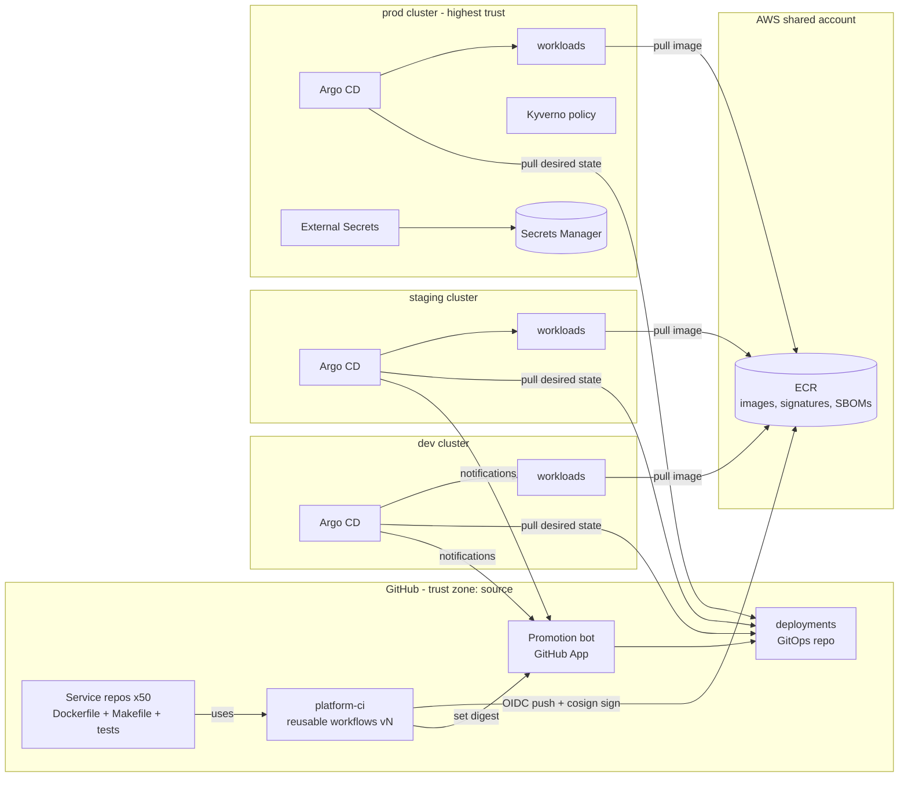

# Build Plan: CI/CD Platform for ~50 Microservices

> **How to read this.** You asked for a build order, so Sections 12–13 (build sequence and first-milestone tasks) are the core of this plan. The other sections are short and exist so the order can be checked and challenged.
>
> **No existing system was available to inspect.** The workspace contains only a README that says it is empty. So every statement here about your current stack, team or services is an **assumption**, marked **[A]** and collected in Section 5. Most of the order holds whatever tools you use. If your answers change the tool choices, the steps stay largely the same. The one exception is if services don't run on Kubernetes: then the deployment half of the plan changes (see Open Questions).

---

## 1. Summary

- **What:** A shared build-and-deploy platform, so that ~50 existing microservices, owned by about 8–10 teams, all go through the same reviewed path from commit to production. It replaces today's mix of team-specific pipelines and manual deploys **[A]**.
- **Shape:** Shared, versioned **CI templates** build, test, scan and sign one container image per commit. A **GitOps repo** (a Git repository that records what should run in each environment) is the single record of what runs where. **Argo CD**, running inside each cluster, makes the cluster match that repo. You move a release from dev to staging to prod by changing an image reference in Git, so every change has an audit trail and you roll back by reverting a commit.
- **Key decisions:**
  1. Build each image once and promote that exact image through every environment.
  2. Deploys are pulled by the cluster (Argo CD), not pushed from CI, so CI holds no cluster credentials.
  3. One platform-owned Helm chart covers most services. There's a raw-manifest option for the services that don't fit.
  4. Migrate services in waves (2 pilots → 5 → 15 → 28), not all at once.
  5. Security controls (image signing, admission policy) start in report-only mode and are enforced once services have moved over.
- **Milestone 1 (≈4–6 weeks):** An inventory of all 50 services, three spikes on the riskiest unknowns, and one real stateless service going from PR to **production** through the new pipeline. It ends with a timed rollback drill.
- **Top risks:**
  1. The services are more varied than the standard path can absorb.
  2. Putting live services under Argo CD causes restarts or config drift.
  3. Service teams don't have time to migrate.
  4. A template change breaks 50 pipelines at once.
  5. Security and access approvals hold up the first production deploy.

## 2. Context and Goals

- **Problem [A]:** Each team built its own pipeline, using Jenkins jobs, ad-hoc scripts, or manual `kubectl`/`helm` from laptops. Nobody can answer "what version is running in prod and who approved it?" quickly. Rollbacks are improvised. Security fixes to build tooling have to be made in ~50 places.
- **Goals:**
  - Every service deploys through one standard, auditable path.
  - Rollback is fast and boring.
  - A new or migrated service can be onboarded in days, not weeks.
  - The old CI is switched off.
- **Non-goals:**
  - Provisioning Kubernetes clusters (they're assumed to exist and be managed by Terraform elsewhere).
  - Replacing the observability stack.
  - A service mesh.
  - A developer portal such as Backstage.
  - Per-PR preview environments.
  - Moving to a monorepo.
  - Coordinated multi-service release trains. Services deploy independently and must stay backward compatible.
  - Non-container workloads.
- **Success measures** (DORA metrics, the four standard delivery measures, baselined in M1 and then tracked):

| Measure | Baseline | Target at end of M4 |
|---|---|---|
| Services on the platform | 0 / 50 | 50 / 50, old CI decommissioned |
| Lead time, merge → prod | Measure in M1 | < 1 day p50 |
| Change failure rate | Measure in M1 | ≤ 15% |
| Time to roll back | Measure in M1 | ≤ 5 min p95 |
| Onboarding effort (standard-path service) | n/a | ≤ 2 engineer-days |

## 3. Drivers, Requirements, and Constraints

**Ranked quality attributes** (all targets are **[A]**, to be confirmed in M1):

| # | Attribute | Measurable target | Why it ranks here |
|---|---|---|---|
| 1 | **Deploy safety** | Rollback ≤ 5 min p95. Zero production incidents caused by the migration itself. Failed deploys never take down the running version. | If the platform causes one outage, nobody will adopt it. |
| 2 | **Adoption / migration throughput** | Standard-path service onboarded in ≤ 2 engineer-days. All 50 migrated in ~6 months. | The platform has no value until services are on it. Old and new running side by side doubles the cost. |
| 3 | **Supply-chain integrity & auditability** | 100% of prod images built by platform CI, signed, and traceable to a commit and an approver. No long-lived cloud keys in CI. No human write access to prod outside break-glass. | This is the main reason to centralise. Strict enforcement before adoption would only block teams, so it ranks below adoption. |
| 4 | **Feedback speed** | PR CI p50 ≤ 10 min, p90 ≤ 15 min. Merge → dev ≤ 15 min. | It drives developer satisfaction, and it can be tuned later. |
| 5 | **Platform operability & cost** | Run by ~3 engineers with business-hours support only. CI spend ≤ ~$3k/month. If the platform is down, running services are unaffected. | Small team, so prefer managed services. |

**Key functional requirements:** build/test/scan on PR; build-once-and-promote on merge; per-environment configuration; promotion gates (automatic for dev and staging, approved for prod); one-step rollback; database migrations as part of a deploy; secrets injected without being stored in Git; deploy notifications; a break-glass path.

**Constraints [A]:** GitHub (cloud) for source code; AWS with EKS dev/staging/prod clusters (one AWS account per environment); 3 platform engineers; services mainly in Java/Kotlin, Go, Node and Python; one repo per service; SOC 2–style change management (prod changes need a reviewer recorded).

**Hard parts:**
1. **Variety across 50 services.** Unknown build tools, test setups and deploy quirks decide whether one standard path covers 80% of services or 40%.
2. **Moving live services under GitOps.** What's running in the cluster rarely matches any manifest exactly. Taking over a running service without restarts or config regressions is new territory for the team.
3. **Database migrations during deploys.** If ordering or backward compatibility is wrong, deploys break and rollback becomes unsafe.
4. **Changing 50 pipelines at once.** One bad template release can break every team's CI the same morning.
5. **Organisational adoption.** Service teams have to spend time migrating. Long-lead approvals (security review of Argo CD in prod, IAM changes, GitHub org admin) sit on the critical path.

## 4. Current State

Nothing was available to inspect. Assumed context **[A]**:
- ~50 services already in production on EKS. Manifests are scattered (some Helm, some raw YAML, some only live in the cluster).
- Most services build on Jenkins. Some already use GitHub Actions.
- Secrets come from a mix of AWS Secrets Manager and hand-created Kubernetes Secrets.
- A metrics stack exists (Prometheus or Datadog) and Slack is used for notifications.

The plan follows these conventions: Terraform for infrastructure, one repo per service, Dockerfiles in service repos. M1 task T2 (the inventory) replaces these assumptions with facts.

## 5. Assumptions and Open Questions

| Assumption | Impact if wrong | How / when validated |
|---|---|---|
| Services run on Kubernetes (EKS) | The CD design (Argo CD, Helm) is replaced by ECS/VM tooling. M1 is re-planned. | Answer before kickoff. Confirmed by inventory T2, week 1. |
| GitHub is the source control system | If GitLab: switch to GitLab CI `include:` templates. The order is unchanged. | Before kickoff |
| One repo per service | A monorepo needs build-only-what-changed detection. Add a spike, +1–2 weeks. | Before kickoff |
| Services already exist and run in prod | If greenfield: drop the migration waves, and M3/M4 shrink a lot. | T2, week 1 |
| ≥ 60% of services fit the standard path with small changes | More services need the raw-manifest option and M4 grows | T2 + spike S1, week 2–3 |
| Platform team of 3 engineers, and service teams can give 1–5 days each to migrate | Every size estimate scales with this | Agree with eng leadership in week 1 |
| Prod change approval = a reviewed PR is enough for compliance | Formal change tickets may be needed (ServiceNow etc.), adding an integration task | Security/compliance, week 1 |
| A metrics backend exists for canary analysis | M3 progressive delivery is delayed | T2, week 1 |

**Open questions** (owner → default if no answer → deadline):
- Where do workloads run? → Platform lead → EKS → before kickoff.
- Is there a mandate and date to retire the old CI? → Eng leadership → "retire by end of M4" → week 2.
- Which compliance regime applies? → Security → SOC 2-style PR approval → week 2.
- Can GitHub-hosted runners reach internal package registries? → Network team → no; answered by spike S3 → week 3.

## 6. Architecture Overview

**How it fits together:**
1. Service repos call versioned reusable workflows from `platform-ci`.
2. On merge, CI builds an image, pushes it to ECR by digest (an image's content hash) using short-lived GitHub OIDC credentials, signs it, and hands the digest to the promotion bot.
3. The bot writes the digest into `deployments/envs/dev/<svc>/`.
4. Each cluster's own Argo CD pulls from `deployments` and applies the change.
5. When dev is healthy, the bot promotes to staging automatically. For prod, it opens a PR that the owning team must approve.

CI never holds cluster credentials. Clusters never accept inbound deploy traffic.

| Component | Responsibility | Owns data | Interfaces | Technology | Key deps |
|---|---|---|---|---|---|
| CI Templates (`platform-ci`) | Lint, test, build, scan, sign, SBOM | Workflow definitions | `workflow_call` with typed inputs, semver tags | GitHub Actions | GitHub, ECR |
| Service Chart (`platform-charts`) | Standard Kubernetes resources for a service | Chart source | Helm values schema (`values.schema.json`), semver | Helm 3 | — |
| GitOps Repo (`deployments`) | Desired state per environment per service | Image digests, env values, chart versions | Git paths `envs/<env>/<svc>/` | Git + CODEOWNERS | — |
| Promotion Bot | Writes digests, auto-promotes dev→staging, opens prod PRs | None (writes to `deployments`) | `repository_dispatch` events, GitHub API | GitHub App + `promote.yml` workflow | GitHub |
| Argo CD (one per cluster) | Make the cluster match Git, report health | Derived state only (can be rebuilt) | ApplicationSet over `envs/<env>/*`, notifications | Argo CD | `deployments`, ECR |
| Artifact Registry | Store immutable images, signatures, SBOMs | Images | OCI (the standard container image format) | ECR (immutable tags, scan on push) | — |
| Policy | Reject unsigned / non-ECR / `:latest` images in prod | Policy definitions | Kubernetes admission webhook | Kyverno | ECR, Sigstore |
| Secrets Sync | Get secrets into pods without storing them in Git | None (Secrets Manager is the record) | `ExternalSecret` resources | External Secrets Operator | Secrets Manager |
| Pipeline Insights | DORA metrics, deploy markers | Exported events | Dashboard | GitHub API export → existing metrics stack | — |
| Platform Infra (`platform-infra`) | IAM OIDC roles, ECR repos, Argo/Kyverno/ESO installs | Terraform state (S3 + DynamoDB lock, one state per env) | Terraform modules | Terraform | AWS |

## 7. Component Details

**CI Templates.**
- *Contract with service repos (kept small and language-neutral):*
  - a multi-stage `Dockerfile`;
  - `make lint` and `make test`;
  - optionally a `smoke` image or command, used after deploy.
  - Language caching is turned on with an input such as `cache: gradle|go|npm|pip`.
- *Does not:* deploy anything, or hold cluster credentials.
- *Versioning:* releases tagged `v1.2.3` with a moving major tag `v1`. Repos pin `@v1`. Breaking changes ship as `v2` with a migration window of at least 4 weeks.
- *Failure mode:* a bad release breaks every consumer. Recovery is to move the `v1` tag back. Prevention: each release first runs against `sample-service`, then the pilot repos, before `v1` moves (see Section 14).

**Service Chart.**
- One library chart with: Deployment (probes mandatory), Service, HPA, PDB, ServiceAccount (IRSA, which gives pods AWS permissions), ExternalSecret, optional Ingress, optional PreSync migration Job.
- `values.schema.json` rejects invalid configuration at render time.
- Any service with no Deployment-shaped workload (StatefulSets, operators) uses the **raw-manifest option**: Argo CD points at a plain/Kustomize directory in `deployments`. That service still gets the same promotion, signing and policy.

**GitOps Repo.**
- Layout: `envs/<env>/<svc>/{values.yaml,image.yaml}`, plus `apps/` holding one ApplicationSet per environment.
- `image.yaml` records `digest` and `sourceCommit`.
- CODEOWNERS: the owning team owns `envs/prod/<svc>/`. The bot may commit directly only to `envs/dev/**` and `envs/staging/**`.
- CI on this repo renders every app, validates it with `kubeconform`, and runs `gitleaks` to block secrets.

**Argo CD.**
- One instance inside each cluster, so there are no cross-cluster credentials and a compromise affects only one cluster.
- SSO through the organisation's identity provider. The local admin account is disabled. Read-only for service teams, sync rights for platform on-call.
- Auto-sync with self-heal in dev and staging. Auto-sync in prod as well, because the reviewed PR merge is the gate.
- *If Argo CD is down,* running workloads are unaffected and only deploys pause.

**Policy (Kyverno).**
- Audit mode from M2, enforced in prod namespaces in M3, enforced across the whole cluster after M4.
- Rules: image from the platform ECR registry, signed by the `platform-ci` workflow identity, pinned by digest.

**Promotion Bot, Secrets Sync, Insights:** routine. Covered in Flows and Cross-cutting.

## 8. Data Design

| Entity | System of record | Writer | Retention |
|---|---|---|---|
| Container image + signature + SBOM | ECR | CI Templates only (IAM limited to each repo's own ECR repository) | Images ever deployed to prod: ≥ 1 year (audit). Others: last 30 per repo, or 90 days. |
| Desired state (digest, config, chart version) | `deployments` Git history | Promotion Bot (dev/staging) and humans via PR (prod) | Forever (Git) |
| Prod approval record | Merged PR in `deployments` | GitHub | Forever, plus a nightly export to S3 for audit |
| CI run logs | GitHub Actions | GitHub | 90 days. Export metadata to S3 if audit needs longer. |
| Secrets | AWS Secrets Manager | Service teams / Terraform | Per secret. **Never** in Git or images. |
| Live cluster state | Kubernetes | Argo CD | Derived. Can be rebuilt from Git. |

- **Consistency:** each promotion is a single Git commit (atomic per environment per service). The bot sets `digest=X, sourceCommit=Y` and does nothing if the values are already set. It refuses to write if the environment already holds a newer `sourceCommit`, which stops an older build from overwriting a newer one.
- **Schema evolution:** the chart's values schema is versioned with the chart. Each service pins a chart version, and the platform bumps it with automated Renovate PRs (Renovate is a dependency-update bot).
- **Backup:** Git and ECR are the durable stores. Restore is tested in M2 by rebuilding the dev Argo CD from scratch.

## 9. Key Flows

**Flow 1: Happy path, commit to prod.**
1. A developer opens a PR. `service-ci.yml@v1` runs lint, test, a build without pushing, and a Trivy scan. Required checks gate the merge.
2. On merge to `main`: build → push `ecr/<svc>@sha256:…` → cosign keyless sign → attach SBOM attestation.
3. `promote.yml` (bot) commits the digest to `envs/dev/<svc>/image.yaml`.
4. Argo CD dev syncs. A PostSync smoke Job runs. When the app is Synced, Healthy and the smoke test passed, an Argo notification sends `repository_dispatch` to `promote.yml`.
5. The bot commits to staging. Steps 4–5 repeat.
6. After staging is healthy, the bot opens a prod PR. A CODEOWNER on the service team approves and merges.
7. Argo CD prod syncs with a rolling update (`maxUnavailable: 0`). The team gets a Slack notification and a deploy marker appears in metrics.

**Flow 2 (failure): bad release in prod.**
1. New pods fail readiness. Because `maxUnavailable: 0`, the old pods keep serving and the rollout stalls.
2. `progressDeadlineSeconds` (5 min) passes. Argo marks the app Degraded and alerts the team and platform on-call.
3. On-call reverts the prod PR in `deployments` (one click), or runs `argocd app rollback` and then reverts in Git to stop drift.
4. Argo syncs the previous digest. Target: ≤ 5 min from decision to restored.
5. From M3, tier-1 services use Argo Rollouts canaries, which abort automatically when the error-rate check fails.

**Flow 3 (failure): DB migration fails.**
1. The PreSync migration Job fails, so Argo aborts the sync and no new pods start. The old version keeps running against the unchanged schema.
2. Migration tools (Flyway, Liquibase, Alembic) take a lock and run each migration in a transaction where the database allows it.
3. Policy: migrations must be expand/contract (add first, remove in a later release), so rolling back the app never needs a schema rollback. This is enforced through a PR checklist on migration files.

**Flow 4 (failure): GitHub outage during an incident.**
Break-glass:
1. On-call takes the `break-glass-deployer` role (audited, alarms on use).
2. They point the Argo prod app at an already-built, signed previous digest, or build locally and push to a `hotfix` ECR repo. Kyverno allows that repo only while break-glass is active.
3. The change is reconciled into Git within 24 hours.

Flow 4 is rehearsed once in M2.

## 10. Key Decisions

| Decision | Options considered | Rationale (drivers) | Reversibility | Revisit if |
|---|---|---|---|---|
| **CD model: GitOps pull (Argo CD)** | (a) Argo CD pull; (b) `helm upgrade` pushed from CI | (a) gives drift detection, Git audit, revert-to-rollback, and no cluster creds in CI (drivers 1, 3). (b) is faster to start but spreads prod credentials and gives no drift visibility. | **Hard.** Shapes the whole migration. | Services turn out not to be on Kubernetes |
| **Build once, promote by digest** | (a) promote the same digest; (b) rebuild per environment | (a) means what was tested is exactly what ships, and it makes signing meaningful (drivers 1, 3) | Hard | Never, in practice |
| **Single central `deployments` repo** | (a) one GitOps repo; (b) a `deploy/` folder in each service repo | (a) gives one place for promotion, audit, CODEOWNERS and policy checks. 50 services means a few hundred bot commits a day, which is fine. | Medium | Bot commits frequently conflict (> 5% retries), or teams need very different access rules |
| **One Argo CD per cluster** | (a) per cluster; (b) one hub managing all clusters | (a) needs no cross-cluster prod credentials and limits damage from a compromise (driver 3). 3 clusters is cheap to run. | Easy | More than ~6 clusters |
| **One library chart + raw-manifest option** | (a) shared chart; (b) each team keeps its own manifests; (c) Kustomize base | (a) gives fast onboarding and fixes made in one place (driver 2). The option keeps outliers from blocking the waves. | Medium | Spike S1 shows the chart can't reproduce > 30% of live services |
| **GitHub Actions reusable workflows on GitHub-hosted runners** | (a) GHA hosted; (b) GHA self-hosted runners on Kubernetes (ARC, Actions Runner Controller); (c) keep Jenkins | (a) has the least to operate (driver 5) and supports OIDC to AWS. (c) means running Jenkins yourselves. | Easy (hosted ↔ self-hosted) | Spike S3 shows runners can't reach internal registries, or CI spend > $3k/month → move to ARC |
| **Supply-chain controls report-only before enforced** | (a) audit → enforce; (b) enforce from day 1 | (a) protects adoption (driver 2) while still reaching driver 3 by the end of M3/M4 | Easy | A security incident or audit finding forces earlier enforcement |
| **Migrate in waves** | (a) waves 2 → 5 → 15 → 28; (b) big bang | (a) template defects show up on a few services at a time (drivers 1, 2) | — | — |

## 11. Cross-Cutting Concerns

- **Security (M1–M3).**
  - CI gets AWS access through GitHub OIDC. Each repo's IAM role may push only to its own ECR repository (M1).
  - Third-party actions are pinned by commit SHA. Branch rulesets require reviews (M1).
  - Images are signed with cosign keyless signing and carry an SBOM attestation (M1). Kyverno verifies them, report-only in M2, enforced in prod in M3.
  - Secrets go through External Secrets Operator (M1 chart support, used broadly from M2). `gitleaks` runs on `deployments`.
  - Argo CD uses SSO with RBAC and has no public endpoint.
  - **Top threats:**
    1. A malicious dependency or action in CI → pinning, scoped IAM, signing tied to the workflow identity.
    2. Abuse of write access to `deployments` → CODEOWNERS on prod paths, bot cannot write to prod.
    3. Compromised Argo CD → one per cluster, SSO, no admin user.
    4. Leaked cloud keys → none exist.
- **Reliability.**
  - Platform target: 99.5% during business hours, bounded by GitHub's own availability.
  - Workloads never depend on the platform being up.
  - Bot commits retry with rebase up to 5 times and are idempotent.
  - Break-glass procedure (M1 written, M2 rehearsed).
- **Observability.**
  - Argo notifications go to each team's Slack channel (M1). Deploy markers appear in metrics (M1).
  - Alerts: prod app Degraded or OutOfSync for > 15 min (M2); CI p90 duration and failure rate per template version (M2).
  - DORA dashboard (M2).
- **Performance.** ~50 services × ~20 merges/day **[A]**. The bottleneck is CI time, so M1 includes Docker layer caching and dependency caching. PR CI p50 is measured from the first pilot onward.
- **Cost.** ~50 × 20 runs × 10 min × 22 days ≈ 220k runner-minutes/month. That's roughly $1–2k/month at standard hosted-runner list prices (**check current GitHub pricing**). ECR storage is small thanks to lifecycle rules, and the Argo/Kyverno/ESO in-cluster footprint is small. Controls: per-repo concurrency cancellation, caching, a spend alert at $2.5k.
- **Operations.**
  - The platform team owns templates, the chart, Argo, policy and the bot, with business-hours on-call.
  - Service teams own their Dockerfile, tests, values, migrations and prod approvals.
  - Support: `#platform-help`, weekly office hours, runbooks in `platform-docs/runbooks/` (rollback, break-glass, onboarding, template rollback).
- **AI-specific concerns:** not applicable. There are no AI components.

## 12. Build Sequence

Team assumption: 3 platform engineers full-time. Service teams give 1–5 days per migrated service. Sizes are rough ranges, not commitments.

| | **M1 — Thin slice to prod + spikes** | **M2 — Golden path v1 + Wave 1** | **M3 — Wave 2 + safety and enforcement** | **M4 — Wave 3 + decommission** |
|---|---|---|---|---|
| **Goal** | Prove the whole path end to end in prod. Clear the unknowns about variety, live takeover, DB migrations and runner network access. | Make the path repeatable and safe for teams other than the platform team | Scale migration. Add automatic failure detection. Turn on enforcement. | Finish migration and retire the old CI |
| **Scope (in)** | Inventory of all 50 services. Spikes S1–S3. Repos, OIDC, ECR, chart v0, workflow v0, Argo CD in all 3 clusters, bot. **Pilot-S** (stateless) to prod. Rollback drill. | **Pilot-D** (DB + secrets) to prod. 5 Wave-1 services from 2–3 teams. Smoke gate. Kyverno report-only. DORA dashboard. Alerts. Onboarding guide + template repo. Break-glass rehearsal. Argo rebuild test. | 15 services (cumulative 22). Argo Rollouts canary for tier-1 services. Kyverno enforced in prod for migrated namespaces. Renovate-driven template/chart bumps. | Remaining 28 services, including the raw-manifest cases. Jenkins jobs disabled, then removed. Cluster-wide enforcement. Prod human write access removed. |
| **Excluded** | Canary, enforcement, any other service | Canary, enforcement | Contract testing, preview envs | Items in Section 17 |
| **Exit criteria** | Pilot-S deployed to prod 3+ times via a merged prod PR. Prod rollback drill ≤ 5 min. Inventory 50/50 rows confirmed by owners. Each spike's result written up with a decision. | 7 services in prod. Wave-1 onboarding median ≤ 2 eng-days (measured). Zero migration-caused incidents. Break-glass rehearsed. | 22 services. One canary auto-abort shown in staging. Kyverno blocks an unsigned image in prod (test). CI p50 ≤ 10 min across services. | 50/50 services. Jenkins prod deploy credentials revoked. 100% of prod pods pass the signature policy. |
| **Depends on** | Day-1 access requests (critical path) | M1 | M2 (stable chart v1, onboarding guide) | M3 |
| **Parallel** | Inventory and spikes run alongside the infra build | Dashboard/alerts run alongside Wave 1 | Canary/policy run alongside Wave 2 | Decommission runs alongside the last migrations |
| **Rough size** | 4–6 weeks | 3–5 weeks | 5–7 weeks | 6–10 weeks |

**Critical path:** day-1 approvals (IAM in prod account, Argo CD prod security review) → Argo CD in prod → Pilot-S to prod → chart/workflow v1 settled after Wave 1 → Wave 2 → Wave 3. **The migration waves are the long pole** (~100–150 engineer-days in total, split between platform and service teams **[A]**). Speed them up by having platform engineers write the migration PRs and by getting dated wave commitments from engineering managers in M1.

**Wave selection rule:**
- Wave 1: standard-path (tier A) services from teams willing to go early.
- Wave 2: a mix of A and B tiers, and at least one service per team.
- Wave 3: everything left, including tier C (raw-manifest option).
- Tier-1 (most critical) services go no earlier than Wave 2, so the path has run on 7+ services first.

**Per-service migration steps** (the same in every wave):
1. Fill in values / raw manifests.
2. Create the Argo app with **auto-sync off**, then check the diff against the live cluster until it's empty or explained.
3. Turn on auto-sync in dev → staging → prod.
4. Disable the old pipeline but keep it restorable for 2 weeks.
5. Delete the old pipeline.

## 13. First Milestone Task Breakdown

Repos: `platform-ci`, `platform-charts`, `deployments`, `platform-infra`, `platform-docs`.

| # | Task | Where | Done when | Order / parallel |
|---|---|---|---|---|
| T1 | **File long-lead requests**: GitHub org-admin rights to create repos, rulesets and a GitHub App; IAM permission to create the OIDC provider and roles in dev/staging/prod/shared accounts; security review slot for Argo CD, Kyverno and ESO in prod; change approval for the Pilot-S cutover | Tickets / `platform-docs/decisions/access.md` | Every request has an owner and a due date. Prod review is booked for ≤ week 3. | **Day 1**, critical path |
| T2 | **Build the service inventory**: for each service record owner, language/build tool, current CI, how it's deployed, manifest source, DB + migration tool, secret source, test duration, tier (A/B/C), criticality | `platform-docs/inventory/services.yaml` | 50/50 rows confirmed by owning teams. Tier counts published. Pilot-S and Pilot-D chosen. | Week 1–2, parallel with T4–T9 |
| T3 | **Baseline DORA metrics** from Jenkins history and deploy logs | `platform-docs/metrics/baseline.md` | Lead time, deploy frequency and change failure rate recorded for ≥ 10 services | Week 1–2, parallel |
| T4 | **Create platform repos** with branch rulesets (2 reviews on `platform-ci`/`platform-charts`, CODEOWNERS on `deployments/envs/prod/**`) | GitHub org | A direct push to `main` is rejected in each repo | Week 1, after T1 org rights |
| T5 | **Terraform: GitHub OIDC provider, per-repo ECR repos (immutable tags, scan on push, lifecycle policy), per-repo push roles** | `platform-infra/modules/service-registry/`, `platform-infra/envs/shared/` | `terraform apply` through CI. The Pilot-S workflow can push to its own repo and **fails** to push to another (tested). | Week 1–2, after T1 IAM |
| T6 | **Write `service-ci.yml` v0**: checkout → `make lint test` → buildx with GHA cache → push by digest on `main` → cosign keyless sign → syft SBOM attest → Trivy (report-only). Outputs: `digest`, `sourceCommit`. | `platform-ci/.github/workflows/service-ci.yml` | `sample-service` (also created here) goes green. PR run p50 < 10 min over 10 runs. The signature verifies with `cosign verify`. | Week 1–3, parallel with T7 |
| T7 | **Write the library chart v0.1** (Deployment with required probes, `maxUnavailable: 0`, Service, HPA, PDB, ServiceAccount/IRSA, ExternalSecret, optional Ingress, optional PreSync migration Job) plus `values.schema.json` | `platform-charts/charts/service/` | `helm unittest` + `kubeconform` pass in CI. Chart published to the ECR OCI repo as `0.1.0`. | Week 1–3 |
| T8 | **Install Argo CD in the dev cluster** via Terraform/Helm with SSO and RBAC, plus an ApplicationSet over `deployments/envs/dev/*`. Repeat for staging, then prod after T1's security review. | `platform-infra/envs/{dev,staging,prod}/argocd/` | A user logs in via SSO and sees the apps. The local admin is disabled. The prod install is signed off by Security. | Dev week 2. Prod by week 4 (**critical path**). |
| T9 | **Set up the `deployments` layout and CI** (`envs/<env>/<svc>/`, render-all, kubeconform, gitleaks) | `deployments/` | A PR with a broken value or a fake secret fails CI | Week 2, after T7 |
| T10 | **Build the promotion bot**: GitHub App plus `promote.yml`, which sets digest+sourceCommit (no-op if equal, refuses older commits), auto-commits to dev/staging, opens prod PRs, and is triggered by an Argo notification `repository_dispatch` | `platform-ci/.github/workflows/promote.yml`, Argo notifications config in `platform-infra` | Integration test: two concurrent promotions both land without conflict. A deliberately older build is refused. | Week 2–4, after T8 dev + T9 |
| T11 | **Spike S1 — live takeover (3 days).** *Question:* can a running service be adopted by Argo CD with no restart and no config change? *Build:* render Pilot-S and 4 varied services from the inventory with the chart, then run Argo diff against the live clusters in manual-sync mode. | `platform-docs/spikes/s1-adoption.md` | Diff results for 5 services written up. **Changes plan if** the chart can't reproduce > 30% of services → promote the raw-manifest option to first class in M2 and move tier-C services earlier. | Week 2–3, after T7/T8 dev |
| T12 | **Spike S2 — DB migrations as a PreSync Job (3 days).** *Question:* can Pilot-D's migration tool run safely as an Argo PreSync Job (locking, idempotent, < 5 min)? *Build:* run it in dev, including a deliberately failing migration. | `platform-docs/spikes/s2-migrations.md` | Failure blocks the rollout and the old version keeps serving (Flow 3 shown). **Changes plan if** migrations are long-running or can't be retried safely → run migrations as a gated CI step before promotion, and add that variant to the chart. | Week 2–4, after T7 |
| T13 | **Spike S3 — runner network access (2 days).** *Question:* can GitHub-hosted runners reach internal package registries and test dependencies for the 3 most common stacks? | `platform-docs/spikes/s3-runners.md` | Pass/fail per stack written up. **Changes plan if** they can't → add ARC self-hosted runners in `platform-infra` during M1 (+1–2 weeks, moves the M1 exit). | Week 1–2 |
| T14 | **Onboard Pilot-S**: Makefile contract, values in `deployments/envs/*/pilot-s/`, takeover with no diff (S1 method), auto-sync dev → staging → prod, old Jenkins job disabled | Pilot-S repo, `deployments/` | 3 prod deploys via merged prod PRs. Old job disabled. Zero incidents. | Week 4–6, **critical path** |
| T15 | **Run the rollback drill**: ship a deliberately failing image (bad readiness) to staging, then to prod at a low-traffic time with approval, and revert via Git | Pilot-S, `platform-docs/runbooks/rollback.md` | Old pods kept serving throughout. Restore time ≤ 5 min, recorded. Runbook updated with what happened. | Week 5–6, after T14 |
| T16 | **Wire up notifications and deploy markers** (Argo → team Slack, deploy annotation in metrics) | `platform-infra/envs/*/argocd/notifications.yaml` | A Pilot-S deploy posts to Slack and shows a marker on its dashboard | Week 3–5, parallel |
| T17 | **Write the runbooks**: rollback, break-glass (role + audited alarm), template rollback (move the `v1` tag back) | `platform-docs/runbooks/` | Reviewed by one service-team engineer who wasn't involved | Week 4–6, parallel |

**Stubs allowed in M1** (to be removed in M2):
- Pilot-S may keep an existing hand-made Kubernetes Secret outside Argo's control.
- There's no staging smoke gate yet; promotion relies on health status only.
- Trivy runs report-only.

## 14. Testing and Validation Strategy

- **Platform code:**
  - Every `platform-ci` change runs against `sample-service` (one per main language from M2).
  - Every chart change renders **all onboarded services' values** and shows the diff in the PR.
  - Release process: tag → pilot repos pin the new exact version for 2 days → move the `v1` major tag. This is the main defence against breaking 50 pipelines at once.
- **Service-level:** unit and integration tests through `make test` (DB dependencies as service containers). Post-deploy smoke Job in dev and staging gates promotion (M2).
- **Cross-service compatibility:** handled by the staging smoke gate plus the backward-compatibility rule. Consumer-driven contract testing is deferred until incident data shows cross-service breakages (Section 17).
- **What blocks a release:** failing lint/test/build, a failing render or kubeconform in `deployments`, gitleaks findings, critical CVEs (warnings in M1–M2, block in M3), a failing smoke test, and an unsigned image in prod (M3).
- **Verifying the Section 3 targets:** rollback time via drills (M1, repeated each wave); onboarding effort logged per service from M2; CI p50/p90 from the GitHub API on the dashboard (M2); signature coverage from Kyverno policy reports (M2 on).

## 15. Rollout, Migration, and Rollback

- **Rollout:** by service, in waves (Section 12). Each service moves through dev → staging → prod independently.
- **Old and new side by side:** the old pipeline stays disabled but restorable for 2 weeks after a service's prod cutover. During that time, only one system may deploy a given service. The old job is disabled *before* auto-sync is turned on in prod, so two systems never fight over the same resources.
- **Rollback of a cutover:** turn off Argo auto-sync for the app and delete the Argo Application with `--cascade=false` (resources stay running). Re-enable the old job.
- **Point of no return:** per service, when the old pipeline is deleted (cutover + 2 weeks). For the platform as a whole, when Jenkins deploy credentials are revoked in M4. That happens only after 50/50 services are on the platform and there have been 4 weeks with no rollback to the old path.
- **Template/chart rollback:** move the `v1` tag back, or revert the chart version in `deployments`, through a Renovate revert PR.

## 16. Risks and Mitigations

| Risk | Likelihood | Impact | Mitigation | Early warning sign | Owner |
|---|---|---|---|---|---|
| Services vary more than expected (> 20% tier C) | Medium | High | Inventory first. Raw-manifest option. S1 informs M2. | T2 tier counts. S1 diff results. | Platform lead |
| Live takeover causes restarts or config regressions | Medium | High | Manual-sync diff until empty. Low-traffic cutovers. Old pipeline kept 2 weeks. | Unexplained diffs in S1 | Platform engineer on cutover |
| Service teams lack capacity to migrate | High | High | Platform engineers write migration PRs. Dated wave commitments from EMs. Onboarding ≤ 2 days. | Wave 1 slips > 1 week | Eng leadership |
| Template release breaks many pipelines | Medium | High | Pin to the exact version on pilots first. Sample-service tests. Tag rollback runbook. | CI failure rate spikes after a release | Platform lead |
| Prod security review or IAM access delays M1 | Medium | Medium | Filed day 1. Fallback: M1 exits at staging and prod moves to early M2. | No review date by week 2 | Platform lead + Security |
| Flaky tests make gates noisy, so teams bypass them | Medium | Medium | Per-repo flake rate on dashboard. Quarantine label. | Re-run rate > 10% | Service teams |
| Non-backward-compatible migrations make rollback unsafe | Medium | High | Expand/contract policy. PR checklist. S2. | Migration files that drop or rename columns | Service teams |
| GitHub outage during an incident | Low | High | Break-glass rehearsed in M2 | — | Platform on-call |
| Platform team becomes a support bottleneck | High | Medium | Docs, office hours, template repo, measured onboarding time | `#platform-help` response time > 1 day | Platform lead |
| CI cost overrun | Low | Medium | Caching, concurrency cancellation, spend alert. Move to ARC if needed. | Monthly minutes > 300k | Platform lead |

## 17. Deferred Work and Future Evolution

| Deferred | Build it when |
|---|---|
| Consumer-driven contract tests (Pact) | ≥ 2 incidents in a quarter caused by cross-service API breaks |
| Per-PR preview environments | Teams report staging contention as their top source of slowness |
| Developer portal (Backstage) | Onboarding drops below 1 day, and discoverability becomes the main complaint |
| ARC self-hosted runners | S3 fails, or CI spend goes over $3k/month |
| Automatic prod promotion for low-risk services | Change failure rate ≤ 10% for 2 months on that service |
| Hub Argo CD / multi-region | More than ~6 clusters |

**Shortcuts taken on purpose:**
- Report-only security scanning and policy until M3. Paid back by enforcing in M3/M4.
- Business-hours-only platform on-call. Revisit if deploys become common outside business hours.

**Extension points:** template inputs, chart values schema, the raw-manifest option, Kyverno policy set.

## 18. Next Steps

1. **Today:** file the T1 access and security-review requests. The prod Argo CD review is the longest-lead item.
2. Answer the open questions below, especially where workloads run and whether there's a monorepo. These are the only answers that change the structure.
3. Send the T2 inventory template (`platform-docs/inventory/services.yaml`) to all EMs with a deadline at the end of week 1.
4. Create the five platform repos and `sample-service`, then start T6 and T7 in parallel.
5. Agree the team-capacity assumption and the M4 Jenkins retirement date with engineering leadership.

---

### Open questions that would most change this plan

1. **Do all 50 services run on Kubernetes (and which one)?** If some run on ECS, VMs or serverless, the deployment half of the plan (Argo CD, chart, Kyverno) needs a second path, and M1 needs another spike.
2. **Are these 50 live services being migrated, or new services being built?** If they're new, the migration waves, the live takeover spike and most of M3–M4 go away, and the timeline roughly halves.
3. **One repo per service, or a monorepo?** A monorepo needs build-only-what-changed detection and a different CI template design. Add a spike to M1.
4. **What are your source control system and current CI, and is retiring the old CI mandated with a date?** This decides the template technology and whether M4's decommission is a firm goal.
5. **How big is the platform team, and what compliance regime applies to prod changes?** Team size scales every estimate. Formal change-ticket rules (SOX/PCI-style) would add a change-management integration to the prod approval step.
