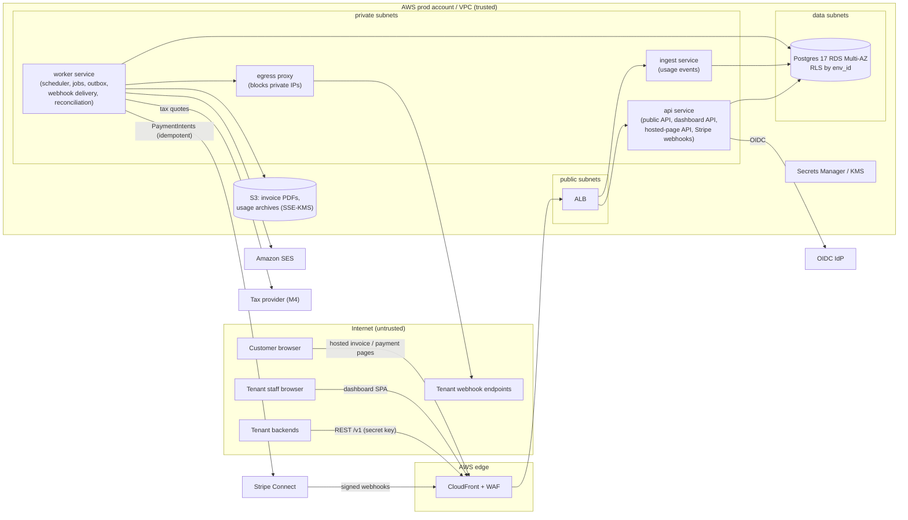
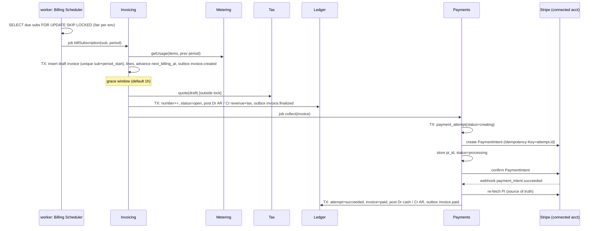

# Architecture and Build Plan: Multi-Tenant SaaS Billing Platform

> **How to read this plan.** The workspace is empty. `README.md` says there is "no existing code, documentation, configuration, or data", so this is a new build with no organisational context. The request is one line, so I made the plan-shaping decisions myself and marked each assumption with **[A#]**. The biggest unknown is what "multi-tenant" means. I've read it as **a billing platform sold to many businesses (tenants), each of which bills its own customers**, which is what products like Chargebee, Recurly, Orb and Lago do. If you meant "billing for our own multi-tenant SaaS product", go to §5, question Q1, first. That answer cuts the scope a lot and probably means buying a billing product instead of building one.

**Terms used throughout**

| Term | Meaning |
|---|---|
| **Platform** | The system in this plan, run by us. |
| **Tenant** | A business that signs up for the Platform to bill its own customers. |
| **Environment** | Each tenant has a `live` and a `test` environment. Their data, API keys and payment connections are fully separate. Every business row is scoped to one environment. |
| **Customer** | One of a tenant's end customers, the party being invoiced and charged. |
| **Minor units** | The smallest unit of a currency (cents for USD, 1 for JPY, fils for KWD). |
| **RLS** | Postgres Row-Level Security: the database itself filters rows by a policy. |
| **Outbox** | A table written in the same transaction as a state change. A worker later reads it and publishes the events. |

---

## 1. Summary

- **What:** A multi-tenant billing platform. B2B SaaS tenants use it to define prices (flat, per-seat, usage-based, tiered), manage subscriptions, meter usage, produce invoices, collect payments through their own Stripe account, and run dunning (retrying failed payments and reminding customers). Tenants use a REST API, a dashboard and outbound webhooks. Customers use hosted invoice and payment pages.
- **Shape:** A **modular monolith**: one TypeScript codebase with enforced module boundaries, deployed as three services (`api`, `ingest`, `worker`) on AWS ECS Fargate. They share **one Postgres database (RDS, Multi-AZ)**. Tenants share tables and are isolated by RLS. Background work uses a Postgres-backed job queue and an outbox.
- **Key decisions:**
  1. **Shared schema with Postgres RLS on `env_id`** for tenant isolation, enforced by the database and not only by application code. This is hard to reverse.
  2. **We own the billing engine (rating, invoicing, ledger). Payment processing sits behind a gateway interface, with Stripe Connect Standard as the first implementation.** The tenant is the merchant of record. Card data never touches us (PCI SAQ A).
  3. **Money correctness is designed in:** amounts stored as integers in minor units, finalized invoices that can't be changed (corrections go through credit notes), a double-entry accounts-receivable ledger with invariants checked nightly, and idempotency keys on every money-moving call.
  4. **One primary datastore, including raw usage events**, in partitioned Postgres tables. This depends on a throughput spike (S3), with a named fallback if it fails.
  5. **A billing scenario corpus** (YAML scenarios with expected invoices, signed off by a finance reviewer) acts as the correctness gate in CI from Milestone 1.
- **First milestone (5–6 weeks):** One thin slice deployed to staging through the real pipeline. A seeded tenant creates a customer and a flat monthly subscription over the API. Advancing a test clock produces an invoice, which is finalized, charged through a Stripe Connect test account, marked paid from Stripe's webhook, posted to the ledger, and announced to the tenant's webhook endpoint. Four spikes clear the biggest unknowns: RLS, Stripe idempotency, ingest throughput, and the billing rules.
- **Top risks:** billing-math errors (proration, rounding, month-end dates); double or lost charges when Stripe calls time out; a cross-tenant data leak; Stripe Connect platform approval delaying go-live; usage volume outgrowing Postgres.

## 2. Context and Goals

- **Problem:** SaaS companies with usage-based or hybrid pricing either write their own billing code, which is fragile and eats engineering time, or bend their pricing to fit their processor's billing product. The Platform offers a dependable, processor-independent billing engine with strong usage metering.
- **Goals:**
  - Tenants can launch a flat, per-seat or usage-based plan and get correct invoices and collected payments without writing billing logic.
  - Zero double charges and zero unexplained differences against the processor.
  - A tenant can go from signup to the first live invoice in under one day of integration work, measured with design partners.
- **Non-goals (v1):** being merchant of record or holding funds; revenue recognition (ASC 606/IFRS 15); currency conversion; quotes/CPQ; feature entitlements; accounting-system integrations beyond CSV export; multi-region deployment and data residency; payment processors other than Stripe; MRR/churn analytics.
- **Success measures (6 months after design-partner launch) [A1]:** 3–5 design-partner tenants billing live; ≥99.5% of invoices finalized within 1 h of their scheduled time; 0 duplicate charges; daily reconciliation with 0 unexplained differences older than 48 h; tenant-reported billing errors below 1 per 10,000 invoices.

## 3. Drivers, Requirements, and Constraints

**Ranked quality attributes** (higher rank wins in a trade-off)

| # | Attribute | Measurable target | Why it matters |
|---|---|---|---|
| 1 | **Financial correctness and auditability** | 0 duplicate charges. Every invoice can be reproduced from its stored inputs. The ledger balances on every run of the nightly invariant job. 100% of billing-scenario corpus passes before release. | A billing error is a trust-ending event for a tenant and their customers. |
| 2 | **Tenant isolation** | 0 cross-environment reads or writes. Enforced by the database (RLS) and verified by an automated cross-tenant test suite on every PR. | One leak ends the business. B2B buyers will audit this. |
| 3 | **Durability and timeliness of billing** | Committed data survives an AZ failure with RPO 0 (synchronous Multi-AZ). Regional loss: RPO ≤ 5 min, RTO ≤ 8 h. API availability 99.9% monthly. A 1st-of-month run of 200k subscriptions finalizes in ≤ 1 h. **[A2]** | Late or missing invoices directly delay tenants' cash. |
| 4 | **Pricing evolvability** | A new pricing model (e.g. "package" pricing) can be added in ≤ 1 week with no migration of existing data. | Pricing flexibility is what the product sells. |
| 5 | **Time to market** | First design partner billing live in ~6 months. **[A1]** | Funding and runway. |
| 6 | Cost | Production infrastructure ≤ $5k/month at launch scale. **[A3]** | Matters, but ranks below everything above. |

**Assumed scale [A2]:** 50 tenants in year 1 and 500 in year 2; up to 1M customers in total; 200k invoices/month, mostly on the 1st; API at 200 rps peak; usage ingest at 200 events/s sustained and 2,000 events/s peak across all tenants, with one tenant able to burst to 1,000 events/s.

**Key functional requirements:** catalog (products, versioned prices: flat, per-unit, tiered, volume); customers; subscriptions (trials, anchors, upgrades and downgrades with proration, cancellation); usage metering (sum, count, max); invoices (draft → open → paid / void / uncollectible), gapless per-tenant invoice numbers, PDFs and email; credit notes, refunds, customer credit balance; payment collection and dunning; test mode with test clocks; idempotent REST API; signed outbound webhooks; dashboard; audit log.

**Constraints [A4]:** team of 6 engineers (4 backend, 1 frontend, 1 platform/SRE), strongest in TypeScript, nobody with deep billing-domain experience; AWS; single region (us-east-1 unless Q3 says EU); PCI scope limited to SAQ A; tenants will expect SOC 2, so controls go in from day one; GDPR processor obligations for customer personal data.

**Hard parts**

1. **Billing math:** proration, rounding, month-end anchors (Jan 31 → Feb 28 → Mar 31), trials, mid-cycle changes. Bugs here are silent and they compound.
2. **Exactly-once charging across a network boundary:** a timeout leaves us unsure whether Stripe charged the card. Stripe webhooks arrive duplicated and out of order.
3. **Usage metering at volume:** deduplication, late events, and deciding when a period is closed.
4. **Tenant isolation in a shared database:** RLS has known gaps (table owners bypass it, views, unique constraints that reveal other tenants' data, connection pooling).
5. **External dependency on Stripe Connect:** platform approval is a long-lead item, and Connect's behaviour for off-session charges on connected accounts needs verifying.
6. **Retention versus erasure:** invoices must be kept for up to 10 years, while GDPR erasure requests apply to customer personal data.

## 4. Current State

There is nothing to build on. The workspace (`w737ce7d9/`) contains only `README.md`, which says the directory is intentionally empty. There are no repo conventions, infrastructure or organisational platform to follow, so every stack choice below is an assumption (**[A4]**), and the architecture doesn't depend on them. If the team is stronger in Kotlin or Go, swap the language and the plan stays the same.

## 5. Assumptions and Open Questions

**Assumptions**

| # | Assumption | Impact if wrong | How / when validated |
|---|---|---|---|
| A1 | We are building a billing **platform** for many tenants, with a 6-month target for the first live design partner | If it's billing for our own SaaS: drop Tenancy, Environments, Connect, the dashboard and webhooks, and seriously consider buying Stripe Billing, Chargebee or Orb instead | Q1, before M1 starts |
| A2 | Scale as in §3: ≤2k usage events/s peak, 200k invoices/month | Much higher ingest means raw events need a dedicated store (ClickHouse or Kinesis) | Spike S3 in M1; design-partner volumes by end of M1 |
| A3 | Infrastructure budget ≤ $5k/month at launch | Lower: single-AZ staging, smaller instances. Higher: no change | Q5 |
| A4 | 6 engineers, TypeScript, AWS, no org-mandated stack | Language and cloud swap; structure unchanged | Q5, before M1 |
| A5 | Stripe-only at launch; tenant is merchant of record | If tenants need Adyen/Braintree or need us as merchant of record, the scope and compliance burden change a lot | Q2, before M1 |
| A6 | US-hosted single region is acceptable to first tenants | EU tenants may need EU hosting, which means deploying the stack per region ("cells") earlier | Q3, by end of M1 |
| A7 | Tenants accept manually configured tax rates until M4 | Any tenant that needs automatic US sales tax or EU VAT pulls the tax provider into M2 | Design-partner interviews during M1 |
| A8 | A finance or billing-ops advisor (part-time) can review the scenario corpus | Without one, billing rules are guesses: the top risk gets worse | Name them in week 1 |
| A9 | Keeping invoices 10 years overrides erasure for fields legally required on invoices | Legal exposure | Counsel review during M2 |

**Open questions**

| # | Question | Owner | Default if no answer | Needed by |
|---|---|---|---|---|
| Q1 | Platform for many businesses, or billing for our own SaaS? | Product lead | Platform | Before M1 |
| Q2 | Stripe-only at launch? Merchant of record? | Product lead | Stripe Connect Standard; tenant is merchant of record | Before M1 (Connect application is long-lead) |
| Q3 | Where are the first tenants? Any data-residency requirements? | Sales / founders | us-east-1 single region | End of M1 |
| Q4 | Design partners' real usage volumes and pricing models | Product lead | §3 assumptions | End of M1 |
| Q5 | Team size, stack, budget, hard date | Eng lead | A3, A4 | Before M1 |

## 6. Architecture Overview



**How the parts fit together.** All three services are built from one codebase. Each one starts a different entrypoint and loads only the modules it needs. `api` handles every synchronous request. `ingest` takes usage events in high-volume batches, kept separate so a burst can't starve `api`. `worker` runs everything that is scheduled or can wait: the billing scheduler, invoice finalization, payment attempts, dunning, PDF rendering, email, outbox relay, webhook delivery and reconciliation. Every state change that other modules or tenants need to know about writes an outbox row in the same transaction, so events are never lost and never published for a transaction that rolled back. Postgres is the only system of record. S3 holds rendered documents and archived usage data. Stripe is reached only from `worker`, and inbound Stripe webhooks arrive through `api`.

**Component table** (modules inside the monolith; each module is the only writer of its tables)

| Component | Responsibility | Owns data | Exposes | Technology | Key deps |
|---|---|---|---|---|---|
| Tenancy & Identity | Tenants, environments, API keys, dashboard users and roles, request scoping | `tenants`, `environments`, `api_keys`, `users`, `memberships`, `idempotency_keys` | Auth middleware; `/v1/...` key management; dashboard session | Fastify plugin, OIDC | IdP |
| Catalog | Products and immutable, versioned prices and pricing models | `products`, `prices`, `price_tiers` | `/v1/products`, `/v1/prices`; `PricingModel` interface | TS + decimal.js | — |
| Customers | Customer records, billing details, tax IDs, links to processor customers | `customers`, `customer_tax_ids` | `/v1/customers` | — | Payments (link) |
| Subscriptions | Subscription lifecycle state machine, items, anchors, trials, schedule of changes | `subscriptions`, `subscription_items`, `test_clocks` | `/v1/subscriptions`, `/v1/test_clocks` | — | Catalog |
| Metering | Usage-event ingest, deduplication, aggregation per period, late-event handling | `meters`, `usage_events` (partitioned), `usage_period_totals` | `POST /v1/usage_events` (batch), `/v1/meters`; internal `getUsage(item, period)` | `ingest` service | — |
| Invoicing (Rating + Billing Scheduler) | Finds due subscriptions, prices lines, manages draft/finalize, numbering, credit notes | `invoices`, `invoice_lines`, `credit_notes`, `invoice_number_sequences` | `/v1/invoices`, `/v1/credit_notes`; jobs | `worker` | Subscriptions, Catalog, Metering, Tax, Ledger |
| Ledger | Double-entry accounts-receivable sub-ledger, customer credit balance, invariant checks | `ledger_accounts`, `ledger_transactions`, `ledger_entries` | Internal `post(transaction)`; `/v1/customers/{id}/balance` | Postgres constraints | — |
| Payments | `PaymentGateway` port, Stripe adapter, payment methods, attempts, refunds, inbound Stripe webhooks, reconciliation | `payment_methods`, `payment_attempts`, `refunds`, `processor_events`, `processor_connections` | `/webhooks/stripe`; `/v1/payment_methods`, `/v1/refunds` | Stripe SDK | Stripe, Ledger |
| Dunning | Retry schedules and customer reminders after payment failure; subscription status changes | `dunning_policies`, `dunning_runs` | Tenant configuration API | `worker` | Payments, Subscriptions, Notifications |
| Notifications & Documents | Invoice PDFs, emails, hosted invoice and payment pages | `documents`, `email_deliveries` | Hosted pages (Stripe Elements) | Playwright-based PDF render, SES | S3, SES |
| Webhooks (outbound) | Outbox relay, per-endpoint signed delivery, retries, dead-letter | `events` (outbox), `webhook_endpoints`, `webhook_deliveries` | `/v1/webhook_endpoints`, `/v1/events` | `worker`, egress proxy | — |
| Tax | `TaxProvider` port: manual rates first, provider in M4 | `tax_rates`, `tax_quotes` | Internal `quote(invoiceDraft)` | — | Tax provider (M4) |
| Audit | Append-only record of security- and money-relevant actions | `audit_log` | `/v1/audit_events`; dashboard view | — | — |
| Dashboard | Tenant staff UI | — (API client only) | Web UI | React + Vite SPA | `api` |

## 7. Component Details

**Tenancy & Identity**
- *Does:* authenticates every request and sets `app.env_id` for the transaction. *Does not* do any business authorization beyond role checks.
- *Interfaces:* secret API keys (`sk_live_…`, `sk_test_…`) are shown once and stored as SHA-256 hashes, looked up by an 8-character prefix. Publishable keys (`pk_…`) are used only by hosted pages. Dashboard users sign in through OIDC and get roles `owner`, `admin`, `developer` or `finance_viewer`.
- *Idempotency:* all `POST` requests accept an `Idempotency-Key` header, which is required on money-moving endpoints. The stored record is `(env_id, key, request_hash, response)` with a 24 h TTL. Replaying a key returns the stored response. Reusing a key with a different body returns `409`.
- *Failure:* if the IdP is down, the dashboard can't log in but the API keeps working because API keys don't use the IdP.

**Catalog.** Prices are immutable once referenced; editing one creates a new price. Each pricing model (`flat`, `per_unit`, `tiered_graduated`, `tiered_volume`, later `package`) implements `PricingModel.rate(quantity, price) → LineAmount[]`. That plug-in point is what meets driver #4. Unit prices use `numeric(24,12)` so fractional per-call prices work.

**Subscriptions.** States are `trialing → active → past_due → canceled`, plus `incomplete` for a first payment that failed. `next_billing_at` comes from `billing_anchor` using calendar-month addition in UTC, clamped to the anchor day (an anchor of the 31st bills on Feb 28/29, then Mar 31). Test-mode subscriptions can attach to a `test_clock`. Advancing the clock enqueues processing for every subscription on that clock up to the clock's frozen time, using the same code path as live billing.

**Metering (`ingest` service)**
- *Interface:* `POST /v1/usage_events` takes up to 500 events per request, each with `{meter, customer, value, timestamp, idempotency_key}`. Validation is synchronous, then a bulk `INSERT … ON CONFLICT DO NOTHING`. It returns `202` with per-event status only after the commit, so an accepted event is durable.
- *Deduplication:* unique `(env_id, meter_id, idempotency_key, event_month)`, where `event_month` comes from the event's own timestamp. A retry carries the same timestamp and lands in the same partition.
- *Late events:* events whose timestamp falls in a period whose invoice is already finalized are stored with `late=true` and billed on the next invoice as a separate line labelled with the original period. Tenants set a draft grace window (default 1 h, maximum 72 h) to cut down late events.
- *Scale:* per-environment token bucket, default 1,000 events/s, returning `429` with `Retry-After`. Monthly partitions. Raw events older than 13 months are archived to S3 as Parquet, then the partition is dropped.
- *Fallback if S3 fails:* raw events go through Kinesis into ClickHouse, and only period totals live in Postgres. The `Metering.getUsage` interface stays the same, so Invoicing doesn't change.

**Invoicing (the core). This gets the most design attention.**
- *Billing Scheduler* (in `worker`, every 60 s): a narrowly scoped `billing_scheduler` DB role (the only role allowed to bypass RLS, and only for `SELECT` on `subscriptions`) finds due subscription IDs with `FOR UPDATE SKIP LOCKED LIMIT 500`. It takes at most 50 per environment per round, so one large tenant can't starve the others. It enqueues one job per subscription, and each job runs under that environment's RLS context.
- *Draft:* one transaction creates the invoice (unique `(subscription_id, period_start)`, which makes it idempotent), prices the lines (recurring fees billed in advance, usage billed in arrears), advances `next_billing_at`, and writes an `invoice.created` outbox event.
- *Finalize* (after the grace window): (1) outside any lock, get a tax quote and store it on the draft; (2) in one short transaction: lock `invoice_number_sequences` for that environment, assign the next number, set status `open`, freeze the lines, post ledger entries, and write `invoice.finalized` to the outbox. A trigger then rejects any `UPDATE` to lines of a non-draft invoice. Corrections go through credit notes.
- *Rounding:* each line amount is quantity × unit price, rounded **half-up to minor units per line**. Invoice total = sum of lines − discounts + tax. The rule is documented in the public API docs.
- *Throughput:* the numbering lock serializes finalization per environment. At ~10 ms per transaction, a 50k-invoice tenant takes about 8 minutes, which is inside the 1 h target. Revisit if one tenant goes over 200k invoices per run.

**Ledger.** This is an accounts-receivable sub-ledger, not a general ledger.
- *Accounts:* per customer: `receivable`, `credit_balance`. Per environment and currency: `revenue_billed`, `tax_payable`, `cash_clearing`.
- *Postings:* finalizing an invoice posts Dr receivable / Cr revenue_billed + tax_payable. A payment posts Dr cash_clearing / Cr receivable. A credit note reverses the invoice posting.
- *Integrity:* a deferred constraint trigger requires each transaction's entries to sum to zero per currency. The app DB role has no `UPDATE` or `DELETE` grants on ledger tables.
- *Nightly invariant job:* for each customer, receivable balance = sum of `amount_due` on open invoices. Any mismatch pages someone.

**Payments**
- *`PaymentGateway` port:* `createIntent`, `confirmIntent`, `getIntent`, `refund`, `attachPaymentMethod`. There is a Stripe adapter and an in-memory fake for tests.
- *Two-step charging*, which handles hard part #2:
  1. Commit a `payment_attempts` row (`status=creating`).
  2. Create a PaymentIntent on the connected account with `Idempotency-Key = attempt.id` and store the `pi_…` ID.
  3. Confirm it.
  
  Creating a PaymentIntent doesn't move money and is idempotent, so after step 2 we always know which PaymentIntent to ask about.
- *Inbound webhooks:* `/webhooks/stripe` checks the signature, stores the raw event (unique on Stripe event ID, so duplicates are dropped) and returns `200` quickly. A job then **re-fetches the PaymentIntent from Stripe** (we don't trust the payload) and applies a state transition that only moves forward (`processing → succeeded/failed`, never backwards). This handles out-of-order events.
- *Reconciliation (daily):* pulls the previous day's balance transactions for each connected account, matches them to attempts and refunds, and sends mismatches to an ops queue and an alert.

**Dunning.** Each tenant sets a policy (default: retry on days 3, 5 and 7; email the customer on each failure; after the last failure set the subscription to `past_due` or `canceled`, as configured). Retries are new attempts with new idempotency keys, and only start after the previous attempt has a confirmed outcome.

**Webhooks (outbound).** Events are delivered at least once, with no ordering guarantee. Each carries an `id` and `created` time for deduplication, and an `api_version` pinned per endpoint. The signature is HMAC-SHA256 over `timestamp.payload` with a secret per endpoint. Retries use exponential backoff with jitter for up to 3 days, then the delivery is dead-lettered and can be replayed from the dashboard. An endpoint is auto-disabled after 3 days of continuous failure, and the tenant is emailed. All traffic goes through the egress proxy: HTTPS only, and private, link-local and metadata IP ranges are blocked to prevent SSRF (attacks that trick the server into calling internal addresses).

**Notifications & Documents.** PDFs are rendered asynchronously from the frozen invoice snapshot and stored in S3. Hosted pages use Stripe Elements, so card data stays in Stripe iframes. Failures are retried as jobs and don't block invoice state changes.

**Tax.** Starts with `ManualTaxProvider`: tenant-defined rates keyed by country/region, with reverse-charge flagged by the customer's tax ID. A provider adapter arrives in M4 behind the same `quote()` call. If the provider times out at finalization, the invoice stays in draft and finalization retries. We never finalize with a guessed tax amount.

**Audit.** Append-only rows `(actor, env_id, action, target, before/after hash, request_id)` for key creation and rotation, role changes, refunds, credit notes, voids, configuration changes, and any staff impersonation. Shown to tenants in the dashboard.

## 8. Data Design

**Entities and relationships**

```
tenant 1─2 environment (live, test)
environment 1─* customer 1─* subscription 1─* subscription_item *─1 price *─1 product
subscription_item *─1 meter 1─* usage_event
subscription 1─* invoice 1─* invoice_line ; invoice 1─* credit_note
invoice 1─* payment_attempt 1─* refund
customer 1─* ledger_account 1─* ledger_entry *─1 ledger_transaction
environment 1─* webhook_endpoint 1─* webhook_delivery *─1 event
```

**System of record and writer:** Postgres is the system of record for everything except the PDFs in S3, which are derived and can be regenerated. Each table has exactly one writing module (see the §6 table). A CI check (`scripts/check-table-ownership.ts`) compares SQL in each module against `db/ownership.yaml`.

**Consistency.** Strong, single-database transactions for:
- invoice creation plus advancing `next_billing_at`
- finalization plus numbering plus ledger posting plus outbox
- recording a payment result plus ledger plus outbox

The things that cross a boundary to outside systems (Stripe, email, tenant webhooks, the tax provider) are handled with idempotency keys, outbox events, and jobs that retry.

**Tenant-isolation rules (enforced by migration lint):**
- Every business table has `env_id uuid not null`, `ENABLE` and `FORCE ROW LEVEL SECURITY`, and a policy `env_id = current_setting('app.env_id')::uuid`.
- Every unique constraint and index starts with `env_id`, so a uniqueness error can't reveal another tenant's data.
- Views use `security_invoker = true`.
- The app connects as `app_rw`, which is not the table owner and has no `BYPASSRLS`.
- The context is set with `set_config('app.env_id', $1, true)`, which is scoped to the transaction, so it can't leak into a pooled connection.

**Access patterns and indexes**
- `subscriptions (next_billing_at) WHERE status IN ('active','trialing','past_due')` for the scheduler.
- `usage_events (env_id, customer_id, meter_id, event_time)` within each monthly partition.
- `invoices (env_id, customer_id, created_at desc)` and `(env_id, status, due_at)`.
- `payment_attempts (status, updated_at) WHERE status IN ('creating','processing')` for the reconciler.
- `events (published_at) WHERE published_at IS NULL` for the outbox relay.

**Money representation:** amounts are `bigint` in minor units, with an ISO 4217 `currency` on every money row. Unit prices are `numeric(24,12)`. A customer's currency is fixed by their first invoice.

**Retention, deletion, backup**

| Data | Retention | Notes |
|---|---|---|
| Invoices, credit notes, ledger, payments, invoice PDFs | 10 years **[A9]** | Covers the strictest common rule (DE/FR) |
| Raw usage events | 13 months in Postgres, then Parquet in S3 for 7 years | Period totals kept for 10 years |
| Idempotency keys | 24 h | |
| Webhook deliveries | 30 days | |
| Audit log | 7 years | |
| Test-environment data | Deleted 90 days after a tenant leaves; resettable on demand | |

- *Customer erasure request:* personal data on the `customers` row is replaced with pseudonyms. Finalized invoices keep the frozen billing name and address snapshot, on the legal-obligation basis (to be confirmed by counsel, A9).
- *Backups:* RDS point-in-time recovery for 35 days. A daily snapshot is copied to a separate backup AWS account and a second region. A restore drill runs every quarter (the first in M4), timed against the 8 h RTO.

**Data classification:**
- *Confidential:* customer names, emails, addresses, tax IDs. Encrypted at rest with KMS, masked in logs by a logger redaction list, readable only by roles that need them.
- *Secret:* API key hashes, webhook secrets, Connect tokens. Connect tokens are stored as KMS-encrypted columns.
- *No card data at all:* only Stripe `pm_…` IDs plus brand and last 4 digits.

**Schema evolution:** expand/contract migrations with Kysely migrations in `db/migrations/`:
1. Additive change.
2. Deploy code that writes both old and new.
3. Backfill as a job.
4. Switch reads.
5. Drop the old structure in a later release.

Migrations run as a one-off ECS task before the deploy and must work with the previous app version. Indexes use `CREATE INDEX CONCURRENTLY`. A job creates usage partitions 3 months ahead.

## 9. Key Flows

**Flow 1: Billing cycle, happy path (flat fee + usage)**



**Flow 2 (failure path): Stripe times out during charging, then the webhooks arrive twice and out of order**

1. `confirmIntent` times out after 10 s. The attempt stays `processing` with `pi_id` known. Nothing new is created.
2. The reconciler (every 5 min) picks up attempts in `processing` for more than 5 min and calls `getIntent(pi_id)`:
   - If it `succeeded`, record success. The result is the same as the webhook path, and the forward-only transition makes a second application do nothing.
   - If it `requires_confirmation`, confirming again is safe because confirming an already-confirmed intent cannot charge twice.
3. If the *create* call itself timed out, there is no `pi_id` yet. The attempt is still `creating`, and the reconciler retries `createIntent` with the same idempotency key. Within Stripe's 24 h idempotency window this returns the original PaymentIntent. Attempts still in `creating` after 1 h raise an alert, which is linked to the runbook "stuck payment attempt".
4. Stripe sends `payment_intent.payment_failed` (stale) **after** `succeeded`, plus a duplicate `succeeded`:
   - The duplicate is rejected by the unique `processor_events.stripe_event_id`.
   - The stale failure triggers a re-fetch, which shows `succeeded`. The state machine refuses `succeeded → failed`. Nothing changes.
5. If Stripe is fully down, a circuit breaker opens after 5 consecutive failures for that connected account. Collection jobs back off with jitter for up to 24 h. Invoices stay `open` and dunning doesn't start, because a Stripe outage is not a customer failure. An alert fires on attempts piling up in `creating` or `processing`.

**Flow 3: Usage ingest with duplicates and late events**

1. The tenant posts a batch of 500 events. The API key resolves to an environment, the rate limiter allows the request, and the schema is validated (unknown meter or customer → per-event `rejected`).
2. Bulk insert with `ON CONFLICT DO NOTHING`. Duplicates are reported as `duplicate` and are not an error. The response is `202` after the commit.
3. An event dated inside a period whose invoice is already finalized is stored with `late=true`. The next draft invoice gets a "Usage adjustment for <period>" line. The tenant gets a `usage.late_events` webhook with counts.
4. If the DB is overloaded (p99 insert > 500 ms), the ingest service sheds load with `503` + `Retry-After`. Our SDKs retry with the same idempotency keys, so retries are safe.

**Flow 4: Tenant webhook endpoint is down**

1. `invoice.paid` is in the outbox. The relay creates a `webhook_delivery` for each subscribed endpoint.
2. The POST through the egress proxy returns 500 or times out after 10 s. Retries follow 1 min, 5 min, 30 min, 2 h, then every 6 h for 3 days.
3. Other endpoints and tenants are unaffected, because there is a concurrency cap per endpoint.
4. After 3 days the delivery is dead-lettered, the endpoint is disabled and the tenant is emailed. They can replay from the dashboard or `POST /v1/webhook_deliveries/{id}/retry`.

## 10. Key Decisions

| # | Decision | Options considered | Rationale (by driver) | Reversibility | Revisit if |
|---|---|---|---|---|---|
| D1 | Build our own rating/invoicing engine; processors are pluggable | (a) Wrap Stripe Billing; (b) own engine | Under A1 the engine *is* the product. Wrapping Stripe Billing gives up processor independence and pricing flexibility (#4). | Hard | Q1 = "billing for our own SaaS", in which case buy instead |
| D2 | Shared schema + Postgres RLS on `env_id` | (a) DB per tenant; (b) schema per tenant; (c) shared + app-only filters; (d) shared + RLS | (d) gives database-enforced isolation (#2) and still runs one migration for all tenants. (a) and (b) multiply operational load across 500 tenants for a 6-person team. (c) relies on every query being right. | **Hard** | Spike S1 shows >25% overhead or context leaks; or a tenant contractually needs a dedicated DB. That is handled later by cells, since `env_id` is already the shard key. |
| D3 | Modular monolith, three deployables | (a) Microservices per domain; (b) one service; (c) one codebase, three services | Billing correctness depends on transactions that span modules (#1). (c) splits only where load differs (ingest bursts) or work can wait (worker). | Easy–medium | A module needs its own team or release cadence; ingest needs a separate datastore |
| D4 | Raw usage events in partitioned Postgres | (a) Postgres; (b) Kinesis + ClickHouse from day one | (a) is one datastore with transactional dedup, which suits #5 and the team. (b) is a new technology carrying the most volume. | Medium (hidden behind `getUsage`) | S3 shows p99 insert > 200 ms or DB CPU > 60% at 2× peak; or a design partner exceeds 2k events/s |
| D5 | Postgres-backed jobs (Graphile Worker) + outbox; no message broker | (a) SQS + outbox; (b) Kafka; (c) Postgres queue | Jobs are enqueued *in the same transaction* as the state change, so no lost or phantom work (#1). Nothing new to run. | Easy | Jobs > ~1k/s or the queue's share of DB load > 20% |
| D6 | AR double-entry sub-ledger | (a) Derive balances from invoice/payment tables; (b) double-entry ledger | Balances are auditable, partial payments, credits and refunds stay manageable, and the nightly invariant check catches bugs (#1). The cost is ~1 week. | Hard (once data exists) | — |
| D7 | Stripe Connect Standard; tenant is merchant of record | (a) Tenant pastes API keys; (b) Connect Standard; (c) Connect Express/Custom; (d) multi-gateway now | (b): Stripe does KYC, we never hold funds or long-lived tenant secrets, PCI SAQ A. (a) means storing tenants' full-power secrets (#2). (d) costs months (#5). | Hard-ish (port limits the damage) | S2 shows off-session charges on connected accounts don't work for us; tenants demand Adyen |
| D8 | Integers in minor units; half-up rounding per line; finalized invoices immutable | Per-invoice rounding; half-even; editable invoices | Each line can be checked by hand; immutability is required for auditability and many invoicing laws (#1). | Hard after launch | Finance reviewer in S4 objects |
| D9 | Separate live/test environments with test clocks | (a) A `livemode` flag; (b) separate environments | (b) reuses RLS as the isolation boundary between live and test, so a bug can't mix test data into live (#1, #2). | Hard | — |
| D10 | TypeScript (Node 24 LTS), Fastify, Kysely, React; AWS ECS Fargate, RDS, Terraform, GitHub Actions | Kotlin/JVM; Go; EKS | Team skill **[A4]**. Managed services with no Kubernetes keep operations light. Kysely keeps SQL explicit, which matters for RLS and locking. | Hard (language), easy (rest) | Team's real stack differs |
| D11 | Tax behind `TaxProvider`, manual rates first | Integrate a tax provider in M1; manual only | Keeps the riskiest outside dependency off the first slice. | Easy | A design partner needs automatic tax at launch (A7) |

## 11. Cross-Cutting Concerns

**Security (built in M1 unless noted)**
- *Identity:* API keys (hashed, scoped to one environment, rotatable with a 24 h overlap). Dashboard uses OIDC through a managed IdP (default Auth0), with SAML SSO for tenant staff in M4. Staff access to tenants is through just-in-time impersonation (M3), which tenants see in their audit log. Production DB access is break-glass only, using IAM auth and session recording.
- *Authorization:* role checks in route handlers, plus RLS underneath.
- *Secrets:* AWS Secrets Manager, rotated, never in images. Connect tokens and webhook secrets are KMS-encrypted columns.
- *Encryption:* TLS 1.2+ everywhere; RDS and S3 encrypted with KMS.
- *Input:* JSON-schema validation on every route (Fastify schemas); parameterised SQL only.
- *Supply chain:* `pnpm audit` + Trivy image scan in CI, blocking on critical issues; Renovate weekly.
- *Main threats and mitigations:*

| Threat | Mitigation |
|---|---|
| Cross-tenant access through an app bug | RLS + `FORCE`; non-owner app role; cross-tenant test suite on every PR; migration lint |
| Forged Stripe webhooks | Signature check + re-fetch the object from Stripe before acting |
| SSRF through tenant webhook URLs | Egress proxy blocking private, link-local and metadata ranges; HTTPS only |
| Leaked tenant API key | Hashed storage; recognisable prefixes (enrol in GitHub secret scanning in M4); instant revoke; restricted keys (deferred) |
| Tampering with invoices or ledger | Immutability triggers; no UPDATE/DELETE grants; audit log |
| Card-data scope creep | Stripe Elements iframes only; a QSA confirms SAQ A in M4 |

**Reliability**
- Targets as in §3.
- RDS Multi-AZ; ECS tasks spread over 2 AZs; ≥2 tasks per service.
- Every outbound call has a timeout (Stripe 10 s, tax 5 s, webhooks 10 s). Retries use backoff with jitter and only for idempotent calls. Circuit breaker per connected account for Stripe.
- Backpressure: ingest rate limits and load shedding; per-endpoint webhook concurrency caps; fairness per environment in the scheduler.
- Dead-letter: jobs fail after N attempts into `failed` with a dashboard and replay command (`pnpm ops jobs:retry <id>`).
- Health checks: `/readyz` checks the DB with `SELECT 1` under a 1 s timeout and checks queue lag. `/healthz` checks the process only.

**Observability**
- OpenTelemetry traces, metrics and logs → Grafana Cloud (default; swap for the org's tool). Every log and span carries `request_id`, `tenant_id`, `env_id`. Personal data is redacted by the logger.
- *Alerts on symptoms users would notice, each with a runbook:*
  - API 5xx > 2% for 5 min
  - Invoices due but not finalized > 1 h after schedule
  - Payment attempts stuck > 15 min
  - Ledger invariant failure (pages immediately)
  - Reconciliation mismatch
  - Webhook backlog > 10 min
  - Ingest rejection rate > 5%
- M1 builds the baseline and two alerts; the rest come with their components.

**Performance and capacity**
- Expected bottlenecks: Postgres write volume (ingest), the 1st-of-month billing peak, per-environment numbering.
- Load tests with k6 in staging, on the same instance class as production: S3 in M1 (ingest at 2× peak = 4k events/s for 1 h); in M4, a billing run of 200k subscriptions in ≤ 1 h, plus API at 400 rps with p95 < 300 ms.

**Cost**
- Rough production estimate at launch scale: RDS r6g.xlarge Multi-AZ + 500 GB gp3 ≈ $800–1,000; Fargate (api 3, ingest 2, worker 3 tasks) ≈ $300–500; NAT, ALB, CloudFront and WAF ≈ $250–400; observability ≈ $500–1,500; SES, S3 and KMS < $100. Total ≈ **$2–3.5k/month**, plus ~$800 for staging.
- Main drivers: DB size and observability ingest.
- Controls: cost-allocation tags per service, AWS Budgets alerts at 80% and 100%, log sampling for 2xx responses.

**Operations**
- The team that builds the Platform runs it. From M4, a weekly on-call rotation of 5 engineers, paged only for symptoms that need a human.
- Runbooks in `docs/runbooks/` for every alert.
- Support: tenants file tickets. Engineers use impersonation, which is audited, rather than raw DB access.
- Billing ops: someone triages the reconciliation queue daily (the finance advisor or an ops hire).

**AI-specific concerns:** not applicable. There are no model-driven components in scope.

## 12. Build Sequence

Team assumption: 6 engineers as in A4, plus a part-time finance advisor (A8). Sizes are rough ranges, not commitments.

| Milestone | Goal / risk cleared | Scope (in / out) | Exit criteria | Depends on | Size |
|---|---|---|---|---|---|
| **M1: Thin slice + spikes** | Prove the full money path, tenant isolation and the pipeline; answer S1–S4 | **In:** seeded tenant, API keys, flat monthly price, customer, subscription, test clock, draft → finalize, manual 0% tax, Stripe Connect test charge, inbound webhook, ledger, outbound webhook, CI/CD, staging, baseline observability. **Out:** dashboard, usage, proration, PDFs, dunning | E2E slice test passes on staging nightly; cross-tenant suite green; running the scheduler twice in parallel yields exactly one invoice and one charge; S1–S4 written up, with decisions D2/D4/D7/D8 confirmed or changed | — | 5–6 wks |
| **M2: Usage + catalog + customer-facing output** | Deliver the differentiator (usage pricing) and invoices customers can see | Meters, ingest service, sum/count/max, tiered/volume/per-unit pricing, late events, grace window, invoice PDFs + email, hosted invoice payment page, dashboard v0 (customers, invoices, keys, webhooks), scenario corpus ≥ 60 cases | A usage-billed scenario runs end to end through the test clock; ingest holds 2k events/s for 1 h in staging; corpus 100% green | M1; S3 result | 4–5 wks |
| **M3: Subscription lifecycle + money corrections** | Cover what real tenants hit in month 2 | Upgrades/downgrades with proration, cancellation (now / end of period), trials, coupons, credit notes, refunds, credit balance, dunning, payment-method collection page, impersonation + audit UI | Proration corpus signed off by finance advisor; ledger invariants hold across a 12-month simulated history for 1,000 synthetic customers; dunning sequence verified with Stripe test cards | M2 | 4–6 wks |
| **M4: Production readiness + design-partner live** ★ | Go live safely with 2–3 tenants | Tax provider adapter, daily reconciliation, tenant import + shadow billing, SAML SSO, CSV exports, full alerts + runbooks, k6 load tests, restore drill, external pen test, QSA SAQ A confirmation, on-call | All §3 targets measured in staging; restore drill within RTO; pen-test highs fixed; first design partner passes one shadow cycle with 0 unexplained differences, then goes live | M3; Stripe Connect platform approval | 4–6 wks |
| M5: GA hardening | Scale onboarding | Self-serve signup, platform billing of tenants (initially via Stripe Billing, later dogfooded), SOC 2 Type I evidence, docs/SDKs | Defined at the end of M4 | M4 | 4–8 wks |

**Critical path (★):** Stripe Connect platform application (day 1, long-lead) → M1 payment slice (S2) → M3 dunning and refunds → M4 reconciliation and shadow billing → first live tenant. The billing-rules chain (S4 → corpus → M3 proration sign-off) runs alongside it and is the second-longest chain. **Parallel work:** after M1 week 2, the platform engineer (infrastructure, observability), the frontend engineer (dashboard against an OpenAPI mock), and the backend pairs (Invoicing/Ledger vs Payments/Webhooks) work in parallel against agreed module interfaces.

Total to first live design partner: **~17–23 weeks**, which fits the 6-month assumption with little slack.

## 13. First Milestone Task Breakdown

Proposed repo layout (new repo `billing-platform/`):

```
apps/api/        apps/worker/       apps/ingest/ (M2)     apps/dashboard/ (M2)
packages/modules/{tenancy,catalog,customers,subscriptions,metering,invoicing,ledger,payments,dunning,webhooks,tax,audit}/
packages/db/     db/migrations/     db/ownership.yaml
tests/scenarios/ tests/isolation/   tests/e2e/
infra/terraform/{modules,envs/dev,envs/staging,envs/prod}
.github/workflows/   docs/{adr,runbooks,billing-rules.md}
```

| # | Task (location) | Done when | Order / parallel |
|---|---|---|---|
| T0 | **Submit the Stripe Connect platform application**, start the DPA/ToS draft with counsel, sign up for the IdP and observability vendor (owner: eng lead) | Applications submitted; IdP and Grafana tenants exist | Day 1, parallel |
| T1 | **Create the monorepo skeleton** with pnpm workspaces, TS strict, ESLint, Vitest, and `dependency-cruiser` rules forbidding imports of another module's internals (`/`, `.dependency-cruiser.cjs`) | CI fails on a deliberately illegal cross-module import and passes once it's removed | Week 1 |
| T2 | **Write Terraform** for AWS accounts (dev/staging/prod via Organizations), S3 remote state with lockfile, VPC (public/private/data subnets), RDS Postgres 17 (Multi-AZ in prod), ECS cluster, ECR, Secrets Manager, KMS, ALB, CloudFront + WAF (`infra/terraform/`) | `terraform plan` runs in CI on PR; staging applies from the pipeline only; no console-created resources | Week 1–2, parallel with T1 |
| T3 | **Build the CD pipeline**: build images, run migrations as a one-off ECS task, deploy `api` + `worker` to staging on merge, manual approval for prod (`.github/workflows/deploy.yml`) | A merge to `main` puts the new commit SHA on staging `/healthz` in ≤ 15 min; a rollback workflow redeploys the previous image | After T1, T2 |
| T4 | **Add the base schema migration**: `tenants`, `environments`, `api_keys`, `idempotency_keys`, `audit_log`, roles `migrator`, `app_rw`, `billing_scheduler`; plus `scripts/lint-migrations.ts`, which fails if any table with `env_id` lacks `ENABLE`/`FORCE` RLS and a policy, or has a unique index that doesn't start with `env_id` (`db/migrations/`, `scripts/`) | Migration runs and rolls back cleanly in CI on an empty DB; the lint fails on a sample bad migration | After T1 |
| T5 | **Spike S1: RLS under pooling** (3 days, `spikes/s1-rls/`). *Question:* does transaction-scoped `set_config` RLS leak context across pooled connections, and what does it cost? *Build:* a benchmark with 50 concurrent workers switching environments, measuring p95 against an unscoped baseline. | Report in `docs/adr/0002-tenancy.md`. **Changes the plan if** overhead > 25% or any leak can't be fixed → move to schema-per-tenant or an app-enforced repository layer, and re-plan M1 week 3 | After T4 |
| T6 | **Implement Tenancy middleware**: API-key auth (prefix lookup + hash compare), per-request transaction with `app.env_id`, request ID, `Idempotency-Key` handling, role check (`packages/modules/tenancy/`) | Integration tests: replaying a POST returns the identical response; same key with a different body → 409; an env-A key reading an env-B customer → 404 | After T4 |
| T7 | **Build the cross-tenant isolation suite**: for each table in `db/ownership.yaml`, seed two environments and assert no reads or writes across them through both app routes and raw `app_rw` SQL (`tests/isolation/`) | Runs on every PR; adding a table without a fixture fails the suite | After T6 |
| T8 | **Add Catalog, Customers and Subscriptions (minimal)**: flat monthly/yearly prices (immutable once used), customers, subscriptions with anchor and month-end clamping, `test_clocks` with an advance endpoint in test environments only (`packages/modules/{catalog,customers,subscriptions}/`) | Property tests (fast-check) on period computation pass, e.g. 12 monthly periods from any anchor cover exactly one year with no gaps or overlaps; OpenAPI spec generated at `apps/api/openapi.json` | After T6; parallel with T9, T11 |
| T9 | **Spike S4: billing rules + scenario corpus** (5 days spread over weeks 1–4, with the finance advisor). *Question:* what are the rules for rounding, anchors, proration basis (default: calendar days, UTC), trials and in-advance/in-arrears timing? *Build:* `docs/billing-rules.md` + 30 YAML scenarios in `tests/scenarios/` (catalog, actions, clock advances, expected invoice JSON) + a runner | Advisor has signed off the rules doc; runner executes the scenarios that M1 supports. **Changes the plan if** design partners need calendar-month billing or different proration earlier → move into M2 | Starts week 1 |
| T10 | **Implement Invoicing (M1 subset)**: Billing Scheduler with SKIP LOCKED and per-environment fairness; idempotent draft creation; finalization with numbering via `invoice_number_sequences` and `ManualTaxProvider` (0%); immutability trigger (`packages/modules/invoicing/`, `packages/modules/tax/`) | The M1 corpus scenarios pass; a test running 2 workers over the same due set produces exactly one invoice per (subscription, period); updating a finalized line raises an error | After T8 |
| T11 | **Implement Ledger**: accounts, transactions and entries; deferred zero-sum trigger per currency; UPDATE/DELETE revoked from `app_rw`; nightly invariant job (`packages/modules/ledger/`) | An unbalanced posting is rejected by the DB; the invariant job flags a deliberately corrupted fixture | After T4; parallel with T8 |
| T12 | **Spike S2: Stripe Connect behaviour** (4 days, `spikes/s2-stripe/`). *Question:* do Connect Standard direct charges support off-session charging of saved payment methods, and do create/confirm idempotency and webhook ordering behave as Flow 2 assumes? *Build:* OAuth-connect a test Standard account; a fault-injecting proxy that drops responses; replay of duplicated and reordered webhooks | Written findings + recorded fixtures for contract tests. **Changes the plan if** off-session charges or idempotency don't behave as assumed → evaluate Express accounts (more compliance work for us) and re-check D7 | Week 1–2 |
| T13 | **Implement Payments**: `PaymentGateway` port, Stripe adapter, in-memory fake; attempt state machine (`creating → processing → succeeded/failed`, forward-only); `/webhooks/stripe` with signature check, dedup, re-fetch; reconciler job for stuck attempts (`packages/modules/payments/`) | Fault-injection tests: response dropped on create, response dropped on confirm, duplicate webhook, stale failed-after-succeeded. Each ends with exactly one charge and correct ledger state | After T10, T11, T12 |
| T14 | **Implement outbox + outbound webhooks**: `events` written in the same transaction; relay; HMAC-SHA256 signing; backoff schedule; dead-letter; egress proxy as an ECS sidecar or Squid task with a private-range deny list (`packages/modules/webhooks/`, `infra/terraform/modules/egress/`) | A test receiver gets a correctly signed `invoice.paid`; an endpoint returning 500 is retried on schedule; a URL resolving to `169.254.169.254` is refused | After T10 |
| T15 | **Spike S3: ingest throughput** (3 days, `spikes/s3-ingest/`). *Question:* can partitioned Postgres take 4k events/s for 1 h with ON CONFLICT dedup on the planned instance class, and does aggregating a 1M-event customer for one period take under 2 s? *Build:* k6 + synthetic generator against staging RDS | Report with p99 insert latency, CPU and aggregation time. **Changes the plan if** p99 > 200 ms or CPU > 60% → adopt the Kinesis + ClickHouse fallback in M2 (+2–3 weeks) | After T2; parallel |
| T16 | **Add the observability baseline**: OTel SDK in `api`/`worker` with `request_id`/`tenant_id`/`env_id` attributes, personal-data redaction, Grafana dashboard, alerts for API 5xx > 2% for 5 min and payment attempt stuck > 15 min (`packages/observability/`) | A failure injected in staging fires each alert; both runbooks exist in `docs/runbooks/` | After T3 |
| T17 | **Write the E2E slice test**: create customer → subscription → attach test payment method → advance test clock 1 month → assert invoice `paid`, ledger balanced, webhook received (`tests/e2e/slice.test.ts`) | Green against staging on every deploy and nightly | After T13, T14 |
| T18 | **Write ADRs** for D2, D4, D5, D7, D8 using spike results (`docs/adr/`) | Reviewed and merged by the whole team; changed decisions reflected back into this plan | End of M1 |

## 14. Testing and Validation Strategy

| Risk | Test type | Where / when |
|---|---|---|
| Billing math | Scenario corpus (golden invoices) + property tests (e.g. upgrade-then-downgrade within one period nets to zero; sum of lines = total; a fully prorated period = the full price) | CI on every PR; **blocks release** |
| Double/lost charges | Fault-injection tests against the gateway fake + contract tests replaying recorded Stripe fixtures from S2 | CI; blocks release |
| Tenant isolation | `tests/isolation/` suite + migration lint | CI; blocks release |
| Ledger integrity | DB constraints + invariant job over a simulated 12-month history | CI (nightly) + production nightly (pages) |
| Module boundaries | dependency-cruiser + table-ownership check | CI; blocks merge |
| Integration | E2E slice and growing E2E suite against staging with Stripe test mode | Every deploy to staging; blocks promotion to prod |
| Performance | k6: ingest 2× peak, 200k-subscription billing run, API 400 rps | S3 in M1; full suite in M4 and before each major release |
| Security | Trivy/pnpm audit (CI); external pen test (M4); QSA SAQ A review (M4) | — |
| Recovery | Quarterly restore drill to the backup account, timed against RTO | First in M4 |

**Test data:** synthetic generators only (`tests/fixtures/`). Production personal data is never copied into lower environments. Test clocks make multi-month scenarios run in seconds.

**Verifying §3 targets:** #1 by the corpus, fault tests and daily reconciliation in production; #2 by the isolation suite and pen test; #3 by M4 load tests, the restore drill and SLO dashboards; #4 by timing the addition of `package` pricing in M3 (target ≤ 1 week).

## 15. Rollout, Migration, and Rollback

- **Getting to users:**
  - Tenants are onboarded by invitation through M4.
  - Live mode is gated per tenant by an ops-approved flag, and only after their Connect account is active.
  - New features are behind per-tenant flags (a `feature_flags` table, easy to replace later).
- **Tenant migration from their current billing system:** this is the main migration risk. It is built in M4, though design partners will almost always need it.
  1. Import customers, payment-method references (Stripe tenants keep their `pm_…` IDs on the same connected account, so no card re-collection) and subscriptions, with billing starting at the next anchor.
  2. **Shadow billing** for one full cycle: generate drafts that are never finalized, and diff them line by line against the tenant's old invoices.
  3. **Switchover criteria:** 0 unexplained differences, signed off by the tenant. Then cancel the old system's renewals and turn on live collection.
- **Rollback:**
  - Code: redeploy the previous image (migrations are backward compatible by rule).
  - Tenant switchover: before our first live charge, flip the flag off and their old system resumes. **The point of no return** is the first live collection plus cancellation of the old system's subscriptions. After that, problems are fixed forward with credit notes and refunds.
  - Bad billing logic in production: pause finalization for each tenant (draft invoices accumulate safely), fix, re-rate the drafts, resume.

## 16. Risks and Mitigations

| Risk | Likelihood | Impact | Mitigation | Early warning | Owner |
|---|---|---|---|---|---|
| Billing-math bug reaches customers | Medium | High | S4 rules + corpus as a release gate; finance sign-off; immutable invoices + credit notes; per-tenant finalization pause | Corpus gaps found by design partners in shadow billing | Invoicing lead |
| Double or lost charge on timeout | Low–Med | High | Two-step PaymentIntent; idempotency keys; forward-only state machine; reconciler; daily reconciliation | Stuck-attempt alert; reconciliation mismatches | Payments lead |
| Cross-tenant data leak | Low | Critical | RLS + FORCE + non-owner role; isolation suite; pen test | Isolation test flakiness; lint bypasses in review | Eng lead |
| Stripe Connect approval or fit delays launch | Medium | High | Apply day 1; S2 in M1; `PaymentGateway` port | No approval by M2 end | Eng lead / founder |
| Usage volume outgrows Postgres | Medium | Medium | S3 spike; `getUsage` seam; ClickHouse fallback; per-environment rate limits | Ingest p99 / DB CPU trend; design-partner volumes (Q4) | Platform eng |
| Team lacks billing-domain expertise | High | Medium | Finance advisor (A8); study Stripe/Recurly docs as reference behaviour; scenario corpus | Rules disputes recurring in review | PM |
| Scope creep from design partners (revenue recognition, CPQ, integrations) | High | Medium | Non-goals list; CSV export as the pressure valve; deferred list with triggers | Requests blocking go-live | PM |
| Tax requirements arrive before M4 | Medium | Medium | `TaxProvider` port; provider pre-evaluated in M2 | A design partner in an automatic-tax jurisdiction | PM |
| Retention vs GDPR conflict | Low–Med | Medium | Pseudonymisation design; counsel review in M2 (A9) | Counsel pushback | Founder |
| 6-month timeline slips | Medium | Medium | Strict milestone exit criteria; cut M3 scope (coupons, trials) before cutting correctness work | M1 > 7 weeks | Eng lead |

## 17. Deferred Work and Future Evolution

| Deferred | Trigger to build |
|---|---|
| Additional processors (Adyen, Braintree) | ≥2 qualified prospects blocked on them; the `PaymentGateway` port is the extension point |
| Regional cells / data residency (EU) | First EU tenant needing residency. Deploy the whole stack per region, routing by tenant at the edge; `env_id` is already the boundary |
| Dedicated DB for a large tenant | A tenant > 20% of DB load or a contract requirement; move their environments to their own cell |
| Revenue recognition, GL exports, QuickBooks/Xero/NetSuite | Repeated tenant demand after GA |
| Unique-count meters, real-time usage alerts | Design-partner pricing needs them |
| FX / multi-currency per customer | Tenants selling across currencies to the same customer |
| Restricted API keys, IP allowlists | Enterprise security reviews |
| MRR/churn analytics | After GA; read replica + materialised views |
| Customer self-service portal | Post-M4 tenant demand |

**Intentional shortcuts:**
- Feature flags in a table. Replace if flags exceed ~50.
- Postgres job queue. Revisit under D5's trigger.
- Manual tax rates until M4.
- Our own tenants are billed through Stripe Billing until M5; moving them onto the Platform itself is the payback.

## 18. Next Steps

1. **Answer Q1 and Q2 below.** Q1 changes the whole plan, and Q2 decides the Stripe Connect application.
2. **Submit the Stripe Connect platform application today** (T0). It sits on the critical path and its review time is outside our control.
3. **Name the finance/billing advisor** (A8) and schedule the first S4 rules session in week 1.
4. **Create the `billing-platform` repo** with the layout in §13 and land T1 (`pnpm init`, workspaces, `.dependency-cruiser.cjs`, `.github/workflows/ci.yml`).
5. **Start T2** (`infra/terraform/envs/staging`) and **T12/S2** (Stripe test Standard account) in parallel during week 1.
6. **Book design-partner calls** to collect real pricing models and usage volumes (Q4) before the S3 benchmark parameters are frozen.

---

**Open questions that would most change this plan**

1. **Are you building a billing platform for other businesses, or billing for your own multi-tenant SaaS?** If it's the latter, most of this plan goes away: no tenancy layer, no Connect, no dashboard, no webhooks. I would then recommend buying Stripe Billing, Chargebee or Orb and planning the integration instead.
2. **Is Stripe-only acceptable at launch, with the tenant as merchant of record?** Supporting several processors or acting as merchant of record would add months and a large compliance burden.
3. **Where are your first tenants, and do any need data kept in a particular region?** An EU residency requirement brings regional cells forward, possibly into M4.
4. **What are design partners' real usage volumes?** Sustained rates well above ~2k events/s change where raw usage data is stored (D4).
5. **What are the actual team size, stack and deadline?** These change the timeline and the language choice, not the overall structure.
