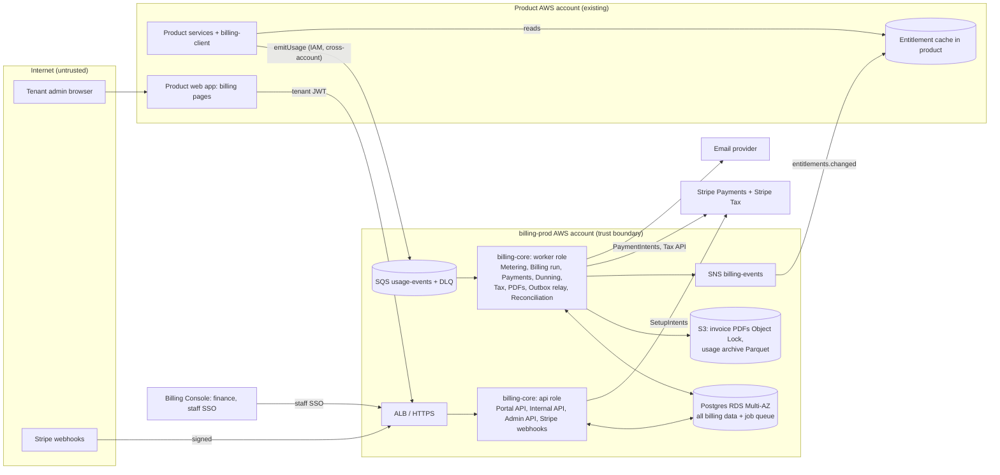

# Architecture and Build Plan: Multi-Tenant SaaS Billing System

> **Read this first: how I read the request.** "Multi-tenant SaaS billing system" could mean two different things, and they lead to different architectures:
> **(A)** billing for **your own** multi-tenant SaaS product, where your tenants are the customers you charge, or
> **(B)** a billing **product** that other businesses use to charge *their* customers, like Chargebee.
> This plan assumes **(A)**. If you meant (B), the core still holds, but tenant isolation becomes the top driver, payments move to Stripe Connect with one connected account per merchant, and the API turns into a public product contract. Open question Q1 covers this.
>
> **What I could inspect:** nothing. The workspace contains only a README saying it is intentionally empty. Every fact below about your stack, team, volumes, and current billing is an **assumption**. All of them are listed in Section 5, and each has a way to check it.

---

## 1. Summary

- **What:** a billing system for a B2B multi-tenant SaaS product. It turns catalog prices, subscriptions, and metered usage into correct, immutable invoices. It collects payment, records every money movement in a double-entry ledger, and tells the product what each tenant is entitled to use. It replaces today's mix (assumed): Stripe Billing for self-serve customers, spreadsheets for enterprise customers, and usage that is billed manually or not at all.
- **Shape:** one modular deployable, **`billing-core`**, which runs as two processes (an `api` role and a `worker` role) on one Postgres database. Product services send usage events to an SQS queue through a small **`billing-client`** library. **Stripe** handles payment collection, card storage, and tax calculation. You build pricing, invoicing, the ledger, and entitlements yourselves.
- **Key decisions:**
  1. **Build** the pricing calculation (called "rating"), invoicing, and ledger. **Buy** payments and tax from Stripe and Stripe Tax. A week-1 check can reverse this (D1).
  2. **Shared database, `tenant_id` on every row, Postgres row-level security (RLS)** as a second layer of defence. No per-tenant databases (D4).
  3. **Money is stored as integers in minor units (cents).** Issued invoices are never edited; corrections are made only through credit notes. Invoice numbers have no gaps. Every money movement is posted to an append-only, double-entry ledger (D5, D6).
  4. **The product never waits on billing.** Entitlements are pushed to the product and cached there, and usage goes through a queue. If billing is down, tenants can still use the product (D8).
  5. **Idempotency (safe repetition) everywhere money moves.** Usage events are deduplicated, there is at most one invoice per subscription period, Stripe calls use idempotency keys, and webhooks are deduplicated (Flows 1–3).
- **Milestone 1 (about 5–7 weeks, 4–5 engineers):** a thin end-to-end slice in staging, running in Stripe test mode. It covers usage → aggregation → billing run → tax → finalised invoice → ledger → card charge → PDF email → entitlements update. It also includes spikes on ingestion load, Stripe Tax, the feasibility of comparing against the legacy system, and finance sign-off on billing rules.
- **Top risks:** errors in proration and billing-calendar logic; usage volume exceeding what one Postgres instance can handle; finance and legal rules (invoice numbering, tax, dunning) arriving late; and **the cutover schedule depends on real month-ends**. Comparing against the legacy system needs at least two real billing cycles, and those can't be compressed.

## 2. Context and Goals

**Problem (assumed).** Self-serve tenants are billed by Stripe Billing on a few simple plans. Enterprise contracts (commitments, discounts, net-30 terms) are invoiced by hand from spreadsheets. Usage-based pricing can't launch because nothing meters usage reliably. As a result, finance loses days every month-end, usage revenue leaks, invoices are inconsistent, and pricing changes need engineering work.

**Goals**
- Bill every tenant (self-serve and enterprise) from one system of record, with invoices that reconcile to the ledger and to Stripe to the cent.
- Support pricing made of flat fees, per-seat fees, metered usage, and tiers, plus enterprise discounts and commitments.
- Let product and finance launch a new plan or price using only data, without a code deploy.
- Give the product authoritative, low-latency entitlements for each tenant.

**Non-goals (for now)**
- Revenue recognition under ASC 606 / IFRS 15. The ledger records billing events; recognition happens in the ERP from exports.
- Multiple legal entities, marketplace billing (AWS/GCP marketplaces), multiple payment providers, a quoting tool (CPQ), and prepaid credit wallets. All are listed in Section 17.
- Storing card or bank data. Stripe holds it, which keeps you in the lightest PCI category (SAQ-A).
- Multi-region active-active deployment.

**Success measures (targets assumed, confirm with finance)**
- 0 double charges. 0 unexplained differences in the daily Stripe reconciliation.
- At least 99.9% of usage recorded by the product appears on invoices (measured by producer-side counts against billed quantities).
- Finance month-end billing effort cut from days to under 4 hours.
- A new plan or price goes live in under 1 business day.
- At least 99% of invoices finalised within 26 hours of period end.

## 3. Drivers, Requirements, and Constraints

**Ranked quality attributes** (all targets are assumptions until finance and product confirm them)

| # | Attribute | Measurable target | Why it matters |
|---|---|---|---|
| 1 | **Financial correctness** | 0 double charges. Ledger always balanced (sum of debits minus credits = 0, checked continuously). Invoice total = sum of rounded lines. Daily Stripe reconciliation shows 0 unexplained differences. | Billing errors cost money and trust, and cost the most to fix after the fact. |
| 2 | **Auditability** | Issued invoices never change. Ledger is append-only. Every manual action is audit-logged. Invoices and ledger kept at least 7 years (counsel to confirm per jurisdiction). | SOC 2 and tax audits, and resolving disputes. |
| 3 | **Tenant isolation and security** | 0 cross-tenant reads, checked by automated negative tests on every tenant-facing endpoint. PCI SAQ-A only. | A billing data leak is a breach. Card data never enters the system. |
| 4 | **Product availability independent of billing** | Product runs normally during a billing outage of up to 14 days (the SQS retention period). Entitlement reads are served from the product's local cache at p99 < 5 ms. Accepted usage events are never lost. | Billing problems must never lock tenants out of the product. |
| 5 | **Evolvability of pricing** | New plan or price: under 1 day, data only. New pricing *model* (for example a new tier type): under 2 weeks. | Pricing changes far more often than the rest of the system. |
| 6 | Time to market | Enterprise invoicing off spreadsheets within about 2 quarters. | Finance pain and blocked usage revenue. |

Order of priority: **correctness beats speed of invoicing**. An invoice can wait a day for tax or late usage, but it can never be wrong. **Availability of the product beats availability of billing.**

**Key functional requirements:** catalog (products, versioned prices, meters); subscriptions with plan changes, proration, seats, trials, and cancellation; usage ingestion and aggregation; a billing run that creates invoices (fixed fees in advance, usage in arrears); tax; finalisation with gap-free numbering; card auto-charge and manual or bank payments; dunning (chasing failed payments); credit notes; a double-entry ledger; reconciliation; entitlements; a tenant billing portal; and a finance console.

**Constraints (assumed):** AWS; Postgres; TypeScript on Node 22 LTS; Terraform; GitHub Actions; Stripe is already the payment provider; an existing identity provider (IdP) for staff SSO, and product-issued JWTs for tenant users; 4–5 engineers, none with deep billing experience; a part-time finance subject-matter expert.

**Hard parts**
1. **Rating and the billing calendar.** Proration, anchor dates (Jan 31 → Feb 28), mid-period changes, and rounding. These cause subtle, recurring errors that tenants notice.
2. **Usage metering at volume.** About 50 million events a day with a peak around 3,000 per second (assumed). Counting each event once requires deduplication, plus a rule for late events that arrive after a period has closed.
3. **Payment state with an external asynchronous party.** Stripe timeouts, duplicate or out-of-order webhooks, and 3-D Secure (SCA) challenges can all cause double charges or missed charges.
4. **Rules owned by finance and legal.** Invoice numbering, mandatory invoice fields, tax registrations, and dunning policy. These are long-lead dependencies outside engineering.
5. **Migrating live subscriptions** off Stripe Billing and spreadsheets without billing anyone twice or skipping anyone. This is limited by real month-end dates.

## 4. Current State

**Inspected:** the workspace (`w2894ab96/`) contains only `README.md`, which says it is intentionally empty. No code, infrastructure, or data was available.

**Assumed context (to confirm in week 1):**
- The product is a multi-tenant SaaS on AWS. Each tenant has a stable `tenant_id`, and tenant admin users authenticate with product-issued JWTs.
- Self-serve tenants are on **Stripe Billing**: Stripe Customers with saved payment methods, and simple flat or per-seat plans, possibly with coupons.
- Enterprise tenants are invoiced by finance from spreadsheets and an accounting tool (for example QuickBooks, Xero, or NetSuite).
- Feature gating in the product reads a plan field on the tenant record.

**Conventions the plan follows:** a new repository `billing/` built in the assumed house style (TypeScript, Terraform, GitHub Actions). If your stack is different (Go, Java, GCP), the structure carries over unchanged; only the library choices change.

## 5. Assumptions and Open Questions

**Assumptions**

| Assumption | Impact if wrong | How and when validated |
|---|---|---|
| Interpretation (A): bill your own tenants | Major. Isolation, Stripe Connect, and a public API become central | Q1, day 1 |
| Pricing needs usage plus enterprise contracts within 12 months | If not, **buy** (stay on Stripe Billing) and build only metering and entitlements | Q2, week-1 decision gate (D1) |
| About 2,000 paying tenants now, 20,000 within 2 years | Billing run sizing; mostly low impact | Data pull from Stripe, week 1 |
| About 50M usage events/day, peak 3k/s, growing 3× a year | Postgres may not cope; would need pre-aggregation or another store | Producer telemetry, plus spike S1 (M1) |
| Stack is AWS / Postgres / TypeScript / Terraform | Library and tool choices change, not the structure | Q4, day 1 |
| Self-serve is on Stripe Billing today; saved cards live in Stripe | Migration plan changes if cards must move between providers | Stripe dashboard review, week 1 |
| Single legal entity selling in USD, EUR, and GBP; no FX conversion (prices set per currency) | Multi-entity numbering, tax, and ledger work would be needed | Q5, week 2 |
| Stripe Tax can calculate tax for invoices you create yourselves (via its Tax Calculation API) | Would need Avalara or Anrok instead; about +2 weeks | Spike S2 (M1) |
| Proration is by day in UTC; downgrades take effect at period end; 24h grace for late usage | Rating rules and tests change | Finance sign-off, task T23 (M1) |
| Dunning: retries on days 3/5/7, admin notified on day 14, read-only on day 21, suspended on day 45 | Product behaviour on non-payment | Product and finance sign-off, T23 |
| Team of 4–5 engineers, 0.5 frontend, part-time finance SME, existing on-call rotation | Milestone sizes | Q4 |
| All usage producers are internal services on AWS | Would need an HTTPS ingestion endpoint for external producers | Q4 |

**Open questions**

| # | Question | Who answers | Default if unanswered | Needed by |
|---|---|---|---|---|
| Q1 | Billing your own tenants (A), or building a billing product (B)? | Product lead | (A) | Day 1 |
| Q2 | Which pricing models are planned for the next 12 months? | Product and finance | Flat + seats + metered + enterprise commitments | Week 1 (gates D1) |
| Q3 | Legal requirements for invoice numbering and content per jurisdiction? | Finance and counsel | One gap-free sequence per entity; EU-compliant fields | End of M1 |
| Q4 | Stack, team size, external usage producers? | Engineering manager | As assumed above | Day 1 |
| Q5 | Selling entities, currencies, tax registrations? | Finance | 1 entity, USD/EUR/GBP, Stripe Tax | Week 2 |

## 6. Architecture Overview



**How it fits together.** Product services record usage through `billing-client`, which writes batches to the SQS queue `usage-events`. The **Metering** module in the worker deduplicates those events and aggregates them into hourly buckets. A scheduled **billing run** finds subscriptions whose period plus grace window has ended. It **rates** them (prices fixed fees and usage), gets tax from Stripe Tax, and **finalises** each invoice. Finalisation happens in one Postgres transaction that assigns the number, freezes the invoice, posts ledger entries, and queues the follow-on jobs. Those jobs charge the card, render the PDF, send the email, and publish events. Subscription changes produce a new **entitlement snapshot**, published through SNS into the product's local cache. All asynchronous work inside billing uses a Postgres-backed job queue, so jobs are queued in the same transaction as the business change that triggers them. That gives you a transactional outbox with no extra infrastructure.

**Component table**

| Component | Responsibility | Owns data | Exposes | Technology | Key dependencies |
|---|---|---|---|---|---|
| `billing-client` (library) | Emit usage; read cached entitlements | None | `emitUsage()`, `getEntitlements()` | TS package, AWS SDK | SQS, product cache |
| Catalog | Products, versioned prices, meters, plans | `products`, `prices`, `meters`, `plans` | Internal and Admin API | billing-core module | — |
| Subscriptions | Subscription lifecycle, changes, seats, schedules | `subscriptions`, `subscription_items`, `subscription_changes` | Internal, Portal, and Admin API | module | Catalog, Rating |
| Metering | Validate, deduplicate, aggregate usage; archive | `usage_events`, `usage_aggregates` | SQS consumer; read API for Rating | module (worker) | SQS, S3 |
| Rating | Pure functions: subscription + usage + prices → priced lines | None (pure) | In-process | module | Catalog, Metering |
| Invoicing | Billing run, drafts, finalisation, numbering, credit notes, PDFs | `invoices`, `invoice_lines`, `credit_notes`, `invoice_number_sequences` | Portal and Admin API; `invoice.*` events | module | Rating, Tax, Ledger |
| Ledger | Double-entry journal; balances | `ledger_accounts`, `journal_entries`, `journal_lines` | In-process `post()` only | module | — |
| Payments | Stripe adapter, payment state, webhooks, reconciliation | `payments`, `payment_attempts`, `psp_webhook_events` | Webhook endpoint; SetupIntent endpoint | module | Stripe |
| Tax | Stripe Tax adapter | `tax_calculations` | In-process | module | Stripe Tax |
| Dunning | Retry schedule, notices, restriction triggers | `dunning_cases` | In-process | module | Payments, Entitlements |
| Entitlements | Compute and publish per-tenant snapshots | `entitlement_snapshots` | `GET /v1/tenants/{id}/entitlements`; SNS events | module | Subscriptions |
| Notifications | Billing emails | `notifications` log | In-process | module | Email provider |
| Billing Console | Finance UI: contracts, credits, voids, reports | None (calls Admin API) | Web UI | React app `apps/billing-console` | Admin API, staff IdP |
| Postgres | System of record + job queue | All of the above | — | RDS Postgres 16+, Multi-AZ | — |

## 7. Component Details

**billing-core (deployable).** A single container image started as `api` (HTTP) or `worker` (jobs and SQS consumer). Module boundaries are enforced in code: each module exposes only `index.ts`, and a lint rule (for example `eslint-plugin-boundaries`) blocks deep imports. Each module owns its own Postgres schema (`catalog.*`, `ledger.*` and so on), and nothing writes across schemas. *Not split into microservices*, because no driver needs independent scaling apart from usage ingestion, and the queue already absorbs that. *Scales* by adding worker tasks. The billing run is partitioned by subscription and claimed through the job queue.

**billing-client.** `emitUsage(events[])` buffers in memory (up to 1 second or 500 events), packs events into SQS messages, and retries with backoff and jitter. Each event is `{event_id (UUID, generated by the producer, unchanged on retry), tenant_id, meter_key, quantity (decimal string), occurred_at (RFC 3339), properties}`, with contract version `v1` carried in a message attribute. *Failure:* if SQS can't be reached for more than 30 seconds, it drops events and increments `billing_usage_dropped_total`. That is an alerted under-billing risk, never a failure in the product. `getEntitlements(tenantId)` reads the product's local cache only.

**Metering.** It consumes `usage-events`. For each batch, in one transaction, it runs `INSERT … ON CONFLICT (tenant_id, event_id, occurred_date) DO NOTHING RETURNING`, then upserts `usage_aggregates` only for the rows that were actually inserted. Rows are summed in memory per (tenant, meter, hour) first, to avoid contention on hot rows. Together these give exactly-once *effect*. *Validation:* the meter must exist; `occurred_at` must be no more than 5 minutes in the future and no more than 35 days in the past; the sending IAM role (from the SQS `SenderId`) must be allowed to report that meter. Invalid events go to the DLQ, and a redrive script is provided. Aggregation types at launch are `sum` and `max`. `unique_count` is deferred. *Failure:* if Postgres is down, messages stay in SQS (14-day retention) and processing catches up later.

**Rating.** Pure, deterministic functions with no I/O, which makes it the most heavily tested code. Pricing models: flat, per-unit, graduated tiers, volume tiers, and package. Unit prices are `numeric(38,12)` (for example $0.0004 per call). Each line is rounded half-up to minor units, and the invoice total is the sum of the rounded lines. The clock is injectable everywhere.

**Invoicing.**
- *Billing run* (hourly trigger from EventBridge Scheduler): it selects subscriptions where `period_end + 24h grace <= now`. For each one it creates the draft idempotently. A unique constraint on `(subscription_id, period_start, kind)` makes a second run do nothing.
- *Invoice contents:* fixed fees for the next period (charged in advance), usage for the closed period (charged in arrears), and adjustment lines for late usage.
- *Lifecycle:* `draft → finalized → paid | void | uncollectible`. A finalised invoice is never updated. Corrections are made through `credit_notes`.
- *Numbering:* a row per issuing entity in `invoice_number_sequences`, locked with `SELECT … FOR UPDATE` inside the finalise transaction. Postgres `SEQUENCE` objects are not used because they leave gaps.
- *Failure:* if tax calculation fails, the invoice stays in draft and is retried. It is never finalised without tax. A late-invoice alert fires at T+26h.

**Ledger.** `post(journalEntry)` is the only way in. A deferrable constraint trigger rejects any transaction whose journal lines don't sum to zero per currency. A nightly job also checks the total balance and the subledger against the control accounts. Chart of accounts: `AR:{billing_account}`, `Revenue:{product_line}`, `TaxPayable:{jurisdiction}`, `StripeClearing`, `CustomerCredit`, `BadDebt`, `Cash`.

**Payments.**
- *Card capture:* the portal requests a Stripe SetupIntent, and the product web app collects the card with Stripe Elements. Card data never reaches you.
- *Charging:* off-session PaymentIntents use the idempotency key `inv_{invoice_id}_att_{n}`.
- *Webhooks:* the signature is verified, the raw event is stored in `psp_webhook_events` (unique on the Stripe event ID), and processing happens asynchronously. Before acting, the handler re-fetches the object from Stripe, because webhook order isn't guaranteed.
- *State:* payment status only ever moves forward. Status is recorded from whichever arrives first, the API response or the webhook, keyed by PaymentIntent ID.
- *Timeouts:* 10 seconds per Stripe call, with a circuit breaker.
- *Reconciliation:* a daily job matches Stripe balance transactions against `StripeClearing`.

**Tax.** Stripe Tax Calculation API on the draft invoice. A Tax Transaction is committed after finalisation, with reference = invoice ID, so a retry is safe. Wrapped behind a `TaxProvider` interface so it can be replaced with Avalara.

**Dunning.** A state machine per unpaid invoice: retries on days 3/5/7 (each retry is a new attempt number and therefore a new idempotency key), tenant admin notified on day 14, entitlement status `restricted` (read-only) on day 21, `suspended` on day 45. Data is never deleted. Every step is configurable, and finance can pause it per account.

**Entitlements.** A snapshot `{tenant_id, version, plan, features{}, limits{}, status: active|restricted|suspended}` is recomputed on any subscription or dunning change and published through the outbox to SNS. The product keeps the highest version it has seen. If a new tenant has no snapshot yet and billing can't be reached, the product uses a configured default (trial) entitlement for 24 hours. **Billing doesn't enforce anything.** The product enforces entitlements.

**Billing Console and Portal API.** The Portal API takes `tenant_id` *only* from the verified product JWT and never from a path parameter. The Admin API needs staff SSO with the roles `finance_admin`, `finance_viewer`, and `support_viewer`. Credits or voids above $1,000 (assumed threshold) need a second approver.

## 8. Data Design

**Entities and relationships**

```
billing_accounts (1 per tenant: tenant_id, currency, stripe_customer_id, terms, tax_ids, billing_engine flag)
  ├─< subscriptions ─< subscription_items >─ prices (versioned, immutable) >─ products
  │        └─< subscription_changes
  ├─< invoices ─< invoice_lines (price_id, period, quantity, unit_amount, amount, tax_amount)
  │        └─< credit_notes ─< credit_note_lines
  ├─< payments ─< payment_attempts
  ├─< dunning_cases
  ├─< entitlement_snapshots
  └─ usage_aggregates (tenant, meter, hour, quantity, billed_quantity) ← usage_events (raw)
ledger: ledger_accounts ─< journal_lines >─ journal_entries (source_type, source_id, unique)
infra: jobs (queue/outbox), psp_webhook_events, tax_calculations, audit_log
```

**System of record and the single writer for each:** Catalog writes `products/prices/meters/plans`. Subscriptions writes `subscriptions*`. Metering writes `usage_*`. Invoicing writes `invoices*/credit_notes*/invoice_number_sequences`. Ledger writes `journal_*` (other modules call `Ledger.post()` in-process inside the same transaction). Payments writes `payments*/psp_webhook_events`. Entitlements writes `entitlement_snapshots`. Stripe is the system of record for payment methods and the raw state of PaymentIntents.

**Consistency and transactions**
- **Finalising an invoice** is one ACID transaction: assign the number, set status to `finalized`, post the journal (debit AR; credit Revenue and TaxPayable), and queue `invoice.finalized` jobs.
- **Recording a payment** is one transaction: payment status → `succeeded`, journal (debit StripeClearing; credit AR), invoice → `paid`. It is idempotent through `unique(journal_entries.source_type, source_id)`.
- **Across Stripe** there is no shared transaction. Idempotency keys plus reconciliation take its place.
- **Entitlements** in the product are eventually consistent (seconds).

**Access patterns and indexes**
- `subscriptions(status, next_bill_at)` for the billing-run scan.
- `usage_aggregates(tenant_id, meter_id, hour)` primary key, plus a range scan per period.
- `invoices(billing_account_id, issued_at desc)` for the portal.
- `journal_lines(ledger_account_id, created_at)`.
- `usage_events` is **range-partitioned by `occurred_date`**. Partitions are created 7 days ahead, detached and archived to S3 Parquet after 45 days, and dropped once the archive is verified. The unique key `(tenant_id, event_id, occurred_date)` relies on the contract rule that an event's `occurred_at` never changes. Events older than 35 days are rejected, so deduplication is complete within the hot window.

**Late usage.** Events for a period already invoiced still land in their hour bucket. The next billing run bills `quantity − billed_quantity` as a "usage adjustment for <period>" line. `max` meters are billed as of the close and not adjusted later; this is documented.

**Retention, deletion, backup**

| Data | Retention | Notes |
|---|---|---|
| Invoices, credit notes, ledger, payments, aggregates | ≥ 7 years (counsel confirms; some jurisdictions require 10) | PDFs in S3 with Object Lock in compliance mode in production |
| Raw usage events | 45 days hot, then 25 months in the S3 archive | Long enough to handle disputes |
| Webhook payloads | 13 months | |
| Audit log | 7 years | Append-only table plus a daily export to S3 with Object Lock |

- **Deletion requests (GDPR and similar):** contact fields that don't appear on issued invoices are pseudonymised. Issued invoices are kept under the legal-obligation basis.
- **Backup:** RDS point-in-time recovery for 35 days (RPO ≤ 5 minutes), Multi-AZ, daily snapshot copied to a second region. **RTO is 2 hours.** A restore is tested in M3 and every quarter after that.

**Classification.** No card data (SAQ-A). Personal and confidential data covers billing contacts, addresses, and tax IDs. It is protected by KMS encryption at rest, TLS in transit, emails and tax IDs masked in logs, and RLS plus role-based access in the Admin API. Test data is synthetic and comes from the simulation harness; production data is never copied.

**Schema evolution.** Migrations live in `db/migrations/` (node-pg-migrate) and are applied as a pre-deploy task. Changes follow expand → backfill → switch reads → contract, and destructive steps ship in a separate release. Price versions are immutable, so a price change always means a new `prices` row and existing subscriptions keep their old price.

## 9. Key Flows

**Flow 1: Usage event, including duplicate delivery**
1. A product service calls `emitUsage({event_id: E1, tenant T, meter api_calls, qty 120, occurred_at 10:14Z})`.
2. `billing-client` batches it and calls SQS `SendMessageBatch`. The network times out and the client retries, so **the message is now in SQS twice.**
3. A worker takes copy #1. In a transaction it inserts E1 (1 row inserted) and runs `usage_aggregates[T, api_calls, 10:00] += 120`, then commits and deletes the message.
4. The worker takes copy #2. The insert hits a conflict (0 rows), the aggregate is not updated, and the message is deleted. The metric `usage_duplicates_total` goes up by 1.
5. *Failure variant:* the worker crashes after committing but before deleting the message. SQS redelivers it after the visibility timeout, and step 4 applies. *Variant:* the meter is unknown, so the event goes to the DLQ, the `DLQ depth > 0` ticket alert fires, and the event is redriven after the catalog is fixed.

**Flow 2: Period close and invoice, including a tax outage**
1. Subscription S (Team Monthly, anchor the 31st) has a period ending Feb 28 00:00Z. At Mar 1 00:00Z (period end + 24h grace) the hourly billing run claims S.
2. Rating produces three lines: the flat fee for Feb 28 to Mar 31 (in advance), api_calls usage for Jan 31 to Feb 28 (in arrears, tiered), and any usage adjustment from earlier periods.
3. The draft is inserted. A second run hits the unique constraint `(S, period_start, 'cycle')` and does nothing.
4. Tax calls the Stripe Tax calculation. **Stripe Tax returns 503.** The job is retried with exponential backoff and the invoice stays in `draft`. If it is still in draft at T+26h, the alert "invoices late" fires with the runbook *Tax provider outage*. The invoice is never finalised without tax.
5. Tax succeeds. Finalise transaction: lock the sequence → number `INV-2026-004213`, status `finalized`, journal (debit AR:T 10,450; credit Revenue 9,500; credit TaxPayable 950), and jobs queued: `payments.collect`, `invoices.render_pdf`, `tax.commit`, `events.publish`.
6. The PDF is rendered, stored in S3 under Object Lock, and emailed to T's billing contacts.

**Flow 3: Payment collection, including timeout, duplicate webhook, and failure**
1. `payments.collect` creates PaymentIntent `{amount 10,450, customer, payment_method, off_session, confirm}` with idempotency key `inv_4213_att_1` and `metadata.invoice_id`.
2. **The Stripe call times out after 10 seconds.** The outcome is unknown. The job retries with the *same key*, Stripe returns the same PaymentIntent, and **no second charge is made.**
3. The webhook `payment_intent.succeeded` arrives **twice**. The first is stored and processed: the handler re-fetches the PaymentIntent and, in one transaction, sets the payment to `succeeded`, posts the journal (debit StripeClearing; credit AR:T), and marks the invoice `paid`. The second fails the unique check on the event ID and is ignored. Even if it got past that, `unique(journal source)` would block a second ledger entry.
4. *Decline variant:* `payment_intent.payment_failed` opens a dunning case. Retries run on days 3/5/7 with keys `att_2/3/4`, and emails include a link to update the card.
5. *SCA variant:* the status becomes `requires_action`. The tenant admin is emailed a link to the portal page, which runs Stripe.js `confirmCardPayment`.
6. On day 21 unpaid, Entitlements publishes snapshot v+1 with `status: restricted`, and the product shows a read-only banner.
7. The nightly reconciliation matches the Stripe balance transaction to the StripeClearing entry. A mismatch triggers a finance alert.

**Flow 4: Mid-cycle upgrade with proration**
1. A tenant admin on day 10 of a 30-day period upgrades from Team ($300) to Business ($900) in the product's billing page. The Portal API receives it with the tenant taken from the JWT.
2. Subscriptions records the `subscription_change` (effective now). Rating gives a credit of −$300 × 20/30 = −$200.00 and a charge of +$900 × 20/30 = +$600.00, rounded per line. The result is an immediate invoice for $400 plus tax, which then follows Flows 2 and 3 without the grace window.
3. Entitlements publishes snapshot v+1 (Business features), and the product cache updates within seconds.
4. *Downgrade:* recorded with `effective_at = period_end` and no proration, per the assumed policy.

## 10. Key Decisions

| # | Decision | Options considered | Rationale (against the drivers) | Reversibility | Revisit if |
|---|---|---|---|---|---|
| D1 | **Build rating, invoicing, and ledger. Buy payments and tax (Stripe).** | (a) Stay on and extend Stripe Billing; (b) usage-billing vendor (Orb, Metronome) or Chargebee; (c) build the core and buy payments and tax | Enterprise commitments, usage pricing, and a ledger you can audit (drivers 1, 2, 5) are where off-the-shelf tools get rigid and costly (fees as a percentage of billed volume). Keeping Stripe Payments means saved cards carry over with no migration. **Cost:** about 5–7 months of a team and permanent ownership of correctness. | Hard | **Week-1 gate:** if Q2 says no usage or enterprise pricing within 12 months, choose (a) and build only metering and entitlements. If evaluation shows a vendor in (b) covers more than 90% of the pricing rules finance signs off in T23, choose (b). |
| D2 | One modular deployable (`api` + `worker` roles) | Microservices per domain; modular monolith | Invoice finalisation needs ACID across invoicing, ledger, and jobs (driver 1). A small team. No independent scaling needs, because the queue absorbs usage peaks. | Medium | A module needs a different security zone or release cadence, or the team grows past about 10. |
| D3 | Postgres for everything, including raw usage (partitioned) and the job queue | Kafka + ClickHouse for usage; SQS for every job | One store keeps dedupe and aggregation transactional (driver 1) and keeps operations light. Postgres jobs give a transactional outbox for free. | Medium | Spike S1 fails at 3× peak, or volume exceeds about 200M events/day. Then move raw events to S3 or ClickHouse and keep aggregates in Postgres. |
| D4 | Shared schema, `tenant_id` on every row, RLS on tenant-facing tables | Schema per tenant; database per tenant | 2k–20k tenants with small per-tenant data. Isolation is about authorisation, not noisy neighbours. RLS adds defence in depth (driver 3). | **Hard** | An enterprise customer contractually requires physical isolation or residency (would mean a regional deployment). |
| D5 | Integer minor units for amounts; `numeric(38,12)` for unit prices; round half-up per line | Floats; decimal everywhere; rounding at invoice total | Deterministic and explainable (driver 1). | Hard (data) | A jurisdiction mandates a different rounding rule. Make the rule configurable per entity. |
| D6 | Issued invoices never change; credit notes only; gap-free numbering per entity through a locked row | Editable invoices; Postgres SEQUENCE | Audit and legal requirements (driver 2). The locked row costs about 5 ms per finalise, so 20k invoices serialise in under 2 minutes. | Hard | Counsel says gaps are allowed, which removes the lock. |
| D7 | Transactional outbox on the Postgres job queue → SNS for outbound events | Direct calls; Kafka | Events can't be lost or published for rolled-back changes (drivers 1, 4). No new infrastructure. | Easy | Many consumers need replay. Then move to Kafka or EventBridge. |
| D8 | Entitlements pushed and cached in the product; status-based restriction | Synchronous check against billing on each request | Driver 4: billing outages never block the product. | Medium | Entitlement freshness of seconds isn't enough for some feature (unlikely). |
| D9 | Usage sent through SQS by `billing-client`; no HTTP ingestion service | HTTPS ingestion API in front of a queue | One less service to run and keep available. The library hides SQS from producers. | Easy | External or non-AWS producers appear. Then add a thin HTTPS ingestion endpoint. |
| D10 | Stripe Tax Calculation API behind `TaxProvider` | Avalara; Anrok; manual | Already on Stripe; least integration work. | Easy | Spike S2 shows gaps (EU reverse charge, specific US states), or multi-entity needs arise. |
| D11 | Fixed fees in advance and usage in arrears on one invoice, at period end + 24h grace; later events billed as adjustments | Separate invoices; finalise at the period boundary | Fewer invoices, and complete usage on most invoices. | Easy | Tenants want invoices on the 1st exactly. Shorten the grace window. |
| D12 | Separate AWS accounts `billing-staging` and `billing-prod` | Same account as the product | Limits how far a security incident can spread, and narrows SOC 2 scope (driver 3). Network and identity layout is hard to change later. | Hard | The organisation doesn't use AWS Organizations. Then use a dedicated VPC and IAM boundaries in the existing account. |

## 11. Cross-Cutting Concerns

**Security** (built in M1, with the full threat review in M3)
- *Identity:* tenant users use the product JWT, verified against its JWKS in the Portal API (M1). Staff use OIDC SSO with the roles above (M2). Services authenticate with IAM roles and cross-account resource policies on SQS and SNS (M1).
- *Secrets:* Stripe **restricted** keys, scoped per role, live in Secrets Manager with rotation documented (M1). The webhook signing secret is stored separately.
- *Main threats and mitigations:*
  1. **Cross-tenant invoice exposure.** Tenant ID comes only from the token; RLS; negative tests on every portal endpoint in CI.
  2. **Inflated or forged usage.** Only allow-listed IAM roles can send; each role is limited to its allowed meters; anomaly alert when a tenant's daily usage exceeds 5× its 30-day median.
  3. **Insider fraud** (self-issued credits, voids). Roles, a second approver above the threshold, and an audit log that can't be altered.
  4. **Webhook spoofing.** Signature check plus re-fetching the object from Stripe.
  5. **Double charge.** Idempotency keys, the unique constraints described above, and reconciliation.
- *CI:* dependency and container image scanning blocks merges for critical findings.

**Reliability.** Targets: Portal and Admin API 99.9% monthly (Stripe retries webhooks for up to 3 days, so short outages are safe). Usage events accepted into SQS are not lost. Invoices finalised within 26 hours of period end at 99%. Database RPO ≤ 5 minutes and RTO ≤ 2 hours. Every outbound call has a timeout (Stripe 10 s, email 5 s). Retries use backoff and jitter and are applied only to idempotent operations. A circuit breaker protects Stripe calls. Backpressure comes from the SQS buffer and a cap on worker concurrency. A DLQ plus a redrive script handles failures. The `/ready` health check verifies the database and job queue.

**Observability** (baseline in M1, dashboards and runbooks in M3)
- Structured JSON logs with `correlation_id`, `tenant_id`, `invoice_id`, and `job_id`, exported through OpenTelemetry to the existing stack.
- *Metrics:* usage lag (age of the oldest SQS message), duplicates, rejected events, billing run expected versus finalised, payment success rate, webhook lag, open dunning cases, reconciliation differences, ledger imbalance.
- *Alerts tied to symptoms:*

| Alert | Severity | Runbook |
|---|---|---|
| Ledger imbalance ≠ 0 | page | `ledger-imbalance.md` |
| Usage lag > 15 min | page | `usage-backlog.md` |
| Invoices not finalised by T+26h | page in business hours | `billing-run-late.md` |
| Payment success rate drops > 10 points from the 7-day baseline | ticket, page if > 25 points | `payments-degraded.md` |
| Reconciliation difference > $0 | finance ticket | `reconciliation.md` |
| DLQ depth > 0 | ticket | `usage-dlq.md` |

**Performance and capacity.** Usage: about 600 events/s average, about 3,000/s peak, designed for 10,000/s (verified in S1, re-tested before cutover). Billing run: 20,000 subscriptions in under 2 hours. Self-serve anchors on signup dates spread the load, and enterprise invoices on the 1st are the spike. Portal reads p95 < 300 ms. Expected bottlenecks: write throughput on Postgres during usage peaks, and lock contention on the invoice-number row (bounded, as described in D6). Load tests use k6 and a synthetic SQS producer in staging.

**Cost (rough, check against AWS pricing).** Production infrastructure is about $2.5k–5k per month: RDS Multi-AZ (r6g.xlarge class), 2–6 Fargate tasks, SQS at around 450M requests a month after batching, S3, and the ALB. Staging is about 30% of that. The **main cost driver is Stripe fees** (card processing plus per-transaction Stripe Tax fees), not infrastructure. You avoid Stripe Billing's percentage-of-volume fee. Controls: cost-allocation tags `system=billing`, AWS Budgets alerts at 80% and 100%, and lifecycle rules on the usage archive.

**Operations.** The billing team owns billing-core. It joins the existing on-call rotation for *pages* (ledger, usage lag, late billing run). Finance owns reconciliation tickets. Support gets read-only Console access to answer invoice questions. Runbooks live in `docs/runbooks/` and each alert links to one. There is a month-end checklist that engineering and finance review together for the first 3 cycles.

**AI-specific concerns:** not applicable. The system has no model components.

## 12. Build Sequence

Team assumption: 4 backend engineers, 0.5 frontend, a part-time finance SME, and 0.25 SRE support. Sizes are rough ranges, not commitments.

| Milestone | Goal | Scope (in / out) | Exit criteria | Depends on | Size |
|---|---|---|---|---|---|
| **M1: Thin slice + spikes** | Prove the full money path end to end. Clear the volume, tax, legacy-comparison, and billing-rule unknowns. | In: one USD plan (flat + one per-unit meter), card auto-charge, PDF email, entitlements v1, minimal portal invoice list, CI/CD, staging, baseline alerts. Out: plan changes, dunning, Console, enterprise. | The nightly e2e test (T24) passes 5 nights in a row in staging. Spike reports S1–S4 written and decisions recorded in ADRs. Ledger invariant alert proven by an injected fault. | None | 5–7 weeks |
| **M2: Self-serve parity + shadow** | Match Stripe Billing behaviour and start running in shadow on real month-ends. | In: plan changes and proration, seats, trials, cancellations, tiered pricing, coupons as needed, credit notes, dunning, full portal (update card through SetupIntent), Console v1 (read + credit notes), **shadow mode for all self-serve tenants**. | Shadow differences for 1 real cycle: 100% explained, 0 unexplained above $0.01. Proration property tests and the golden suite (≥ 40 finance-approved scenarios) green. | M1; T23 rules sign-off | 5–7 weeks |
| **M3: Enterprise + hardening** | Move spreadsheets into the system and make it ready to operate. | In: enterprise contracts (commitments, discounts, net-30, invoice-only collection), manual and bank payment recording, EUR/GBP, daily Stripe reconciliation, ERP CSV journal export, Console approvals, runbooks, DR restore test, load test at 3× peak, security review. | Restore test meets the 2-hour RTO. Load test passes. Enterprise invoices for 1 cycle generated in parallel with spreadsheets and match line for line. Second clean shadow cycle. | M2 | 4–6 weeks |
| **M4: Cutover** | Move tenants in cohorts and retire legacy billing. | In: cohort migration (internal → 5% → 25% → 100% of self-serve; enterprise moved by finance), opening balances, decommissioning Stripe Billing subscriptions and spreadsheets. | 100% of tenants on `native`. Two clean month-ends after cutover. Reconciliation clean. Legacy subscriptions cancelled. | M3 | 6–10 weeks (calendar-bound) |

**Critical path:** core schema and ledger (M1) → rating and proration (M2) → **≥ 2 real month-end shadow cycles** (late M2 through M3) → cohort cutovers at each tenant's period boundary (M4). Month-ends set the pace, so **turn on shadow mode as early in M2 as it can run**.
**Parallel work:** Console (frontend) from mid-M2; reconciliation and ERP export during M3 alongside enterprise contracts; infrastructure hardening alongside feature work.
**Long-lead items (start on day 1):** finance and legal input on numbering, invoice content, proration, and dunning; Stripe Tax registrations; AWS account creation; IdP app registration for the Console; auditor review of the ledger design.
**Overall:** about 5–7 months.

## 13. First Milestone Task Breakdown

Repository layout (new repo `billing/`):
```
services/billing-core/src/{modules/<module>/, platform/{db,jobs,money,clock,auth,config,logging}, roles/{api.ts,worker.ts}}
packages/billing-client/   db/migrations/   infra/terraform/{accounts,network,data,billing-core}
tests/{golden-invoices,simulation,e2e,load}   docs/{adr,runbooks,spikes}   apps/billing-console/ (M2)
```

| # | Task | Location | Done when | Week / parallel |
|---|---|---|---|---|
| T0 | **Request long-lead items:** Stripe test-mode restricted keys and Tax activation; finance/legal questions Q3 and Q5 plus the T23 rule list; AWS accounts `billing-staging` and `billing-prod`; IdP app registration | Tickets, owner: tech lead | Every request has an owner and a due date; Stripe keys are in Secrets Manager | Day 1 |
| T1 | Write ADRs for D1, D4, D5, D6, D8, D12 | `docs/adr/0001-…0006` | Reviewed by the tech lead and finance lead; D1 gate outcome recorded after Q2 | Week 1 |
| T2 | Scaffold the repo and CI: lint, typecheck, unit tests, a migrations job against a Postgres 16 service container, dependency and image scan, module-boundary lint | `.github/workflows/ci.yml`, root config | A PR with a deep cross-module import fails CI; a green PR is required to merge | Week 1, parallel with T3 |
| T3 | Terraform the staging baseline: VPC, RDS Postgres (single-AZ in staging, a documented difference), SQS `usage-events` + DLQ, SNS `billing-events`, S3 `invoices` (Object Lock in governance mode) and `usage-archive`, Secrets Manager, ECS Fargate services `api` and `worker`, ALB with TLS, remote state with locking | `infra/terraform/*` | `terraform plan` shows no changes after apply; a hello-world image answers `/ready` with a database check | Weeks 1–2 |
| T4 | CD pipeline: build the image, run migrations as a one-off ECS task, deploy on merge to `main`; document rollback as redeploying the previous image tag | `.github/workflows/deploy.yml`, `docs/runbooks/deploy-rollback.md` | Merge reaches staging in under 15 minutes; a rollback has been done once | Week 2 |
| T5 | Implement the `Money` type (bigint minor units + ISO currency) and `UnitPrice` (decimal), with rounding half-up per line | `platform/money/` | Property tests (fast-check) cover currencies with 0 and 2 decimal places and summing rounded lines; 100% branch coverage | Week 1–2, parallel |
| T6 | Implement an injectable `Clock` and `BillingCalendar` (monthly and annual periods, anchor clamping such as 31 → 28/29 → 31, UTC), with a test-only per-account clock override | `platform/clock/`, `modules/subscriptions/calendar.ts` | Property test: over 10 years of anchors, periods are contiguous with no gaps or overlaps; override is rejected when `NODE_ENV=production` | Week 1–2, parallel |
| T7 | Migration `0001_core`: billing_accounts, catalog, subscriptions, subscription_items, invoices, invoice_lines, invoice_number_sequences, ledger_accounts, journal_entries (unique source), journal_lines, payments, payment_attempts, psp_webhook_events, tax_calculations, entitlement_snapshots, audit_log, plus the job queue schema; check constraints; deferrable balance trigger; RLS on tenant-facing tables | `db/migrations/` | Migrates up and down on a clean database in CI; a test inserting an unbalanced journal fails at commit; a test querying as tenant A returns 0 rows for B | Week 2 |
| T8 | Migration `0002_usage`: `usage_events` partitioned by `occurred_date` with unique `(tenant_id, event_id, occurred_date)`, `usage_aggregates`; a partition-maintenance job (create +7 days, detach after 45) | `db/migrations/`, `modules/metering/partitions.ts` | The job runs in staging and creates the future partitions | Week 2 |
| T9 | Build `billing-client`: `emitUsage()` with batching, retry, and drop metric; `getEntitlements()` reading a pluggable cache | `packages/billing-client/` | Contract test against ElasticMQ/LocalStack passes; the v1 event schema is published as JSON Schema | Weeks 2–3, parallel with T10 |
| T10 | Build the Metering consumer: validate, `INSERT … ON CONFLICT DO NOTHING RETURNING`, aggregate in memory, upsert buckets in the same transaction, send invalid events to the DLQ, add a redrive script | `modules/metering/`, `scripts/redrive-usage-dlq.ts` | Integration test: sending the same batch twice gives the same aggregates as sending it once; a crash between commit and message delete is replayed safely | Weeks 2–3 |
| T11 | **Spike S1 (usage load).** Question: can the RDS r6g.xlarge class sustain 10k events/s for 1 hour with lag under 60 s and CPU under 60%? Build a k6/synthetic SQS producer and run it against staging sized like production. **Time box: 4 days.** | `tests/load/`, `docs/spikes/s1-usage.md` | Report with throughput, lag, and CPU. **Would change the plan:** a failure means producer-side pre-aggregation or moving raw events to S3 (D3) | Week 3 |
| T12 | Seed the catalog: product "Core", plan "Team Monthly" (flat $300 USD), meter `api_calls` (sum, $0.0004/unit); add read endpoints | `modules/catalog/`, `scripts/seed-staging.ts` | `GET /internal/v1/plans` returns the seeded plan in staging | Week 3 |
| T13 | Build subscription creation (Internal API): create the billing account (link the Stripe customer) and subscription, compute the first period, issue the first advance invoice | `modules/subscriptions/` | Integration test creates a subscription and a draft invoice for the first period | Week 3 |
| T14 | Build Rating (flat + per-unit) and the billing-run job with a unique `(subscription_id, period_start, kind)` constraint and the 24h grace window | `modules/rating/`, `modules/invoicing/billing-run.ts` | 5 finance-approved golden scenarios in `tests/golden-invoices/` match line for line; a double run creates no duplicate | Weeks 3–4 |
| T15 | **Spike S2 (Stripe Tax).** Question: does the Stripe Tax Calculation/Transaction API give correct tax on your own invoices for US (3 states), an EU business with a VAT ID (reverse charge), and a UK customer? Build the `TaxProvider` adapter against test mode. **Time box: 3 days.** | `modules/tax/`, `docs/spikes/s2-tax.md` | Results reviewed with finance. **Would change the plan:** gaps mean evaluating Avalara or Anrok (+about 2 weeks in M2) | Week 3, parallel |
| T16 | Build finalisation: one transaction that locks the sequence, assigns the number, sets status, posts the journal, and queues jobs | `modules/invoicing/finalize.ts`, `modules/ledger/` | Test: 1,000 concurrent finalisations give contiguous numbers with no duplicates, and the ledger is balanced | Week 4 |
| T17 | Build the Payments adapter: SetupIntent endpoint; off-session PaymentIntent with key `inv_{id}_att_{n}`; `/webhooks/stripe` with signature check, store-then-process, re-fetch, forward-only state, and the payment journal | `modules/payments/` | Stripe test-mode integration: success card, decline card `4000000000000002`, and SCA card `4000002500003155` behave as in Flow 3; replaying a webhook twice gives exactly 1 journal entry; a forced timeout followed by a retry gives 1 PaymentIntent | Weeks 4–5 |
| T18 | Render the invoice PDF (HTML template → PDF through headless Chromium in the worker), store it in S3, and email it through the existing provider | `modules/invoicing/pdf/`, `modules/notifications/` | A staging invoice email arrives with a PDF whose totals equal the database invoice | Week 5, parallel |
| T19 | Build Entitlements v1: compute snapshot on subscription change, publish through the outbox to SNS, add the GET endpoint; a product-side consumer stub persists the highest version | `modules/entitlements/`, product repo stub | A product staging service logs and persists snapshot v1 for the test tenant | Week 5, parallel |
| T20 | Build the minimal Portal API: list and get invoices plus a pre-signed PDF URL; tenant ID taken from the verified product JWT | `modules/invoicing/portal.ts`, `platform/auth/` | Negative test: tenant A's token gets a 404 for B's invoice; runs in CI | Week 5 |
| T21 | Set up the observability baseline: JSON logs with correlation IDs, OpenTelemetry metrics listed in Section 11, alarms for ledger imbalance (page), usage lag, and DLQ depth | `platform/logging/`, `infra/terraform/billing-core/alarms.tf` | An injected unbalanced entry in staging (test-only bypass) fires the page alarm | Week 4–5 |
| T22 | **Spike S3 (legacy shadow feasibility).** Question: can you export 3 months of Stripe Billing subscriptions and invoices and reproduce them? List the legacy behaviours in use (coupons, proration settings, tax behaviour). **Time box: 3 days.** | `scripts/legacy-export/`, `docs/spikes/s3-legacy.md` | Behaviour list with counts per tenant. **Would change the plan:** more than 5 unsupported behaviours in active use grows M2 scope, or those tenants get migrated after the behaviour is simplified | Weeks 1–2, parallel |
| T23 | **Spike S4 (billing rules sign-off with finance).** Agree proration basis, downgrade timing, grace window, rounding, dunning schedule, numbering format, and mandatory invoice fields. **Time box: 2 weeks elapsed, about 3 engineer-days.** | `docs/billing-rules.md` | Signed off by the finance lead; each rule is mapped to a golden scenario. **Would change the plan:** rules that conflict with D5, D6, or D11 reopen those decisions | Weeks 1–3, parallel |
| T24 | Write the end-to-end thin-slice test: create account → subscription → emit usage → advance the account clock → billing run → tax → finalise → charge → PDF → entitlements → portal shows it as paid; runs nightly in staging | `tests/e2e/thin-slice.test.ts`, `.github/workflows/nightly.yml` | Green 5 nights in a row (the M1 exit criterion) | Weeks 5–6 |

Order: T0–T3, T22, and T23 start in week 1. T5–T8 next, then T9–T10 together, with T11 and T15 alongside. T12–T14 → T16 → T17. T18–T21 run in parallel in weeks 4–5. T24 closes the milestone.

## 14. Testing and Validation Strategy

| Risk | Test type | Where / when |
|---|---|---|
| Proration, calendar, and rounding errors | Property-based tests (fast-check): prorated pieces sum to the full price within rounding; periods tile with no gaps | Unit tests, every PR |
| Pricing semantics | **Golden invoices** approved by finance (5 in M1, ≥ 40 in M2) | CI, blocks release |
| Long-running behaviour | **Simulation harness:** 500 synthetic tenants run through 13 months of usage, plan changes, and failures on the test clock; checks ledger balance, no duplicate invoices, AR = sum of open invoices | Nightly |
| Ledger integrity | Invariant tests plus the production balance alarm | CI plus continuous |
| Idempotency | Duplicate SQS delivery, duplicate webhooks, Stripe timeout replay, double billing run | Integration tests, CI |
| Stripe integration | Stripe test mode with the standard test cards, plus contract tests on the adapter against recorded fixtures | Integration in CI (nightly for live test mode) |
| Tenant isolation | Negative cross-tenant tests on every Portal endpoint, plus RLS tests | CI, blocks merge |
| Volume | k6 / synthetic SQS load at 3× peak; billing run of 20k subscriptions | S1 in M1, repeated before M4 |
| Matching legacy | **Shadow diffs** against Stripe Billing invoices and enterprise spreadsheets | M2–M4, gates cutover |
| Recovery | RDS point-in-time restore drill | M3, then quarterly |

Environments: local (Docker Postgres + ElasticMQ), CI, staging (Stripe test mode, its own AWS account, synthetic data only), production. Release blockers: unit, golden, isolation, migration up/down, and critical vulnerability findings. Targets in Section 3 are checked by the reconciliation reports, the shadow diffs, the load tests, and the restore drill, each tied to a milestone exit.

## 15. Rollout, Migration, and Rollback

- **Per-tenant flag** `billing_accounts.billing_engine ∈ {legacy, shadow, native}`.
- **Shadow mode:** for each closed period, the engine creates `shadow` invoices. These are never finalised, never numbered, never posted to the ledger, and never charged. A diff job compares them line by line with the Stripe Billing invoice and shows the results in the Console. Every difference must be classified as *bug*, *intended change*, or *legacy quirk* before a tenant's cohort can move.
- **Cutover for one self-serve tenant**, done at its period boundary:
  1. Set the Stripe subscription to `cancel_at_period_end`. The current period is already paid in advance.
  2. Create the native subscription with the same anchor.
  3. Post opening ledger entries for any Stripe customer credit balance.
  4. Flip the flag to `native`.
  The saved card stays on the same Stripe Customer, so nothing about payment methods moves.
- **Cohorts:** internal and test tenants → 5% → 25% → 100% of self-serve, with at least one clean month-end between each step.
- **Enterprise tenants:** finance enters contracts in the Console with a second approver. For one cycle, invoices are generated in parallel with the spreadsheet and compared before anything is sent.
- **Rollback for one tenant:**
  - *Before* the native system finalises that tenant's first invoice: set the flag back to `legacy` and un-cancel the Stripe subscription. This is clean.
  - *After* finalisation: void the invoice with a credit note and recreate the Stripe subscription with `billing_cycle_anchor`. This is manual and documented in `docs/runbooks/tenant-rollback.md`. In practice, **the first native invoice is that tenant's point of no return.**
- **Global point of no return:** deleting the legacy Stripe Billing subscriptions and archiving the spreadsheets. Do this only after 2 clean native month-ends across all tenants.

## 16. Risks and Mitigations

| Risk | Likelihood | Impact | Mitigation | Early warning sign | Owner |
|---|---|---|---|---|---|
| Proration and calendar errors reach tenants | Medium | High | Property tests, golden suite, simulation, shadow diffs, cohort rollout | Unexplained shadow differences | Tech lead |
| Usage volume beyond what Postgres can handle | Medium | High | Spike S1; fallback to pre-aggregation or S3 per D3 | S1 lag > 60 s, or growth > 3× a year | Backend engineer (Metering) |
| Finance or legal rules arrive late or change | High | Medium | T0 on day 1, T23 sign-off time-boxed, rules turned into golden tests | T23 not signed by week 3 | Product manager + finance lead |
| Month-end calendar slips cutover | High | Medium | Start shadow early in M2; cohorts aligned to anchor dates | Shadow not live by mid-M2 | Engineering manager |
| Stripe Tax gaps for your own invoices | Low–Medium | Medium | Spike S2; `TaxProvider` abstraction | S2 findings | Backend engineer (Tax) |
| Double charge from retry or webhook edge cases | Low | High | Idempotency keys, unique constraints, reconciliation | Reconciliation differences; duplicate PaymentIntents per invoice > 0 | Backend engineer (Payments) |
| Product team doesn't adopt the entitlement cache in time | Medium | Medium | Ship the stub consumer in M1 (T19); keep the legacy plan field in sync until M4 | Product integration ticket not started by M2 | Engineering manager |
| No billing experience on the team | High | Medium | Ledger and payments design review by finance and an external advisor in M1 | Ledger design disputes | Tech lead |
| Build-versus-buy turns out wrong (simple pricing) | Medium | High | Week-1 D1 gate tied to Q2 | Q2 answer: no usage or enterprise pricing | Product lead |
| Insider misuse of credits or voids | Low | Medium | Second approver, audit log, monthly review of credits | Credits issued outside the normal pattern | Finance lead |

## 17. Deferred Work and Future Evolution

| Deferred | Trigger to build |
|---|---|
| Revenue recognition (deferred revenue schedules) | Auditor or finance needs it beyond ERP exports |
| Direct ERP integration (NetSuite or other API) | CSV export takes finance more than 2 hours a month |
| Multiple legal entities and numbering | A second selling entity |
| `unique_count` meters | A pricing plan based on unique counts (for example monthly active users) |
| Prepaid credits and wallets | Product launches prepaid plans |
| Additional payment providers and marketplace billing | A market Stripe doesn't serve, or a marketplace listing |
| HTTPS usage ingestion | External or non-AWS producers (D9) |
| Real-time spend alerts for tenants | Customer demand, or usage disputes |
| Data residency / regional deployment | An enterprise contract requirement (D4) |

**Extension points:** the pricing-model interface in Rating; `TaxProvider`; `PaymentProvider` (only Stripe exists now); outbound event types on SNS; per-entity numbering in `invoice_number_sequences`.

**Shortcuts taken on purpose:** a single-AZ staging database (fix if staging is ever used for DR drills); `max` meters not adjusted for late events (revisit with the first disputes); Console v1 without bulk operations (M3+).

## 18. Next Steps

1. **Answer Q1 and Q2 this week.** Q2 settles the build-versus-buy gate (D1) before any code is written.
2. **Send the T0 requests today:** Stripe test-mode restricted keys and Tax activation, AWS accounts `billing-staging` and `billing-prod`, and the finance and legal question list (numbering, invoice fields, proration, dunning).
3. **Create the `billing/` repo** with the layout in Section 13, and open ADRs `docs/adr/0001` to `0006` (T1).
4. **Start T2 and T3 in parallel:** CI with a Postgres service container, and the Terraform staging baseline.
5. **Book the T23 rules workshop** with the finance lead (2 × 90 minutes in weeks 1–2) and start the T22 legacy export from Stripe.

---

## What I'd most like you to tell me

I couldn't see any code or context; the workspace is empty. These answers would change the plan the most:

1. **Who are you billing?** Your own tenants (A, assumed), or are you building a billing product for other businesses (B)? (B) would make tenant isolation, Stripe Connect, and a public API the centre of the design.
2. **Which pricing models do you need in the next 12 months?** If it's just flat and per-seat plans with no usage or enterprise contracts, the right plan is to **stay on Stripe Billing** and build only metering and entitlements. That would cut this plan by about 70%.
3. **What do you bill with today, and how many tenants and usage events are involved?** I assumed Stripe Billing plus spreadsheets, about 2,000 tenants, and about 50M events a day.
4. **What are your stack, cloud, and team size?** I assumed AWS, Postgres, and TypeScript with 4–5 engineers. A different stack changes library choices and estimates, not the structure.
5. **Which entities, currencies, and tax jurisdictions do you sell in?** This decides whether Stripe Tax is enough and whether invoice numbering and the ledger need to support multiple entities from the start.
