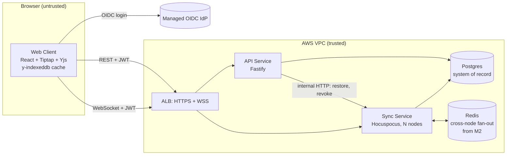

# Architecture and Build Plan: Real-Time Collaborative Document Editor

> **Context note.** The working directory has no code in it (`README.md` says it is "intentionally empty"), and the request gave no details about users, scale, team or stack. So this is a greenfield plan built on stated defaults, all marked **[A]** and collected in Section 5. You asked how to *order* the build, so Sections 12–13 get the most detail and the other sections are kept short. The questions at the end are the ones whose answers would change the plan most.

---

## 1. Summary

- **What:** A browser-based rich-text editor where several people edit the same document at once. Each person sees the others' changes within a fraction of a second, along with their cursors, and edits made while offline merge back in when the connection returns. Assumed to be a B2B SaaS for teams **[A]**.
- **Shape:** A React + Tiptap client, a **Sync Service** (Hocuspocus, a Node WebSocket server for Yjs documents), a small **API Service** for documents, sharing and versions, and Postgres as the single system of record. Redis is added in Milestone 2, only to relay messages between Sync Service instances. Everything lives in one TypeScript repository with two process types.
- **Key decisions:**
  1. Handle concurrent edits with a **CRDT (Yjs)**. We do not write our own OT. (CRDT: a data type that merges concurrent edits the same way on every copy. OT, operational transformation: an algorithm that rewrites concurrent edits against each other.)
  2. **Self-host Hocuspocus** rather than buy a managed sync vendor.
  3. Store the **full merged document state in Postgres**, behind a storage interface, so the storage format can change later.
  4. Permissions apply to the **whole document** (owner/editor/viewer) and are checked in the Sync Service when a connection opens.
  5. Fix a **versioned editor schema** in a shared package. This is the hardest decision to undo.
- **Milestone 1 (3–4 weeks):** Two logged-in users co-edit a document in a real staging environment. It is deployed through CI/CD and saved to Postgres. The milestone also includes three spikes that test convergence, editor fit and single-document load. ("Convergence" means every client ends up with the same document.)
- **Top risks:** silent divergence or data loss in the sync and persistence path; editor schema changes breaking existing documents; documents growing over time and Postgres write volume; any editor being able to send damaging updates (a CRDT can't check edits for meaning on the server side).

## 2. Context and Goals

- **Problem:** Teams editing shared documents either send files back and forth or lock the document while one person edits. Both lose work and slow people down.
- **Goals:** Co-editing with no conflict dialogs. No lost edits across disconnects, deploys or server crashes. Sharing with enforced roles. Presence (who is here, and where their cursor is).
- **Non-goals for the beta:** native mobile apps, track changes or suggestion mode, permissions on parts of a document, end-to-end encryption, multi-region deployment, spreadsheets or whiteboards, AI features.
- **Success measures [A]:** 40% of beta workspaces have at least one document with two or more simultaneous editors each week. Zero confirmed data-loss incidents. p95 remote-edit latency under 250 ms (measured by a synthetic canary, Section 11).

## 3. Drivers, Requirements, and Constraints

**Ranked quality attributes**

| # | Attribute | Measurable target | Why it matters |
|---|---|---|---|
| 1 | Data integrity | Zero lost edits once the server has saved them. All clients and the saved state match in 100% of fuzz runs. Edits made between saves survive a server crash because clients hold them (in memory and IndexedDB) and resend them. | One lost paragraph destroys trust in an editor. |
| 2 | Access-control correctness | A viewer can never write. A user whose access is revoked loses it, including live sessions, within 5 s **[A]**. | Leaking a customer's private document is the worst incident this product can have. |
| 3 | Collaboration latency | Remote edit visible at p95 < 250 ms, p99 < 500 ms, in the same region with 50 editors on one document **[A]**. | This is what makes the product feel real-time. |
| 4 | Time to market | Closed beta in about 12–14 weeks **[A]**. | Usual pressure on a new product. It sets the scope cuts in Section 17. |
| 5 | Cost | Under $1k/month infrastructure, not counting the identity provider, at 10k users and 1k peak connections **[A]**. | Keeps self-hosting justified. |

Availability is part of #1. The target is 99.9% monthly for the Sync Service. The client keeps working offline during outages, so an outage costs the live connection, not the user's edits.

**Key functional requirements:** create, list and open documents; edit rich text (headings, lists, bold/italic/strike, links, inline code, code blocks, quotes); live cursors and names; share a document with a role; keep editing offline and reconnect automatically; version history with restore (Milestone 3).

**Constraints [A]:** 4–6 engineers who know TypeScript, React and Node, with no CRDT experience. AWS (ECS Fargate, RDS Postgres, ElastiCache, ALB). A managed OIDC identity provider. No regulated data beyond normal confidential business content. Single region.

**Hard parts**

1. **Convergence and persistence fidelity.** Using a CRDT library is easy. Showing that the saved state always equals the live state across crashes, reconnects and deploys is not.
2. **Editor schema evolution.** The schema is saved inside every document's binary state. An older client that meets a node type it doesn't know can quietly drop it.
3. **Document growth and write volume.** Deleted text leaves tombstones (markers that stay in the CRDT history) so state keeps growing. Re-saving the full state every few seconds per active document adds up.
4. **Security against a hostile editor.** Any connected editor can send any CRDT update. The server can limit size and rate but can't check what an edit means.
5. **Real-time over WebSockets in production.** Load-balancer idle timeouts, corporate proxies, reconnection storms after deploys, and coordinating several Sync Service instances.

## 4. Current State

There is nothing to build on: the workspace contains only a `README.md` saying it is empty. I also assumed there is no organisation-wide platform, identity model or workspace model to plug into. If one exists, it changes Sections 6, 8 and 11 (see open question 5). This plan proposes the conventions: a pnpm monorepo, TypeScript in strict mode, Terraform under `infra/`, and GitHub Actions.

## 5. Assumptions and Open Questions

| Assumption | Impact if wrong | How / when validated |
|---|---|---|
| B2B, multi-tenant by workspace, 10k users, 1k peak connections, ≤50 editors on one doc | Consumer scale (100k+ connections) brings routing documents to specific Sync instances (sharding) into Milestone 2 | Product confirms before Milestone 1 ends |
| v1 content is rich text only. Tables and images come after the beta. | Tables are the riskiest feature to run collaboratively. Needing them changes spike S2 and Milestone 2. | Product signs off the schema v1 list in Milestone 1 week 2 |
| Team knows TypeScript. AWS. Managed identity provider. | Another cloud: swap the services for equivalents, ordering unchanged. Another language: the Hocuspocus choice gets revisited. | Week 1 |
| Typical document is under 200 KB of Yjs state, maximum about 5 MB | Large documents make full-state saves too expensive (Decision D4) | Spike S3, then production metrics |
| No end-to-end encryption or data-residency rules | End-to-end encryption rules out server-side restore, search and text extraction. That means a different architecture. | Before Milestone 1 ends |
| Offline means "survive disconnects and keep editing in an open tab". Multi-day offline is supported on a best-effort basis. | A strong offline-first promise needs merge UX and IndexedDB testing across devices | Product confirms by Milestone 2 |

Open questions with defaults are listed at the end of the document.

## 6. Architecture Overview



The client logs in with the identity provider and uses the same JWT for REST calls and for the WebSocket. The API Service owns everything except document content. The Sync Service owns document content: it holds active documents in memory, relays updates and presence between connections, and is the **only writer** of document state and versions. When the API Service needs to change content (for example, restoring a version), it asks the Sync Service to do it.

| Component | Responsibility | Owns data | Interfaces | Technology | Depends on |
|---|---|---|---|---|---|
| Web Client | Editing, offline cache, presence UI | Local IndexedDB copy (cache only) | — | React, Vite, Tiptap, Yjs, `@hocuspocus/provider`, y-indexeddb | API, Sync, IdP |
| API Service | Workspaces, documents metadata, membership, version listing | `workspaces`, `users`, `documents`, `document_members` | REST `/v1/*` (JSON, OpenAPI) | Node 20, Fastify, Kysely | Postgres, Sync (internal) |
| Sync Service | Real-time sync, presence, persistence, connect-time authorisation, versions | `document_states`, `document_versions` | WSS Yjs protocol; internal HTTP `/internal/*` | Node 20, Hocuspocus | Postgres, Redis (from Milestone 2) |
| `editor-schema` package | One definition of the editor schema and `SCHEMA_VERSION` | — | TS package | Tiptap extensions | Used by Client and Sync |
| Postgres | Durable storage | all of the above | SQL | RDS Postgres 16 | — |
| Redis | Pub/sub between Sync instances | Nothing durable | Hocuspocus Redis extension; `perm-changes` channel | ElastiCache | — |

## 7. Component Details

**Sync Service** (the hard component)
- *Does:* checks the JWT and the user's role when a connection opens (`onAuthenticate`). Marks viewer connections read-only, so the server drops any updates they send. Loads document state from Postgres (`onLoadDocument`). Saves with a debounce: 2 s after the last change, and at least every 10 s during continuous editing. Enforces limits: 1 MB per message, 10 MB per document, 50 messages/s per connection **[A]**. Saves a version snapshot (Milestone 3).
- *Does not:* serve REST, manage membership, or contain business logic about document meaning.
- *Failure and recovery:*
  - If a save fails, it retries with backoff and keeps the document in memory, refusing to unload a document with unsaved changes.
  - On SIGTERM it stops accepting connections, saves every document, then closes connections with a "reconnect" code.
  - If it crashes, the debounce window is covered by clients resending their state when they reconnect (Flow 3).
- *Scaling:* Milestone 1 runs one instance. Milestone 2 runs two or more with the Hocuspocus Redis extension, so clients connected to different instances see each other's edits. If a single node can't handle one hot document (spike S3), the next step is routing each document to one instance, decided in Milestone 2.

**API Service:** ordinary REST over Postgres. It enforces authorisation on every request, and authorisation is tested against a role × action matrix. On a membership change it publishes to the Redis `perm-changes` channel, and Sync instances then downgrade or close the affected connections.

**Web Client:** uses Tiptap with the Collaboration and CollaborationCursor extensions and the shared schema. y-indexeddb keeps a local copy so offline edits survive a tab reload. It shows the connection state (Connected / Reconnecting / Offline: changes saved locally) and sends its `SCHEMA_VERSION` when connecting. Undo affects only the user's own changes (the Yjs undo manager does this, and spike S2 verifies it).

## 8. Data Design

| Table | Key fields | Writer | Notes |
|---|---|---|---|
| `workspaces` | id, name | API | Tenant boundary |
| `users` | id, idp_subject (unique), email, name | API | |
| `workspace_members` | workspace_id, user_id, role | API | |
| `documents` | id, workspace_id, title, created_by, created_at, updated_at, deleted_at | API | Title is edited through REST, not inside the CRDT (simpler for v1) |
| `document_members` | document_id, user_id, role ∈ {owner, editor, viewer} | API | Read by Sync at connect time. Index (user_id, document_id). |
| `document_states` | document_id PK, state `bytea`, byte_size, updated_at | **Sync only** | Full merged Yjs state |
| `document_versions` | id, document_id, state `bytea`, created_at, label | **Sync only** | Milestone 3. Indexed (document_id, created_at desc). |

- **Consistency:** CRDT state is eventually consistent by design. Applying the same Yjs update twice changes nothing, so duplicate delivery does no harm. Relational data uses ordinary transactions. Nothing needs a transaction that crosses components.
- **Storage interface:** Sync code goes through `DocumentStore.load/store` in `apps/sync/src/store/`. If spike S3 or production metrics show too much write volume, switch to an append-only `document_updates` log with periodic compaction behind the same interface (Decision D4).
- **Retention and deletion:** soft delete for 30 days (trash), then a job deletes the document's state and versions. Keep versions for 90 days **[A]**. Yjs client IDs are random numbers, not personal data. Presence data is never stored.
- **Backup:** RDS point-in-time recovery, aiming to lose at most 5 minutes of data and restore within 1 hour. A restore drill happens in Milestone 3.
- **Classification:** document content is customer-confidential. It is encrypted at rest (RDS/KMS) and in transit (TLS), and never written to logs: logs carry document IDs and byte counts only. The IndexedDB cache is cleared on logout.
- **Migrations:** `node-pg-migrate` in `packages/db/migrations/`, additive changes only, run in the deploy pipeline before the new code starts.
- **Editor schema evolution (hard part):** new node types ship in two phases.
  1. Ship clients that can *render* the new node.
  2. Raise `MIN_CLIENT_SCHEMA_VERSION` in Sync config, then enable *creating* the node.

  Sync rejects older clients with a "please reload" code. Removing or renaming a node requires a migration job run server-side through the Sync Service.

## 9. Key Flows

**Flow 1: Open and co-edit**
1. The client calls `GET /v1/documents/:id` with its JWT, and the API checks membership.
2. The client opens a WSS connection to Sync with `{docId, token, schemaVersion}`.
3. `onAuthenticate` verifies the JWT against the identity provider's published keys (JWKS), looks up `document_members`, sets read-only for viewers, and rejects old schema versions.
4. If the document isn't in memory, `onLoadDocument` reads `document_states`.
5. Client and server exchange state vectors (summaries of which updates each side already has) and send each other only the missing updates.
6. Each local edit becomes a Yjs update, which goes to Sync and is relayed to the other connections (and through Redis to other instances). Presence travels through the Yjs awareness channel and is never saved.
7. The debounced `onStoreDocument` writes the merged state.

**Flow 2: Offline and reconnect.** When the WebSocket drops, the editor stays usable. Edits apply locally and are written to IndexedDB. The provider retries with exponential backoff and jitter, capped at 30 s. On reconnect, the state-vector exchange (step 5) merges both sides automatically. There is no conflict dialog by design. Formatting conflicts follow the CRDT's deterministic rules.

**Flow 3: Failure path, Sync instance crashes with unsaved edits**
1. The instance dies 6 s after the last save, so about 6 s of edits exist only on clients.
2. Clients see the socket close and reconnect (to another instance from Milestone 2, or to the restarted one).
3. The new instance loads the last saved state, which is 6 s old.
4. Each client sends the updates the server is missing (step 5). The state is complete again and is saved within 2 s.
5. Edits are lost only if *every* client holding them disappears without IndexedDB. The Milestone 1 chaos test checks this.

**Flow 4: Failure path, Postgres unavailable**
- Saves fail. Sync keeps documents in memory, retries with backoff, emits `store_failures_total`, and an alert fires after 2 minutes.
- Already-open documents keep syncing between clients. New documents can't be loaded, so those clients show "Offline: changes saved locally" and keep editing from IndexedDB if they have a cached copy.

**Flow 5: Access revoked mid-session (Milestone 2).** The API deletes the `document_members` row and publishes `{docId, userId}` to `perm-changes`. Every Sync instance closes that user's connections to the document with code 4403. The client clears that document from IndexedDB. Target: within 5 s.

## 10. Key Decisions

| # | Decision | Options considered | Rationale (drivers) | Reversibility | Revisit if |
|---|---|---|---|---|---|
| D1 | Resolve concurrent edits with **Yjs (CRDT)** | Yjs; ShareDB (OT); ProseMirror's central-authority collab; build our own | Integrity (#1): mature, heavily used library, so we don't write the riskiest algorithm ourselves. Supports offline natively. Fastest to market (#4). Cost: we can't check edits for meaning on the server, and documents grow. | **Hard** (saved format) | S1 finds divergence we can't fix, or we need server-validated edits or permissions on parts of a document. Then use ProseMirror's central-authority collab. |
| D2 | **Tiptap/ProseMirror** editor | Tiptap; Lexical; Slate | Most mature Yjs binding (y-prosemirror), strict schema, and ready-made extensions for collaborative cursors. | **Hard-ish** (schema in saved data) | S2 shows a required feature or IME (input method editor, e.g. for CJK text) behaviour is broken |
| D3 | **Self-host Hocuspocus** | Hocuspocus; managed (Liveblocks, Y-Sweet); our own y-websocket server | Keeps document content and authorisation hooks in our system (#2). Cheap to run (#5). MIT licence, so we can fork it. Managed would be faster but ties the core asset to a vendor. | Medium (protocol is standard Yjs) | The team can't take on operating WebSockets, or S3/M2 load tests fail and can't be fixed in 2 weeks |
| D4 | **Full state in Postgres `bytea`** behind `DocumentStore` | Full state; update log + compaction; object storage | Simplest correct option, and backups come with RDS. The interface keeps it swappable. | Easy (interface plus a backfill) | p95 save > 200 ms, or Postgres write throughput > 20 MB/s sustained |
| D5 | **One repo, two processes** (api, sync) | Single process; two processes; microservices | Restarting the API shouldn't drop every WebSocket session. The two scale on different signals (connections vs requests per second). Same image, shared packages. | Easy | — |
| D6 | **One Sync instance in Milestone 1 → Redis fan-out in Milestone 2** | Redis fan-out; route each document to one instance; one big instance | Uses a built-in Hocuspocus extension, needs no custom routing, and gives availability (#1). | Medium | One hot document saturates a node, or Redis traffic dominates. Then route by document. |
| D7 | **Permissions per document, checked at connect, revoked by push** | Per document; per block/section | A CRDT can't enforce permissions on part of a document. Keeps the authorisation model provable (#2). | **Hard** (product promise) | Customers require restricted sections |
| D8 | **Managed OIDC identity provider**, one JWT for REST and WSS | Managed provider; our own auth | Avoids building login, MFA and reset. SSO later is configuration. | Medium (`users.idp_subject` mapping) | Cost per monthly active user exceeds budget at scale |

## 11. Cross-Cutting Concerns

- **Security (Milestones 1–3):** JWT verified against JWKS on every REST request and at WSS connect. Short tokens (15 min). The client refreshes the token and reconnects. Server-side role checks. Secrets in AWS Secrets Manager. Dependency scanning in CI from Milestone 1. Main threats:
  1. A viewer sends updates: read-only connections, with a test (Milestone 2).
  2. A revoked user keeps a live session: `perm-changes` push (Milestone 2).
  3. A hostile editor floods or bloats a document: size and rate limits plus versions to restore from (Milestones 2–3).
  4. Cross-tenant ID guessing: UUIDs plus a membership check on every access (Milestone 1).
  5. XSS through pasted content: the ProseMirror schema strips unknown markup, and link URLs are sanitised (Milestone 2).

  An external pentest is booked in Milestone 1 for Milestone 3.
- **Reliability:** 99.9% monthly Sync availability. Graceful drain on deploy. Rolling deploys. Client backoff with jitter to avoid a reconnection storm. WebSocket ping every 25 s, below the ALB idle timeout (set to 120 s). Health check `/ready` fails if Postgres is unreachable.
- **Observability (Milestone 1 baseline, alerts in Milestone 3):** structured JSON logs with `docId`, `connId` and `userId` and no content. Metrics:
  - active connections and active documents
  - messages/s
  - save latency and failures
  - document byte size distribution
  - reconnect rate
  - rejected connections by reason

  A **synthetic canary** runs two headless clients in production, edits a canary document every minute and measures the round trip. This is the user-facing latency alert.
- **Performance:** expected bottlenecks are CPU per hot document, Postgres write volume, and memory per active document. Spike S3 measures single-node limits. The Milestone 3 load test runs at twice peak (2k connections, and 50 editors on one 1 MB document).
- **Cost:** rough figures: RDS about $300, Fargate (2–3 sync, 2 api) about $250, ElastiCache about $80, ALB about $40, so under $1k/month. The identity provider's per-user pricing may be the biggest cost, so check it in week 1. Tag all resources by `service` and `env`. Set an AWS budget alert at $1k.
- **Operations:** the product team is on call during business hours for the beta, and 24/7 from GA. Runbooks (Milestone 3): Sync instance unhealthy; save failures; document over the size limit; restore a document version; emergency access revocation; Postgres point-in-time restore.
- **AI-specific:** doesn't apply, because there are no AI features in scope.

## 12. Build Sequence

Team assumption: 4–6 engineers working in three tracks: **A** collaboration core, **B** app and auth, **C** platform. Sizes are rough ranges, not commitments.

```
Weeks:   1   2   3   4 | 5   6   7   8   9 | 10  11  12  13 | 14+
M1  [slice + spikes S1–S3]
M2                     [share, presence, offline, multi-node + S4]
M3                                         [versions, hardening, beta]
M4                                                          [comments, images, export]
Critical path: S1/S2 → schema v1 freeze → persistence + authz in Sync → multi-node → 2× load test → beta
```

| Milestone | Goal | Scope (in / out) | Exit criteria (checkable) | Depends on | Size |
|---|---|---|---|---|---|
| **M1: Walking skeleton + core risks** | Prove convergence, saving and deploys end to end on real infrastructure | In: login, create/open doc, co-edit, save to Postgres, CI/CD to staging, baseline metrics, spikes S1–S3. Out: sharing UI, presence, offline cache, multiple instances. | 1) Two users in staging co-edit one doc. 2) S1 fuzz: 100 runs × 10k ops, zero divergence between clients and saved state. 3) A Sync deploy during simulated editing loses 0 ops. 4) Spike reports S1–S3 with a go/no-go each. 5) Schema v1 list signed off. 6) Killing DB connectivity in staging fires the save-failure alert. | — | 3–4 wks |
| **M2: Shareable dogfood** | A real product shape the team uses daily, and access control proven | In: workspaces and invites, doc list, sharing with roles, read-only viewers, revocation push, presence cursors, IndexedDB offline + status UI, schema-version gating, limits, 2+ Sync instances with Redis, spike S4. Out: versions, comments, images. | 1) Authorisation matrix tests pass (role × action, REST and WSS). 2) Revocation closes live sessions in under 5 s. 3) Killing one of two Sync instances with 20 simulated clients: all reconnect in under 10 s, 0 lost ops. 4) Load test at 1× peak meets the latency target. 5) Team uses it for all internal docs for 1 week. | M1 | 4–5 wks |
| **M3: Beta-ready** | Recoverability and production operation | In: version snapshots + restore, trash, restore drill, alerts + runbooks + canary, 2× load test, pentest fixes, feature flag per workspace, closed beta. Out: comments, images. | 1) Point-in-time restore drill finishes in under 1 h. 2) 2× peak load test passes. 3) No open high or critical pentest findings. 4) Each alert linked to a runbook and fired once in staging. 5) 5–10 beta workspaces enabled **[A]**. | M2; pentest booked in M1 | 3–4 wks |
| **M4+: Post-beta** (coarse) | Feature depth driven by beta feedback | Comments anchored to text, images (S3 + signed URLs), Markdown/PDF export, search over text extracted on save, link sharing | Planned at the end of M3 | M3 | 4–8 wks |

**Long-lead items to start on day 1:** identity provider tenant and pricing check; AWS account, VPC and domain/TLS; booking the pentest vendor for weeks 11–12; product sign-off on schema v1 (needed by week 2).

## 13. First Milestone Task Breakdown

Proposed layout: `apps/web`, `apps/api`, `apps/sync`, `packages/editor-schema`, `packages/db`, `packages/sim` (headless simulated Yjs clients), `infra/`, `.github/workflows/`.

| # | Task | Location | Done when | Track / order |
|---|---|---|---|---|
| T1 | **Create** a pnpm monorepo with strict TS, ESLint, Vitest, and a Dockerfile building one image with `api` and `sync` entrypoints | repo root, `.github/workflows/ci.yml` | `pnpm build && pnpm test` passes in CI on a PR | C, day 1 |
| T2 | **Provision** staging with Terraform: VPC, RDS Postgres 16, ECS Fargate services `api` and `sync`, ALB with TLS, WSS and a 120 s idle timeout, Secrets Manager, remote state with locking | `infra/envs/staging/`, `infra/modules/` | Pipeline `terraform apply` succeeds, and `https://…/api/health` and `wss://…/sync` respond | C, days 1–5 |
| T3 | **Add** migration 001 creating `workspaces`, `users`, `workspace_members`, `documents`, `document_members`, `document_states` as in Section 8 | `packages/db/migrations/` | Runs and rolls back in CI against a clean Postgres (testcontainers) | B, after T1 |
| T4 | **Define** editor schema v1 (the extensions in Section 3) and export `SCHEMA_VERSION = 1` | `packages/editor-schema/` | A unit test round-trips 10 fixture docs (ProseMirror JSON → Y.XmlFragment → JSON) with identical output | A, after T1 |
| T5 | **Implement** the Sync Service: Hocuspocus with `onAuthenticate` (JWKS check plus `document_members` lookup), `DocumentStore` over `document_states` (debounce 2 s / max 10 s), message size limit, graceful SIGTERM drain | `apps/sync/src/` | Integration test: clients A and B edit, the server restarts, and client C loads identical content. A connection without a token is rejected. | A, after T3, T4 |
| T6 | **Wire up** OIDC login in the web app and JWT checking middleware in the API | `apps/web/src/auth/`, `apps/api/src/auth/` | Playwright: test user logs in. API returns 401 without a token and 200 with one. | B, parallel with T5 |
| T7 | **Build** API `POST /v1/documents` (creates the creator as owner) and `GET /v1/documents`, `GET /v1/documents/:id` | `apps/api/src/documents/` | Integration test: a non-member gets 404, the owner gets 200 | B, after T3, T6 |
| T8 | **Build** the editor page `/d/:id` with Tiptap + Collaboration + HocuspocusProvider and a connection-status badge | `apps/web/src/editor/` | Playwright with two browser contexts in staging: B sees A's typing within 1 s | B, after T4, T5, T7 |
| T9 | **Spike S1: Convergence and persistence fidelity (4 days).** *Question:* do clients, server memory and saved state always converge, including through disconnects and server restarts? *Build:* `packages/sim` with 10 headless clients doing random insert/delete/format, random disconnects, and server kills. Compare ProseMirror JSON across clients and a fresh load from Postgres. | `packages/sim/`, CI nightly job | Report with divergence rate and repro seeds. **Changes plan if:** any divergence is traced to Yjs or y-prosemirror rather than our code: pause M2 and evaluate ProseMirror's central-authority collab (D1). | A, after T5 |
| T10 | **Spike S2: Editor fit (3 days).** *Question:* do the v1 features (plus tables, if product wants them) behave correctly under concurrent editing, including undo of own changes only, CJK IME input, and Safari/Firefox? *Build:* local y-websocket test page with the scripted checklist. | `apps/web/spikes/` | Checklist results per browser. **Changes plan if:** a required feature breaks under concurrency: cut it from v1 or reconsider D2. | A, day 2 (needs only T1) |
| T11 | **Spike S3: Single-node load and write volume (3 days).** *Question:* what are p95 latency, CPU and memory with 50 simulated editors at 2 ops/s on one 1 MB doc, and with 500 docs × 3 editors? What Postgres write MB/s results? | `packages/sim/load/`, staging | Numbers recorded against targets. **Changes plan if:** p95 > 250 ms (bring routing by document into M2) or writes > 20 MB/s (switch D4 to an update log in M2). | A, after T5, T2 |
| T12 | **Add** a baseline of structured logs and metrics (Section 11 list), a CloudWatch dashboard, and an alert on save failures lasting more than 2 min | `apps/sync/src/telemetry/`, `infra/modules/monitoring/` | Blocking the security group to RDS in staging fires the alert | C, after T2, T5 |
| T13 | **Build** the deploy pipeline: merge to main → image → migrate → rolling deploy to staging. Add a "deploy under load" check with `packages/sim` | `.github/workflows/deploy.yml` | Deploying `sync` during a 5-minute sim run gives 0 lost ops (comparing client and saved checksums) | C, after T2, T5 |

**Parallelism:** T1 first. Then three tracks: A (T4 → T5 → T9/T11, with T10 starting day 2), B (T3 → T6 → T7 → T8), C (T2 → T12/T13). The critical path is T1 → T4 → T5 → T9.

## 14. Testing and Validation Strategy

| Risk | Test | Where / when |
|---|---|---|
| Divergence / data loss | Convergence fuzz (`packages/sim`): short run on every PR, 100-run job nightly | CI from M1. **Blocks release.** |
| Schema regressions | Fixture round-trips; old-client gating test | CI from M1 |
| Authorisation holes | Role × action matrix for REST and WSS (viewer sending an update, revoked user, cross-workspace access) | CI from M2. **Blocks release.** |
| Integration | Sync + API + Postgres via testcontainers | CI from M1 |
| User flows | Playwright with 2–3 browser contexts | CI against staging from M1 |
| Crashes and deploys | Chaos: kill a Sync instance or the DB during a sim run | Nightly from M2 |
| Latency and capacity | Load at 1× (M2) and 2× (M3) peak | Staging before beta. **Blocks beta.** |
| Security | Dependency scan (CI), external pentest | M1 and M3 |
| IME / browsers | Manual checklist from S2 | Before each release that changes the editor |

Test data is generated by `packages/sim`, so no customer content is ever copied. The latency target is checked by the load tests before launch and by the production canary afterwards.

## 15. Rollout, Migration, and Rollback

- **Rollout:** internal use from M2. Closed beta controlled by a workspace-level flag (`workspaces.beta_enabled`) in M3. Gradual GA after that.
- **Migration:** none needed, because this is a new build. If documents are imported from an existing tool later, that is a separate plan.
- **Rollback:**
  - App deploys roll back by redeploying the previous image tag.
  - DB migrations are additive only, so old code still runs.
  - **No going back for schema changes:** once documents contain a new node type, clients can't be rolled back to a version that doesn't know it. The two-phase rollout in Section 8 means the "create" step is the last reversible point.
  - Changing the storage format (D4) is reversible until the old `document_states` rows are dropped. Keep them for 30 days.

## 16. Risks and Mitigations

| Risk | Likelihood | Impact | Mitigation | Early warning | Owner |
|---|---|---|---|---|---|
| Saved state differs from live state (bug in our store or drain) | Med | Critical | S1 fuzz, deploy-under-load check, chaos tests | Fuzz failures; checksum mismatch | Track A lead |
| Schema change corrupts or drops content for old clients | Med | High | Shared package, version gating, two-phase rollout | Rejected-connection spikes by reason | Track A lead |
| Document growth slows loads; Postgres write volume too high | Med | Med | Size limits, S3 numbers, D4 swap behind interface | p95 document size and save latency trending up | Track A lead |
| A hostile or buggy editor damages a document | Low | High | Rate/size limits, versions + restore, connection audit log | Spikes in update size per connection | Security owner |
| WebSockets blocked or dropped by corporate proxies or the load balancer | Med | Med | WSS on 443, 25 s ping, beta customers test from their networks | Reconnect-rate metric per workspace | Track C lead |
| Hocuspocus or y-prosemirror bugs, small maintainer base | Low-Med | Med | Pinned versions, fuzz suite, MIT licence allows a fork | Unanswered upstream issues on things we depend on | Tech lead |
| Team has no CRDT experience, so debugging is slow | High | Med | S1 tooling, a debug panel showing document state | Bug fix times > 3 days | Tech lead |
| Scope creep (tables, comments, suggestion mode) before beta | High | Med | Schema v1 sign-off; M4 holding list | Unplanned items in M2 | Product owner |

## 17. Deferred Work and Future Evolution

| Deferred | Trigger to build |
|---|---|
| Comments anchored to text (Yjs relative positions, threads in Postgres) | First post-beta priority (M4) |
| Images and attachments (S3 + signed URLs) | M4. Needs a schema v2 two-phase rollout. |
| Tables | S2 passes and beta demand |
| Full-text search | Beta users with more than 200 docs per workspace |
| Routing each document to one Sync instance | S3 or the M2 load test fails, or more than 5k connections |
| Multi-region | Over 20% of users more than 150 ms round trip from the region |
| SSO/SCIM | First enterprise deal (identity provider configuration) |
| Suggestion mode, permissions on sections | Strong customer demand. Requires reopening D1/D7. |

**Deliberate shortcuts:** title edited through REST, not live (move it into the CRDT if users complain); full-state saves (D4); business-hours on-call during the beta.

## 18. Next Steps

1. **Today:** confirm or correct the defaults in the open questions below, especially scale and whether tables or images are needed at launch.
2. **Today:** request the identity provider tenant, the AWS account and domain, and pentest dates for weeks 11–12. These have the longest lead times.
3. **Day 1:** T1, a `pnpm init` monorepo with `apps/{web,api,sync}` and `packages/{editor-schema,db,sim}`, plus `ci.yml`.
4. **Day 1–2:** start T2 (`infra/envs/staging/`) and T10 (spike S2) in parallel.
5. **Week 2:** product signs off the schema v1 node list, which unblocks T4/T5 and freezes the hardest decision to undo.

---

## Open questions that would most change this plan

1. **Scale and audience:** is this B2B teams (about 10k users, 1k concurrent connections, ≤50 editors per doc) or consumer scale? *Default: B2B.* Consumer scale brings routing documents to specific Sync instances, and possibly a managed sync vendor, into M2.
2. **Launch content:** rich text only, or are tables, images, embeds or comments required for the beta? *Default: rich text only.* Tables are the riskiest feature to run collaboratively and would expand S2 and M2.
3. **Offline expectations:** surviving disconnects, or real multi-day offline editing? *Default: surviving disconnects.* A stronger offline promise adds merge UX and work across devices.
4. **Compliance:** any end-to-end encryption, data-residency or regulated-content needs? *Default: none.* End-to-end encryption would invalidate server-side restore, search and text extraction, which means a different architecture.
5. **Existing platform:** is this standalone, or does it plug into an existing product's identity, workspaces, stack or cloud? *Default: standalone on AWS with TypeScript.* An existing platform changes Sections 6, 8 and 11 and could make D3 and D8 decisions that are already made for you.
