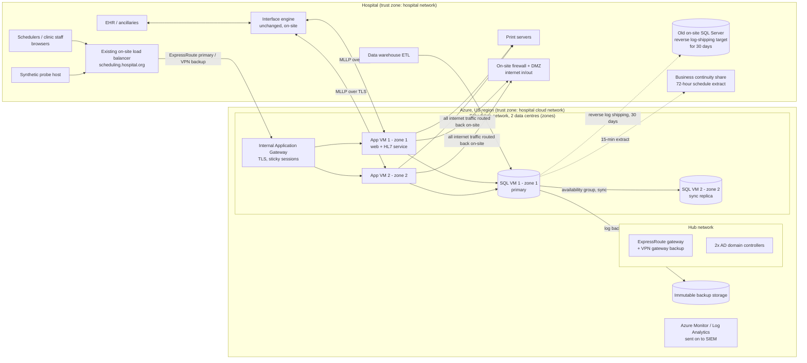

# Plan: Moving the Patient Scheduling System to the Cloud Without Downtime

> **Note on inputs.** The workspace has nothing in it except a README saying it is intentionally empty. I had no code, configuration or documentation to read. Everything about the current system below is an **assumption**, numbered A1–A14 in Section 5. The plan uses the most common hospital setup: a browser-based app on Windows servers, Microsoft SQL Server, and HL7 feeds through an on-site interface engine. The open questions at the end are the inputs that would change the plan most.

---

## 1. Summary

- **What:** Move the hospital's on-site patient scheduling system (app servers, database, batch jobs and interfaces) to the cloud (assumed Azure, A3). No maintenance window, no lost appointments, and the old system stays ready as a way back for 30 days.
- **What "without downtime" means here.** A database that only one place can write to can't switch locations with literally zero interruption. The only way to get true zero is to write to both systems at once, and I rule that out below because it can create double bookings. So the plan aims for:
  - no maintenance window and no data loss;
  - one pre-announced pause in saving changes of **15 minutes or less**, during the quietest hour (assumed Sunday 02:00–04:00), covered by the hospital's existing downtime procedures. Clinical leadership has to agree to this (A10).
- **Shape:** Copy the system across with as few changes as possible. Keep the same app, the same SQL Server version and the same web address. Change one thing only: where it runs. In the cloud, the app runs on 2 virtual machines (VMs) and SQL Server runs as a 2-node failover group (an availability group), split across 2 data centres in the same region. The hospital connects over a private line (ExpressRoute) with a VPN as backup. The interface engine stays on site.
- **Key decisions:**
  1. **Copy across, don't rebuild** (D1).
  2. **Run SQL Server on cloud VMs at the same version, not a managed database**, so the move doesn't change the database engine too (D5).
  3. **Keep the cloud copy in sync with log shipping**, then switch over using a final backup of the last few transactions. The old server is left ready to receive changes back from the cloud, which keeps rollback possible with no data loss for 30 days (D2, D3).
  4. **Switch users at the existing on-site load balancer**, so the web address stays the same (D7). **Leave the interface engine on site** (D8).
  5. **Send outbound internet traffic back through the on-site firewall** (D10). Outside vendors keep seeing the same source address, so none of them have to change their allowlists.
- **Milestone 1 (5–7 weeks):** The scheduling **test environment** runs fully in the cloud. A scheduler on the hospital network books a test appointment, and the booking message reaches the test EHR. The test database has been cut over and rolled back once, and the pause was timed. Five risk spikes are done, and the 30-day scan for hidden dependencies is running.
- **Top risks:**
  - Hidden dependencies: systems reading the database directly, scheduled jobs, printers, file shares, hard-coded addresses.
  - HL7 messages lost or duplicated at cutover.
  - A new kind of outage: the hospital losing its link to the cloud.
  - The vendor not supporting cloud hosting.
  - Cloud servers set to UTC instead of local time, which shifts appointment times.

## 2. Context and Goals

**Problem.** The scheduling system runs in the hospital's own data centre. The plan assumes the reason for moving is common for hospitals: ageing hardware, a data-centre exit, and wanting resilience across sites. Schedulers, clinic staff, booking centres and patient-facing channels (portal, reminders) all depend on it every day, so the move can't take scheduling offline.

**Goals**
1. Move production to the cloud with **zero lost or duplicated appointments**. A one-time pause in saving of **15 minutes or less** (A10).
2. After the move, perform **at least as well as today** (Section 3 targets) and be **at least as available**.
3. Keep a way back, with no data loss, for **30 days** after cutover.
4. Retire the on-site servers within **60 days** of cutover.

**Non-goals**
- Rewriting the app, changing the database schema, upgrading the app version or changing the user interface during the move. App releases are frozen from 2 weeks before cutover to 2 weeks after.
- Moving the interface engine, EHR, data warehouse or any other system. They stay where they are and only their connection points change.
- Moving to a managed database or containers. This is listed under Deferred Work.
- Running in several cloud regions at once.

**Success measures**
- Saves paused for 15 minutes or less on the night, and zero data differences in reconciliation.
- p95 time for the 5 most important user actions no more than 10% above the baseline measured in M1, sustained for 2 weeks.
- No Sev-1 or Sev-2 incident caused by the migration during the 2-week hypercare period after cutover.
- Zero duplicate patient reminders and zero lost HL7 messages, checked by comparing message counts.
- On-site servers retired by cutover + 60 days.

## 3. Drivers, Requirements, and Constraints

**Ranked quality attributes**

| # | Attribute | Measurable target | Why it matters |
|---|---|---|---|
| 1 | Data integrity / patient safety | No lost appointments (RPO, the maximum data loss, = 0 at cutover). No double bookings. No duplicate or lost HL7 messages. | A missing or doubled appointment is a patient-safety event. Integrity outranks availability: we pause saving rather than risk split writes. |
| 2 | Continuity of service | No maintenance window. One save pause of ≤15 min at the quietest hour. Afterwards, ≥99.9% monthly availability with zone redundancy *(assumption; today's figure is assumed 99.5–99.9%)* | The user's stated requirement. |
| 3 | Reversibility | Can fail back to on-site with no data loss until cutover + 30 days. Rollback during cutover night takes ≤10 min. | Our ability to predict how the old system behaves in the cloud is limited, so we need a way back. |
| 4 | Security and compliance | HIPAA (A4) satisfied: BAA in place, risk analysis signed off, encryption in transit and at rest, PHI audit logs kept 6 years, data stays in the country | Regulated health data. |
| 5 | Performance parity | p95 of key transactions ≤ baseline +10%. Baseline measured in M1. | Schedulers will notice and complain within a day. |
| 6 | Operability and cost | The current infrastructure team and DBA can run it with skills they already have. Run cost in the $5k–15k/month range (Section 11) | Small team. Avoid learning a new database engine while moving. |

**Key functional requirements (the ones that shape the design)**
- Everything the system does today must keep working:
  - booking, rescheduling and cancelling;
  - resource and template management;
  - inbound ADT (patient admission/demographic updates) and outbound SIU (scheduling) HL7 messages;
  - reminder exports;
  - letters and printing;
  - reports;
  - nightly jobs.
- The web address stays the same, so no workstation, shortcut or Citrix change is needed.

**Constraints:**
- The vendor must support the cloud hosting model (A2).
- HIPAA, with the BAA covering every service used.
- The hospital's change advisory board (CAB) and clinical change control.
- No go-live near other major events: EHR upgrades, regulatory surveys, month-end, holidays.
- Existing SQL Server licences (A12).
- Team size as described in Section 12.

**Hard parts**

| ID | Hard part | Why it's hard |
|---|---|---|
| H1 | Switching the single database that takes writes, with no data loss and a pause of ≤15 min, in a way that can be undone | There is only one writer. Every step on cutover night happens under time pressure. |
| H2 | Unknown dependencies | Old hospital systems pick up direct database readers, linked servers, hard-coded IPs, file shares, printers, monthly jobs and vendor IP allowlists that nobody wrote down. |
| H3 | Keeping HL7 messages flowing through cutover | Messages queued and replayed can be duplicated or lost. A double-sent SIU or reminder reaches real patients. |
| H4 | New failure mode: the link between the hospital and the cloud | Today, a network problem inside the hospital rarely isolates the data centre. After the move, scheduling depends on the wide-area link. |
| H5 | Differences between the on-site and cloud environments | Time zone (cloud VMs default to UTC), Kerberos/AD authentication, OS versions, licensing, vendor support. |
| H6 | Organisational lead times | HIPAA risk analysis, CAB, vendor letter, ExpressRoute ordering (4–12 weeks), clinical sign-off. |

## 4. Current State

There were no files to inspect. **Assumed current state** (each item is checked in M1 by spike S3 and task T2):

- **App tier:** 2 Windows Server VMs running IIS with a .NET or Java web app, behind an on-site load balancer (F5 or NetScaler class) at an internal address such as `scheduling.hospital.org`. A Windows service on the same servers handles HL7 over MLLP (a simple TCP framing used for HL7 messages). Sessions are stored in the server's memory, so users need to stay on the same server ("sticky" sessions).
- **Database:** SQL Server 2016–2022, Standard or Enterprise edition, on 1 VM or a cluster. 100 GB–1 TB. SQL Agent jobs handle reminders, extracts and cleanup. Full backups nightly, transaction-log backups every 15–60 minutes, copied to a second site.
- **Integrations:**
  - An on-site interface engine (e.g. Rhapsody, Cloverleaf, Mirth, Corepoint). It sends ADT messages into scheduling and carries SIU messages out to the EHR, ancillary systems and the reminder vendor.
  - A data-warehouse ETL that probably reads the database directly.
  - A patient portal and reminder vendor reached over the internet through the hospital's perimeter network (DMZ).
  - Printing to on-site print servers.
- **Identity:** On-site Active Directory. Users sign in either through Windows authentication or through an AD/LDAP lookup inside the app.
- **Conventions to keep:** Hospital patching tooling (SCCM/WSUS), endpoint protection (EDR), backup tooling, monitoring, the SIEM, and the CAB process. Cloud servers get the same agents and processes, so operations teams change as little as possible.

## 5. Assumptions and Open Questions

**Assumptions**

| ID | Assumption | Impact if wrong | How and when validated |
|---|---|---|---|
| A1 | Browser-based app on Windows servers with a SQL Server database | Thick client talking straight to the DB: Citrix/VDI must move next to the DB. Oracle: replace log shipping with Data Guard. | Inventory, M1 week 1 (T2) |
| A2 | Either the vendor supports running it on hospital-managed cloud servers, or the app is built in-house | Without vendor support this is a blocker. A vendor-hosted SaaS version might be the better path. | Written vendor statement, M1 week 2 (T1) |
| A3 | Cloud is Azure (existing Microsoft agreement, Entra ID, M365) | On AWS the service names change. Strategy is the same. | Confirm with IT leadership, week 1 |
| A4 | US hospital, HIPAA, data stays in the US | Different region choice and compliance controls | Privacy officer, week 1 |
| A5 | Database 100 GB–1 TB, logs < 20 GB/day | Larger means a longer initial copy and a bigger link; the approach still works | T2 |
| A6 | Peak ~400 concurrent users and ~3,000 writes/hour (Monday 08:00–10:00). Quietest hour is Sunday 02:00–04:00 with fewer than 20 writes/hour. | Changes the cutover time and sizing | Read from IIS/SQL logs, M1 (T3) |
| A7 | HL7 v2 over MLLP through an on-site interface engine; the app keeps outbound messages in a table inside its own database | If the app sends directly to the EHR, there are more endpoints to repoint and the draining step at cutover changes | S5, T2 |
| A8 | No production cloud workloads with PHI yet; no ExpressRoute; little cloud experience in the team | If a landing zone (a pre-built, governed cloud foundation) already exists, M1 is about 2 weeks shorter | Week 1 |
| A9 | Today: ~99.5–99.9% availability with monthly patch windows, and disaster recovery from backups with an untested recovery time | Sets the "no worse than today" bar | T3 |
| A10 | Clinical leadership accepts one save pause of ≤15 minutes at the quietest hour under downtime procedures | If literally zero is required, the app must be changed to queue writes, adding about 2–3 months | **Ask now.** Needs CMIO/CNO sign-off before M3 |
| A11 | Users reach the app through a hostname or load-balancer address the hospital controls | If addresses are hard-coded on clients, those clients need changing | T2 |
| A12 | SQL Server licences with Software Assurance are available, so they can be reused in Azure (Azure Hybrid Benefit) | Paying for SQL licences by the hour adds roughly $1.5–4.5k/month | Licensing team, M1 |
| A13 | The scheduling test environment contains synthetic data, not copies of real patient data | If it holds PHI, the M1 thin slice must wait until security controls (T6) are in place, adding 1–2 weeks | T2 |
| A14 | No hard deadline (such as a data-centre lease ending) | A fixed date squeezes M3 rehearsals. Rehearsals are the last thing to cut. | Week 1 |

**Open questions**

| Question | Who can answer | Default if no answer | Needed by |
|---|---|---|---|
| Is it a vendor product, and will the vendor support Azure servers? | App owner / vendor account manager | Assume yes, and go to the vendor in week 1 | End of M1 week 2 |
| Is "≤15 min save pause at 03:00 under downtime procedures" acceptable? | CMIO / CNO / scheduling operations director | Assume yes | Start of M3 |
| SQL Server version and edition, and DB size? | DBA | 2019 Standard, 500 GB | M1 week 1 |
| Does the hospital use an existing cloud landing zone or a mandated firewall product? | Infrastructure / security lead | Build a minimal landing zone using NSGs only (D10) | M1 week 1 |
| What is the DR expectation after the move? | IT risk / BC planning | Recovery time ≤4 h, data loss ≤15 min, in a second US region (M5) | M4 |

## 6. Architecture Overview

**How it fits together.**
- Users keep the same web address. The on-site load balancer now forwards to an internal Application Gateway in Azure over ExpressRoute, with a VPN as automatic backup.
- The app VMs and SQL VMs sit in the same Azure region, so the app's many small database calls never cross the wide-area link. Only browser traffic and HL7 messages do.
- The interface engine stays on site. Only its scheduling endpoints change.
- All cloud traffic to the internet is routed back through the hospital firewall. External vendors see no change.
- During migration, log shipping (regularly sending transaction-log backups to another server and applying them) keeps the cloud database a few minutes behind the on-site one. After cutover the direction reverses, so the old server stays current as the way back.

**Component table**

| Component | Responsibility | Owns data | Interfaces | Technology | Key dependencies |
|---|---|---|---|---|---|
| Edge routing (existing) | Sends users to the on-site or cloud app servers | Load-balancer configuration | HTTPS VIP | Existing F5/NetScaler | Hybrid connectivity |
| Hybrid connectivity | Private, redundant link between hospital and Azure | Routing/BGP configuration | Private IP routing | ExpressRoute 1 Gbps + site-to-site VPN on a different ISP | Carrier, on-site edge routers |
| Cloud network and identity foundation | Networks, NSGs, routing, policy, admin access, domain controllers | IaC state (lives in Azure itself) | — | Bicep, Azure Policy, Entra ID + PIM, AD DS VMs | Hospital AD |
| Scheduling app tier | Runs the unchanged app and its HL7 service | None (stateless apart from sticky sessions) | HTTPS (UI), MLLP/TLS (HL7) | 2× Windows VMs (rehosted image), internal App Gateway v2 | SQL tier, domain controllers, print servers |
| Scheduling database tier | System of record for scheduling data | All scheduling data (Section 8) | TDS (SQL protocol) via availability-group listener `sched-db.hospital.org` | 2× SQL Server VMs, **same version as on-site**, availability group across zones | Blob backups, domain controllers |
| Migration sync (temporary) | Keeps the cloud DB in step before cutover, then the old DB in step after | — | Log backups over SMB/Blob | SQL Server log shipping + scripts in `db/logshipping/` | Connectivity |
| Reconciliation tool (temporary) | Proves source and target hold the same data | Reconciliation reports | CLI → report | PowerShell + T-SQL in `reconcile/` | Read access to both DBs |
| Business continuity extract | Every 15 min, puts the next 72 hours of appointments on an on-site share so staff can still see schedules if the link fails | Extract files | CSV/PDF on SMB share | SQL Agent job + share | Connectivity (pushes while the link is up) |
| Observability | Logs, metrics, synthetic user checks, alerts | Telemetry | — | Azure Monitor + Log Analytics → hospital SIEM; Playwright probe on site | — |
| Interface engine (existing) | Routes HL7 messages | Its message queues | MLLP | Unchanged | App tier endpoints |

## 7. Component Details

**Edge routing.**
- Gets one new server pool, "cloud", pointing at the App Gateway's private IP. Cutover means changing which pool is active, which takes under a minute and can be undone in under a minute.
- **Does not** do TLS termination for the cloud pool. TLS (encrypted HTTPS) is decrypted at the App Gateway, so traffic stays encrypted across ExpressRoute, which is *not* encrypted by default.

**Hybrid connectivity.**
- ExpressRoute: 1 Gbps through a peering location in the same metro area as the hospital.
- Site-to-site IPsec VPN on a **different ISP and a different building entry point** as backup. BGP fails over between them automatically.
- Target: failover in under 60 s (assumption, tested in M2).
- The VPN is used on its own for M1 (test data only), because ExpressRoute takes 4–12 weeks to arrive.

**Scheduling app tier.**
- Rehosted as-is using Azure Migrate replication. No OS or app upgrades during the move: change one thing at a time.
- The App Gateway uses cookie affinity (sticky sessions) because sessions live in server memory (assumed). Health probes hit a page that touches the database, not just a "server is up" check.
- **VM time zone set to the hospital's local zone** in IaC, plus a daylight-saving test (H5).
- Joined to the domain through cloud domain controllers, so authentication keeps working if the link to the hospital wobbles.
- Failure handling: if one VM fails, the App Gateway stops sending to it and sessions on that VM are lost, the same as on site today. A whole-zone failure leaves the other zone running.

**Scheduling database tier.**
- Same major version and edition as on site (D5).
- Availability group with synchronous commit across zones and a listener DNS name, `sched-db.hospital.org`. In M2 every database consumer is switched to this name *while still on site* (T-step in M2). Cutover then only moves where the name points.
  - On Standard edition: a Basic availability group (one per database).
  - On Enterprise: a full availability group.
- Storage: Premium SSD v2, separate data and log disks.
- Backups: native SQL backup to immutable Blob storage. Full weekly, differential daily, log every 5 min (RPO ≤5 min outside cutover).
- Automatic failover between zones. Target recovery time under 60 s, tested in M3.

**Interface engine.** Unchanged, apart from:
- repointing the scheduling inbound and outbound connections to the cloud listener;
- switching on MLLP over TLS if the engine supports it, otherwise IPsec over ExpressRoute (D9).

**Reconciliation tool.**
- For each table: row counts, plus `CHECKSUM_AGG(BINARY_CHECKSUM(*))` over the key tables. Run at points where nothing is being written (rehearsal copies, and the cutover pause), where the results must match exactly.
- Per hour: HL7 message counts from the engine logs and the app's outbound table.

## 8. Data Design

**Entities** (assumed, confirmed in T2):
- Patient (a local copy of EHR/MPI demographics, keyed by MRN);
- Provider/Resource, Location, Schedule Template, Slot;
- Appointment and Appointment Status History;
- Waitlist, Referral/Order link;
- Outbound Message Queue, Reminder Log, App Audit Log.

| Entity | System of record | Writer |
|---|---|---|
| Appointment, Slot, Template, Waitlist | Scheduling DB | Scheduling app only |
| Patient demographics | EHR/MPI (the master patient index); scheduling holds a copy | Scheduling HL7 inbound service |
| Outbound messages, reminder log | Scheduling DB | Scheduling app/jobs |
| Audit logs (app + SQL Server Audit) | Scheduling DB + Log Analytics/immutable storage | App, SQL Server |

**Consistency.**
- Booking integrity (no double booking) stays in the app's existing database transactions, which we don't touch.
- The migration keeps exactly **one writable copy at any moment**. That rule is why we use one-way log shipping and an ordered cutover, and reject syncing in both directions (D3).

**Access patterns.** Unchanged, and so is indexing. Re-baseline query plans after the move (same version, so the risk is low).

**Retention and deletion.**
- Unchanged in the app.
- Final on-site backups are kept for the medical-records retention period set by the records office.
- Old disks are wiped to NIST 800-88 after retirement.
- SQL audit logs are kept 6 years in immutable storage.

**Backup and restore targets after the move.**
- Data loss (RPO): ≤5 min. Recovery within the region (RTO): ≤1 h for a full database restore.
- A test restore is done in M2 and again quarterly.
- DR to a second region comes in M5.

**Classification and protection.**
- Everything is PHI.
- Encryption at rest: TDE on the database plus Azure disk encryption with platform-managed keys. Customer-managed keys only if hospital policy requires them; that's easy to add later.
- TLS 1.2+ in transit. Log shipping and SMB traffic are encrypted (SMB 3 encryption).
- No PHI goes into application telemetry. The probe uses a dedicated `ZZTEST` patient.

**Schema evolution.** Frozen from cutover −2 weeks to +2 weeks. Afterwards, the app's normal release process.

## 9. Key Flows

**Flow 1: Book an appointment (after the move)**
1. A scheduler opens `scheduling.hospital.org` → on-site load balancer → ExpressRoute → App Gateway (TLS) → app VM (sticky).
2. The app checks the slot and writes the appointment plus an outbound SIU^S12 row in one database transaction on the primary. The commit waits for the zone-2 replica.
3. The app's HL7 service reads the outbound row → MLLP/TLS → interface engine → EHR and reminder vendor. The row is marked sent when the ACK (acknowledgement) arrives.
4. Extra latency per page is one round trip on ExpressRoute (~2–10 ms) per browser request. The database calls don't cross the link.

**Flow 2: Inbound ADT update.**
- EHR → engine → MLLP over the link → app listener → DB update → ACK.
- If the listener is down, the engine queues and retries. An alert fires when the queue goes over 50 messages for 5 minutes.

**Flow 3: Production cutover (the critical flow). Target: saves paused for ≤15 min**

| Step | Action | Budget |
|---|---|---|
| Before | The cloud DB has had log backups shipped and applied every 1 min for 2 weeks. All reconciliation checks passed. Go/no-go signed off. Bridge call open with DBA, app owner, interface analyst, network, scheduling super-user, service desk, and an incident commander. | — |
| 1 | Interface engine: **hold** inbound channels to scheduling. Wait until the scheduling inbound queue reaches 0 and every message is ACKed. | 1–2 min |
| 2 | Load balancer: show a "saving paused, back by HH:MM" page. Stop the on-site app pools. Wait until the outbound message table has 0 unsent rows. Disable on-site SQL Agent jobs and scheduled tasks, using the list from S3. **The save pause starts here.** | 2 min |
| 3 | On site: `BACKUP LOG ... WITH NORECOVERY` (final "tail" backup). This leaves the old database in a restoring state, ready to receive changes back later. Copy the file and restore it on both cloud SQL VMs. Bring SQL VM 1 online (`RECOVERY`). | 1–3 min |
| 4 | Join SQL VM 2 to the availability group (it already holds the restored copy). Point `sched-db.hospital.org` at the cloud listener. Run the reconciliation quick check: counts and checksums on 12 key tables must match exactly. | 2 min |
| 5 | Start the cloud app services and enable the SQL Agent jobs **in the cloud only**. Super-user smoke test through the App Gateway address: search, book, cancel on `ZZTEST`. The SIU reaches the EHR. | 3–4 min |
| 6 | Switch the load balancer to the cloud pool. Repoint the engine's scheduling channels and release the held queue. | 1 min |
| 7 | Open to users. **The save pause ends here.** Start reverse log shipping, cloud → old on-site DB, every 5 min. Watch closely for 60 minutes. | — |

**Flow 4: Failure paths**
- **Validation fails at step 4 or 5:** Stop. Run `RESTORE DATABASE ... WITH RECOVERY` on site, which loses no data because the cloud took no user writes. Switch the load balancer back, restart the on-site app, release the engine queue to on-site. Takes ≤10 min. The pause becomes about 25 min in total and is covered by downtime procedures.
- **Duplicate HL7 message when the queue is released:** Steps 1 and 2 empty both directions before the switch, so normally nothing is in flight. If S5 shows the app is not idempotent on MSH-10 (HL7's unique message ID), the engine's duplicate filter is turned on for the 2 hours around cutover.
- **The same job runs in both places** (for example, reminders sent twice): prevented by the step 2 and step 5 lists. The test in M3 checks that disabled on-site jobs stay disabled.
- **ExpressRoute fails after the move:** BGP moves traffic to the VPN in under 60 s. Some users may have to sign in again.
- **Both ExpressRoute and VPN fail:** The synthetic probe alerts within 2 minutes. The incident commander invokes downtime procedures, and staff use the business continuity extract (at most 15 minutes old) for read-only schedules. The engine queues inbound messages. When the link returns, the queues empty and paper bookings are entered through the normal conflict check.
- **Serious problem found within 30 days:** Reverse the cutover using Flow 3 in the other direction (tail backup from the cloud, restore on site). No data loss.

## 10. Key Decisions

| # | Decision | Options considered | Rationale (against drivers) | Reversibility | Revisit if |
|---|---|---|---|---|---|
| D1 | Copy the system across as-is (rehost) | Rehost; rebuild for the cloud; switch to the vendor's SaaS | Fewest moving parts protects integrity (#1) and continuity (#2). A rebuild means a rewrite, which is out of scope. | Medium | The vendor offers a supported SaaS version with a migration service |
| D2 | Sync with log shipping, then a final tail backup with `NORECOVERY` | Log shipping; distributed availability group; Azure Database Migration Service (online); syncing both ways | Works on every edition and version 2016+. The DBA already knows it. Cutover takes minutes. The old server becomes the way back for free (#3). | Easy | S1 shows the DB step of cutover takes more than 5 min **and** the hospital is on Enterprise edition: switch to a distributed availability group |
| D3 | Switch all writes at once, in one rehearsed pause | All at once; department by department; writing to both systems | Shared resources and appointments that span departments mean there is no safe split. Writing to both systems risks double bookings (#1). | — | Clinical leadership refuses any pause (A10) |
| D4 | Azure | Azure; AWS | Assumed existing Microsoft agreement and Entra ID; the Microsoft BAA is already in its product terms | Hard | The hospital standard is AWS. Same plan with EC2 and Direct Connect. |
| D5 | SQL Server on Azure VMs, same version | SQL on VMs; Azure SQL Managed Instance; Azure SQL Database | Keeps the engine, Windows authentication, linked servers, SQL Agent and failback identical. Managed Instance changes authentication, DNS-alias behaviour and failback rules (failback only works from SQL Server 2022). | Medium | After the move, as a separate project (see Deferred Work) |
| D6 | Windows VMs for the app | VMs; App Service; containers | The vendor app most likely needs a full Windows/IIS server | Easy later | Vendor certifies a PaaS option |
| D7 | Switch at the existing load balancer, same web address | Load balancer pool; new address; Azure Front Door | No changes on workstations. Switching back takes about 1 minute. | Easy | The load balancer is due for replacement |
| D8 | Interface engine stays on site | Stay; move it at the same time | Moving two critical systems at once makes failures harder to diagnose | Easy | Separate project after M5 |
| D9 | HL7 encrypted with MLLP over TLS, otherwise IPsec over ExpressRoute | TLS; IPsec; MACsec | ExpressRoute isn't encrypted. TLS is per-connection and cheap. MACsec needs ExpressRoute Direct, which costs too much. | Easy | — |
| D10 | Internet traffic routed back on site; NSGs only, no cloud firewall at first | Route back on site; Azure Firewall; mandated third-party firewall | Vendors keep the same source address, and the existing security inspection still applies | Easy | Security mandates a cloud firewall, or the route back adds too much latency |
| D11 | IaC in Bicep through Azure DevOps | Bicep; Terraform | Azure only. Bicep has no separate state file to secure and lock, which suits a small team new to IaC. | Easy | The hospital already uses Terraform |

## 11. Cross-Cutting Concerns

**Security (M1 baseline, hardened in M2)**
- **BAA.** Legal confirms the HIPAA BAA covers every service used. Security completes the HIPAA risk analysis before any PHI enters Azure (gate for M2).
- **Admin access.**
  - Entra ID with MFA, plus PIM (Privileged Identity Management) for just-in-time admin rights.
  - Two break-glass accounts (emergency-only admin accounts).
  - Separate subscriptions for production and non-production.
- **Network.** No public IPs, enforced by an Azure Policy *deny* rule. NSGs allow only App Gateway→app, app→SQL, engine↔app MLLP, and the backup and monitoring paths.
- **Secrets.** Stored in Key Vault. Service accounts are AD accounts managed by the DBA, as today.
- **Monitoring and patching.**
  - Defender for Cloud.
  - Hospital EDR and patching agents.
  - The Azure Policy HIPAA/HITRUST initiative set to audit mode.
- **Main threats and mitigations:**
  1. Something exposed to the internet by mistake → policy deny rule plus a CI policy check.
  2. Ransomware or a stolen admin credential → PIM, immutable backups, and a backup admin role kept separate from the server admin role.
  3. PHI leaking through the test environment or the sync path → synthetic test data (A13) and encrypted log shipping.
  4. Insiders looking at records → existing app audit plus SQL Audit sent to the SIEM.
  5. Losing the link to the cloud (an availability threat) → see Reliability.

**Reliability.**
- Two zones for app and SQL. Timeouts and retries stay as the app has them today. The engine retries HL7 messages.
- New: two separate network paths, the business continuity extract every 15 min, and refreshed downtime procedures (M3).
- Targets: ≥99.9% monthly, failover between zones in under 60 s, data loss ≤5 min.

**Observability (M1 for test, M2 for production)**
- A synthetic Playwright probe runs **from an on-site host** every 60 s: sign in, search slots, book and cancel for `ZZTEST`. It measures the real user path, including the link to the cloud.
- **Alerts, each with a runbook in `runbooks/`:**

| Alert | Fires when |
|---|---|
| Probe failure | 2 checks fail in a row |
| Booking is slow | p95 of the probe's booking step is more than 1.5× baseline for 10 min |
| HL7 queue backing up | Engine queue is over 50 for 5 min |
| Sync falling behind (migration only) | Log-shipping restore lag over 10 min |
| Connectivity path lost | ExpressRoute or VPN path down |
| Availability group unhealthy | AG not healthy |
| Backups missed | Log backup not done in the last 15 min |

**Performance and capacity.**
- Expected peak: ~400 users and ~3,000 writes/hour (A6).
- Size the cloud VMs to match on-site CPU and memory, with 30% headroom.
- Load test at 2× peak in M3 (Section 14).
- Most likely bottleneck: a chatty app if it's ever split from its database. That's why app and DB move together unless spike S2 shows the app-first canary is safe.

**Cost** (rough, to be checked with the Azure pricing calculator in M1)
- Production runs at about **$5k–15k/month**: 2 SQL VMs (8 vCPU), 2 app VMs (4 vCPU), 2 domain controllers, App Gateway, ExpressRoute 1 Gbps plus carrier fees, storage, logs.
- The biggest variables are SQL licensing (close to zero with Hybrid Benefit, A12) and Log Analytics ingestion. A daily cap and filtering on data collection rules keep the log cost down.
- Both environments run side by side for about 2 months.
- Tag everything `app=scheduling, env, cost-center`, and set a budget alert at 80%.
- Reserved instances after M5 (about 30–40% saving).

**Operations.**
- Same owners as today. The infrastructure on-call team covers VMs and network, the DBA covers SQL, the app owner covers the app, and the integration team covers the engine.
- New runbooks: cloud failover, link failover, restore, and the cutover/failback runbook.
- Azure support plan with a 1-hour response for critical issues.
- The service desk gets a 1-page guide before cutover.

**AI-specific concerns.** Not applicable. There are no AI components.

## 12. Build Sequence

**Team assumption:**
- 1 migration lead/PM;
- 1 DBA;
- 2 infrastructure engineers (at least one with Azure experience, or a partner for M1–M2);
- 1 app owner or vendor contact;
- 1 integration analyst at 50%;
- security/privacy part time;
- 2–3 scheduling super-users at about 4 hours a week in M3–M4.

**Overall size:** about 4.5–7 months up to retirement of the old servers. These are rough guides, not commitments.

| Milestone | Goal | Scope / excluded | Exit criteria | Depends on | Size |
|---|---|---|---|---|---|
| **M1 – Thin slice and spikes** | Prove the whole path and the cutover method on the **test** environment. Start the long-lead items. | Landing zone (non-prod), VPN, test app and DB in the cloud, spikes S1–S5, dependency discovery started. *Excluded:* PHI, ExpressRoute, production. | Test booking from the hospital network reaches the test EHR. Test DB cut over and failed back once, both timed. Spike reports written. ExpressRoute ordered. Vendor letter requested. | — | 5–7 wks |
| **M2 – Production foundation and live sync** | Production cloud environment secured, and the production DB syncing | ExpressRoute live, production landing zone, security sign-off, SQL VMs, log shipping from production, the `sched-db` name switched over on site, monitoring, test restore. *Excluded:* user traffic. | Risk analysis signed. Lag under 5 min for 14 days. Weekly reconciliation passes. Restore test meets the targets. ExpressRoute→VPN failover in under 60 s. | M1; ExpressRoute delivered (**critical path**) | 4–6 wks |
| **M3 – Readiness and rehearsals** | Make cutover night routine | Production app tier built in the cloud, load test, 3 full rehearsals on a production-sized copy, downtime procedures and continuity extract, go/no-go criteria, communications. Optional app-first canary (only if S2 allows). | 2 rehearsals in a row: pause ≤15 min, reconciliation passes, rollback ≤10 min. Load test at 2× peak meets p95 targets. CMIO sign-off on A10. CAB approval. | M2; S3 has 30 days of data | 3–5 wks |
| **M4 – Cutover and hypercare** | Production runs in the cloud | Flow 3, then 2 weeks of hypercare | Section 2 success measures met for 14 days | M3 | 1 night + 2 wks |
| **M5 – DR and retirement** | Remove dual running and add regional DR | DR replica in a second US region (async log shipping or AG plus Azure Site Recovery for app VMs), DR test, end reverse sync at day 30, retire servers at day 60, reserved instances | DR test meets RTO ≤4 h and RPO ≤15 min. On-site servers off and wiped. | M4 + 30 days | 4–8 wks (mostly waiting) |

**Critical path:** HIPAA risk analysis and ExpressRoute order (day 1) → ExpressRoute live → production sync stable for 14 days → 3 rehearsals → cutover. Dependency discovery (S3) needs 30 days of observation and must finish before M3 rehearsals.

**Can run in parallel:** M1 spikes; the vendor letter; security review; drafting downtime procedures and communications; building the production app tier while M2 sync settles.

## 13. First Milestone Task Breakdown

Work happens in a new repo `sched-cloud-migration` in the hospital's Azure DevOps, structured as `infra/`, `pipelines/`, `db/logshipping/`, `reconcile/`, `discovery/`, `tests/synthetic/`, `runbooks/` and `docs/adr/`.

**Day 1 long-lead items (in parallel):**

| # | Task | Location | Done when |
|---|---|---|---|
| T1 | Ask the vendor for a written statement of support for Azure IaaS at the current app version, including the supported OS and SQL versions | Vendor account; `docs/adr/0001-vendor-support.md` | Signed statement on file, or a recorded "no" escalated to leadership |
| T1b | Order ExpressRoute 1 Gbps (carrier + Azure circuit). Order the backup ISP line for the VPN if one doesn't already exist. | Network team | Order numbers and delivery dates in the plan |
| T1c | Start the HIPAA risk analysis and BAA confirmation. Book the CAB and clinical sign-off dates. Agree change-freeze windows. | Security / privacy / PMO | Risk analysis scheduled with an owner. Freeze calendar published. |

**Discovery and baseline:**

| # | Task | Location | Done when |
|---|---|---|---|
| T2 | Inventory the current system: servers, OS, SQL version/edition/size, databases, logins, linked servers, SQL Agent jobs, Windows scheduled tasks, file shares, printers, certificates, load-balancer config, engine channels, outbound vendor endpoints | `discovery/inventory.xlsx` + `discovery/scripts/` (PowerShell, T-SQL) | Reviewed by the DBA, app owner and integration analyst. Each item marked migrate / repoint / retire. |
| T3 | Record performance and availability baselines: p95 for the 5 key transactions from IIS logs, writes per hour by hour of the week (confirms the quietest hour, A6), and 12 months of uptime from incident records | `discovery/baseline.md` | Numbers published. Cutover time slot proposed from the data. |
| S3 | **Spike: hidden dependencies (30 days).** • *Question:* who and what talks to the system that we don't know about? • *Method:* SQL Server Audit / Extended Events logging `host_name`, `program_name` and login. NSG-style flow capture or firewall logs on the app/DB server IPs. Search config files for IPs and hostnames. • *Time box:* 3 days to set up, 30 days to observe. | `discovery/s3-dependencies/` | Each consumer found has an owner and a repoint action. *Changes the plan if:* we find clients that hard-code IPs, or direct DB consumers that can't use a DNS name. |

**Cloud foundation (non-prod):**

| # | Task | Location | Done when |
|---|---|---|---|
| T4 | Create the management-group/subscription layout (`sub-sched-nonprod`, `sub-sched-prod`, `sub-connectivity`), Entra admin groups with PIM, and break-glass accounts | `infra/landing-zone/` | Admin rights only through PIM activation. Break-glass sign-in tested. |
| T5 | Write Bicep for the hub and spoke networks (non-prod), NSGs, route table sending 0.0.0.0/0 back on site, and the VPN gateway. Pipeline runs `az deployment what-if` on PRs and deploys after approval. | `infra/network/`, `pipelines/infra.yml` | A PR shows the what-if output. Merge deploys. The tunnel is up and an on-site host pings a test VM. |
| T6 | Assign Azure Policy: deny public IPs and public network access, require tags, require diagnostic settings, HIPAA/HITRUST initiative in audit mode | `infra/policy/` | Creating a VM with a public IP from the portal fails. Compliance dashboard visible. |
| T7 | Deploy 2 AD domain controllers into the hub, as an AD site with replication | `infra/identity/` | AD replication healthy. Test VM domain-joined through the cloud domain controller. |
| T8 | Set up Log Analytics, forward to the SIEM, and install the hospital agents (EDR, patching, backup) on cloud VMs | `infra/monitoring/` | A test VM shows in the SIEM, EDR console and patching console |

**Thin slice: the test environment in the cloud**

| # | Task | Location | Done when |
|---|---|---|---|
| T9 | Replicate the test app server with Azure Migrate into the non-prod spoke. Set the local time zone in Bicep/VM configuration. | `infra/workloads/scheduling/` | The app starts and the server's local time matches on-site |
| T10 | Build a SQL VM matching the on-site test SQL version. Set up log shipping on-site test → cloud. | `db/logshipping/setup.sql`, `infra/workloads/scheduling/sql.bicep` | Restore lag under 5 min for 72 hours |
| T11 | Write the reconciliation script (per-table counts plus checksums on the key tables, with a JSON/HTML report) | `reconcile/` | Running on two copies taken at the same point gives a 100% match. A row changed on purpose is detected. |
| T12 | Add the "cloud-test" pool to the load balancer and an internal App Gateway with TLS and cookie affinity | LB config (change ticket), `infra/workloads/scheduling/appgw.bicep` | A browser on the hospital network loads the test app through the cloud |
| T13 | Repoint the engine's **test** scheduling channels to the cloud app. MLLP over TLS if supported. | Interface engine (test) | An ADT sent from the test EHR updates a patient in the cloud test app, and an SIU from booking shows up in the test EHR |
| T14 | Write the Playwright probe (sign in, search, book, cancel `ZZTEST`) running every 60 s from an on-site host, plus probe-failure and latency alerts | `tests/synthetic/`, `infra/monitoring/alerts.bicep` | Stopping the cloud app pool on purpose fires the alert within 3 min |

**Spikes (each with a time box and what would change the plan):**

| # | Question | Time box | Changes the plan if |
|---|---|---|---|
| S1 | **Database cutover and failback.** Using `runbooks/cutover-draft.md` on the test DB: how long do tail backup, copy, restore and recovery take? Does reverse log shipping from the `NORECOVERY` state work? Does the `sched-db` DNS name work for every consumer? | 4 days | The DB part takes more than 5 min, or failback fails → switch to a distributed AG (Enterprise) or re-examine D5 |
| S2 | **Chattiness.** Count DB round trips for each key transaction (Extended Events) and measure ExpressRoute/VPN round-trip time | 3 days | Added p95 under 200 ms → offer the app-first canary in M3. Otherwise app and DB move together (the default). |
| S4 | **Authentication in the cloud.** Do user sign-in (AD/LDAP/Kerberos), service-account authentication to SQL, and SPNs work on cloud VMs against the cloud domain controllers? | 3 days | Kerberos or SPN changes are needed → add them to the inventory and the vendor ticket |
| S5 | **HL7 duplicates.** Replay a duplicate MSH-10 into the test app and also kill the app before it sends an ACK. Observe what happens. | 2 days | The app isn't idempotent → the engine duplicate filter becomes a required cutover step |

**Close-out:**

| # | Task | Location | Done when |
|---|---|---|---|
| T15 | Do a full test cutover and failback rehearsal on the test environment using Flow 3, and time every step | `runbooks/cutover.md` v0.1 | Pause measured. Reconciliation passes. Failback passes. Lessons logged. |

**Order:**
- T1/T1b/T1c, T2, T3 and S3 start day 1.
- T4→T5→T6/T7/T8.
- T9–T14 after T5 and T7.
- S1 after T10. S2 and S4 after T9. S5 after T13.
- T15 last.

## 14. Testing and Validation Strategy

| Risk | Test | When | Blocks release? |
|---|---|---|---|
| Infrastructure drift or misconfiguration | Bicep what-if plus policy compliance in CI | Every PR | Yes |
| Data integrity at cutover (H1) | Reconciliation script at every rehearsal and at step 4 of cutover | M1, M3, M4 | Yes: any mismatch means no-go or rollback |
| Functional regression (H5) | Super-user script of the 25 most common scheduling tasks plus automated Playwright for the top 5. Includes time-zone and daylight-saving checks and letter printing. | M1 (test), M3 (rehearsals) | Yes |
| HL7 continuity (H3) | Replay a synthetic set of 500 messages. Compare message counts. Duplicate tests from S5. | M1, M3 | Yes |
| Jobs running twice | Check that on-site jobs are disabled and cloud jobs enabled. Compare the reminder log. | Rehearsals | Yes |
| Performance (#5) | Replay recorded user journeys at 2× peak against a production-sized copy | M3 | Yes, if p95 > baseline +10% |
| Resilience (H4) | Zone failover, ExpressRoute→VPN failover, both paths down (continuity extract and downtime drill), restore test | M2–M3 | Yes |
| Security | Defender findings, a vulnerability scan, and an external pentest of the cloud scope if policy requires one | M2 | High/critical findings block |

**Environments.**
- Non-prod: the test environment, using synthetic data.
- Rehearsal environment: production-sized copy of the database restored into the **production** subscription under production controls. It holds PHI, so it is torn down after M3.

**Go/no-go criteria for cutover:**
- 2 rehearsals in a row within the pause and rollback targets;
- 14 days of sync lag under 5 min;
- S3 dependency list closed;
- load test passed;
- CMIO and CAB approval;
- no conflicting hospital events;
- vendor on standby.

## 15. Rollout, Migration, and Rollback

**Rollout**
1. **Read-only first (M2).** Optionally point the data-warehouse ETL at a read-only copy restored from the cloud backups. This tests real use with no write risk.
2. **App-first canary (M3, only if S2 allows).** Move one clinic's users to the cloud app tier while it still uses the on-site database, through `sched-db`. Grow to 100% over 1 week. Cutover night then only involves the database.
3. **Database cutover (M4).** Flow 3.

**Rollback windows**

| Window | How to roll back | Data loss | Time |
|---|---|---|---|
| Before step 2 | Abort | None | Immediate |
| Steps 2–5 (no user writes in the cloud yet) | `RESTORE ... WITH RECOVERY` on site, switch the load balancer back, release the engine to on-site | None | ≤10 min |
| Cutover to day +30 | Planned failback: reverse Flow 3. The on-site copy is ≤5 min behind through reverse log shipping. | None if planned (≤5 min if a cloud disaster forces it) | 15 min pause |
| **Point of no return** | Reverse sync is stopped on day 30 (M5). Cloud SQL must stay on the same version until then; an upgrade would break the reverse sync. | — | — |

## 16. Risks and Mitigations

| Risk | L | I | Mitigation | Early warning | Owner |
|---|---|---|---|---|---|
| Hidden dependency breaks at cutover (H2) | H | H | S3 30-day scan, the `sched-db` name switched in M2, rehearsals | New hosts in the SQL audit after week 2 | DBA |
| HL7 messages lost or duplicated (H3) | M | H | Empty queues before cutover, S5, duplicate filter, message-count reconciliation | Count mismatch in rehearsal | Integration analyst |
| Link to the cloud fails after the move (H4) | M | H | Separate ExpressRoute and VPN paths, continuity extract, downtime drill | Path-down alerts, flapping | Network lead |
| Vendor won't support Azure | M | H | T1 in week 1. Option to switch to vendor SaaS. | Vendor stalls past week 2 | App owner |
| VM time zone or daylight-saving offset (H5) | M | H | Set in IaC; daylight-saving test | Appointment times shifted in the test slice | Infra |
| ExpressRoute delivery slips | H | M | Order day 1. VPN for non-prod. Shift M2. | No carrier date by week 3 | Network lead |
| Pause goes over 15 min | M | M | 3 timed rehearsals, scripted steps, app-first canary | Rehearsal over 12 min | Migration lead |
| Clinical leadership won't accept a pause (A10) | L | H | Ask now. Fallback is app changes to queue writes, about +2–3 months. | — | Migration lead |
| PHI in the test environment (A13) | M | M | Check in T2. If so, run T6 before T10. | — | Security |
| Team inexperienced in Azure | M | M | Partner for M1–M2. Patterns kept simple (VMs, NSGs). | PRs stuck in review | Infra lead |
| Running both environments costs too much | L | L | Retire on day 60. Budget alerts. | Spend 20% above forecast | PMO |

## 17. Deferred Work and Future Evolution

| Deferred item | Trigger to build it |
|---|---|
| Move to Azure SQL Managed Instance or another managed database | After M5, once 3 months have been stable and the vendor certifies it. Run a separate compatibility check. |
| OS or app version upgrades | First release after the freeze lifts (cutover +2 weeks) |
| Move the interface engine to the cloud | Its own project. It would remove the HL7 traffic across the link. |
| Azure Firewall or a third-party cloud firewall; direct internet traffic from the cloud | Security mandate, or the route back on site becomes a bottleneck |
| Customer-managed encryption keys | Policy requirement |
| Session state shared between app servers (dropping sticky sessions) | Need for seamless failover between servers |

**Shortcuts taken on purpose:**
- Copying old OS images as they are. Pay back with OS upgrades within 6 months.
- Route-back internet traffic, which adds latency for vendor calls. Review in M5.

## 18. Next Steps

1. **Today:**
   - Send the vendor support request (T1).
   - Order ExpressRoute and the backup ISP line (T1b).
   - Start the HIPAA risk analysis (T1c).
2. **This week:**
   - Get CMIO/CNO agreement on what "no downtime" means: one pause of ≤15 min at the quietest hour (A10).
   - Answer the open questions in Section 5.
3. The DBA runs the inventory scripts (T2) and turns on SQL Server Audit for client hosts (S3) so the 30-day observation clock starts.
4. Create the `sched-cloud-migration` repo with the directory layout in Section 13, and commit ADRs 0001–0011 from Section 10.
5. Infrastructure starts T4 and T5 (subscriptions, PIM and hub networking) using the VPN.

---

### Open questions that would most change this plan

1. **Is this a vendor product, and will the vendor support Azure servers?** A "no" turns this into a vendor-SaaS migration or a different hosting choice.
2. **Will clinical leadership accept one pause in saving of ≤15 minutes at about 03:00 under downtime procedures?** If they require literally zero, the app has to change, adding about 2–3 months.
3. **Database engine, version, edition and size, and is the client a browser or a thick client/Citrix?** Oracle, or a thick client talking straight to the database, changes how we sync and what has to move with the database.
4. **Does the hospital already have a cloud platform, landing zone or mandated firewall, and is it Azure?** This sets M1's length and the network design.
5. **Is there a hard deadline (data-centre exit, hardware end of life) or a DR requirement stricter than recovering in 4 hours with up to 15 minutes of data loss?** This decides whether M5 DR becomes part of cutover and how much rehearsal time we can protect.
