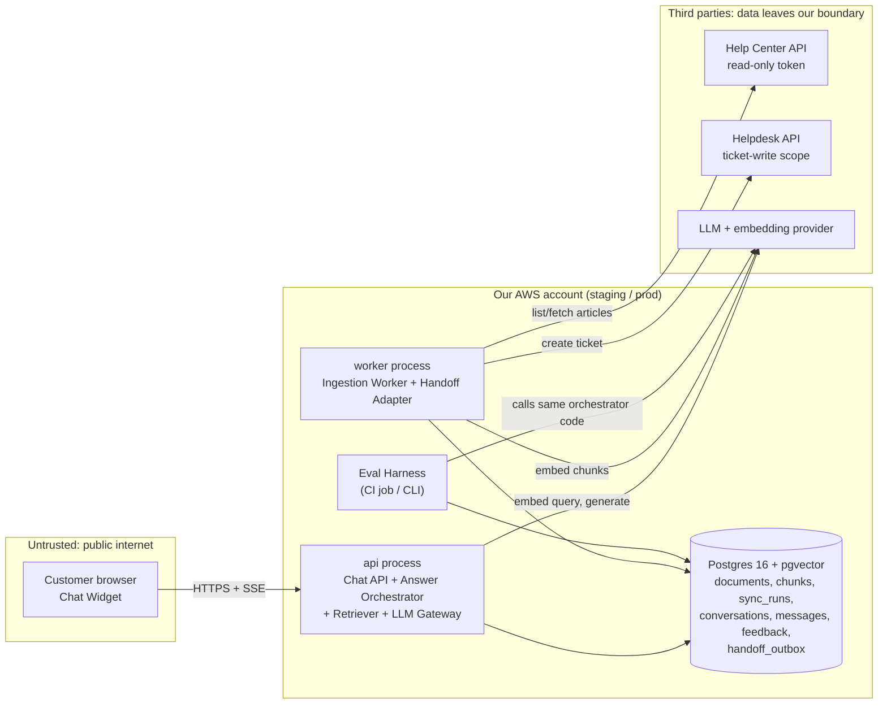

# Architecture and Build Plan: Help-Center RAG Support Chatbot

> **How this plan was produced.** The workspace has nothing in it except a README saying it is "intentionally empty", so there is no code, stack or platform to build on. You didn't give details, so I went ahead on stated defaults instead of stopping to ask. Every default is marked **[A]** and collected in §5. The plan is built so the most likely answers don't change its overall design. The few answers that would change it are listed at the end.

---

## 1. Summary

- **What:** A chatbot embedded in the public help center. It answers customer questions using only the published help-center articles, cites the articles it used, and hands off to a human (a ticket that includes the transcript) when it can't answer or the topic is sensitive. It is for anonymous help-center visitors. Its main purpose is to deflect tickets, meaning resolve questions that would otherwise become support tickets.
- **Shape:** One Python service with two process types: `api`, which handles chat, and `worker`, which handles document sync and handoff retries. They share one Postgres database with pgvector, which stores both the search index and the conversation logs. Answers come from one hosted LLM call per turn, behind our own interface. **No agents and no tools.** The bot reads documents and writes text. It never acts on accounts.
- **Key decisions:**
  1. **Build the evaluation set before the features.** It is ~200 graded real questions and becomes the release gate for every change to prompts, models or retrieval.
  2. **Postgres + pgvector with hybrid (vector + keyword) search**, not a separate vector database. A help center is tens of thousands of chunks at most.
  3. **Answer only from retrieved articles, with checked citations and an explicit "can't answer" path.** Some topics (refunds, billing disputes, account deletion, legal, security) always go to a human.
  4. **No RAG framework.** We use provider SDKs behind a thin `llm` interface, so models can be swapped and every step is easy to trace.
  5. **Compare build against buy in Milestone 1.** If your helpdesk already sells a native AI agent, we run it against the same evaluation set before committing to Milestones 2–4.
- **Milestone 1 (≈3–4 weeks):** Real articles ingested, a `/v1/chat` endpoint streaming cited answers in staging (deployed through CI), a baseline evaluation report, and written answers to four spikes, including the build-vs-buy decision.
- **Top risks:** (1) Answers that are wrong but sound confident, especially about policy or billing. (2) We can't get real customer questions to build the evaluation set, because ticket exports need privacy approval. This is the critical-path item. (3) Retrieval quality is limited by the docs themselves: gaps, duplicates, and information that lives only in screenshots. (4) Abuse through prompt injection or someone using the bot as a free LLM.

## 2. Context and Goals

- **Problem:** Customers who can't find an answer in the help center open tickets. Many of those tickets are answered by an article that already exists **[A]**. Agents spend time on repeat questions and customers wait hours for answers that are already published.
- **Goals:**
  - Answer answerable questions correctly, with citations, in seconds.
  - Recognise when it can't answer and hand off cleanly, including the transcript.
  - Reflect changes to help-center articles within an hour.
  - Show which questions the docs don't cover, so the content team can fill the gaps.
- **Non-goals (v1):** Account-specific questions ("where is my order", "why was I charged"). Actions such as refunds, cancellations or plan changes. Logged-in in-app chat. Languages other than English **[A]**. Voice. Content from community forums or internal or agent-only articles. Replacing the live-chat or agent tooling you already have.
- **Success measures (after launch):**
  - **Deflection:** tickets per 1,000 help-center sessions, bot group compared with a **10% holdout** that sees no bot. Target ≥20% reduction **[A]**.
  - **Self-reported resolution:** share of conversations with a thumbs-up and no handoff. Target ≥40% **[A]**.
  - **Answer quality on the evaluation set:** see §3.
  - **CSAT:** tickets that came through bot handoff score no lower than other tickets.
  - **Cost per conversation:** ≤ $0.10 **[A]**.

## 3. Drivers, Requirements, and Constraints

**Ranked quality attributes**

| # | Attribute | Measurable target | Why it matters |
|---|---|---|---|
| 1 | **Answer correctness and groundedness** | On the evaluation set: ≥90% of answerable questions judged correct; ≤2% of answers contain a claim the cited sources don't support; **0** policy violations (for example promising refunds) on the adversarial set **[A]** | A confident wrong answer costs more than no answer. Companies have been held to what their chatbot said (e.g., *Moffatt v. Air Canada*, 2024). |
| 2 | **Safe escalation** | Handoff is reachable in ≤1 click from every bot message. ≥90% recall on "should not answer" cases. A failed handoff always shows a fallback contact route | A bot that traps users is worse than no bot. |
| 3 | **Freshness** | Edited articles show up in answers within 30 min. Unpublished or deleted articles are removed within 30 min **[A]** | Old policy text is a correctness problem. |
| 4 | **Latency** | Time to first token p95 < 2.5 s. Full answer p95 < 8 s, at the expected peak (~5 messages/s) **[A]** | Chat users give up quickly. Streaming hides most of the generation time. |
| 5 | **Cost** | ≤ $0.10 per conversation. A hard daily spend cap | Self-service has to stay far cheaper than a human ticket ($5–15 **[A]**). |
| 6 | **Time to market** | Beta for 10% of traffic in ~8 weeks **[A]** | Value shows up only once real users see it. |

Correctness ranks above latency: if a bigger model or reranker is needed to hit the quality target, we pay the extra latency and cost. Escalation ranks above deflection: when in doubt, the bot hands off.

**Key functional requirements:** Multi-turn conversations (follow-up questions). Streamed answers with clickable article citations. Explicit "I can't answer that" responses. Handoff to the helpdesk with the transcript. Thumbs-up/down feedback. A report of questions the bot couldn't answer, for the content team.

**Constraints [A]:**
- Team of 2 engineers who know Python, plus about 20% of a support-content specialist's time for evaluation labelling and red-teaming.
- AWS, Postgres, GitHub Actions and Terraform are acceptable.
- The help center and helpdesk are hosted SaaS. The default assumption is Zendesk Guide + Zendesk Support. Intercom or Freshdesk change only the two adapters.
- The help-center articles are public. User messages may contain personal data (PII).

**Hard parts**
1. **Measuring quality.** There's no evaluation set, and building one from real tickets needs data access and an expert's time.
2. **Retrieval over real help-center content.** Near-duplicate articles, differences by plan tier or version, steps shown only in screenshots, and tables.
3. **Knowing when not to answer.** This covers both questions the docs don't cover and topics that must always go to a human.
4. **Adversarial users.** Prompt injection aimed at off-policy promises, and cost abuse from an anonymous public endpoint.
5. **Sync correctness.** Restricted or internal articles must never be ingested, and a partial sync must never mass-delete the index.

## 4. Current State

- **Repository:** Empty. `README.md` says there is "no existing code, documentation, configuration, or data". This is a greenfield build in a new repository, `support-assistant/`.
- **Assumed organisational context [A]:** A hosted help center with a REST API (Zendesk Help Center API: articles, sections and user segments). A hosted helpdesk with a ticket-creation API. An AWS account with a staging environment. GitHub Actions. A secrets manager (AWS Secrets Manager). An existing metrics and logging stack that accepts OpenTelemetry (OTel).
- **Conventions this plan sets:**
  - Python 3.12 with `uv`, `ruff` and `pytest`.
  - FastAPI for the web service.
  - Alembic for database migrations.
  - Terraform in `infra/`.
  - Prompts as versioned files in `prompts/`.
  - Evaluation cases as JSONL files in `eval/cases/`.

## 5. Assumptions and Open Questions

**Assumptions**

| Assumption | Impact if wrong | How / when validated |
|---|---|---|
| Help center = Zendesk Guide; helpdesk = Zendesk Support | Ingestion and handoff adapters change (~3–5 days each). The build-vs-buy comparison changes | Confirm before M1 starts |
| Bot answers from public docs only. No account data or actions | If account data or actions are needed: authentication, tool permissions, threat model and evaluation scope all grow. That's a separate plan | Confirm before M1 starts |
| Corpus is 300–3,000 public English articles (≤50k chunks) | Above ~5M chunks, revisit pgvector. Multiple languages add per-language indexes and evaluation sets | Spike S3 (article count) |
| ~20k conversations/month, ~3 turns each, peak ~5 messages/s | Cost and capacity numbers scale with it. The architecture stays the same up to ~100× | Help-center analytics, M1 week 1 |
| Ticket and chat transcripts from the last 6 months can be exported with redaction for building the evaluation set | Without real questions, the evaluation set is written by subject-matter experts (SMEs) and drawn from search logs, so it's less representative | Privacy request, day 1 |
| A hosted LLM provider with no training on our data and zero or short retention is acceptable for user messages | We'd need a provider hosted inside our cloud (e.g., Claude via AWS Bedrock). Mostly a configuration change behind the `llm` interface | Legal/security review in M1 |
| Team: 2 Python engineers, AWS, Postgres familiarity | Estimates and stack choice change. A TypeScript team should use the same design in TypeScript | Confirm before M1 starts |
| Conversation logs kept 90 days, then deleted. Aggregate metrics kept indefinitely | Retention job and privacy notice change | Privacy review in M1 |

**Open questions**

| Question | Who answers | Default if no answer | Needed by |
|---|---|---|---|
| Which help-center and helpdesk platforms? | Support ops | Zendesk Guide + Support | M1 day 1 |
| Must v1 handle account-specific questions or actions? | Product owner | No (non-goal) | M1 day 1 |
| Can we use redacted ticket transcripts for the evaluation set? | Privacy/legal | Yes, with redaction. Otherwise SME-written + search logs | M1 week 1 |
| Approved LLM vendors and data terms? | Security/procurement | Anthropic API with zero data retention. Bedrock as fallback | M1 week 2 |
| Topics that must always go to a human | Support lead | Refunds and billing disputes, account deletion or recovery, legal and privacy requests, security incidents, complaints about staff | M2 start |

## 6. Architecture Overview



**How it fits together.** The widget runs inside the help-center theme and talks only to the `api` process. Each turn works like this:

1. The orchestrator condenses the conversation into a standalone query and flags must-escalate topics. This is a small, cheap model call.
2. The Retriever runs hybrid search in Postgres.
3. The orchestrator makes one generation call with the top sources, then streams the answer and validated citations back to the widget.

Each turn is logged with exactly what was retrieved, which prompt and model versions were used, tokens, cost and latency, so any answer can be traced afterwards.

The `worker` keeps the index in sync with the help center. It also drains the handoff outbox: a table of tickets queued for creation, so a helpdesk outage doesn't lose them. The Eval Harness imports the same orchestrator code, so evaluation results describe what production actually runs.

**Component table**

| Component | Responsibility | Owns (single writer) | Interfaces | Technology | Key dependencies |
|---|---|---|---|---|---|
| Chat Widget | Chat UI, streaming render, citations, feedback, handoff button | none | Calls `/v1/*` | TypeScript + Preact, served as a static bundle | Chat API |
| Chat API | Sessions, rate limits, persistence, SSE streaming, feedback, handoff request | `conversations`, `messages`, `feedback` | `POST /v1/sessions`, `POST /v1/chat` (SSE), `POST /v1/feedback`, `POST /v1/handoff`, `GET /healthz` | FastAPI | Orchestrator, Postgres |
| Answer Orchestrator | Condense → retrieve → prompt → generate → validate citations → status | none (returns a trace object to Chat API) | Python `answer(conversation) -> AsyncIterator[Event]` | Python module `app/answer/` | Retriever, LLM Gateway, `prompts/` |
| Retriever | Hybrid search, dedupe, filtering | none (reads `chunks`) | `search(query, k, filters) -> list[Hit]` | SQL on pgvector + `tsvector` | Postgres, LLM Gateway (embeddings) |
| LLM Gateway | Single path for all model calls: timeouts, retries, cost accounting, fake for tests | none | `generate()`, `stream()`, `embed()` | Provider SDK (Anthropic by default) | LLM provider |
| Ingestion Worker | Sync articles, normalise, chunk, embed, upsert, delete | `documents`, `chunks`, `sync_runs` | CLI `python -m app.ingest sync [--full]`; scheduled every 15 min | Python | Help Center API, LLM Gateway |
| Handoff Adapter | Create helpdesk ticket with transcript; retry from outbox | `handoff_outbox` | `enqueue_handoff()` (in-process, called by Chat API); drain loop in worker | Python | Helpdesk API |
| Eval Harness | Run versioned evaluation cases, score them, produce a report, enforce the gate | `eval/cases/*.jsonl` (in git), `eval/reports/` | CLI `python -m eval.run --suite full` | Python + LLM-as-judge | Orchestrator, LLM Gateway |

## 7. Component Details

**Answer Orchestrator (the core; most design effort goes here)**

1. **Condense.** A small, fast model produces structured JSON: `{standalone_query, escalate_topic | null}`. It runs on every turn because it also detects must-escalate topics. Budget is ~400 ms.
2. **Retrieve.** Call `Retriever.search(standalone_query, k=6)`.
3. **Abstention pre-check.** If the best fused score is below a threshold tuned on the evaluation set, skip generation. Return `cannot_answer` with the top 3 article links and offer handoff.
4. **Generate.** A mid-tier model receives `prompts/answer.vN.md` plus the numbered sources wrapped in `<source id="n" url="…">` tags. The prompt instructs it to:
   - start its output with a status line: `STATUS: answered | partial | cannot_answer`
   - cite sources inline as `[n]`
   - use only the sources
   - never promise refunds, credits, exceptions or timelines
   - treat source and user text as data, not instructions
5. **Stream with validation.** The server holds back output until the status line has been parsed, then streams. It removes any `[n]` that doesn't refer to a provided source. If the status is `answered` but no valid citation appears, the turn is downgraded to `partial` and the handoff option is shown more prominently. A light output check scans for commitment phrases ("we will refund", "guarantee", "free of charge"). If it finds one, it replaces the answer with a handoff message and flags the turn for review.
6. **Return a trace.** The trace holds prompt version, models, retrieved chunk IDs with scores, cited document IDs, status, tokens, cost and per-stage latency. Chat API persists it.

- **Does not:** call tools, read account data, or write to the database directly.
- **Failure behaviour:**
  - LLM time to first token > 5 s or 5xx/429 before the first token: retry once, then **degraded mode**, which returns the top 3 retrieved article links ("These articles may help") plus handoff.
  - Stream breaks partway: the partial text stays, a "Something went wrong — talk to a person" message is added, and the turn is logged as an error.
  - Condense call fails: fall back to the raw last user message and continue.

**Retriever.** Vector top-20 (cosine similarity on HNSW) and Postgres full-text top-20 (`websearch_to_tsquery`), merged with reciprocal rank fusion (RRF), deduplicated to at most 2 chunks per article, top 6 returned. Keyword search matters because users type exact UI labels and error codes, which pure vector search often misses. Filters: `locale='en'`, `status='published'`. Spike S1 decides whether to add a reranker and whether to pass whole articles instead of chunks. Latency budget is < 150 ms including the query embedding.

**Ingestion Worker**
- Lists articles with pagination and backoff on 429.
- **Keeps only articles that are published, in English, and visible to anonymous users.** In Zendesk this means no restricted user segment. This one filter is what stops internal or agent-only content from leaking.
- Normalises HTML to markdown-like text, keeping the heading hierarchy, tables as markdown, and image alt text.
- Splits into chunks at H2/H3 headings with a ~600-token cap, prefixing each chunk with `title > heading path`. Stores `content_hash` and skips re-embedding when nothing changed.
- **Deletion safety:** an article is soft-deleted only after a *complete* listing succeeds and the article is missing from it. If a run would delete more than 10% of articles, it stops and alerts instead.
- A Postgres advisory lock prevents overlapping runs. Upserts are idempotent, keyed by `(source_id)` and `(document_id, ordinal)`.
- Each `chunks` row records `embedding_model`, so switching models is a blue/green re-index (see §8).

**Chat API.** Anonymous sessions are signed tokens (HMAC, 24 h) issued by `POST /v1/sessions`. Limits:

| Limit | Value |
|---|---|
| Messages per session per minute | 10 |
| Messages per IP per hour | 60 |
| Characters per message | 1,000 |
| Turns per conversation | 20 |

SSE event types: `status`, `token`, `citations`, `done`, `error`. The API is versioned under `/v1`, and the widget pins to `/v1`. The expected load is ≤5 messages/s at peak. Two stateless replicas give redundancy, not scale.

**Handoff Adapter.**
- `POST /v1/handoff` asks for the customer's email and an optional note, writes a `handoff_outbox` row, and returns success to the user straight away.
- The worker drains the outbox every 30 s. It creates the ticket with the transcript and cited articles in the description, adds the tag `via_support_bot`, and sends an idempotency key (`outbox.id`) in an external-ID field to avoid duplicate tickets. Retries back off over 24 h.
- After 5 failures it moves the row to `dead` and alerts.
- The widget always also shows the existing contact-form link, so users have a way out even if the outbox is backed up.

**LLM Gateway.** Wraps every model call. Each call has a timeout (5 s to first token, 30 s total) and at most one retry, made only before streaming starts. Tokens are converted to cost using a price table in config. A `FakeLLM` is used for unit tests. Model IDs live in config, not in code.

**Chat Widget / Eval Harness.** Both are covered in §12–§14. The widget renders markdown through a sanitiser (DOMPurify). Links are allowed only to the help-center domain.

## 8. Data Design

| Entity | Key fields | Writer | Notes |
|---|---|---|---|
| `documents` | `id`, `source_id` (unique), `url`, `title`, `section`, `locale`, `labels[]`, `source_updated_at`, `content_hash`, `status` (published/deleted), `body_text` | Ingestion Worker | Soft delete. A copy of public content that can be rebuilt from the help center |
| `chunks` | `id`, `document_id` FK, `ordinal`, `heading_path`, `text`, `token_count`, `embedding vector(1024)`, `embedding_model`, `tsv tsvector` (generated) | Ingestion Worker | HNSW index on `embedding`, GIN index on `tsv`, index on `(document_id)` |
| `sync_runs` | `id`, `started_at`, `finished_at`, `mode`, `status`, `counts jsonb`, `error` | Ingestion Worker | Freshness alert reads this |
| `conversations` | `id`, `session_id`, `started_at`, `channel`, `outcome` (resolved/handoff/abandoned), `variant` (bot/holdout) | Chat API | |
| `messages` | `id`, `conversation_id`, `role`, `text` (masked), `status`, `prompt_version`, `models`, `retrieved jsonb` (chunk ids + scores), `cited_doc_ids[]`, `tokens_in/out`, `cost_usd`, `latency_ms jsonb`, `flags[]` | Chat API | The complete trace of an answer |
| `feedback` | `message_id`, `rating`, `comment`, `created_at` | Chat API | |
| `handoff_outbox` | `id` (idempotency key), `conversation_id`, `requester_email`, `payload`, `state` (pending/sent/dead), `attempts`, `ticket_id`, `last_error` | Handoff Adapter | Only the handoff path stores the email |

- **Consistency:** Each turn's message is written in one transaction after streaming finishes. The user message is written before generation starts, so failed turns are still logged. No transaction crosses components. Handoff uses the outbox pattern: the row is committed first and the ticket is created afterwards, idempotently.
- **Access patterns:** The chat path does a hybrid search over ≤50k rows. HNSW gives < 20 ms. Analytics are daily aggregate queries on `messages`. When traffic grows, put them on a read replica or a nightly export.
- **Retention:** `conversations`, `messages`, `feedback` and `handoff_outbox` are deleted after 90 days by a nightly job **[A]**. Deletion requests are handled by matching `session_id` or the email in the outbox. Document tables can be rebuilt, so restoring them isn't a priority.
- **Backup:** Managed snapshots every day plus point-in-time recovery for 7 days. The restore targets are 4 hours to recover and at most 5 minutes of data loss. Conversation logs are useful but not critical. A restore is tested once in M3.
- **Classification:**
  - Article content is public.
  - User message text is *potential PII*. Before both storage and the LLM call, card-like numbers (Luhn check), emails and phone numbers are masked with regular expressions. In the message stored for analytics the email is masked too; the handoff outbox keeps it.
  - DB access: the app role plus a read-only analyst role. Database encryption at rest is on.
- **Schema evolution:** Alembic migrations, additive first (expand, backfill, switch reads, contract later). **Changing the embedding model:** insert new rows with the new `embedding_model` value, backfill with a full sync, switch `Retriever` to the new model through a config flag after the evaluation passes, then delete the old rows. Rolling back means flipping the flag back.

## 9. Key Flows

**Flow A: Question answered with citations (happy path)**
1. Widget loads and calls `POST /v1/sessions`, which returns a signed token and the assigned variant (bot or holdout).
2. User sends "How do I export invoices as CSV?" to `POST /v1/chat`. The API checks limits, masks PII, and writes the user message.
3. Orchestrator condense call returns `{standalone_query, escalate_topic: null}`.
4. Retriever embeds the query and runs hybrid search, getting 6 hits. The top score is above the threshold.
5. Generate call streams `STATUS: answered`, then the answer text with `[1]` and `[2]`.
6. API streams tokens to the widget and validates the citations. A `citations` event carries the article titles and URLs. Then a `done` event.
7. API writes the assistant message with its full trace. The widget shows thumbs up/down and "Talk to a person".

**Flow B: Follow-up question.** The user asks "And on mobile?". The condense step uses the history to produce "export invoices CSV mobile app", and the rest is Flow A. Multi-turn cases make up their own evaluation suite.

**Flow C: Can't answer, or topic must escalate, then handoff succeeds**
1. "I was charged twice, I want a refund" → condense returns `escalate_topic: billing_dispute`.
2. Generation is skipped. The bot replies with a fixed, approved template ("I can't resolve billing disputes, but I can pass this to our team") plus relevant article links.
3. The user clicks handoff and enters an email. `POST /v1/handoff` writes the outbox row and the user sees "Ticket on its way, we'll email you".
4. Within ~30 s the worker creates the ticket with the transcript and sets `state=sent`, storing `ticket_id`.

**Flow D (failure): the helpdesk API is down during handoff**
1. The outbox row is written. Ticket creation returns 503.
2. The worker retries with backoff (30 s, 2 m, 10 m, 1 h, 6 h). Because the request carries the idempotency key, a retry after an ambiguous timeout doesn't create a duplicate ticket.
3. The user already saw the confirmation and the contact-form link. If the row reaches `dead`, an alert fires and the runbook says to create the ticket manually from the `payload`.

**Flow E (failure): the LLM provider times out**
1. No first token within 5 s. Retry once and fail again.
2. The orchestrator emits degraded mode ("I'm having trouble right now, these articles may help") with the top 3 retrieved links and the handoff button. Retrieval doesn't depend on the generation model.
3. The turn is logged with `flags=['llm_degraded']`. If the degraded rate stays above 5% for 10 minutes, an alert fires.
4. If the embedding API is also down, the Retriever falls back to keyword-only search.

**Flow F (failure): a partial sync**
- The help center rate-limits the listing at page 7 of 12. The run is marked `failed`. Already-upserted changes are kept because upserts are idempotent. **No deletions are applied**, because deletions need a complete listing. The next run 15 minutes later picks up where it can.
- If no run succeeds for 2 hours, the freshness alert fires.

## 10. Key Decisions

| Decision | Options considered | Rationale (vs. drivers) | Reversibility | Revisit if |
|---|---|---|---|---|
| **D1. Build, with a bake-off against buying in M1** | (a) Build as planned; (b) the helpdesk's native AI agent (e.g., Zendesk AI agents, Intercom Fin); (c) a general RAG SaaS | Buying is fastest (driver 6) and often good enough. Building gives control over quality and evaluation (driver 1), escalation rules (driver 2), and cost at volume. Vendors often charge per resolution (check current pricing), which at our assumed volume may come to several times the ~$1.5–2.5k/month we expect to spend running it ourselves. The evaluation set is needed either way, so the decision is made with evidence in M1 week 3 | Easy before M2, hard after | The vendor scores within 5 points of our baseline on the evaluation set at acceptable cost → buy, and keep the evaluation set as the acceptance test |
| **D2. Postgres + pgvector, hybrid search** | (a) pgvector + full-text; (b) a managed vector DB (Pinecone etc.) + separate keyword search; (c) OpenSearch | One store for the index and the logs, keyword and vector search in one SQL query, and a technology the team already knows. ≤50k chunks is tiny | Medium (the Retriever interface keeps it contained) | > 5M chunks, or p95 retrieval > 200 ms |
| **D3. Fixed pipeline, one generation call, no tools or agents** | (a) Fixed pipeline; (b) an agent with a search tool and multi-hop reasoning | Simplest design that can pass the evaluation. Latency and cost are predictable. No tool permissions to secure | Easy | Evaluation shows ≥10% of failures need multi-hop retrieval |
| **D4. No RAG framework; thin `llm` interface over the provider SDK** | (a) Direct SDK; (b) LangChain/LlamaIndex | The pipeline is about 5 steps. Direct code is easier to trace and debug (driver 1), and one less new abstraction for a 2-person team | Easy | We add many data sources or connectors that a framework already provides |
| **D5. Model: mid-tier for answers, small for condense/classify, one vendor; final pick from spike S2** | (a) Mid-tier + small (Claude Sonnet- and Haiku-class); (b) largest model for everything; (c) small model for everything | Mid-tier meets latency and cost budgets, and the small model keeps the per-turn classification cheap. The final choice is the cheapest combination that passes the evaluation gate | Easy (config + re-run the evaluation) | The evaluation gate isn't met even with prompt and retrieval fixes; or the organisation mandates another vendor; or data terms require Bedrock |
| **D6. Embedding model fixed per index, versioned** | (a) One hosted embedding model recorded per chunk; (b) self-hosted open model | Hosted is cheap at this corpus size and needs no operations. Re-embedding 50k chunks costs a few dollars and takes minutes | Easy (blue/green re-index) | The organisation forbids sending article text out (unlikely, since it's public) |
| **D7. Stream after parsing the status line, with inline citation validation** | (a) Stream with a leading status line; (b) no streaming, validate the whole answer first | (a) keeps time to first token under 2.5 s (driver 4) and still blocks the main failure: answering when it should abstain. Full groundedness checks run offline (evaluation plus production sampling) | Easy | Production sampling shows an unsupported-claim rate > 2% → add a synchronous grounding check and accept the latency |
| **D8. Handoff through the helpdesk API with an outbox, with the contact-form link always shown as fallback** | (a) API ticket with transcript; (b) send the user to the existing contact form, prefilled | (a) gives agents the transcript and lets us measure handoffs (driver 2). The outbox survives helpdesk outages | Easy | Ticket spam through the bot → add a CAPTCHA (Turnstile) or switch to (b) |
| **D9. One deployable image, `api` + `worker` processes** | (a) One image, two processes; (b) separate services per component | No driver needs independent scaling or separate teams | Easy | A second team owns ingestion, or ingestion needs a different security zone |

## 11. Cross-Cutting Concerns

**Security (built in M1, hardened in M2)**

| Threat | Mitigation | Milestone |
|---|---|---|
| Prompt injection or jailbreak to get off-policy promises or off-brand text | The bot has no tools or permissions. Sources and user text are delimited and marked as data. Escalation topics use a fixed template. Output scan for commitment phrases. An adversarial evaluation suite that must have 0 violations. A footer note that answers come from help articles and humans handle exceptions | M2 |
| Cost abuse or "free LLM" use, and DoS | Session and IP rate limits. 1,000-character and 20-turn caps. Condense-step flag for off-topic questions with a polite refusal. **Daily spend cap**: alert at 80%, at 100% switch automatically to degraded (links-only) mode. WAF rate rule at the edge | M2 |
| Internal or restricted content leaking | Ingest only articles visible to anonymous users. Test: a fixture restricted article must never appear in `documents`. Weekly check comparing ingested IDs to the public sitemap | M1 |
| PII in logs or sent to the vendor | Regex masking before storage and before the LLM call. Vendor zero-retention/no-training terms. 90-day retention. Analyst role sees only masked text | M1 masking, M2 retention job |
| XSS through model output | Sanitised markdown rendering. Links allowed only to the help-center domain. Strict CSP on the widget | M2 |

Secrets (help-center token, helpdesk OAuth client, LLM key, session HMAC key) live in AWS Secrets Manager and are injected at runtime. Keys rotate every quarter. The help-center token is read-only, and the helpdesk credential has the narrowest scope that can create tickets. Dependabot and container image scanning run in CI.

**Reliability.** Target 99.5% monthly for `/v1/chat` returning *some* useful response; degraded mode counts as available **[A]**. Two `api` replicas across availability zones. Managed Postgres with Multi-AZ in production. Timeouts on every external call (§7). Retries only before streaming starts or on idempotent operations. Health check `/healthz/ready` runs a DB query and checks that the last successful sync was less than 2 hours ago (this reports degraded but doesn't fail the check, so a stale index doesn't take the API down).

**Observability**
- OTel traces with one trace ID per turn, covering the condense, embed, search, generate and persist spans. The trace ID is shown in the widget's "report a problem" link.
- Metrics: time to first token and total latency p50/p95, status mix (answered/partial/cannot_answer/degraded), handoff rate, thumbs-down rate, cost per turn and per day, sync age, outbox backlog.
- Dashboard in M3. The trace table (`messages`) exists from M1.

| Alert | Fires when |
|---|---|
| Error rate | > 5% for 10 min |
| Time to first token | p95 > 5 s for 10 min |
| Degraded mode | > 5% |
| Sync stale | no successful sync for 2 h |
| Outbox | row reaches `dead`, or backlog > 50 |
| Spend | daily spend > 80% of cap |
| Thumbs-down | rate doubles against the 7-day baseline |

**Performance and capacity.** About 5 messages/s at peak. The bottleneck is the LLM provider's rate limits, not our compute. Ask for higher provider quotas in M1. Load test in M3 with k6 at 3× peak (15 messages/s): first against `FakeLLM` to test our own stack, then a short run against the real provider to confirm quotas.

**Cost** (rough, list-price based, replaced by measured cost per turn in M1)

| Item | Estimate |
|---|---|
| Per turn: ~5k input + 400 output tokens on a mid-tier model, plus a small condense call | ≈ $0.02 per turn |
| At 60k turns/month | ≈ $1.2–1.5k/month |
| Prompt caching of the system prompt | Can reduce this |
| Embeddings | Negligible |
| Postgres + 3 small containers | ≈ $200–400/month |

Controls: daily spend cap, per-conversation turn cap, cost recorded on every message, cost-tagged AWS resources.

**Operations.** The building team owns the system. During beta, on-call is business hours only, because degraded mode and the contact-form fallback make overnight failures low-stakes **[A]**. Runbooks written in M3:
- LLM provider outage
- "The bot said something wrong" (trace ID → `messages.retrieved` → fix the doc or the prompt → add an evaluation case)
- Sync stuck or mass-delete guard tripped
- Dead outbox rows
- Kill switch

The support-content team gets a weekly report of "cannot answer" and thumbs-down questions grouped by topic. That report is how documentation gaps get closed.

**AI-specific**
- Evaluation is the release gate (§14).
- Prompts are versioned in `prompts/`. A change requires an evaluation report in the PR.
- Budgets: time to first token p95 2.5 s, cost ≤ $0.03 per turn, ≤ 2 model calls per turn, 20 turns per conversation.
- No irreversible actions exist. The one human approval point is the handoff itself.
- Fallback: degraded links-only mode.
- Each week, 2% of production turns plus all thumbs-down turns are sampled, graded by an LLM judge, and spot-checked by the SME. Failures become new evaluation cases.

## 12. Build Sequence

Team assumption: 2 engineers full time, plus a support SME at ~20% (about 1 day/week, more in M1 weeks 1–2) and a part-time PM. Estimates are rough ranges, not commitments.

| Milestone | Goal / risk cleared | Scope (in / out) | Deliverables | Exit criteria | Depends on | Size |
|---|---|---|---|---|---|---|
| **M1: Measured thin slice** | Proves retrieval and answers work on *our* docs and measures how well. Clears hard parts 1, 2 and 5. Makes the build-vs-buy call | In: CI/CD to staging, ingestion (full sync), hybrid retrieval, `/v1/chat` streaming, trace logging, PII masking, evaluation set v1 + harness, spikes S1–S4. Out: production widget, handoff, rate limits, multi-turn tuning | Running staging service; `eval/reports/baseline.md`; spike write-ups; decision record for D1/D5 | Merge to main deploys to staging automatically. All public articles ingested, with the count matching the help center. Restricted fixture excluded. Evaluation runs in CI. Baseline report committed. Build/buy decided | Day-1 access requests | 3–4 weeks |
| **M2: Safe and good enough for internal dogfood** | Reaches the quality target and closes the safety gaps (hard parts 3, 4) | In: abstention tuning, escalation topics, handoff + outbox, multi-turn condense, adversarial suite, rate limits + spend cap, degraded mode, widget v1, incremental sync every 15 min, retention job. Out: public traffic | Widget on staging help center; support agents dogfooding | Evaluation gate met (§3 targets). 0 adversarial violations. Handoff creates a real sandbox ticket. Kill switch tested. 1 week of agent dogfooding with issues triaged | M1 (S1/S2 results) | 2–3 weeks |
| **M3: Public beta at 10%** | Real user behaviour, first deflection data | In: feature flag + variant assignment, dashboards, alerts, runbooks, load test, restore test, production sampling to evaluation, weekly content-gap report. Out: >10% traffic | Production deployment; beta live | 2 weeks at 10% with time to first token p95 < 2.5 s, thumbs-down < 15%, no P1 incidents, measured cost per conversation ≤ $0.10 | M2 | 2–3 weeks |
| **M4: Ramp to 90% + holdout** | Shows deflection against the holdout | In: ramp 10→50→90%, 10% holdout, iterating on content gaps | Deflection report | Ticket reduction measured with confidence interval; go/no-go on full rollout | M3 | 2–4 weeks (mostly elapsed time) |

**Critical path:** ticket-export privacy approval → evaluation set v1 → spikes S1/S2 → M2 quality tuning → beta. Start the privacy and data request on day 1. If it slips, switch to building the evaluation set from search logs plus SME-written questions in week 1, not week 3. Infrastructure, ingestion and the widget run in parallel with this path.

## 13. First Milestone Task Breakdown

Repository layout to create:

```
support-assistant/
  app/{api,answer,retrieval,ingest,llm,handoff,store}/
  prompts/            # answer.v1.md, condense.v1.md
  db/migrations/      # alembic
  eval/{cases,judges,reports}/  run.py
  widget/dev/         # internal test page (M1); widget/src (M2)
  infra/              # terraform: staging
  .github/workflows/ci.yml
```

**Week 1: start in parallel**

| # | Task | Location | Done when |
|---|---|---|---|
| T1 | **Request long-lead access (day 1):** read-only help-center API token; redacted export of 6 months of tickets and chat transcripts + help-center search logs; LLM vendor account with zero-retention/DPA; higher provider rate limits; staging AWS account | PM / tech lead | Each request has an owner and ticket. Received credentials are stored in Secrets Manager under `support-assistant/staging/*` |
| T2 | **Scaffold the repo:** FastAPI app with `/healthz`, `uv` project, `ruff`, `pytest`, Dockerfile, CI workflow (lint → test → build image → deploy to staging on main) | `app/`, `.github/workflows/ci.yml` | A PR runs lint and tests. Merging to main deploys, and `curl https://<staging>/healthz` returns 200 |
| T3 | **Provision staging infrastructure:** Postgres 16 (RDS) with `pgvector`, ECS service for `api`, ECS service (1 task) for `worker`, Secrets Manager entries, log group | `infra/staging/` | `terraform apply` from CI succeeds. The app connects and `SELECT extversion FROM pg_extension WHERE extname='vector'` returns a version |
| T4 | **Write the initial migration** creating the 7 tables in §8, with HNSW and GIN indexes | `db/migrations/0001_init.py` | `alembic upgrade head` and `downgrade base` both succeed in CI against an empty Postgres service container |
| T5 | **Implement `LLMGateway`** (`generate`, `stream`, `embed`) for the chosen vendor + `FakeLLM`, with timeouts, one retry before the first token, and cost accounting from `config/prices.yaml` | `app/llm/` | Unit tests cover timeout → retry → raise, and cost calculation. One manual smoke call against the real API is logged |
| T6 | **Draft evaluation set v1 with the SME:** 150 answerable questions (expected article IDs + 1–3 key facts each), 30 unanswerable, 20 adversarial (injection, refund promise, off-topic, abuse), 15 multi-turn | `eval/cases/*.jsonl` | The support lead has reviewed every case. A script finds no unmasked emails or phone numbers. Questions come from real tickets or search logs where possible, and each case records its source |

**Weeks 1–2: the thin slice (T7→T8→T9→T10 in order; T11 in parallel)**

| # | Task | Location | Done when |
|---|---|---|---|
| T7 | **Build help-center client + full sync:** paginated listing with 429 backoff; keep only published, `en`, anonymous-visible articles; HTML→text with headings, tables and alt text; upsert `documents`; soft-delete only after a complete listing; >10% delete guard; advisory lock | `app/ingest/helpcenter.py`, `normalize.py`, `sync.py` | Integration test with recorded fixtures (including a restricted article and a deleted article) passes. `python -m app.ingest sync --full` in staging loads exactly the public article count |
| T8 | **Add chunking + embedding:** split at H2/H3, ≤600 tokens, `title > heading path` prefix; skip unchanged `content_hash`; record `embedding_model` | `app/ingest/chunk.py`, `embed.py` | Unit tests on 5 fixture articles. A second sync with no changes makes 0 embedding calls (checked from the gateway call counter) |
| T9 | **Implement hybrid `Retriever.search`:** vector top-20 + `websearch_to_tsquery` top-20, RRF (k=60), ≤2 chunks per article, top 6 | `app/retrieval/search.py` | `python -m app.retrieval "export invoices csv"` prints ranked hits. p95 < 150 ms over the evaluation queries in staging |
| T10 | **Implement orchestrator + `/v1/chat` SSE:** `prompts/answer.v1.md` with status line and `[n]` citations; citation validation; score-threshold abstention; degraded mode; persist user and assistant messages with the full trace; regex PII masking | `app/answer/`, `app/api/chat.py`, `app/store/` | Unit tests with `FakeLLM` cover answered, cannot_answer, invalid citation, timeout→degraded. `curl -N` against staging streams a cited answer and a `messages` row has `retrieved`, `prompt_version`, `cost_usd` and `latency_ms` |
| T11 | **Add internal test page** that calls staging `/v1/chat` and renders the stream and citations (not the production widget) | `widget/dev/index.html` | The team and SME can chat with staging in a browser behind basic auth |

**Weeks 2–3: measure and decide**

| # | Task | Location | Done when |
|---|---|---|---|
| T12 | **Build the evaluation harness:** run suites through the real orchestrator; compute recall@5 and MRR (from expected article IDs), correctness and groundedness (LLM judge with a rubric in `eval/judges/`), abstention precision and recall, adversarial violations, latency p95, cost per turn; write markdown + JSON report | `eval/run.py` | `python -m eval.run --suite full` produces `eval/reports/<date>-<git-sha>.md`. CI runs `--suite retrieval` (no generation, cheap) on every PR, and the full suite on changes to `prompts/`, `app/answer/` or `config/models.yaml`, plus nightly |
| T13 | **Calibrate the judge:** the SME grades 50 answers by hand; compare with the LLM judge | `eval/judges/calibration.md` | Agreement ≥ 85%. If it's lower, adjust the rubric and repeat before trusting the judge numbers |
| T14 | **Commit the baseline report** and open issues for the top 3 failure categories | `eval/reports/baseline.md` | Report merged. Issues filed |

**Spikes (time-boxed; run after T9/T12 exist, except S3 and S4)**

| Spike | Question | Time box | Output | Result that changes the plan |
|---|---|---|---|---|
| S1 Retrieval | What's the simplest setup with recall@5 ≥ 90%? Compare chunks vs. whole-article context, hybrid vs. vector-only, with and without a hosted reranker | 3 days | Comparison table in `eval/reports/s1.md`; chosen setup in config | Recall < 80% with every option → the gap is the docs themselves (missing or screenshot-only content). Start a content workstream with the support team and add a "docs gap" risk to M2 scope |
| S2 Model | What's the cheapest generation and condense model pair that meets the correctness and latency targets? Try 2–3 models | 2 days | `eval/reports/s2.md`; `config/models.yaml` | No model meets the target → fix retrieval and prompt first. If it still doesn't, accept the larger model's cost and latency (correctness ranks above both) |
| S3 Help-center API | Restricted-article flags, incremental export and deletion signals, webhooks, rate limits, total public article count, how much content is only in images | 1–2 days (week 1) | `docs/spikes/s3-helpcenter.md` | No incremental endpoint → full sync every 30 min with hash diffing. >20% of answers only in images → add image captioning to ingestion in M2 |
| S4 Build vs. buy | Does the helpdesk's native AI agent match our baseline on the same evaluation set, and what does it cost at our volume? | 2–3 days (PM + SME, week 3) | `docs/decisions/D1-build-vs-buy.md` | Vendor within 5 points of our score, at acceptable cost → recommend buying and stop after M1. Our evaluation set becomes the acceptance test |

## 14. Testing and Validation Strategy

| Risk | Test type | Where / when |
|---|---|---|
| Wrong, ungrounded or off-policy answers | **Evaluation suites**: answerable, unanswerable, adversarial, multi-turn | Retrieval suite on every PR. Full suite on prompt, model or orchestrator changes and nightly. **Release gate** |
| Logic regressions | Unit tests with `FakeLLM` and fixture articles | Every PR |
| Help-center and helpdesk API behaviour | Integration tests with recorded fixtures. Contract test against the helpdesk **sandbox** | Every PR (fixtures). Nightly (sandbox) |
| Sync safety | Tests for restricted-article exclusion, the partial-listing no-delete rule, and the mass-delete guard | Every PR |
| Latency and capacity | k6 at 3× peak (`FakeLLM`), then a short real-provider run | M3, before beta |
| Security | Dependency and image scanning (CI); ZAP baseline scan of the widget and API; 2-hour red-team session with support staff | CI always; scan and red-team in M2 |
| Recovery | Snapshot restore to a scratch instance | M3 |

**Release blocks if:** correctness < 90%, unsupported-claim rate > 2%, escalation recall < 90%, any adversarial violation, retrieval recall@5 drops > 3 points from the last release, or cost per turn > $0.03. Test data is the masked evaluation set plus fixture articles. Raw tickets never go into the repository.

**Verifying §3 targets:** correctness, groundedness and escalation from the evaluation report. Freshness from a synthetic test: edit a staging article and time how long until the answer changes. Latency from production p95. Cost from `messages.cost_usd`. Deflection from the holdout comparison in M4.

## 15. Rollout, Migration, and Rollback

- **Rollout:**
  - M2: dogfood with support agents on the staging help center.
  - M3: the widget loader fetches `GET /v1/config`, which returns the flag and the user's variant, and shows the widget to 10% of sessions.
  - M4: ramp to 50%, then 90%, keeping a **10% holdout** until deflection is measured.
- **Migration:** None. No existing system is replaced. The existing contact form and live chat stay in place.
- **Rollback:**
  - *Kill switch:* setting the flag to 0% hides the widget within 1 minute (config cache TTL).
  - *Prompt or model:* revert `prompts/`/`config/models.yaml`, then redeploy (~10 min).
  - *Embedding or index change:* flip `RETRIEVAL_EMBEDDING_MODEL` back, since the old rows are kept until the new ones are confirmed.
  - *Schema:* changes are additive, with a tested `downgrade`.
  - Nothing reaches a point where rollback becomes impossible. The only external side effects are tickets that were created, and those stay valid tickets.

## 16. Risks and Mitigations

| Risk | Likelihood | Impact | Mitigation | Early warning sign | Owner |
|---|---|---|---|---|---|
| Confident wrong answer about policy or billing | Medium | High | Escalation topics, citation validation, commitment-phrase scan, evaluation gate, production sampling | Thumbs-down spikes; sampled groundedness < 98% | Tech lead |
| Ticket export not approved, so the evaluation set isn't representative | Medium | High | Day-1 request; fallback to search logs + SME-written questions; refresh with real beta traffic | No approval by end of week 1 | PM |
| Docs don't contain the answers (content gaps, screenshot-only steps) | High | Medium | S1/S3 measure it; weekly content-gap report; content workstream | Recall@5 < 80%; high cannot_answer rate in beta | Support content lead |
| Cost abuse on the anonymous endpoint | Medium | Medium | Rate limits, turn caps, spend cap with automatic degraded mode, WAF | Daily spend > 2× forecast; one IP with very high volume | Tech lead |
| LLM provider outage or quota limits | Medium | Medium | Degraded links-only mode, higher quotas, provider swap behind the gateway (Bedrock as standby) | Degraded rate > 5%; 429s | Tech lead |
| Restricted or internal article leaks into answers | Low | High | Anonymous-visibility filter, fixture test, weekly sitemap comparison | An ingested ID not found on the public sitemap | Tech lead |
| Deflection doesn't materialise: users still file tickets | Medium | High (business case) | Holdout measurement, handoff quality, iterating on content; S4 buy option | Flat ticket rate at 10% beta | PM |
| Support team distrusts or resists the bot | Medium | Medium | SME co-owns evaluation set and red-team; agents dogfood; transcript in handoff tickets | Agents report bad handoffs; low dogfood use | Support lead |
| 2-person team stretched by operations after launch | Medium | Medium | Business-hours on-call, degraded mode, runbooks, few moving parts | Alert noise > 2 per week | Eng manager |

## 17. Deferred Work and Future Evolution

| Deferred | Trigger to build |
|---|---|
| Logged-in, account-aware answers and actions (tools) | Evaluation and beta show a large share of handoffs are account-specific. Needs its own threat model and approval design |
| Languages other than English | >10% of sessions are non-English. Add per-locale indexes and evaluation suites |
| Reranker / synchronous grounding check | S1 shows recall gaps, or production groundedness < 98% |
| Image and screenshot captioning at ingestion | S3 shows >20% of answers are only in images |
| Conversation review UI for support (or adopt Langfuse) | SQL/Metabase review becomes a bottleneck for the SME |
| Other content sources (release notes, status page) | Repeated cannot-answer questions on those topics |
| Read replica for analytics | Analytics queries affect chat latency |

**Extension points:** `LLMGateway` (models and vendors), `Retriever` (search backend), an ingestion source interface (more document sources), the Handoff Adapter (other helpdesks or live-chat handoff).

**Shortcuts taken on purpose:**
- Regex PII masking instead of an NER model. Revisit if the privacy review asks for more.
- Business-hours on-call only. Revisit at full rollout.
- Single-replica worker. This is fine because sync and the outbox are idempotent and the advisory lock prevents overlapping syncs.

## 18. Next Steps

1. **Today:** Answer the five open questions below, or confirm the defaults.
2. **Today:** File the T1 access requests (help-center token, redacted ticket and search-log export, LLM vendor terms and quota, staging AWS). The ticket export is the critical path.
3. **Day 1–2:** Create `support-assistant/` and do T2 (scaffold + CI to `/healthz` in staging) and T3 (`infra/staging/` with Postgres + pgvector).
4. **Day 1–3:** Run spike S3 against the help-center API and record the public article count and how restricted articles are flagged.
5. **Week 1:** Book SME time for T6 (evaluation set v1) and T13 (judge calibration), about 3 days in total over weeks 1–2.
6. **Week 3:** Hold the build-vs-buy review (S4) with the baseline report in hand before committing to M2.

---

## Open questions that would most change this plan

1. **Which help-center and helpdesk platforms do you use?** (Default: Zendesk Guide + Support.) This sets the two adapters, how restricted articles are detected, and above all which native AI agent the build-vs-buy comparison runs against.
2. **Does v1 need to answer account-specific questions or take actions** (order status, cancel, refund)? (Default: no.) If yes, the bot needs authentication, tool permissions, human approval steps and a much bigger threat model. That's a different plan.
3. **Can we use redacted real tickets and chats to build the evaluation set?** (Default: yes.) Without them, our quality numbers are less reliable and the critical path moves.
4. **What is your stack, cloud and team?** (Default: 2 Python engineers on AWS with Postgres.) The design stays the same, but tools and estimates change. A TypeScript team or a non-AWS cloud would just swap the implementation.
5. **Volume and languages:** roughly how many help-center sessions or tickets per month, and is it English-only? (Default: ~20k conversations/month, English.) This sets the cost and capacity numbers and whether multilingual support moves out of the deferred list.
