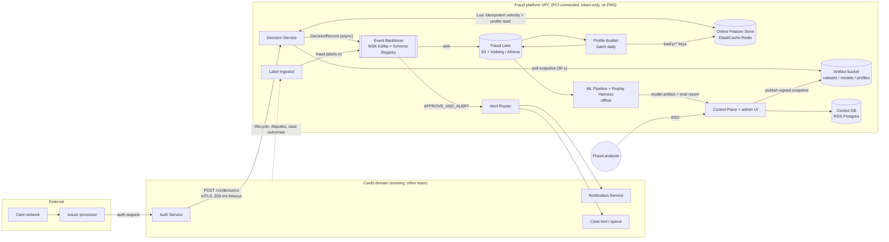

# Real-Time Card Fraud Detection Pipeline: Architecture and Build Plan

> **How I wrote this.** The workspace is empty. `README.md` says there's no code, config or data to look at, and the request is one line. So I picked a default for every major unknown and wrote the plan on those defaults instead of stopping to ask. Each default is marked **[A#]** where it first appears and collected in §5. Five of them would change the shape of the design if they're wrong. They're listed at the end.

---

## 1. Summary

- **What's being built:** a fraud decision system for a **card issuer [A1]**. It scores every card authorisation *before* it is approved and returns APPROVE, DECLINE, or APPROVE_AND_ALERT in **under 50 ms at p99**. Fraud analysts get a safe way to change rules, and the system learns from fraud outcomes that arrive weeks later.
- **Overall shape:** one stateless **Decision Service** sits in the authorisation path, called by the existing **Auth Service [A2]**. It computes card velocity features in Redis as part of each request, scores a gradient-boosted model in-process, runs analyst-written rules, and writes a full **DecisionRecord** to Kafka. Everything else runs off the critical path: rule and model management, daily profiles, labels, training and backtesting.
- **Key decisions:**
  1. **Inline, synchronous decisions with layered fallback.** The service gives up accuracy to answer on time. It never fails closed (declines everything) across the board.
  2. **Scoring and rules run inside one service.** There's no separate model-serving tier and no Flink in v1.
  3. **Feature logic lives in one place.** Real-time card features exist only in the Decision Service. Training data comes from replaying history through that same code, which removes training/serving skew by construction.
  4. **Rules are versioned CEL expressions** (CEL is Google's Common Expression Language, a small, sandboxed expression language). Fraud ops publishes them with four-eyes approval, a backtest, a shadow period and kill switches.
  5. **The fraud system only ever sees card tokens, never the full card number (PAN).** This keeps PCI scope as small as possible.
- **Milestone 1 (5–7 weeks):** the Decision Service runs in staging, answering the Auth Service's sandbox calls in shadow mode. It writes decision records to the data lake and replays a day of history at 3× peak load. It also includes four spikes and a go/no-go on whether our own model beats rules plus vendor scores.
- **Top risks:**
  1. Historical fraud labels are too thin, or data access is slow, so the model doesn't beat the baseline.
  2. A bad rule or model suddenly declines good customers.
  3. The Auth Service team can't take on the integration or the latency budget.
  4. True model lift only shows 60–90 days after launch, because chargebacks arrive late.

---

## 2. Context and Goals

**Problem.** Today, fraud screening at authorisation is assumed to be the processor's generic rules plus network risk scores **[A3]**. That has three problems: losses are higher than they should be, too many good customers get declined, and the fraud team can't adjust rules quickly or target fraud patterns specific to our portfolio. Most fraud is found after the money has moved, through chargebacks and customer complaints.

**Goals**
- Decide on every authorisation in real time using card behaviour (velocity, deviation from the card's normal profile), merchant risk, and a model trained on our own outcomes.
- Let fraud analysts write, backtest, shadow and deploy a rule within **1 hour** without an engineering release.
- Make every decision reproducible: same inputs, ruleset version and model version give the same output and reason codes.

**Non-goals (v1)**
- Acquirer, merchant or PSP-side fraud.
- 3-D Secure risk-based authentication.
- Application fraud, account-takeover and login fraud, AML.
- Automating dispute or chargeback handling.
- Building a case-management tool. We push into the existing one **[A9]**.
- LLMs anywhere in the decision path.
- Multi-region active-active (see D7).

**Success measures** (baseline taken in M1 from the backtest; targets are **[A10]**)

| Measure | Target |
|---|---|
| Fraud loss rate (bps of purchase volume) | −25% vs baseline within 2 quarters of model enforcement |
| False-positive ratio (good declines : fraud declines) | ≤ 5:1, and no worse than baseline |
| Value detection rate at authorisation | +20 percentage points vs baseline |
| On-time responses | 99.99% monthly |
| Rule change lead time (approved → live) | ≤ 1 hour |
| Model refresh | Monthly retrain; challenger to champion in ≤ 2 weeks |

---

## 3. Drivers, Requirements, and Constraints

**Ranked quality attributes.** When two of these conflict, the higher one wins. PCI DSS compliance is a floor, not part of the ranking.

| # | Attribute | Measurable target | Why it matters |
|---|---|---|---|
| 1 | **Bounded latency and availability of the decision path** | Server-side p99 ≤ 50 ms and p99.9 ≤ 120 ms at 1,000 TPS. Internal deadline 150 ms. 99.99% of requests get *some* decision within the caller's 200 ms timeout **[A4]** | A late answer is the same as no answer. Customers see failed payments, or the processor falls back to its own "stand-in" rules. *A fast rules-only answer beats a slow model answer.* |
| 2 | **Decision quality** | The §2 detection and false-positive targets, measured on time-split backtests and then in shadow | This is the reason the system exists. False declines cost revenue and customers; missed fraud costs losses. |
| 3 | **Auditability** | 100% of decisions have a DecisionRecord (inputs, feature vector, model and ruleset versions, rules fired, latency, degraded flag) in the lake within 15 min. Any decision can be replayed exactly | Disputes, regulators, model-risk review, debugging |
| 4 | **Evolvability for fraud ops** | New rule ≤ 1 h. New feature to production ≤ 2 sprints. New model ≤ 2 weeks | Fraudsters adapt within weeks |
| 5 | **Run cost** | ≤ ~$12k/month for infrastructure, all environments **[A10]** | Small next to fraud losses, but still worth controlling |

Trade-off rules that follow from the ranking:
- When unsure, approve with limits and raise an alert. Don't fail closed.
- Shorten what the system computes before you let it miss the deadline.

**Key functional requirements**
- A synchronous decision API that is idempotent on the processor's transaction ID.
- Real-time card velocity: counts, sums, distinct merchants and distinct countries over 1 min, 10 min, 1 h and 24 h windows, including transactions from seconds ago (card-testing attacks).
- Long-window card and merchant profiles, up to one day stale.
- An analyst rule lifecycle: author → backtest → shadow → approve → live → kill.
- Shadow and enforce modes, with percentage rollout per card program.
- Label ingestion from chargebacks, customer "was this you?" replies and analyst outcomes.

**Constraints [A5–A8]**
- AWS, the organisation's existing cloud.
- The team knows JVM languages and Python for data/ML.
- 5 engineers: 3 backend, 1 ML/data, 1 platform. Plus about half a fraud analyst and a PM.
- PCI DSS v4.0.
- Data stays in a single region.
- If you're a bank, model-risk governance applies (e.g. SR 11-7 or a local equivalent).

**Hard parts**
1. **Fresh, correct velocity features under 5 ms.** A streaming pipeline seconds behind misses card-testing bursts. Double-counting retried requests produces false declines.
2. **Training/serving skew.** If offline features differ from online ones even slightly, backtests don't predict production results.
3. **Late, biased labels.** Chargebacks arrive 30–120 days later. Declined transactions never produce chargebacks, so the model never sees the outcome of its own declines.
4. **Safe change under live traffic.** One bad rule can decline thousands of good customers in minutes.
5. **External dependencies:** the Auth Service team's integration and latency budget, access to historical data (privacy approvals), and PCI/QSA scoping (the QSA is the external PCI assessor).

---

## 4. Current State

- **Repository:** greenfield. The workspace contains only a `README.md` stating it is intentionally empty, so there are no code conventions to follow. §13 proposes a monorepo layout.
- **Assumed organisational context** (not inspected; see §5):
  - An existing **Auth Service** owned by the cards team receives the processor's real-time authorisation request and checks balances and limits **[A2]**.
  - The processor runs its own fraud and limit checks and has stand-in processing (STIP) configured **[A3]**.
  - An existing **Notification Service** handles SMS and push **[A9]**.
  - An existing case tool or work queue is used by fraud ops **[A9]**.
  - At least 12 months of authorisation history plus chargeback and confirmed-fraud data exist in a warehouse or processor reports **[A6]**.
  - The organisation has AWS accounts, SSO, CI and an observability stack.

---

## 5. Assumptions and Open Questions

**Assumptions**

| # | Assumption | Impact if wrong | Validate how / when |
|---|---|---|---|
| A1 | We're the **issuer** and want **pre-authorisation** decisions | Acquirer/PSP: different features (merchant risk, 3DS), different contract. Post-auth only: drop the sync path, which makes everything simpler | Confirm with sponsor, week 1 |
| A2 | An existing Auth Service owns the processor integration and calls us | If the processor calls us directly, add an Ingress Adapter (signature check, ISO/JSON mapping, tokenisation). The core is unchanged, but we become the PCI CDE edge | Week 1 meeting with cards team (T1) |
| A3 | Processor/network fraud tools and scores exist and can be passed to us as fields | If not, less baseline lift is available and the build case gets stronger | T1, S2 |
| A4 | The Auth Service can give us a 200 ms timeout, and the processor's window is ≥ 1 s end to end | If the budget is much tighter, we co-locate in the Auth Service's VPC or cluster and cut the internal deadline | S4 |
| A5 | AWS, single region, multi-AZ is acceptable | Another cloud means swapping managed services; the design is the same | Week 1 |
| A6 | ≥ 12 months of tokenised authorisations with ≥ ~5k labelled fraud transactions are obtainable | Not enough labels means the model won't beat rules. Pivot to rules plus vendor scores, or buy | T0, S2 |
| A7 | ~10M authorisations/day, ~1,000 TPS seasonal peak. We design for 2,000 TPS | 10× bigger changes Redis and Kafka sizing, not the shape | Volume data, week 1 |
| A8 | Team of 5 engineers, JVM and Python skills | A Go-first team swaps Java for Go (ONNX via cgo). A smaller team stretches the timeline | Week 1 |
| A9 | A Notification Service and a case tool or queue exist | Otherwise add about 3–4 weeks for a minimal analyst queue in M3 | Week 2 |
| A10 | The §2 targets and cost ceiling are placeholders | Re-baseline after the M1 backtest | End of M1 |
| A11 | The processor supplies a stable card token, with network-token (wallet) transactions mapped to the underlying card | Velocity gets split across wallet tokens and attacks are undercounted | T1, S4 |

**Open questions**

| Question | Who answers | Default if no answer | Needed by |
|---|---|---|---|
| Issuer pre-auth (A1)? | Product sponsor | Issuer, pre-auth | Week 1 |
| Who answers authorisations today, and what is the timeout (A2/A4)? | Cards/Auth Service lead | Auth Service calls us, 200 ms | Week 1 |
| Volume and peak TPS (A7)? | Processor reports / finance | 10M/day, 1k TPS peak | Week 2 |
| Historical data and label availability; privacy approval path (A6)? | Data owner, DPO | 12–24 months, tokenised | Request day 1; data by week 3 |
| Is buying (Featurespace, Feedzai, processor premium tools) acceptable if S2 shows no lift? | Head of fraud | Yes, as an off-ramp | End of M1 |
| Data retention period for decision records? | Compliance | 7 years (cold after 13 months) | M2 |
| Is independent model validation required, and how long does it take? | Model risk | Yes, about 4–6 weeks | Engage in M1, needed by M4 |

---

## 6. Architecture Overview



**How the parts fit together.** The only synchronous, latency-critical path is Auth Service → Decision Service → Redis. The Decision Service holds the current ruleset, model and thresholds in memory, loaded from immutable snapshots that the Control Plane publishes. Every decision goes to Kafka and on to the Fraud Lake, and the lake feeds everything offline: profiles, backtests, training and label joins. Trust boundaries:
- Processor ↔ Auth Service is the PCI cardholder data environment (CDE) edge, owned by the cards team.
- Auth Service ↔ Fraud VPC uses mTLS over PrivateLink.
- Analysts ↔ Control Plane goes through SSO with role-based access.

**Component table**

| Component | Responsibility | Owns data (sole writer) | Interfaces | Technology | Key dependencies |
|---|---|---|---|---|---|
| **Decision Service** | Synchronous decision per authorisation | Redis `idem:*`, `v:*`; topic `fraud.decisions.v1` | `POST /v1/decisions` (HTTP/JSON, OpenAPI v1); produces Avro | Java 21 (ZGC), Spring Boot, Lettuce, ONNX Runtime, cel-java | Redis, MSK, artifact bucket |
| **Online Feature Store** | Low-latency feature state | (store only; writers listed per key family) | Redis protocol | ElastiCache Redis 7, cluster mode, 3 shards × 1 replica, multi-AZ | — |
| **Control Plane** | Rules, rulesets, thresholds, model deployment config, modes and rollout %, kill switches, approvals, audit | Postgres `control.*`; artifact bucket `rulesets/`, `config/` | Internal REST + minimal admin UI; publishes snapshots | Java 21 Spring Boot, RDS Postgres | SSO, artifact bucket, Fraud Lake (backtests) |
| **Event Backbone** | Durable, ordered event transport | Topics (per-topic writer below) | Kafka, Avro, BACKWARD compatibility | MSK (provisioned, 3 brokers), Glue Schema Registry | — |
| **Fraud Lake** | Immutable history for audit, training, analytics | Iceberg tables (written only by sink connectors and batch jobs) | Athena SQL | S3 + Iceberg, Athena, Lake Formation | MSK |
| **Profile Builder** | Daily card/merchant/account profiles | Lake `profiles_daily`; Redis `p:*` | Scheduled job | Athena SQL + ECS scheduled loader | Lake, Redis |
| **Label Ingestor** | Turn outcomes into labels | Topic `fraud.labels.v1` | Kafka consumer + S3 file loader | Java or Python job | Upstream dispute, lifecycle and case feeds |
| **ML Pipeline + Replay Harness** | Build datasets, train, evaluate, backtest rules/models, export | Artifact bucket `models/`, eval reports | Batch jobs; registers models via Control Plane API | Python 3.12, LightGBM, onnxmltools; AWS Batch | Lake, Decision Service (replay mode) |
| **Alert Router** (M3) | Route APPROVE_AND_ALERT to customer contact and the case queue; capture replies | Topic `fraud.alert_outcomes.v1` | Kafka consumer; calls Notification Service and case tool | Java | MSK, Notification Service, case tool |

---

## 7. Component Details

### Decision Service (the critical component)

**Does:**
- validates requests
- deduplicates retries
- computes features
- scores the model
- evaluates rules
- applies the decision policy
- emits a DecisionRecord

**Does not:**
- check balances or limits (Auth Service does)
- talk to the processor
- write rules or profiles
- send notifications

**Interface:** `POST /v1/decisions`, versioned in the URL path. Changes within v1 are additive only.

```json
// request (from Auth Service)
{ "request_id": "<processor txn id>", "auth_kind": "INITIAL|INCREMENTAL|ATM",
  "card_token": "...", "account_id": "...", "card_program": "...",
  "billing_amount_minor": 12345, "billing_currency": "GBP",
  "txn_amount_minor": 14000, "txn_currency": "EUR",
  "merchant": {"id": "...", "mcc": "5732", "country": "FR"},
  "channel": "CP|CNP|ATM", "pos_entry_mode": "...", "wallet": "APPLE|GOOGLE|NONE",
  "event_time": "2026-10-03T12:00:00.123Z",
  "network_risk_score": 37, "processor_risk_score": 12 }
// response
{ "decision": "APPROVE|DECLINE|APPROVE_AND_ALERT", "reason_code": "VEL_CNP_10M",
  "decision_id": "...", "score": 0.83, "degraded": false,
  "model_version": "m-2026-11-01", "ruleset_version": "rs-142" }
```

Load: 1,000 TPS at peak, designed for 2,000. In SHADOW mode the response is always `APPROVE` and the would-be decision is stored as `shadow_decision`, so the Auth Service never needs to know which mode we're in.

**Inside one request (budget in parentheses):**
1. Validate and normalise (< 1 ms).
2. **One Redis round trip** running a Lua script, all keys hash-tagged by `{card_token}` so the script runs on a single shard and is atomic (p99 ≤ 5 ms). The script:
   - does `SET NX idem:{card}:{request_id}`; if the key already exists, it returns the stored decision
   - otherwise `ZADD`s the transaction to `v:{card}` (members carry amount, merchant and country)
   - trims entries older than 24 h and caps the set at 500 entries
   - returns the window counts, sums and distinct counts, plus the `p:card:{card}` profile hash

   Merchant profiles come from `p:merch:{id}` with a 10-minute in-process cache.
3. Build the feature vector from request, velocity, profile and network/processor score fields. The vector has a `feature_set_version`.
4. Score the LightGBM model through ONNX Runtime (p99 ≤ 2 ms). If a challenger model is configured, it is scored in shadow too.
5. Evaluate the CEL ruleset (≤ 1 ms).
6. Apply the policy. The final action is the most severe of the model's threshold band (per segment: CP, CNP, ATM) and the rule actions. ALLOW rules (e.g. a known-safe recurring merchant) can override the model but not BLOCK rules. They need elevated approval in the Control Plane.
7. Store the decision under the idempotency key (TTL 24 h), respond, and publish the DecisionRecord asynchronously.

**Event time.** Windows are based on `event_time`, not the wall clock. That's what makes replay exact.

**Failure and degradation ladder:**

| Level | Trigger | Behaviour | Flag |
|---|---|---|---|
| L0 | Normal | Full decision | — |
| L1 | Profile keys missing or stale | Model scores with missing values (LightGBM handles these natively) | `degraded=PROFILE` |
| L2 | Redis circuit open (3 consecutive timeouts at 10 ms, half-open after 5 s) | **Degraded ruleset** on request-only fields (written by fraud ops, e.g. high-risk CNP MCC over amount X → DECLINE). No model | `degraded=NO_STATE` |
| L3 | Internal 150 ms deadline reached | Return the best result computed so far, else APPROVE | `degraded=DEADLINE` |
| L4 | Decision Service unreachable | Auth Service proceeds without a fraud decision (its configured fallback) and logs "no fraud decision" | (Auth Service metric) |

Kafka outages never block responses. A bounded in-memory buffer (50k records) absorbs them, drops are counted, and the daily reconciliation against Auth Service/processor authorisation logs finds any gap.

**Scaling:** stateless. ECS Fargate across 3 AZs, minimum 6 tasks of 2 vCPU / 4 GB, scaling on CPU and p99. Each node holds the model and ruleset in memory (tens of MB).

### Online Feature Store
Redis cluster with separate key families, one writer each: `idem:*` and `v:*` belong to the Decision Service, `p:*` to the Profile Builder. On failover (replica promoted within seconds), the last few writes may be lost and velocity is briefly under-counted. We accept that. The store needs no backup: it is either rebuildable (profiles reload in under 1 h) or short-lived (velocity, 24 h). Merchant-level *velocity* (many cards hitting one merchant) creates hot keys and is deferred (§17).

### Control Plane
- Holds versioned rules and rulesets, segment thresholds, model deployment slots (champion / challenger / none), and per-card-program mode (`SHADOW | ENFORCE_RULES | ENFORCE_ALL`) with a rollout % (hash of `card_token`).
- On publish it writes an immutable `config/{version}.json`: ruleset, thresholds, model URI, modes, sha256, approver IDs.
- Decision Service nodes poll every 30 s. An invalid snapshot (bad signature, CEL compile error) is rejected and the last good one stays loaded.
- It is not on the hot path. If it's down, decisions continue on the last snapshot.
- **Kill switches:** per rule, per model (→ rules-only), and global "force SHADOW". All propagate within 60 s.

### Profile Builder
Daily Athena SQL over the lake produces 30/90-day card profiles (typical amount, home country, usual MCCs, active hours) and merchant risk (fraud rate per merchant and MCC over trailing 90 days with mature labels). It writes the dated `profiles_daily` table, which the ML Pipeline uses with as-of joins, then loads `p:*` keys with a 3-day TTL. That TTL means a failed run degrades to L1 rather than serving stale data indefinitely.

### Label Ingestor
Normalises outcomes into `FraudLabel`:
- chargebacks with fraud reason codes, from processor dispute files
- customer fraud claims
- customer "was this you?" replies (via Alert Router)
- analyst case outcomes

Writes them to `fraud.labels.v1`, keyed by `card_token` and joined on `request_id`. Labels are idempotent on `(source, source_id)`.

### ML Pipeline + Replay Harness
Covered in §8 (datasets) and §11 (AI-specific concerns). Runs as batch jobs. Promotion is a Control Plane action gated by the evaluation report.

### Alert Router (M3)
Consumes decisions with `APPROVE_AND_ALERT`. It calls the Notification Service (dedupe per card, max 1 contact per 10 min), creates a case in the existing tool, and turns replies into labels.

---

## 8. Data Design

**Entities and systems of record**

| Entity | System of record | Sole writer | Consistency | Retention |
|---|---|---|---|---|
| DecisionRecord (contains normalised AuthEvent, feature vector, versions, rules fired, score, decision, stage latencies, degraded flag) | `fraud.decisions.v1` → Iceberg `fraud.decisions` | Decision Service | At-least-once publish, deduped on `decision_id` in the lake | 7 y **[A]**; cold tier after 13 months. Kafka 7 days |
| Idempotency entry | Redis `idem:{card}:{request_id}` | Decision Service | Atomic with velocity update (same Lua script, same slot) | 24 h TTL |
| Velocity state | Redis `v:{card}` (sorted set) | Decision Service | Atomic per card; lossy on failover | Trimmed to 24 h; key TTL 25 h |
| Profiles | Lake `profiles_daily` (dated) → Redis `p:*` | Profile Builder | Daily snapshot, as-of semantics | Lake 2 y; Redis 3-day TTL |
| FraudLabel | `fraud.labels.v1` → Iceberg `fraud.labels` | Label Ingestor | Idempotent on `(source, source_id)` | 7 y |
| Rule, Ruleset, Thresholds, ModelDeployment, Mode, Approval, AuditEvent | Postgres `control.*` | Control Plane | ACID; publish = transaction + immutable snapshot | Indefinite (small) |
| Model artifact + eval report | S3 `models/{version}/` (object lock) | ML Pipeline | Immutable | Indefinite |

**Relationships:** a DecisionRecord references `ruleset_version`, `model_version` and `feature_set_version`. A FraudLabel joins to a DecisionRecord on `request_id`. Training rows are `decisions ⋈ labels`, restricted to rows where the label has had time to mature.

**Access patterns**
- The hot path is point access by `card_token` (Redis hash-tagged).
- Kafka is partitioned by `card_token` (24 partitions), which keeps each card's events in order.
- The lake is partitioned by `day(event_time)` and sorted by `card_token`.
- Backtests and training scan by date range.

**Datasets without skew.**
- Card-level real-time features are implemented **only** in the Decision Service.
- Historical training and backtest features come from the **Replay Harness**. It replays history through the Decision Service in replay mode, using event time, an isolated Redis logical namespace, and `fraud.decisions.replay.v1`.
- Velocity is card-local, so we replay a **card sample** (e.g. 10% of cards with all their transactions). That preserves exact features and cuts cost: about 360M events/year, a few hours at 20k TPS across parallel replayers.
- Cross-card features (merchant risk) come from `profiles_daily` as of D-1.
- From M2 on, production DecisionRecords log the exact served vector, which becomes the primary training source.

**Data classification and protection**
- **No PAN, CVV, expiry, name or address enters the fraud platform.** Fields not in the v1 request schema are rejected at validation.
- `card_token` and `account_id` are pseudonymous personal data under GDPR. They are allowed in the lake under Lake Formation column grants and kept out of application logs (logs use `decision_id`).
- IP and device fields (CNP), if added later, get coarsened to geo/ASN at ingress.
- KMS encryption at rest everywhere. TLS 1.2+ in transit.

**Schema evolution**
- Avro schemas in `schemas/avro/` and Glue Schema Registry, BACKWARD compatibility enforced in CI.
- Additive fields only. Breaking changes mean a new topic (`.v2`) with a dual-write period.
- OpenAPI `v1` follows the same additive rule.
- The Control DB uses Flyway migrations with an expand → migrate → contract sequence.

**Backup and restore:** RDS point-in-time recovery for 35 days, RPO ≤ 5 min, RTO ≤ 1 h (off the hot path). S3 versioning on the lake. Iceberg snapshots for rollback of bad batch writes. A restore drill is run in M2.

---

## 9. Key Flows

**A. Inline decision (happy path)**
1. The processor sends the authorisation to the Auth Service, which checks balance and limits, then calls `POST /v1/decisions` (mTLS, 200 ms timeout).
2. The Decision Service validates the request, then makes **one** Redis Lua call: the idempotency key is new, so it adds the transaction to `v:{card}` and returns windows and profile.
3. Features → LightGBM score 0.91 (CNP band "decline" ≥ 0.85) → rules fire `VEL_CNP_10M` → DECLINE with `reason_code=VEL_CNP_10M`.
4. The mode for this card program is ENFORCE_ALL and the card falls inside the rollout %, so the service returns DECLINE. The Auth Service maps it to a generic ISO response code (05, "do not honour"), so fraudsters don't learn which rule they tripped.
5. The DecisionRecord goes to Kafka asynchronously and lands in the lake within 15 minutes.

**B. Failure paths**
- **Duplicate or retry:** the Auth Service times out at 200 ms (a slow network) and retries with the same `request_id`. The Lua `SET NX` fails, the stored decision is returned, and velocity is **not** incremented. If the first attempt crashed before storing a decision, the retry recomputes it from the already-incremented state and the transaction is not counted twice, because the sorted-set member is unique per `request_id`.
- **Redis slow or down:** three 10 ms timeouts open the circuit. Requests go to L2 (degraded ruleset, `degraded=NO_STATE`). The `fallback_rate > 1% for 5 min` alert pages on-call, who follows the Redis runbook. After the circuit closes, velocity windows under-count the outage period, which we accept.
- **Deadline:** GC pause or CPU starvation pushes past 150 ms. The service returns its best partial result (rules-only or APPROVE) with `degraded=DEADLINE`. This counts against SLO 2 (full-fidelity decisions), not SLO 1 (on-time responses).
- **Kafka outage:** responses are unaffected. The buffer absorbs up to about 50 s at peak, then the service drops and counts. The reconciliation job flags the gap and records are re-sourced from Auth Service logs.

**C. Rule change by an analyst**
1. The analyst writes a CEL rule in the Control Plane, e.g. `channel == "CNP" && v.cnp_count_10m >= 4 && amount_minor > 5000`.
2. Backtest on the last 30 days of replay data shows the fire rate, the fraud value caught and the good transactions hit.
3. Publish to SHADOW (scored, never enforced) for at least 24 h, or faster if urgent.
4. A second analyst approves (four-eyes rule) and the rule moves to ENFORCE, with an **expected fire-rate bound** taken from the backtest.
5. Snapshot published; nodes load it within 60 s.
6. **Canary guard:** if a new rule's live fire rate is more than 3× the backtest bound in its first 24 h, it is automatically returned to SHADOW and its owner paged.

**D. Labels → model lifecycle**
1. Day 0: APPROVE.
2. Day 45: a fraud chargeback arrives. The Label Ingestor emits `FraudLabel(source=CHARGEBACK)`.
3. Monthly, the ML Pipeline builds the training set: production-logged vectors plus replay vectors for new features, with labels matured ≥ 90 days for chargeback-dependent windows and customer-confirmed labels for recent windows.
4. It trains a challenger and evaluates it on a time-split hold-out (§11). If the challenger passes the gates, the pipeline registers it.
5. The Control Plane deploys it as **challenger** (shadow-scored on 100% of traffic) for 2 weeks.
6. Promotion to champion needs approval from the ML owner plus the fraud lead. The old champion stays loadable for one-click rollback.

---

## 10. Key Decisions

| # | Decision | Options considered | Rationale (against the drivers) | Reversibility | Revisit if |
|---|---|---|---|---|---|
| D1 | **Inline synchronous decision, called by the Auth Service** | (a) Inline pre-auth; (b) post-auth async scoring with alerts only | Fraud is stopped before money moves (driver 2). The latency risk is contained by D6 | Hard: it's the cross-team contract | The Auth Service can't give ≥ 150 ms, or A1 is wrong. Then fall back to (b) |
| D2 | **One Decision Service with in-process scoring and rules** | (a) In-process; (b) separate model endpoint (e.g. SageMaker) + rules service | Fewer network hops (driver 1), fewer things to run with a 5-person team, one deployable. GBDT inference costs about 1 ms | Medium | Models need GPUs, model and rules need separate teams or release cadences, or there are more than 3 models |
| D3 | **Card velocity computed synchronously in Redis; profiles in daily batch; no Flink in v1** | (a) Sync Redis + batch; (b) Kafka → Flink streaming features; (c) DynamoDB atomic counters | (a) has zero lag for card-testing bursts and avoids adopting Flink (a new tech cost). (b) adds seconds of lag and a hard-to-run system. (c) makes windowed distinct counts awkward and expensive | Medium | Cross-entity features need sub-minute freshness (merchant/device velocity at hot keys). Then add Flink for those only |
| D4 | **One feature implementation + Replay Harness + logged served vectors** | (a) This; (b) re-implement features in SQL/Python for training; (c) buy a feature platform (Tecton, Feast) | Removes skew by construction (driver 2) and replay is exact (driver 3). (b) causes silent skew. (c) is a big new dependency for about 50 features | Hard: it shapes all data work | Features exceed ~200, multiple models or teams share features, or replay cost becomes excessive. Then evaluate (c) |
| D5 | **Rules as CEL expressions in versioned, signed snapshots, hot-loaded** | (a) CEL; (b) rules in code; (c) Drools | CEL is sandboxed, non-Turing-complete and sub-ms, and analysts can read it (driver 4). (b) ties rule changes to releases. (c) is heavy and too powerful | Easy (behind a `RuleEngine` interface) | Analysts need stateful or sequence rules CEL can't express |
| D6 | **Degrade, never fail closed; the degraded ruleset is owned by fraud ops** | (a) Layered fail-open with limits; (b) fail-closed (decline when unsure); (c) plain fail-open | (b) would decline every customer during an outage (driver 1). (c) is an open door for attackers who notice. (a) keeps basic protection | Easy (config) | Losses during an incident in degraded mode go above the agreed tolerance |
| D7 | **Single region, multi-AZ** | (a) Multi-AZ; (b) multi-region active-active | Regional outages are rare, and the Auth Service/processor fallback covers them. (b) roughly doubles cost and complexity (Redis state replication) for no stated driver | Medium | Measured or estimated loss during a regional outage justifies the cost, or regulators require it |
| D8 | **MSK Kafka + Avro + Glue Schema Registry** | (a) MSK; (b) Kinesis + JSON | Per-card ordering, replay from offset, portable API, enforced schemas (driver 3) | Medium | The team has no Kafka experience and wants the least ops. Kinesis works with the same design |
| D9 | **Build the decision layer, use vendor/network scores as features** | (a) Build + consume scores; (b) buy a fraud platform; (c) processor tools only | Our own labels and portfolio-specific rules are where the lift comes from, and vendor scores are folded in cheaply. **Off-ramp at the end of M1** | Hard after M3 | The S2 spike shows < ~10% value-detection lift over vendor score + rules. Then go with (b) and keep the Decision Service as a thin orchestrator |
| D10 | **Java 21 (ZGC) + Spring Boot on ECS Fargate** | (a) JVM; (b) Go; (c) Python for serving | Matches the team's skills **[A8]**, mature Kafka/ONNX/CEL libraries, generational ZGC keeps pauses sub-ms. Python serving has a worse tail at this latency | Hard (language) / easy (ECS vs EKS) | Team is Go-first. Org requires EKS (then move; the containers are unchanged) |

---

## 11. Cross-Cutting Concerns

### Security
- **Identity:**
  - Auth Service → Decision Service uses mTLS over PrivateLink, with a client-certificate allowlist and a request signature (HMAC over body + timestamp, ±5 min skew window).
  - Analysts use org SSO (OIDC) with roles `rule_author`, `rule_approver`, `ml_owner`, `oncall`, `viewer`, enforced server-side in the Control Plane.
  - Service roles are least-privilege IAM per component.
- **Secrets** live in AWS Secrets Manager and rotate every 90 days. Snapshots are signed with a KMS asymmetric key, and nodes verify the signature.
- **Main threats:**

| Threat | Mitigation |
|---|---|
| 1. Forged decision calls inflate a victim card's counters (targeted false declines) | mTLS + signature + PrivateLink-only; no public endpoint |
| 2. An insider adds an ALLOW rule to let fraud through | Four-eyes approval, elevated role for ALLOW rules, immutable audit log (S3 object lock), alert on any ALLOW rule change |
| 3. Fraudsters probe thresholds (card testing) | Velocity rules, generic decline codes, monitoring of score distribution and decline rate per merchant |
| 4. Lake exfiltration of transaction history | Token-only data, Lake Formation column grants, no human write access, CloudTrail data events |
| 5. Label poisoning ("friendly fraud" claims) | Labels weighted by source; analyst-confirmed labels preferred in evaluation |

- **CI scanning:** dependencies and container images. Pen test before enforcement (M3).
- **Timing:** PCI scoping doc and QSA review in M1 (T19). Controls in M2.

### Reliability
- **SLO 1:** 99.99% of requests answered within 200 ms (any decision).
- **SLO 2:** 99.9% of requests at full fidelity (`degraded=false`).
- **Timeouts:** Redis 10 ms per call, Kafka async, internal deadline 150 ms.
- **Retries:** none inside the hot path; the Auth Service retries once, safely because of idempotency.
- **Recovery targets:**
  - Control Plane: RPO 5 min, RTO 1 h.
  - Decision Service: N+2 tasks across 3 AZs.
- **Dead-letter topics:** for the Label Ingestor and Alert Router, with a replay CLI.
- **Game days:** an AZ-failure drill before enforcement (M3).

### Observability (M1 baseline, full set in M2)
- **Instrumentation:**
  - OpenTelemetry traces with `decision_id` as the correlation ID.
  - Structured JSON logs without tokens.
  - Stage-level latency histograms.
- **Dashboards:**
  - decision mix (approve/decline/alert %) by segment against the same hour last week
  - score distribution
  - feature null rates
  - fallback/degraded rate by level
  - rule fire rates
  - Kafka drops
  - lake lag
- **Paging alerts** (symptom-based, each linked to a runbook):

| Alert | Fires when |
|---|---|
| Latency | p99 > 50 ms for 5 min |
| Fallback | fallback rate > 1% for 5 min |
| **Decline-rate anomaly** | > 3σ above the same-hour baseline for 10 min. This is the most important alert: it catches the bad-rule/bad-model failure |
| On-time SLO burn | burn rate over budget |
| Lake lag | > 30 min |

- **Daily (not paging):** PSI (population stability index, a drift measure) on score and top features > 0.2, and reconciliation gaps.

### Performance and capacity
- **Expected load:** about 1,000 TPS peak.
- **Redis:** about 2 ops per decision, roughly 4k ops/s at 2k TPS, so small.
- **Kafka:** about 3 KB per record, roughly 6 MB/s at 2k TPS.
- **Likely bottlenecks:** GC tail latency, Redis Lua cost for heavy cards (capped at 500 entries), cross-VPC network latency.
- **Load test** (Gatling, in the repo): 2,000 TPS for 1 h with Redis failover and one task kill injected. Run in M1 (staging-sized) and M2 (prod-sized).

### Cost (rough, prod + staging, ~$6–12k/month)
- ElastiCache: ~$1–1.5k
- MSK: ~$1–1.5k
- ECS: ~$1k
- RDS Multi-AZ: ~$0.5k
- S3/Athena: ~$0.3–1k
- Training/replay: ~$0.5–1k
- Observability: ~$1–3k (the most variable item)

Controls: cost tags per component, AWS Budgets alerts at 80% and 100%, replay jobs capped in size by the card sample rate. The real money is in fraud losses and false declines, which is why decision quality ranks above cost.

### Operations
- **Ownership:** the Fraud Platform team owns the services. Fraud ops owns rule content, the degraded ruleset and the decision to enforce.
- **On-call:** business hours during SHADOW (M2). **24/7 from the first enforcement (M3)**, on a weekly rotation of 5. That's thin; the backup is an agreed escalation to the platform/SRE group.
- **Runbooks (M2):**
  - Redis failover
  - Kafka outage
  - decline-rate anomaly (first step: kill the newest rule or model → rules-only → force SHADOW)
  - model rollback
  - snapshot rejected
  - Auth Service reports no fraud decision
- Fraud ops can use the kill switches without an engineer.

### AI/ML-specific concerns
- **No LLMs.** The model is a supervised LightGBM classifier. Its behaviour counts as unknown until measured, so **evaluation comes first, in M1** (T12–T13).
- **Evaluation set:**
  - Time-split: train on months 1–9, validate on 10–11, test on month 12 with labels matured ≥ 90 days.
  - Versioned in the lake as `eval_sets/{version}`.
  - Includes edge segments: ATM, wallet, cross-border CNP, card-testing bursts.
  - Metrics: value detection rate and count detection rate at a fixed false-positive ratio (5:1), PR-AUC, alert volume at threshold, and calibration.
- **Promotion gates:**
  - Challenger ≥ champion on the test set for value detection rate at equal false-positive ratio.
  - No segment regresses more than 10%.
  - Score parity between Python and ONNX within 1e-5 on 10k golden vectors.
  - 2 weeks of shadow with live decline rate within ±20% of the backtest prediction.
- **Thresholds** are chosen per segment from a cost curve (fraud $ saved vs false-decline cost, plus the analyst alert capacity agreed with fraud ops).
- **Explainability:** inline reason codes come from fired rules plus the score band. SHAP values (per-feature contributions to a score) are computed offline for analyst views and model documentation, never on the hot path.
- **Feedback-loop bias:** declined transactions are labelled through customer confirmations and analyst outcomes. Evaluation is reported separately on approved and declined populations. Random exploration (approving would-be declines) is **not** planned; it needs fraud-lead sign-off.
- **Fallbacks:** model missing or broken → rules-only (L2 behaviour without the Redis loss). Bad model → challenger slot rollback in under 2 min.
- **Governance:** a model card per version (data, features, metrics, limitations). Independent validation if A-model-risk applies.

---

## 12. Build Sequence

Team assumption: 3 backend, 1 ML/data, 1 platform engineer, plus about half a fraud analyst. Sizes are rough ranges, not commitments.

| Milestone | Goal / risk cleared | Scope (excluded) | Deliverables | Exit criteria | Depends on | Size |
|---|---|---|---|---|---|---|
| **M0 Long-lead kick-off** (week 1, overlaps M1) | Start the slow external items | Data-access request, Auth Service contract meeting, QSA/security scoping, model-risk engagement, AWS accounts, PrivateLink approval | Tickets and approvals filed; owners named | All requests filed with expected dates | — | 1 week, PM + EM |
| **M1 Thin slice + spikes** | End-to-end path works; latency, feature correctness, data/label viability and the build-vs-buy question answered | Decision Service (velocity, CEL seed rules, SHADOW only, *no model enforcement*), Kafka→lake, replay and backtest harnesses, CI/CD, staging, spikes S1–S4. (Excluded: Control Plane UI, profiles, alerts, prod) | Staging environment; Auth Service sandbox calls us; baseline backtest report; S2 go/no-go memo | See T18: replay at 3× peak with p99 ≤ 50 ms; 100% records in lake ≤ 15 min; baseline report; S1–S4 written up; D9 decision taken | M0 data access (critical) | 5–7 weeks |
| **M2 Production shadow** | Prove production latency and availability on real traffic; first model scored in shadow | Prod environment (IaC), Auth Service calls us for 100% of traffic in SHADOW, Profile Builder, model v1 (champion slot, shadow), Label Ingestor (customer claims + chargebacks), full observability, runbooks, restore drill, prod-size load test, PCI controls | Shadow dashboards comparing our would-be decisions against outcomes | 14 consecutive days: SLO 1 met, p99 ≤ 50 ms, zero Auth Service incidents caused by us; shadow decline rate predicted by backtest within ±20% | M1; Auth Service release (parallel, other team) | 3–5 weeks |
| **M3 Enforce rules + alerts** | Real value with lower-risk changes first; safe change process | Control Plane (rules lifecycle, four-eyes, canary guard, kill switches, modes/rollout %), ENFORCE_RULES rollout 5% → 25% → 100% by program, Alert Router → Notification Service + case tool, 24/7 on-call, pen test, AZ game day | Analyst-operated rules in production | Rule change ≤ 1 h demonstrated; kill-switch drill ≤ 2 min; decline-rate anomaly alert tested; false-positive ratio for rule declines ≤ 5:1 on early labels | M2 | 3–5 weeks (+3–4 if no case tool, A9) |
| **M4 Enforce model** | Model-driven lift | Segment thresholds from cost curves, ENFORCE_ALL rollout, challenger slot, monthly retrain job, model card + validation | Champion model enforcing; retrain pipeline | Model validation sign-off; 4 weeks enforced with decline rate in band and early-label lift ≥ target trajectory. **Final lift confirmation at +60–90 days**, once chargebacks mature | M3; model-risk review (long lead) | 4–8 weeks |

**Critical path:** historical data access (M0) → replay/backtest (T11–T12) → S2 go/no-go → model v1 → shadow validation (M2) → model validation → enforcement (M4). A second chain runs through the Auth Service team's integration release. If they can't schedule it by M2, M2 slips one-for-one.

**Parallel work:** platform (infra/CI) runs alongside the backend (Decision Service), and ML (S2 on raw data) runs alongside replay.

**Total to model enforcement:** about 4–6 months.

---

## 13. First Milestone Task Breakdown

**Proposed repo layout** (new monorepo):

```
services/decision-service/   services/control-plane/ (M3)   schemas/avro/   schemas/openapi/
rules/seed/   ml/ (backtest, train, export)   tools/replay/   tools/loadtest/
infra/terraform/{modules,envs/staging,envs/prod}   docs/adr/   .ci/
```

| ID | Task | Location | Done when | Order / parallel |
|---|---|---|---|---|
| T0 | **File the historical data request**: ≥ 12–24 months of tokenised authorisations, chargebacks with reason codes, customer fraud claims and network/processor scores. Include a data-protection impact assessment | Ticket to data owner and DPO | Request acknowledged with a delivery date; DPIA submitted | Day 1, EM |
| T1 | **Agree the Decision API v1 contract** with the Auth Service team: fields (§7), 200 ms timeout, one retry with same `request_id`, the L4 fallback, ISO response code mapping, card-token semantics (A11) | `schemas/openapi/decision-api.v1.yaml`, `docs/adr/0001-inline-decision-contract.md` | Both leads approve the PR | Day 1–5 |
| T2 | **Bootstrap repo and CI:** Gradle (Java 21) for `decision-service`, `uv` project for `ml/`, lint/test/build, image to ECR tagged with git SHA | root, `.ci/` | A PR runs green; image published | Week 1, parallel with T1 |
| T3 | **Terraform staging:** VPC (3 AZs, private subnets), ECS cluster, ElastiCache (cluster mode, 3×1), MSK, S3 `artifacts` + `lake` (KMS, versioning), Glue registry, remote state (S3 + DynamoDB lock), cost tags | `infra/terraform/` | Pipeline `plan`/`apply` from main creates staging; destroy + recreate succeeds | Week 1–2, platform |
| T4 | **Define Avro schemas** `AuthEvent`, `DecisionRecord` (§8 fields, `feature_set_version`), register with BACKWARD compatibility, add CI compatibility check | `schemas/avro/` | CI fails on a deliberately breaking test change | Week 1–2 |
| T5 | **Implement the Decision API skeleton:** validation (reject unknown fields), mTLS termination at ALB plus HMAC check, 150 ms deadline with fallback response, readiness check that verifies the Redis ping and that a snapshot is loaded | `services/decision-service/` | OpenAPI contract tests pass; an injected 200 ms delay returns fallback within 160 ms | After T1, T2 |
| T6 | **Implement the velocity Lua script and Java wrapper:** idempotent insert, event-time windows (1m/10m/1h/24h counts and sums, distinct merchants/countries 24h), 500-entry cap, returns stored decision on duplicate | `decision-service/.../features/velocity/` | Testcontainers tests cover duplicates, out-of-order events, window edges, cap, and concurrent same-card requests | After T5 skeleton; parallel with T8, T9 |
| T7 | **Spike S1: Redis velocity at 2k TPS** (3–5 days). Question: can one Lua call per decision meet p99 ≤ 5 ms on `r7g.large` including during failover, and how many writes are lost on failover? | `tools/loadtest/`, results in `docs/spikes/s1.md` | Written results. **Changes plan if** p99 > 10 ms or failover loses > 60 s of writes → evaluate MemoryDB or bucketed counters | After T6 |
| T8 | **Embed the CEL ruleset engine:** snapshot loader from S3 (sha256 + signature), 30 s poll, keep-last-good on error, evaluation over a feature map → `rules_fired` + action. Seed 5 rules and the degraded ruleset with fraud ops | `decision-service/.../rules/`, `rules/seed/` | A unit test per seed rule; a corrupt or unsigned snapshot is rejected and the previous one stays active | Parallel with T6 |
| T9 | **Implement decision policy, SHADOW mode and async DecisionRecord publishing** (bounded buffer, drop counter, `acks=all`) | `decision-service/.../policy/`, `.../publish/` | 10k-request integration test produces 10k records; during a Kafka outage, API p99 stays unchanged and drops are counted | Parallel with T6 |
| T10 | **Set up the lake sink:** Kafka → Iceberg `fraud.decisions` (daily partitions) via MSK Connect, and an Athena workgroup | `infra/terraform/modules/lake/` | Records queryable within 15 min in staging; duplicates removed by a `decision_id` merge view | After T4, T9 |
| T11 | **Build the Replay Harness:** read historical Parquet → AuthEvent, select a card-hash sample, drive the Decision Service in replay mode (event time, Redis namespace `r:`, topic `fraud.decisions.replay.v1`), run parallel by card hash | `tools/replay/` | One sampled day replays with input count = output count, and a second run gives byte-identical decisions | After T6, T8, T9; data from T0 |
| T12 | **Build the backtest harness:** join replay decisions with labels; report detection rate by count and value, false-positive ratio, decline and alert rates per segment, for (a) seed rules and (b) the processor's existing decisions | `ml/backtest/` | Baseline report on ≥ 3 months produced and reviewed with fraud lead | After T11 |
| T13 | **Spike S2: label viability and model lift** (5 days, ML). Question: are there enough mature fraud labels (≥ ~5k), and does LightGBM on replay features plus vendor scores beat seed rules plus vendor score? May start on approximate Python features while T11 is finished | `ml/spikes/s2/`, memo `docs/spikes/s2.md` | Go/no-go memo. **Changes plan if** lift < ~10% value detection at equal false-positive ratio → D9 off-ramp (buy, or rules + vendor scores) | After T0 data; ends M1 |
| T14 | **Spike S3: ONNX scoring in the JVM** (2–3 days). Question: is LightGBM→ONNX parity ≤ 1e-5 on 10k vectors, with p99 ≤ 2 ms and acceptable memory? | `decision-service/.../model/`, `ml/export/` | Parity test runs in CI. **Changes plan if** it fails → lightgbm4j (JNI) or XGBoost4J | Anytime, ML + backend |
| T15 | **Spike S4: network and timeout budget** (3 days, with the Auth Service team). Measure Auth Service → Decision Service RTT over PrivateLink. Confirm the processor timeout and stand-in configuration, and wallet token mapping (A11) | `docs/spikes/s4.md` | Measured p99 RTT written up. **Changes plan if** RTT p99 > 20 ms or the processor window is < 1 s → co-locate in the Auth Service VPC and tighten the deadline | Week 1–3 |
| T16 | **Set up observability baseline:** OTel traces, stage-latency histograms, decision mix, fallback rate, Kafka drops; staging dashboard; alerts for p99 > 50 ms and fallback > 1% | `decision-service/`, `infra/terraform/modules/observability/` | Injected Redis latency in staging fires the alert | After T5 |
| T17 | **Set up the deploy pipeline:** auto-deploy to staging on main; ECS blue/green with health-check rollback | `.ci/`, `infra/` | A deliberately broken build rolls back automatically | After T3, T5 |
| T18 | **Run the end-to-end demo and exit check:** Auth Service sandbox → staging SHADOW, plus a one-day replay at 3× peak (~3k TPS) | — | p99 ≤ 50 ms; 100% records in lake ≤ 15 min; T12 report and S1–S4 memos done; D9 go/no-go recorded | Last |
| T19 | **Write the PCI and privacy scoping pack:** data-flow diagram, field classification, token-only argument | `docs/security/scoping.md` | Security/QSA confirms in writing the scope category (likely "connected-to") | Week 1–4, EM + platform |

**Sequence:**
- Week 1: T0, T1, T15, T19 (long lead) and T2, T3, T4.
- Weeks 2–4: T5 → T6, T8, T9 in parallel. T14 anytime. T16, T17.
- Weeks 4–6: T7, T10, T11 → T12 → T13 → T18.

**Stubs in the slice:** no model enforcement, no profiles (features are null, so L1 behaviour), seed rules only, the Auth Service sandbox may send synthetic transactions.

---

## 14. Testing and Validation Strategy

| Risk | Test type | Where / when | Blocks release? |
|---|---|---|---|
| Feature logic wrong (windows, duplicates, event time) | Unit + property-based tests; Testcontainers Redis | CI, every PR | Yes |
| Contract drift with the Auth Service | OpenAPI contract tests (consumer-driven, Pact) | CI on both repos | Yes |
| Schema breakage | Avro compatibility check | CI | Yes |
| Model parity (Python vs JVM) | 10k golden vectors, tolerance 1e-5 | CI on model or runtime change | Yes |
| Replay determinism | Golden day replayed twice → identical output | Nightly | Yes for releases touching features or policy |
| Degradation works | Fault injection (Toxiproxy: Redis latency/down, Kafka down, slow snapshot) | CI integration suite | Yes |
| Latency and capacity | Gatling at 2k TPS for 1 h with failover + task kill | M1 staging, M2 prod-size, before each enforcement step | Yes for rollout steps |
| Bad rule or model | Backtest + shadow + canary guard (not a test suite, a release gate) | Control Plane | Yes (enforced in code) |
| Model quality | Evaluation set gates (§11) | ML Pipeline | Yes |
| Security | SAST, dependency and image scans; pen test | CI; before M3 | Critical/high findings block |
| Recovery | RDS restore drill; AZ game day | M2; M3 | Exit criteria |

**Test data:** synthetic generators for CI; tokenised historical samples in a restricted staging account for replay. No production data in dev.

**How §3 targets are verified:**
- Latency comes from load tests and prod histograms.
- Availability comes from SLO 1 and SLO 2 measured at the Decision Service and cross-checked against the Auth Service's own timeout metric.
- Quality comes from backtests, then shadow, then matured labels.
- Rule lead time comes from Control Plane audit timestamps.

---

## 15. Rollout, Migration, and Rollback

- **Shadow first (M2):** 100% of production traffic, our response always APPROVE. The processor's existing controls stay in force throughout. We **add** to them and replace nothing in v1.
- **Enforcement:** per card program, by card-hash percentage, in steps of 5% → 25% → 50% → 100%. Each step lasts at least 3 days (one weekend included), with the decline-rate band and false-positive proxies checked before the next step. Rules (M3) go before the model (M4).
- **Rollback levers, fastest first:**
  1. Kill the newest rule or model (≤ 60 s).
  2. Lower the rollout %.
  3. Global force-SHADOW (≤ 60 s).
  4. The Auth Service's own "skip fraud call" flag (their deploy/config).
  5. ECS blue/green revert for code.
- **Point of no return:** none for the system itself; every stage can go back to SHADOW. Individual declines can't be undone, so the guardrails (canary guard, anomaly alert, rollout steps) exist to limit how many happen. Deciding later to retire processor-side controls would be a separate decision, deliberately out of scope here.

---

## 16. Risks and Mitigations

| Risk | Likelihood | Impact | Mitigation | Early warning sign | Owner |
|---|---|---|---|---|---|
| Labels too few or poor; model gives no lift | M | H | S2 in M1; D9 off-ramp; vendor scores as features | T12 shows < 5k mature fraud labels | ML lead |
| Historical data access delayed (privacy/legal) | M | H | T0 on day 1; synthetic data keeps engineering moving | No DPIA response by week 2 | EM |
| A bad rule or model spikes false declines | M | H | Backtest → shadow → four-eyes → canary guard; decline-anomaly alert; kill switches | Shadow decline rate deviates from backtest | Fraud lead + on-call |
| Auth Service team can't prioritise the integration | M | H | Contract agreed in week 1; we supply the client library and fakes; sponsor escalation | No sandbox call by week 4 | PM |
| Training/serving skew | M | H | D4 single implementation, replay, logged vectors, parity tests | Shadow score distribution differs from backtest (PSI > 0.1) | ML lead |
| JVM GC or Redis tail latency breaks the budget | M | M | ZGC, S1, load tests, 150 ms deadline fallback | p99.9 creeping in load tests | Backend lead |
| Feedback-loop bias hides declined-population errors | H | M | Customer confirmations on declines; split evaluation | Shrinking labels on high-score bands | ML lead |
| Fraudsters adapt; model decays | H | M | Monthly retrain, drift monitoring, fast rules | PSI > 0.2; detection dropping on early labels | ML lead |
| PCI scope expands (PAN leaks in) | L | H | Schema rejects unknown fields; QSA in M1; DLP scan on lake | Any PAN-pattern hit in DLP scan | Platform |
| Merchant-level hot keys when merchant velocity is added | M | M | Deferred; sharded counters or Flink later | Redis shard CPU imbalance | Backend lead |
| Alert volume swamps fraud ops | M | M | Thresholds set to agreed capacity; Alert Router dedupe | Case backlog over 24 h | Fraud ops lead |
| 24/7 on-call too much for 5 engineers | M | M | Runbooks, fraud-ops kill switches, SRE escalation agreement | More than 2 pages a week | EM |
| Model-risk validation slows M4 | M | M | Engage in M1; write the model card as we go | No reviewer assigned by M2 | ML lead |

---

## 17. Deferred Work and Future Evolution

| Deferred | Trigger to build |
|---|---|
| Merchant/device/IP velocity (cross-card) using sharded counters or Flink | Card-testing across many cards at one merchant shows up in losses; S2 or backtests show lift |
| Post-auth scoring for transactions that got no decision (L4) and for clearing-only transactions (offline, force-post) | Reconciliation shows meaningful volume without a decision |
| Graph features (shared devices, merchants, mule accounts) | Rings or organised fraud become a top loss driver |
| Analyst UI beyond rules (investigation, SHAP views) | Fraud ops feedback after M3 |
| Multi-region | D7 revisit condition |
| Feature platform (Tecton/Feast) | D4 revisit condition |
| 3DS risk-based authentication integration | CNP fraud dominates and the ACS (3DS Access Control Server) supports issuer risk input |
| Automated threshold tuning | Retraining stable for 3+ cycles |

**Extension points:** `RuleEngine`, `ModelScorer` (multiple models per segment), `FeatureProvider` (new feature sources join the vector with a `feature_set_version` bump), and the Ingress Adapter slot if A2 turns out wrong.

**Deliberate shortcuts and when they get paid back:**
- Velocity under-counts after Redis failover → pay back with a rebuild-from-Kafka job if incidents show it matters.
- No Control Plane UI in M1 (rules arrive by PR to `rules/seed/`) → paid back in M3.
- Kafka records can be dropped during a long outage → reconciliation covers it; add a disk spool if drops ever happen.

---

## 18. Next Steps

1. **Today:** get answers or confirmations on the five questions below. Each default is already in the plan, so a yes is enough.
2. **Today:** file T0 (historical data request and DPIA) and book the T1 contract session with the Auth Service lead. These are the two items on the critical path.
3. **This week:** create the monorepo with the layout in §13, merge `docs/adr/0001-inline-decision-contract.md` and `schemas/openapi/decision-api.v1.yaml` as drafts, and start T2/T3.
4. **This week:** fraud ops writes the 5 seed rules and the degraded ruleset (`rules/seed/`). These are needed for T8 and the first backtest.
5. **Week 1:** engage security/QSA (T19) and model risk, and request PrivateLink access between the Auth Service and the Fraud VPCs.

---

### Open questions that would most change the plan

1. **Are you the card issuer, and do you want decisions *before* authorisation?** If you're an acquirer, PSP or merchant, the features and contract are different. If post-authorisation alerting is enough, drop the synchronous path, the latency work and most of D6.
2. **Who answers authorisations today, and how long is the timeout?** If the processor calls you directly rather than through an Auth Service, add an Ingress Adapter that becomes the PCI CDE edge. If the budget is under ~150 ms, co-locate with the caller.
3. **How many authorisations per day, and what's the peak TPS?** The default is 10M/day and 1k TPS. Ten times that changes sizing and probably makes merchant-level streaming features urgent.
4. **Do you have 12+ months of labelled fraud history you can access?** If not, the model work in M2/M4 moves out by at least a quarter and v1 becomes rules plus vendor scores.
5. **Is buying a fraud platform an acceptable outcome if M1 shows our model adds little?** This sets whether the S2 result is a real decision point or only information.
