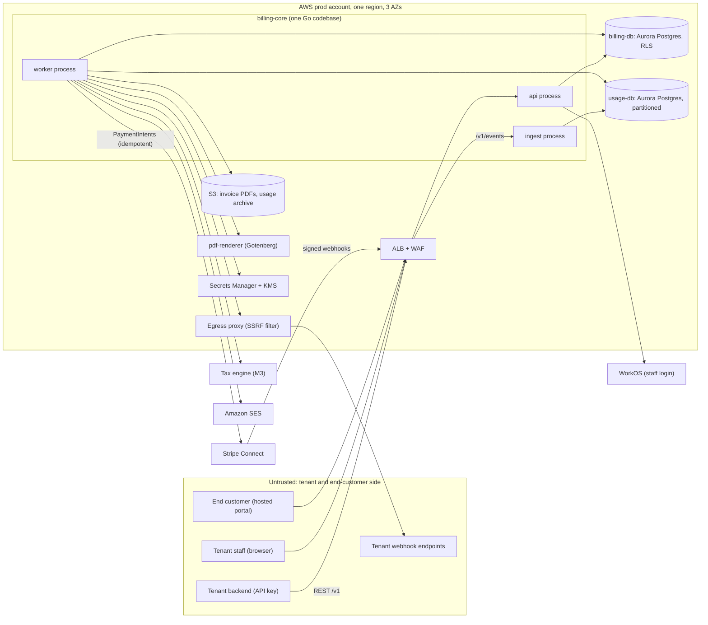
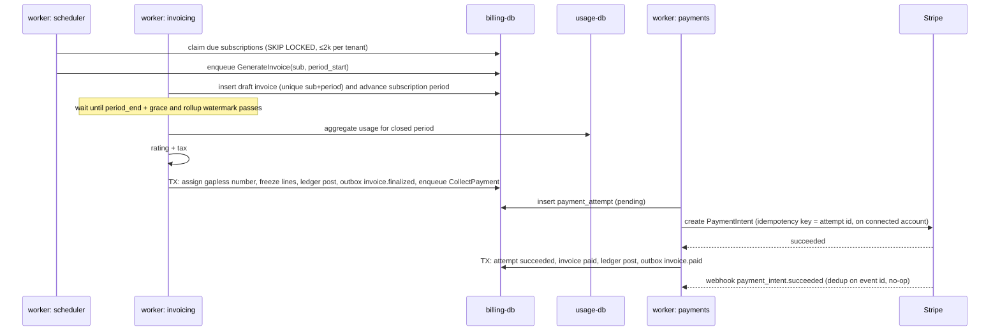

# Architecture and Build Plan: Multi-Tenant SaaS Billing Platform

---

## 1. Summary

- **What is being built (assumed, see A1):** a billing platform sold as SaaS to other businesses ("tenants"). Each tenant uses it to bill its own customers. It covers recurring subscriptions, per-seat and usage-based pricing, invoicing, payment collection through the tenant's own payment processor, dunning (automatic retries and reminders after a failed payment), and webhooks back to the tenant's systems. If you actually meant "billing for our own SaaS product", read the note under A1 first, because the right answer then is mostly to buy, not build.
- **Shape:** one Go codebase (`billing-core`) built as a modular monolith and deployed as three process types: `api`, `ingest` and `worker`. There are two managed Postgres databases (`billing-db` for money and subscriptions, `usage-db` for metered events). Stripe Connect handles payments and a Postgres-backed job queue handles background work. It runs on AWS in a single region.
- **Key decisions:**
  1. **Tenants bring their own Stripe account (Stripe Connect Standard).** We never hold funds or card numbers. This keeps us out of money-transmission licensing and in PCI SAQ A, the lightest card-security tier.
  2. **Shared database with `tenant_id` on every row, enforced by Postgres Row-Level Security (RLS).** Not schema-per-tenant or database-per-tenant.
  3. **Correctness is designed into the data model.** Finalized invoices are immutable and corrected only by credit notes. A double-entry ledger must always balance. Every external action is idempotent. A nightly invariant checker verifies all of this.
  4. **Background jobs are queued in the same Postgres transaction as the business change** that triggers them, so events and charges are never lost or sent twice.
  5. **Usage events start in a separate partitioned Postgres database.** We move to ClickHouse only if spike S1 shows Postgres can't hit the targets.
- **Milestone 1 (5–7 weeks)** delivers a thin slice in staging. A sandbox tenant creates a customer and a monthly subscription through the API, a test clock advances one month, and the system produces exactly one invoice, charges it through Stripe test mode, posts balanced ledger entries and delivers a signed webhook. The milestone also includes four spikes on the riskiest unknowns.
- **Top risks:** proration and billing-period calendar rules being subtly wrong, Stripe Connect rate limits during the start-of-month billing spike, cross-tenant data leaks, usage store scale, and building pricing features that design partners don't actually need.

---

## 2. Context and Goals

**Problem.** B2B SaaS companies with mixed pricing (a platform fee, plus seats, plus metered usage) outgrow simple processor billing. Today they hand-maintain spreadsheets, run cron jobs that miss or double-count usage, and correct invoices by hand. The cost is lost revenue, disputed invoices and finance teams doing reconciliation at month end.

**Goals**
- Tenants can model flat, per-seat, tiered and usage-based prices, run subscriptions through their full lifecycle, and get correct invoices collected automatically.
- No double charges, no lost usage, and invoices that can be explained line by line.
- A tenant can integrate in under a day using the API, webhooks and a sandbox with a test clock.

**Non-goals (for the first 6 months)**
- Acting as merchant of record or holding or paying out funds.
- Revenue recognition under ASC 606 / IFRS 15, and general-ledger accounting. We export data; we don't keep tenants' books.
- Foreign-exchange conversion. Each subscription has one currency.
- Quotes and CPQ (configure-price-quote), contract negotiation and sales-led workflows.
- Payment processors other than Stripe.
- Multi-region active-active deployment, and data residency outside the launch region (see Q3).
- Pricing *unique-count* usage aggregations (counting distinct values).

**Success measures (6 months after launch)**
- 3 or more design-partner tenants billing real money, and 20 or more tenants in sandbox.
- 0 double charges, and 0 unexplained invoice differences during shadow billing (Section 15).
- 99.5% of invoices finalized within 2 hours of the end of their billing period.
- Median tenant time from sign-up to first sandbox invoice under 1 day.

---

## 3. Drivers, Requirements, and Constraints

### Ranked quality attributes

| # | Attribute | Measurable target | Why it matters |
|---|---|---|---|
| 1 | **Financial correctness** | 0 double charges; 0 lost accepted usage events; ledger balanced at every commit; 100% of finalized invoices reproducible from stored inputs | One wrong invoice can lose a tenant, and their customers' trust in them |
| 2 | **Tenant isolation and security** | 0 cross-tenant reads; every endpoint covered by an automated isolation test; SOC 2 Type II audit-ready by month 9 *(assumption)* | A leak is fatal for a B2B platform, and buyers will ask for SOC 2 |
| 3 | **Timely billing and ingestion availability** | Ingest API 99.95% monthly, p99 < 200 ms for a batch of 100 events; management API 99.9%, p95 < 300 ms; invoices finalized ≤ 2 h after period end + grace at 1M subscriptions *(assumed targets)* | Late or missing invoices delay tenants' cash |
| 4 | **Evolvability of pricing** | A new pricing model (for example volume tiers) ships in ≤ 2 engineer-weeks with no migration to the invoice tables | Pricing needs vary by tenant and will keep changing |
| 5 | **Time to market** | First design partner billing live money by about week 24 *(assumption)* | Funding and market window |

The ranking matters when attributes conflict: correctness beats availability. If the payment processor or a dependency is in doubt, we delay a charge rather than risk charging twice. Ingestion is the only path where availability comes close to correctness in priority.

**Recovery targets (assumed):** if a single availability zone fails, recovery takes under 2 minutes with no data loss. If the whole region is lost, recovery takes under 4 hours with at most 15 minutes of data loss.

### Key functional requirements
- Product catalog: products and prices (flat, per-unit, tiered graduated, usage-metered), with monthly or annual intervals and multiple currencies.
- Subscriptions: trials, upgrades with immediate proration (partial charges and credits for part of a period), downgrades at period end, cancellation, pause.
- Metering: an idempotent event ingestion API; meters that aggregate with sum, count or max.
- Invoicing: flat fees billed in advance and usage billed in arrears on one invoice; draft, then finalize, then pay, void or mark uncollectible; per-tenant sequential invoice numbers with no gaps; credit notes; PDFs; email.
- Payments: off-session charges through the tenant's Stripe account; webhooks from Stripe; dunning retry schedule.
- Tenant-facing features: REST API, signed webhooks, dashboard, sandbox with test clocks, hosted customer portal for payment-method updates and invoice history.
- Tax: manual tax rates first, then an external tax engine.

### Constraints (all assumed, because no context was given)
- Greenfield, with no existing stack (see Section 4).
- Team of 6 engineers (4 backend, 1 frontend, 1 platform/infrastructure), a PM and a part-time finance subject-matter expert. No dedicated SRE, so on-call is shared by engineers. Operational appetite is low, which favours managed services.
- AWS, single region (`us-east-2` by default).
- PCI: never touch card numbers, so we stay in SAQ A. GDPR: we are a data processor for end-customer personal data.

### Hard parts
1. **Calendar and proration rules.** Month-end anchors (Jan 31, then Feb 28), time zones, trials and mid-period changes are a classic source of off-by-one-day and off-by-one-cent bugs.
2. **Exactly-once financial effects across unreliable boundaries.** Duplicate usage events, timeouts calling Stripe, and duplicate or out-of-order Stripe webhooks all have to be handled.
3. **The start-of-month billing spike.** Most subscriptions renew on the 1st, so the system creates about 1M invoices and charges in roughly 2 hours. External rate limits apply, and a large tenant must not starve small ones.
4. **Tenant isolation in a shared database.** One forgotten `WHERE tenant_id = ?` would leak data.
5. **Stripe Connect behaviour.** This is an external dependency with its own onboarding, rate limits, and authentication rules such as 3-D Secure.
6. **Usage store scale.** Raw events grow from about 5M/day toward 50M/day, and aggregation queries must stay fast.

---

## 4. Current State

The workspace (`w9ab3fcef/`) is empty apart from a `README.md` that says there is no code, configuration or data. This is a greenfield build, so there are no existing conventions to follow. The plan sets them in M1 (repository layout in Section 13). It assumes no organisation-mandated platform. If one exists (for example GCP, Kubernetes, or a company identity provider), the architecture still holds and the infrastructure tasks change. See Q4.

---

## 5. Assumptions and Open Questions

### Assumptions

| # | Assumption | Impact if wrong | How and when validated |
|---|---|---|---|
| A1 | We are building a **billing platform for many businesses**, not billing for one company's own SaaS product | **Very high.** If this is billing for your own product, buy Stripe Billing, Orb, Chargebee or Metronome and build only entitlement sync and a usage pipeline. That is about 4–8 weeks of work, not 6 months. | User confirms (Q1) before M1 starts |
| A2 | Stripe-only at launch, with tenants connecting their own accounts (Connect Standard) | High. Adyen or other processors add an adapter and change onboarding. | Design-partner interviews in week 1–2 |
| A3 | Year-1 load is 20–50 live tenants, about 200k subscriptions, 5M usage events/day, peak 2k events/s. We design and load-test for 10×: 1M subscriptions, 10k events/s, 50M events/day. | Medium. 100× would push the usage store to ClickHouse early. | Spike S1, then the M3 load test |
| A4 | Team of 6 engineers who can work in Go (or learn it within about 2 weeks) | Medium. The language choice changes; the architecture doesn't. | Q4, before M1 |
| A5 | US single-region launch; EU residency not needed before month 9 | High. It would force a second regional "cell" (a full copy of the stack) earlier. | Q3, before M1 ends |
| A6 | Tenants accept billing periods computed in the tenant's configured time zone, flat fees in advance and usage in arrears | Medium | Spike S3 with design-partner price sheets |
| A7 | 10-year retention for invoices, ledger entries and payments satisfies tenants' tax obligations | Low or medium | Legal review in M2 |
| A8 | Tax responsibility stays with the tenant; we calculate it through an engine but don't file returns | Medium | Q5 |

### Open questions

| # | Question | Who can answer | Default if no answer | Resolve by |
|---|---|---|---|---|
| Q1 | Platform for many businesses (A1), or billing for your own product? | Product owner | Platform | Before M1 |
| Q2 | Which pricing models do the first 2–3 design partners actually need? | PM / design partners | Seats and flat fees in M2, usage in M3 | M1 week 2 |
| Q3 | Is EU data residency required for launch tenants? | Sales / legal | No | End of M1 |
| Q4 | Team language skills, cloud and identity-provider mandates? | Engineering manager | Go, AWS, WorkOS | Before M1 |
| Q5 | Which tax engine vendor (Stripe Tax, Avalara, Anrok)? | Finance / legal | Stripe Tax, which needs the least integration work alongside Connect | Start of M3 |

---

## 6. Architecture Overview



**How it fits together.** Tenants call the `api` process to manage their catalog, customers and subscriptions, and send usage to the `ingest` process. `ingest` is the same binary as `api` but deployed separately, so a usage flood can't slow down the management API, and it scales on its own metric. Everything with financial meaning is written to `billing-db`, and the background jobs it triggers are queued in the same transaction (the job queue is a table in `billing-db`, using River). The `worker` process runs billing, payment, webhook, PDF, email and rollup jobs.

Stripe is reached only through the `payments` module's `PaymentProvider` interface. Tenant webhooks leave through an egress proxy that blocks private and cloud-metadata addresses, because tenants supply the URLs and could otherwise make us call internal services (SSRF).

**Trust boundaries:**
- Internet to ALB/WAF.
- ALB to the app, where tenant identity is established.
- App to database, where RLS enforces tenant scope a second time.
- App to Stripe, using a restricted platform key that only the `worker` task role can read.

### Component table

Modules live in `internal/<module>/` and are deployed inside `billing-core`.

| Component | Responsibility | Owns data | Exposes | Technology | Key dependencies |
|---|---|---|---|---|---|
| `tenancy` | Organisations, tenants (live and sandbox), API keys, staff users and roles, test clocks | `organisations`, `tenants`, `api_keys`, `users`, `memberships`, `test_clocks` | Auth middleware; `/v1/api_keys` | Go, WorkOS | billing-db |
| `catalog` | Products and prices, including price-model configuration | `products`, `prices` | `/v1/products`, `/v1/prices` | Go | `rating` (validates config) |
| `customers` | End customers, billing details, payment-method references | `customers`, `customer_payment_methods` | `/v1/customers` | Go | `payments` |
| `subscriptions` | Lifecycle state machine, periods, scheduled changes, the renewal scheduler | `subscriptions`, `subscription_items`, `subscription_changes` | `/v1/subscriptions`; jobs | Go, `periods` lib | `invoicing`, `catalog` |
| `periods` (library) | Pure functions for period boundaries, anchors, proration factors | none | Go package API | Go | `platform/clock` |
| `metering` | Usage ingestion, deduplication, hourly rollups, meter definitions | `meters` (billing-db); `usage_events`, `usage_rollups_hourly` (usage-db) | `POST /v1/events`; `metering.Aggregate()` | Go | usage-db |
| `rating` | Price model × quantity → line amounts. Pure, versioned per model type. | none | Go package API | Go, decimal library | `platform/money` |
| `invoicing` | Drafts, finalization, numbering, credit notes, PDFs | `invoices`, `invoice_lines`, `invoice_number_seqs`, `credit_notes` | `/v1/invoices`, `/v1/credit_notes`; jobs | Go, Gotenberg, S3 | `rating`, `metering`, `ledger`, `tax` |
| `payments` | Payment attempts, dunning, Stripe adapter, inbound Stripe webhooks | `payment_attempts`, `processor_events`, `dunning_schedules` | `/webhooks/stripe`; jobs | Go, Stripe SDK | Stripe, `ledger` |
| `ledger` | Double-entry postings and balances. **The only writer of ledger tables.** | `ledger_accounts`, `ledger_transactions`, `ledger_entries` | Go API `Post(txn)`; `/v1/customers/{id}/balance` | Go, Postgres constraints | billing-db |
| `events` | Transactional outbox, tenant webhook endpoints and deliveries | `outbox_events`, `webhook_endpoints`, `webhook_deliveries` | `/v1/webhook_endpoints`; jobs | Go, egress proxy | all modules publish |
| `tax` | `TaxProvider` interface: manual rates (M2), external engine (M3) | `tax_rates`, `tax_calculations` | Go API | Go | Tax vendor |
| `notifications` | Invoice and dunning emails | `email_log` | jobs | Go, SES | `invoicing`, `payments` |
| `platform/*` | Database sessions with RLS, job queue, clock, money, IDs, configuration, telemetry | `river_job` tables | Go packages | pgx, River, OpenTelemetry | none |
| `web/dashboard` | Tenant staff user interface | none (calls `/v1` and internal backend-for-frontend routes) | Web app | React + TypeScript | `api` |
| `pdf-renderer` | HTML-to-PDF rendering | none | Internal HTTP | Gotenberg container | none |

---

## 7. Component Details

**Process types (`api`, `ingest`, `worker`).** All three run as one binary with subcommands (`billing-core api|ingest|worker`) on ECS Fargate, with at least 2 tasks each spread across availability zones.
- `api` autoscales on CPU and p95 latency.
- `ingest` autoscales on request rate.
- `worker` autoscales on River queue depth.
- Health checks run `SELECT 1` against the relevant database and confirm the job queue is reachable, so they reflect whether the process can actually serve work.

**`tenancy`.** API keys look like `sk_live_…` / `sk_test_…`. We store only an 8-character lookup prefix and a SHA-256 hash; the full key is shown once. Each request resolves `tenant_id`, then opens a transaction and runs `SET LOCAL app.tenant_id = …`. The application's database role has no `BYPASSRLS`. Platform staff access goes through a separate break-glass role that is time-limited and audited (built in M4).
- A **sandbox tenant** is a separate `tenants` row with `kind = 'sandbox'` and a `parent_tenant_id`, connected to a Stripe test-mode account.
- **Test clocks** are allowed only on sandbox tenants (enforced by a database check constraint).
- Out of scope for this module: authorising specific resource actions. Each module checks role scopes itself through a shared `authz.Require(scope)`.

**`subscriptions` and the renewal scheduler.** `subscriptions.next_action_at` holds the next instant something must happen (renewal, trial end, scheduled change), backed by a partial index `WHERE status IN ('trialing','active','past_due')`.
- Every 30 s a scheduler job claims due rows using `FOR UPDATE SKIP LOCKED` in batches.
- **Fairness:** each tick takes at most 2,000 rows per tenant, so a 500k-subscription tenant can't starve small tenants.
- The scheduler enqueues `GenerateInvoice(subscription_id, period_start)`.
- Sandbox tenants with test clocks are processed by an `AdvanceClock` job, which walks period by period up to the new clock time.
- Failure handling: a crash mid-batch only leaves rows unclaimed, which the next tick picks up. Duplicate jobs are harmless because of the unique key on `invoices (subscription_id, period_start)`.

**`periods` (library).** Pure, side-effect-free functions: `Next(anchor, interval, tz, after)`, `Clamp(month-end)`, `ProrationFactor(change_at, period)`. It never reads the wall clock; all time comes from an injected `platform/clock`. This is hard part 1, so it gets property-based tests and an external oracle comparison (spike S3).

**`metering`.** `POST /v1/events` accepts up to 500 events per request. Each event has `{event_id, customer_id, meter_key, timestamp, value, properties}`.
- Events are validated, written with `INSERT … ON CONFLICT DO NOTHING`, and acknowledged with `202` only after commit. The response reports `accepted`, `duplicate` and `rejected` counts per event.
- Events older than 35 days or more than 5 minutes in the future are rejected.
- A `RollupUsage` job runs every minute and advances a watermark of ingest sequence numbers into `usage_rollups_hourly`. Aggregation for invoicing reads rollups plus any not-yet-rolled tail.
- Per-tenant rate limit: 2,000 events/s by default, configurable, and returned as a `429` with `Retry-After`.
- Failure handling: if usage-db is unavailable, `ingest` returns `503` and the SDK retries with the same `event_id`. Nothing is acknowledged that isn't durable.

**`rating`.** Each price has `model` (`flat`, `per_unit`, `tiered_graduated`, `tiered_volume`, `package`) and a JSON `config` validated by that model's Go type. `Rate(price_snapshot, quantity) → []LineAmount`. Adding a pricing model means adding a type and its tests, with no schema change. Invoice lines store a **snapshot** of the price configuration they were rated with, so later price edits never change past invoices. This is how driver 4 is met.

**`invoicing`.**
- When a period ends, a draft invoice is created. It contains flat and seat fees for the *next* period (billed in advance) plus usage for the *closed* period (billed in arrears).
- The draft is finalized at `period_end + grace`, where grace defaults to 1 h and a tenant can set up to 72 h. Finalization also waits for the rollup watermark to pass `period_end + grace`.
- Finalization happens in one transaction: lock the `invoice_number_seqs` row for the tenant, assign the next gapless number, freeze the lines, post ledger entries, write outbox events (`invoice.finalized`), and enqueue `CollectPayment` and `RenderPdf`.
- Finalized invoices are immutable; a trigger rejects updates to amount columns. Corrections are made with credit notes.
- **Late usage** (events whose period was already finalized) is accepted and flagged. From M3 it is billed on the next invoice as a separately labelled line.

**`payments`.**
- Every charge attempt gets a `payment_attempts` row first, whose ID is the Stripe idempotency key. The Stripe call happens *after* that row commits.
- States: `pending → processing → succeeded | failed | requires_action | unknown`.
- Inbound Stripe webhooks are signature-verified, inserted into `processor_events` with a unique key `(provider, event_id)`, then processed by a job. State transitions only move forward, so out-of-order events are safe.
- Circuit breaker: if more than 20% of Stripe calls fail within 1 minute, new attempts are deferred, not failed. Dunning counters don't advance during a provider outage.
- A per-connected-account concurrency limit is applied, with its value set by spike S2.

**`ledger`.** Accounts per tenant: `receivable:{customer}`, `customer_credit:{customer}`, `revenue`, `tax_payable`, `processor_clearing`, `refunds`.

| Event | Postings |
|---|---|
| Invoice finalized | Dr receivable (total); Cr revenue (subtotal); Cr tax_payable (tax) |
| Payment succeeded | Dr processor_clearing; Cr receivable |
| Credit note | Dr revenue; Cr receivable or customer_credit |
| Refund | Dr refunds; Cr processor_clearing |

A deferred constraint trigger rejects any `ledger_transaction` whose entries don't sum to zero per currency. Entries are append-only. This is a billing sub-ledger only: tenants export it, and it is not their general ledger.

**`events` (tenant webhooks).** Outbox rows are written in the same transaction as the business change. A delivery job POSTs through the egress proxy with headers `Billing-Signature: t=…,v1=HMAC-SHA256`, using a 10 s timeout.
- Retries use exponential backoff with jitter over 3 days: about 15 attempts, then the delivery is marked failed. Tenants can replay from the dashboard or API.
- If an endpoint fails continuously for 3 days it is disabled and the tenant's owners are emailed.
- Ordering isn't guaranteed. Payloads carry the resource version and `created` timestamp so tenants can discard stale events.
- This is built in-house, not with Svix (see D11).

**`tax`.** A `TaxProvider` interface with a `ManualRates` implementation in M2 and an external engine in M3. If the external engine fails, finalization is retried for up to the grace period, then the invoice stays in draft and an alert fires. We never finalize with a guessed tax amount.

**Routine:** `notifications` (SES, with tenant-branded templates), `pdf-renderer` (Gotenberg, internal network only, output stored in S3 under the invoice ID and never regenerated after finalization) and `web/dashboard`.

---

## 8. Data Design

**Main entities and relationships**

```
organisations 1─* tenants (live, sandbox) 1─* api_keys
tenants 1─* customers 1─* subscriptions 1─* subscription_items *─1 prices *─1 products
subscriptions 1─* invoices 1─* invoice_lines (price snapshot)
invoices 1─* payment_attempts ;  invoices 1─* credit_notes
ledger_transactions 1─* ledger_entries *─1 ledger_accounts
meters 1─* usage_events (usage-db) → usage_rollups_hourly
```

**System of record and writers.** Every table has exactly one owning module, as listed in Section 6. Other modules call the owner's Go API and never write its tables. This is enforced by `depguard` lint rules and a CI check that maps migration files to modules. `billing-db` is the system of record for everything except usage events, which live in `usage-db`.

**Consistency.**
- Atomic in one `billing-db` transaction: invoice finalization (number, line freeze, ledger posting, outbox, job enqueue), and payment success (attempt state, invoice paid, ledger posting, outbox).
- `usage-db` and `billing-db` are separate, so they don't share transactions. Invoicing reads usage up to a watermark, and late events are handled explicitly (Section 7).
- The only cross-system effect is Stripe, which is covered by idempotency keys plus webhook reconciliation.

**Identifiers and money.**
- IDs are prefixed UUIDv7 (`cus_…`, `sub_…`, `inv_…`). They are globally unique so a tenant can later be moved to another cell by copying data.
- Amounts are `BIGINT` in minor units, with currency exponents taken from ISO 4217 (JPY has 0 decimal places, KWD has 3).
- Unit prices are `NUMERIC(38,12)` and are exposed in the API as decimal strings.
- Each line is rounded once, half-up, to the currency's minor unit. The invoice total is the sum of lines, with no rounding at invoice level.

**Access patterns and indexes**
- Every tenant table has `tenant_id` as the first column of its primary and secondary indexes, plus an RLS policy `USING (tenant_id = current_setting('app.tenant_id')::uuid)`.
- `subscriptions (next_action_at)` partial index (scheduler).
- `invoices (tenant_id, customer_id, created_at DESC)`; unique `invoices (subscription_id, period_start)`.
- `usage_events`: range-partitioned by day on `timestamp`, unique `(tenant_id, event_id, timestamp)`. A retried event with the same ID and timestamp is deduplicated. The SDK guarantees retries are byte-identical. Spike S1 confirms this dedupe design or replaces it.
- `usage_rollups_hourly (tenant_id, customer_id, meter_id, hour)` primary key.
- `idempotency_keys (tenant_id, key)`, kept for 24 h.

**Retention, backup and restore**

| Data | Retention | Notes |
|---|---|---|
| Invoices, lines, credit notes, payments, ledger | 10 years (A7) | Immutable |
| Raw usage events | 13 months in usage-db, then Parquet in S3 for 7 years | Daily partitions are dropped with no delete scans |
| Rollups | 25 months | |
| Outbox and webhook deliveries | 30 days | |
| Audit log | 7 years | Separate append-only table, also streamed to S3 with Object Lock |

Both Aurora clusters run Multi-AZ with point-in-time recovery for 35 days, and daily snapshots are copied to a second region. A restore drill (restore to a new cluster and run the invariant checker against it) happens in M4, then quarterly.

**Classification**
- **Restricted:** API key hashes, webhook signing secrets (KMS envelope-encrypted), the platform Stripe key (Secrets Manager).
- **Personal data:** end-customer name, email, address, tax ID. Masked in logs by a structured-logging redaction allowlist.
- **No card data** is ever stored; we keep only Stripe `pm_…` references.
- **GDPR erasure:** legally retained invoice fields are kept and other personal data is pseudonymised.

**Schema evolution.** Migrations live in `db/migrations/{billing,usage}/` and are run by a CI deploy step before new code rolls out. Changes follow expand and contract: add the new structure, backfill, switch reads, then drop the old structure in a later release. No destructive migration ships in the same release as the code that stops using the column.

---

## 9. Key Flows

### F1. Usage ingestion, including a duplicate

1. The tenant's SDK sends `POST /v1/events` with 100 events to `ingest`.
2. `ingest` authenticates the API key, checks the per-tenant rate limit and validates the schema and timestamp window.
3. It runs one multi-row `INSERT … ON CONFLICT (tenant_id, event_id, timestamp) DO NOTHING RETURNING event_id` inside a transaction scoped by RLS.
4. It returns `202` with per-event status.
5. **Failure path (timeout):** the client times out after the commit but before it receives the response, and retries the same batch. All 100 come back as `duplicate`. Quantities are unchanged and the client treats the batch as success.
6. **Failure path (database failover, about 30 s):** `ingest` returns `503`, the SDK backs off and retries, and nothing is acknowledged that isn't durable. The `ingest 5xx rate` alert fires only if the failover lasts longer than 2 minutes.

### F2. Period-end billing run (the main path)



### F3. Payment with an unknown outcome, and a decline (failure paths)

1. The `CollectPayment` call to Stripe times out after 15 s. The attempt is set to `unknown`, which is **not** treated as a failure.
2. A `ResolvePayment` job re-sends the identical request with the same idempotency key after 1, 5 and 30 minutes. Stripe returns the original result, so no second charge happens. Usually the Stripe webhook resolves the attempt first.
3. If the result is `failed` (card declined): a `payment_failed` outbox event is written, the invoice stays `open`, and the dunning schedule enqueues retries on days 3, 5 and 7 (tenant-configurable from M3). The subscription becomes `past_due`, and the customer gets an email with a portal link to update their card.
4. After the last retry: the subscription follows the tenant's policy (`cancel` or `mark_unpaid`), with `subscription.updated` and `invoice.marked_uncollectible` events.
5. **Stripe outage:** the circuit breaker opens and new attempts are deferred, not failed. Dunning clocks pause, invoices keep finalizing, and the `payment attempts deferred > 15 min` alert fires.
6. **Out-of-order webhooks** (`failed` arriving after `succeeded`): because the state machine only moves forward, the late event is ignored, and this is logged.

### F4. Mid-cycle upgrade with proration

1. The tenant calls `POST /v1/subscriptions/{id}` with `items: [{price: price_pro}]` and `proration: "immediate"` (the default for upgrades). An `Idempotency-Key` header is required.
2. The `periods` library computes `factor = remaining_seconds / period_seconds`.
3. The `rating` module produces a credit line (−old price × factor) and a charge line (+new price × factor), each rounded once.
4. A one-off invoice is created and finalized immediately, then goes through the F2 collection path.
5. Downgrades are stored in `subscription_changes` and applied at the next period start, so no credit is issued mid-period.
6. **Duplicate request** with the same `Idempotency-Key`: the stored response is returned and no second invoice is created. The same key with a different body returns `422`.

---

## 10. Key Decisions

| # | Decision | Options considered | Rationale (against drivers) | Reversibility | Revisit if |
|---|---|---|---|---|---|
| D1 | Tenants bring their own processor via **Stripe Connect Standard**; we never hold funds | (a) Connect Standard; (b) Connect Express/Custom; (c) we act as merchant of record or payment facilitator | (a) avoids licensing, keeps us in PCI SAQ A, lets tenants' existing customers and cards carry over (makes migration easy), and is fastest to market (#5). (c) would add years of compliance. | Hard | Design partners need a processor Stripe doesn't cover, or want us to handle payouts |
| D2 | **Shared schema, `tenant_id` on every row, Postgres RLS** | (a) shared + RLS; (b) schema per tenant; (c) database per tenant | (a) has the lowest operational load and simple migrations. RLS gives defence in depth for isolation (#2). (b) and (c) multiply migrations and connections across 1,000 tenants. | Hard | An enterprise contract requires physical isolation, or residency applies. Response: dedicated *cells* (a full stack copy), made possible by global IDs. |
| D3 | **Modular monolith, 3 process types** | (a) monolith; (b) microservices per module | One team of 6, and financial transactions span invoicing, ledger and outbox. Splitting into services would turn local transactions into sagas, hurting #1. Separating `ingest` covers the one real difference in scaling needs. | Medium | Separate teams own modules, or one module's release cadence blocks others |
| D4 | **Postgres job queue (River) in billing-db**, with jobs queued in the same transaction | (a) River; (b) SQS + outbox relay; (c) Kafka | (a) gives an outbox for free, so a business change and its follow-up job commit together (#1). Peak is about 150 jobs/s, well within Postgres limits. One less system to run. | Medium | Sustained job rate > 2k/s, or queue tables cause visible vacuum or lock contention |
| D5 | **Separate partitioned Postgres for usage** (usage-db) | (a) Postgres + hourly rollups; (b) ClickHouse Cloud from day one; (c) Kinesis + S3 | (a) uses one technology, and the team keeps one operating model. Isolating it from billing-db protects #3. (b) is better at 100× scale but is a new technology during M1. | Medium | S1 shows < 10k events/s sustained, or aggregate p95 > 2 s for a 50M-event customer. Then move to ClickHouse in M3. |
| D6 | **Integer minor units; NUMERIC unit prices; round half-up once per line** | (a) as stated; (b) float; (c) round at invoice level | Deterministic, reproducible invoices (#1). Matches common processor behaviour. | Hard (stored invoices) | A design partner's jurisdiction requires a different rounding rule. That would become a per-tenant rounding mode for new invoices only. |
| D7 | **Immutable finalized invoices, credit-note corrections, gapless per-tenant numbering** | (a) immutable; (b) editable invoices | Required in many tax regimes, auditable (#1). A per-tenant counter lock serializes about 100k finalizations for a large tenant in under 2 minutes, which is acceptable. | Hard | Never likely, since this is a legal requirement in many regions |
| D8 | **REST/JSON, `/v1`, OpenAPI-first, additive-only changes, `Idempotency-Key` on POST** | (a) REST + OpenAPI; (b) GraphQL; (c) gRPC | Tenants integrate from any stack, and SDKs are generated from the spec. It is also the convention for billing APIs. | Hard (public contract) | Breaking change needed. Then `/v2` runs alongside `/v1` for at least 12 months. |
| D9 | **Go backend; React/TypeScript dashboard** | Go, Kotlin, TypeScript | Static types, simple concurrency for workers, single binary, low operational load. Costs about 2 weeks of ramp-up if the team doesn't know Go (A4). | Hard | Team is predominantly on the JVM or TypeScript. Switch before M1, because the architecture is unchanged. |
| D10 | **Tax through a `TaxProvider` interface**: manual rates (M2), external engine (M3) | Build tax logic; buy an engine | Tax rules are not our product, and buying gets us to market faster (#5) | Easy | Engine cost per transaction exceeds tenant willingness to pay |
| D11 | **Build tenant webhooks in-house** | In-house; Svix | Small scope (about 1.5 engineer-weeks) using River and HMAC. Avoids a vendor holding tenant data. | Easy | Webhook features (debug portal, per-tenant transforms) take more than 2 weeks of roadmap |
| D12 | **WorkOS for staff login and enterprise SSO** | WorkOS, Auth0, Cognito | Built for B2B, with SSO and SCIM ready for enterprise tenants. Free tier for basic auth. | Medium | An organisation-wide identity provider is mandated (Q4) |
| D13 | **AWS, single region, ECS Fargate, Aurora Postgres, Terraform** | Fargate vs EKS; Aurora vs RDS | Fargate has no cluster to run. Aurora fails over in about 30 s. Fits low operational appetite. | Medium | Org standardizes on Kubernetes, or EU residency is needed (adds a second cell) |

---

## 11. Cross-Cutting Concerns

### Security (built in M1, hardened in M4)

**Identity**
- Tenant API keys: hashed, prefixed, scoped to `full`, `read_only` or `ingest_only` (scopes added in M2), and rotatable with 24 h overlap.
- Staff: WorkOS sessions with roles `owner`, `admin`, `finance`, `developer` and `viewer`, checked on the server for every route.
- End customers: signed, single-customer, 1-hour portal links.

**Isolation:** RLS plus an automated isolation suite (Section 14).

**Secrets:** AWS Secrets Manager. The Stripe platform key is a *restricted* key, readable only by the `worker` task role, with a rotation runbook. Webhook secrets are KMS envelope-encrypted.

**Encryption:** TLS 1.2+ everywhere; Aurora and S3 encrypted with KMS.

**Input and network**
- OpenAPI request validation and parameterised queries (pgx).
- AWS WAF managed rules plus per-key rate limits.
- Egress proxy for tenant webhook URLs that denies RFC 1918 private ranges, link-local addresses and 169.254.169.254 (the cloud metadata endpoint).

**Supply chain:** `govulncheck`, Dependabot and container image scanning in CI. Critical vulnerabilities block the release.

**Audit log:** every key creation, role change, refund, credit note, void and break-glass access is written to an append-only table and S3 with Object Lock.

**Top threats**

| Threat | Mitigation |
|---|---|
| Cross-tenant read through a scoping bug | RLS second layer; isolation suite on every endpoint; app role has no `BYPASSRLS` |
| Stolen tenant API key used for refunds or credit notes | Scoped keys; audit log; alert on refund or credit-note volume > 3× the tenant's 30-day baseline; instant revoke |
| Platform Stripe key compromise (can act on all connected accounts) | Restricted key, single task role, no human read access, rotation runbook, Stripe dashboard alerts |
| SSRF through tenant webhook URLs | Egress proxy deny-list; webhooks never sent from the app's own network path |
| Insider or support over-access | Break-glass role that is read-only by default, time-limited, ticket-referenced and audited (M4) |

**SOC 2:** controls start in M1 (PR reviews, CI-only deploys, audit logs, access via SSO). Auditor engagement starts in M3, and the Type I report comes after M4.

### Reliability
- Targets as in Section 3. Aurora Multi-AZ, at least 2 tasks per process across AZs.
- Timeouts: Stripe 15 s, tax engine 5 s, webhooks 10 s, database statements 5 s (API) and 60 s (jobs).
- Retries with backoff and jitter only on idempotent operations (all external calls carry idempotency keys).
- Backpressure: per-tenant ingest limits, per-tenant scheduler batches, per-connected-account payment concurrency.
- River jobs that exhaust retries are moved to a `discarded` state, shown on a dashboard and replayable with a CLI (`billing-core jobs retry --kind … --since …`).

### Observability (M1 basics, M4 complete)

OpenTelemetry traces, metrics and logs go to Grafana Cloud. Every span and log line carries `tenant_id`, `request_id` and `job_id`. Logs are structured JSON with personal-data redaction.

| User-facing symptom alert | Threshold |
|---|---|
| Ingest error rate | > 1% for 5 min |
| Management API p95 latency | > 300 ms for 10 min |
| **Billing lag**: subscriptions past `next_action_at` + 30 min | > 0 for 15 min |
| Invoices in draft past finalize time + 1 h | > 0 |
| Payment attempts `unknown` > 1 h, or deferred > 15 min | > 0 |
| Webhook backlog per endpoint | > 1,000 or oldest > 1 h (tenant-visible, not a page) |
| **Invariant checker violation** | Any. Pages on-call immediately. |

The **invariant checker** runs nightly and at 15 minutes past each hour during the billing spike (M1 v0, extended in M3). It checks that:
- the ledger balances per tenant and currency;
- every finalized invoice has exactly one finalization ledger transaction;
- every paid invoice has a succeeded attempt;
- the sum of succeeded attempts matches Stripe balance transactions per connected account (from M3).

Each alert links to a runbook in `docs/runbooks/`.

### Performance and capacity
- **Expected peaks:** 10k events/s ingest; about 150 invoice finalizations/s and about 150 Stripe calls/s on the 1st of the month at 1M subscriptions; management API under 200 req/s.
- **Expected bottlenecks:** usage-db write IOPS and aggregation (S1), Stripe rate limits (S2), billing-db lock contention on the invoice-number counter for large tenants.
- **Load tests:** k6 scripts in `loadtest/`. Ingest is tested in M1 (S1). A full billing run of 1M synthetic subscriptions against Stripe-mock with a per-account rate-limit simulator runs in M3, and again before launch in M4.

### Cost (assumed, verified with AWS Pricing Calculator in M1)
- **Production at launch:** roughly $3–5k/month. That covers two Aurora Multi-AZ clusters (about $1.5–2.5k), Fargate (about $0.5k), ALB, WAF and NAT (about $0.3k), S3 and SES (small) and Grafana Cloud (about $0.3–1k).
- **Staging:** about $1k/month (single-AZ, smaller instances, scaled down at night).
- **Main cost drivers:** usage-db storage and I/O, observability ingestion volume and the per-call fee of the tax engine.
- **Controls:** mandatory `tenant`/`env`/`component` tags, AWS Budgets alerts at 80% and 100%, log sampling for successful `ingest` requests, and S3 lifecycle rules for archives.
- **Stripe fees** are paid by tenants on their own accounts.

### Operations
- The 4 backend engineers own `billing-core` in a weekly on-call rotation, starting M4 with live tenants. The platform engineer owns `infra/`.
- **Runbooks (M4):** stuck billing run, Stripe outage, payment `unknown` backlog, invariant violation, database failover or point-in-time restore, webhook endpoint storms, tenant key compromise.
- **Support:** tenants file tickets. The read-only admin console with audited break-glass ships in M4. The finance subject-matter expert reviews any credit note issued by the platform team.

### AI-specific concerns
Not applicable. The system has no AI or model components.

---

## 12. Build Sequence

**Team assumption:** 4 backend engineers, 1 frontend, 1 platform/infrastructure, a PM and a part-time finance expert. Sizes are rough ranges, not commitments.

| Milestone | Goal / risk cleared | Scope (in / out) | Deliverables | Exit criteria | Depends on | Size |
|---|---|---|---|---|---|---|
| **M1: Thin slice + spikes** | Prove the end-to-end money path, isolation and deployment. Answer S1–S4. | **In:** flat monthly USD price, customer, subscription, renewal, invoice, Stripe test charge, ledger, one webhook, test clock, read-only dashboard. **Out:** proration, usage billing, PDFs, email, tax, dunning. | Staging environment through CI/CD; `billing-core` v0; OpenAPI v1 draft; 4 spike reports; invariant checker v0 | The automated E2E test (Section 13, T17) passes on every deploy; the isolation suite passes; a rollback is shown working; spike decisions recorded in `docs/adr/` | None | **5–7 weeks** |
| **M2: Subscription billing for design partners (sandbox)** | Deliver the pricing that design partners need (Q2) | **In:** per-unit, tiered and volume prices; seats; trials; upgrade proration; downgrade at period end; cancel and pause; manual tax rates; invoice PDFs; email; credit notes; dunning; scoped keys; dashboard CRUD; Go and TypeScript SDKs. **Out:** usage, external tax. | Sandbox tenants onboarded | 2 design partners model their real price sheets in sandbox; 12 simulated monthly cycles run with test clocks; the golden scenario suite of 50+ cases matches the finance expert's expected invoices to the cent | M1; Q2 answered | **5–7 weeks** |
| **M3: Usage billing + scale** | Clear hard parts 3 and 6 at 10× load | **In:** meters (sum, count, max), rollups, usage invoices, late usage line, external tax engine, customer portal (Stripe Elements card capture), reconciliation against Stripe, configurable dunning, fairness controls. ClickHouse migration *only if S1 failed*. | Load-test report | Ingest sustains 10k events/s with p99 < 200 ms; a 1M-subscription billing run finalizes all invoices in ≤ 2 h with 0 duplicates and 0 invariant violations; tax engine works in sandbox | M2; S1 and S2 outcomes | **5–8 weeks** |
| **M4: Production readiness + first live tenants** | Real money, safely | **In:** shadow billing, import tooling from Stripe Billing, on-call and runbooks, admin console with break-glass, DR restore drill, pen test, SOC 2 Type I readiness, prod environment, platform bills its own tenants with itself. | Prod live | 1 full shadow cycle per partner with all differences explained; restore drill meets the recovery targets; pen test has no open high-severity findings; first live charge for partner #1 | M3 | **4–6 weeks** |

**Critical path:** Stripe Connect platform setup (day 1, a long-lead item) → S2 → payments adapter (T14) → E2E slice (T17) → M2 dunning → M3 billing-run load test → M4 shadow billing → live.

A second chain runs alongside: S3 (`periods`) → M2 proration → golden scenario suite. Design-partner recruitment and their price sheets (Q2) gate M2 scope and must start on day 1.

**Total:** about 19–28 weeks to first live tenant.

---

## 13. First Milestone Task Breakdown

Proposed repository layout (new repository `billing/`):

```
cmd/billing-core/            main.go (subcommands api|ingest|worker|migrate|jobs)
internal/{tenancy,catalog,customers,subscriptions,metering,rating,invoicing,payments,ledger,events,tax,notifications}/
internal/periods/            pure calendar/proration library
internal/platform/{db,jobs,clock,money,ids,config,telemetry,authz,idempotency}/
api/openapi.yaml
db/migrations/billing/  db/migrations/usage/
web/dashboard/               React + TypeScript (Vite)
infra/                       Terraform (envs/staging, envs/prod, modules/)
loadtest/                    k6 scripts
docs/adr/  docs/spikes/  docs/runbooks/
.github/workflows/
```

**Day 1, long-lead items (PM and engineering manager):**
- **L1.** Register the Stripe Connect platform, enable Standard accounts and OAuth, and create 2 test connected accounts. *Done when* the platform client ID and test accounts are available in Secrets Manager.
- **L2.** Recruit 2–3 design partners and collect their actual price sheets and current invoices. *Done when* the price sheets are in `docs/spikes/design-partners/`.
- **L3.** Create AWS Organizations accounts (`billing-dev`, `billing-staging`, `billing-prod`) and set up SSO access. *Done when* engineers can log in through SSO with no long-lived IAM users.

### Foundations (parallel track A, platform engineer)

| # | Task | Location | Done when |
|---|---|---|---|
| T1 | Create the repository skeleton above: current stable Go, `Makefile` (`make test lint migrate run`), `golangci-lint` with `depguard` rules so modules can import only each other's top-level package | repository root, `.golangci.yml` | CI is green, and a deliberate import of `internal/ledger/store` from `invoicing` fails lint |
| T2 | Write Terraform for staging: VPC (3 AZs), Aurora Postgres 17 clusters `billing-db` and `usage-db`, ECS cluster with `api`/`ingest`/`worker` services, ALB + WAF, ECR, S3 buckets, Secrets Manager, KMS. Remote state in S3 with locking. | `infra/modules/*`, `infra/envs/staging` | `terraform apply` from CI builds staging from empty, and a second `plan` shows no changes |
| T3 | Build CI/CD: lint, unit tests, integration tests with a Postgres service container, image build to ECR, `billing-core migrate` then a rolling deploy to staging on merge to `main`. Add a one-step rollback workflow that redeploys the previous image digest. | `.github/workflows/{ci,deploy,rollback}.yml` | Merge to staging takes under 15 min; the rollback workflow restores the previous version in staging, shown once |
| T4 | Wire up OpenTelemetry (traces, metrics, JSON logs with `tenant_id`/`request_id`, personal-data redaction allowlist) exporting to Grafana Cloud | `internal/platform/telemetry` | A staging trace shows API request → DB → enqueued job → worker execution under one trace ID |

### Core platform and tenancy (track B, backend engineer 1)

| # | Task | Location | Done when |
|---|---|---|---|
| T5 | Implement `money` (int64 minor units, ISO 4217 exponents, half-up rounding from NUMERIC), `ids` (prefixed UUIDv7) and `clock` (`Clock` interface; real clock, plus per-tenant frozen clock for sandboxes) | `internal/platform/{money,ids,clock}` | Property tests (`pgregory.net/rapid`) show rounding is deterministic and the sum of lines equals the total. JPY, USD and KWD cases pass. |
| T6 | Add migrations for `organisations`, `tenants` (with `kind` check), `api_keys`, `users`, `memberships`, `test_clocks`, `idempotency_keys`, `audit_log`. Add an RLS policy template applied to every tenant table and a `billing_app` role without `BYPASSRLS`. | `db/migrations/billing/0001_*.sql` | Migrations apply and roll back on a clean database in CI. A test shows that a query with no `app.tenant_id` set returns 0 rows. |
| T7 | Implement API key auth middleware (prefix lookup, SHA-256 compare, resolve tenant, `SET LOCAL app.tenant_id` per transaction through `platform/db.WithTenantTx`) | `internal/tenancy`, `internal/platform/db` | Integration test: a valid key gets 200; a revoked key gets 401; the tenant context appears in the logs |
| T8 | Implement `Idempotency-Key` middleware for all POSTs (stores request hash and response for 24 h; same key with a different body returns 422) | `internal/platform/idempotency` | A test sends 10 concurrent identical POSTs and finds exactly 1 resource created and 10 identical responses |

### Billing slice (track C, backend engineers 2–3)

| # | Task | Location | Done when |
|---|---|---|---|
| T9 | Draft the OpenAPI v1 spec for customers, products, prices (flat recurring only), subscriptions (create/get/cancel), invoices (list/get), webhook_endpoints, test_clocks/advance. Generate server interfaces with `oapi-codegen`. | `api/openapi.yaml` | `spectral lint` passes in CI, and handlers compile against the generated interfaces |
| T10 | Implement `catalog`, `customers` and `subscriptions` (create with anchor = start, `next_action_at`), with migrations | `internal/{catalog,customers,subscriptions}`, `db/migrations/billing/0002_*` | API tests create product → price → customer → subscription, and `next_action_at` equals the anchor + 1 month (clamped at month end) |
| T11 | Build the renewal scheduler job (30 s tick, `SKIP LOCKED`, ≤ 2,000 per tenant per tick), `GenerateInvoice` and the `AdvanceClock` job for sandboxes. Uses River in `billing-db`. | `internal/subscriptions/scheduler.go`, `internal/platform/jobs` | A chaos test kills the worker mid-batch of 10k due subscriptions. After restart there are exactly 10k invoices, with 0 duplicates and 0 missing. |
| T12 | Implement `invoicing` draft → finalize: per-tenant gapless number (`invoice_number_seqs` row lock), immutability trigger, outbox `invoice.finalized`, enqueue `CollectPayment`, all in one transaction | `internal/invoicing`, `db/migrations/billing/0003_*` | Concurrent finalization of 1,000 invoices for one tenant yields numbers 1..1000 with no gaps or duplicates. An `UPDATE` to `total` on a finalized invoice fails. |
| T13 | Implement `ledger` accounts, transactions and entries, with a deferred constraint trigger enforcing sum = 0 per currency. Postings for invoice finalization and payment success. | `internal/ledger`, `db/migrations/billing/0004_*` | A test shows an unbalanced posting fails at commit. Finalizing then paying an invoice leaves customer receivable at 0. |
| T14 | Implement the `payments` `PaymentProvider` interface and Stripe Connect adapter: OAuth connect for sandbox tenants, attach a test payment method through the API (stub for the portal), PaymentIntent off-session with idempotency key = attempt ID, `/webhooks/stripe` with signature verification, `processor_events` dedupe and a forward-only state machine | `internal/payments`, `internal/payments/stripe` | In staging a finalized invoice is charged on a Stripe test connected account and marked `paid`. Replaying the same Stripe webhook 3 times changes nothing (verified with an assertion on row versions). Unit tests use `stripe-mock`. |
| T15 | Implement tenant webhooks: `webhook_endpoints` CRUD, outbox → delivery job through the egress proxy, HMAC signature with timestamp, retries with backoff, delivery log. Include a sample verifier in `docs/`. | `internal/events`, `infra/modules/egress-proxy` | A test endpoint receives `invoice.finalized` and `invoice.paid` with valid signatures. An endpoint returning 500 is retried. A URL resolving to `169.254.169.254` is blocked. |

### Dashboard, end-to-end and invariants (tracks D and E)

| # | Task | Location | Done when |
|---|---|---|---|
| T16 | Build the read-only dashboard: WorkOS login, tenant switcher (live/sandbox), lists and detail pages for customers, subscriptions and invoices | `web/dashboard`, `internal/tenancy/session.go` | A staff user of tenant A sees only A's data. An E2E Playwright test logs in and opens an invoice. |
| T17 | Write the automated E2E slice test: through the public API, create customer, price and subscription in a sandbox tenant; advance the test clock 1 month; assert one finalized invoice `INV-000001`, Stripe charge succeeded, ledger balanced, `invoice.paid` webhook received | `e2e/slice_test.go`, run by `deploy.yml` after the staging deploy | It passes on every staging deploy, and a failure blocks promotion |
| T18 | Write invariant checker v0 (ledger balanced per tenant and currency; finalized invoices have a ledger transaction; paid invoices have a succeeded attempt) as a scheduled job plus a metric and alert | `internal/ledger/invariants.go` | A seeded violation in staging fires the alert within 1 hour |
| T19 | Write the **isolation suite**: for every route in `openapi.yaml`, create the resource as tenant A and attempt get, list, update and delete as tenant B | `e2e/isolation_test.go` | Every route returns 404 for B. A new route without a test fails CI, because coverage is checked against the spec. |

### Spikes (run in weeks 1–3, before the work that depends on them)

| # | Question | Time box | What to build | Result that changes the plan |
|---|---|---|---|---|
| S1 (backend 4) | Can partitioned Aurora Postgres sustain 10k events/s with dedupe, and aggregate a 50M-event customer-period in < 2 s using hourly rollups? Is the `(tenant_id, event_id, timestamp)` dedupe acceptable? | 4 days | k6 load against `ingest` prototype in staging; rollup job; aggregation query; report in `docs/spikes/S1-usage.md` | < 10k/s or > 2 s: schedule the ClickHouse Cloud usage store at the start of M3 (D5). Dedupe gaps: dedicated hash-partitioned dedupe table. |
| S2 (backend 3) | Stripe Connect Standard: off-session charges on connected accounts, rate limits when the platform calls on behalf of connected accounts, 3-D Secure/`requires_action` handling, webhook delivery for connected accounts | 5 days | Script against 2 test accounts; burst test using Stripe's documented test-mode limits; ask Stripe support about live limits | Tight limits: spread the billing run with a per-account token bucket and stagger charge times (adds about 1 week in M3). Standard blocks a needed feature: switch to Express (onboarding changes). |
| S3 (backend 2 + finance expert) | Do our `periods`/proration semantics match what design partners expect, including month-end, time zones, leap years and trials? | 5 days | `internal/periods` with property tests, plus 50 scenarios also run through Stripe Billing test clocks as an independent check; diff report | > 5 unexplained differences, or partners need calendar-aligned billing: add an anchor mode and extend M2 by about 1 week |
| S4 (backend 1) | Does RLS with `SET LOCAL` work correctly with the pgx pool (and RDS Proxy if used), and what is its overhead? | 2 days | Benchmark of 3 representative queries with and without RLS; pool-leak test | > 15% overhead or session leakage: keep RLS as backstop only and add a mandatory `tenant_id` query-builder wrapper with lint |

**Order and parallelism.**
- Week 1: T1, T5, T6, T9, L1–L3 and all spikes start.
- Week 2: T2, T3, T4, T7, T8, T10, T13.
- Weeks 3–4: T11, T12, T14, T15, T16.
- Weeks 5–6: T17, T18, T19, fixes, spike ADRs.
- T14 is on the critical path, so start its Stripe-mock unit work in week 2, before S2 finishes.

**Stubbed in M1** (listed so nothing is forgotten): payment method attached through the API instead of the portal; USD only; tax = 0; no PDF or email; read-only dashboard; a single Stripe test account per sandbox.

---

## 14. Testing and Validation Strategy

| Test type | Covers risk | When |
|---|---|---|
| Unit + **property-based** (`rapid`) for `money`, `periods`, `rating` | Calendar and rounding errors (hard part 1) | Every PR, blocks merge |
| **Golden scenario suite**: YAML scenario → expected invoice JSON, reviewed by the finance expert. Grows to 50+ in M2 and 150+ by M4. | Wrong invoices | Every PR, blocks merge |
| **Stripe oracle comparison** for periods and proration | Semantic divergence from industry norms | S3, then nightly |
| Integration with real Postgres (testcontainers): RLS, constraints, ledger trigger, concurrency (numbering, duplicate jobs) | Isolation, double effects | Every PR, blocks merge |
| **Isolation suite** (T19) | Cross-tenant leak | Every PR and every deploy, blocks release |
| Contract tests: handlers vs `openapi.yaml`; breaking-change diff (`oasdiff`) | Public API breakage | Every PR, blocks merge |
| Stripe integration in test mode | Processor behaviour drift | Nightly; failure alerts but doesn't block (external flakiness) |
| E2E slice in staging (T17, extended each milestone) | Deployment and integration failures | Every staging deploy, blocks promotion |
| Chaos: kill worker mid-run, database failover in staging, Stripe-mock returning timeouts | Exactly-once under failure | M1 (worker kill), M3 (failover, timeouts) |
| Load (k6): ingest 10k/s; 1M-subscription billing run | Hard parts 3 and 6 | S1; M3; before launch in M4 |
| Security: `govulncheck`, image scan, external pen test | Supply chain and application vulnerabilities | CI every PR; pen test in M4 |
| **Shadow billing comparison** | Real-world correctness | M4, per tenant (Section 15) |

**Environments and test data.** Local runs on docker-compose (Postgres ×2, stripe-mock, Gotenberg). Staging mirrors prod topology at a smaller size. Test data is synthetic, from a generator (`cmd/seed`) that creates tenants, 1M subscriptions and usage distributions. Production data is never copied.

**Verifying Section 3 targets.** Latency and availability come from Grafana SLO dashboards built in M1 and measured in staging under load in M3. Billing timeliness comes from the billing-lag metric during the M3 load test. Correctness comes from the invariant checker plus shadow-billing differences.

---

## 15. Rollout, Migration, and Rollback

**How the system reaches users.** Internal dogfood tenant (M1) → design partners in sandbox (M2–M3) → shadow billing in live mode (M4) → live charging, one tenant at a time. Per-tenant feature flags (a `tenant_features` table, read through `platform/config`) gate proration, usage billing and external tax.

**Tenant migration from an existing billing system (shadow mode).**
1. **Import:** `billing-core import stripe-billing --tenant …` reads customers, prices and subscriptions from the tenant's Stripe account. Payment methods already live in that account, so nothing sensitive moves. Imported records keep their period anchors.
2. **Shadow:** for at least 1 full billing cycle, our system generates invoices with `collection: shadow`. They are finalized under a separate numbering series and never charged. A daily comparison job diffs them against the old system's invoices.
3. **Switchover criteria:** ≥ 99.5% of invoices match to the cent, every difference is explained and signed off by the tenant's finance team, and there are 0 invariant violations.
4. **Cutover at a period boundary:** the old system's subscriptions are set to not renew, then our subscriptions switch to `collection: charge_automatically`.

**Rollback**
- **Before our first live charge for a tenant:** flip back to shadow and re-enable renewals in the old system. Easy.
- **Point of no return (per tenant):** our first live charge. After that, rollback means re-enabling the old system from the next period, refunding any overlap with credit notes, and reconciling through the ledger. A runbook covers this.
- **Application deploys:** redeploy the previous image digest (T3). Migrations are expand-only within a release, so the old code still runs against the new schema.
- **Bad pricing feature:** turn off the per-tenant flag. Invoices already finalized are corrected with credit notes, never edited.

---

## 16. Risks and Mitigations

| Risk | Likelihood | Impact | Mitigation | Early warning sign | Owner |
|---|---|---|---|---|---|
| Proration and calendar bugs produce wrong invoices | High | High | S3, property tests, golden suite, oracle comparison, shadow billing | Golden-suite differences; tenant disputes in sandbox | Backend lead + finance expert |
| Stripe rate limits throttle the start-of-month run | Medium | High | S2; per-account token bucket; staggered charge times; deferred rather than failed attempts | S2 burst results; deferred-attempt metric in M3 load test | Payments owner |
| Cross-tenant data exposure | Low | Critical | RLS + isolation suite on all routes + no `BYPASSRLS` + pen test | Isolation test added late or skipped; RLS overhead pushes people to bypass it | Tech lead |
| Postgres usage store can't scale | Medium | Medium | S1; isolated usage-db; ClickHouse path pre-planned for M3 | S1 throughput < 10k/s; rollup lag > 5 min | Metering owner |
| Building pricing features partners don't need | Medium | High | L2 price sheets drive M2 scope; partner demo at the end of each milestone | Partners can't model their price sheet in M2 sandbox | PM |
| Wrong product interpretation (A1) | Medium | Very high | Confirm Q1 before M1 | No answer by week 0 | Product owner |
| Team slowed by learning Go (D9) | Medium | Medium | Choose the language before M1; pair on first modules | M1 tasks run > 50% over | Eng manager |
| Tax engine integration or contract delays | Medium | Medium | Manual rates in M2; start vendor procurement in M2 | No signed contract by week 10 | PM |
| On-call load too high for a 6-person team after live launch | Medium | Medium | Symptom-only paging; runbooks; invariant checker catches issues before tenants do | > 2 pages/week in the first month | Eng manager |
| SOC 2 not ready when enterprise prospects ask | Medium | Medium | Controls from M1; auditor in M3 | Security questionnaires blocking deals | Eng manager |

---

## 17. Deferred Work and Future Evolution

| Deferred item | Trigger to build |
|---|---|
| Additional processors (Adyen, Braintree) | 2 or more qualified tenants blocked. Add an adapter behind `PaymentProvider`. |
| EU or other regional **cells** (full stack per region, tenant pinned to a cell, global tenant directory) | First tenant needing residency (Q3). Global IDs and the absence of cross-tenant queries make tenant moves a data copy. |
| ClickHouse usage store | S1 fails, or sustained > 20k events/s |
| Revenue recognition, accounting sync (NetSuite, QuickBooks, Xero) | Partner finance teams request it; the ledger already provides the source data |
| Unique-count aggregations, entitlements and limits API, credits and prepaid commitments | Design-partner demand after M3 |
| Self-serve checkout and pricing tables | Tenants without their own checkout |
| Tenant-facing data exports (S3/Snowflake) | More than 5 tenant requests |
| Splitting `ingest` or `payments` into separate services | Separate team ownership or a sustained scaling mismatch |

**Deliberate shortcuts**
- **Usage dedupe depends on identical timestamps** (see S1). Pay this back if S1 or production shows retries with drifting timestamps.
- **Single region.** Pay this back with the DR-to-second-region runbook in M4 and cells later.
- **Dunning schedule is fixed in M2.** Made configurable in M3.

---

## 18. Next Steps

1. **Answer Q1–Q4** (product owner and engineering manager). Above all, confirm we are building a platform for many businesses, not billing for one product.
2. **Start the long-lead items today:** register the Stripe Connect platform and test accounts (L1), contact 3 design-partner candidates for price sheets (L2), create AWS accounts and SSO (L3).
3. **Create the `billing/` repository** with the layout in Section 13 and land T1. Run `make lint test` green with the `depguard` boundary rules.
4. **Begin spikes S1–S4 in week 1** and write the results to `docs/spikes/`, with decisions recorded as ADRs in `docs/adr/`.
5. **Write `api/openapi.yaml` v1 (T9)** and review it with one design partner's engineer before handlers are built, since the public API is hard to reverse.

---

## The questions that would most change this plan

1. **Are you building a billing platform that other businesses use, or billing for your own SaaS product?** The plan assumes the first. If it's the second, my recommendation is to buy (Stripe Billing, Orb, Metronome or Chargebee) and build only entitlement sync and a usage pipeline. That turns 6 months into about 6 weeks.
2. **Which payment processors do your first tenants use?** Stripe-only through Connect Standard is the base for D1. Other processors, or wanting us to handle funds, change compliance scope and onboarding.
3. **Does any launch tenant need EU or other data residency?** If so, the regional-cell deployment moves into M1–M2.
4. **What pricing do the first design partners actually have: mostly seats, or heavy usage?** This decides whether M2 or M3 comes first, and how soon usage scale (S1) becomes critical.
5. **What are the team's size, languages and mandated cloud or identity provider?** These change D9, D12 and D13 and the estimates, but not the core structure.
