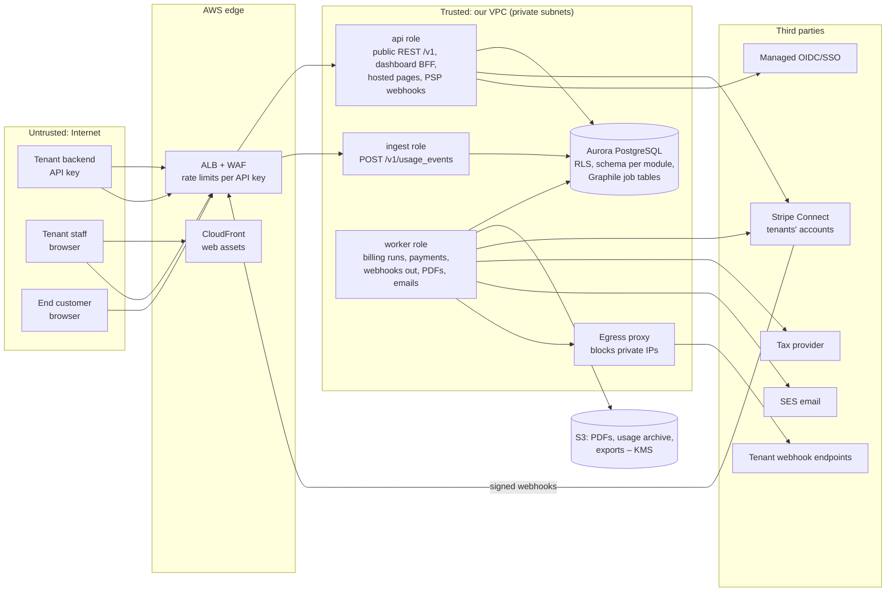
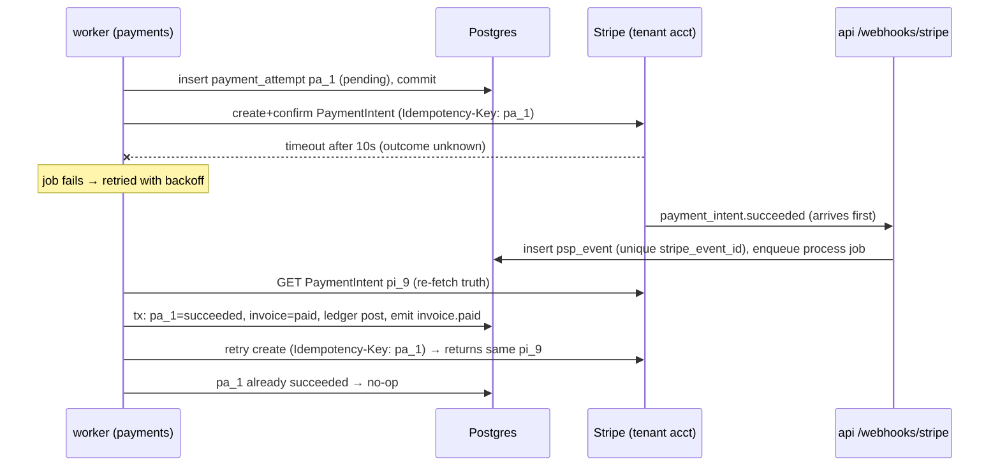

# Architecture and Build Plan: Multi-Tenant SaaS Billing Platform

> **How to read this.** The workspace is empty (its `README.md` says there is no code, config or data), so this is a greenfield plan. You gave a one-line brief and asked me to go ahead, so I picked a default for every major gap and labelled each one **[A#]**. The biggest open choice is what "multi-tenant SaaS billing system" means. I read it as **a billing product that other businesses (tenants) use to bill their own customers**, like Chargebee, Orb or Lago. If you meant **billing for your own SaaS product**, my advice changes a lot. In that case, buy Stripe Billing, Chargebee or Orb, and build only the usage metering and entitlement glue (see Q1 at the end).

---

## 1. Summary

- **What:** A multi-tenant billing platform. Business customers (**tenants**) set up plans and prices, manage their own customers (**end customers**), send usage data, and get invoicing, payment collection, dunning and webhooks automatically. It is delivered as a public REST API plus a tenant dashboard.
- **Shape:** One codebase (a **modular monolith**) on AWS, run as three process roles: `api`, `ingest` and `worker`. It uses a single Aurora PostgreSQL database with row-level security for tenant isolation. A Postgres-backed job queue handles all asynchronous work. Payments go through **each tenant's own Stripe account via Stripe Connect Standard**.
- **Key decisions:**
  1. Tenants bring their own Stripe account. **We never hold funds**, which keeps us out of money-transmitter regulation and card-data (PCI) scope beyond SAQ A.
  2. A shared schema with a `tenant_id` column on every row, **enforced by Postgres RLS** and composite foreign keys, rather than a schema or database per tenant.
  3. The **pricing ("rating") engine is a pure, deterministic, versioned library**. Finalised invoices can't be changed, and each one stores the inputs it was calculated from. Corrections are made only with credit notes.
  4. **Postgres for everything at launch**: usage events (partitioned), the job queue, and the ledger. Kafka and ClickHouse come in only when measured limits say so.
  5. Money is stored as integer minor units (e.g. cents). Unit prices are fixed-point decimals. Rounding happens once per line item. Floats are banned in money code.
- **Milestone 1 (5–7 weeks):** One sandbox tenant, end to end and deployed to staging through CI. It creates a customer and a subscription with a flat price and a usage price, sends usage, advances a test clock, generates a numbered invoice, charges a Stripe test card on the tenant's connected account, gets the payment webhook, and sends a signed webhook to the tenant. M1 also includes four spikes: rating model, ingest throughput, Stripe Connect, and RLS with connection pooling.
- **Top risks:** errors in the pricing engine (proration, tiers, time zones); tenant data leaking through a missing tenant filter; payment state drifting out of sync with Stripe; the month-start invoice spike; no billing or accounting expertise on the team.

## 2. Context and Goals

- **Problem:** B2B SaaS companies need subscription and usage-based billing. Building it themselves goes wrong in costly ways: double charges, wrong proration, unauditable invoices. Today they use spreadsheets plus Stripe invoices, or a vendor that doesn't fit their pricing. [A1]
- **Goals:**
  - A tenant can model its real pricing: flat, per-seat, tiered (graduated or volume), package, and metered usage, with trials and mid-cycle changes.
  - Invoices are generated, numbered, taxed and collected automatically. Failed payments go through dunning (scheduled retries and reminders).
  - Every amount can be traced back to its inputs and reproduced.
  - Tenants are strictly isolated from each other.
- **Non-goals (v1):** acting as merchant of record or holding funds; our own tax engine; revenue recognition (ASC 606 / IFRS 15) beyond data exports; payment providers other than Stripe; multi-region or data residency per tenant; FX conversion (each customer is billed in one currency); quotes, CPQ and contract approval workflows; usage billing on annual periods (annual plans have flat fees only).
- **Success measures:** the first design-partner tenant collecting live payments; 100% of the design partner's last 3 months of invoices reproduced to the minor unit in shadow mode; zero double charges; under 1 support ticket per 1,000 invoices about a wrong amount; the month-start billing run done within its target (Section 3).

## 3. Drivers, Requirements, and Constraints

**Ranked quality attributes.** Where these conflict, the higher one wins. **Correctness beats availability**: a billing run pauses rather than issue an invoice that might be wrong. Ingest favours availability, because deduplication protects correctness downstream.

| # | Attribute | Measurable target | Why it matters |
|---|---|---|---|
| 1 | Financial correctness and integrity | 0 double charges. 100% of finalised invoices re-derivable from stored inputs. Ledger imbalance always 0. Shadow-billing match on 100% of partner invoices (or each difference explained). [A2] | A wrong bill is the worst failure possible: lost trust, refunds, legal exposure. |
| 2 | Tenant isolation | 0 cross-tenant reads or writes. Enforced in the database, not only in app code. The automated cross-tenant suite covers 100% of endpoints. | One leak of another company's customer and revenue data could end the business. |
| 3 | Auditability | Every financial state change records actor, request ID and before/after state. Finalised documents can't be changed. Financial records kept 10 years. [A3] | Tenants' auditors and accountants need it. Disputes need evidence. |
| 4 | Ingest and API availability and latency | 99.9% monthly. Ingest p99 under 200 ms for a batch of 100 or fewer events at a peak of 5,000 events/s. API p95 under 300 ms. Month-start run: 300k subscriptions drafted within 2 h of period end. [A4] | Usage that is lost or rejected is lost revenue for the tenant. Late invoices delay their cash. |
| 5 | Time to market | First design partner live in about 4–5 months. [A5] | Funding and runway, and learning from real pricing. |
| 6 | Evolvability | A new pricing model in 2 weeks or less. A new payment adapter in 6 weeks or less. | Pricing variety is the main competitive pressure. |
| — | Cost (ranked below the rest) | Infrastructure under about $6k/month at launch, staging plus prod. [A6] | It matters, but not more than anything above. |

**Key functional requirements that shape the structure:** a catalogue with versioned prices; subscription lifecycle (trial, active, past_due, cancelled) with mid-cycle changes and proration (charging or crediting for part of a period); usage ingest with idempotency keys; billing periods and anchors in the tenant's time zone; gapless invoice numbers per tenant; payment collection including 3-D Secure / SCA (strong customer authentication); dunning; signed outbound webhooks; sandbox (test) environments; hosted invoice and payment-update pages for end customers.

**Constraints [assumed]:** a team of 6 engineers (4 backend, 1 frontend, 1 platform) who are strong in TypeScript and Postgres but have no billing domain expert [A7]; AWS [A8]; one region; card data must never touch our systems; GDPR applies (we are a processor for tenants' end-customer data); tenants will ask for SOC 2.

**Hard parts:**

| ID | Hard part | Why |
|---|---|---|
| H1 | Pricing and proration correctness | Proration, tier boundaries, time zones, month lengths, currency exponents and rounding combine into many edge cases. Errors are invisible until a customer complains. |
| H2 | Usage metering | Deduplicating at 5k events/s; late events; deciding when a period's usage is final. Postgres partitioning limits how unique constraints work (Section 8). |
| H3 | Payment orchestration with Stripe Connect | Calls can time out with an unknown result. Webhooks arrive out of order. SCA, declines, and keeping our records in line with Stripe all add risk. |
| H4 | Tenant isolation under connection pooling | RLS depends on a tenant setting per transaction, and poolers can break that. A single missing filter is a breach. |
| H5 | Tax and invoice legal requirements | These depend on outside parties and differ by country: VAT, gapless numbering, required invoice fields. |
| H6 | Month-start spike | Most billing anchors fall on the 1st. A whole month of invoicing and payment work arrives within a few hours. |

## 4. Current State

The workspace (`w62ae9b71/`) holds only a `README.md` saying it is "intentionally empty". There is no code, infrastructure, CI or data to build on or follow. Everything below is a proposal:

- **Language and runtime:** TypeScript on Node 22 LTS [A7].
- **Libraries:** Fastify with TypeBox (HTTP and OpenAPI); Kysely (typed SQL); `dbmate` (plain SQL migrations); Graphile Worker (Postgres job queue); `decimal.js`; Vitest, fast-check and Testcontainers for tests; k6 for load tests.
- **Platform:** Terraform; GitHub Actions; AWS (ECS Fargate, Aurora PostgreSQL 16, S3, KMS, Secrets Manager, SES, ALB with WAF).
- **Observability:** OpenTelemetry, exporting to Grafana Cloud [A9].

If your organisation already has a standard stack, use it. Nothing in this architecture depends on Node specifically.

Proposed repository layout (module folders and Postgres schemas share the same names):

```
src/entrypoints/{api.ts, ingest.ts, worker.ts}
src/platform/{db, tenancy, clock, money, jobs, http, telemetry, errors}
src/modules/{identity, catalog, customers, subscriptions, metering, rating,
             invoicing, tax, payments, ledger, events}/   # each exposes only index.ts
db/migrations/
test/{scenarios, golden/rating, isolation, load}
infra/terraform/{bootstrap, modules, envs/staging, envs/prod}
web/                      # dashboard + hosted pages (from M2)
.github/workflows/
```

## 5. Assumptions and Open Questions

**Assumptions**

| ID | Assumption | Impact if wrong | How and when validated |
|---|---|---|---|
| A1 | We're building a billing product for other businesses, not billing for our own SaaS | Most of the plan becomes a buy decision (Q1) | Answer Q1 before M1 starts |
| A2 | A design partner will share pricing and 3 months of past invoices | No real correctness check before launch | Signed data-sharing agreement by M1 week 2 |
| A3 | 10-year financial record retention covers target markets | Shorter: storage savings. Longer: archive changes | Accounting/legal advisor, M2 |
| A4 | Year 1: 200 tenants, 500k end customers, 10M usage events/day (5k/s peak), about 300k invoices on the 1st | Above roughly 50M events/day, Postgres ingest needs Kafka/ClickHouse (D4) | Spike S2 (M1); review with sales pipeline, M2 |
| A5 | First partner live in about 20 weeks; no hard external deadline | A fixed date means cutting M2 scope (dashboard, credit notes UI) | Ask stakeholders, week 1 |
| A6 | Infrastructure budget about $6k/month at launch | Lower: smaller Aurora, drop reader | Finance check, M1 |
| A7 | 6 engineers, TypeScript/Postgres skills, no billing domain expert | Other language: swap the stack. No expert: risk R5 grows | Week 1 |
| A8 | AWS, one region (us-east-1 unless EU residency is required) | EU-only partner: use eu-central-1. Must be decided before infra task T2 | Q3, week 1 |
| A9 | Grafana Cloud for observability, unless there is an org standard | Swap the exporter target (easy) | Week 1 |
| A10 | Tenants use, or will accept, Stripe as their payment provider | Tenants on Adyen or Braintree can't onboard in v1 | Design-partner and pipeline survey, M1 |
| A11 | Prorations go on the next invoice by default (not invoiced immediately) | Partners needing immediate invoices: add the option in M2 | Design partner review of S1 output |

**Open questions** (owner, default if no answer, deadline)

| ID | Question | Owner | Default | Needed by |
|---|---|---|---|---|
| Q1 | Billing product for other businesses, or billing for our own SaaS? | Product lead | Product for other businesses | Before M1 |
| Q2 | Must we support tenants who don't use Stripe at launch? | Product/sales | No | M1 week 2 |
| Q3 | Any launch tenant needing EU data residency? | Sales/legal | No, use us-east-1 | M1 week 1 (blocks T2) |
| Q4 | Is it acceptable that platform fees are invoiced to tenants separately, with no cut taken from their payments? | Founders | Yes (fits Connect Standard) | M1 week 2 |
| Q5 | Will SOC 2 Type II be required by the first paying tenants? | Sales | Type I within 6 months of GA | M3 |
| Q6 | Which tax provider (Stripe Tax vs Anrok vs Avalara)? | Eng + finance | Stripe Tax (same vendor, works with Connect, to be verified in M3) | M2 end |

## 6. Architecture Overview



**How it fits together.** Tenants call the `api` role for catalogue, customer, subscription and invoice operations. They call the `ingest` role for usage. Both roles are the same container image, started with a different `PROCESS_ROLE`. They are split so that a usage flood can't starve the dashboard or the API, and so each can scale and use database connections on its own terms (driver 4). Every request runs inside a database transaction that sets `app.tenant_id`, and RLS enforces it.

State changes that need follow-up work (charge this invoice, send this webhook) enqueue a Graphile Worker job **in the same transaction**. The job table therefore doubles as a transactional outbox: no extra queue is needed and no event can be lost. The `worker` role runs scheduled billing runs and talks to Stripe, the tax provider, email and tenant webhook endpoints. Every external call goes through an adapter interface with timeouts.

**Component table**

| Component (module) | Responsibility | Owns data (Postgres schema) | Exposes | Technology | Key dependencies |
|---|---|---|---|---|---|
| `identity` | Tenants, sandbox links, staff users, API keys, tenant context, audit log | `identity.*` | Key auth middleware; `/v1/api_keys` | Fastify, OIDC provider (M2) | — |
| `catalog` | Products, prices (immutable versions), meters | `catalog.*` | `/v1/products`, `/v1/prices`, `/v1/meters` | — | `identity` |
| `customers` | End customers, billing details, payment method references (Stripe IDs only) | `customers.*` | `/v1/customers` | — | `payments` (setup) |
| `subscriptions` | Lifecycle, items, phase changes, period schedule, trials | `subscriptions.*` | `/v1/subscriptions` | — | `catalog`, `customers` |
| `metering` | Usage ingest, deduplication, aggregation per period, archive | `metering.*` | `POST /v1/usage_events`; in-process `aggregate()` | Partitioned tables | `catalog` |
| `rating` | Pure function: subscription state + prices + usage + period → line items | none (stateless) | In-process `rate()` | `decimal.js` | none (no I/O) |
| `invoicing` | Billing run scheduler, draft and finalise, numbering, credit notes, PDFs | `invoicing.*` | `/v1/invoices`, `/v1/credit_notes` | Graphile cron, PDF library | `rating`, `metering`, `tax`, `ledger`, `payments` |
| `tax` | Tax quotes and commits behind `TaxProvider` | `tax.*` (quote cache) | In-process | Manual-rate adapter; Stripe Tax adapter (M3) | Tax provider |
| `payments` | Stripe Connect onboarding, payment attempts, inbound PSP webhooks, dunning, reconciliation | `payments.*` | `/v1/payment_intents` (read), `/webhooks/stripe` | Stripe SDK | Stripe |
| `ledger` | Append-only double-entry postings: AR, customer credit balance | `ledger.*` | In-process `post()`; `/v1/customers/:id/balance` | — | — |
| `events` | Tenant-visible event log, outbound signed webhooks, emails | `events.*` | `/v1/events`, `/v1/webhook_endpoints` | Graphile jobs, SES | Egress proxy |
| `web` | Tenant dashboard; hosted invoice and payment-method pages | — | Browser UI | React + Vite, Stripe Elements | `api` |

Boundary rules: a module imports only another module's `index.ts`, enforced in CI with `dependency-cruiser`. A module reads and writes only its own Postgres schema. Data from other modules goes through the owning module's function. Each table has exactly one writer.

## 7. Component Details

**`identity`.** It resolves an API key to `(tenant_id, key_scope)`. Key scopes are `secret`, `ingest_only` and `publishable`. Keys are random 32-byte values with a visible prefix (`sk_live_`, `sk_test_`). Only the SHA-256 hash is stored, and the key is shown once. A **sandbox is its own tenant row** (`mode='sandbox'`, `parent_tenant_id`), so test data gets the same isolation as live data with no extra logic. Sandbox tenants also have a `frozen_now` test clock that the scheduler and rating engine respect. This module does not do authorisation inside other modules beyond tenant scope plus key scope. Staff roles (`owner`, `admin`, `finance`, `read_only`) arrive in M2.

**`metering`.** `POST /v1/usage_events` accepts batches of up to 500 events. Each event has `idempotency_key`, `customer` (the tenant's external ID), `meter`, `timestamp` and `value`. The response is `200` with a status per event: `accepted`, `duplicate` or `rejected:<code>`. Events are rejected if the timestamp is more than 5 minutes in the future or older than 35 days; 35 days is the deduplication window, so dedupe guarantees hold for every accepted event. Events for an already-finalised period return `period_closed` in M1–M2, and are billed on the next invoice from M3 (D10). Supported aggregations are `sum`, `count`, `max` and `last`. `unique_count` is deferred. This module does not price usage.

- *Failure:* if the database is unavailable, ingest returns `503` with `Retry-After`. Tenants retry with the same keys, and dedupe absorbs repeats.
- *Scaling:* the `ingest` service scales on CPU and p99 latency. The default per-tenant rate limit is 1,000 events/s, set at the WAF with a custom key on the API-key header.

**`rating` (H1).** Pure TypeScript, with no clock, database or network access. Input: subscription phases in the period, price versions, usage aggregates, the tenant time zone, and currency. Output: line items, each with `quantity`, `unit_amount_decimal`, `amount` (minor units), `period` and a `proration` flag. It is versioned (`RATING_ENGINE_VERSION`), and every invoice stores the version used. Rule: **round once per line item, half-up, to the currency's exponent** (JPY 0, USD 2, KWD 3). Proration is by seconds over the period length in the tenant's time zone. A change and its reversal at the same instant must net to exactly zero; a property test checks this. It is the most heavily tested module (Section 14).

**`invoicing`.**

- A **scheduler** job runs every minute. It selects subscriptions whose `current_period_end` is at or before `now(tenant)`, in pages of 1,000, and enqueues `invoice.draft` with the job key `sub:{id}:{period_start}`, which stops duplicate enqueues.
- **Draft step:** creates the draft invoice and advances the subscription period.
- **Finalise step:** runs after the grace window (default 1 h, tenant setting 0–72 h). It re-aggregates usage, re-rates, gets tax, assigns the number, posts to the ledger and enqueues payment.
- **Numbering:** gapless per tenant, from a row in `invoicing.number_sequences` locked `FOR UPDATE` inside the finalise transaction. A rollback releases the number, so there are no gaps.
- Finalised invoices and their lines can't be updated: a database trigger rejects updates, and the app role has no `UPDATE` on `invoice_lines`. Corrections are credit notes.
- PDFs are rendered asynchronously with a code-level PDF library (no headless browser) and stored in S3.
- *Failure:* a job crash rolls back its transaction and the job retries. The unique key `(tenant_id, subscription_id, period_start)` on invoices makes the retry a no-op once the draft exists.
- *Scaling:* per-tenant job concurrency is capped at 8 by default, so one large tenant can't fill the queue on the 1st.

**`payments` (H3).**

- **Onboarding:** Stripe Connect Standard OAuth. We store only `stripe_account_id`, and make all calls with the platform key plus the `Stripe-Account` header, so there are no per-tenant secrets.
- **Charging:** each charge is a `payment_attempts` row created first. Its ID becomes the Stripe `Idempotency-Key` for an off-session confirmed PaymentIntent. Timeout is 10 s. Retries reuse the same key.
- **Inbound webhooks:** signatures are verified. The event is stored in `payments.psp_events` with `ON CONFLICT (stripe_event_id) DO NOTHING`, then processed in a job that **re-fetches the PaymentIntent from Stripe** rather than trusting arrival order. Transitions follow a forward-only state machine.
- **Dunning:** by default, retries on days 3, 5 and 7, then the subscription goes to `past_due`, then `cancelled` or `unpaid` per tenant policy. `requires_action` (SCA) emails the end customer a hosted-page link.
- **Reconciliation (M3):** a daily job compares our succeeded payments and refunds against Stripe balance transactions for each connected account, and alerts on any mismatch.
- **Circuit breaker:** after 50% errors over 2 minutes, payment jobs pause with backoff. Invoices stay `open`, and ingest and the API are unaffected.

**`ledger`.** Append-only `journal_entries` and `postings`. A deferred constraint trigger checks that each entry's postings sum to 0. Accounts per tenant and customer: `accounts_receivable`, `customer_credit`, `billed_revenue`, `tax_payable`, `psp_clearing`. Examples:

- Invoice finalised: debit AR total; credit billed_revenue subtotal; credit tax_payable tax.
- Payment succeeded: debit psp_clearing; credit AR.
- Credit note: debit billed_revenue; credit AR or customer_credit.

It is not a general ledger and does no revenue recognition.

**`events`.** Every domain event is written to `events.events` (kept 30 days and readable via the API) and a delivery job is enqueued in the same transaction. Deliveries are signed with `Billing-Signature: t=<ts>,v1=HMAC-SHA256(secret, "<ts>.<body>")` and are at-least-once; each event ID is stable so tenants can dedupe. Backoff is exponential over up to 3 days (about 16 attempts). An endpoint is disabled automatically after 3 days of failures, and the tenant gets an email. All outbound HTTP goes through an egress proxy that blocks RFC 1918, link-local and metadata addresses (SSRF protection).

**`tax`.** The `TaxProvider` interface has `quote(invoiceDraft)` and `commit(invoiceId)`, idempotent by invoice ID and version. M1 uses a manual adapter with tenant-configured flat rates. M3 adds the Stripe Tax adapter (Q6). Tax calls happen **outside** database transactions, and results are written afterwards.

**`catalog`, `customers`, `subscriptions`.** Standard CRUD with business rules. A price version can't be changed once any subscription references it; changes create a new version. Routine otherwise.

## 8. Data Design

**Main entities** (every table has `tenant_id`; owning module in brackets):

```
Tenant 1─* ApiKey, StaffUser                                 [identity]
Tenant 1─* Product 1─* Price(version) ; Meter                [catalog]
Tenant 1─* Customer 1─* PaymentMethodRef                     [customers]
Customer 1─* Subscription 1─* SubscriptionItem ─> Price      [subscriptions]
           Subscription 1─* SubscriptionPhase (changes over time)
Customer 1─* UsageEvent ─> Meter ; UsageDedupeKey            [metering]
Subscription 1─* Invoice 1─* InvoiceLine ; Invoice 1─1 UsageSnapshot  [invoicing]
Invoice 1─* CreditNote ; NumberSequence                      [invoicing]
Invoice 1─* PaymentAttempt ; PspEvent                        [payments]
JournalEntry 1─* Posting ─> LedgerAccount                    [ledger]
Event 1─* WebhookDelivery ─> WebhookEndpoint                 [events]
AuditLog                                                     [identity]
```

**Integrity mechanisms**

- Composite primary keys or unique keys of the form `(tenant_id, id)`.
- All foreign keys include `tenant_id`, e.g. `FOREIGN KEY (tenant_id, customer_id) REFERENCES customers.customers(tenant_id, id)`. A cross-tenant reference is impossible even with a bug.
- IDs are prefixed ULIDs (`cus_…`, `in_…`), so they sort by time and are safe to show to tenants.

**Consistency.** These operations must each happen in a single transaction:

- Finalise invoice: status, number, lines, ledger entry, payment job enqueue, event.
- Apply payment success: attempt status, invoice paid, ledger entry, event.
- Subscription change: phase close or open, proration lines, event.

No transaction spans an external call. External calls use the pattern: create an intent row → commit → call with an idempotency key → write the result. Reads for dashboards can lag (a reader replica is acceptable in M3+). Financial writes always go to the writer.

**Usage storage (H2).**

- `metering.usage_events` is range-partitioned **daily on `event_time`**, with index `(tenant_id, customer_id, meter_id, event_time)`.
- Postgres requires the partition key in every unique index on a partitioned table, so dedupe can't live on the events table. It uses a separate `metering.usage_dedupe_keys(tenant_id, idempotency_key, received_at)` table, hash-partitioned by `tenant_id` (16 partitions) with `PRIMARY KEY (tenant_id, idempotency_key)`. Rows older than 35 days are pruned nightly.
- Ingest inserts the key row with `ON CONFLICT DO NOTHING RETURNING` and writes the event only for new keys, in the same transaction.
- At finalisation, aggregates are frozen into `invoicing.usage_snapshots` (per invoice, meter and value), so invoices never depend on raw events again.

**Access patterns.** Every index starts with `tenant_id`. The hot paths are:

- Due subscriptions: `(current_period_end) WHERE status IN (...)`
- Invoices by customer: `(tenant_id, customer_id, created_at DESC)`
- Usage aggregation: the index above
- Job claims: Graphile's own indexes

**Retention, backup, restore**

| Data | Hot | Archive | Notes |
|---|---|---|---|
| Invoices, credit notes, ledger, payments, audit log | 10 years [A3] | — | Can't be changed |
| Raw usage events | 95 days in Postgres (covers quarterly periods plus the 35-day late window) | Daily Parquet export to S3 Standard-IA for 7 years, then dropped | Partitions dropped after the export is verified |
| Dedupe keys | 35 days | — | |
| Events / webhook deliveries | 30 days | — | |

- Aurora: Multi-AZ, continuous backup with **35-day point-in-time recovery (PITR)**. Target RPO 1 minute or less, RTO 1 hour or less for a regional-AZ failure (failover takes about 30 s).
- A restore drill into an isolated account happens in M3, then quarterly.
- S3 has versioning and Object Lock (governance mode) on the invoice PDF and archive buckets.

**Classification and protection**

- Payment card data: never stored (Stripe Elements on hosted pages; SAQ A).
- PII (end-customer name, email, address, tax ID): encrypted at rest with Aurora KMS, redacted in logs by a log serialiser allow-list, and visible only to the owning tenant.
- Secrets (Stripe platform key, webhook signing secrets): Secrets Manager. Tenant webhook secrets are encrypted at the application layer with a KMS data key.
- **GDPR erasure:** customer PII is pseudonymised, but finalised invoices keep their legally required **snapshot** of billing details. Invoices copy name, address and tax ID at finalisation, which is also why erasure doesn't change them.

**Schema evolution.** `dbmate` SQL migrations in `db/migrations/`, run by CI as a one-off ECS task before deploy. Rules:

- Expand, then contract: add the column, deploy code that writes both, backfill in batched jobs, switch reads, then drop in a later release.
- No locking DDL on hot tables. Use `CREATE INDEX CONCURRENTLY`, and set `lock_timeout = 5s` in migrations.
- New usage partitions are created 14 days ahead by a cron job. An alert fires if fewer than 7 future partitions exist.

## 9. Key Flows

**Flow 1: Usage ingest, including a duplicate after timeout**

1. The tenant sends `POST /v1/usage_events` with 100 events, using an `ingest_only` key.
2. `ingest` hashes the key, finds the tenant, opens a transaction, and runs `set_config('app.tenant_id', $1, true)`.
3. It validates the schema, timestamp window, meter existence, and customer existence (one batched lookup).
4. It inserts dedupe keys with `ON CONFLICT DO NOTHING RETURNING idempotency_key`, then inserts events for the returned keys only. Commit.
5. It returns per-event statuses.
6. **Failure path:** the tenant's client times out after step 4 committed and resends the same batch. Step 4 returns no new keys, so all 100 events report `duplicate` and nothing is double counted. If the database is down, the response is `503`, and the client's retry later succeeds without duplicates.

**Flow 2: Period-end billing run**

1. The scheduler (every minute, a Graphile cron job) finds subscription S with `current_period_end = 2026-11-01T00:00 Europe/Berlin` and enqueues `invoice.draft` with key `sub:S:2026-10-01`.
2. The worker locks S (`FOR UPDATE`). If an invoice for `(S, 2026-10-01)` already exists, it exits. Otherwise it creates a draft (lines from `rating.rate()` using current aggregates), advances S to the next period, schedules `invoice.finalize` at period end plus grace, and emits `invoice.created`. Commit.
3. At `finalize` time (no DB transaction open), it re-aggregates usage, re-rates, and calls `tax.quote()` (idempotent by invoice ID and version).
4. In one transaction it locks the draft, writes the final lines, the usage snapshot, the tax lines and the rating engine version; locks `number_sequences` and assigns `INV-000123`; sets status `open`; posts to the ledger; enqueues `payment.attempt`; and emits `invoice.finalized`.
5. **Failure path:** the worker is killed between steps 3 and 4. The transaction never committed, so there is no number gap and no ledger entry. Graphile retries the job after its lease expires, and step 3 repeats safely because tax quotes are idempotent.
6. **Failure path:** the tax provider is down. `finalize` retries with backoff for up to 24 h, then the invoice is held in `draft` with an alert and a dashboard banner. **The system never finalises without tax** (driver 1 over driver 4).

**Flow 3: Payment collection, including timeout and out-of-order webhook**



- Declines are recorded with Stripe's `decline_code`, and the next dunning attempt is scheduled.
- `requires_action` sends an email with the hosted-page link. The end customer completes 3-D Secure, and the webhook then completes the flow.
- A duplicate webhook delivery hits the unique `stripe_event_id` and is dropped.

**Flow 4: Mid-cycle upgrade with proration (A11)**

1. `POST /v1/subscriptions/S` with a new price, `proration=next_invoice`.
2. In one transaction: close the current phase at `now(tenant)`, open a new phase, and call `rating.prorate()` to produce a credit line for the unused old plan and a charge line for the remaining new plan. These are stored as `pending_invoice_items`. Emit `subscription.updated`.
3. The next invoice draft (Flow 2) includes the pending items. A same-instant upgrade followed by a downgrade nets to 0, which the property tests check.

## 10. Key Decisions

| # | Decision | Options considered | Rationale (drivers) | Reversibility | Revisit if |
|---|---|---|---|---|---|
| D1 | Tenants connect their **own Stripe account (Connect Standard)**. We never hold funds. | (a) Connect Standard; (b) Connect Express/Custom as payment facilitator; (c) support several payment providers from day one | (a) avoids money-transmitter and KYC obligations and keeps PCI at SAQ A (security, time to market). Tenants keep their existing Stripe customers and payment methods, which makes migration much easier. (b) earns payment revenue but adds months of compliance. (c) costs a lot before demand exists. | Hard (contracts, data model) | More than 30% of pipeline needs non-Stripe providers, or the business wants payment revenue |
| D2 | **Shared schema with `tenant_id` + RLS + tenant-scoped composite foreign keys** | (a) Shared + RLS; (b) schema per tenant; (c) database per tenant | (a) gives isolation in the database (driver 2) while keeping one migration path and low cost for 200+ tenants. (b) and (c) multiply migrations and connections. Every query is tenant-scoped, so tenants can later be moved to dedicated "cells". | Hard | An enterprise tenant contractually requires physical isolation; then offer a dedicated cell on the same schema |
| D3 | **Modular monolith, 3 process roles** | (a) Monolith with roles; (b) microservices per domain | 6 engineers. Correctness depends on transactions across invoice, ledger and payment state, which (b) would turn into distributed sagas. The roles split only where load shape differs (ingest). | Medium (module boundaries make later extraction possible) | Teams grow past about 3 squads, or ingest needs a different runtime |
| D4 | **Postgres for usage events and jobs** (Graphile Worker) | (a) Postgres; (b) Kinesis/Kafka + ClickHouse; (c) SQS for jobs | (a) enqueues jobs in the same transaction (no lost events, driver 1) and adds no new technology (time to market). Spike S2 checks the 5k/s target. | Medium (behind `metering` and `jobs` interfaces) | Sustained ingest above roughly 3k/s, about 50M events/day, a tenant above 5k/s, or ingest taking more than 40% of DB CPU |
| D5 | **Pure versioned rating engine; finalised invoices can't be changed and store their inputs** | (a) Pure library + snapshots; (b) pricing logic spread through services; (c) third-party pricing engine | (a) can be exhaustively tested and replayed (drivers 1 and 3). Changes to the engine never alter past invoices. | Hard (invoice data model) | — |
| D6 | **Money as `bigint` minor units + `numeric(38,12)` unit prices; half-up rounding per line** | Floats (rejected); decimals everywhere; round per invoice | Exact arithmetic. Per-line rounding is what tenants can check by hand. Floats are banned by a lint rule. | Hard for stored data; rounding mode medium | Design-partner invoices show a different rounding convention |
| D7 | **Sandbox = separate tenant row** | (a) Separate tenant; (b) `livemode` column on every row | (a) reuses RLS isolation with no risk of test data mixing into live data, and enables test clocks. | Medium | Tenants want to copy configuration from sandbox to live in bulk (build a copy tool; the model stays) |
| D8 | **REST `/v1` with Idempotency-Key on all POSTs; only additive changes; at-least-once signed webhooks** | (a) REST + OpenAPI; (b) GraphQL; (c) gRPC | Tenants integrate from any stack. Idempotency is a must for billing. OpenAPI is generated from TypeBox schemas. | Hard (public contract) | A breaking change is needed: introduce date-pinned versions per tenant |
| D9 | **Gapless invoice numbers per tenant, assigned at finalisation under a row lock** | Lock-based gapless; DB sequence (has gaps) | Several countries' VAT rules expect continuous numbering. Contention is limited to one tenant's finalisations. | Medium | One tenant's finalisation throughput is below target in the M3 load test: allow multiple prefixes (series) per tenant |
| D10 | **Late usage:** reject after finalisation in M1–M2; in M3, bill on the next invoice as a "prior-period usage" line priced at the original period's price version | Reject; reopen invoice (rejected because invoices can't change); next-invoice adjustment | Keeps invoices unchangeable while not losing tenant revenue. | Easy | Partners need late events beyond 35 days |
| D11 | **Build the billing core; buy tax, payments, identity provider and email** | Build on open-source Lago; build everything | Billing logic is the product (if A1 holds). Tax and payments are regulated, so we don't build them. | Medium | Q1 says billing is for our own product: buy the billing core |
| D12 | **TypeScript/Node 22, AWS ECS Fargate, Aurora PostgreSQL 16, Terraform** | Kubernetes (EKS); RDS Postgres; Go/JVM | Matches assumed skills (A7). Fargate avoids running a cluster. Aurora fails over faster and grows storage for usage data. | Hard (language); medium (compute) | Team skills differ (A7), or the org mandates a platform |

## 11. Cross-Cutting Concerns

**Security** (built from M1; external pen test in M3)

- *Identity:* API keys (hashed, scoped, rotatable with a 24 h overlap) for machine access. Managed OIDC with SAML SSO for dashboard staff (M2; WorkOS assumed). Hosted end-customer pages use signed, expiring URLs (HMAC, 7 days).
- *Authorisation:* tenant scope via RLS on every table. The app's database role is not the table owner and has no `BYPASSRLS`. Migrations run as a separate owner role. Key scope and staff role are checked in the route layer (M2). Support access to a tenant is time-boxed, requires a ticket ID, and is written to the audit log.
- *Main threats and mitigations:*

  | Threat | Mitigation |
  |---|---|
  | Cross-tenant data access (missing filter, IDOR) | RLS, composite foreign keys, and an auto-generated isolation suite that calls every route with tenant B's key against tenant A's IDs (T8). |
  | Leaked API key | Hashing, prefixes for secret scanning, `ingest_only` scope, rotation, alert on use from new IP ranges (M3). |
  | Forged inbound webhooks / replayed outbound webhooks | Stripe signature verification. Our signatures include a timestamp; tenants are told to reject anything older than 5 minutes. |
  | SSRF through tenant webhook URLs | Egress proxy blocking private and metadata ranges; https only. |
  | Tampering with financial records (insider or bug) | Append-only ledger and invoices enforced by database grants and triggers; audit log; prod database access only through break-glass with an alert. |

- *Supply chain:* Dependabot, `npm audit`, and Trivy image scanning in CI. High or critical findings block release.

**Reliability.** 99.9% for `api` and `ingest`. Billing runs have a lag SLO of p99 drafted within 2 h of period end. Measures:

- Multi-AZ everywhere, with at least 2 tasks per role.
- Timeouts: Stripe 10 s, tax 5 s, webhooks 10 s.
- Retries with full jitter, only on idempotent operations (all of ours are keyed).
- Graphile job leases, with poison jobs moved to a failed state after N attempts and shown on a dashboard with a re-queue command.
- Backpressure: per-tenant job concurrency caps; ingest returns `429` when over the tenant rate limit.
- Health checks: `/healthz/ready` checks the DB connection and RLS setting. `worker` liveness checks that a job was claimed within 60 s.

**Observability** (basic in M1, full in M3)

- OpenTelemetry traces and metrics. Structured JSON logs with `request_id`, `tenant_id` and `job_id`; PII fields are redacted by an allow-list serialiser.
- *Alerts tied to user-facing symptoms* (each with a runbook in `docs/runbooks/`):
  - ingest 5xx above 1% for 5 min, or p99 above 500 ms
  - API 5xx above 1%
  - any subscription past period end plus grace plus 2 h without a finalised invoice
  - ledger imbalance count above 0 (page immediately)
  - reconciliation mismatch above 0
  - payment-attempt error rate (excluding declines) above 5%
  - webhook backlog per tenant above 10k or oldest pending over 1 h
  - fewer than 7 future usage partitions
- **Business invariant checks** run every 15 minutes as SQL jobs: invoice total equals lines plus tax; each paid invoice has exactly one succeeded attempt; journal entries sum to zero.

**Performance and capacity**

- Expected load (A4): 5k events/s ingest peak; about 50 API req/s average; 300k drafts plus finalisations on the 1st (about 42/s each over 2 h); about 1M webhooks/day.
- Expected bottlenecks: Aurora write IOPS (ingest), dedupe index size, the numbering lock for a large tenant, and Stripe rate limits for each connected account.
- Verified by S2 (M1) and k6 load tests in M3 (Section 14).

**Cost.** About $3–5k/month at launch [A6]:

- Aurora r7g.xlarge writer plus a failover reader: roughly $1.2k, plus $0.3–0.8k for storage and I/O
- Fargate: $0.4–0.9k
- ALB, WAF and NAT: $0.2–0.4k
- S3, SES, KMS and Secrets Manager: under $0.2k
- Observability: $0.5–1.5k
- Staging: about $0.7k

Stripe processing fees fall on tenants' own accounts. Tax-provider fees per transaction must be checked under Connect (Q6). Controls: cost-allocation tags (`env`, `component`), AWS Budgets alerts at 80% and 100%, and log sampling for successful ingest requests.

**Operations**

- The core team owns the system. Paging on-call for symptom alerts runs from M3, a weekly rotation across 6 engineers. There is an explicit **"billing day" watch** on the 1st of each month: one engineer actively monitors the run.
- Support tooling (M2–M3): an internal read-only admin view, scoped by tenant and audited, plus runbooks for re-queueing failed jobs, voiding and reissuing via credit note, disabling a tenant's webhooks, and pausing a tenant's billing runs (a per-tenant kill switch).

**AI-specific concerns.** Not applicable. There are no AI components in scope.

## 12. Build Sequence

Team assumption: 6 engineers as in A7. Sizes are rough ranges, not commitments.

| Milestone | Goal | Scope (in / out) | Deliverables | Exit criteria | Dependencies | Size |
|---|---|---|---|---|---|---|
| **M1 – First end-to-end slice + spikes** | Prove the end-to-end path and clear H1–H4 | **In:** one sandbox tenant (seeded by script); flat and per-unit usage prices; customer, subscription, ingest, draft and finalise, manual tax rate, Stripe test charge, inbound webhook, outbound signed webhook; RLS; CI/CD to staging; basic telemetry. **Out:** dashboard, tiers, proration, dunning, ledger, PDFs | Deployed staging; spike reports S1–S4; OpenAPI v0 | Scenario test `test/scenarios/m1_happy_path` passes in CI against staging. Isolation suite green. Spike results recorded and plan updated. Deploy and rollback each run once in staging. | Stripe Connect platform account (long lead, day 1); Q1 and Q3 answered | 5–7 weeks |
| **M2 – Billing breadth + shadow billing** | Model the design partner's real pricing correctly | **In:** tiered, volume and package pricing; price versions; trials; proration (D10/A11); credit notes; ledger; dunning v1; SCA hosted page; webhook retries and auto-disable; staff SSO and roles; dashboard v1 (customers, subscriptions, invoices, settings); shadow-billing import and comparison tool. **Out:** tax provider, PDFs, live charges | Dashboard; credit notes; ledger; shadow report | Partner's last 3 months of invoices reproduced, 100% matching or each difference explained and signed off. Ledger invariants hold over 13 simulated months for 10k subscriptions. | M1; partner data (A2) | 6–8 weeks |
| **M3 – Production readiness + first live tenant** | Safe to take real money | **In:** Stripe Tax adapter; PDFs and emails; late usage (D10); reconciliation; load tests; restore drill; pen test; audit-log review; runbooks; on-call; production environment; per-tenant kill switch. **Out:** self-serve signup | Prod environment; partner live | Load targets met (Section 14). Restore drill under 1 h. No high or critical pen-test findings open. Partner completes one full live cycle with a 0-difference reconciliation. | M2; pen-test vendor booked in M1 | 5–7 weeks |
| **M4 – GA hardening** | Onboard tenants 2–10 without engineers | Self-serve signup and Connect onboarding; CSV and data exports; usage dashboard (hourly rollups); API reference docs; SOC 2 controls evidence | GA | 5 tenants live; onboarding under 1 day without engineering help | M3 | 4–6 weeks |

**Critical path:** Stripe Connect platform approval → S3 → payments adapter (T14) → M1 end-to-end scenario → M2 shadow billing (needs partner data) → M3 live cycle. Request Stripe access, partner data and the pen-test booking on **day 1**.

**Parallel lanes in M1:** platform (T1–T4), data and tenancy (T5–T8, S4), domain and rating (S1, T9–T12), metering (S2, T13), payments (S3, T14–T15), events (T16).

## 13. First Milestone Task Breakdown

Order: T1, T5 and the spikes start in week 1. The rest follow the dependencies noted. "∥" means it can run in parallel with the previous task.

**Spikes (weeks 1–2)**

- **S1 – Rating model spike** (`src/modules/rating/`, 4 days).
  - *Question:* can one line-item model and `rate()` signature express flat, per-seat, graduated, volume, package and usage pricing, plus proration across a time-zone month boundary, at minor-unit accuracy?
  - *Build:* a pure function plus 30 YAML golden cases in `test/golden/rating/`, including 5 from the partner's real pricing.
  - *Changes the plan if:* proration or tiers need state the pure model can't carry. Then redesign the `SubscriptionPhase` model before T11.
- **S2 – Ingest throughput spike** (`test/load/ingest.js`, `db/migrations/` draft, 3 days). ∥
  - *Question:* on Aurora r7g.xlarge, does the dedupe-table plus daily-partition design sustain 5k events/s (batches of 100) at p99 under 200 ms with under 40% writer CPU? Does aggregating one customer's 1M events in a month take under 200 ms?
  - *Changes the plan if:* the limit is below 3k/s. Then move ingest to Kinesis feeding a batch loader, and reconsider ClickHouse (D4) before T13.
- **S3 – Stripe Connect spike** (`spikes/stripe-connect/`, 3 days). ∥
  - *Question:* do OAuth connect, saving a payment method on a connected account, off-session confirmed PaymentIntents, SCA `requires_action`, connected-account webhooks, and idempotent retry after a forced timeout all behave as Flow 3 assumes?
  - *Changes the plan if:* the webhook or idempotency behaviour differs. Then adjust the `payments` state machine. If Standard accounts block anything needed, re-evaluate Express (D1).
- **S4 – RLS and pooling spike** (`src/platform/tenancy/`, 2 days). ∥
  - *Question:* does `set_config('app.tenant_id', $1, true)` within transactions isolate correctly under Kysely's pool and under RDS Proxy, and what does RLS cost on the usage aggregation query?
  - *Changes the plan if:* RDS Proxy pins sessions. Then use app-side pools only, with a connection budget per role.

**Foundation tasks**

- **T1 – Create the repo skeleton** with the Section 4 layout, `tsconfig`, ESLint (including a `no-float-money` rule that bans `number` for `amount*` fields) and a `dependency-cruiser` config enforcing `modules/*/index.ts` imports. *Done when* `npm test` and `npm run lint` pass in GitHub Actions and a deliberate cross-module deep import fails CI.
- **T2 – Write Terraform** in `infra/terraform/`: remote state in S3 with DynamoDB locking; separate AWS accounts for staging and prod; VPC with private subnets; Aurora PG16 Multi-AZ (staging: one instance); ECS cluster with `api`, `ingest` and `worker` services; ALB with WAF rate rule keyed on the `Authorization` header; Secrets Manager entries; KMS keys; egress proxy (Squid or AWS Network Firewall). *Done when* `terraform plan` shows no changes after apply in staging, from a CI job. (Needs Q3.)
- **T3 – Add a deploy pipeline** in `.github/workflows/deploy.yml`: build one image, run `dbmate up` as a one-off ECS task, rolling deploy of 3 services, smoke test, and a `rollback` workflow that redeploys the previous image tag. *Done when* a deploy and a rollback each succeed in staging, with the run links recorded in the PR. (Needs T1, T2.)
- **T4 – Wire OpenTelemetry** in `src/platform/telemetry/`: traces, `http.server.duration`, a job duration metric, JSON logs with `request_id`/`tenant_id` and a redaction allow-list. Add 2 alerts: ingest 5xx above 1%, and job failures above 0 for 10 min. *Done when* a fault injected via `FAULT_INJECT=ingest_500` in staging fires the alert. ∥ T3
- **T5 – Create the base migrations** in `db/migrations/`: per-module schemas; the `app_rw` (no BYPASSRLS) and `migrator` roles; the `identity.tenants` and `identity.api_keys` tables; and a `tenant_isolation` RLS policy template applied to every tenant table. *Done when* migrations run on a clean Postgres in CI (Testcontainers) and `down` restores a clean state.
- **T6 – Implement the tenancy context** in `src/platform/tenancy/`: a `withTenantTx(tenantId, fn)` helper and Fastify auth middleware (hash the key, find tenant and scope). The data access layer refuses queries outside `withTenantTx`. *Done when* unit tests show a query without a tenant context throws, and an RLS test shows tenant A can't read tenant B's rows even with raw SQL as `app_rw`. (Needs T5 and the S4 result.)
- **T7 – Add the money and clock primitives** in `src/platform/money/` and `src/platform/clock/`: `Money` (bigint plus ISO 4217 exponent table), `Decimal` unit prices, `roundHalfUp(currency)`, and a tenant-aware `Clock` (`now(tenant)` respecting `frozen_now`). *Done when* fast-check property tests pass (round-trips, no float use, correct JPY/KWD exponents). ∥
- **T8 – Build the cross-tenant isolation suite** in `test/isolation/`. It reads the generated OpenAPI spec and, for every route, creates resources as tenant A, then calls with tenant B's key and expects `404` (not `403`, so resources can't be discovered). *Done when* it runs in CI and fails on a deliberately unscoped test route. (Needs T6.)

**Domain slice tasks**

- **T9 – Implement `catalog`** (products, prices with `version` and an immutable-once-referenced trigger, meters) with `/v1/products`, `/v1/prices`, `/v1/meters`. *Done when* API tests show creating a price and that editing a referenced price returns `409 price_in_use`. (Needs T6.)
- **T10 – Implement `customers`** (`/v1/customers`, unique `(tenant_id, external_id)`) and a payment-method attach endpoint storing only a Stripe `pm_` ID. *Done when* API tests pass and an attach with a Stripe test PM succeeds in staging. (Needs T6, T14.)
- **T11 – Implement `subscriptions` (minimal)**: create with items, `current_period_start/end` computed in the tenant time zone, statuses `active` and `cancelled`. *Done when* tests cover anchors on the 31st and across DST in `Europe/Berlin` and `America/New_York`. (Needs T7, T9, S1.)
- **T12 – Productionise `rating.rate()` for flat and per-unit usage** from S1, with `RATING_ENGINE_VERSION`. *Done when* all M1-scope golden cases pass and code coverage of `src/modules/rating` is at least 95%. (Needs S1, T7.)
- **T13 – Implement `metering` ingest** (`src/entrypoints/ingest.ts`, `src/modules/metering/`): dedupe-table design from S2, per-event statuses, 35-day and +5-minute window, daily partition creation cron. *Done when* an integration test sending the same batch twice records exactly N events, and k6 against staging reaches 1k events/s at p99 under 200 ms (full 5k/s is verified in M3). (Needs S2, T6, T9, T10.)
- **T14 – Implement the `payments` Stripe adapter** (`src/modules/payments/stripe/`): Connect OAuth callback storing `stripe_account_id`; a `charge(attempt)` with idempotency key equal to the attempt ID and a 10 s timeout. *Done when* a staging test charges `pm_card_visa` on a connected test account, and a forced timeout then retry returns the same PaymentIntent. (Needs S3, T6.)
- **T15 – Implement the inbound Stripe webhook** at `/webhooks/stripe`: signature check, `psp_events` unique insert, and a processing job that re-fetches the PaymentIntent and applies a forward-only transition. *Done when* tests replaying the same event twice, and delivering a `succeeded` event before the charge response, both end with one paid invoice. (Needs T14, T17.)
- **T16 – Implement `events`**: `events.events`, `webhook_endpoints` with an encrypted secret, a signed delivery job through the egress proxy, and retries with backoff. *Done when* a staging webhook to a request-bin receives `invoice.finalized` with a valid signature, and a delivery to `http://169.254.169.254` is blocked and logged. ∥ (Needs T2, T6.)
- **T17 – Implement the `invoicing` billing run**: scheduler cron, `invoice.draft` and `invoice.finalize` jobs, the `number_sequences` lock, the update-blocking trigger on finalised invoices and lines, the manual tax adapter, and payment enqueue. *Done when* integration tests show (a) killing the worker mid-finalise and retrying produces one invoice with no number gap, and (b) two schedulers running at once produce one invoice per period. (Needs T11, T12, T13.)
- **T18 – Add the test clock and seed script**: `POST /v1/test_helpers/advance_clock` (sandbox tenants only) and `scripts/seed-sandbox.ts`. *Done when* a live-mode key gets `403` and a sandbox advance triggers the billing run within 1 minute. (Needs T7, T17.)
- **T19 – Write the M1 end-to-end scenario** `test/scenarios/m1_happy_path.test.ts`: seed → price → customer + PM → subscription → ingest 1,000 events (with 100 duplicates) → advance clock → invoice `INV-000001` with the correct usage amount → paid via Stripe → tenant webhook received. It runs in CI after every staging deploy. *Done when* it passes 5 runs in a row in staging, and the team demos it. (Needs everything above.)

## 14. Testing and Validation Strategy

| Risk | Test type | Where / when |
|---|---|---|
| H1 pricing | Golden YAML cases (aim for 200+ by M2); property tests (proration nets to zero, split periods add up to the whole, no negative totals without a credit, currency exponent handling); **shadow billing** against partner invoices | `test/golden/rating`; every CI run; shadow in M2 |
| Long-horizon correctness | Simulated-clock scenarios: 13 months × 10k subscriptions with random changes, checking ledger and invoice invariants | Nightly CI from M2 |
| H2 metering | Integration tests (duplicates, windows, partition edges); k6 at **5k events/s for 30 min** with 10% duplicates | Integration on PR; load in M3 staging (prod-sized database) |
| H3 payments | `stripe-mock` in CI; nightly contract tests against Stripe test mode (test clocks, SCA test cards, declines); fault injection (timeouts, out-of-order webhooks) | CI + nightly |
| H4 isolation | Auto-generated cross-tenant suite (T8); RLS-only SQL tests | Every PR; **blocks release** |
| H6 month-start | k6 plus a seeded 300k-subscription run; measure time to all drafted (under 2 h) and finalised, numbering-lock wait, Stripe 429s | M3 |
| Security | SAST, dependency and image scans in CI; external pen test | CI; M3 |
| Recovery | PITR restore drill to an isolated account; time it against the 1 h RTO | M3, then quarterly |

- **Environments:** local (Docker Postgres), CI (Testcontainers), staging (prod-like, smaller), prod.
- **Test data:** synthetic generators only. Partner shadow data is held in a separate restricted bucket and deleted after M2 sign-off.
- **Release blockers:** unit, golden and integration tests; isolation suite; migration up/down; high or critical vulnerabilities; the M1+ scenario test on staging.

## 15. Rollout, Migration, and Rollback

- **Tenant gating:** each tenant has a `billing_mode` of `shadow` → `invoice_only` → `live`, plus a per-tenant `billing_paused` kill switch.
  - *Shadow:* we import customers and subscriptions, compute invoices, and send nothing. A comparison report runs against the tenant's existing invoices.
  - *Invoice-only:* we finalise and send invoices, and the tenant collects payment the old way.
  - *Live:* we charge.
- **Tenant data migration:** an import tool via the API (CSV or Stripe Billing import in M3) for customers, subscriptions and current period anchors. Because of D1, payment methods are already in the tenant's Stripe account, so card data never moves.
- **Switchover criteria per tenant:** two consecutive shadow cycles with zero unexplained differences, and the tenant signs off on the invoice template and numbering prefix.
- **Rollback:**
  - In `shadow` or `invoice_only`, flip the mode back. The tenant's old system is unaffected.
  - In `live`, pause billing, then refund or void through credit notes if needed.
  - **Point of no return per tenant:** the first live invoice number issued to their end customers. After that, numbering continuity must carry on in our system, or be exported if the tenant leaves.
- **Code rollback:** previous image tag via the `rollback` workflow. Migrations are expand/contract, so the previous code always runs against the current schema.

## 16. Risks and Mitigations

| Risk | Likelihood | Impact | Mitigation | Early warning sign | Owner |
|---|---|---|---|---|---|
| R1 Pricing or proration bugs reach invoices | High | High | Pure engine, golden and property tests, shadow billing, draft grace window, invoice snapshots | Shadow differences; "amount wrong" tickets | Rating lead |
| R2 Cross-tenant leak | Low | Critical | RLS, composite foreign keys, isolation suite as a release gate, pen test | Isolation test failures; unscoped query errors in logs | Tech lead |
| R3 Payment state drifts from Stripe | Medium | High | Idempotency keys, re-fetch on webhook, forward-only state machine, daily reconciliation | Reconciliation mismatch above 0 | Payments lead |
| R4 Postgres ingest hits its ceiling | Medium | Medium | S2 spike, D4 thresholds, ingest isolated behind the `metering` interface | Writer CPU above 40% from ingest; p99 rising | Platform |
| R5 No billing or accounting domain expertise | High | High | Contract an accountant or billing advisor to review the ledger, invoice fields and numbering in M2; partner finance team reviews templates | Late changes to the invoice data model | Eng manager |
| R6 Stripe platform approval or Connect limits delay M1 | Medium | High | Apply on day 1; S3 early; payments behind an adapter | No approval by week 2 | Founders |
| R7 Design-partner data arrives late | Medium | High | Data-sharing agreement in week 1; synthetic pricing fallback (weaker evidence) | No data by M1 week 3 | Product |
| R8 Month-start spike misses the 2 h target | Medium | Medium | Per-tenant concurrency, numbering series, M3 load test | Draft lag climbing on staging runs | Platform |
| R9 Tax requirements vary by country | Medium | High | Tax provider (D11); start with the partner's jurisdictions only; legal review in M2 | Partner needs unsupported jurisdictions | Product |
| R10 Scope creep (quotes, revenue recognition, more payment providers) | High | Medium | Non-goals list; deferred list with triggers | M2 scope growing more than 20% | Product |

## 17. Deferred Work and Future Evolution

| Deferred item | Trigger to build |
|---|---|
| Non-Stripe payment adapters (Adyen, Braintree) | More than 30% of qualified pipeline needs them (D1) |
| Kafka/Kinesis + ClickHouse for usage | D4 thresholds crossed |
| Real-time usage and entitlement API (hourly rollups) | M4, or a partner needs usage limits enforced in their app |
| `unique_count` aggregation; usage on annual periods | Partner pricing needs it |
| Date-pinned API versions | First necessary breaking change |
| Regional cells / EU residency | First EU-residency deal (tenant-scoped data makes moving tenants feasible) |
| Revenue recognition exports and a general-ledger integration (NetSuite/Xero) | Tenant finance teams ask; after GA |
| Dedicated database cell per enterprise tenant | Contractual requirement (D2) |
| SOC 2 Type II audit | Q5 answer; controls evidence starts in M3 |
| Redis for rate limiting and caching | WAF keyed limits prove too coarse |

**Deliberate shortcuts:**

1. Sandbox tenants are seeded by script in M1, until the M4 self-serve flow arrives.
2. The manual tax adapter stays until M3.
3. Webhook retries run on the shared job queue. Move them to a separate queue if they starve billing jobs, which the job-lag metric will show.

## 18. Next Steps

1. **Answer Q1 and Q3 now.** Q1 decides whether this whole plan applies, and Q3 blocks T2.
2. **Day 1 long-lead requests:** apply for the Stripe Connect platform (product lead); send the design partner a data-sharing agreement for pricing and 3 months of invoices (product); book a pen-test vendor for M3 (eng manager); engage a billing or accounting advisor for M2 reviews (eng manager).
3. **Start T1 and T5:** create the repo with the Section 4 layout, add `.github/workflows/ci.yml` running `npm run lint && npm test`, and write the first `db/migrations/*_tenancy.sql` with the roles and RLS policy template.
4. **Start spikes S1–S4 in parallel in week 1.** Write each result to `docs/spikes/S{n}.md`, and update this plan's decisions D1, D2 and D4 if a spike result calls for it.
5. **Write the API style guide** in `docs/api-conventions.md` before T9: ID prefixes, error shape, Idempotency-Key behaviour, pagination, and the additive-only rule. It is a hard-to-reverse public contract.

---

**Open questions where your answer changes the plan most:**

1. **Is this a billing product for other businesses, or billing for your own SaaS product?** If it's for your own product, I'd recommend buying the billing core (Stripe Billing, Orb or Chargebee) and building only metering and entitlements. Roughly 70% of this plan would go.
2. **Must launch tenants use payment providers other than Stripe, or do you want to process payments yourselves (taking a cut)?** Either one reverses D1 and adds months of compliance work.
3. **What volume do you expect: tenants, usage events per day, and the largest single tenant?** Well above 50M events/day moves usage to a streaming store from the start (D4).
4. **Do any early tenants need EU data residency or SOC 2?** Residency changes the region and pushes regional cells forward. SOC 2 adds evidence work to M3 and M4.
5. **What are the team's size and main language, and is there a fixed date?** These set the stack (D12) and how much of M2 survives a deadline.
