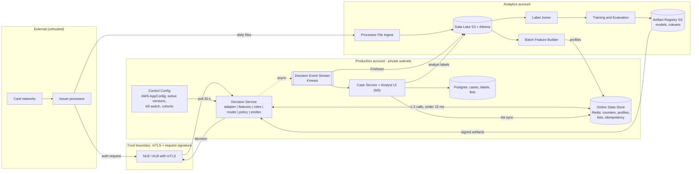
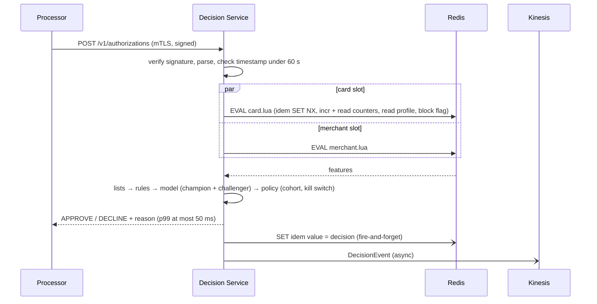

# Real-Time Card Fraud Detection Pipeline: Architecture and Build Plan

> **Before you read:** The workspace has no code, only a `README.md` saying it is intentionally empty. Your request didn't say who you are in the payment flow, what volume you handle, or what stack you use. I didn't hold the plan up with questions. I picked defaults and labelled each one **[A#]**; they're all listed in Section 5. The open questions at the end are the ones whose answers would change the plan most. The biggest is #1: **this plan assumes you are a card issuer** deciding on your own cardholders' authorisations. If you are a merchant, acquirer or payment service provider (PSP), the integration and many of the features change.

---

## 1. Summary

- **What:** An in-house system that scores each card authorisation in real time and returns approve, decline or review before the card network's deadline. It is for an issuer's fraud operations team and its cardholders. It replaces today's assumed setup: generic processor rules plus next-day batch review [A1, A6].
- **Shape:** One low-latency **Decision Service** (a single deployable unit containing the processor adapter, feature, rules, model and policy modules) on the authorisation path. It is backed by an **Online State Store** (Redis) for velocity counters and profiles. Every decision is streamed asynchronously to a data lake. That data feeds analyst case review, label joining, model training and a replay harness.
- **Key decisions:**
  1. **Inline synchronous decisioning in one service**, with the model running in-process (ONNX Runtime). There are no network hops to separate feature or model services.
  2. **Velocity features are updated inline and atomically in Redis** on every authorisation. There is no stream processor (Flink) in v1, so features are fresh to the millisecond, which is what catches card-testing bursts.
  3. **Training features come from replaying history through the same feature code** used online, plus logged feature snapshots. This prevents training/serving skew by construction.
  4. **Fail open.** If we miss the deadline, the processor's default (stand-in) decision applies. If our dependencies are degraded, we decide on rules alone. A **decline-rate guardrail** automatically switches enforcement back to shadow if declines spike.
  5. **Shadow first, then cohort ramp.** Nothing affects a cardholder until it has run in shadow on live traffic and been compared against outcomes.
- **First milestone (3–5 weeks):** A thin slice deployed through CI/CD to staging. A processor sandbox authorisation goes through the Decision Service (3 velocity features, 3 rules), a decision comes back within the deadline, and the event lands in S3 and can be queried. Four spikes answer the processor contract, data/label availability, Redis hot-path latency, and model-scoring parity.
- **Top risks:** (1) access to the processor's inline-decisioning interface, and its certification lead time; (2) whether there are enough historical labelled transactions to train a model; (3) a bad rule or model causing mass false declines; (4) adding latency or outages to the authorisation path.

## 2. Context and Goals

- **Problem:** Fraud losses and false declines are both costly. Today [A6], fraud screening is the processor's generic rule set plus the network's risk score. Analysts review alerts the next day. Card-testing attacks (many small authorisations in seconds) and account-takeover spend get through before anyone looks. Rules can't be changed quickly, and false declines frustrate genuine cardholders.
- **Goals:**
  - Score 100% of authorisations inline within the deadline (Section 3).
  - Fraud analysts can ship a reviewed rule change to production in under 1 hour, and block a card or merchant in under 1 minute.
  - A trained model makes decisions, and at the same or lower decline rate it catches measurably more fraud value than today's rules.
  - Every decision can be fully reconstructed: inputs, features, rule hits, model version, latency.
- **Non-goals (v1):** Step-up authentication (app push or one-time passcode at authorisation time). Device fingerprinting SDKs. Graph or fraud-ring analytics. Multi-region active-active. Acquirer or merchant-side fraud. Credit-risk decisions. AML (anti-money-laundering) transaction monitoring, which is a different regulatory regime. Any LLM component.
- **Success measures** (the baseline is measured in M2; targets are relative to it [A8]):
  - Fraud loss in basis points of volume: −25% within 3 months of the model enforcing.
  - Value detection rate (share of fraud value declined or caught): +25% at the same decline rate.
  - False-positive ratio (genuine declines per fraud decline): no worse than baseline.
  - Card-testing burst containment: blocked within 5 attempts.
  - Deadline misses: under 0.05% of authorisations.

## 3. Drivers, Requirements, and Constraints

**Ranked quality attributes.** The ranking means: *answering in time beats answering with the best possible model*. If features or the model are slow, we decide with what we have.

| # | Attribute | Measurable target | Why it matters |
|---|---|---|---|
| 1 | Authorisation-path availability and bounded latency | Server-side p99 ≤ 50 ms at 500 TPS (transactions per second); hard deadline 120 ms, then fallback; ≥ 99.95% of authorisations answered by us (not fallback) monthly **[A3, A4]** | A slow or down fraud system declines good customers or triggers network stand-in. It must never make authorisation worse than today. |
| 2 | Decision quality | Beats baseline on value detection rate at an equal decline rate, on a time-split holdout and then in shadow **[A8]** | This is the reason the system exists. Bad declines cost interchange revenue and customers. |
| 3 | Safety of change | Every rule or model ships in shadow first. Kill switch takes effect in < 1 min. The guardrail trips automatically at 3× baseline decline rate | One bad rule can decline thousands of genuine transactions an hour. |
| 4 | Auditability | 100% of decisions logged with a feature snapshot and versions; reconciliation gap against processor files < 0.01% | Needed for disputes, regulator questions, model risk governance, and training data. |
| 5 | Evolvability for fraud ops | Rule change live in < 1 h; new velocity feature in < 1 week | Fraudsters adapt in days. |
| 6 | Cost | Infrastructure < $10k/month at assumed scale **[A3]** | Matters, but it is dwarfed by fraud losses and false-decline costs. |

**Key functional requirements:**
- Receive authorisation requests from the issuer processor and return a decision plus reason code.
- Handle duplicates and reversals.
- Compute velocity features over 1 min to 24 h and long-horizon profiles over 90 days.
- Evaluate analyst-authored rules (in shadow or enforcing mode) and a model score.
- Manage block and allow lists.
- Send review cases to analysts with an explanation (M3).
- Ingest clearing, chargeback and fraud-report files to build labels.
- Retrain models and promote them champion/challenger.

**Constraints [A2, A5, A7]:**
- AWS, single region, multi-AZ (multiple availability zones).
- A team of about 5 engineers (3 backend on the JVM, 1 ML/data, 1 platform at roughly half time), plus a fraud ops lead and a PM.
- PCI DSS (the card industry's security standard) applies. We assume the processor sends a card token, not the full card number (PAN).
- If you're a regulated bank, model risk management applies (e.g. SR 11-7 in the US): documented model validation before a model enforces.

**Hard parts:**
1. **Processor integration.** The inline-decision contract, deadline, timeout default and certification are owned by an outside party, and lead times are often weeks.
2. **Fresh features without skew.** Velocity must reflect the authorisation from 2 seconds ago, and training must see exactly what production saw.
3. **Labels.** Chargebacks arrive 30–90+ days late, fraud is about 0.05–0.1% of transactions, and some disputes are "friendly fraud" (genuine cardholders disputing their own purchases). Without historical labels there is no model in v1.
4. **Safe enforcement.** Setting thresholds is a business trade-off (fraud loss vs. declines), and a misconfiguration has immediate, large customer impact.
5. **Hot-path reliability.** Redis and the JVM sit on the authorisation path, so garbage-collection pauses, failovers and duplicate messages all need explicit handling.

## 4. Current State

- **Code inspected:** none. `README.md` in the workspace says there is no existing code, configuration or data. This is a greenfield plan.
- **Assumed organisational context [A1, A2, A6]:**
  - An issuer using an issuer processor that offers an inline "authorisation decision" webhook or API.
  - The processor already runs basic fraud rules.
  - The authorisation message carries the network's risk score.
  - Daily files for authorisations, clearing, chargebacks and fraud reports already arrive by SFTP or S3.
  - An existing cardholder notification service (SMS/push) and an existing metrics stack. CloudWatch is the default.
- **Proposed conventions** (adjust to the org's own): a monorepo `fraud-platform/` containing `services/decision` (Kotlin, Gradle), `services/case` (M3), `ml/` (Python, LightGBM), `rules/` (CEL rule files), `schemas/`, and `infra/` (Terraform). CI is GitHub Actions and images go to ECR.

## 5. Assumptions and Open Questions

**Assumptions**

| # | Assumption | Impact if wrong | How / when validated |
|---|---|---|---|
| A1 | You're an **issuer** deciding on your own cardholders' authorisations via an issuer processor | Large. A merchant or PSP gets different inputs (device, checkout data, 3DS) and a different integration point | Open question 1, before M1 starts |
| A2 | The processor offers a synchronous decision hook (HTTPS + mTLS) with a timeout default we can configure, a sandbox, and an asynchronous transaction feed we can use for shadow | Large. Without an inline hook the system becomes post-authorisation (alerts and card blocks), losing ~half the value | Spike S1, M1 week 1 |
| A3 | Volume: ~5M authorisations/day (avg ~60 TPS, peak 500 TPS), 3–5M active cards, growing < 50%/yr | Medium. At 10× this, Redis sizing and partitioning change, but the architecture holds | Data extract, M1 |
| A4 | The processor gives us ≥ 150 ms before falling back | Medium. A tighter budget forces co-location in the processor's region and drops the second Redis call | S1 |
| A5 | AWS; the team knows JVM (Kotlin/Java) and Python; ECS Fargate is acceptable | Medium. If the team is Python-only, write the Decision Service in Python (Section 10, D4) | Confirm with eng lead, week 1 |
| A6 | ≥ 12 months of authorisations joinable to chargebacks and fraud reports by transaction ID | High for model timing. Without it, v1 is rules-only and the model moves to ~6 months after launch | Spike S2, M1 |
| A7 | The processor sends a card token, not the PAN | Medium. With the PAN, the adapter enters PCI scope (cardholder data environment) and must tokenise on entry | S1 + security review |
| A8 | Targets are relative to a baseline measured in M2 shadow | Low. It's a placeholder until the business sets loss/decline appetite | Fraud ops + finance sign-off, end of M2 |
| A9 | Cardholder SMS/push already exists and can be called by API | Low. Review notifications would slip to M4 | M2 |
| A10 | Decision records kept 7 years | Low; it's an S3 lifecycle setting | Compliance, by M2 |

**Open questions**

| Question | Owner | Default if no answer | Needed by |
|---|---|---|---|
| Issuer, acquirer/PSP, or merchant? | Product/exec sponsor | Issuer | Before M1 |
| Which processor? Exact decision deadline and timeout default? Certification timeline? | Processor relationship manager | 150 ms budget, default approve | M1 week 1 (S1) |
| Is historical labelled data available, and in what form? | Data/finance team | Rules-only v1 | M1 week 2 (S2) |
| Existing case-management tool for analysts? | Fraud ops lead | Build a minimal Case Service in M3 | End of M2 |
| Business limit on fraud-driven decline rate | Fraud ops + finance | ≤ 0.3% of authorisations | End of M2 |

## 6. Architecture Overview

**How it fits together.** The processor calls the Decision Service for every authorisation. The service validates the request. It makes one atomic Redis call keyed by card, which checks idempotency, reads and increments counters, and reads the profile and lists. A second Redis call, made in parallel, does the same for the merchant. The service then evaluates the rules and the in-process model, applies the decision policy, and responds. After responding, it asynchronously emits a decision event containing the full feature snapshot.

Events flow to S3 for analytics, replay and training, and to the Case Service for review queues. Daily processor files (clearing, chargebacks, fraud reports) land in S3. From there the Label Joiner builds labels and the Batch Feature Builder refreshes long-horizon profiles. Which ruleset and model are active, the kill switch, and the rollout cohort percentages all live in AppConfig. Changing them never needs a redeploy.

**Component table**

| Component | Responsibility | Owns data | Interfaces | Technology | Key dependencies |
|---|---|---|---|---|---|
| Decision Service | Decide every authorisation within the deadline | Redis keys `ctr:*`, `idem:*`; decision events | Sync HTTPS (processor contract); async event producer | Kotlin, JVM 21 (ZGC), ONNX Runtime, cel-java, ECS Fargate | Redis, AppConfig, Registry, Kinesis |
| Online State Store | Low-latency counters, profiles, lists, idempotency | Holds data only; writers are listed per key prefix in Section 8 | Redis protocol over TLS | ElastiCache for Redis/Valkey, cluster mode, multi-AZ | none |
| Control Config | Active ruleset/model versions, kill switch, cohort %, thresholds | Config documents | Polled by Decision Service | AWS AppConfig with JSON-schema validators | none |
| Decision Event Stream | Durable fan-out of decisions | Stream (24 h–7 d retention) | Kinesis; JSON Schema `decision-event/v1` | Kinesis Data Streams + Firehose | none |
| Data Lake | System of record for decisions and processor files (history) | `decisions`, `auths`, `clearing`, `chargebacks`, `fraud_reports`, `labels`, `profile_snapshots` | Athena SQL | S3, Glue catalogue, Athena | none |
| Processor File Ingest | Land and parse daily processor files | Raw + parsed file tables | Scheduled job | Step Functions + Lambda/ECS task | Processor SFTP/S3 |
| Batch Feature Builder | Daily 30/90-day profiles per card and merchant | `prof:*` keys (sole writer); `profile_snapshots` | Scheduled; writes Redis + S3 | Athena SQL (CTAS) + loader task | Data Lake, Redis |
| Label Joiner | Join decisions to fraud outcomes | `labels` table | Daily job | Athena SQL | Data Lake |
| Training and Evaluation | Train, evaluate and package models | Model artefacts, eval reports, model cards | Batch job; writes Registry | Python, LightGBM, onnxmltools | Data Lake, replay harness |
| Artifact Registry | Immutable, signed models and rulesets | Versioned artefacts | S3 + manifest | S3 versioned bucket, KMS signing | none |
| Case Service + UI (M3) | Review queue, cardholder contact, analyst labels, list management | `cases`, `analyst_labels`, `lists` (system of record) | Kinesis consumer; internal REST; SSO UI | Kotlin, Postgres (RDS) | Notification service, Redis |

## 7. Component Details

### Decision Service (the hard part, where most of the design effort goes)

- **Responsibility:** Turn one authorisation request into one decision within the deadline, and record why.
- **Does not:** Train models, store history, manage cases, or call any external service synchronously other than Redis.
- **Internal modules** (packages in one deployable, with boundaries enforced by Gradle modules):
  - `adapter`: processor contract. Verifies the signature and maps the request to an internal `AuthRequest` and the decision back to the processor's response.
  - `features`: feature definitions plus the Redis Lua scripts. Also runs inside the replay harness against an in-memory store.
  - `rules`: evaluates CEL (Common Expression Language) expressions. Each rule has an `id`, a `mode` (`shadow` or `enforce`), an `action` and `reason`.
  - `model`: ONNX Runtime session plus the feature-vector builder. Holds a champion and an optional challenger, which is always shadow.
  - `policy`: combines lists, rules, score thresholds per segment (card-present vs. card-not-present), cohort and kill switch into a final action.
  - `emitter`: an asynchronous Kinesis producer with a bounded in-memory buffer (50k events) that spills to local disk.
- **Actions:** `APPROVE`, `DECLINE`, `APPROVE_REVIEW` (approve and open a case or notify the cardholder). Externally we return only coarse reason codes, so attackers can't learn our thresholds.
- **Decision order:** allow-list → block-list → enforcing rule declines → model threshold → default approve. Every evaluated shadow rule and challenger score is recorded but doesn't change the outcome.
- **Latency budget** (p99, server-side):

  | Step | Budget |
  |---|---|
  | Parse + verify signature | 2 ms |
  | Redis: card script ∥ merchant script (parallel) | 8 ms (timeout 15 ms) |
  | Rules (≤ 200 CEL rules) | 2 ms |
  | Model (GBDT (gradient-boosted decision trees), ~500 trees, ~60 features) | 3 ms |
  | Policy + serialise | 1 ms |
  | Headroom (GC, scheduling) | 34 ms |
  | **Target p99 / hard deadline** | **50 ms / 120 ms** |

- **Failure and recovery:**
  - Redis exceeds 15 ms or its circuit breaker is open: switch to **degraded mode**. Only rules over request fields, the network score and in-memory lists run. The model is skipped and the event is marked `degraded=true`.
  - Overall deadline of 120 ms reached: return the configured fallback (approve), tagged.
  - The service unreachable at all: the processor's default applies (see Section 9, Flow C).
  - New config or artefacts fail validation or signature checks: keep the last good version and alert.
- **Scaling:** Stateless. Minimum 3 tasks across AZs. Autoscale on CPU at 50% and on p99 latency. Each task (2 vCPU, 4 GB) is expected to handle ~300 TPS; S3 verifies this.

### Online State Store
- Cluster mode with hash tags. All keys for one card share a slot (`{c:<token>}`) so one Lua script is atomic. Merchant keys use `{m:<merchant_id>}`.
- Sizing: ~2 KB/card × 5M = ~10 GB. That's 2 shards of r6g.large, each with 1 replica.
- A failover can lose a few seconds of counter increments. We accept that: it briefly weakens velocity features and doesn't block authorisations. Counters can be rebuilt from the stream by a replay job if a full loss occurs. (Revisit with MemoryDB if S3 shows unacceptable failover loss.)

### Decision Event Stream and Data Lake
- Partition key is the card token, so a card's events stay in order.
- Firehose writes Parquet to S3 within ≤ 5 min.
- Retention on the stream is 7 days, which lets the Case Service replay after an outage.

### Batch Feature Builder, Label Joiner, Training
- These are daily batch jobs; delay is acceptable because profiles are by definition slow-moving.
- Profiles are written under a date version (`prof:{c:token}:v<yyyymmdd>`, with a pointer swapped atomically), and the snapshot for the same date goes to S3 so the replay is point-in-time correct.
- If a run fails, yesterday's profiles stay active. We alert if they are > 48 h old.

### Case Service + Analyst UI (M3, routine)
- Consumes events with `action=APPROVE_REVIEW` or high-severity shadow hits.
- Analysts see the rule hits and the top feature contributions (SHAP values computed offline for the case, not on the hot path).
- Analysts label cases, manage lists, and trigger cardholder notifications.
- Postgres is the system of record for lists. Lists are synced to Redis within 5 s (by outbox table + poller).

## 8. Data Design

**Entities and system of record**

| Entity | System of record | Sole writer | Consistency | Retention |
|---|---|---|---|---|
| AuthRequest (as received) | Embedded in DecisionEvent → Data Lake | Decision Service | n/a | 7 y [A10] |
| DecisionEvent | Data Lake (`decisions`) | Decision Service (via stream) | At-least-once; deduplicated by `auth_id` on read | 7 y |
| Velocity counters `ctr:{c:…}` / `ctr:{m:…}` | Redis (derived, rebuildable) | Decision Service | Atomic per card via Lua | TTL = longest window + 1 bucket (≤ 25 h) |
| Idempotency `idem:{c:…}:<auth_id>` | Redis | Decision Service | SET NX | 7 d |
| Profiles `prof:{c:…}` / `prof:{m:…}` | S3 `profile_snapshots`, loaded into Redis | Batch Feature Builder | Daily, versioned pointer swap | Redis: 2 versions; S3: 2 y |
| Lists (block/allow) | Postgres `lists` (M3); AppConfig file before that | Case Service (M3) | Synced to Redis ≤ 5 s | Until removed; audit log 7 y |
| Processor files (auths, clearing, chargebacks, fraud reports) | Data Lake raw zone | File Ingest | Daily | 7 y |
| Labels | Data Lake `labels` | Label Joiner (consumes analyst labels from Case Service) | Daily; labels mature over 120 days | 7 y |
| Cases, analyst labels | Postgres | Case Service | Transactional | 7 y |
| Models, rulesets | Artifact Registry | Training pipeline / rules CI | Immutable, signed | Life of artefact + 3 y (model governance) |

**DecisionEvent v1** (in `schemas/decision-event/v1.json`):
- **Identity and timing:** `schema_version`, `auth_id`, `processor_txn_id`, `card_token`, `received_at`, `responded_at`, `latency_ms`.
- **Request:** `amount_minor`, `currency`, `mcc`, `merchant_id`, `merchant_country`, `entry_mode`, `card_present`, `network_risk_score`.
- **Feature snapshot:** `features` (map name → value) and `feature_set_version`.
- **Rules and model:** `rule_hits[]` (id, mode, action), `ruleset_version`, `model_version`, `score`, `challenger_version`, `challenger_score`.
- **Outcome:** `action`, `reason_code`, `enforced` (bool), `cohort`.
- **Status flags:** `degraded`, `fallback`, `duplicate`.

**Access patterns:**
- *Hot path:* point lookups by card and by merchant only.
- *Analytics:* scans by date and range queries by card. S3 is partitioned by `dt=` (and by `hour=` for decisions).
- *Case UI:* by case status/priority and by card. Postgres has indexes on `(status, priority, created_at)` and `(card_token)`.

**Labels.** A transaction is labelled fraud if any of these holds:
- a fraud-reason chargeback (network reason codes mapped in `ml/labels/reason_codes.yaml`);
- a cardholder-confirmed fraud report;
- an analyst confirmation.

A transaction is "genuine" only after 120 days with none of these. Disputes that look like friendly fraud are flagged and down-weighted in training.

**Classification and protection:**
- No PAN anywhere [A7]. The card token is treated as confidential pseudonymous data.
- No cardholder name or address is ingested.
- Merchant data is internal.
- IP or geolocation fields, if added later, are personal data (GDPR, if applicable).
- Encryption: Redis TLS + at-rest encryption; S3 SSE-KMS; RDS encrypted.
- Logs carry `auth_id` only, never the token. Token ↔ customer lookup happens only in the Case UI, behind roles.

**Schema evolution:**
- Event schema changes are additive only. CI runs a compatibility check, and a breaking change means publishing `v2` alongside `v1`.
- Features are versioned by `feature_set_version`, and a model declares which set it needs. The service refuses to load a model whose feature set it doesn't serve.
- Postgres migrations use Flyway, are expand/contract style, and run in the deploy pipeline.

**Backup and restore:**
- S3 is versioned, with cross-account replication of the `decisions` prefix.
- RDS: PITR (point-in-time recovery) for 35 days. RPO (maximum data loss) 5 min, RTO (time to restore) 1 h. A restore is tested in M3.
- Redis is not backed up as a system of record. Recovery is: reload profiles from S3 (≤ 30 min) and rebuild counters by replaying the last 25 h of events (≤ 1 h). Until then the service runs degraded.

## 9. Key Flows

**Flow A: Authorisation decision (happy path)**

**Flow B: Card-testing burst**
1. A stolen card is tested with 25 small card-not-present authorisations of $1 or less across 3 merchants in 90 seconds.
2. Each authorisation atomically increments `cnt_1m`, `cnt_small_cnp_10m` and `distinct_merchants_1h` before rules run, so authorisation #4 already sees counts of 3.
3. Rule `R-CT-001` (`card.cnt_small_cnp_10m >= 3 && txn.amount_minor <= 200`) is enforcing. From the 4th attempt on, the action is DECLINE.
4. The policy also sets `block_card_until = now+24h` in the card slot: a short self-expiring block, written by the Decision Service.
5. The event goes to the Case Service (M3), which opens a priority case and notifies the cardholder.

**Flow C: Failure paths**
- **Duplicate request** (the processor retries after a network blip): `card.lua` finds `idem:<auth_id>`. If it holds a stored decision, we return it without incrementing anything. If it is still "pending" (the first request is in flight), we compute a read-only decision. The event has `duplicate=true`, and analytics deduplicates on `auth_id`.
- **Redis slow or a failover in progress:** the 15 ms timeout fires and the circuit breaker opens after 20% failures in 10 s. The request runs degraded (request-field rules, network score, in-memory lists), and we still answer in < 20 ms. The model is skipped. An alert fires if more than 1% of decisions are degraded for 5 min. The breaker half-opens every 5 s.
- **Decision Service down or the deadline is missed:** the processor applies its configured default. We set that to *approve, subject to the processor's own existing rules*, which matches today's behaviour (fail open). The deadline-miss alert pages on-call.
- **Kinesis unavailable:** the authorisation path is unaffected. Events buffer in memory and spill to an encrypted local volume. If the buffer overflows we count dropped events, alert on any drop, and the daily reconciliation job (decisions vs. the processor's authorisation file) lists the gaps.

**Flow D: Label feedback → new model**
1. A chargeback with a fraud reason arrives in the daily processor file 45 days after the authorisation. File Ingest lands it.
2. The Label Joiner marks the matching `auth_id` as fraud.
3. Weekly, the training job takes the decisions' logged feature snapshots (or replay-generated vectors for older history) and joins them to labels that are at least 120 days mature. It trains a LightGBM challenger and evaluates it against the champion on the last 8 matured weeks.
4. If it passes the gates (Section 14), the challenger is exported to ONNX, signed, written to the Registry, and set as `challenger` in AppConfig. It runs in shadow for at least 2 weeks.
5. Fraud ops and model risk sign off, then the challenger is promoted to champion through a cohort ramp.

## 10. Key Decisions

| # | Decision | Options considered | Rationale (against drivers) | Reversibility | Revisit if |
|---|---|---|---|---|---|
| D0 | **Build a thin in-house decision layer**, keeping the processor/network tools as a backstop | (a) Buy a vendor fraud platform (e.g. Featurespace, Feedzai, the processor's add-on); (b) build | Building gives control over features, rules turnaround (driver 5), data ownership, and lower unit cost at scale. The plan keeps the scope small. | Medium | S2 shows too little labelled data **and** the team can't staff 24/7 on-call. Then buying is the better option, and this plan's adapter and event layer still apply. |
| D1 | **Inline synchronous decision in one deployable**, model in-process | (a) Separate feature, rules and model microservices; (b) post-authorisation only (alerts and blocks); (c) single service | (c) keeps the hot path to one hop plus Redis (driver 1). (b) misses the point of real time. (a) adds latency and failure modes with no scaling or team need. | Medium | A separate team owns the model, or the model needs a GPU/large runtime |
| D2 | **Inline atomic velocity counters in Redis (Lua)** + daily batch profiles | (a) Kafka/Kinesis + Flink streaming aggregation; (b) inline Redis | (b) has zero lag (card testing happens in seconds), avoids learning and running Flink (5-person team), and is atomic per card. Cost: feature logic sits in Lua + Kotlin. | Easy–medium | You need cross-entity windowed joins, more than ~50 counters per card, or Redis CPU above 60% at peak |
| D3 | **Training features = logged snapshots + replay through the same Kotlin feature code** | (a) Reimplement features in Spark/SQL; (b) a feature store product (Feast/Tecton); (c) single implementation + replay | (c) removes training/serving skew by construction (drivers 2 and 4) with no new platform. (a) creates skew. (b) is a big new dependency for ~60 features. | Medium | Features above ~200, or several teams need shared features |
| D4 | **Kotlin/JVM for the Decision Service; Python for training; LightGBM → ONNX** | (a) Python (FastAPI) service end to end; (b) JVM + ONNX | The JVM with ZGC has more predictable p99 under load (driver 1). ONNX gives a portable model with parity tested by S4. | Hard (language) | The team is Python-only [A5]. Then use Python with native LightGBM, more instances, and the same budgets, verified by S3. |
| D5 | **Rules as CEL expressions in Git, hot-loaded via signed artefact + AppConfig** | (a) Hard-coded in Kotlin; (b) commercial rules engine / Drools; (c) CEL | CEL is sandboxed, fast, and readable by analysts. PR review gives a two-person rule and an audit trail (drivers 3 and 5). Needs no redeploy. | Easy | Analysts can't work with Git PRs. Then add a rule-editing UI in the Case Service that writes the same format. |
| D6 | **Fail open** (processor default = approve-with-existing-rules; degraded rules-only mode) | (a) Fail closed (decline when unsure); (b) fail open | Declining everything during our outage costs more than a short window of today's fraud exposure (driver 1). The processor's existing rules remain as a backstop. | Easy (config) | Fraud ops sees attacks timed to our outages |
| D7 | **Kinesis Data Streams + Firehose** for events | (a) MSK (Kafka); (b) synchronous DB write per decision; (c) Kinesis | (c) is fully managed and has S3 delivery built in (small team). (b) adds latency on the hot path. | Easy–medium | The org already runs Kafka, in which case use it |
| D8 | **Shadow → card-cohort ramp → guardrail** for every rule and model change | Big-bang enable; percentage of traffic | Cohort by hash of the card token keeps each card's experience consistent and makes it possible to measure enforced vs. control (driver 3). | Easy | none |

## 11. Cross-Cutting Concerns

**Security** (built in M1; reviewed before M3 enforcement)
- *Identity:* the processor authenticates with mTLS plus an HMAC request signature and a timestamp, and we reject anything more than 60 s old. Internal services use IAM roles. Analysts use the org's SSO with roles `analyst`, `senior_analyst` (list and rule approval) and `admin`.
- *Secrets:* Secrets Manager, rotated. Nothing goes in images.
- *Network:* Decision Service and Redis in private subnets. Only the NLB is exposed, with source IPs allowed only from the processor. The analytics account is separate, and production has no write access to its training data.
- **Top threats → mitigations:**
  1. *Forged or replayed authorisation requests used to probe or poison counters* → mTLS, signature and timestamp checks, idempotency keys.
  2. *Attackers learning thresholds* → coarse external reason codes; monitoring for probing patterns (many near-threshold attempts).
  3. *Insider tampering* (e.g. allow-listing a card, weakening a rule) → two-person review for rules and lists, signed artefacts, a tamper-evident audit log (S3 Object Lock).
  4. *Bad change causing mass declines* → mandatory shadow, the decline-rate guardrail (auto-switch all enforcement to shadow if the enforced decline rate is above 3× the 7-day baseline for the same hour for 5 min), and a one-flag kill switch.
  5. *Label poisoning via false fraud claims* → friendly-fraud flagging and analyst-confirmed weighting.
- *Scanning:* dependency and image scans in CI (M1). A PCI scoping review in M1 confirms [A7].

**Reliability:**
- *Targets:* see the drivers table. Multi-AZ throughout, and at least 3 Decision Service tasks.
- *Timeouts:* Redis 15 ms, overall 120 ms.
- *Retries:* none on the hot path except the processor's own. Batch jobs retry with backoff, and each is idempotent (overwrite by date partition).
- *Dead letters:* the Case Service consumer sends poison events to an SQS DLQ with a replay command.
- *Health check:* `/ready` returns success only when the service has a valid ruleset, a valid model and a working Redis connection pool. If Redis is down it still reports ready but flags degraded, so the whole fleet isn't pulled during a Redis failure.

**Observability** (M1 basic; M2 complete):
- Structured JSON logs with `auth_id` as the correlation ID, in both logs and events.
- *Metrics:* latency histogram, deadline misses, fallback and degraded rates, decision mix by rule/segment/cohort, Redis latency, emitter buffer depth and drops, stream lag, score distribution, and feature missing rates.
- *Alerts (paged):*
  - deadline misses > 0.05% for 5 min;
  - degraded > 1% for 5 min;
  - guardrail tripped;
  - any dropped events;
  - profiles more than 48 h old.
- *Daily (ticket, not page):* reconciliation gap > 0.01%; score PSI (population stability index, a drift measure) > 0.2 vs. the training distribution.

**Performance and capacity:**
- Peak 500 TPS [A3]. We load test at 1,000 TPS (2× peak) for 1 hour with a hot-card skew, using Gatling with replayed real request shapes. That happens in M2, and again before every enforcement ramp.
- *Expected bottlenecks:* JVM GC tail latency, hot Redis keys for very large merchants (mitigated by sharding merchant counters into 8 sub-keys and summing them), and the ONNX session thread pool.

**Cost** (rough, at [A3]):

| Item | Rough monthly cost |
|---|---|
| ECS tasks | $0.4–0.8k |
| ElastiCache (2 shards + replicas) | $0.8–1.2k |
| Kinesis + Firehose | $0.3–0.6k |
| S3/Athena/Glue | $0.3–1k |
| RDS | $0.3–0.5k |
| Training compute | $0.2–0.5k |
| NLB, logs, metrics | $0.5–1k |
| **Total** | **~$3–6k/month** |

The real cost drivers are people and false declines. Controls: AWS Budgets alerts at 80% and 100%, cost-allocation tags `system=fraud`, Athena workgroup scan limits.

**Operations:**
- The Decision Service and Online State Store sit on the authorisation path, so on-call is **24/7** from M3 (the first enforcement). That needs at least 4 people on the rotation; borrow from platform if needed.
- Fraud ops owns rule content and thresholds. Engineering owns the platform.
- *Runbooks (M2–M3):* Redis failover/rebuild, kill switch and guardrail reset, model/ruleset rollback, processor connectivity loss, event-gap reprocessing.
- A weekly fraud review meeting looks at the decision-mix dashboard.

**ML-specific concerns** (no LLMs, but model behaviour is uncertain until measured):
- An evaluation set and gates exist from M1 (S2).
- Models are versioned with model cards. Challengers always run in shadow first.
- Human sign-off from fraud ops (plus model risk, if a bank) is required before a model enforces.
- If the model fails to load or a feature is missing, the service falls back to rules-only.
- Drift is monitored with PSI.

## 12. Build Sequence

Team assumption: 3 backend engineers, 1 ML/data engineer, 0.5 platform/SRE, plus a fraud ops lead (rules and thresholds) and a PM. These sizes are rough guides, not commitments.

| Milestone | Goal / risk cleared | Scope (in / out) | Deliverables | Exit criteria | Depends on | Rough size |
|---|---|---|---|---|---|---|
| **M1: Thin slice + spikes** | Integration, deployment, latency, and data feasibility | In: sandbox integration, 3 features, 3 shadow rules, events to S3, staging env, CI/CD, spikes S1–S4. Out: prod traffic, model in path, Case Service | Running staging stack; spike reports with go/no-go | Sandbox authorisation → decision → S3 event end to end via pipeline; p99 < 50 ms at 200 TPS synthetic; Redis fault → degraded answers within deadline; S1–S4 decided | Processor sandbox access (**long lead**) | 3–5 weeks |
| **M2: Production shadow** | Real-traffic behaviour and the baseline | In: prod env; shadow on live traffic (async feed, or inline hook returning "no opinion" if the processor supports it); ~40 features; batch profiles; ~20 analyst rules; replay harness; baseline model in shadow; dashboards; reconciliation; load test. Out: any enforcement | Prod shadow running ≥ 2 weeks; baseline report (would-be decline rate, value detection rate, FP ratio) | p99 < 50 ms on live traffic; reconciliation gap < 0.01%; load test 1,000 TPS passes; business signs off decline appetite [A8] | M1; processor prod credentials | 4–6 weeks |
| **M3: Enforce rules inline** | Safe enforcement and operability | In: inline hook in prod; enforce blocklist + card-testing rules; cohort ramp 1→10→50→100%; guardrail + kill switch; Case Service + UI + notifications; 24/7 on-call; game day. Out: model enforcing | Enforcing rules on 100% of cards; runbooks; on-call rota | 2 weeks at 100% with deadline misses < 0.05%; FP ratio of enforced rules within agreed bound; game day passes (Redis failover, kill switch, rollback) | M2; processor certification (**critical path**) | 4–6 weeks |
| **M4: Model enforcing + learning loop** | Detection uplift | In: Label Joiner, weekly retraining, champion/challenger, model enforcing by cohort, drift monitoring, model governance docs. Out: real-time labels, new data sources | Model-driven decisions live; retraining pipeline | 4 weeks enforcing: value detection rate ≥ baseline +25% at ≤ baseline decline rate (or an agreed revised target) | M2 data; S2 = go | 5–8 weeks |

**Critical path:** processor access (day 1) → S1 → M2 prod credentials → processor certification of the inline hook → M3 enforcement. Request certification in week 1, even though it isn't needed until ~week 9.

**Second chain:** historical data extract (day 1) → S2 → replay harness → baseline model (M2) → M4.

**Parallel work:**
- The Case Service (M3) can start in M2 against the event schema.
- Batch profiles and the replay harness run alongside the M2 hot-path work.

**If S2 says no-go:** M4 becomes "start label collection; model at ~6 months". M3 still delivers value from rules.

## 13. First Milestone Task Breakdown

Repo: `fraud-platform/`. Tasks marked ∥ can run in parallel once their prerequisites are done.

| # | Task | Location | Done when | Order |
|---|---|---|---|---|
| T0 | **Request long-lead items:** processor sandbox + decision-hook docs + certification timeline; 24-month historical extract (authorisations, clearing, chargebacks, fraud reports); PCI scoping review; AWS account/VPC allocation | Tickets/emails with named owners | Each request has an owner and a due date in the M1 tracker | Day 1 |
| T1 | **Create repo skeleton and CI:** Gradle multi-module `services/decision` (`adapter`, `features`, `rules`, `model`, `policy`, `emitter`, `app`); `ml/` (Python 3.12, uv, ruff, pytest); `schemas/`, `rules/`, `infra/`. GitHub Actions runs build, unit tests, lint, dependency + image scan, and pushes to ECR | repo root, `.github/workflows/ci.yml` | A PR to `main` runs green, and merge publishes an image tagged with the commit SHA | Days 1–3 |
| T2 | **Provision staging with Terraform:** ECS Fargate service (3 tasks), NLB with mTLS listener, ElastiCache Redis cluster (2 shards, TLS, multi-AZ), Kinesis stream + Firehose → S3 Parquet, Glue table, AppConfig app/profiles, Budgets alert. Remote state in S3 + DynamoDB lock, one state per environment | `infra/envs/staging`, `infra/modules/*` | `terraform plan` runs in CI on PR; `apply` from the pipeline creates staging from scratch; `curl` with a client cert reaches `/ready` | ∥ after T1, days 2–8 |
| T3 | **Define DecisionEvent v1 schema** with the fields in Section 8, plus fixtures; add a compatibility check (no field removal or type change) | `schemas/decision-event/v1.json`, `schemas/check.py` | The fixture validates; a PR that removes a field fails CI | ∥ after T1 |
| T4 | **Implement processor adapter:** parse the request into `AuthRequest`, verify the HMAC signature and timestamp, map `Decision` to the response | `services/decision/adapter/` | Contract tests pass on ≥ 10 recorded sandbox fixtures (card-present, card-not-present, refund, reversal, malformed, bad signature, stale timestamp) | ∥ after S1 docs |
| T5 | **Implement `card.lua` / `merchant.lua` + feature module:** idempotency SET NX; bucketed counters `cnt_1m`, `cnt_small_cnp_10m`, `distinct_merchants_1h` (HyperLogLog), `amt_sum_24h`; hash-tagged keys | `services/decision/features/` | Testcontainers integration test shows: a duplicate `auth_id` doesn't double count; windows expire correctly at bucket edges; a 1,000-event replay produces identical counts in the Redis and in-memory store implementations | ∥ after T1 |
| T6 | **Implement rules module:** load a CEL ruleset (JSON manifest + `.cel` files), modes shadow/enforce, per-rule fixtures; add 3 starter rules (card testing, block flag, high network score) in shadow | `services/decision/rules/`, `rules/v0001/` | `./gradlew :rules:test` passes per-rule positive/negative fixtures; `ruleset_version` appears in events | ∥ after T1 |
| T7 | **Implement policy, deadlines, degraded mode:** 120 ms overall deadline, 15 ms Redis timeout + circuit breaker, kill switch and cohort from AppConfig; always `enforced=false` in M1 | `services/decision/policy/`, `app/` | A Toxiproxy test with Redis latency at 200 ms gives 100% responses < 40 ms with `degraded=true`; flipping the AppConfig kill switch takes effect in < 60 s | After T5, T6 |
| T8 | **Implement async emitter:** Kinesis KPL producer, bounded buffer, disk spill, counters for depth and drops | `services/decision/emitter/` | A staging event appears in S3 and Athena in ≤ 5 min; with Kinesis blocked via IAM deny, authorisations stay within budget and the spill metric rises | After T2, T3 |
| T9 | **Add metrics, dashboard, 2 alerts:** latency histogram, decision mix, degraded and deadline-miss rate, emitter drops. Alerts: degraded > 1% for 5 min, any drop | `services/decision/app/metrics`, `infra/modules/observability` | Injecting a Redis fault in staging fires the degraded alert to the team channel | After T7, T8 |
| T10 | **Deploy and demo the slice:** pipeline deploys to staging; drive it with sandbox authorisations + Gatling synthetic at 200 TPS for 1 h | `load/gatling/`, CD workflow | Demo: sandbox authorisation → response → row in Athena with features and rule hits; p99 < 50 ms; zero drops | Last |
| **S1** | **Spike: processor contract** (3 days). *Question:* exact request/response schema, deadline, retry/duplicate semantics, timeout default, decline reason codes, an async feed for prod shadow, certification steps and lead time. *Build:* a sandbox round trip from T4. | `docs/spikes/s1-processor.md` | Written answers + a working sandbox call. **Changes plan if:** deadline < 100 ms (co-locate, drop the merchant call); no inline hook (switch to post-authorisation design); PAN in payload (tokenise at adapter, PCI scope); certification > 8 weeks (move M3) | Week 1 |
| **S2** | **Spike: data and baseline model** (5 days, after the extract arrives). *Question:* is there ≥ 12 months of joinable labelled data, and does LightGBM on ~15 request + simple velocity features beat the current rules at an equal decline rate on a time-split holdout? | `ml/spikes/s2_baseline.ipynb` → `docs/spikes/s2-data.md` | Report with label coverage, fraud rate, PR-AUC, and value detection rate at 0.3% decline vs. the rule baseline. **Changes plan if:** no labels or no uplift (v1 rules-only, M4 becomes label collection) | Weeks 2–4 |
| **S3** | **Spike: Redis hot-path latency and failover** (3 days). *Question:* at 1,000 TPS with the T5 scripts and skewed keys, is Redis p99 < 5 ms, and how much is lost and for how long during a forced failover? | `load/redis-spike/`, `docs/spikes/s3-redis.md` | Latency histogram + failover timeline. **Changes plan if:** p99 > 10 ms (fewer scripts, local cache for profiles) or failover loss > 30 s (MemoryDB) | Weeks 1–2 |
| **S4** | **Spike: ONNX scoring parity** (2 days, after the S2 model). *Question:* do JVM ONNX scores match Python LightGBM within 1e-6 on 100k vectors, with p99 < 2 ms? | `ml/export/`, `services/decision/model/` test | Parity test committed to CI. **Changes plan if:** no match (use lightgbm4j native) | Week 3–4 |

## 14. Testing and Validation Strategy

| Risk | Test type | Where / when | Blocks release? |
|---|---|---|---|
| Processor contract drift | Contract tests on recorded sandbox fixtures | CI, every PR | Yes |
| Feature correctness / skew | Unit tests with golden vectors; same-code replay parity (Redis vs. in-memory) | CI | Yes |
| Rule errors | Per-rule positive/negative fixtures; dry-run of the new ruleset over the last 7 days of decisions showing the change in hit counts | Rules CI on PR | Yes; a reviewer must approve the impact diff |
| Model regressions | Eval gates on a time-split holdout (last 8 matured weeks): value detection rate at the policy decline rate ≥ champion; PR-AUC ≥ champion −1%; no segment (card-present/card-not-present, top-10 MCCs) worse by > 5% | Training pipeline | Yes; blocks registry promotion |
| Scoring parity | ONNX vs. Python scores on 100k vectors | CI | Yes |
| Latency / capacity | Gatling at 1,000 TPS for 1 h with a hot-key mix | Staging; M2, and before each ramp | Yes, for ramps |
| Resilience | Toxiproxy faults (Redis slow/down, Kinesis down); game day in prod in M3 (Redis failover, kill switch) | Staging CI nightly; M3 | Yes, for M3 exit |
| Security | Dependency/image scans; mTLS and signature negative tests; PCI scoping review | CI; before M3 | Yes |
| End to end | Sandbox authorisation → decision → S3 → Athena row | Staging after each deploy | Yes |

**Test data:** Synthetic generators (`load/`) for load testing. Historical data is tokenised and stays in the analytics account; no production data goes to staging beyond the replay of token-only, PAN-free records approved by security.

**Verifying Section 3 targets:**
- Latency and availability come from production histograms and deadline-miss counts.
- Quality comes from shadow-vs-outcome analysis after label maturity, plus the enforced-vs-control cohort comparison.
- Auditability comes from the daily reconciliation report.

## 15. Rollout, Migration, and Rollback

- **Coexistence:** The processor's existing rules stay active throughout. Our system starts in shadow (M2), then adds declines on top of them (M3–M4). We retire overlapping processor rules one at a time, and only after 4 weeks at 100% with fraud ops sign-off.
- **Staged rollout:** Each rule and each model goes shadow ≥ 1–2 weeks → enforced on cohorts by `hash(card_token) mod 100` at 1% → 10% → 50% → 100%. Each step lasts ≥ 3 days with the guardrail armed. Five held-out cohorts stay unenforced for 3 months to measure uplift.
- **Rollback:**

  | What | How | Time |
  |---|---|---|
  | All enforcement | Kill switch (AppConfig) | < 1 min |
  | One rule | Set `mode=shadow` in AppConfig | < 1 min |
  | Ruleset or model | Repoint the AppConfig version to the previous signed artefact | < 1 min |
  | Service | ECS redeploy of the previous image | < 10 min |
  | Inline hook | Ask the processor to disable it, which falls back to today's behaviour (their SLA; confirm in S1) | Processor's SLA |

- **Point of no return:** effectively none while the processor's rules remain. It arrives when processor-side rules are retired; at that point a rollback leaves only the processor defaults, so retirement needs explicit sign-off.

## 16. Risks and Mitigations

| Risk | Likelihood | Impact | Mitigation | Early warning | Owner |
|---|---|---|---|---|---|
| Processor inline hook unavailable, or certification is slow | Med | High | Request day 1; S1; prod shadow via async feed doesn't need certification | No sandbox by end of week 1 | PM |
| Not enough labelled history | Med | High | S2 by week 4; rules-only v1 fallback; start label capture in M2 | Extract delayed past week 2; chargeback join rate < 80% | ML eng |
| Bad rule or model causes mass false declines | Med | High | Shadow first, cohort ramp, guardrail, kill switch, two-person review | Decline mix diverging from baseline | Fraud ops lead |
| Hot path adds latency or outages | Low–Med | High | Budgets, timeouts, degraded mode, fail open, load tests at 2× peak | p99 creeping above 35 ms; GC pauses | Backend lead |
| Training/serving skew | Med | Med | Same-code replay; logged snapshots; parity tests | Shadow score distribution ≠ offline (PSI > 0.1) | ML eng |
| Fraudsters adapt to rules or model | High | Med | Fast rule changes; weekly retraining; drift monitoring | Rising fraud losses in held-out cohorts | Fraud ops |
| 24/7 on-call unsustainable for a small team | Med | Med | Fail-open design keeps pages to symptoms that matter; borrow from platform; runbooks | > 2 pages/week out of hours | Eng manager |
| PCI/regulatory scope larger than assumed | Low–Med | Med | Scoping review in M1; no PAN by design | Processor payload contains PAN | Security |
| Lost decision events break audit and training | Low | Med | Disk spill, drop alerts, daily reconciliation | Reconciliation gap > 0.01% | Backend lead |
| Business can't agree on decline appetite | Med | Med | Present the M2 baseline as a curve of fraud caught vs. decline rate; set a default threshold | No sign-off by end of M2 | PM |

## 17. Deferred Work and Future Evolution

| Deferred | Trigger to build |
|---|---|
| Streaming aggregation (Flink / Managed Service for Apache Flink) | Features that need cross-entity windowed joins, or Redis CPU above 60% at peak |
| Device / app-session signals (login, new device, password reset) | Account takeover is a top fraud type in M2 analysis |
| Step-up (app push "was this you?" before approval) | The processor supports holding an authorisation, or for card-not-present via 3DS data |
| Graph features (shared devices/merchants, fraud rings) | Analysts report ring patterns that rules can't express |
| Multi-region active-active | The processor needs it, or the availability target rises above 99.99% |
| Real-time label ingestion (cardholder "not me" from the app) | Label latency becomes the bottleneck on retraining |
| Rule-authoring UI | Analysts struggle with Git PRs |
| LLM-assisted case summaries | Analyst handling time becomes a bottleneck. Would need its own eval set and data-handling review. |

**Extension points:** `features` module + `feature_set_version`; `rules` CEL manifest; model interface (champion/challenger slots); additive event schema; a policy action enum that can grow to `STEP_UP`.

**Deliberate shortcuts, with paydown:**
- Lists live in an AppConfig file until the Case Service (M3).
- Single region (revisit annually).
- Training runs on a single-node job (move to SageMaker if training exceeds 2 h).
- Hand-run threshold calibration (automate in M4+).

## 18. Next Steps

1. **Today:** confirm or correct assumptions A1–A5. A1 (issuer?) and A2 (inline hook?) are the most important.
2. **Today:** file T0. Ask the processor's relationship manager for sandbox access, decision-hook docs and the certification timeline. Ask the data team for the 24-month extract. Book the PCI scoping review.
3. **Days 1–3:** create `fraud-platform/` with the T1 skeleton and `ci.yml`. Start T2 (`infra/envs/staging`).
4. **Week 1:** run S1 and S3 in parallel. The fraud ops lead drafts the first 3 rules and the list of 20 rules for M2 in `rules/`.
5. **End of week 1:** go/no-go review on S1 findings. Adjust the deadline budget and the M3 date to match.

---

## The questions that would change this plan most

1. **Are you an issuer, or an acquirer/PSP/merchant?** This decides the integration point, the available signals (e.g. device and checkout data vs. network scores) and which decisions you can make. The default is issuer.
2. **Which processor do you use, and does it offer an inline decision hook? What is the deadline, and what happens on timeout?** Without an inline hook this becomes a post-authorisation alert-and-block system. A deadline under 100 ms forces co-location.
3. **Do you have 12+ months of authorisations joinable to chargebacks and fraud reports?** This decides whether a model is in v1 or about 6 months later.
4. **What volume and peak TPS do you handle?** At 10× my assumption, Redis partitioning and the streaming decision (D2) need another look.
5. **What is your team's stack and on-call capacity, and is there an existing case-management tool?** This decides the language (D4), whether 24/7 support is realistic, and whether you build the Case Service or integrate with an existing tool.
