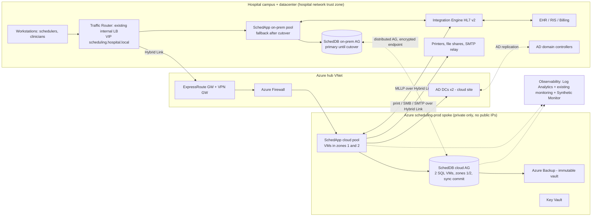

# Architecture and Build Plan: Moving the Patient Scheduling System to the Cloud Without Downtime

> **Before you read:** The workspace has no code or documentation for the current system, so I couldn't check anything against it. Every fact below about the current system is an **assumption**, marked with **[A#]** and listed in Section 5. Three of them would change the plan the most:
> - **[A1]** It's an application you can rehost, not a module inside your EHR.
> - **[A2]** It runs on SQL Server 2016 or later, Enterprise edition.
> - **[A4]** The target cloud is Azure.
>
> Where a different answer would change the design, I say so in that spot.

---

## 1. Summary

- **What's being built:** a move of the existing patient scheduling system (web app plus SQL Server database) from the hospital datacenter to Azure, with no data loss, no unplanned outage, and a fail-back path for 30 days afterwards. Users are front-desk schedulers, the call centre and clinicians. Their workflows, URL and login stay the same.
- **Shape:** **rehost first, modernise later.** The same application build and the same SQL Server version move onto Azure VMs in a private network spoke, connected to the hospital over ExpressRoute with a VPN backup. The database copies itself continuously to the cloud through a SQL Server **distributed availability group** (distributed AG: SQL Server's built-in way to keep a live, continuously updated copy of a database at another site). The move itself is one planned, lossless failover.
- **Key decisions:**
  1. **Only one writable database at any moment.** No dual writes and no active-active setup, because either could cause double-bookings.
  2. **The database moves by distributed AG to SQL Server on Azure VMs.** This is the only option that gives a lossless switch *and* a lossless switch back. (If you run SQL Server 2022, Azure SQL Managed Instance link becomes a viable alternative.)
  3. **The existing on-prem load balancer stays as the point where traffic is split,** so one pilot clinic can use the cloud app tier first and the switch-back is a single pool change.
  4. **The HL7 integration engine stays on-prem,** so external partners and the EHR see no change in IP addresses or endpoints.
  5. **"Without downtime" means:** an announced interruption of **5 minutes or less** in the quietest hour, no data loss, and no need to fall back to paper downtime procedures. Truly zero seconds isn't possible with a single-writer database. I'm stating this up front rather than hiding it, and clinical operations needs to agree to it ([A6]).
- **First milestone (5–7 weeks):** a working end-to-end slice in a cloud pre-production environment. A real hospital workstation logs in with AD, books an appointment, and an HL7 SIU message reaches the EHR test system, all through the real deployment pipeline. It also includes three spikes: hybrid failover and fail-back, tolerance of WAN latency, and a full inventory of hidden dependencies.
- **Top risks:**
  - Hidden on-prem dependencies such as printers, file shares, scheduled jobs, hard-coded hostnames and server time zone.
  - The hospital becoming dependent on the WAN link.
  - Lost or duplicated HL7 messages during the switch.
  - Long-lead approvals (BAA, security risk assessment, ExpressRoute, vendor support) holding up the critical path.

## 2. Context and Goals

- **Problem:** Scheduling runs on on-prem hardware that the hospital wants to retire (assumed to be driven by hardware refresh or a cloud strategy, [A11]). Scheduling is used around the clock (ED follow-ups, inpatient orders, the call centre from 07:00), so a traditional "take it down for a weekend" move isn't acceptable.
- **Goals:**
  - Production scheduling runs in Azure.
  - No appointment lost, duplicated or double-booked because of the migration.
  - User-visible interruption of 5 minutes or less, once, in an announced window.
  - On-prem scheduling servers decommissioned within about 6 months of starting.
- **Non-goals:**
  - Redesigning or rewriting the application.
  - Changing user workflows.
  - Moving the EHR or the integration engine.
  - Changes to any patient portal.
  - Multi-region active-active.
  - Moving to PaaS (deferred, Section 17).
  - Upgrading the SQL Server version (deferred).
- **Success measures (90 days after cutover):**
  - Reconciliation shows 0 missing or extra appointments.
  - 0 minutes of unplanned outage caused by the migration.
  - p95 page time within 120% of the pre-migration baseline.
  - Scheduling incident count no higher than the 90-day baseline.
  - Monthly run cost within the agreed budget.
  - On-prem replica and servers retired.

## 3. Drivers, Requirements, and Constraints

**Ranked quality attributes**

| # | Attribute | Measurable target | Why it matters |
|---|---|---|---|
| 1 | Data integrity | 0 lost or duplicated appointments; RPO = 0 at cutover and fail-back; exactly one writable primary at all times | A lost or double-booked appointment is a patient-safety event. Integrity beats availability whenever they conflict. |
| 2 | Clinical availability | No unplanned outage; one planned interruption of **5 minutes or less** [A6], rehearsed at 3 minutes or less; after migration, 99.9% monthly with RTO under 5 minutes for a zone failure | Staff can't stop scheduling. Paper downtime procedures cause transcription errors. |
| 3 | Reversibility | Fail back to on-prem within 15 minutes, with no data loss, at any point up to 30 days after cutover [A12] | Unknown unknowns. The fallback has to be cheap and practised. |
| 4 | Security and compliance | HIPAA: BAA in place, security risk assessment approved **before PHI reaches the cloud**, encryption in transit and at rest, audit trails kept [A3] | Legal obligation. Ransomware is the leading threat to hospitals. |
| 5 | Performance parity | p95 of the top 10 workflows within 120% of the measured baseline at peak (baseline captured in M1, task T2) | Schedulers on the phone notice slowness right away. |
| 6 | Operational load and cost | Run by the existing IT ops team with no new 24/7 rota; within the budget ceiling (open question Q4) | A small team can't absorb a lot of new tooling. |

**Key functional requirements:** Everything works exactly as it does today: book, reschedule and cancel appointments, manage templates, waitlists, letters and labels, reminders. HL7 traffic keeps flowing: ADT in, SIU out. The URL, login and printing don't change.

**Constraints (assumed):**
- Windows Server, IIS and .NET (or Java) app servers, with SQL Server Enterprise 2016 or later [A2].
- Active Directory logins [A7].
- An internal load balancer such as F5 [A8].
- An on-prem HL7 integration engine such as Rhapsody, Mirth or Cloverleaf [A9].
- US HIPAA [A3].
- Core team of about 5 people [A10].
- The hospital change advisory board (CAB) must approve production changes.

**Hard parts**

1. **Moving the single writable database:** this is the only step that can lose data or create two writable primaries (split-brain).
2. **Hidden on-prem dependencies:** printers, file shares, SMTP, SQL Agent jobs, Windows scheduled tasks, hard-coded hostnames and IPs, licence keys tied to hardware, and the **server time zone**. If the app or SQL uses local server time and an Azure VM defaults to UTC, every appointment time shifts.
3. **HL7 interface continuity:** messages that are in flight when the switch happens can be lost or sent twice.
4. **New WAN dependency:** clinical operations on campus will now rely on the link to Azure.
5. **Long-lead approvals:** the BAA, security risk assessment, ExpressRoute circuit (often 6–12 weeks), vendor support statement, and CAB.

## 4. Current State

I didn't inspect anything. The workspace contains only a README saying it's empty. **Assumed** current state, to be confirmed by tasks T2–T4:

- **SchedApp:** 2–3 Windows app servers behind the on-prem load balancer at `scheduling.hospital.local`, using Windows Integrated Auth against AD. Background services run on one of these servers: reminder export, the HL7 outbound sender, and nightly letter batches.
- **SchedDB:** SQL Server Enterprise 2016+ [A2]. Possibly already in an on-prem AG. Roughly 200 GB–1 TB, with SQL Agent jobs.
- **Integrations:** ADT feed from the EHR into the scheduling app, and SIU feed out to the EHR, RIS and billing, all through the integration engine over MLLP. A reminder vendor (SMS) is reached through the integration engine or an SFTP drop [A9].
- **Load:** about 2,000 named users, about 300 concurrent at peak, 5,000–15,000 appointments a day, peak 07:30–10:00 on weekdays [A5].
- **Ops:** hospital IT has 24/7 on-call, an existing monitoring tool, existing backups and documented downtime procedures [A13].

**Conventions the plan follows:** keep the existing build and deployment packaging, keep AD, keep the integration engine as the single gateway to partners, and keep the SQL Server version.

## 5. Assumptions and Open Questions

**Assumptions**

| # | Assumption | Impact if wrong | How and when validated |
|---|---|---|---|
| A1 | Scheduling is a standalone app the hospital hosts, either in-house or a vendor product with cloud hosting allowed, and not part of the EHR | If it's part of the EHR (for example Epic Cadence), this plan doesn't apply. The move becomes the EHR vendor's hosting programme. | Q1, day 1 |
| A2 | SQL Server 2016 or later, Enterprise edition | Below 2016, distributed AG isn't available, so on-prem must be upgraded first (adds 4–8 weeks). On Standard edition, the replication options are limited and the write pause grows. | T4, week 1 |
| A3 | US HIPAA applies; no data residency beyond the US | GDPR or NHS rules would change the region and assurance requirements, not the design | Q2, day 1 |
| A4 | Azure is the target, using the existing Microsoft agreement | On AWS the same design maps to EC2 SQL AG, Direct Connect and Managed AD. About 2 weeks of re-planning; the sequence stays the same. | Q3, day 1 |
| A5 | Load is as described in Section 4; transaction log generation at peak is 10 MB/s or less | Higher log rate means a larger circuit and more replication lag | T2, week 2 |
| A6 | Clinical ops accepts a one-time interruption of 5 minutes or less, announced, in the quietest hour | If 0 seconds is required, you need app changes (a read-only mode and write queueing): +6–10 weeks | T18, week 3 |
| A7 | Users authenticate with AD (Windows auth or LDAP) | If the app already uses OIDC, cloud domain controllers are less critical | T3 |
| A8 | An on-prem load balancer (F5 or similar) fronts the app and can weight pools and route by client subnet | Without one, use DNS with a low TTL. The pilot canary step is dropped and the app switches all at once. | T3 |
| A9 | All external HL7 and file interfaces go through the on-prem integration engine | Any direct partner connections need firewall and IP changes from those partners, which is long-lead | T3 |
| A10 | Core team: 1 cloud/infra engineer, 1 DBA, 2 app/sysadmin engineers, 1 integration analyst, plus part-time security, a project manager and a clinical liaison | Fewer people stretch the timeline in proportion | Kick-off |
| A11 | The driver is hardware or datacenter retirement, with no hard date in the next 6 months | A hard date compresses rehearsals, which is not advised | Q5 |
| A12 | A 30-day fail-back window is acceptable cost-wise (on-prem and cloud both running) | A shorter window raises the risk of missing a monthly process such as month-end batches | Q4 |
| A13 | The existing ops team is on-call 24/7 and has downtime procedures | Without them, the operating model has to be designed too | T3 |

**Open questions**

| # | Question | Owner | Default if no answer | Needed by |
|---|---|---|---|---|
| Q1 | Which product is this: in-house, a third-party vendor, or an EHR module? If vendor, do they support Azure hosting? | IT applications lead | In-house or rehostable vendor product | Day 3 |
| Q2 | Jurisdiction and compliance regime; is a BAA already signed with the cloud provider? | Privacy/compliance officer | US HIPAA, BAA via the Microsoft agreement | Week 1 |
| Q3 | Target cloud and any existing landing zone | Infrastructure lead | Azure, new landing zone | Week 1 |
| Q4 | Monthly run-cost ceiling and budget for running both sites in parallel | IT finance | Ranges in Section 11 | Week 3 |
| Q5 | Any hard deadline (contract end, hardware end of life)? | CIO | None within 6 months | Week 1 |
| Q6 | Can a prod-size **copy** with PHI be used for rehearsals inside the prod security boundary? | Privacy officer | No: rehearse with synthetic data scaled to prod size | End of M1 |

## 6. Architecture Overview

**How the parts fit together.** Users keep using the same URL. The **Traffic Router** (the existing load balancer) decides which **SchedApp** pool serves them. **SchedDB** exists at both sites, joined by a distributed AG, and only one site is primary at any time. Before cutover, on-prem is primary and the cloud is a live, read-only copy. Cutover is a planned failover that reverses those roles. Afterwards, on-prem stays as an asynchronous copy for 30 days so you can switch back. Everything that talks to the outside world goes through the on-prem **Integration Engine** over the **Hybrid Link**, so partners never see a cloud IP.

**Component table**

| Component | Responsibility | Owns data | Exposes | Technology | Key dependencies |
|---|---|---|---|---|---|
| SchedApp | Existing scheduling UI and logic, unchanged | None (stateless web tier; background services write only through SchedDB) | HTTPS UI; MLLP sender/listener | Existing build on Windows Server VMs (same OS version) | SchedDB, AD, Integration Engine, printers |
| SchedDB | System of record for scheduling data | Appointments, slots, templates, waitlist, outbound message queue, audit | TDS on 1433 through a DB DNS alias | SQL Server (same version and edition) on Azure VMs; AG plus distributed AG | Hybrid Link, AD, Azure Backup |
| Traffic Router | Splits user traffic between pools; maintenance page during the switch | Pool configuration | VIP `scheduling.hospital.local` | Existing on-prem LB | Hybrid Link |
| Hybrid Link | Private connectivity between campus and Azure | None | Routed private network | ExpressRoute (primary) plus site-to-site VPN (backup); hub-and-spoke | Carrier, hospital edge routers |
| Integration Engine | The only gateway for HL7 and file interfaces | Its message queues | MLLP channels | Existing, unchanged; channels repointed | EHR, partners |
| Identity | Authentication for users and servers | AD objects | Kerberos/LDAP | Existing AD domain plus 2 DCs in the Azure hub (new AD site) | Hybrid Link |
| Observability | Symptom-based alerting, cutover verification | Logs and metrics | Dashboards, alerts | Azure Monitor/Log Analytics, forwarding to the existing monitoring and SIEM tools; Synthetic Monitor | All |
| Cutover Toolkit | Scripted, timed failover, fail-back and reconciliation | Run logs | PowerShell scripts plus runbooks | PowerShell with the `dbatools` module, LB API, integration engine CLI/API | SchedDB, Traffic Router, Integration Engine |
| Landing zone | Subscriptions, policy, network, keys, backup | IaC state | Terraform modules | Terraform with remote state in Azure Storage (with locking) | Hospital cloud governance |

## 7. Component Details

**SchedDB: the critical component**
- **Responsibility:** the one source of truth. It is **not** written from more than one site at a time, ever.
- **Topology during migration:**
  - On-prem AG `AG-ONPREM`, primary.
  - Cloud AG `AG-AZURE`: 2 SQL VMs in availability zones 1 and 2, synchronous commit between them.
  - A distributed AG `DAG-SCHED` joins the two AGs, running asynchronously in normal operation and switched to synchronous just before failover.
  - This avoids stretching one Windows failover cluster across sites, which brings quorum and latency problems.
- **Connection:** apps connect to a DNS alias, `sched-db.hospital.local`, which points at the active AG listener. The alias is repointed at cutover. Connection strings use `MultiSubnetFailover=True` and `Encrypt=True`. The Hybrid Link is private but **not encrypted** by itself, so TLS on SQL connections is required.
- **Seeding:** take a full backup and copy it to Azure Blob storage, restore it with `NORECOVERY`, apply log backups, then join. Don't use automatic seeding over the link: a 1 TB database would saturate the link during clinic hours.
- **Version rule:** the cloud runs the **same major version and patch level** as on-prem. Once a newer-version primary is live, older replicas can't sync back from it, so the fail-back path would be silently lost.
- **VM configuration:**
  - **Time zone set to the hospital's local zone** (Azure VMs default to UTC). The same applies to SchedApp VMs.
  - Memory-optimised VM size matched to the on-prem core count and RAM.
  - Premium SSD v2 disks for data and log.
  - SQL Server TDE enabled (encryption at rest).
- **Failure and recovery:**
  - Zone failure: automatic failover inside `AG-AZURE`, RTO under 1 minute, RPO 0.
  - Region failure during the rollback window: manual failover to on-prem, RPO in seconds (async).
  - Region failure after the window: restore from a geo-redundant backup (RTO 4–8 hours). Secondary-region DR is deferred (Section 17).

**Traffic Router**
- Two pools: `pool-onprem` and `pool-azure`.
- A client-subnet rule can send one pilot clinic to `pool-azure` (M3).
- A maintenance page is served during the cutover pause. This is a load balancer feature, so no app change is needed.
- Session persistence by cookie, because SchedApp may hold session state in memory (T3 checks this).
- Health monitor: an HTTP check against a page that touches the database, not just a TCP check.
- **Limitation:** after cutover the user path still goes through the on-prem load balancer. That's acceptable because users are on campus anyway. Moving the entry point into Azure is deferred.

**SchedApp**
- No code changes are planned. The configuration changes are: DB alias, file share UNC paths, printer mappings, SMTP relay and the HL7 endpoint.
- **Single-runner rule:** background services (HL7 sender, reminder export, batch letters) run in **exactly one pool**. They stay disabled on `pool-azure` until cutover, and are then disabled on `pool-onprem`. Running them on both would send duplicate reminders and duplicate HL7 messages.
- **Failure behaviour during a DB failover:** measured in spike T14. Default mitigation is the maintenance page plus an app pool recycle after failover, if the app doesn't reconnect by itself.

**Integration Engine**
- Stays put.
- Inbound channels to SchedApp (such as ADT) are set to **hold/queue** during cutover, then repointed to the cloud listener IP.
- Outbound SIU from SchedApp: the receiving channel accepts from both pools' IPs.
- Partner-facing configuration doesn't change.

**Hybrid Link**
- ExpressRoute: 1 Gbps circuit to start; size it from the T2 log rate and print and file traffic.
- Site-to-site VPN as automatic backup, using BGP route preference.
- Both paths are monitored.
- The VPN is built first (M1) because ExpressRoute takes a long time to provision.
- **Failure:** losing ExpressRoute moves traffic to the VPN within about a minute (higher latency, still working). Losing both paths makes scheduling unreachable from campus. This is the main new risk the cloud introduces (R3), and it's handled by downtime procedures plus a second circuit if the budget allows.

**Identity, Observability, Backup (routine)**
- **Identity:** 2 domain controllers in the hub, with an AD site for Azure so cloud servers authenticate locally.
- **Observability:** Azure Monitor agent on all VMs. SQL AG health and lag metrics. Logs forwarded to the existing SIEM.
- **Synthetic Monitor:** a scripted user books and cancels a slot in a test clinic (`ZZTEST`) every 5 minutes.
- **Backup:** Azure Backup for SQL VMs (log backups every 15 minutes, 35-day point-in-time restore, monthly long-term retention per the hospital's policy). The vault is immutable and soft delete is on.

**Cutover Toolkit**
- PowerShell scripts in `cutover/`. Each step logs a timestamp, is idempotent (safe to re-run), and stops on the first failure.
- `Invoke-Cutover.ps1`, `Invoke-Failback.ps1`, `Test-Reconciliation.ps1`, `Test-Smoke.ps1`.
- The same scripts are used in every rehearsal and in the real cutover, so the real run is the third or fourth time the code has run.

## 8. Data Design

- **Entities (unchanged by the migration):**
  - Patient (a local copy; the EHR's master patient index is the system of record, fed by ADT)
  - Provider/Resource
  - Schedule template, Slot, Appointment (linked to Patient, Slot and an optional Order or Referral)
  - Waitlist entry
  - Outbound message queue
  - User audit log
- **System of record and writers:**
  - SchedDB is the system of record for everything except patient demographics.
  - Writers are SchedApp (web and background services) and the ADT inbound listener, all inside SchedApp. Nothing else writes.
  - Reporting tools are **read-only**. T3 will list any hidden writers, such as another app's ETL; each one is a migration item.
- **Consistency:**
  - Slot booking stays inside one database transaction, as it does today.
  - The migration keeps this guarantee by never having two primaries.
  - The distributed AG is switched to synchronous commit and confirmed `SYNCHRONIZED` before any role change, which gives RPO 0.
- **Access patterns:** these don't change. The only new factor is latency: during the pilot, every query from `pool-azure` to the on-prem DB crosses the WAN. Spike T15 measures this.
- **Retention:** keep the current retention exactly. Backups: 35-day point-in-time restore, plus long-term retention per hospital policy (record it in T3). A **restore test** must pass in M2 before cutover, and quarterly afterwards.
- **Classification:**
  - All of SchedDB is PHI. Appointment type and location can reveal sensitive care (behavioural health, HIV, oncology).
  - Protection: TDE, encrypted disks, TLS, AD-group-based SQL roles, and no PHI in logs (the Synthetic Monitor uses a test patient).
  - Pre-production uses **synthetic data only**. The rehearsal environment depends on Q6.
- **Schema evolution:**
  - **Schema and release freeze** from 2 weeks before cutover until 2 weeks after.
  - Until the rollback window closes, any schema change must be backward-compatible (additive only) and work with both pools.
  - SQL version upgrades are blocked until on-prem is retired.

## 9. Key Flows

**Flow 1: booking after migration (normal path)**
1. A scheduler opens `scheduling.hospital.local`. The Traffic Router sends them to `pool-azure` over ExpressRoute.
2. SchedApp authenticates the user with Kerberos against the cloud domain controllers.
3. The booking transaction commits on the `AG-AZURE` primary (zone 1) and is hardened synchronously on zone 2. It's sent asynchronously to on-prem during the rollback window.
4. The same transaction inserts an SIU^S12 row into the outbound message queue.
5. The HL7 sender service (cloud pool only) sends the message over MLLP to the Integration Engine, gets an ACK, and marks the row as sent. The Integration Engine routes it to the EHR, RIS and billing.

**Flow 2: cutover (the hard part), with target times**
- **T−14 days:**
  - Release and schema freeze starts.
  - CAB approves.
  - Staff are told about the "≤5-minute pause, Sunday 02:00". The actual hour comes from the T2 baseline (lowest write rate).
- **T−24 hours:** go/no-go check:
  - Rehearsal #2 passed in 3 minutes or less.
  - Distributed AG lag under 5 seconds for 7 days.
  - Fresh full backups on both sides.
  - On-prem and cloud domain controllers healthy.
  - The integration team is on the bridge.
- **T−30 min:** open the bridge (DBA, app, integration, infra, clinical ops supervisor, service desk). Run `Test-Smoke.ps1` against `pool-azure` (read-only checks).
- **T−10 min:** switch `DAG-SCHED` to synchronous commit and wait for `SYNCHRONIZED`.
  - **Abort** if not synchronised within 15 minutes. Nothing has changed, so there's no user impact.
- **T0** (the user-visible pause starts):
  - The load balancer serves the maintenance page.
  - Pause the HL7 sender on `pool-onprem` and confirm 0 unsent rows in the queue.
  - Integration Engine inbound channels to SchedApp switch to **hold**.
  - Stop on-prem background services and SQL Agent jobs.
- **T0 + ~1 min:** planned failover of `DAG-SCHED` to `AG-AZURE`, with no data loss. The script records the max appointment ID, row counts for today and tomorrow, and the last hardened LSN on both sides, and they must match.
- **T0 + ~2 min:**
  - Repoint `sched-db.hospital.local` to the cloud listener (TTL already lowered to 60 seconds).
  - Enable background services on `pool-azure` only.
  - Repoint the Integration Engine channels to the cloud listener and release the holds.
- **T0 + ~3 min:**
  - The Synthetic Monitor booking succeeds and `Test-Smoke.ps1` passes.
  - The load balancer sends 100% of traffic to `pool-azure` and removes the maintenance page. **The pause ends.**
- **T0 + 15 min:** `Test-Reconciliation.ps1` checks:
  - HL7 counts in and out compared with the same hour last week.
  - Held queue drained.
  - On-prem shown as the async secondary.
- **T0 + 4 hours:** formal "stay or roll back" decision (criteria in Section 15). Hypercare runs for 2 weeks.

**Flow 3: failure path, with the app misbehaving after cutover → fail back**
1. **Trigger:** within the rollback window, any of these:
   - Synthetic Monitor fails 3 times in a row.
   - Error rate above 2% for 10 minutes.
   - A broken critical function (for example, letters won't print) with no fix within 2 hours.
2. The incident lead declares a fail-back. `Invoke-Failback.ps1` runs Flow 2 in reverse: maintenance page, switch to synchronous commit, hold HL7, fail over to `AG-ONPREM`, repoint the alias, background services back on-prem, send traffic to `pool-onprem`.
3. **Result:** no data loss, because the distributed AG is synchronised before the role change. Same pause of 5 minutes or less. Fail-back is rehearsed in M1 (T14) and in both rehearsals.

**Flow 4: failure path, with a duplicate or lost HL7 message at the switch**
- **Risk:** the on-prem sender sends a message but dies before marking it sent. That row then replicates as "unsent" and the cloud sender sends it again. The EHR receives two SIU^S12 messages and may create a duplicate appointment.
- **Prevention:** stop the sender and confirm the queue has drained *before* failover (Flow 2, T0).
- **Detection:** the Integration Engine's duplicate check on message control ID (MSH-10) is turned on for the cutover day, and the reconciliation script compares per-hour message counts.
- **Inbound ADT** arriving during the pause is held by the Integration Engine and released afterwards. That's a few minutes' delay with no loss.

## 10. Key Decisions

| # | Decision | Options considered | Rationale (against drivers) | Reversibility | Revisit if |
|---|---|---|---|---|---|
| D1 | **Rehost first** (same app build, same SQL version, VMs) | Rehost; move to PaaS during the migration; rewrite | Fewest changes, so fewest ways for integrity (#1) and availability (#2) to fail. Moving to PaaS during the migration doubles the number of changes in one step. | Easy: PaaS can follow later | Assessment shows the app can't run on supported Windows or SQL versions |
| D2 | **Distributed AG to SQL Server on Azure VMs** | Distributed AG to VMs; Azure SQL Managed Instance link; backup/restore plus log shipping; transactional or merge replication | Only the distributed AG gives a lossless failover **and** a lossless fail-back on 2016–2022 with full feature compatibility (#1, #3). Log shipping has no fail-back and a longer pause. Replication-based options risk conflicts and schema gaps. MI link fail-back requires SQL 2022 (to my knowledge; confirm in T4). | Medium | On-prem is SQL 2022 **and** the T4 assessment shows no blockers: then use MI link for lower ops load |
| D3 | **One writable primary at all times; no dual writes or active-active** | Single writer; bidirectional sync | Two-site writes to slots invite double-booking (#1). The ≤5-minute pause is the price, and A6 makes it explicit. | Hard (it's a principle) | Never for this system |
| D4 | **Pilot app canary, then one combined DB-plus-app switch** | Combined switch with pilot; all at once with no pilot; DB first, app later | The pilot finds app-tier problems (printing, shares) on about 20 users while the DB stays on-prem. Moving the DB first would put the whole hospital on cross-WAN queries. | Easy | T15 shows p95 over 150% of baseline across the WAN: drop the pilot and rely on rehearsals |
| D5 | **The existing on-prem load balancer is where traffic is split** | Load balancer; DNS change; new Azure Application Gateway | Instant, weighted, can route by subnet, and the team already runs it. Switching back is one change. | Easy | No suitable load balancer exists (A8) |
| D6 | **ExpressRoute plus VPN backup** | VPN only; ExpressRoute plus VPN; two ExpressRoute circuits from different carriers | VPN only gives variable latency for an always-on clinical app. Two circuits is better for #2 but costs more. | Medium | Budget allows (choose two circuits), or VPN latency in M1 is stable and good enough |
| D7 | **Extend AD with domain controllers in Azure** | DCs in Azure; Entra Domain Services; rework the app to use OIDC | Keeps Kerberos, Windows auth and the server domain join unchanged. Works during a link outage between Azure and campus. | Easy | The app already supports OIDC |
| D8 | **Integration engine stays on-prem** | Stay; move it alongside | Partners allowlist hospital IPs, and moving it would put more parties on the critical path. | Easy | A datacenter exit date forces it (a separate project) |
| D9 | **Azure** | Azure; AWS | Microsoft agreement, AD and SQL licensing (Azure Hybrid Benefit) [A4] | Hard | The hospital has an AWS standard and BAA |
| D10 | **Terraform for infrastructure as code** | Terraform; Bicep | Supports multiple clouds and is widely known. Remote state with locking; state split into landing zone, preprod and prod. | Easy | The hospital has a Bicep standard |

## 11. Cross-Cutting Concerns

**Security (built in M1, verified in M2)**
- **Compliance:**
  - Confirm the BAA covers the services used.
  - Run a HIPAA security risk assessment for the cloud environment, approved **before** any PHI is replicated (gate at the start of M2).
  - Apply the Azure Policy initiative for HIPAA/HITRUST to the subscriptions.
- **Network:**
  - No public IPs (enforced by policy).
  - Hub firewall; spoke network security groups allow only the load balancer to reach the app, the app to reach SQL, and SQL to reach SQL.
  - Admin access through Azure Bastion only.
- **Identity:**
  - Separate cloud admin accounts with Privileged Identity Management (time-limited, just-in-time access).
  - Break-glass accounts.
  - SQL access through AD groups only.
- **Encryption and secrets:**
  - In transit: TLS for app-to-SQL traffic and the HTTPS UI; AG endpoint encryption (AES).
  - At rest: TDE, encrypted disks, customer-managed keys in Key Vault if hospital policy requires them.
  - Secrets (service account passwords, load balancer API credentials) live in Key Vault. The Cutover Toolkit reads them at runtime.
- **Top threats and mitigations:**
  1. **Ransomware spreading into the cloud:** immutable backup vault, separate admin identities, no domain-admin logons on cloud servers, endpoint detection on VMs.
  2. **Misconfiguration exposing PHI:** policy blocks public endpoints, plus a CI plan check.
  3. **PHI leaking into non-production:** synthetic data only in preprod.
  4. **Stolen admin credentials:** PIM plus MFA.
  5. **Tampering with audit trails:** Azure activity logs and SQL Audit sent to immutable storage and the SIEM.
- **Patching:** Azure Update Manager, following the hospital's patch cycle. Vulnerability scanning with Defender for Cloud.

**Reliability**
- **Targets:** Section 3.
- **Redundancy:**
  - App VMs in 2 zones behind the load balancer.
  - SQL in 2 zones with synchronous commit.
  - On-prem async copy for 30 days.
  - ExpressRoute plus VPN.
- **Health:** health checks touch the database. Timeouts and retries stay as the app has them. The migration only adds the post-failover pool recycle if T14 shows it's needed.

**Observability (M1, extended in M2)**
- **Signals:**
  - Synthetic booking success
  - p95 page time for the top 10 workflows
  - HTTP 5xx rate
  - AG sync state and redo queue size
  - Status of ExpressRoute and VPN paths
  - Integration Engine queue depth for scheduling channels
  - Domain controller health
- **Alerts (each links to a runbook in `runbooks/`):**
  - Synthetic booking fails twice
  - Error rate above 2% for 5 minutes
  - AG lag over 60 seconds
  - Any Hybrid Link path down
  - HL7 queue above 200 messages
- **Dashboard:** one "Scheduling migration" dashboard used on the cutover bridge.

**Performance and capacity**
- Baseline from T2.
- Load test at **2× measured peak** in preprod (M2) and in rehearsals.
- Expected bottlenecks: WAN round trips (pilot phase only), disk IOPS on SQL VMs (size from T2), and print traffic over the link.

**Cost (rough, validate with the Azure pricing calculator in M1)**
- **Steady state:** about **$6k–$15k a month** for compute, disks, ExpressRoute and VPN, firewall, Bastion, Log Analytics and backup, *assuming* Azure Hybrid Benefit covers SQL Server and Windows licences.
- **Biggest swing factor:** SQL Enterprise licences. Without Hybrid Benefit, 16 vCores of pay-as-you-go Enterprise can add roughly $10k+ a month. Licensing must confirm passive DR replica rights.
- **Other drivers:** paying for both sites for about 3 months, and Log Analytics ingestion.
- **Controls:** a budget with alerts at 80% and 100%, required cost tags (`app=scheduling`, `env`, `costcentre`), reserved instances bought **after** right-sizing in M4.

**Operations**
- **Ownership:**
  - Hospital IT infrastructure owns the platform.
  - The DBA team owns SchedDB.
  - The applications team owns SchedApp.
  - On-call is the existing rota.
- **Runbooks (M2):**
  - AG failover inside Azure
  - Fail-back to on-prem
  - Hybrid Link outage (including when to invoke downtime procedures)
  - VM restore
  - HL7 backlog
- **Support:** the service desk gets a cutover-day FAQ and an escalation path.

**AI-specific concerns:** not applicable. There are no AI components.

## 12. Build Sequence

**Team assumption:** about 5 core people [A10]. Durations are elapsed time and are rough.

| Milestone | Goal | Scope / excludes | Deliverables | Exit criteria | Depends on | Size |
|---|---|---|---|---|---|---|
| **M0: Long-lead items** (day 1, runs in parallel throughout) | Get slow approvals moving | BAA, security risk assessment, ExpressRoute order, vendor support letter, CAB pre-brief, licensing check | Tickets and POs recorded in `docs/long-lead.md` | All requested within week 1 | None | Ongoing |
| **M1: Thin slice plus spikes** | Prove every layer end to end in the cloud; answer the three biggest unknowns | Preprod with synthetic data over VPN. Excludes PHI, prod and ExpressRoute | Landing zone IaC, preprod stack, end-to-end booking with HL7, monitoring, spike reports, runbook v0 | See Section 13 exit criteria | M0 requests sent | **5–7 weeks** |
| **M2: Production replica live** | Get PHI safely into the cloud, replicating, with the app pool warm | Prod spoke, ExpressRoute, prod distributed AG (async), `pool-azure` deployed with **background services off and no user traffic**, backups and a restore test, security sign-off, load test, rehearsal #1. Excludes user traffic | Prod environment; lag dashboard; rehearsal #1 report | Risk assessment approved; prod lag under 5 seconds for 7 days; restore test passed; load test at 2× peak meets p95 target; rehearsal #1 pause ≤ 5 minutes with fail-back working | M1; **ExpressRoute delivered**; risk assessment | **5–7 weeks** (may be held up by ExpressRoute) |
| **M3: Pilot and cutover** | Move production | Pilot clinic on `pool-azure` (2 weeks, if T15 passed); rehearsal #2; CAB; cutover; 2-week hypercare | Cutover executed; reconciliation report | Rehearsal #2 ≤ 3 minutes; cutover pause ≤ 5 minutes; 0 reconciliation differences; no fail-back trigger in 14 days | M2 | **4–6 weeks** |
| **M4: Stabilise and retire** | Close the rollback window and stop paying twice | 30-day window; right-size; reserved instances; decide on DR; retire the on-prem replica and app servers | Decommission records; updated DR plan | Window closed with 0 fail-backs; on-prem servers wiped and retired per hospital policy | M3 | **4–6 weeks** |

**Total: about 5–7 months elapsed.** **Critical path:** ExpressRoute order and security risk assessment → prod spoke and replication seeding (M2) → rehearsals → CAB → cutover. The ExpressRoute circuit and the risk assessment are the two things most likely to slip the date, so both start on day 1.

## 13. First Milestone Task Breakdown

Repository: a new repo `scheduling-cloud-migration` with these folders:
- `infra/landing-zone/`, `infra/scheduling-preprod/`, `infra/scheduling-prod/`
- `cutover/`, `runbooks/`, `inventory/`, `docs/`

CI pipeline: `terraform fmt`, `validate` and `plan` on each pull request; `apply` to preprod when merged to main.

| # | Task | Where | Done when | Order |
|---|---|---|---|---|
| T1 | **Raise long-lead requests:** confirm the BAA, order ExpressRoute, ask the vendor for a cloud support statement (if a vendor product), start the HIPAA risk assessment, brief the CAB, confirm SQL/Windows licence mobility and DR rights | `docs/long-lead.md` | Each item has an owner, a ticket or PO number and an expected date | Day 1, parallel |
| T2 | **Capture baseline:** 14 days of request rate by hour, p95 page time for the top 10 workflows, concurrent users, DB size, **peak log generation in MB/s**, hourly write rate (to pick the cutover hour) | On-prem monitoring and SQL DMVs → `docs/baseline.md` | Peak hour, log rate and p95 per workflow recorded; cutover hour proposed | Day 1, parallel |
| T3 | **Spike: dependency inventory (5 days).** Question: what does the system talk to that nobody wrote down? Collect 14 days of firewall and flow logs for all SchedApp and SchedDB servers; list SQL Agent jobs, linked servers, Windows scheduled tasks, services, UNC paths, printers, SMTP, certificates, hostnames and IPs in config files, licence binding, the time-zone and session-state model, hidden DB writers | `inventory/dependencies.csv` (columns: item, direction, owner, cloud treatment) | Every connection seen in the flow logs maps to a row with a treatment; time zone and session model recorded. **Changes the plan if:** direct partner connections exist (add firewall changes to the critical path) or licences are tied to hardware (vendor dependency) | Week 1–2, parallel |
| T4 | **Run a SQL compatibility assessment** (Azure SQL migration assessment or Data Migration Assistant) on a restored copy of prod in a non-prod on-prem environment; record version, edition and patch level | `docs/sql-assessment.md` | Report filed; D2 confirmed or switched to MI link | Week 1 |
| T5 | **Build the landing zone in Terraform:** prod and preprod subscriptions, hub-and-spoke VNets, Azure Firewall, Bastion, Key Vault, Log Analytics, policy (HIPAA/HITRUST initiative, deny public IPs, required tags), budget alerts, remote state with locking | `infra/landing-zone/` | Pipeline applies from main; the compliance report shows 0 non-compliant resources; a test public IP is denied | Weeks 1–3 |
| T6 | **Stand up the interim site-to-site VPN** from the datacenter edge to the hub; measure latency and bandwidth | `infra/landing-zone/vpn.tf`; results in `docs/network.md` | An on-prem test server reaches a preprod VM on 443 and 1433; iperf results and round-trip time recorded | After T5 |
| T7 | **Deploy 2 AD domain controllers** in the hub; create an AD site and subnet for Azure | `infra/landing-zone/identity.tf` plus AD change ticket | A preprod VM joins the domain and a test user logs in with Kerberos; AD replication healthy both ways | After T6 |
| T8 | **Build the preprod stack in Terraform:** 2 SchedApp VMs (same OS as on-prem, **local time zone set**), 2 SQL VMs across zones in `AG-AZURE` (same version and edition), listener, internal load balancer, DB alias record | `infra/scheduling-preprod/` | A clean build from the pipeline succeeds; `tzutil /g` on every VM shows the hospital zone; AG is healthy | After T7 |
| T9 | **Load synthetic data** (no PHI) shaped like prod: same schema, realistic templates, about 6 months of appointments | `docs/synthetic-data.md` plus the generation script | Smoke workflows run; a privacy officer confirms no PHI | After T8 |
| T10 | **Deploy the current SchedApp build to preprod** using the existing packaging and deployment method; apply config changes (DB alias, shares, printers, SMTP, HL7 endpoint) | `deploy/` scripts | The DB health page returns OK; background services start | After T8 |
| T11 | **Thin slice:** add a preprod VIP on the Traffic Router pointing at the preprod pool; a scheduler on a hospital workstation logs in and books, reschedules and cancels an appointment, and prints a letter on a campus printer | Load balancer configuration; test script | Demonstrated and recorded; letter printed | After T9, T10 |
| T12 | **HL7 slice:** test Integration Engine channels to and from the preprod SchedApp; booking sends SIU^S12 to the EHR test system; an ADT^A08 from the EHR test system updates the patient | Integration Engine test environment | Message control IDs traced end to end in both directions | After T10, parallel with T11 |
| T13 | **Basic observability:** Azure Monitor agent, SQL AG metrics, Synthetic Monitor booking into `ZZTEST` every 5 minutes, migration dashboard, alert to on-call | `infra/scheduling-preprod/monitoring.tf`, `cutover/Test-Smoke.ps1` | Stopping the app service in preprod raises an alert within 10 minutes | After T10 |
| T14 | **Spike: hybrid failover and fail-back (5–8 days).** Question: can we fail over and back with RPO 0 and a pause of 2–3 minutes or less with the app under load? Build an on-prem test AG (same version as prod), `DAG-SCHED` to preprod `AG-AZURE`, seed by backup and restore, replay the peak load profile, run draft `Invoke-Cutover.ps1` and `Invoke-Failback.ps1` 3 times each, and watch how the app reconnects | `cutover/`, report in `docs/spike-failover.md` | Measured pause, lag and data checks for each run. **Changes the plan if:** pause over 5 minutes (needs more automation or A6 renegotiation), fail-back fails (revisit D2), or the app loses or double-submits in-flight bookings (add a pool recycle or an app fix) | After T6, T8 |
| T15 | **Spike: WAN latency tolerance (3 days).** Question: can `pool-azure` serve pilot users from the on-prem DB? Run the top 10 workflows from the preprod app against an on-prem test DB over the VPN | `docs/spike-latency.md` | p95 per workflow compared with baseline. **Changes the plan if:** over 150% of baseline (drop the pilot in D4) | After T6, T10, T2 |
| T16 | **Write cutover and fail-back runbooks v0**, matching Flows 2 and 3, including abort criteria and roles | `runbooks/cutover.md`, `runbooks/failback.md` | Reviewed by DBA, integration, infra and clinical ops leads | After T14 |
| T17 | **Agree the definition of "no downtime"** (A6), the cutover hour (from T2) and the downtime-procedure stand-by with clinical operations leadership | `docs/cutover-agreement.md` | Signed off by the clinical ops lead and the CMIO or equivalent | Weeks 2–3 |

**Parallel tracks:**
- **Infrastructure:** T5 → T6 → T7 → T8 → T10 → T11 and T13.
- **Data:** T4 → T14.
- **Discovery:** T2 and T3.
- **People:** T1 and T17.

T12 runs alongside T11. **M1 exit criteria:**
- T11 and T12 demonstrated through the pipeline.
- T14 results show a pause of 5 minutes or less and a working fail-back.
- T3 inventory complete.
- T15 result recorded.
- T17 signed off.

## 14. Testing and Validation Strategy

| Risk | Test | When | Blocks release? |
|---|---|---|---|
| Infrastructure misconfiguration | `terraform validate` and `plan`, policy compliance scan | Every pull request | Yes |
| Functional regression on the new hosts | Automated smoke suite of the top 10 workflows (`Test-Smoke.ps1`, driving the UI with Playwright or the team's existing tool), plus a scheduler-led acceptance test script | M1 preprod, M2, each rehearsal, cutover | Yes |
| Hidden dependencies | Inventory-driven checks: every row in `dependencies.csv` has a test (print, file share, SMTP, job run) | M2 | Yes |
| Integrity at switch | `Test-Reconciliation.ps1`: row counts and checksums on Appointment and Slot by date, max IDs, HL7 counts per hour | Spike, rehearsals, cutover, cutover +24 hours | Yes |
| Pause duration and fail-back | Timed rehearsals: spike (×3), rehearsal #1 (M2), rehearsal #2 (M3, at the planned hour) | M1–M3 | Yes: ≤ 3 minutes in rehearsal #2 |
| Performance | Load test at 2× peak against `pool-azure` and the cloud SQL | M2 | Yes: p95 ≤ 120% of baseline |
| Backup | Full restore of the prod DB from Azure Backup into an isolated subnet, then checksum it | M2, then quarterly | Yes |
| Security | Defender for Cloud findings, external pen test of the hub and spoke, review of risk assessment findings | M2 | Yes: no unresolved high findings |
| Hybrid Link failure | Disable ExpressRoute and confirm traffic moves to the VPN with the Synthetic Monitor still passing | M2 | Yes |

**Environments:**
- `preprod`: synthetic data.
- `rehearsal`: prod-size copy inside the prod boundary if Q6 is approved; otherwise synthetic data scaled to prod size.
- `prod`.

## 15. Rollout, Migration, and Rollback

**Rollout stages:**
1. **Shadow (M2):** prod is replicating to the cloud, with no user traffic.
2. **Pilot (M3, 2 weeks, if T15 passed):** one clinic's subnet goes to `pool-azure` while the DB stays on-prem. Background services stay on-prem.
3. **Cutover (Flow 2):** everyone moves.
4. **Rollback window (30 days):** on-prem stays as an async secondary, and `pool-onprem` stays deployed (with the same release) but receives no traffic.

**Rollback at each step**

| Step | How to roll back | Cost |
|---|---|---|
| Pilot | Remove the subnet rule from the load balancer | Seconds, no data impact |
| Cutover before failover | Abort: switch the distributed AG back to async and remove the maintenance page | No impact |
| Cutover after failover, up to 30 days | `Invoke-Failback.ps1` (Flow 3) | Pause of 5 minutes or less, no data loss |
| **Point of no return** | The on-prem replica is removed (end of M4), **or** any change the on-prem side can't accept: SQL version upgrade, a cloud-only feature, a non-additive schema change | Fail-back is then a new migration project |

**Go-live criteria:** rehearsal #2 ≤ 3 minutes with 0 reconciliation differences, lag under 5 seconds for 7 days, CAB approval, clinical ops sign-off, no open high-severity security findings.

**Fail-back triggers (first 30 days):** Synthetic Monitor fails 3 times in a row with no fix in 30 minutes; error rate above 2% for 10 minutes; or a broken critical function with no fix in 2 hours.

**Retirement:** at day 30, remove `DAG-SCHED` and the on-prem replica, and stop `pool-onprem`. At day 60, wipe and retire the hardware per hospital media-sanitisation policy.

## 16. Risks and Mitigations

| Risk | Likelihood | Impact | Mitigation | Early warning sign | Owner |
|---|---|---|---|---|---|
| R1: Hidden dependency breaks after cutover (printer, share, job, time zone) | High | Medium–High | T3 flow-log inventory, a test per inventory row, pilot clinic, VM time zone set by code | Unmapped flows in T3; pilot tickets | App lead |
| R2: Lost or duplicated HL7 messages at the switch | Medium | High | Drain and hold steps, MSH-10 duplicate check, hourly count reconciliation | Count mismatch in rehearsal | Integration analyst |
| R3: Hybrid Link outage makes scheduling unreachable from campus | Low–Medium | High | ExpressRoute plus VPN (D6), second circuit if budget allows, downtime-procedure runbook, alert on each path | Link flaps; VPN latency spikes | Infra lead |
| R4: Pause longer than 5 minutes | Medium | Medium | Scripted toolkit, 3+ timed runs, abort criteria | Spike or rehearsal over 3 minutes | DBA |
| R5: Split-brain (two primaries) | Low | Very high | Distributed AG planned failover only (never forced unless declared a disaster), single DB alias, background services in one pool only | Writes seen on both sides in a rehearsal | DBA |
| R6: ExpressRoute or risk assessment slips | High | Medium (delays the date) | Request on day 1, VPN for M1, weekly chasing | No carrier date by week 3 | PM |
| R7: Vendor won't support cloud hosting, or licence tied to hardware | Medium (if vendor) | High | Ask on day 1 (T1, Q1) | No written answer by week 3 | IT applications lead |
| R8: WAN latency makes the pilot unusable | Medium | Low | T15 decides whether the pilot happens | T15 p95 over 150% | App lead |
| R9: Cost overrun from licensing or running both sites | Medium | Medium | Confirm licensing in T1, budget alerts, fixed 30-day window | Licensing answer missing in M1 | IT finance |
| R10: Change fatigue or staff confusion | Medium | Medium | Clinical liaison, announced window, service desk FAQ, downtime procedures on stand-by | Low attendance at briefings | Clinical liaison |

## 17. Deferred Work and Future Evolution

| Deferred item | Trigger to build it |
|---|---|
| Move SchedDB to Azure SQL Managed Instance, and the app to App Service or containers | After the rollback window, when the ops load of VMs becomes the main pain |
| SQL Server version upgrade | After on-prem retirement (it would break fail-back) |
| Secondary-region DR | Hospital DR policy needs RTO under 4 hours for a region outage once on-prem is gone |
| Move the user entry point from the on-prem load balancer to Azure Application Gateway | The campus datacenter exit, or the load balancer reaching end of life |
| Move the Integration Engine to the cloud | Datacenter exit; this is a separate project with partner coordination |
| A second ExpressRoute circuit | R3 occurs, or budget is approved |
| App-level read-only mode for true zero-pause changes | Future migrations or upgrades need a write pause under 5 minutes |

**Deliberate shortcuts:** the user path still goes through on-prem, and the VMs are rehosted rather than modernised. Both are paid back by the first two rows above.

## 18. Next Steps

1. **Today:** answer Q1–Q3 (product, compliance regime, cloud). These are the answers that could change the plan.
2. **Today:** raise the T1 long-lead requests, especially the ExpressRoute order and the HIPAA risk assessment. They're on the critical path.
3. **This week:** start the T2 baseline capture and the T3 flow-log collection on all scheduling servers. Both need 14 days of data.
4. **This week:** run the T4 SQL assessment on a restored copy of prod. It confirms D2 or switches it to MI link.
5. **Week 1:** create the `scheduling-cloud-migration` repo with the folder layout from Section 13 and the Terraform CI pipeline, then start T5.
6. **Week 2:** book the T17 session with clinical operations leadership to agree the definition of "no downtime" and the cutover hour.

---

### Open questions whose answers would change the plan most

1. **Is this standalone software you can rehost, or a module of your EHR, and if it's from a vendor, will they support it in the cloud?** If it's part of the EHR, the plan changes completely.
2. **What SQL Server version and edition is it on?** Below 2016 adds an upgrade first. 2022 makes Managed Instance a simpler option. Standard edition means a longer pause.
3. **Will clinical leadership accept one announced interruption of 5 minutes or less?** If they need literally zero, plan for 6–10 extra weeks of app changes.
4. **Which cloud, and is a BAA already signed?** This decides the services used and the first gate.
5. **Is there a hard deadline?** It decides whether the two rehearsals and the 30-day rollback window can stay.
