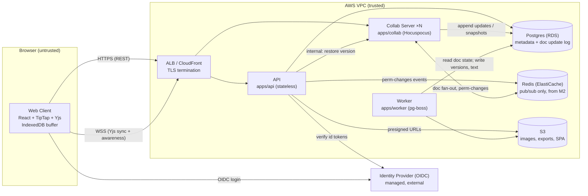
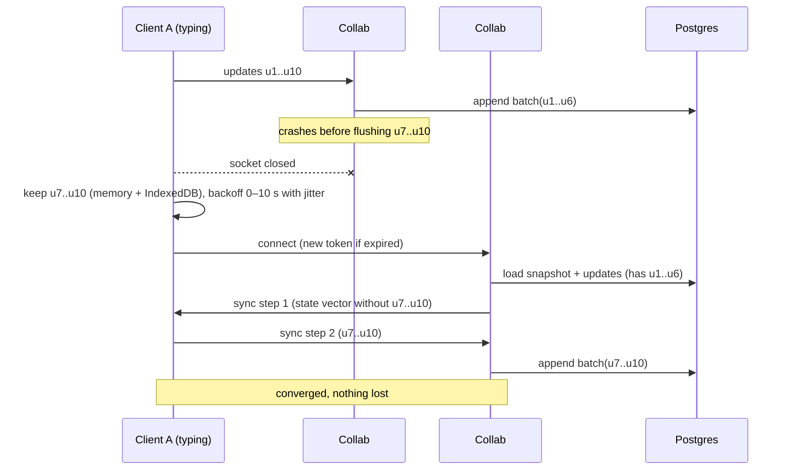

# Real-Time Collaborative Document Editor: Architecture and Build Plan

*Status: draft for review, 2026-10-03. The workspace has no existing code (`README.md` says it is intentionally empty), so this is a new build, and every claim about scale, team and stack is an assumption. The assumptions are marked **[A]** and collected in Section 5.*

---

## 1. Summary

- **What:** a web-based rich-text editor where several people edit the same document at once. Each person sees the others' changes and cursors within about a quarter of a second. Edits are never lost, even when servers crash or connections drop. **[A]** It is a multi-tenant B2B product for teams, private beta in about 4 months, built by 4–5 TypeScript engineers.
- **Shape:** one TypeScript monorepo deployed as three services plus a static site:
  - **Web Client** (React + TipTap/ProseMirror)
  - **API** (stateless HTTP: accounts, sharing, metadata)
  - **Collab Server** (Hocuspocus over WebSockets: live sync and document persistence)
  - **Worker** (background jobs)
  
  All of it sits on one managed Postgres. Redis is added in M2, only to fan out messages between Collab Server instances.
- **Key decisions:**
  1. **Yjs CRDT** for merging concurrent edits. A CRDT is a data structure that merges concurrent changes so every copy ends up identical.
  2. **Append-only update log plus compaction** in Postgres. Concurrent writers can never overwrite each other's edits.
  3. **Self-hosted Collab Server**, not a managed sync vendor. It is the core of the product, and the Yjs format keeps the exit open.
  4. **Short-lived signed collab tokens** from the API, with read-only enforcement and revocation done on the server.
  5. **A shared, versioned editor schema package** (`packages/doc-schema`). The server rejects clients on an outdated schema.
- **First milestone (3–4 weeks):** two people edit the same document in a real staging environment through the real CI/CD pipeline. Edits survive a forced Collab Server crash. Four spikes report on the hard parts: concurrent-edit correctness, large documents, schema changes, and running multiple instances.
- **Top risks:**
  - Content corruption or divergence under concurrent structural edits such as lists and tables.
  - Silent data loss in the persistence path.
  - Old clients removing content they don't recognise after a schema change.
  - The operating load of a stateful WebSocket tier on a small team.

## 2. Context and Goals

- **Problem:** teams draft documents together today by passing files around or locking documents. Edits get overwritten and versions get confused. **[A]** We are building a product with collaborative editing at its core, not adding it to an existing product.
- **Goals:**
  - Concurrent editing with live presence (cursors and names).
  - No lost edits.
  - Sharing with owner, editor, commenter and viewer roles.
  - Version history with restore.
  - Comments anchored to text.
  - Tolerance of short offline periods and reconnects.
- **Non-goals for the beta:**
  - Native mobile apps.
  - Offline-first use (creating documents while offline, or days of divergence).
  - Spreadsheets and slides.
  - Suggestion or track-changes mode.
  - Visual diffs between versions.
  - End-to-end encryption.
  - SSO/SAML.
  - Multi-region.
  - AI features.
  - .docx import.
  - A public API.
- **Success measures, 90 days after beta:**
  - At least 3 design-partner teams use it weekly.
  - Zero confirmed data-loss incidents.
  - Edit propagation p95 under 250 ms (measured by a synthetic canary).
  - Under 0.5% of sessions see "unsynced changes" lasting more than 60 s.
  - Editing availability of 99.9% per month.

## 3. Drivers, Requirements, and Constraints

**Ranked quality attributes** (all targets are **[A]** until confirmed):

| # | Attribute | Measurable target | Why it matters |
|---|---|---|---|
| 1 | **Data integrity: convergence and durability** | 100% convergence in fuzz tests. Zero edits lost once the server has received them and the author's client survives. Server-side window of possible loss ≤ 1 s. Database recovery point ≤ 5 min | One corrupted or lost document destroys trust in an editor. This is the reason the product exists |
| 2 | **Collaboration latency** | Remote edit visible p95 < 250 ms, p99 < 500 ms (same continent). Local typing to screen p95 < 50 ms on a 50-page document. Document open p95 < 1.5 s for 1 MB of state | "Real-time" is the feature |
| 3 | **Time to market** | Private beta with design partners in 14–17 weeks | The deadline is assumed. It favours mature libraries and managed infrastructure |
| 4 | **Access control** | Viewers cannot write (enforced on the server). Revoked users are disconnected within 10 s | Documents hold confidential business content |
| 5 | **Operability and cost** | ≤ 1 on-call engineer. Infrastructure ≤ $1.5k/month at beta scale, excluding the identity provider | A small team running a stateful tier |

At equal cost, integrity beats latency. For example, writes are batched every 500 ms rather than every keystroke, but authoring clients keep unpersisted edits until the server has them, and nothing is dropped to go faster.

**Key functional requirements that shape the structure:**
- Live sync plus presence.
- Server-enforced roles per document.
- Version restore.
- Comments anchored to text ranges that survive later edits.
- Reconnect after connection loss with local edits buffered.
- Images.

**Constraints [A]:**
- 4–5 engineers who are strong in TypeScript and React, with one comfortable with infrastructure.
- AWS, no organisation-wide platform.
- GitHub for code and CI.
- Ordinary confidential business data with GDPR obligations. No HIPAA or PCI.
- Single region (EU or US, to be confirmed).

**Hard parts:**
1. **Concurrent-edit correctness for rich text.** Concurrent list nesting, block splits and joins, and tables are where editor-to-CRDT bindings have edge cases, and the result is corrupted content.
2. **Durable persistence with several writers.** Crashes, deploys and two server instances holding the same document must never lose an edit.
3. **Schema changes.** An old client that doesn't know a new node type may drop it and send that deletion to everyone.
4. **Permissions inside a CRDT.** A CRDT can't partially accept an update, so access has to be enforced at the connection level, and revocation has to reach long-lived sockets.
5. **Running stateful WebSockets.** Deploys drop connections, reconnect storms follow, load balancer idle timeouts cut connections, and memory grows with large documents.

## 4. Current State

There is nothing to build on. The workspace contains only `README.md`, which says it holds no code, configuration or data. The plan sets these conventions:
- A pnpm-workspaces monorepo, TypeScript 5.x in strict mode, Node 22 LTS.
- Vitest for tests, Playwright for end-to-end tests.
- Plain SQL migrations with `node-pg-migrate`.
- Terraform in `infra/`, deployed through GitHub Actions.
- Configuration in environment variables, secrets in AWS Secrets Manager.

If an organisation stack exists, Section 5 lists what would change.

## 5. Assumptions and Open Questions

**Assumptions**

| Assumption | Impact if wrong | How and when validated |
|---|---|---|
| Rich-text documents similar to Google Docs, not a block or database tool like Notion and not a code editor | The editor framework and schema change, along with parts of M1 | Product owner confirms in week 1 |
| Up to 10k monthly active users, 1k documents open at once, 5k connections, typically 2–5 and at most 50 editors per document | Hundreds of editors per document would need presence throttling or redesigned fan-out | Product confirms in week 1. Spike S2 measures the limits |
| Documents ≤ about 100 pages, ≤ 5 MB of Yjs state | Larger documents need lazy loading or splitting | S2 |
| Team of 4–5, TypeScript strong, AWS, GitHub | Different language or cloud: the topology stays, the tooling changes | Engineering lead confirms in week 1 |
| Ordinary confidential data, GDPR, single region | Residency or end-to-end encryption changes storage, search and server validation | Legal/security confirms by end of M1 |
| Team is willing to run a stateful WebSocket tier | If not, switch to a managed Yjs provider (see D3) | Lead decides at the M1 review |
| Being offline for minutes to hours is enough for the beta | Offline-first needs conflict UX and local document creation | Product confirms in week 1 |

**Open questions:** these are repeated at the end. Each has a default that is used if no answer arrives.

| Question | Owner | Default | Needed by |
|---|---|---|---|
| Document model: rich text or blocks? | Product | Rich text | Week 1 (blocks the schema, task T6) |
| Maximum concurrent editors per document | Product | 50 | Week 2 (S2 targets) |
| Cloud and identity provider already chosen? | Eng lead | AWS + WorkOS or Auth0 (OIDC) | Week 1 (blocks T3 and the M2 identity work) |
| Data residency region | Legal | Single EU region | End of M1, before production exists |
| Is a managed sync vendor acceptable? | Eng lead / security | No, self-host | M1 review |

## 6. Architecture Overview



**How it fits together.**
1. The Web Client logs in through the identity provider and calls the API for document metadata and a **collab token**. A collab token is a 5-minute JWT naming the user, the document, the user's role and the schema version.
2. The client opens a WebSocket to any Collab Server instance. That instance loads the document into memory (latest snapshot plus later updates from Postgres), runs the Yjs sync handshake, and broadcasts updates to the document's other connections.
3. If the document is open on other instances, the update also goes to them through Redis.
4. The instance appends batched updates to Postgres every 500 ms.
5. The Worker runs background jobs (version snapshots, text extraction, exports). It reads document state but never writes to the live document.
6. Anything that changes live content (for example, restoring a version) goes through the Collab Server. That makes it the **single writer of document content**.

The browser is untrusted. Everything inside the VPC is trusted, and only the ALB and CloudFront are public.

**Component table**

| Component | Responsibility | Owns (sole writer) | Exposes | Technology | Key dependencies |
|---|---|---|---|---|---|
| Web Client (`apps/web`) | Editing UI, presence, connection-status UX, local buffer | IndexedDB copy of open documents | — | React, Vite, TipTap (ProseMirror), Yjs, `@hocuspocus/provider`, `y-indexeddb` | API, Collab Server, IdP |
| API (`apps/api`) | Accounts, workspaces, document metadata, sharing, comments, attachments, collab-token issuing | `users`, `workspaces`, `workspace_members`, `documents`, `document_permissions`, `comment_threads`, `comments`, `attachments`, `audit_log` | REST `/v1/*` (JSON, OpenAPI from zod). Publishes `perm-changes` | Node 22, Fastify, zod | Postgres, Redis, S3, IdP |
| Collab Server (`apps/collab`) | Live sync, awareness, durable persistence and compaction of content, connection-level authorisation | `doc_updates`, `doc_snapshots` | WSS (Yjs and Hocuspocus protocol). Internal HTTP `/internal/docs/:id/restore` | Node 22, Hocuspocus, Yjs, y-prosemirror | Postgres, Redis |
| Worker (`apps/worker`) | Version snapshots, plain-text and ProseMirror JSON extraction, exports, hard deletes | `doc_versions`, `doc_text`, export files | pg-boss jobs | Node 22, pg-boss | Postgres, S3, Collab Server internal endpoint |
| `packages/doc-schema` | One editor schema and `SCHEMA_VERSION` shared by client, server and worker | — | TS library | TipTap extensions | — |
| Postgres | System of record | — | — | RDS Postgres 16, Multi-AZ in production | — |
| Redis | Fan-out between instances and permission events. **Not a store** | Nothing durable | Pub/sub | ElastiCache | — |

## 7. Component Details

### Collab Server (the most important component)

- **Does:** authenticates socket connections, holds documents in memory, relays Yjs updates and awareness (presence), persists content, compacts the log, applies server-side content changes such as restores.
- **Does not do:** check permissions beyond what the token says, handle metadata or titles, or search.
- **Interfaces:**
  - WebSocket at `wss://collab.<domain>/` using the Hocuspocus protocol. The protocol version is pinned in `packages/contracts`.
  - Maximum message size 1 MB. Application heartbeat every 30 s, because the ALB idle timeout is set to 300 s.
  - Internal HTTP is reachable only from the VPC security group.
  - Load at the assumed peak: 5k sockets and around 2k updates per second inbound.
- **Internal structure:**
  - `auth/` is the `onAuthenticate` hook. It verifies the JWT, checks the document ID matches, sets `readOnly` for viewers and commenters, and refuses clients whose schema version is below the document's minimum.
  - `persistence/` holds the load, append and compaction logic (see Section 8).
  - `fanout/` uses the Hocuspocus Redis extension (from M2).
  - `lifecycle/` handles SIGTERM: stop accepting connections, flush every buffer, close sockets with a close code that makes clients reconnect after a random 0–10 s delay.
- **Failure and recovery:**
  - **Instance crash:** clients reconnect to another instance. The Yjs handshake exchanges state vectors (summaries of which updates each side has), so updates from the ≤ 500 ms that weren't yet written are re-sent by the clients that made them.
  - **Postgres write failure:** updates stay in the in-memory buffer and are retried with backoff. After 30 s of failure `/readyz` reports unhealthy and new connections stop arriving. If the buffer exceeds 50 MB per instance, the instance closes connections so clients keep their edits locally instead of the server holding them at risk.
  - **Redis outage:** cross-instance fan-out stops. Each instance's clients still converge with each other, and documents converge across instances on the next load or reconnect. Clients see slower sync, not lost data. Alert fires.
- **Scaling:** horizontal, with any instance able to serve any document (D5). Memory is the binding limit: roughly 1k loaded documents × up to 5 MB, to be confirmed in S2. Documents are unloaded 30 s after the last client leaves.

### API

A routine stateless CRUD service.
- Collab tokens are signed with RS256. The private key is in Secrets Manager. Collab Server holds only the public key.
- Every sharing change writes `audit_log` and publishes `{docId, userId}` on Redis channel `perm-changes`. Collab Server closes that user's connections to that document with close code 4403.
- If an event is missed (Redis blip), a 12-hour maximum socket lifetime forces re-authentication.
- Scales horizontally behind the ALB.

### Worker

pg-boss queues live in Postgres, so no new infrastructure is needed.
- Jobs: `version.auto` (every 10 minutes of activity on a document), `text.extract` (plain text plus ProseMirror JSON for search and as a format-neutral backup), `export.markdown`, `doc.hardDelete`.
- Jobs are idempotent, keyed by `(docId, upToSeq)`. Failures retry 5 times, then go to a dead-letter queue that can be inspected in the admin view.

### Web Client

- TipTap with the `Collaboration` and `CollaborationCursor` extensions.
- `y-indexeddb` keeps edits made while offline or before the server has them.
- The status indicator shows Saved, Syncing or Offline, driven by the provider's `unsyncedChanges`. If changes stay unsynced for more than 60 s, the client sends telemetry.
- Presence updates are throttled to 5 Hz per client to limit fan-out.
- On close code 4403 the client clears that document's IndexedDB copy. On a "schema outdated" close it prompts the user to reload.

## 8. Data Design

**Entities:**
- A workspace has members and documents. A document has permissions, an update log, a snapshot, versions, extracted text, comment threads with comments, and attachments.

| Table | Writer | Notes |
|---|---|---|
| `documents(id, workspace_id, title, created_by, min_schema_version, deleted_at, …)` | API | The title lives outside the CRDT for the beta (last write wins, see D10) |
| `document_permissions(document_id, principal_type user/workspace/link, principal_id, role)` | API | Index on `(principal_type, principal_id)` for "docs I can see" |
| `doc_updates(doc_id, seq bigserial, update bytea, bytes int, created_at)` | Collab Server | **Append-only.** Primary key `(doc_id, seq)`. Each row is a merged batch of about 500 ms of Yjs updates |
| `doc_snapshots(doc_id PK, upto_seq, state bytea, updated_at)` | Collab Server | Latest compacted state only |
| `doc_versions(id, doc_id, kind auto/named, label, state bytea, created_by, created_at)` | Worker (auto). Named versions via a Worker job triggered by the API | Full-state copies (D9) |
| `doc_text(doc_id PK, plain text, pm_json jsonb, tsv tsvector, upto_seq)` | Worker | Search, plus a backup format that doesn't depend on Yjs |
| `comment_threads(id, doc_id, anchor_start bytea, anchor_end bytea, resolved)`, `comments(…)` | API | Anchors are encoded Yjs RelativePositions, so they follow the text through later edits |
| `attachments(id, doc_id, s3_key, mime, size)` | API | Uploaded with presigned S3 PUTs, size ≤ 20 MB |
| `audit_log` | API | Sharing changes, deletes, restores. Insert-only role |

**Consistency:**
- **Document content** gets its correctness from the CRDT. Merging is commutative and idempotent, so an append-only log means two instances writing updates for the same document can't lose each other's edits. Re-applying a duplicate update does nothing.
- **Compaction** is the only step that rewrites data. In one transaction under `pg_advisory_xact_lock(hash(doc_id))` it reads the snapshot plus updates up to sequence N, writes a merged snapshot at `upto_seq = N`, and deletes updates ≤ N. Updates appended concurrently get sequence numbers above N and are untouched.
- Compaction runs in the Collab Server when a document loads (if there are more than 500 rows or more than 1 MB of updates) and when it unloads.
- **Metadata and permissions** use ordinary single-row transactions in the API. Permission changes reach Collab Server through events, so they are eventually consistent within 10 s, with the 12-hour lifetime as a backstop.

**Access patterns:**
- Document load: one snapshot row plus a range scan on `(doc_id, seq > upto_seq)`.
- Write: around 1–2 inserts per second per actively edited document, so about 2k per second at peak. A Postgres r6g.large handles this comfortably. S2 confirms.

**Retention and deletion:**
- Deleting a document is a soft delete for 30 days, then `doc.hardDelete` removes every row and S3 object.
- Auto versions are kept for 90 days in the beta. Thinning is deferred.
- Deleting a user account removes their identity data and keeps the content they wrote in shared documents, attributed to "former member". This needs legal confirmation.
- Backups: RDS point-in-time recovery for 14 days, so database-level data loss is ≤ 5 min. Restore target ≤ 1 h. Restore drill in M4.

**Classification:**
- Document content, comments and attachments are confidential: encrypted at rest (RDS and S3 KMS), never logged.
- Logs contain IDs and sizes only.
- Email and name are personal data.

**Schema evolution:**
- **Database:** expand and contract. Add columns or tables first, backfill, switch reads, then remove the old structure in a later release. Migrations run in CD before the app deploys and must work with the previous app version.
- **Editor schema:** changes must be additive. New node or mark types increment `SCHEMA_VERSION`.
- When an updated client first writes a new node type into a document, Collab Server raises `documents.min_schema_version`. Older clients are refused with "reload". This rule is confirmed or relaxed by S3.

## 9. Key Flows

**Flow 1: Open and edit (normal path)**
1. The client calls `GET /v1/docs/:id`. The API checks the permission and returns metadata plus a collab token (`sub`, `doc`, `role`, `sv`, `exp` = 5 min).
2. The client loads its IndexedDB copy, if one exists, for an instant first render. It then opens a WebSocket and sends the token.
3. Collab Server's `onAuthenticate` verifies the signature, expiry and document ID. It sets `readOnly` for viewers and checks the schema version.
4. `onLoadDocument` (if the document isn't already in memory): read the snapshot, then updates ordered by `seq`, and apply them to a Y.Doc.
5. Sync handshake: the two sides exchange state vectors and each sends the other what it is missing.
6. The user types. The update goes to the server, which broadcasts it to local connections and over Redis. The update is also buffered, merged with `Y.mergeUpdates`, and inserted into `doc_updates` every 500 ms or 64 KB. Other clients render it, with a target of p95 < 250 ms.

**Flow 2: Collab Server instance dies mid-session (failure path)**



Edits are lost only if the server crashes *and* the author's device is lost before it reconnects and before IndexedDB has written. That is the residual risk for driver 1. A duplicate update (u7 sent twice) has no effect.

**Flow 3: Access revoked while connected**
1. The owner removes Bob. The API deletes the permission row, writes `audit_log`, and publishes `{doc, user: bob}` on `perm-changes`.
2. Every Collab Server instance closes Bob's sockets for that document with code 4403. Bob's client clears its local copy and shows "Access removed".
3. Bob's client tries to reconnect. The API refuses a new token with 403.
4. If the Redis event was lost, Bob keeps access for at most 12 hours (the socket lifetime). This is an accepted beta risk. Revisit if customers need instant revocation.

**Flow 4: Outdated client meets a newer document**
1. A client built at `sv=1` connects to a document with `min_schema_version=2`.
2. `onAuthenticate` rejects it with "schema outdated". The client shows "A new version is available. Reload."
3. The client never loads content it can't represent, so it can't strip that content and send the deletion to others.

## 10. Key Decisions

| # | Decision | Options considered | Rationale (against the drivers) | Reversibility | Revisit if |
|---|---|---|---|---|---|
| D1 | **Yjs CRDT** for sync | Yjs. Operational transformation (ShareDB). ProseMirror's built-in collab with a central authority. Automerge | Yjs is the most mature option with a proven ProseMirror binding, awareness, binary updates, and offline merging (drivers 1–3). OT and the central-authority approach need a single authoritative server per document and can't merge offline edits. Automerge's rich-text binding is younger | **Hard.** The stored format and document model depend on it | S1 finds divergence or content loss that schema restrictions can't avoid → fall back to ProseMirror central-authority collab |
| D2 | **TipTap/ProseMirror** editor | TipTap/ProseMirror. Lexical. Slate | Strict schema (good for integrity), the reference Yjs binding, and a large extension ecosystem (driver 3) | **Hard** once documents exist | Product turns out to be block-based → re-check Lexical and BlockNote |
| D3 | **Self-host Hocuspocus** in Collab Server | Hocuspocus. Managed (Liveblocks, Y-Sweet, TipTap Cloud). Custom `y-websocket` | We control auth hooks, persistence in our own database, residency and cost. Hocuspocus provides hooks, Redis fan-out and read-only connections, so we build less than with raw `y-websocket` | **Medium.** Managed providers speak Yjs, so data and client code move over | The team won't own a stateful tier, or S2/S4 show more operating load than 1 on-call engineer can carry → move to a managed Yjs provider |
| D4 | **Append-only update log + locked compaction** | Append log. Overwrite the full state on a debounce (Hocuspocus default database extension) | Overwriting the state from two instances can lose edits. Appending is safe by construction (driver 1) and lets us bound loss to ≤ 1 s | Medium (it's a storage layout, migratable) | Postgres write volume becomes a bottleneck → batch longer, or move snapshots to S3 |
| D5 | **Any instance serves any document, with Redis fan-out** | Redis fan-out. Route each document to one instance | Correct with any routing because of D4. No custom load-balancer hashing. AWS ALB can't hash on path | Easy | S4 shows Redis adds > 100 ms p95, or memory is doubled by documents loaded on many instances → route by document |
| D6 | **Three deployables plus static site, one monorepo** | Single process. API + Collab + Worker split. Microservices per feature | Collab Server is stateful and disruptive to deploy, and scales by connections. The API deploys often and statelessly. Splitting only these follows different scaling and release cadence. One monorepo shares `doc-schema` | Easy | — |
| D7 | **Managed OIDC identity provider + 5-minute RS256 collab tokens** | Managed provider + token. Cookies sent on the WebSocket. Building our own auth | Short-lived tokens with document scope stop a stolen token being reused on other documents. Collab Server needs no database access to API tables (driver 4). A managed provider saves weeks | Medium (user IDs mapped via `idp_subject`) | Enterprise SSO needs a provider with SAML → pick one supporting it (WorkOS) |
| D8 | **pg-boss** job queue | pg-boss. SQS. BullMQ on Redis | No new durable infrastructure. Redis stays disposable (driver 5) | Easy | Job volume > 100/s sustained |
| D9 | **Versions are full-state copies, Yjs garbage collection on. Restore applies a forward change** | Full copies. Native Yjs snapshots (need garbage collection off) | With garbage collection off, deleted content is kept forever and memory and size grow without limit (drivers 2, 5). A forward restore keeps every client converged | Medium | Visual diff becomes a requirement → store Yjs snapshots for named versions only |
| D10 | **Title and metadata outside the CRDT** | Postgres via API. A Y.Text field inside the document | Simpler listing, search and permissions. Concurrent title edits are rare | Easy | Users complain about title overwrites |
| D11 | **TypeScript everywhere, AWS (ECS Fargate, RDS, ElastiCache)** | TS/Node. Rust (y-crdt) for the collab tier | Yjs's reference implementation is JS, and client and server must share the schema code (drivers 1, 3) | **Hard** (platform) | S2 shows the Collab Server is CPU-bound below target → the Rust port of Yjs for server-side merging |

## 11. Cross-Cutting Concerns

- **Security** (authorisation matrix tests in M1; full set in M2; pen test in M4):
  - OIDC login, API session cookie (HttpOnly, SameSite=Lax), CSRF token on state-changing REST calls.
  - Every REST handler checks the permission on the server through one `authorize(user, doc, action)` module.
  - Collab Server enforces read-only per connection.
  - Secrets in Secrets Manager. TLS everywhere. KMS encryption at rest.
  - Dependency scanning (`pnpm audit` and Dependabot) plus image scanning in CI from M1.
  - **Top threats and mitigations:**
    - Viewer sends write messages → server-side `readOnly`, tested in CI.
    - Stolen collab token → 5-minute lifetime, scoped to one document.
    - Malicious editor sends malformed Yjs structures that crash other clients → 1 MB message cap, 10 MB document state cap, optional server-side schema validation (M4), restore from version.
    - XSS through pasted content or links → ProseMirror schema parsing removes unknown markup. Links limited to `http`, `https` and `mailto`. Strict Content Security Policy.
    - Cross-tenant access through ID guessing → UUIDv7 IDs, and authorisation always checked; IDs never trusted alone.
- **Reliability:**
  - Targets: 99.9% editing availability. Collab Server recovery < 5 min, with clients automatically back within 30 s.
  - Timeouts on all database calls (2 s for queries, 5 s for loads). Idempotent appends.
  - Reconnect backoff with jitter (0–10 s, up to 30 s).
  - Bounded buffer and backpressure, as in Section 7.
  - `/readyz` checks the database is reachable and the flush backlog is under 10 s.
  - Multi-AZ RDS and ≥ 2 Collab Server tasks from M2.
- **Observability** (baseline in M1; canary and alerts in M2; dashboards in M3):
  - Structured logs (pino) carrying `conn_id`, `doc_id`, `user_id`, and never content.
  - OpenTelemetry metrics: active sockets, loaded documents, inbound update rate, flush latency, flush failures, unflushed buffer age, document load time, compaction duration.
  - Sentry for client errors and `unsynced > 60s` telemetry.
  - **Synthetic canary** (M2): two headless clients in production edit a canary document every minute and measure round-trip propagation.
  - **Alerts, each with a runbook:**
    - Canary p95 > 1 s for 5 min.
    - Canary fails to converge (once).
    - Flush failures for > 2 min.
    - Unflushed buffer age > 10 s.
    - Sessions with unsynced changes > 1%.
    - WebSocket handshake error rate > 2%.
- **Performance and capacity:**
  - Expected bottlenecks: Collab Server memory (document size × loaded documents), presence fan-out (O(n²) per document, which is why it is throttled), Postgres insert rate.
  - Measured in S2 (M1). Load test at 2× peak (10k sockets, 2k active documents) with `tools/loadgen` (headless provider clients) in M3, and again before beta in M4.
- **Cost** (rough, at beta scale):
  - About $250/month for Fargate (2 Collab Server, 2 API, 1 Worker).
  - About $400 for RDS Multi-AZ r6g.large, about $60 for ElastiCache, about $50 for ALB, S3 and CloudFront.
  - Total roughly **$800–1,200/month** plus the identity provider, which is priced per monthly active user and may be the largest line item. Check pricing in week 1.
  - Controls: AWS Budgets alert at $1.5k, resources tagged by `app` and `env`.
- **Operations:**
  - The team owns all of it. One weekly on-call rota starts at beta (M4). Runbooks live in `docs/runbooks/`: collab flush failing, reconnect storm, Redis down, database failover, restore a document from versions, point-in-time recovery.
  - Support can restore a version for a user from an admin tool built in M3.
- **AI-specific concerns:** not applicable. There are no AI features in scope (Section 2).

## 12. Build Sequence

**Team assumption:** 4 engineers (2 full-stack leaning frontend, 1 backend, 1 backend/platform), plus part-time PM and design. Sizes are rough guides, not commitments.

```
Week:        1   2   3   4   5   6   7   8   9  10  11  12  13  14  15  16
M1 Slice    [=========== ]                                            ← critical path
  Spikes S1–S4  [=======]
M2 Usable           [=========== ]
M3 Beta features                    [================]
M4 Hardening + beta                                     [===========  ]
Long lead: IdP contract (wk1) · domain/TLS (wk1) · pen-test booking for wk 13 (wk2) · DPA/privacy policy (by wk 10)
```

**Critical path:** `doc-schema` (T6) → editor binding (T7) and Collab Server (T8) → persistence (T9) → staging slice (T15) → identity and permissions (M2) → versions and comments (M3, which depend on the persistence model and anchors) → load test and pen-test fixes (M4) → beta.

**Parallel tracks:** Platform (CI, infrastructure, observability), Editor (client), Collab (server and persistence), API (metadata and auth). Once `packages/contracts` defines the token and REST shapes in week 1, these tracks only meet at the slice.

| Milestone | Goal / risk cleared | Scope (in / out) | Deliverables | Exit criteria | Depends on | Size |
|---|---|---|---|---|---|---|
| **M1: Thin slice and spikes** | Prove sync, persistence and deploys end to end. Answer hard parts 1–3 and 5 | **In:** minimal schema, stub login, one hard-coded workspace, single region staging. **Out:** real identity, sharing UI, presence names, versions, comments, production | Monorepo, CI/CD, staging via Terraform, Web Client editor page, Collab Server with append-log persistence, API token issuing, fuzz harness in nightly CI, 4 spike reports | (1) Two users on different networks edit one staging document. Measured propagation p95 < 250 ms. (2) Killing the Collab Server task while 3 clients type → after reconnect, every edit is present and all clients are identical (scripted). (3) Viewer token can't change content (test). (4) Fuzz: ≥ 10k runs, 0 divergences. (5) S1–S4 reports reviewed. D1, D3, D4, D5 confirmed or changed | — | 3–4 wks |
| **M2: Usable by our own team** | Real users, sharing and access control (hard part 4). Reconnect UX. Production exists | **In:** OIDC login, workspaces, document list, create/rename/delete, share as owner/editor/viewer plus link sharing, revocation, presence cursors with names, IndexedDB buffer, schema gate, 2 Collab Server instances + Redis, production environment, canary and alerts. **Out:** comments, versions, images | Production stack, internal dogfooding | (1) Team uses it for all planning documents for 5 working days with no data-loss incident. (2) Authorisation matrix tests (role × action × REST/WS) pass. (3) Revoked user disconnected in < 10 s. (4) 30 min offline then reconnect merges correctly. (5) Rolling Collab Server deploy causes no lost edits (scripted) | M1 | 3–4 wks |
| **M3: Beta features** | Feature-complete for design partners | **In:** auto and named versions with restore, comments anchored to text, images, tables (only if fuzz with tables passes), export to Markdown, title and text search, admin restore tool, dashboards. **Out:** diff view, suggestions, SSO | Worker jobs, `doc_versions`, `doc_text`, comments UI | (1) Restoring a version while 3 clients are connected converges, and the result equals the version content. (2) Comment anchors survive the fuzz edit suite (≥ 95% stay attached, the rest marked orphaned, none crash). (3) Load test at 2× peak meets the Section 3 targets | M2 | 4–5 wks |
| **M4: Hardening and private beta** | Ready for real customer data | **In:** zero-downtime deploy drain, point-in-time restore drill, pen test and fixes, rate limits, GDPR delete and export, server-side schema validation (if S1/S3 show it's needed), runbooks, on-call, invite-only beta flag. **Out:** anything in Section 17 | Beta for 3 design partners | (1) Restore drill within 1 h. (2) No open high or critical pen-test findings. (3) 7 days of SLOs met in production. (4) 3 partner teams onboarded | M3. Pen test booked in week 2 | 3–4 wks |

Total: **13–17 weeks.** The most likely source of slippage is M1 spike results, especially S1.

## 13. First Milestone Task Breakdown

Week 1 starts all four tracks in parallel. Arrows show dependencies.

**Platform track**
- **T1. Scaffold the monorepo:** pnpm workspaces with `apps/{web,api,collab,worker}`, `packages/{doc-schema,contracts,db}`, `tests/{fuzz,e2e}`, `tools/loadgen`, `infra/`. Shared `tsconfig.base.json` (strict), ESLint, Vitest. *Done when* `pnpm -r build && pnpm -r test` passes locally and in CI. (Day 1–2, blocks everything.)
- **T2. Add CI** in `.github/workflows/ci.yml`: lint, typecheck, unit tests, `pnpm audit`, Docker builds for api/collab/worker, push to ECR on `main`. *Done when* a PR shows all checks and a merge produces images tagged with the git SHA. (After T1.)
- **T3. Provision staging with Terraform** in `infra/envs/staging` using modules in `infra/modules/{network,ecs-service,rds,alb,static-site}`:
  - VPC with private subnets.
  - RDS Postgres 16 (single-AZ in staging; this difference from production is deliberate and documented).
  - ECS Fargate cluster, ALB with HTTPS and WSS listeners and 300 s idle timeout, CloudFront + S3 for `apps/web`, Secrets Manager entries.
  - Remote state in S3 with a DynamoDB lock.
  
  *Done when* the pipeline applies it and `https://staging.<domain>/v1/healthz` and `wss://collab.staging.<domain>` respond. (Parallel with T1, T2. Needs the domain, a long-lead item.)
- **T4. Add CD** in `.github/workflows/deploy-staging.yml`: run `node-pg-migrate up`, then roll out the ECS services, then upload the web bundle. *Done when* a merge to `main` reaches staging in < 15 min with no manual steps, and a failed migration stops the deploy. (After T2, T3, T10.)
- **T5. Set up baseline observability:** pino JSON logs with `conn_id`/`doc_id`; OpenTelemetry metrics (active sockets, loaded documents, flush latency, flush failures, unflushed age, load time) exported to CloudWatch; Sentry in `apps/web`; one CloudWatch dashboard defined in Terraform. *Done when* staging shows live socket count and flush latency while the slice demo runs. (After T3. Parallel with the rest.)

**Editor track**
- **T6. Define schema v1** in `packages/doc-schema`: TipTap extensions for doc, paragraph, heading levels 1–3, bold, italic, strike, inline code, link (http/https/mailto), bullet list, ordered list, list item, blockquote, code block, hard break. Export `SCHEMA_VERSION = 1` and `buildSchema()`. *Done when* a snapshot test of the schema spec passes in both the jsdom (browser-like) and plain Node test environments. (Day 2–3. **Needs the open question on rich text vs blocks answered.**)
- **T7. Build the editor page** `/d/:docId` in `apps/web` with TipTap, the Collaboration extension and `HocuspocusProvider`, a status indicator (Saved / Syncing / Offline from `unsyncedChanges`), and a stub login screen choosing "alice", "bob" or "viewer-vic". *Done when* two local browser windows see each other's typing and the indicator reaches Saved within 1 s of stopping. (After T6, T8 locally.)

**Collab track**
- **T8. Stand up the Hocuspocus server** in `apps/collab/src/server.ts` with `/healthz` (process up) and `/readyz` (database reachable, flush backlog < 10 s), 1 MB maximum message, 30 s heartbeat, SIGTERM handler that flushes buffers and closes with a reconnect code. *Done when* integration tests cover readiness changing on database loss and a flush on SIGTERM. (After T1.)
- **T9. Write the persistence extension** in `apps/collab/src/persistence/`:
  - `load(docId)` reads the snapshot plus updates with `seq > upto_seq`, in order.
  - A Y.Doc `update` listener feeds a per-document buffer. It flushes every 500 ms or 64 KB using `Y.mergeUpdates` and a single INSERT.
  - Failed flushes retry with backoff without dropping the buffer.
  - At more than 50 MB of buffered data per instance, the server closes connections.
  
  *Done when* an integration test passes using Testcontainers Postgres (a real database started in a container for the test). The test: 3 headless clients make 1,000 random edits, `kill -9` the server mid-stream, restart it, and let clients reconnect. The final state is identical across clients and equal to a fresh load from the database. Also run the same test with a Postgres pause instead of a kill. (After T8, T10. **Critical path.**)
- **T10. Write the initial migration** `packages/db/migrations/0001_init.sql`: `users`, `workspaces`, `documents` (including `min_schema_version`), `document_permissions`, `doc_updates`, `doc_snapshots` with the keys from Section 8. *Done when* `up` and `down` run cleanly in CI against an empty Postgres 16. (Day 2–3.)
- **T11. Implement compaction on load and unload** in `apps/collab/src/persistence/compact.ts`: a transaction under `pg_advisory_xact_lock`, triggered above 500 rows or 1 MB. *Done when* a test with two server processes loading and editing the same document at once shows no lost updates after 100 compaction cycles. (After T9.)

**API track**
- **T12. Define the contracts** in `packages/contracts`: zod schemas for collab-token claims (`sub`, `doc`, `role`, `sv`, `exp`), `POST /v1/docs`, `GET /v1/docs/:id`, `POST /v1/docs/:id/collab-token`. *Done when* API and Collab Server both import them and the build passes. (Day 2. Unblocks parallel work.)
- **T13. Build the API skeleton** in `apps/api`: Fastify with the three endpoints, RS256 signing with the key from Secrets Manager, and `AUTH_MODE=stub` (fixed users, one workspace). Config validation refuses to start with `stub` when `NODE_ENV=production`. *Done when* contract tests pass and the production config with stub mode fails at startup in a test. (After T10, T12.)
- **T14. Add authentication in Collab Server** in `apps/collab/src/auth/`: verify the signature, expiry, document match and schema version; set `readOnly` for viewers. *Done when* tests show forged, expired and wrong-document tokens are refused, and a viewer's updates are neither applied nor persisted. (After T8, T12.)

**Integration**
- **T15. Deploy the slice to staging and write the demo script** `docs/demo/m1.md`, plus a Playwright test in `tests/e2e/collab.spec.ts` with two browser contexts that measures propagation. *Done when* M1 exit criteria 1–3 are shown in staging. (After T4, T7, T9, T14.)

**Spikes.** Each spike ends with a 1–2 page report in `docs/spikes/`.

| Spike | Question | Time box | What gets built | Result that changes the plan |
|---|---|---|---|---|
| **S1: Convergence fuzz** (`tests/fuzz/`) | Do Yjs and y-prosemirror with schema v1 converge without content loss under concurrent structural edits (nesting and unnesting lists, block splits and joins, overlapping marks, paste) with delayed, reordered and dropped messages and reconnects? | 4 days, starts after T6 | Property-based harness: N ProseMirror editors in jsdom, a simulated network, random transactions, then assert identical documents that are valid under the schema. Runs nightly in CI | Divergence or loss we can't fix → drop the affected feature from the schema, report it upstream. If it is systemic, reopen D1 (central-authority collab). Tables join the schema in M3 only after passing the same harness |
| **S2: Large documents and capacity** (`tools/loadgen`) | Server memory per loaded document. Open time. Typing latency on a 100-page document with 50 editors. Sockets per 1 vCPU/2 GB task. Postgres insert rate at peak | 3 days, after T9 | Seeded documents of 1 and 5 MB, headless clients, a mid-range laptop profile | Over 1.5 s to open or over 50 ms typing latency → set a document size cap and plan lazy loading. Less than 3k sockets per task, or CPU-bound → plan bigger tasks or reopen D11 (Rust server) |
| **S3: Schema mismatch** | What does a client on schema v1 do with a document containing a v2 node type: drop it, throw, or send a deletion? | 2 days, after T7 | A v2 schema with a `callout` node. A v1 client and a v2 client in one document | Destructive behaviour (expected) → keep the strict `min_schema_version` gate (Flow 4). Harmless → relax to a warning and allow it |
| **S4: Multi-instance** | With 2 Collab Server instances and Redis fan-out, how much latency does it add, and does persistence stay correct with both appending? Is Hocuspocus' Redis extension behaviour on store and locking compatible with our custom persistence? | 2 days, week 3 | Local docker-compose with 2 instances and Redis. Clients split across them. Rerun the T9 kill test | Added p95 > 100 ms, or extension conflicts → route documents to one instance (D5) or write our own small fan-out layer |

**Day-1 long-lead actions:** choose and contract the identity provider; register the domain and TLS certificates; confirm AWS account and Fargate/ElastiCache quotas; request pen-test quotes for week 13.

## 14. Testing and Validation Strategy

| Risk | Test type | Where | Blocks release? |
|---|---|---|---|
| Divergence or corruption (driver 1) | Convergence fuzz (S1 harness): 1k runs on each PR touching `doc-schema`/`collab`, 50k nightly | `tests/fuzz` | Yes. Any divergence |
| Lost edits | Crash, pause and deploy durability tests (T9, T11, M2 rolling deploy) | `apps/collab` integration with Testcontainers, plus a staging script | Yes |
| Schema compatibility | Compatibility test: the previous release's `doc-schema` against the current one (S3 scenario) | CI | Yes, for any `SCHEMA_VERSION` change |
| Access control | Authorisation matrix (role × action × REST/WS) | `apps/api`, `apps/collab` | Yes |
| Contract drift | Zod contract tests shared through `packages/contracts` | CI | Yes |
| User flows | Playwright with 2–3 browser contexts: edit, presence, offline, revoke, restore | `tests/e2e` against staging | Yes, the smoke subset |
| Latency and capacity (driver 2) | Load test at 2× peak with `tools/loadgen`. Production canary | Staging (M3, M4). Production (from M2) | Pre-beta gate |
| Security | Dependency and image scanning (CI), external pen test (M4) | — | High or critical findings block |
| Recovery | Point-in-time restore drill to a scratch instance, timed | M4 | Yes, before beta |

Test data is generated: fuzz seeds and synthetic documents. No production content is copied. The Section 3 targets are checked with the Playwright propagation measurement (M1), the canary (M2 onward), the load-test report (M3/M4) and the restore drill (M4).

## 15. Rollout, Migration, and Rollback

- **Rollout:**
  - Internal dogfooding from M2.
  - Invite-only private beta in M4 behind a `beta_access` workspace flag.
  - Comments, versions and tables each sit behind a workspace-level flag so they can be switched off without a deploy.
- **Migration:** none. This is a new build. No existing data.
- **Rollback:**
  - Apps roll back by redeploying the previous image SHA through `deploy-*.yml`, which takes < 10 min.
  - Database migrations follow expand and contract, so the previous app version always runs against the current schema.
  - Collab Server rollback is a rolling deploy with the drain (Section 7).
  - **Point of no return:** an editor schema version can't be rolled back once documents contain its new nodes. The gate would lock out the older clients. So schema bumps ship in this order: the server and client release that *understands* the new node first, then a later flag that lets users *create* it. Turning that flag off stops new use, but existing content stays.
  - The overall format (Yjs + ProseMirror) can't be undone once external users have documents (start of M4). `doc_text.pm_json` is the escape route if a format migration is ever needed.

## 16. Risks and Mitigations

| Risk | Likelihood | Impact | Mitigation | Early warning sign | Owner |
|---|---|---|---|---|---|
| Binding edge cases corrupt content under concurrent edits | Medium | Critical | S1 fuzzing in M1 and nightly. Restrict the schema. Versions for recovery | Fuzz failures. Sentry errors from y-prosemirror | Editor lead |
| Edits lost in the persistence path | Low | Critical | Append log, crash tests, IndexedDB buffer, flush alerts | Unflushed age alerts. Users reporting "missing text" | Collab lead |
| Old client strips new content | High without the gate | High | S3 + `min_schema_version` gate + ordered schema rollout | S3 result | Editor lead |
| Stateful tier operating load is more than the team can carry | Medium | Medium | Drain on deploy, runbooks, canary. D3 keeps the managed-provider exit | On-call pages > 2/week in M2–M3 | Platform lead |
| Large documents or many editors exceed memory or latency | Medium | Medium | S2. Size cap. Presence throttling | S2 numbers. Canary p95 creeping up | Collab lead |
| Revocation event lost (Redis) | Low | Medium | 12-hour socket lifetime. Audit log. Consider rechecking permissions on a timer later | Revocation e2e test flaking | API lead |
| Malicious editor sends malformed updates that crash peers | Low | Medium | Message and document caps. Optional server validation (M4). Restore | Client crash clusters on one document | Collab lead |
| Identity provider choice or contract slips | Medium | Medium (M2 slips) | Decide in week 1. Stub mode keeps M1 moving | No contract by end of week 2 | Eng lead |
| Product shape changes (blocks, offline-first) after M1 | Medium | High | Confirm open questions in week 1 | Design partner feedback | PM |
| Estimates optimistic for a team new to CRDTs | Medium | Medium | Spikes up front. Ranges. Fallback is to cut M3 scope (tables, search) before the beta date | M1 runs past 4 weeks | Eng lead |

## 17. Deferred Work and Future Evolution

| Deferred | Trigger to build |
|---|---|
| SSO/SAML, SCIM | First enterprise deal |
| Suggestion / track-changes mode, visual version diff | Design-partner demand (diff needs D9 revisited for named versions) |
| Offline-first and mobile apps | Product decision. Needs conflict UX and local document creation |
| Multi-region and data residency per tenant | Customer residency requirement. Approach: a separate regional stack per tenant, not shared global state |
| Routing documents to one instance; Rust server merging | S2/S4 or production metrics exceed thresholds |
| Moving snapshots and versions to S3; thinning versions | Database storage > 200 GB or rows > 1 MB on average |
| Collaborative titles (Y.Text) | Complaints about title overwrites |
| Instant revocation guarantee (timed recheck) | Customer security requirement |
| AI features, public API, .docx import | Product roadmap |

**Extension points:** `packages/doc-schema` (new node types through the gated process), the persistence interface in `apps/collab/src/persistence/` (lets storage be swapped), Worker jobs (new background processing), `perm-changes` events (more consumers).

**Shortcuts taken on purpose:**
- Titles use last write wins.
- Revocation can be delayed by up to 12 hours if an event is lost.
- Staging is single-AZ.
- Orphaned comment anchors are marked, not repaired.

Each is revisited at the M4 retrospective.

## 18. Next Steps

1. **PM, by end of week 1:** answer the open questions, especially rich text vs blocks, because it blocks T6.
2. **Eng lead, day 1:** choose the identity provider (default WorkOS or Auth0), register the domain, confirm AWS account and quotas, request pen-test quotes.
3. **Any engineer, today:** do T1 (`pnpm init`, create `pnpm-workspace.yaml` and the `apps/` and `packages/` folders), then T12 (`packages/contracts`) so the tracks can split.
4. **Platform engineer:** start T3 in `infra/envs/staging`, beginning with the remote state bucket and VPC.
5. **Editor engineer:** draft T6 `packages/doc-schema` and start the S1 harness skeleton in `tests/fuzz/` right after.
6. **Backend engineer:** do T10 `0001_init.sql`, then T8 and T9, the critical path.
7. **End of week 3:** hold the M1 review against the exit criteria and the spike reports. Confirm or change D1, D3, D4 and D5.

---

## Questions that would change the plan most

1. **Is this a rich-text document editor (like Google Docs), a block or database editor (like Notion), or plain text or code?** This sets the editor framework, the schema and much of M1. Default: rich text.
2. **How many people edit one document at once, at most?** Up to about 50 is fine as designed. Hundreds (for example, live events) would need redesigned presence and fan-out. Default: 50.
3. **Is real offline-first use needed (days offline, mobile, creating documents while offline)?** That adds conflict UX, local document creation and harder permission questions. Default: no, only minutes to hours of tolerance.
4. **Is there an existing stack, cloud or product this has to fit into, and will the team run a stateful WebSocket tier?** An existing auth and tenancy system changes the API, and a "no" on WebSockets moves us to a managed Yjs provider (D3). Default: new standalone product on AWS, self-hosted.
5. **Are there data residency, compliance or end-to-end encryption requirements?** End-to-end encryption rules out server-side search, validation and version extraction. Residency means a stack per region. Default: none beyond GDPR, single EU region.
