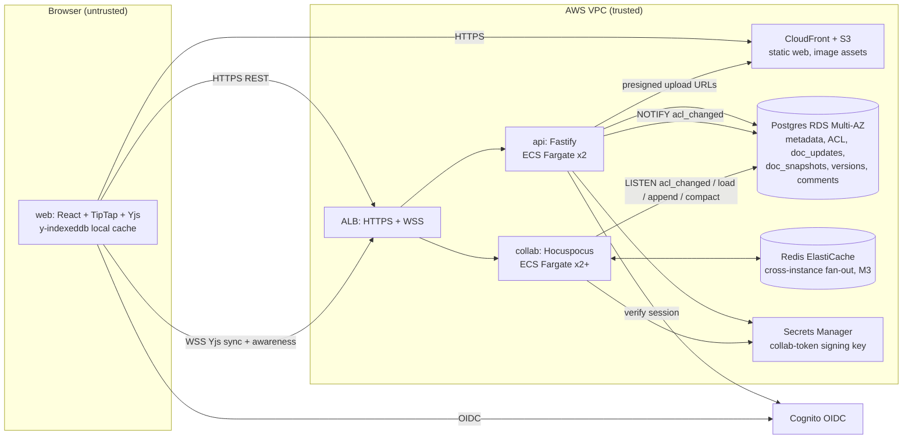

# Build plan: real-time collaborative document editor

> **Context.** The workspace has no code (its `README.md` says it is intentionally empty), and the request gave no scale, team, stack or compliance details. I didn't stop to ask. I wrote down assumptions, labelled **A1–A10**, and the plan rests on them. You asked about build order, so Sections 12–13 have the most detail. The other sections are short but complete.

---

## 1. Summary

- **What:** A browser-based rich-text editor where business teams edit the same document at the same time. It shows live cursors, has sharing permissions, comments and version history, and keeps working through short network drops. Think of a focused Google Docs for teams (A1).
- **Shape:** A React and TipTap editor in the browser. A **`collab`** WebSocket service, built on the open-source Yjs ecosystem (Hocuspocus), merges and relays edits. A separate **`api`** service handles login, documents, sharing and comments. Both store data in one Postgres database. Everything runs on AWS ECS Fargate.
- **Key decisions:**
  1. Edits are merged with a **CRDT (Yjs)**, not operational transformation. A CRDT is a data structure that lets copies edited separately merge automatically and end up identical.
  2. We build on **open-source Yjs, TipTap and Hocuspocus** instead of buying a managed collaboration service or writing a sync server from scratch.
  3. Documents are stored as an **append-only log of updates plus a compacted snapshot in Postgres**. Multiple servers can write to it safely.
  4. **"Saved" is a real guarantee.** The server tells each client which of its edits are committed to the database.
  5. **Two deployables, `api` and `collab`,** so that releasing the API doesn't disconnect everyone who is editing.
- **First milestone (about 4–5 weeks):** Two people log in and edit the same document in a deployed staging environment. Their edits survive a server crash. Three time-boxed spikes run in parallel: editor binding and merge correctness, the durability and "Saved" guarantee, and WebSocket behaviour on AWS.
- **Top risks:**
  - Silent data loss or copies that drift apart. This is the worst outcome possible.
  - Changes to the document schema deleting content on older clients.
  - Permission checks being skipped on the WebSocket path.
  - The team's lack of CRDT experience slowing everything down.

## 2. Context and Goals

- **Problem:** Teams now draft in files they email around or in tools that lock a document to one editor. Concurrent edits collide or overwrite each other, and nobody can trust which copy is current.
- **Goals:**
  - Several people edit one document at once and see each other's changes in under 250 ms.
  - No edit the UI reported as saved is ever lost.
  - Access control is enforced on every path.
  - Private beta in about 16 weeks (A5).
- **Non-goals for beta:** spreadsheets and slides, native mobile apps, full offline-first use (creating or browsing documents offline), suggestion or track-changes mode, public link sharing, SAML/SCIM, import and export, search, AI features, multi-region, end-to-end encryption.
- **Success measures:**
  - At least 5 beta workspaces active weekly.
  - Zero confirmed lost-edit incidents.
  - p95 time for an edit to reach other editors under 250 ms, measured in production by a synthetic probe.
  - At least 99.9% of minutes with the editing service available.

## 3. Drivers, Requirements, and Constraints

**Ranked quality attributes**

| # | Attribute | Measurable target | Why it matters |
|---|---|---|---|
| 1 | **Data integrity** | (a) All clients and the stored copy are byte-identical after merging, with 0 drift across 10,000 fuzz runs per night. (b) Recovery point is zero for any edit the UI showed as "Saved". (c) "Saved" appears within 2 s at p95 after typing stops. *(Assumption)* | Losing someone's writing destroys trust and can't be repaired afterwards. |
| 2 | **Access-control correctness** | No read or write without permission, checked on HTTP and WebSocket paths. Revoked access takes effect on live sessions within 5 s. *(Assumption)* | Documents hold business-confidential content (A6). |
| 3 | **Collaboration latency** | Local keystroke to screen under 16 ms and never waits on the network. Remote edit propagation under 250 ms p95 in-region, for documents with up to 20 editors. *(Assumption)* | This is what makes it feel "real-time". |
| 4 | **Time to market** | Private beta in about 16 weeks with 5 engineers (A3, A5). | Rules out building merge algorithms from scratch. |
| 5 | **Availability** | Editing available 99.9% monthly. A deploy or crash causes at most about 5 s of reconnecting and loses no edits. If `collab` goes down, users keep typing locally. *(Assumption)* | A CRDT lets us trade server uptime for client resilience. |

Cost comes after these. The target is under about $1,000/month at beta scale *(assumption)*.

**Key functional requirements that shape the structure:**
- Rich text: headings, lists, bold/italic/code, links, images, block quotes. Tables are a stretch goal.
- Live presence and cursors.
- Per-document roles: owner, editor, commenter, viewer.
- Comments anchored to text.
- Version history with restore.
- Edits made during a disconnect sync when the connection returns.

**Constraints (all assumed):**
- 5 engineers who are strong in TypeScript, React, Node and Postgres, with no CRDT experience (A3).
- AWS, single region (A4).
- No regulated data (A6).
- Managed OIDC identity (A8).

**Hard parts**

| Hard part | Why it's hard |
|---|---|
| H1. Merge correctness and editor binding | New to the team. Bugs show up as rare divergence that is hard to reproduce. |
| H2. Durability and "Saved" semantics | Yjs servers usually persist on a debounce, so a crash can lose the last few seconds unless the design closes that gap. |
| H3. Authorisation on long-lived WebSockets | Permissions change while connections stay open. Viewers must not be able to send edits even from a modified client. |
| H4. Document schema evolution | The document format is effectively permanent. y-prosemirror can **delete** content it can't map to an older client's schema *(to verify in S1)*. |
| H5. Running more than one `collab` instance | Fan-out between instances, multiple writers to the same document, compaction, and reconnect storms during deploys. |

## 4. Current State

The workspace is empty: no code, infrastructure, CI or data. No organisational platform, mandated vendors or existing identity provider were mentioned, so the plan uses AWS and managed services (A4, A8). It proposes this repository layout:

```
apps/web            React + Vite + TipTap client
apps/api            Fastify HTTP API
apps/collab         Hocuspocus WebSocket server
packages/doc-schema shared TipTap/ProseMirror schema + schema_version (used by web AND collab)
packages/protocol   shared types: collab-token claims, stateless message types
db/migrations       SQL migrations (node-pg-migrate)
infra/terraform     modules/ + envs/staging, envs/prod
tests/fuzz, tests/e2e (Playwright), tests/load
docs/adr            decision records
```

## 5. Assumptions and Open Questions

**Assumptions**

| ID | Assumption | Impact if wrong | How and when validated |
|---|---|---|---|
| A1 | B2B product. A workspace is the tenant boundary. One shared database with `workspace_id` on every row. | Consumer or public scale changes capacity, abuse and sharing models. | Product owner, week 1 |
| A2 | Up to 10k MAU, 1,000 documents open at once, 3,000 WebSocket connections. Usually 1–5 editors per document, capped at 50. | Higher scale brings doc-affinity routing and DB partitioning forward. | Product owner, week 1. Load test in M3 at 2×. |
| A3 | 5 engineers, strong in TypeScript and Node, new to CRDTs | Sizes are off. The buy option becomes more attractive. | Eng manager, week 1 |
| A4 | AWS, one region, no mandated stack | Swap ECS, RDS and Cognito for equivalents. The architecture stays the same. | Week 1 |
| A5 | Beta target about 16 weeks, no hard external date | Scope cuts come from Section 17. | Week 1 |
| A6 | Business-confidential data only. No HIPAA or PCI, no residency rules, no E2E encryption. | E2E encryption rules out server-side merging, snapshots and comments as designed. | Week 1 |
| A7 | "Offline" means surviving minutes to hours of disconnect in an open tab, plus tab close via IndexedDB | Full offline-first means extra work on local document lists and conflict UX. | Product owner, week 1 |
| A8 | Cognito with email and Google sign-in. SAML deferred. | Enterprise SSO for beta adds about 1–2 weeks. | Week 1 |
| A9 | 95% of documents under 50 pages. Hard limit 10 MB encoded (about 200 pages). | Large documents need lazy loading. | S1 measures load time. |
| A10 | MIT-licensed OSS (Yjs, TipTap core, Hocuspocus) is acceptable | Licence review could force a different editor. | Legal, week 1 |

**Open questions**

| Question | Owner | Default if no answer | Needed by |
|---|---|---|---|
| Would you pay for a managed collaboration service (e.g. Liveblocks or Tiptap Cloud) to save about 4–6 weeks? | Product/finance | No. Build on OSS (D2). | End of S1 (week 2) |
| Is suggestion or track-changes mode needed for beta? | Product | No | Before M2 schema freeze (week 6) |
| Are tables needed for beta? | Product | Stretch goal in M3 | Week 6 |
| Is enterprise SSO needed for beta tenants? | Sales | No | Week 8 |

## 6. Architecture Overview



**How the parts fit together.**

The browser keeps a full Yjs copy of each open document. Typing changes the local copy straight away and gets saved to IndexedDB. The resulting update goes over a WebSocket to `collab`.

`collab` does five things:
- applies the update to its in-memory copy of the document;
- relays it to other connected editors, and to other `collab` instances through Redis;
- appends merged batches to `doc_updates` in Postgres every 500 ms;
- tells clients which state is now committed;
- compacts the log into a snapshot from time to time.

`api` owns everything that isn't document content: users, workspaces, documents, permissions, comments, versions and uploads. It also issues short-lived **collab tokens**, which `collab` checks when a client connects. Permission changes reach live connections through Postgres `LISTEN/NOTIFY`.

**Component table**

| Component | Responsibility | Owns (writes) | Exposes | Technology | Key dependencies |
|---|---|---|---|---|---|
| `web` | Editing UI, local merging, offline cache, presence display | IndexedDB cache (client) | none | React, Vite, TipTap, Yjs, y-indexeddb, HocuspocusProvider | `api`, `collab`, Cognito |
| `api` | Auth sessions, workspaces, documents, sharing, comments, version list and restore requests, uploads, collab tokens | `users`, `workspaces`, `memberships`, `documents`, `document_permissions`, `comments`, `audit_events` | REST/JSON `/v1/...` | Node 20+, TypeScript, Fastify | Postgres, Cognito, S3, Secrets Manager |
| `collab` | Yjs sync, awareness (presence), persistence, compaction, auto-versions, read-only enforcement, revocation | `doc_updates`, `doc_snapshots`, `doc_versions` | WSS (Yjs sync protocol + stateless JSON messages), `/healthz` | Node, Hocuspocus, Yjs | Postgres, Redis (M3), Secrets Manager |
| `packages/doc-schema` | One definition of allowed document nodes and marks, plus `SCHEMA_VERSION` | none | npm workspace package | TipTap extensions | none |
| Postgres | System of record | none | none | RDS Postgres 16, Multi-AZ, PITR | none |
| Redis | Relays updates and awareness between `collab` instances. Not a store. | none | none | ElastiCache | Added in M3 |
| Scheduled jobs | Hard-deletes expired documents, purges old versions | Only rows already marked for deletion | none | `api` image run as an ECS scheduled task | Postgres |

## 7. Component Details

**`collab`, the core component.**
- *Does not:* store metadata or comments, or make its own permission decisions beyond checking tokens and re-reading the ACL after a revocation.
- *Interfaces:*
  - WSS at `wss://collab.<domain>/`.
  - The Yjs sync and awareness binary protocol, which is versioned by the library.
  - Our own stateless JSON messages defined in `packages/protocol`, with a `v` field: `persisted {sv}`, `access-changed {role}`, `reload-required {reason}`.
  - Expected load: up to 3,000 connections and up to about 1,000 merged writes per second (A2).
- *Internals:*
  - **Auth hook:** checks the JWT signature, expiry (5 min), that `doc_id` matches, and that `client_schema_version` is at least `documents.schema_version`. Viewers and commenters are marked read-only, so their sync updates are dropped and logged.
  - **Load hook:** reads `doc_snapshots` and every row in `doc_updates` for the document, ordered by `seq`, and applies them.
  - **Persistence extension:** described under Flow 2.
  - **Compaction:** runs when there are 500 or more update rows, or when the document is unloaded, under a Postgres advisory lock.
  - **Auto-version:** saves a full snapshot to `doc_versions` every 30 minutes of active editing.
  - **Limits:** messages up to 1 MB; documents up to 10 MB, after which they turn read-only and raise an alert; 100 connections per document; at most 50 updates per second per connection. Every decode or apply is wrapped in try/catch, and a bad message closes the connection.
- *Failure and recovery:* `collab` keeps no state that only it holds. If a task dies, clients reconnect through the ALB to any healthy task, which reloads from Postgres. The Yjs two-way state exchange then recovers any edits that weren't flushed (Flow 3). `/healthz` fails when the DB is unreachable or the event loop lag exceeds 200 ms.
- *Scaling:* Scale out on connections or CPU. Redis relays updates and presence across instances (M3). Several instances may hold the same document, which is safe because log appends are idempotent (Section 8).

**`api`.** Stateless Fastify service behind the ALB.
- Every handler resolves the caller's role through one function, `authorize(user, doc, action)`.
- Permission writes and `NOTIFY acl_changed` happen in the same transaction.
- Version restore loads the old snapshot into a temporary Y.Doc, takes its ProseMirror JSON, and asks `collab`, through a stateless admin message on an internal-only path, to replace the content as one forward edit. History is never rewritten.
- Failure: standard retries, with idempotency keys on POSTs that create things.

**`web`.**
- Local editing never waits on the network.
- Keeps an IndexedDB copy per document.
- The status indicator shows *Connected/Reconnecting/Offline* and *Saving…/Saved*. Saved means the server's `persisted.sv` covers this client's own Yjs `clientID` (Flow 2).
- Warns on `beforeunload` if there are unsaved edits.
- Handles `reload-required` by prompting the user to refresh.

## 8. Data Design

**Entities.** Every table carries `workspace_id` except `users`.

| Table | Key columns | Writer | Notes |
|---|---|---|---|
| `users` | id, oidc_sub (unique), email, name | api | Personal data: email and name |
| `workspaces`, `memberships` | workspace_id, user_id, role | api | Tenant boundary |
| `documents` | id, workspace_id, title, created_by, schema_version, deleted_at | api | Title is plain metadata, not edited collaboratively |
| `document_permissions` | document_id, principal_type (user/workspace), principal_id, role | api | Index (principal_id, document_id) |
| `doc_updates` | seq bigserial, document_id, update bytea, sv bytea, instance_id, contributor_ids uuid[], created_at | collab | Append-only. Index (document_id, seq). |
| `doc_snapshots` | document_id PK, state bytea, compacted_at | collab | Current compacted state |
| `doc_versions` | id, document_id, state bytea, created_at, created_by (null = auto), label | collab (auto), api (named labels) | Kept for 90 days, plus named versions |
| `comments` | id, document_id, thread_id, author_id, body, anchor_from bytea, anchor_to bytea (Yjs relative positions), resolved_at | api | Plain-text body, at most 10k characters |
| `audit_events` | actor, action, target, at | api, collab | Append-only |

**Consistency.**
- Document content is merged by the CRDT, so no transactions are needed across edits. Each `doc_updates` insert is atomic by itself.
- Each instance writes the **diff of its in-memory document since its own last persisted state vector**. That diff includes edits it received from other instances, so the same content can appear in two rows. Applying a Yjs update twice changes nothing, so duplicates only cost storage, and compaction removes them.
- **Compaction steps:** take an advisory lock on the document, read the snapshot and all update rows up to a maximum `seq` S, merge them, upsert the snapshot, and delete rows ≤ S, all in one transaction. Rows appended after S stay in place, which is correct because merge order doesn't matter.
- **Permissions and metadata** are ordinary relational data with ordinary transactions.

**Access patterns.**
- Load a document: one snapshot plus fewer than 500 rows.
- Hot write path: inserts on `doc_updates`, about 1 per second per actively edited document.
- List documents: `document_permissions` joined to `documents` by principal.

**Retention, deletion, backup.**
- Soft delete, then hard delete of every row for the document after 30 days by the scheduled job.
- Hard delete of a user's documents when their account is deleted.
- RDS point-in-time recovery for 14 days, with a 5-minute recovery point for server-side storage loss and a 1-hour restore target.
- After a restore, clients that were online push back newer edits automatically. That's a CRDT property, verified in M3.
- One restore drill before beta.

**Classification.**
- Document content and comments are confidential. They are encrypted at rest (RDS KMS), **never logged**, and never included in metrics or error reports.
- Email addresses are masked in logs.

**Schema evolution.**
- SQL changes are expand-then-contract (add, backfill, switch reads, remove) through `db/migrations`. CI runs them up and down.
- **Document schema changes** (`packages/doc-schema`) are additive only. Readers ship one release before writers. `documents.schema_version` is raised only when new node types are first written, and the `collab` auth hook rejects older clients with `reload-required`. This handles H4.

## 9. Key Flows

**Flow 1: open a document and join the session**
1. `web` calls `GET /v1/documents/:id`. `api` checks `authorize(view)` and returns metadata and the role.
2. `web` calls `POST /v1/documents/:id/collab-token`. `api` returns a JWT signed with the Secrets Manager key, containing `{doc_id, user_id, role, workspace_id, exp: 5m}`.
3. `web` loads the IndexedDB copy if one exists, so the content renders instantly. It then opens a WSS connection with the token and its `client_schema_version`.
4. `collab` checks the token and schema version and sets read-only for viewers and commenters. It loads the document from memory, or from Postgres if it isn't loaded yet.
5. Two-way sync exchange (each side sends what the other lacks), then presence starts. Remote cursors appear.

**Flow 2: concurrent edits and "Saved"**
1. Alice types. TipTap applies the change locally in under 16 ms. Yjs produces an update, which y-indexeddb stores and the provider sends.
2. `collab` applies it and broadcasts to Bob, who sees it in under 250 ms. Each `collab` instance holding the document marks it as changed.
3. Every 500 ms while changed, the instance captures `diff = encodeStateAsUpdate(doc, lastPersistedSV)` and `sv = encodeStateVector(doc)`, then inserts them into `doc_updates`.
4. After the commit, it sends `persisted {sv}` to the document's connections.
5. Alice's client compares `sv[myClientID]` with its own local clock. If the server has caught up, the indicator shows **Saved**.

**Flow 3 (failure path): `collab` task crashes during typing**
1. Alice's last 400 ms of edits were broadcast to Bob but not yet flushed when `collab-1` is killed. Alice still sees **Saving…**.
2. The WebSocket closes, or a missed ping is detected within 30 s for half-open connections. The provider reconnects with 0.5–2 s jittered backoff through the ALB to `collab-2`. If the token has expired it fetches a new one first.
3. `collab-2` loads from Postgres without the missing 400 ms. During the sync exchange, Alice's client sends the updates the server lacks, and so does Bob's.
4. `collab-2` flushes and sends `persisted`. Alice sees **Saved**. Nothing is lost.
5. The remaining exposure: Alice closes the tab *and* IndexedDB isn't available (private browsing) within that window, *and* no other editor received the edits. The `beforeunload` warning and the "Saving…" state make this visible. We accept this risk.
6. Postgres unavailable: `collab` keeps editing in memory with retries, "Saved" stops advancing, an alert fires once the oldest unsaved change is more than 10 s old, and new document loads fail with a retryable error.

**Flow 4: access revoked during an editing session**
1. The owner downgrades Bob to viewer. `api` commits the permission change and `NOTIFY acl_changed {doc_id, user_id}` in one transaction.
2. Every `collab` instance listening on that channel finds Bob's connections, re-reads his role from the DB, and switches them to read-only with `access-changed {role:viewer}`. If he has no access at all, it closes them with code 4403.
3. Target: within 5 s. A backstop re-checks every connection's role every 10 minutes in case a notification is missed while an instance reconnects to the DB.

## 10. Key Decisions

| # | Decision | Options considered | Rationale (drivers) | Reversibility | Revisit if |
|---|---|---|---|---|---|
| D1 | Merge with **Yjs CRDT** | OT (ShareDB); Automerge; Yjs | Integrity: mature and widely used. Latency: merges locally. Offline: merges without a central server. Time to market: we don't implement the algorithm. OT needs a single ordering server per document and makes offline harder. | **Hard** (stored format) | S1 finds divergence or performance problems we can't fix |
| D2 | **Build on OSS (Hocuspocus)** | Managed (Liveblocks, Tiptap Cloud); a custom server on y-protocols; Hocuspocus | Fits the team's stack. Already has auth and storage hooks and a Redis extension. No per-connection vendor cost. Data stays in our DB. Managed would save about 4–6 weeks but ties our content storage to a vendor. | Medium | S2 shows the hooks can't support the persisted-ack design (then write a custom server, +2–3 weeks), or the business prefers to buy |
| D3 | **TipTap (ProseMirror)** editor | Lexical (+Yjs); Slate; TipTap | Strongest Yjs binding (y-prosemirror), a strict schema that helps H4, and a large extension ecosystem | **Hard** (schema shape) | S1 measures over 16 ms keystroke latency or a broken undo experience |
| D4 | **Append-only update log + compacted snapshot in Postgres** | One blob overwritten on debounce; S3 objects; append-log | Integrity: safe with multiple writers and makes the persisted-ack possible. Uses the one DB the team knows. | Medium | Update row volume degrades DB p95, or total version storage passes about 100 GB (move snapshots and versions to S3) |
| D5 | **Two deployables, `api` and `collab`** | One process; two | Availability: API releases don't drop editing sessions. Long-lived sockets scale differently from request/response. | Easy | Never mind |
| D6 | **Redis relay between instances, any instance may hold a document** (M3) | Route each document to one instance with consistent hashing; Redis relay | Simpler routing. The ALB needs no affinity. D4 already makes multiple writers safe. | Medium | Redis relay latency pushes p95 past 250 ms, or very hot documents need affinity |
| D7 | **Comments in Postgres via `api`, anchored with Yjs relative positions** | Comments inside the Y.Doc; Postgres | Access control: commenters never write to document content. Comments can be queried for notifications. | Medium | Comment anchoring breaks often during heavy concurrent editing |
| D8 | **Versions as periodic full snapshots; restore as a forward edit** | Yjs snapshots with garbage collection off; full snapshots | Keeping garbage collection lets documents stay small. Restore doesn't rewrite history, so it's safe for live collaborators. | Medium | Users need per-keystroke history or blame |
| D9 | **AWS ECS Fargate + RDS + Terraform + GitHub Actions** | Kubernetes; Fly/Render; ECS | Low operational load for 5 engineers, and managed Postgres with point-in-time recovery | Easy–medium | The organisation already runs a different platform |

## 11. Cross-Cutting Concerns

- **Security (M1 skeleton, M2 complete, M4 review).**
  - Cognito OIDC, with the session in an httpOnly, SameSite=Lax cookie.
  - Collab JWTs last 5 minutes and are signed with a key from Secrets Manager, rotated quarterly with a two-key overlap.
  - Every query includes `workspace_id`.
  - Threats and mitigations:
    1. *Connecting to a document you can't access:* token tied to `doc_id`, tested in the auth test matrix.
    2. *A viewer sending edits from a modified client:* server-side read-only enforcement plus an audit event.
    3. *Malformed or oversized updates crashing or flooding `collab`:* size, rate and connection caps, try/catch, and a fuzz test feeding random bytes into the decoder.
    4. *XSS through content or links:* rendering only through the ProseMirror schema, an `http/https/mailto` allowlist for link targets, a strict CSP, and images served only from our CloudFront host.
    5. *Cross-tenant leaks:* authorisation tests on every endpoint and role.
  - Dependency scanning (`pnpm audit` plus Dependabot) and image scanning (ECR) run in CI.
- **Reliability (M1–M3).**
  - Targets are in Section 3.
  - Multi-AZ RDS. At least two tasks each for `api` and `collab`.
  - Reconnect uses jittered exponential backoff capped at 10 s, which prevents a stampede after a deploy.
  - Persistence retries with backoff and alerts.
  - Idempotency comes from the CRDT for content and from idempotency keys for REST creates.
- **Observability (M1 baseline, M3 alerts and dashboards).**
  - pino JSON logs with `conn_id`, `doc_id` and `user_id`, never content.
  - OpenTelemetry metrics to CloudWatch: `ws_connections`, `docs_loaded`, `update_apply_ms`, `persist_flush_ms`, `unpersisted_age_seconds`, `reconnects_total`, `readonly_rejects_total`, `acl_revoke_latency_ms`.
  - A **synthetic probe** of two headless Yjs clients editing a canary document every minute measures propagation p95 and the full save cycle.
  - Alerts, each linked to a runbook in `docs/runbooks/`:
    - `unpersisted_age_seconds` over 10 s;
    - probe p95 over 500 ms for 10 minutes;
    - probe failing to save;
    - `collab` healthy tasks fewer than 2.
- **Performance and capacity (M3).**
  - Expected bottlenecks: Node event loop on hot documents, DB insert rate, and memory (about 1,000 documents × roughly 1 MB in memory, so 2 GB tasks).
  - `tests/load` is a Node generator driving real Yjs clients. It runs from ECS at 2× A2: 6,000 connections, 2,000 documents, 20 editors on 10 hot documents.
- **Cost.** Roughly $600–1,000/month for prod plus staging at beta: RDS Multi-AZ about $250–400, Fargate about $150–250, ElastiCache about $50–100, ALB, CloudFront and CloudWatch about $100. Main drivers are RDS size and IOPS from `doc_updates`. Controls: AWS Budgets alerts at 80%, cost-allocation tags per environment, and the compaction threshold.
- **Operations (M4).** The team owns on-call through business-hours paging during beta, with runbooks for: DB failover, `collab` crash loop, stuck compaction, a document exceeding the size cap, rotating the token key, and restoring a document from a version or point-in-time recovery.
- **AI-specific concerns.** Not applicable. There are no AI components in scope.

## 12. Build Sequence

Team assumption: 5 engineers (2 frontend-leaning, 2 backend, 1 backend/infra). Sizes are rough guides, not commitments. The **critical path is marked ★**.

```
Week:     1   2   3   4   5 | 6   7   8   9 |10  11  12  13 |14  15  16
M1  ★ S1 editor/CRDT ─┐
    ★ S2 durability ──┼─★ thin slice e2e on staging
      S3 WS infra ────┘   infra/CI/auth (parallel from day 1)
M2                        ★ ACL on WS + revocation ★ schema freeze, presence, offline, docs UI
M3                                        ★ multi-instance+Redis, compaction ★ load test; comments, versions (parallel)
M4                                                          security review, rollout tooling, beta
```

| Milestone | Goal / risk cleared | Scope (in / out) | Deliverables | Exit criteria (checkable) | Depends on | Rough size |
|---|---|---|---|---|---|---|
| **M1: Walking skeleton + spikes** | Clears H1 and H2. Shows the full path (browser → `collab` → Postgres → other browser) through the real pipeline. | **In:** login, create a document, open it by URL, edit together, persist, survive a crash. Single `collab` instance. **Stubbed:** one auto-created workspace, everyone in it is an editor, no document list, basic formatting only. **Out:** comments, versions, sharing UI. | Repo and CI. Terraform staging. `api` with auth and collab token. `collab` with the persisted-ack extension. `web` editor. Fuzz harness. Playwright two-user e2e. ADRs D1–D4. Spike reports S1–S3. | (1) Two users on staging see each other's edits. (2) The e2e test kills the `collab` task during typing, and all text is present after reconnect. (3) Fuzz: 1,000 runs, 0 divergence. (4) A merge to `main` deploys to staging automatically. (5) Spike results recorded and D1–D3 confirmed or changed. | None | 4–5 weeks |
| **M2: Real documents, real permissions** | Clears H3 and H4. Internal dogfooding begins. | **In:** document list, create/rename/delete, sharing with 4 roles, read-only enforcement, revocation, presence and cursors, IndexedDB offline, "Saved" indicator UX, full MVP schema frozen with `SCHEMA_VERSION`, image upload, prod environment. **Out:** multiple instances, comments, versions. | Authorisation layer and test matrix. NOTIFY-based revocation. Schema-version gate. Prod Terraform. | (1) Auth matrix (role × endpoint × WS action) passes in CI. (2) Revocation e2e: under 5 s. (3) A modified client sending edits as a viewer is rejected and audited. (4) Old-schema client test gets `reload-required` and no content is deleted. (5) Team uses it daily for 1 week. | M1 | 3–4 weeks |
| **M3: Scale, resilience, collaboration features** | Clears H5. Proves the Section 3 targets under load. | **In:** 2+ `collab` instances with Redis, compaction, auto-versions and restore, comments with anchors, alerts and dashboards, synthetic probe, restore drill. Tables if approved. **Out:** suggestion mode, search, export. | Load-test report. Runbooks. Version and comment UI. | (1) Load test at 2× A2: propagation p95 under 250 ms, save p95 under 2 s, 0 divergence. (2) Rolling `collab` deploy under load: reconnect p95 under 5 s, no lost edits. (3) Point-in-time restore drill done and timed. (4) Each alert fires on a staged fault. | M2 (Redis work can start in week 8) | 3–5 weeks |
| **M4: Beta hardening and rollout** | Ready for external users | **In:** external security review, per-connection rate limits verified, account and document deletion jobs, per-workspace feature flags, beta onboarding, on-call rota. | Review findings closed. Beta workspaces enabled. | (1) No open high or critical findings. (2) 5 beta workspaces enabled. (3) 2 weeks with no lost-edit incidents and SLOs met. | M3; review booked in week 1 | 2–3 weeks |

The total is about **12–17 weeks**. Parallel tracks that are off the critical path:
- Infra, CI and auth (M1).
- Document list and sharing UI (M2).
- Comments and versions UI, which can be built against the `api` contract while multi-instance work proceeds (M3).

## 13. First Milestone Task Breakdown

**Day 1, parallel. Long-lead items:**
- **T0.** Request the AWS accounts (staging and prod), domain and TLS certificates (ACM), the Cognito user pool and Google OAuth app, and an external security review slot for about week 13. Get licence sign-off for Yjs, TipTap core and Hocuspocus (A10). *Done when* each has a ticket with an owner, and the accounts and domain are usable by day 5.

**Week 1, parallel.**
- **T1.** Create the pnpm monorepo with the Section 4 layout: TypeScript strict, ESLint, Vitest, and `.github/workflows/ci.yml` running lint, typecheck, test and `node-pg-migrate up/down` against a Postgres 16 service container. *Done when* CI is green on `main` and a deliberate type error fails a PR.
- **T2.** Write `infra/terraform/envs/staging`: VPC (2 AZs), RDS Postgres 16, ECS cluster, ECR repos for `api` and `collab`, ALB with HTTPS, a WSS listener rule for `collab.<domain>`, 300 s idle timeout and 30 s deregistration delay, S3 and CloudFront for `web`, and Secrets Manager entries. Use remote state in S3 with locking. *Done when* `terraform plan` runs in CI and `apply` through the pipeline creates the environment from scratch.
- **T3 (Spike S1: editor and merge correctness; time box 4 days; `spikes/editor-binding/`).**
  - *Question:* Do TipTap, y-prosemirror and Hocuspocus converge correctly, with acceptable undo, keystroke latency and load time for our formatting set? What does y-prosemirror do with nodes not in the schema?
  - *Build:* a prototype with 10 simulated remote editors, plus a 100-page generated document.
  - *Changes the plan if:* we find divergence not caused by our code, keystroke p95 over 16 ms, 100-page load over 2 s, or confirm that y-prosemirror deletes unknown nodes. The last outcome makes the M2 schema-version gate mandatory, and the plan already assumes that.
- **T4 (Spike S2: durability and "Saved"; time box 3 days; `spikes/persistence/`).**
  - *Question:* Can a Hocuspocus extension flush `encodeStateAsUpdate(doc, lastPersistedSV)` every 500 ms, send `persisted {sv}` after commit, and survive `kill -9` with no loss after reconnect?
  - *Build:* the extension plus a crash script.
  - *Changes the plan if:* the hooks can't send acks after commit, or can't flush on our own timer. Then we drop Hocuspocus and write a server on y-protocols (+2–3 weeks to M1, and D2 is revised).
- **T5 (Spike S3: WebSocket on AWS; time box 3 days; staging from T2, otherwise a temporary stack).**
  - *Question:* Do ALB and Fargate rolling deploys drain sockets cleanly? Do 3,000 clients reconnect within 10 s without overloading the DB?
  - *Changes the plan if:* reconnect p95 is over 5 s or the ALB drops connections unexpectedly. Then evaluate an NLB, longer draining, or client-side staggered reconnect.

**Weeks 2–3** (T6–T9 parallel after T1; T8 and T9 take their design from T4).
- **T6.** Add `db/migrations/001_core.sql`: `users`, `workspaces`, `memberships`, `documents`, `doc_updates`, `doc_snapshots`, with the indexes from Section 8. *Done when* it applies and rolls back cleanly in CI.
- **T7.** Implement in `apps/api`:
  - Cognito OIDC login and session;
  - `POST /v1/documents`, `GET /v1/documents/:id`, `POST /v1/documents/:id/collab-token` (claims defined in `packages/protocol`);
  - the `authorize()` stub (workspace member = editor).
  *Done when* integration tests cover login, the 401 path, and token claims and expiry.
- **T8.** Implement in `apps/collab`:
  - an auth hook (check JWT and `doc_id`);
  - load from snapshot plus updates;
  - the persistence extension from S2;
  - `/healthz` (DB ping, event-loop lag);
  - message size and document size limits.
  *Done when* a Vitest integration test using real Yjs clients against a real Postgres passes: connect, edit, restart the server, and the content matches.
- **T9.** Build in `apps/web`:
  - login, a "New document" button, and the `/d/:id` route;
  - a TipTap editor using `packages/doc-schema` (StarterKit subset plus links);
  - HocuspocusProvider that fetches a token on every connect;
  - y-indexeddb;
  - indicators for connection state and Saving/Saved.
  *Done when* two local browsers edit together against a local stack via `docker compose up`.
- **T10.** Create `tests/fuzz/convergence.test.ts`. It runs N Yjs clients through a real `collab` with random inserts, deletes and formatting, random disconnects and a server restart. It asserts that every client and the reloaded copy from Postgres are byte-identical. *Done when* the N=20/200-op version runs on every PR and the N=50/10k-op version runs nightly.

**Weeks 3–5** (after T2, T7, T8 and T9).
- **T11.** Add `.github/workflows/deploy-staging.yml`: build images, push to ECR, run migrations, ECS rolling deploy, upload `web` to S3 and invalidate CloudFront, then run smoke e2e. *Done when* a merge to `main` is live on staging in under 15 minutes with no manual steps.
- **T12.** Write `tests/e2e/collab.spec.ts` (Playwright, two browser contexts):
  - A types and B sees it within 1 s;
  - the `collab` task is stopped through the AWS API while A is typing, and after reconnect all of A's text is present and "Saved" shows.
  *Done when* it passes against staging three times in a row.
- **T13.** Set up the observability baseline: pino logs with `conn_id` and `doc_id`, OTel metrics (`ws_connections`, `persist_flush_ms`, `unpersisted_age_seconds`, `reconnects_total`) to CloudWatch, and one alarm on `unpersisted_age_seconds` over 10 s. *Done when* pausing DB access in staging (security group change) triggers the alarm.
- **T14.** Write `docs/adr/001–004` for D1–D4, updated with the spike results, then run the M1 demo. *Done when* the M1 exit criteria in Section 12 are checked off.

## 14. Testing and Validation Strategy

| Risk | Test type | Where and when |
|---|---|---|
| Copies drifting apart (H1) | Fuzz/property tests with real Yjs clients through a real server | `tests/fuzz`: small on each PR, large nightly. **Blocks release.** |
| Lost edits (H2) | Crash-injection e2e; DB-outage test with toxiproxy | `tests/e2e`, `tests/fuzz`. Staging on each deploy (M1). |
| Authorisation gaps (H3) | Matrix tests: role × REST endpoint × WS action, including a modified client sending edits as a viewer | `apps/api`, `apps/collab` integration tests. **Blocks release** (M2). |
| Schema evolution (H4) | Old-client/new-schema compatibility test using the previous release's `doc-schema` package | CI (M2) |
| Multi-instance and load (H5) | `tests/load` Yjs load generator at 2× A2; rolling deploy under load | Staging before M3 exit and before each `collab` major change |
| Logic | Unit tests (Vitest) | Every PR |
| Security | Dependency and image scanning; external review | CI; M4 |

Test data is synthetic, generated documents of 1, 50 and 200 pages. Production content is never copied. Section 3 targets are verified as follows:
- **Latency and "Saved":** load-test report plus the production synthetic probe.
- **Revocation:** e2e timer.
- **Availability:** probe uptime.
- **Zero divergence:** the nightly fuzz count.

## 15. Rollout, Migration, and Rollback

- **Rollout:**
  - Internal dogfooding from M2.
  - Beta through a per-workspace feature flag (a `workspaces.flags` column checked by `api` and `web`).
  - Then 5 beta workspaces in M4, with expansion by invitation.
- **Migration:** Not applicable. This is a new build with no existing data. Import is deferred.
- **Rollback:**
  - App rollback is ECS redeploying the previous task definition, under 10 minutes.
  - SQL migrations are expand-then-contract, so old code always runs against the new schema.
  - **Point of no return:** once a new document node type has been written into real documents, rolling back to a client that can't read it is not allowed. That client could delete the content. Mitigation: readers ship one release before writers, and `collab` rejects older clients with `reload-required`.
  - Per-document recovery is possible through `doc_versions` or point-in-time recovery.

## 16. Risks and Mitigations

| Risk | Likelihood | Impact | Mitigation | Early warning | Owner |
|---|---|---|---|---|---|
| Silent drift or lost edits | Medium | Critical | D4 append log, persisted-ack, fuzz and crash tests, IndexedDB | Nightly fuzz failures; `unpersisted_age_seconds` alerts | Collab lead |
| Schema change deletes content on old clients | Medium | High | Schema-version gate, readers before writers, compatibility test | S1 confirms the deletion behaviour | Frontend lead |
| Revocation misses live sessions | Low–Med | High | NOTIFY in the same transaction, 10-minute backstop re-check, matrix tests | `acl_revoke_latency_ms` over 5 s | Backend lead |
| Team's lack of CRDT experience slows M1 | Medium | Medium | Spikes up front, reliance on mature libraries, buy option kept open (D2) | S1 or S2 overrun their time box | Eng manager |
| Hocuspocus limitations force a custom server | Low–Med | Medium (+2–3 weeks) | S2 decides this in week 1 | S2 result | Collab lead |
| `doc_updates` write load degrades the DB | Low | Medium | 500 ms batching, compaction, load test, move to S3 or larger instance | DB p95 write over 20 ms | Infra |
| Reconnect storm after a deploy or crash | Medium | Medium | Jittered backoff, staggered draining, S3 spike | Spikes in `reconnects_total` after deploys | Infra |
| Scope creep (tables, suggestion mode) | High | Medium | Schema freeze in week 6, deferred list | New node requests after week 6 | Product |
| Security review slot unavailable | Medium | Medium | Book in week 1 (T0) | No confirmation by week 4 | Eng manager |

## 17. Deferred Work and Future Evolution

| Deferred | Trigger to build |
|---|---|
| Suggestion / track-changes mode | Beta feedback. Needs its own spike because it is an established hard problem on top of CRDTs. |
| Search | More than about 50 documents per user. A worker extracts text from snapshots into Postgres FTS. |
| Import/export (DOCX, PDF, Markdown) | Beta requests. Server-side conversion from snapshots. |
| Public link sharing | Customer demand. Needs abuse controls. |
| SAML/SCIM | First enterprise deal |
| Per-character attribution / blame | Customer demand. Would need `gc:false` or per-user update rows (revisit D8). |
| Doc-affinity routing, multi-region | Hot documents or latency data beyond A2 (revisit D6) |
| Moving snapshots and versions to S3 | DB storage over about 100 GB |
| Mobile apps | Product decision |

**Deliberate shortcuts:**
- Comment bodies are plain text. Rich comments come later.
- Document titles are not edited collaboratively.
- Scheduled jobs live in the `api` image. They get their own worker when job count or runtime grows.

**Extension points:**
- `packages/doc-schema` for new nodes.
- Stateless messages in `packages/protocol` for new real-time signals.
- The snapshot store for derived features like search and export.

## 18. Next Steps

1. **Today:** Confirm or correct the assumptions, especially A2 (scale), A3 (team), A6 (no E2E encryption) and A7 (offline scope). Answer the buy-vs-build question (D2).
2. **Today:** Start T0's long-lead requests: AWS accounts, domain and certificates, Cognito, the security review slot, and licence sign-off.
3. **Day 1–2:** One engineer does T1 (`pnpm init`, workspace layout, `ci.yml`). Another starts T2 (`infra/terraform/envs/staging`).
4. **Day 1–5:** Two engineers start Spikes S1 (`spikes/editor-binding/`) and S2 (`spikes/persistence/`). Hold a decision review on day 5 to confirm or revise D1–D3.
5. **Week 2:** Run S3 against staging and begin T6–T9 against the S2 design.

---

### Open questions where your answer changes the plan most

1. **Buy or build the collaboration layer?** A managed service (Liveblocks or Tiptap Cloud) cuts about 4–6 weeks and removes H2 and H5 from our hands. The cost is per-connection pricing and a vendor holding the document data. *Default: build on OSS.*
2. **What scale and audience?** The plan assumes up to 10k MAU in B2B workspaces. Consumer or public scale, or documents with hundreds of editors, changes routing, abuse controls and capacity.
3. **Is end-to-end encryption or data residency required?** Either one changes the design at the root, because the server could no longer read content to merge, snapshot or anchor comments.
4. **What does "offline" mean?** Surviving drops in an open tab is in the plan. Full offline-first (creating and browsing documents offline) adds most of a milestone.
5. **Is suggestion or track-changes mode needed for beta?** It's the most likely late scope addition, and it would need its own spike before the schema freeze in week 6.
